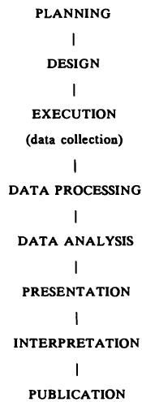

# 1 医学研究中的统计学
# 1 Statistics in medical research

一想到统计学，那个穿行于混乱的官邸花园的收藏家，便感到心头涌起一阵喜悦……因为统计学不正是对混沌宇宙的秩序化吗？统计学是给无知和迷信的暴徒戴上的镣铐，这些暴徒在偏僻小路上扼杀了真相。J. G. Farrell，《克里希纳普尔之围》
At the thought of statistics, the Collector, walking through the chaotic Residency garden, felt his heart quicken with joy…. For what were statistics but the ordering of a chaotic universe？ Statistics were the leg- irons to be clapped on the thugs of ignorance and superstition which strangled Truth in lonely byways.J. G. Farrell, The Siege of Krishnapur

J.G.Farrell，《克里希纳普尔之围》
J.G.Farrell, The Siege of Krishnapur

## 1.1 广义统计学
## 1.1 STATISTICS AT LARGE

我们前所未有地被统计数据轰炸。报纸上充斥着大量的统计信息，涉及贸易和工业、金融、（失）就业、道路交通事故数据等等，并且频繁发布民意调查和问卷调查结果。以这种方式呈现的统计数据可靠性各异。尽管政治民意调查采用相对可靠的方法进行，但大多数调查都是基于向一些方便的人群提问，而没有考虑其代表性。它们甚至可能基于自愿提供的信息，例如电话投票。
We are bombarded with statistics to an unprecedented degree. Newspapers contain a wealth of statistical information, relating to trade and industry, finance, (un)employment, road accident figures and the like, and there are frequent results of opinion polls and surveys. Statistics presented in this way are of varying reliability. While political opinion polls are performed with reasonably reliable methods, most surveys are based on asking questions of some convenient group of people, with no concern for their representativeness. They may even be based on volunteered information, as in phone- in polls.

媒体中也常见医学研究报告。研究结果通常基于可靠的方法学，但由于结果可能以类似方式呈现，其可靠性上的区别并未被广泛认知。例如，报纸会以相似的措辞报道一项关于在沙门氏菌担忧下对鸡蛋消费态度的民意调查结果，以及一项调查避孕药使用与乳腺癌风险之间关系的流行病学研究结果。许多医学问题实际上过于复杂，无法在报纸或电视上的短篇报道中充分处理。诸如核电站周围儿童白血病发病率升高的可能性，或饮用水加氟的致癌效应等话题，需要深入考虑许多复杂问题。氟化物争议的复杂性可从一个法庭案件持续201天的事实中判断，其中大部分证据是统计数据（Oldham，1985）。
It is also common to see reports of medical research in the media. Research findings are usually based on sound methodology, but as the results may be presented in a like manner the distinction in reliability is not widely perceived. For example, newspapers will report in similar terms the findings of a poll about attitudes to consumption of eggs in the light of worries about salmonella and also the results of an epidemiological study investigating the relation between use of the contraceptive pill and risk of breast cancer. Many medical issues are really too complex to be dealt with adequately in a short item in a newspaper or on television. Topics such as the possibility of raised rates of childhood leukaemia around nuclear power stations or the carcinogenic effect of adding fluoride to drinking water require an in- depth consideration of many complicated issues. The complexity of the fluoride debate may be judged by the fact that a court case lasted 201 days, with much of the evidence being statistical (Oldham, 1985).

“研究”一词具有强大的内涵，隐含着可靠性。相关领域之外的人很少关心研究是如何进行的，只关心发现了什么。我最近看到的一则广告就利用了这一弱点。该公司通过开篇评论“研究表明，一份精心呈现的文档有 $95\%$ 的更高几率被认真阅读并广受欢迎”来支持其桌面装订系统的推广。我怀疑是否进行过此类研究，甚至是否可能进行，但研究的力量被成功地援引了。
The word 'research' has powerful connotations, with reliability being implicit. Few people outside the relevant field are concerned about how the research was done, only about what was found. One recent advertisement I have seen makes use of this weakness. The company supports its promotion of desk top binding systems with the opening comment that 'Research shows that a well presented document stands a  $95\%$  better chance of being properly read and well received'. I doubt whether any such research had been carried out, or even if it could be, but the power of research is successfully invoked.

与这种无稽之谈截然相反的是以下摘自一份报纸报道（《卫报》，1986年8月23日）的医学期刊论文节选：
At the other extreme from this piece of nonsense is the following excerpt from a newspaper report (Guardian, 23 August 1986) of a paper in a medical journal:

> **心脏病风险评分系统**
> **Score system for heart risk**
>
> 昨天宣布，医生们已经设计出一种廉价的“速算器”，用于识别心脏病高风险男性。昂贵的心电图检查和血液胆固醇水平测量可以被一个简单的评分系统取代。该系统可以识别出未来五年内可能发生心脏病发作的男性中一半以上的人，然后可以建议他们采取更健康的生活方式或提供治疗。……该系统需要测量血压，估算吸烟年数，了解是否有心绞痛、心脏病发作或糖尿病史，以及父母中是否有因心脏病去世的。
> A cheap 'ready reckoner' for identifying men at high risk of a heart attack has been devised by doctors it was announced yesterday. Expensive electrocardiograph tests and measurements of blood cholesterol levels can be supplanted by a simple scoring system. The system can identify more than half of the men likely to have a heart attack over the next five years, who can then be advised to adopt a healthier lifestyle or offered treatment. … The system requires measurement of blood pressure, an estimate of the number of years of cigarette smoking, knowledge of previous angina, heart attack or diabetes, and whether either parent died of heart trouble.

显然，这项研究对成千上万的男性来说具有潜在的价值。这些结果可靠吗？这个“速算器”是如何设计的？当然，我们不会期望从一篇简短的报纸文章中获得这些信息，但没有提供关于研究如何进行的信息这一事实，可能使得这项研究的可靠性并不比同一报纸中报道的任何其他统计数据更高。
Clearly this study is potentially valuable to thousands of men. Are these results reliable and how was the 'ready reckoner' devised？ Of course we would not expect to obtain this information from a short newspaper article, but the fact that no information is given about how the study was performed may put it in no better light than any other statistics reported in the same newspaper.

另一个例子来自一篇报纸文章（《卫报》，1988年5月19日），该文章报道了一项关于寿命与左撇子之间关系的研究：
Another example is given by a newspaper article (Guardian, 19 May 1988) reporting a study of the relation between longevity and left- handedness:

> **科学家称，老左撇子所剩无几**
> **Not many old hands left, says scientist**
>
> 如果你年过80且是左撇子，那你就是独一无二的。几乎所有其他的左撇子都已离世……哈尔彭博士昨晚说，这是一个小样本。总的来说，科学家们发现，在33岁之前，死亡率没有差异；从那时起，左撇子们慢慢地消逝。
> If you're over 80 and left-handed, you're in a class of your own. Nearly all the other left-handers have passed on… It was, said Dr Halpern last night, a small sample. Generally the scientists found that there was no difference in death rates up till the age of 33; from then the left-handed slowly fade away.
>
> 她提出了几个原因。一个可能是低体重婴儿倾向于左撇子，而低出生体重可能意味着生存机会减少。另一个原因是这是一个右撇子的世界。左撇子在汽车和电动工具方面处于劣势，承受更大的压力，并有更多的事故。
> She offered several reasons. One might be that low-weight babies tended to be left-handed, and low birthweight might mean reduced chances of survival. The other was that it was a right-handed world. The left-handed were simply at a disadvantage with automobiles and power tools, suffered from greater stress and had more accidents.

我将在第5章解释为什么这项研究结果的解释是无效的。目前我只想指出，这项研究结果被不加批判地报道，并且最后一节包含未经证实的推测，这些推测甚至没有出现在出版物中（Halpern and Coren, 1988）。报纸读者无法区分这两篇报纸报道中信息的可靠性。然而，正是科学标准的差异，以及研究结果的有效性，助长了医学研究中的争议。这些争议常常影响日常生活，以至于公众对许多食物和药物可能产生的不良健康影响感到困惑（Feinstein, 1988）。
I shall explain in Chapter 5 why the interpretation of the results from this study is not valid. For the moment I shall just note that the study findings are reported uncritically, and the last paragraph contains unsupported speculations which do not even appear in the publication (Halpern and Coren, 1988). There is no way that readers of the newspaper could distinguish the reliability of the information in the two newspaper reports. Yet it is variation in scientific standards, and hence the validity of research findings, that fuels controversies in medical research. These often impinge on daily life, such that the public becomes confused about possible adverse health effects of numerous foods and drugs (Feinstein, 1988).

通常，重点放在结果上（这些结果被呈现为事实），而很少或根本不考虑其获取方式，这可能就是为什么统计学这门学科被广泛认为只与数据分析和数值结果的呈现有关。虽然这些是统计学的重要组成部分，但除此之外还有很多。特别是，数据是如何以及为何收集的至关重要。
In general the emphasis is on results (which are presented as facts), with little or no regard to the manner in which they were obtained, which is probably why the subject of statistics is widely seen as relating solely to the analysis of data and the presentation of numerical results. While these are important parts of statistics, there is much else besides. In particular, how and why the data were collected are supremely important.

人们普遍认为统计学（或许也包括统计学家）是不可信的，这体现在“你可以用统计学证明任何事情”的观念中。这种说法，如果它有任何意义的话，暗示了数据可以用多种方式呈现，并且通常会选择最有利的观点。虽然这种信念有其合理性，但你不能用统计学证明任何事情；事实恰恰相反，至少就研究中使用的统计方法而言。统计分析允许我们限制不确定性，但不能证明任何事情。尽管对统计学存在相当大的不信任，但公众倾向于不加批判地接受研究结果，这可能归因于印刷文字的力量。
There is a wide perception of statistics (and perhaps statisticians too) as untrustworthy, as embodied in the idea that 'you can prove anything with statistics'. This saying, if it means anything, suggests that figures can be presented in a variety of ways, and that it is common for the most favourable view to be selected. While there is justification for this belief, it is not true that you can prove anything with statistics; the opposite is true, at least with regard to statistical methods used in research. Statistical analysis allows us to put limits on our uncertainty, but not to prove anything. Despite considerable mistrust of statistics, there is a tendency towards uncritical acceptance by the public of research findings, which may be attributed to the power of the printed word.

## 1.2 医学中的统计学
## 1.2 STATISTICS IN MEDICINE

统计学在医疗实践中日益普及。如今，人们高度关注医院效用统计、审计、资源分配、疫苗接种率、艾滋病新病例数等等。医生期刊和杂志充满了这类统计材料，以及个体研究的发现。在进行诊断和选择适当治疗时，统计问题隐含在所有临床实践中。
Statistics are increasingly prevalent in medical practice. Nowadays much concern is devoted to hospital utility statistics, audit, resource allocation, vaccination uptake, numbers of new cases of AIDS, and so on. Journals and magazines for doctors are full of statistical material of this sort, as well as the findings of individual research studies. Statistical issues are implicit in all clinical practice when making diagnoses and choosing an appropriate treatment.

研究论文中的统计结果被引用到药品（尤其是）及其他医疗疗法的宣传材料中，这种情况越来越常见。例如，以下文字摘自1989年发表在某临床肿瘤学期刊上的一则白血病治疗广告（我只更改了药物名称）：
It is increasingly common to see statistical results from research papers quoted in promotional materials for drugs (especially) and other medical therapies. As an example, the following text is from an advertisement for a treatment for leukaemia appearing in a clinical oncology journal in 1989 (I have only changed the names of the drugs):

> **NOVORAN治疗首次疗程应答者显著更多**
> **Significantly more first-course responders with NOVORAN**
>
> - 接受NOVORAN治疗的ANLL成年患者中，$63\%$获得完全缓解，而接受orsoran治疗的患者中，这一比例为$53\%$ $(\mathbf{P} = 0.15)$
> -  $63\%$  of all adults with ANLL treated with NOVORAN had a complete remission, compared with  $53\%$  of all patients treated with orsoran  $(\mathbf{P} = 0.15)$
>
> - 接受NOVORAN治疗的患者中，$56\%$在一次诱导疗程后获得完全缓解，而接受orsoran治疗的患者中，这一比例为$36\%$ $(\mathbf{P}< 0.01)$
> -  $56\%$  of patients had a complete remission after one induction course with NOVORAN, compared with  $36\%$  of patients treated with orsoran  $(\mathbf{P}< 0.01)$
>
> - NOVORAN治疗的完全缓解者中，$89\%$在一次诱导疗程后即获得应答，而orsoran治疗的完全缓解者中，这一比例仅为$68\%$。
> -  $89\%$  of complete responders to NOVORAN responded after a single induction course, compared with only  $68\%$  of complete responders to orsoran.
>
> - 单自由度 $\chi^2$
> - Single df $\chi^2$

要理解这段文字，有必要了解诸如 $\mathbf{\nabla}^{\bullet}\mathbf{P} = 0.15^{\circ}$ 等表达式的含义，或许还要了解那个奇怪的脚注。然而，更重要的是，我们应该想知道这项研究的规模和设计。因此，理解这些百分比的获取方法以及如何解释它们，对于所有治疗患者的人来说，至少是有用的，甚至可以说是必不可少的。（在这种情况下，我们无法获得这些信息，因为这项研究的结果被报告为“存档中”，即未发表。）
To understand this passage it is necessary to know the meaning of expressions like  $\mathbf{\nabla}^{\bullet}\mathbf{P} = 0.15^{\circ}$  , and perhaps also the curious footnote. More importantly, however, we should wish to know how large the study was and what the design was. An appreciation of the methods by which these percentages were obtained and how to interpret them is thus at least useful and arguably essential for all those who treat patients. (We cannot obtain the information in this case as the results of this study were reported as being 'on file', i.e. unpublished.)

对于从事研究的人来说，统计学问题是基础性的，因此，理解与研究设计和数据分析相关的基本统计学概念，并熟悉最常用的统计分析方法，是极其重要的。
For those doing research statistical issues are fundamental, and so it is extremely important to understand basic statistical ideas relating to research design and data analysis, and to be familiar with the most common methods of statistical analysis.

## 1.3 医学研究中的统计学
## 1.3 STATISTICS IN MEDICAL RESEARCH

Colton（1974，p.1）曾指出，“统计学渗透在医学文献中”。自那时以来，统计学大量涌入医学研究的趋势仍在继续。其目的是提高医学研究结果的可靠性和可信度，但并不能保证统计学方面已得到妥善甚至有效处理。正如我将在最后一章中展示的，有大量证据表明许多已发表的论文包含统计错误。
Colton (1974, p.1) observed that 'statistics pervades the medical literature'. Since then the huge influx of statistics into medical research has continued. The aim is to improve the reliability and credibility of the findings from medical research, but there is no guarantee that the statistical aspects have been handled well or even validly. As I shall show in the final chapter, there is considerable evidence that many published papers contain statistical errors.

统计学中的错误令人担忧，原因有很多。最简单地说，如果存在统计学错误，研究结论可能不正确。论文读者可能无法发现错误，并可能在临床实践或进一步研究方面被误导。尽管这种说法可能高估了单篇已发表论文的影响力，但有大量证据表明，医学期刊的读者以及公众都对印刷文字不加批判地接受。
There are many reasons why errors in statistics are a matter for concern. Put most simply, if there are statistical errors the conclusions of the study may be incorrect. Readers of the paper may not detect the error and may be misled either with respect to clinical practice or further research. While this argument may overestimate the influence of a single published paper, there is much evidence that readers of medical journals accept uncritically the printed word, as does the general public.

也有类似的观点认为统计学就是数据分析，这可能是因为这是统计学贡献中最显眼的部分。数据分析无疑是统计学的重要组成部分，但这种狭隘的观点
There is also a similar belief that statistics is about data analysis, perhaps because this is the most visible part of the statistical contribution. Data analysis is certainly an important part of statistics, but this narrow view

特别排除了与研究设计相关的关键方面。没有良好设计这个坚实的基础，分析的大厦就不牢固。可靠的结果取决于适当的研究设计：“分析的合理性不在于收集到的数据本身，而在于数据收集的方式”（Schoolman 等人，1968）。医学中的许多争议都可以追溯到研究设计质量的差异。
excludes in particular vital aspects relating to the design of research. Without the solid foundations of a good design the edifice of analysis is unsafe. Reliable results depend upon an appropriate research design: 'The justification for the analysis lies not in the data collected but in the manner in which the data were collected' (Schoolman et al., 1968). Many controversies in medicine are traceable to varying quality of the design of the research.

## 1.4 统计学涵盖哪些内容？
## 1.4 WHAT DOES STATISTICS COVER？

图1.1展示了研究项目的一般步骤顺序。统计思维可以为每个阶段做出贡献，尽管设计、分析和解释这些主要步骤将是本书的重点。
Figure 1.1 shows the general sequence of steps in a research project. Statistical thinking can contribute to every stage, although the major steps of design, analysis and interpretation will be the prime focus of this book.

医学研究和临床实践之间的主要区别在于其范围。在两者中，数据都从个体受试者那里收集，但在医学研究中，目的是能够对更广泛的受试者群体做出一般性陈述，我们通常对所研究的特定受试者不特别感兴趣。因此，我们利用来自个体样本的信息，对更广泛的同类个体总体进行推断。这三个粗体词是正式的统计学术语，将在后续章节中详细解释。这里的重点是，所研究的受试者是代表感兴趣的整个群体。
The key difference between medical research and clinical practice is their scope. In each, data are collected from individual subjects, but in medical research the aim is to be able to make some general statements about a wider set of subjects, and we are not usually especially interested in the particular subjects that have been studied. We thus use information from a sample of individuals to make some inference about the wider population of like individuals. The three words in bold are formal statistical terms that will be explained fully in later chapters. The important point here is that the subjects who are studied act as a proxy for the total group of interest.

 
图1.1 研究项目的一般步骤顺序。
Figure 1.1 General sequence of steps in a research project.

### 1.4.1 研究设计
### 1.4.1 Research design

我们不可能研究所有糖尿病患者、所有孕妇或所有居住在某个地理区域的人。例如，如果我们希望调查孕期母亲体重增加与婴儿出生体重之间的关系，我们必须研究一个孕妇样本。这项研究的目的是将该样本的发现推断到所有妊娠。为了使这种推断合理，所选的女性样本必须能够代表所有孕妇。理论上，我们只有通过随机选择女性（第5章解释的概念）才能获得真正有代表性的样本，但即便如此，样本也将特定于某个时间段和地理区域。实际上，样本几乎总是系统地选择的，并且会描述受试者的特征，以便判断其代表性。刚才提出的这项研究可能会通过在特定时间段内，选取在一个或多个特定医院登记的所有女性来开展。在大多数研究中，有必要排除一些人。在这里，孕晚期才登记的女性必须被排除，因为她们无法提供足够的体重数据。众所周知，这部分人群在许多方面是不典型的。我们可能还希望排除早产儿（<37周），并且可能还有其他一些次要的排除原因，例如糖尿病和双胞胎。
We can never study all diabetics, all pregnant women, or all people living in a geographical area. If we wish to investigate, for example, the relation between maternal weight gain in pregnancy and baby's birth weight we must study a sample of pregnant women. The aim of this research would be to extrapolate the findings from this sample to all pregnancies. For this inference to be reasonable, it is necessary for the sample of women to be representative of all pregnant women. In theory we can obtain a truly representative sample only by choosing women at random (a concept explained in Chapter 5) but even then the sample would be specific to a time period and geographical area. In practice, samples are nearly always chosen systematically and the subjects' characteristics are described so that their representativeness can be judged. The study just proposed would probably be carried out by taking all women registering at one or more specific hospitals in a set time period. In most studies it is necessary to exclude some people. Here women registering late in pregnancy would have to be excluded because they would not provide sufficient weight data. It is well known that this group is untypical in many respects. We might also wish to exclude premature births (<37 weeks) and there would probably be some other minor reasons for exclusion, such as diabetes and twins.

这种研究的报告通常会列出研究中纳入或排除受试者的标准，并在研究开始时描述样本的重要特征；在本例中，这些特征将包括年龄、产次（先前生育子女的数量）、身高和体重。然后，判断是否可以合理地将研究样本的发现视为代表所有孕妇，这是一个主观问题。
It is customary for the report of such a study to list the criteria for including or excluding subjects in the study, and to describe important characteristics of the sample at the start of the study; in this case these would include age, parity (number of previous children), height and weight. It is then a subjective matter to decide whether or not it is reasonable to take the findings from the study sample as being representative of all pregnant women.

一项比较研究将涉及与刚才描述的观察性研究相同的考虑。例如，我们可能希望比较接受不同饮食建议的女性群体。这里我们有一个额外的问题，即如何决定哪些女性获得哪些建议。我们希望有一种方法，能够使两组女性在年龄、产次和孕前体重方面相似。此外，我们希望有一种方法，能够排除对谁接受何种建议的主观影响的可能性。
A comparative study would involve the same considerations as the observational study just described. For example, we might wish to compare groups of women given different dietary advice. Here we have the additional issue of how to decide which women get which advice. We would like a method that would result in the women in the two groups being of similar age, parity and pre- pregnancy weight. Further, we want a method that excludes the possibility of subjective influence on who receives which advice.

所有刚才描述的问题都属于广义的“设计”范畴，因此是统计学对研究的贡献的一部分。另一个方面是确定研究的合适样本量。我希望这个例子已经说明了为什么正确的设计是良好研究的必要组成部分，以及在早期阶段进行良好统计学输入的重要性。每项研究都会出现不同的问题，但良好设计有许多通用原则，这些原则将在
All the issues just described come under the broad heading of design. and are thus part of the statistical contribution to research. Another aspect is determination of a suitable sample size for the study. I hope that this example has illustrated some of the reasons why a correct design is an essential part of good research, and thus the importance of good statistical input at this early stage. Different problems arise in each study, but there are many general principles for good design, which are discussed in

第5章中讨论。临床试验将在第15章中详细考虑。
Chapter 5. Clinical trials are considered in detail in Chapter 15.

研究设计作为基础性作用的一个结果是，研究论文最重要的部分是“方法”部分。正是在这里，我们了解到研究是如何进行的，以及结果是否会有用。一项仅对体重高于平均水平的女性进行或仅限于以低出生体重婴儿结束妊娠的女性进行的孕期体重增加研究，无论其发现如何，可能都毫无意义；而在英国进行的一项研究，可能与非洲或亚洲的情况几乎没有关联。更普遍地说，我们不能从不具代表性或有偏倚的样本中得出有效的泛化结论。避免偏倚是健全研究设计的主要目标之一。
A consequence of the fundamental role of study design is that the most important part of a research paper is the Methods section. It is here that we learn what was done and if the results will be useful. A study of maternal weight gain carried out only on women of above average weight or restricted to pregnancies ending with low birth weight babies might be of no interest, regardless of the findings, and a study carried out in Britain may be of little relevance to the situation in Africa or Asia. Put more generally, we cannot make valid generalizations from unrepresentative or biased samples. The avoidance of bias is one of the main aims of sound research design.

上述关于心脏病高风险男性研究的报告发表在《英国医学杂志》（Shaper et al., 1986）上。他们论文的“受试者和方法”部分（此处略有缩短）精确描述了该研究是如何进行的：
The report of the aforementioned study of men at high risk of heart attacks was published in the British Medical Journal (Shaper et al., 1986). The 'Subjects and Methods' section of their paper (slightly shortened here) described exactly how the study was carried out:

所使用的数据来源于英国区域心脏研究，该研究调查了7735名年龄在40-59岁之间的男性，这些男性是从英格兰、威尔士和苏格兰24个城镇中具有代表性的团体全科诊所的年龄-性别登记册中随机选取的。这24个城镇是从人口为50 000-100 000的城镇中选取的；它们代表了心血管疾病死亡率的全部范围，并包括所有主要标准区域的城镇。每个城镇选定的全科诊所的社会阶层分布具有该城镇的代表性。这些男性是从年龄-性别登记册中随机选取的；没有试图排除患有心血管疾病的受试者，并且应答率为$78\%$。
The data used were derived from the British Regional Heart Study, which examined 7735 men aged 40- 59 randomly selected from the age- sex registers of representative group general practices in 24 towns in England, Wales and Scotland. The 24 towns were selected from those with populations of 50 000- 100 000; they represented the full range of cardiovascular disease mortality and included towns in all the major standard regions. The general practice selected in each town had a social class distribution representative of the town. The men were selected at random from age- sex registers; no attempt was made to exclude subjects with cardiovascular disease, and there was a  $78\%$  response rate.

研究护士对每位男性进行了问卷调查和体格检查。在本研究中，吸烟暴露量表示为男性吸烟的年数，而不论吸烟量多少，因为这与缺血性心脏病风险的关系最密切。如果受试者在问卷中表示劳累时（上坡行走或快走）出现胸痛，则认为其患有心绞痛。这包括明确和可能的心绞痛。本文的结果仅限于7506名（$97\%$）具有上述所有风险因素完整数据的男性。
Research nurses administered a questionnaire to and completed an examination of each man. In this study exposure to cigarette smoking was expressed as the number of years a man had smoked, irrespective of the quantity, as this was most strongly related to risk of ischaemic heart disease. Subjects were regarded as having angina if they indicated on the questionnaire that chest pain was present on exertion (walking uphill or hurrying). This included definite and possible angina. Results in this paper are confined to the 7506 men  $(97\%)$  with complete data on all the above risk factors.

只有掌握了这些信息和分析方法的细节，我们才能对作者的结论是否适用于所有40-59岁的男性做出恰当的评估。将结论外推到此年龄范围之外是不明智的。
Only when armed with this information and details of the methods of analysis, can we make a proper assessment of the appropriateness of the authors' conclusions to all men aged 40- 59. Extrapolation outside this age range is unwise.

然而，如果论文中遗漏了重要信息，那么我们必须对研究结果保留判断。我将在最后一章讨论这个问题以及其他关于阅读医学论文的问题。
If, however, important information is omitted from a paper, then we must reserve judgement on the findings. I consider this and other issues regarding reading medical papers in the final chapter.

### 1.4.2 分析与解释
### 1.4.2 Analysis and interpretation

尽管有前述评论，但数据分析是学习统计学的主要部分。分析方法有数十种，这使得为特定情况选择正确方法变得困难。然而，在担心具体方法之前，有必要考虑所有分析方法背后的哲学。我们将看到，统计分析方法基于相同的关键思想：我们使用样本数据来推断更广泛的总体。当然，具体方法很重要，但首先需要掌握一般原则。在介绍具体方法之前，第8章将探讨数据统计分析的主要通用方法。
Despite the preceding comments the analysis of data is the major part of learning about statistics. There are dozens of different methods of analysis, which makes difficult the choice of the correct method for a particular case. Before worrying about particular methods, however, it is necessary to consider the philosophy that underlies all methods of analysis. We will see that statistical methods of analysis are based on the same key idea that we use data from a sample to draw inferences about a wider population. Of course particular methods are important, but the general principles need to be absorbed first. The main general approaches to the statistical analysis of data are considered in Chapter 8, before particular methods are introduced.

统计分析结果的解释并非总是直截了当，但当研究目标明确且对分析背后的通用原则有所理解时，解释会更简单。事实上，如果研究设计良好且分析正确，结果的解释可以相当简单。
The interpretation of results of statistical analysis is not always straightforward, but is simpler when the study has a clear aim and when there is an appreciation of the general principles that underlie the analysis. Indeed, if the study has been well designed and correctly analysed the interpretation of results can be fairly simple.

## 1.5 本书的范围
## 1.5 THE SCOPE OF THIS BOOK

在本书中，我试图在考虑具体数据分析方法之前，优先强调统计设计和分析的概念与原则。因此，直到第9章我才开始描述更熟悉的分析方法。早期章节涵盖基础材料，包括设计和分析的主要思想，对可能遇到的不同类型数据的考虑，以及关于如何使用计算机进行统计分析的建议。第9至12章描述了主要的统计分析方法，而第13至15章则探讨了具体的医学主题。在第16章中，我将探讨统计学在医学文献中的应用方式，并就医学论文的阅读和撰写（涉及统计内容）提供建议。
In this book I have tried to give prominence to the concepts and principles of statistical design and analysis before considering specific methods of analysing data. Thus it is not until Chapter 9 that I start to describe the more familiar methods of analysis. The earlier chapters cover basic material including, as well as the main ideas of design and analysis, consideration of different types of data that may be encountered and advice on how to use a computer for statistical analysis. Chapters 9 to 12 describe the main methods of statistical analysis, while Chapters 13 to 15 consider specific medical topics. In Chapter 16 I look at the way statistics is used in the medical literature, and give advice on reading and writing medical papers with respect to the statistical content.

医学研究大致分为临床研究、实验室研究和流行病学，它们可被视为分别与人、人体样本或人群相关。在每种情况下，所研究的个体可能是健康人和病人的混合体。我使用“临床”一词来包括外科、牙科、护理、心理学等领域的研究。
Medical research falls into the broad areas of clinical research, laboratory research and epidemiology, which may be regarded as relating to people, samples from people or populations of people. In each case the individuals studied may be a mixture of healthy and ill people. I use the term 'clinical' to include research in surgery, dentistry, nursing, psychology and so on.

本书中描述的统计方法适用于所有这些领域，尽管具体问题可能有所不同。然而，流行病学有许多特殊特征和统计方法，这些在专业教材中得到了全面涵盖。
The statistical methods described in this book apply to all of these areas, although the specific problems may vary. Epidemiology, however, has many special features and statistical methods, which are covered comprehensively in specialized texts.

编写统计学教科书时的一个问题是读者对数学方法的熟悉程度可能存在差异。我已
One problem when writing a statistics textbook is the likely variation among readers in their familiarity with mathematical methods. I have

采用了两种方法来帮助那些对数学不太适应的读者。首先，我收录了一个关于数学符号的附录（附录A），其中包含了所有使用术语的简要解释。其次，在大多数章节中，我将数学公式放在独立的章节中，这样读者在阅读特定方法时，就不会被有时看起来令人望而生畏的公式所困扰或分散注意力。尽管使用计算机时不需要公式，但它们确实展示了分析的工作原理，除了极度敏感的情况外，我建议读者应该审视这些公式。对于后面章节中更高级的方法，我没有包含数学公式，因为它们非常复杂，而且分析总是通过计算机完成。
adopted two devices to assist those who are less than comfortable with mathematics. Firstly, I have included an Appendix on mathematical notation (Appendix A), which includes brief explanations of all the terms used. Secondly, in most chapters I have put the mathematical formulae in self- contained sections, so that it is possible to read about a particular method without being confused or distracted by sometimes formidable looking equations. Although the formulae are not needed when using a computer, they do show the way in which the analysis works, and except in cases of extreme hypersensitivity I recommend that they should be examined. For the more advanced methods in later chapters I have not included the mathematical formulae as these are very complicated and the analyses are always done on a computer.

不必记住公式—这些可以查阅。重要的是理解研究过程的一般原则，从制定目标到图1.1中所示的所有步骤，并了解可能或不可能推断出的局限性。
It is not necessary to be able to remember formulae - these can be looked up. What is important is to understand the general principles of the research process, from formulating an objective through all the steps shown in Figure 1.1, and to be aware of the limitations of what may or may not be deduced.

我并不认为统计学易于学习。相反，我认为它相当困难。统计学是数学、逻辑和判断的奇妙融合。尽管许多人被数学所吓倒，但往往是逻辑过程造成了更多困难—良好设计的原则，以及数据分析和解释背后的概念。如果统计学像许多人所期望的那样，仅仅是简单数学的延伸，那它会更直接。期望与现实之间的不匹配导致了许多问题，对这门学科的厌恶、挫败感，甚至可能是眼泪。过去，这曾导致以下言论：“事实是，我们大多数人都憎恶统计分析，并乐于接受任何借口来摆脱它”（Seddon，1937）。幸运的是，这并非一条不可避免的道路。我希望本书所采用的方法能让读者相对轻松地掌握对统计学的理解。
I do not pretend that statistics is easy to learn. On the contrary, I think it is rather difficult. Statistics is a curious amalgam of mathematics, logic and judgement. Although many are put off by the mathematics, it is often the logical processes that cause more difficulty - the principles of good design, and the concepts underlying data analysis and interpretation. If statistics were what many people expect, namely an extension of simple mathematics, it would be more straightforward. The mismatch between expectation and reality leads to many problems, a dislike of the subject, frustration and maybe even tears. In the past it has led to remarks such as the following: 'The truth of the matter is that most of us detest statistical analysis and welcome any excuse to dispense with it' (Seddon, 1937). Fortunately this is not an inevitable pathway. I hope that the approach that I have adopted in this book leads to a relatively painless acquisition of an understanding of statistics.
