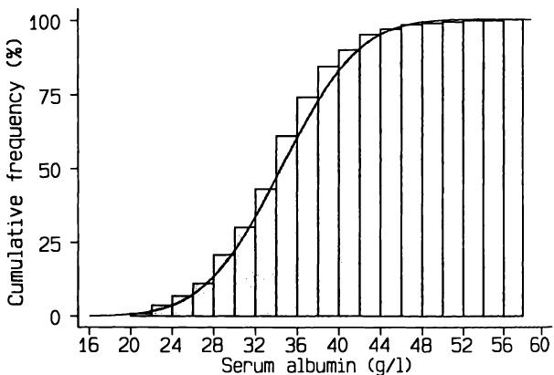
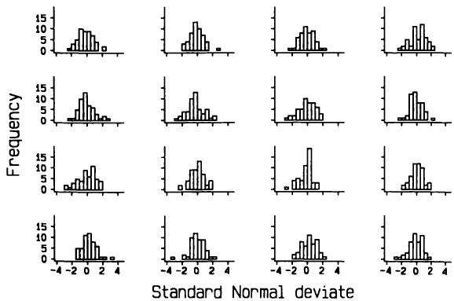

# 4 理论分布  4 Theoretical distributions  

## 4.1 引言  4.1 INTRODUCTION  

在上一章中，我们强调了属性或反应变异性的重要性。如果没有这种变异性，事件将完全可预测，也就不需要统计方法了。正因为存在变异性，我们才需要统计分析来揭示正在发生的事情。例如，尽管吸烟有害健康现在已是普遍接受的事实，但这一认识直到20世纪40年代和50年代（Doll和Hill，1950）开始进行大量细致的研究后才得以实现。尽管吸烟会显著增加患心脏病、肺癌和其他疾病的风险，但这种影响曾被掩盖，因为吸烟的反应具有高度变异性。一些重度吸烟者能活到80或90岁，而许多非吸烟者在60岁之前就去世了。显然，无论是在观察性研究还是实验性研究中，检测效应的能力都取决于效应的平均大小以及效应的变异性。我们将看到，这些概念之间的平衡是许多主要统计方法的基础。  
The importance of variability in attributes or responses was emphasized in the previous chapter. Without such variability events would be entirely predictable, and there would be no need for statistical methods. Because there is variability, we need statistical analysis to unravel what is going on. For example, while it is now universally accepted that cigarette smoking is hazardous to health, realization that this was so did not come until much careful research was carried out beginning in the 1940s and 1950s (Doll and Hill, 1950). Although the risk of heart disease, lung cancer and other diseases is considerably increased by smoking, the effect was masked because the response to smoking is highly variable. Some heavy smokers live to 80 or 90, whereas many non- smokers die before they are 60. Clearly the ability to detect effects, whether in observational or experimental studies, depends upon both the magnitude of the effect on average, and the variability of the effect. We will see that the balance between these ideas is behind a large number of the main statistical methods.  

统计方法应用中的另一个基本概念是概率。我们日常生活中经常以某种形式遇到概率。它可能相当明确，例如中彩票的概率；也可能隐含，例如过马路不被撞的概率。我们常常需要根据即将做出的决定来判断概率，例如，我出门是否带伞将取决于我对下雨概率的感知。生活中的大多数方面都可以被证明涉及一些概率，医学也不例外。心脏移植患者活两年以上的概率是多少？患者对某种特定治疗有反应的概率是多少？胃痛患者有溃疡的概率是多少？在有适当数据的情况下，统计方法有助于回答许多类似的问题。然而，必须记住，统计分析很少能得出确切的答案，因此我们应该在答案中指出（或至少意识到）一定程度的不确定性。  
Another essential concept in the application of statistical methods is that of probability. We frequently encounter probability in some form in everyday life. It may be reasonably explicit, such as the probability of winning a lottery, or implicit, such as the probability of crossing the road without getting run over. Often we need to judge probability in relation to a decision that has to be taken, for example, whether I take an umbrella when I go out will depend on my perception of the probability of rain. Most aspects of life can be shown to involve some probabilities, and medicine is no exception. What is the probability of a heart transplant patient living for two years？ What is the probability that a patient will respond to a particular treatment？ What is the probability that a patient with a pain in his stomach has an ulcer？ Given appropriate data, statistical methods help to answer many questions like these. It must be remembered, though, that statistical analysis rarely leads to a definite answer, so that we should indicate (or at least be aware of) a degree of uncertainty in our answers.  

## 4.2 概率  4.2 PROBABILITY  

首先，我们需要考虑概率的数学性质。为了本书中描述的统计方法，我将某个特定结果的概率定义为：如果我们重复进行该实验或观察大量次数，该结果发生的次数所占的比例。例如，我们可以通过观察大量婴儿中男婴所占的比例来估计婴儿是男孩的概率。  
First, we need to consider the mathematical nature of probability. For the purposes of the statistical methods described in this book I shall define the probability of some specific outcome as the proportion of times that that outcome would occur if we repeated the experiment or observation a large number of times. For example, we can estimate the probability that a baby is a boy by observing what proportion of a large number of babies are boys.  

根据定义，概率介于0和1之间；不可能发生的事情概率为0，而必然发生的事情概率为1。因此，概率在某种程度上类似于比例或百分比：概率为0.2的结果意味着它发生的几率是五分之一，即 $20\%$。概率通常不以百分比表示。在实践中，我们必须估计大多数概率，因为无法得知真实值。  
By definition a probability lies between 0 and 1; something that cannot happen has a probability of 0, while something that is certain to happen has a probability of 1. A probability is thus somewhat similar to a proportion or a percentage: an outcome with a probability of 0.2 means that there is a one in five, or a  $20\%$  chance of it happening. Probabilities are not usually expressed as a percentage. In practice we have to estimate most probabilities, as there is no way of knowing the true value.  

关于概率，我们在此阶段需要考虑两条简单规则：  
There are two simple rules regarding probabilities that we need to consider at this stage:  

1. 对于给定事件，对于可能发生的任意两种结果，其中任一结果发生的概率是各自概率之和。  
1. For a given event, for any two outcomes that might happen the probability of either occurring is the sum of the individual probabilities.  

例如，如果一个个体是A血型的概率是0.43，是B血型的概率是0.08，那么是A型或B型的概率就是0.51。由此可知，所有可能结果的概率之和必须为1，因为这些可能性中必然会发生一种。例如，不同血型的概率近似为  
For example, if the probability of an individual being blood group A is 0.43 and of being group B is 0.08, then the probability of being either A or B is 0.51. It follows that the probabilities of all possible outcomes must add up to 1, since one of these possibilities must occur. For example, the probabilities of being in the different blood groups are approximately  

O型:0.46;A型:0.43;B型:0.08;AB型:0.03。  
O:0.46;A:0.43;B:0.08;AB:0.03.  

我们在此假设所有结果都是互斥的。  
We assume here that all outcomes are mutually exclusive.  

2. 如果我们考虑两个或多个相互独立的事件，那么要获得这些事件中每个事件的特定结果组合的概率，我们必须将这些结果的各个概率相乘。  
2. If we consider two or more different events which are independent of each other, then to get the probability of a combination of specific outcomes for each of the events we must multiply the individual probabilities of those outcomes.  

独立性是统计学中一个重要的概念。独立意味着，如果我们知道一个事件的结果，这无法提供关于另一个事件的任何信息。更正式地说，无论第一个事件的结果如何，第二个事件的每个可能结果的概率都相同，依此类推。例如，如果全科医生诊室的候诊室里有三个人，他们都是O型血的概率是 $0.46\times 0.46\times 0.46 = 0.097$ ，也就是说，不到十分之一的几率。在这种情况下，独立性要求这三个人是无亲缘关系的。  
The idea of independence is an essential statistical concept. By independent we mean that if we know the outcome of one event this tells us nothing about the other event. More formally, the probability of each possible outcome for the second event is the same regardless of the outcome for the first event, and so on. For example, if there are three people in a GP's waiting room, the probability that they are all blood group O is  $0.46\times 0.46\times 0.46 = 0.097$  , that is, there is less than one chance in ten. In this context independence requires the three people to be unrelated.  

正如我们所料，如果两个事件不独立，乘法性质就不适用。例如，如果一个男人身高超过六英尺的概率是0.2，那么他和他的儿子都身高超过六英尺的概率就不是 $0.2\times 0.2 = 0.04$ ，因为孩子的身高往往会  
As we would expect, if two events are not independent, the multiplicative property does not apply. For example, if the probability of a man being more than six feet tall is 0.2, the probability that both he and his son are over six feet is not  $0.2\times 0.2 = 0.04$  because the heights of children tend to  

与父母的身高相关。这种思想在不确定性情况下被反向使用，以调查两个事件是否独立。例如，在病例对照研究中，将患有某种疾病的患者（病例）与未患病的人（对照）进行比较，以了解他们生命早期是否曾接触过某种可能有害的暴露。例如，可以将宫颈癌患者与对照组进行比较，以了解她们过去使用口服避孕药的情况。如果病例组的暴露人数多于对照组，那么病例组和对照组的暴露概率就不同，人们就会怀疑该暴露是疾病的原因。另一种看待这个问题的方式是，患有该疾病和曾有该暴露不是独立事件。  
be related to the heights of their parents. This idea is used in reverse in cases of uncertainty to investigate whether two events are independent. For example, in a case- control study patients with a disease (cases) are compared with people without the disease (controls) with respect to some possibly hazardous exposure earlier in their life. Women with cervical cancer may be compared with controls with respect to past use of oral contraceptives. If more cases had the exposure than controls then the probability of having been exposed is different for cases and controls and one suspects the exposure as a cause of the disease. Another way of looking at this is to say that having the disease and having had the exposure are not independent events.  

## 4.3 样本与总体  4.3 SAMPLES AND POPULATIONS  

几乎所有的统计分析都基于从个体样本中获取数据并利用这些信息对所有此类个体进行推断的原则。这个概念在民意调查中可能最为人所知。所有研究对象（或任何被调查的事物）的集合被称为目标总体。在上一章中，我们展示了25名囊性纤维化患者和298名6个月至6岁正常儿童的数据。分析这些样本的数据使我们能够对总体进行推断。对于这些研究，目标总体分别是所有囊性纤维化患者和所有6个月至6岁的儿童。样本的选择方式显然非常重要，将在下一章讨论。  
Nearly all statistical analysis is based on the principle that one acquires data on a sample of individuals and uses the information to make inferences about all such individuals. This idea is probably most familiar in the context of opinion polls. The set of all subjects (or whatever is being investigated) is called the population of interest. In the previous chapter data were presented for 25 patients with cystic fibrosis and for 298 normal children aged 6 months to 6 years. Analysing the data from these samples enables us to make inferences about the population. For these studies the populations of interest were, respectively, all patients with cystic fibrosis and all children aged 6 months to 6 years. The way the sample is selected is clearly very important, and is discussed in the next chapter.  

我们进行抽样研究，是因为几乎不可能研究整个总体。我们或许能够研究在一个特定日期某个国家所有被诊断患有囊性纤维化的患者，但他们仍然只是所有囊性纤维化患者的一个样本，受时间与地理限制，并且未诊断的病例被排除在外。幸运的是，我们不需要研究整个总体，因为精心选择的样本可以得出可靠的答案。我们通常无法计数或识别总体的所有成员，但样本使我们能够对总体进行推断，无论是整体还是个体。例如，一项新药的抗高血压作用研究将使我们能够（在一定限度内）估计该药物对未来未参与研究的高血压患者可能带来的益处。  
We take samples to study because it is rarely, if ever, possible to study the whole population. We might be able to study all patients diagnosed as having cystic fibrosis in one country on a particular date, but they are still only a sample of all people with cystic fibrosis, restricted by time and geography, and undiagnosed cases are excluded. Fortunately we do not need to study the whole population, as a carefully chosen sample can yield reliable answers. We cannot usually count or identify all the members of the population, but the sample allows us to draw inferences about the population, both collectively and individually. For example, a study of the anti- hypertensive effect of a new drug would allows us to estimate (within limits) the possible benefit of the drug to future hypertensive patients not in the study.  

样本与总体之间的关系存在不确定性，我们利用概率概念来表示这种不确定性。理论概率分布的概念在此背景下非常重要。  
The relation between sample and population is subject to uncertainty, and we use ideas of probability to indicate this uncertainty. The idea of a theoretical probability distribution is important in this context.  

## 4.4 概率分布  4.4 PROBABILITY DISTRIBUTIONS  

在上一章中，我讨论了观测数据分布—即经验分布—的概念。许多统计方法都使用了与之相关的  
In the previous chapter I discussed the idea of a distribution of observed data - an empirical distribution. Many statistical methods use the related  

概率分布概念，该概念通过数学方式定义。概率分布用于计算不同数值出现的理论概率，因此是经验相对频率分布的理论等价物。  
idea of a probability distribution which is specified mathematically. A probability distribution is used to calculate the theoretical probability of different values occurring, and is thus a theoretical equivalent of an empirical relative frequency distribution.  

例如，如果我们知道成年男性身高的均值和标准差，并且假设人口中身高的分布与某个特定的概率分布相同，我们就可以计算出身高超过六英尺的概率。如果我们从观测中得知，婴儿中男孩的比例是0.52，我们可以利用这一事实以及一些数学方法来计算一个有四个孩子的女性拥有四个女儿的概率。0.52这个值是概率分布的一个参数，就像第一个例子中的均值和标准差一样。所有概率分布都由一个或多个参数描述。  
For example, if we know the mean and standard deviation of the height of adult men we can calculate the probability of being more than six feet tall if we assume that the distribution of height in the population is the same as a particular probability distribution. If we know from observation that the proportion of babies that are boys is 0.52, we can use this fact together with some mathematics to find the probability that a woman with four children has four daughters. The value 0.52 is a parameter of the probability distribution, as are the mean and standard deviation in the first example. All probability distributions are described by one or more parameters.  

许多统计方法都基于这样的假设：观测数据是来自一个具有已知理论形式分布的总体样本。如果这个假设是合理的（我们无法确定它是否为真），那么统计分析方法就易于使用且适用范围广。如果分布假设不合理，而我们却像其合理一样进行分析，那么我们最终可能会得到误导性（且无效）的答案。在分析数据时，我们可以在两种方法之间做出选择：一种是需要进行分布假设的方法，称为参数方法；另一种是不对分布做任何假设的方法，称为免分布方法或非参数方法。  
Many statistical methods are based on the assumption that the observed data are a sample from a population with a distribution that has a known theoretical form. If this assumption is reasonable (we cannot establish if it is true) then the statistical methods of analysis are simple to use and wide- ranging. If the distributional assumption is not reasonable and we proceed as if it were, then we may end up with misleading (and invalid) answers. When analysing data we have a choice between methods that make distributional assumptions, called parametric methods, and those which make no assumptions about distributions, called distribution- free or non- parametric methods.  

概率分布在统计分析中的重要性反映了参数方法的主导地位。首先，我将讨论连续变量的概率分布，其中一个特定的分布—正态分布—具有根本性的重要性。稍后我将探讨离散数据的概率分布。  
The importance of probability distributions in statistical analysis reflects the dominance of parametric methods. First I shall consider probability distributions for continuous variables, for which one distribution in particular, the Normal distribution, is of fundamental importance. Later I shall look at probability distributions for discrete data.  

## 4.5 正态分布  4.5 THE NORMAL DISTRIBUTION  

正态分布是统计学中迄今为止最重要的概率分布。它以某种形式出现在后续的大多数章节中，其原因将在第8章中更充分地讨论，因此理解其性质和作用至关重要。然而，为了强调这种分布并不比许多其他分布更“正常”，我用大写字母N表示Normal。（它有时也以数学家高斯的名字命名，称为高斯分布。）  
The Normal distribution is by far the most important probability distribution in statistics. It appears in some form in most of the following chapters, for reasons which are considered more fully in Chapter 8, so an understanding of its nature and role is essential. However, to emphasize that there is no implication that this distribution is more 'normal' than many others, I use a capital N for Normal. (It is also sometimes known as the Gaussian distribution, after the mathematician Gauss.)  

在上一章中，我展示了如何使用直方图来描绘一组连续变量观测值的分布。如果观测值有数千个，并且IgM的记录更精确，那么IgM值可以被划分为许多微小的区间，数据的直方图就会更像一条平滑曲线。因此，不难  
In the previous chapter I showed how a histogram can be used to depict the distribution of a set of observations of a continuous variable. If there had been thousands of observations, and IgM had been recorded more precisely, the IgM values could be divided into many tiny intervals, and a histogram of the data would appear more like a smooth curve. So it is not  

想象某些观测数据的直方图或频率多边形是对某种“潜在”平滑频率分布的近似。例如，图4.1显示了216名原发性胆汁性肝硬化患者血清白蛋白值的直方图，图4.2显示了  
difficult to imagine that the histogram or frequency polygon of some observed data is an approximation to some 'underlying' smooth frequency distribution. For example, Figure 4.1 shows a histogram of serum albumin values in 216 patients with primary biliary cirrhosis, and Figure 4.2 shows a  

  
图4.1 216例原发性胆汁性肝硬化患者血清白蛋白值的直方图（引自Christensen等，1985年的研究）  
Figure 4.1 Histogram of serum albumin values in 216 patients with primary biliary cirrhosis (from the study by Christensen et al., 1985)  

  
图4.2 216例原发性胆汁性肝硬化患者血清白蛋白值的频率多边图。  
Figure 4.2 Frequency polygon of serum albumin values in 216 patients with primary biliary cirrhosis.  

同一数据的频率多边图，其效果更为清晰。  
frequency polygon of the same data, in which the effect is rather clearer.  

连续测量值的频率分布，如图4.2所示，通常只有一个峰值：它们被称为单峰分布。它们可能像这里一样相当对称，也可能像第3章中讨论的IgM数据那样不对称。正态分布是一种单峰且对称的概率分布；其形状如图4.3所示。偶尔也会出现具有两个峰值的频率分布。这些被称为双峰分布，通常是由于混合了具有不同均值的亚组所致。  
frequency distributions for continuous measurements, such as in Figure 4.2, tend to have a single peak: they are called unimodal. They may be fairly symmetric, as here, or asymmetric, as with the IgM data discussed in Chapter 3. The Normal distribution is a probability distribution which is unimodal and symmetric; its shape is shown in Figure 4.3. Frequency distributions with two peaks are occasionally seen. These are called bimodal, and are usually the result of mixing subgroups with different means.  

  
图4.3 正态分布。  
Figure 4.3 The Normal distribution.  

在考虑如何使用正态分布之前，有几点关于连续概率分布的一般性说明需要注意。首先，它们通常没有上限，有些也没有下限。理论上，正态分布从负无穷大 $(-\infty)$ 延伸到正无穷大 $(+\infty)$。其次，频率曲线的高度，即概率密度，不能被视为某个特定值的概率。这是因为对于连续变量，存在无限多个可能值，因此任何特定值的概率都为零。曲线的高度没有任何实际用途；其值由曲线下总面积始终被视为1这一事实决定。与观测数据的直方图一样，我们通过考虑与特定受限值范围对应的面积来使用概率分布。因为总面积为1，所以这个面积对应于这些值的概率。举一个简单的例子，正态分布均值  
Before considering how we make use of the Normal distribution there are some general points to note about continuous probability distributions. First, they usually have no upper limit and some have no lower limit either. In theory the Normal distribution extends from minus infinity  $(- \infty)$  to plus infinity  $(+\infty)$ . Second, the height of the frequency curve, which is called the probability density, cannot be taken as the probability of a particular value. This is because for a continuous variable there are infinitely many possible values so that the probability of any specific value is zero. The height of a curve is not of any practical use; its value is determined by the fact that the total area under the curve is always taken to be 1. As with histograms of observed data, we use a probability distribution by considering the area corresponding to a particular restricted range of values. Because the total area is 1 this area corresponds to the probability of those values. To take a simple example, the area to the left  

左侧的面积是0.5（因为对称性），这就是低于均值的概率。  
of the mean of the Normal distribution is 0.5 (because of the symmetry) and this is the probability of being below the mean.  

### 4.5.1 正态分布的应用  4.5.1 Using the Normal distribution  

正态分布的数学方程复杂得令人不快，但我们无需处理它即可使用正态分布，因为所需信息可以方便地从表格中获得。然而，重要的是要知道正态分布完全由两个参数描述：均值和标准差。它们通常分别称为 $\mu$（mu）和 $\sigma$（sigma）。图4.4(a)展示了正态分布与这些参数的关系。无论均值和标准差取何值，正态分布都以图4.4(a)所示的方式与均值和标准差相关。图4.4(b)和图4.4(c)说明了这一特点，它们分别展示了均值为10、标准差为2以及均值为125、标准差为8的正态分布。图4.5展示了图4.1所示的血清白蛋白直方图以及具有相同均值和标准差的正态分布。两者显然非常相似。  
The mathematical equation of the Normal distribution is unpleasantly complicated, but we do not need to deal with it in order to use the Normal distribution, because the necessary information is readily available in tables. However, it is important to know that the Normal distribution is completely described by two parameters, the mean and the standard deviation. These are usually called  $\mu$  (mu) and  $\sigma$  (sigma) respectively. Figure 4.4(a) shows the Normal distribution in relation to these parameters. Whatever values the mean and standard deviation have, the Normal distribution is related to the mean and standard deviation in the manner shown in Figure 4.4(a). This feature is illustrated by Figures 4.4(b) and 4.4(c), which show Normal distributions with firstly mean 10 and standard deviation 2 and secondly mean 125 and standard deviation 8. Figure 4.5 shows the histogram of serum albumin shown in Figure 4.1 and the Normal distribution with the same mean and standard deviation. The two are clearly very similar.  

如图4.4(a)所示，水平轴上的任何位置都可以表示为与均值相距若干个标准差（负或正）的距离。这个距离被称为标准正态离差或正态分数。它等同于观察一个均值为0、标准差为1的正态分布，这种特殊的正态分布被称为标准正态分布。任何正态分布都可以通过减去均值并除以标准差来转换为（或变换为）标准正态分布。  
As Figure 4.4(a) shows, any position along the horizontal axis can be expressed as a distance of a number of standard deviations (negative or positive) from the mean. This distance is known as a standard Normal deviate or Normal score. It is equivalent to looking at a Normal distribution with a mean of 0 and a standard deviation of 1, a special Normal distribution known as the standard Normal distribution. Any Normal distribution can be converted (or transformed) into a standard Normal distribution by subtracting the mean and dividing by the standard deviation.  

我们使用正态分布的一种方式如下：当一组观测值的分布与正态分布相似时，我们假设在总体中，该变量的分布实际上是正态的，并在此基础上进行计算。例如，如果我们愿意假设在所有原发性胆汁性肝硬化患者的总体中，血清白蛋白呈正态分布，那么我们就可以计算出原发性胆汁性肝硬化患者血清白蛋白水平高于 $42.0 \mathrm{g} / \mathrm{l}$ 的概率。  
One way that we use the Normal distribution is as follows. When a set of observations has a distribution that is similar to a Normal distribution we assume that in the population the distribution of the variable actually is Normal, and carry out calculations on this basis. For example, we can calculate the probability that a patient with primary biliary cirrhosis has a serum albumin level greater than  $42.0 \mathrm{g} / \mathrm{l}$  if we are willing to assume that, among the population of all patients with primary biliary cirrhosis, serum albumin has a Normal distribution.  

附录B中的表B1显示了标准正态分布的下尾面积。下尾指曲线从 $-\infty$ 到感兴趣值之间的面积。此面积等同于值低于指定值的概率。这个概念也可以表示为累积相对频率分布，如图4.6所示。表B1仅仅是图4.6中曲线的一个更精确的版本。  
Table B1 in Appendix B shows the lower tail areas of the standard Normal distribution. The lower tail means the area under the curve from  $- \infty$  up to the value of interest. This area is equivalent to the probability of a value lower than the specified value. This idea can also be expressed as the cumulative relative frequency distribution, which is shown in Figure 4.6. Table B1 is simply a more accurate version of the curve in Figure 4.6.  

在 $-1$ 以下的面积是0.16，在 $+1$ 以下的面积是0.84，因此  
The area below  $- 1$  is 0.16 and the area below  $+1$  is 0.84, so that the  

  

  

  

  
图4.5 216个血清白蛋白值的直方图以及具有相同均值和标准差的正态分布。  
Figure 4.5 Histogram of 216 serum albumin values and the Normal distribution with the same mean and standard deviation.  

  
图4.6 拟合血清白蛋白数据的累积正态分布。  
Figure 4.6 Cumulative Normal distribution fitted to serum albumin data.  

对应于 $-1$ 到 $+1$ 范围的面积是 $0.84 - 0.16 = 0.68$。换句话说，对于精确服从正态分布的数据，其值在均值的一个标准差范围内的概率是0.68。对其他标准差倍数重复这些计算，我们得到  
area corresponding to the range  $- 1$  to  $+1$  is  $0.84 - 0.16 = 0.68$ . In other words, for data with an exactly Normal distribution there is a probability of 0.68 of being within one standard deviation of the mean. Repeating these calculations for other numbers of standard deviations we get  

<table><tr><td>范围</td><td>在范围内的概率</td><td>在范围外</td></tr><tr><td>均值 ±1SD</td><td>0.683</td><td>0.317</td></tr><tr><td>均值 ±2SD</td><td>0.954</td><td>0.046</td></tr><tr><td>均值 ±3SD</td><td>0.9973</td><td>0.0027</td></tr></table>  
<table><tr><td>Range</td><td>Probability of being within range</td><td>outside range</td></tr><tr><td>mean ±1SD</td><td>0.683</td><td>0.317</td></tr><tr><td>mean ±2SD</td><td>0.954</td><td>0.046</td></tr><tr><td>mean ±3SD</td><td>0.9973</td><td>0.0027</td></tr></table>  

这些值也可以从表B2中获得。在每种情况下，不在所述范围内的概率是1减去在范围内的概率。我们可以看到，从正态分布中取出的值，其偏离均值超过三个标准差的几率极小—0.0027或 $0.27\%$，或者说大约四百分之一，这与从图4.4中获得的视觉印象一致。当然，在非常大的样本中，我们预期会有几个值达到这种极端程度。  
These values can also be obtained from Table B2. In each case the probability of not being within the stated range is 1 minus the probability of being within the range. We can see that there is a minimal chance - - 0.0027 or  $0.27\%$ , or about 1 in 400 - that a value from a Normal distribution will be more than three standard deviations above or below the mean, agreeing with the visual impression gained from Figure 4.4. Of course, in very large samples we would expect several values to be this extreme.  

在均值两个标准差范围内的概率略高于0.95。换句话说，正态分布中大约 $95\%$ 的观测值将落在均值 $- 2\mathrm{SD}$ 到均值 $+2\mathrm{SD}$ 的范围内，这与前一章中更一般的陈述一致。正如我们稍后将看到的，正态分布曲线下精确 $95\%$ 的面积实际上落在均值 $\pm 1.96\mathrm{SD}$ 这一稍窄的范围内。  
The probability of being within two standard deviations of the mean is just over 0.95. In other words, about  $95\%$  of observations from a Normal distribution will be within the range mean  $- 2\mathrm{SD}$  to mean  $+2\mathrm{SD}$ , which agrees with the more general statement in the previous chapter. As we will see later, exactly  $95\%$  of the area under the Normal distribution curve actually falls in the slightly narrower range of mean  $\pm 1.96\mathrm{SD}$ .  

### 4.5.2 一个例子  4.5.2 An example  

回到血清白蛋白数据，我们可以计算一个值高于 42.0 的概率，假设真实分布是正态分布。血清白蛋白的平均水平是 $34.46\mathrm{g / l}$，标准差是 $5.84\mathrm{g / l}$。我们首先计算 $42\mathrm{g / l}$ 这个值距离平均值有多少个标准差，计算方法如下：  
Returning to the serum albumin data, we can calculate the probability of a value being above 42.0 on the assumption that the true distribution is Normal. The mean serum albumin level was  $34.46\mathrm{g / l}$  and the standard deviation was  $5.84\mathrm{g / l}$ . We first calculate how many standard deviations from the mean the value of  $42\mathrm{g / l}$  is, which is given by  

$$
\frac{42 - 34.46}{5.84} = 1.29.
$$  

从表 B1 中我们发现大于 1.29 的概率是 0.0985，因此，一个值高于 $42\mathrm{g / l}$ 的概率是 $10\%$。  
From Table B1 we find that the probability of being greater than 1.29 is 0.0985, so the probability of a value above  $42\mathrm{g / l}$  is  $10\%$ .  

从表 B3 中，我们可以找到包含给定百分比分布的值—即中心范围。例如，$90\%$ 的分布落在平均值 $\pm 1.645\mathrm{SD}$ 的范围内，$95\%$ 落在平均值 $\pm 1.96\mathrm{SD}$ 的范围内，以及  
From Table B3 we can find the values which enclose a given percentage of the distribution - the central range. For example,  $90\%$  of the distribution lies within the range mean  $\pm 1.645\mathrm{SD}$ ,  $95\%$  within mean  $\pm 1.96\mathrm{SD}$ , and  

$99\%$ 落在平均值 $\pm 2.576\mathrm{SD}$ 的范围内。对于血清白蛋白数据，我们得到以下范围：  
$99\%$  within mean  $\pm 2.576\mathrm{SD}$ . For the serum albumin data we get the following ranges:  

<table><tr><td>中心范围</td><td>血清白蛋白 (g/l)</td></tr><tr><td>90%</td><td>24.85 到 44.07</td></tr><tr><td>95%</td><td>23.01 到 45.91</td></tr><tr><td>99%</td><td>19.39 到 49.53</td></tr></table>  
<table><tr><td>Central range</td><td>Serum albumin (g/l)</td></tr><tr><td>90%</td><td>24.85 to 44.07</td></tr><tr><td>95%</td><td>23.01 to 45.91</td></tr><tr><td>99%</td><td>19.39 to 49.53</td></tr></table>  

因此，我们可以使用正态分布来估计总体中变量分布的百分位数。我们本可以计算样本数据的观察百分位数，并使用这些值作为总体百分位数的估计值，但当数据接近正态分布时，使用正态分布更可靠，尤其是在分布的尾部。它也更简单，只需要两个值和一张正态分布表，而不是完整的原始数据值集。图 4.5 显示，216 个血清白蛋白值的分布与具有相同均值和标准差的正态分布非常相似。我们可以使用刚刚描述的程序，从正态分布中计算直方图中每个区间内期望的值的数量。例如，在 26.0 到 $28.0 \mathrm{g / l}$ 区间内期望的数量是该区间概率乘以 216。26.0 和 28.0 的标准正态离差为  
We can thus use the Normal distribution to estimate the centiles of the distribution of the variable in the population. We could have calculated the observed centiles of the sample data and used these values as estimates of the population centiles, but when the data are near to Normal the use of the Normal distribution is more reliable, especially in the tails of the distribution. It is also easier, requiring just two values and a table of the Normal distribution rather than the complete set of raw data values. Figure 4.5 showed that the distribution of the 216 serum albumin values was very similar to the Normal distribution with the same mean and standard deviation. We can use the procedure just described to calculate from the Normal distribution the number of values expected in each interval of the histogram. For example, the number expected in the interval 26.0 to  $28.0 \mathrm{g / l}$  is the probability of being in that interval multiplied by 216. The standard Normal deviates for 26.0 and 28.0 are  

$$
\begin{array}{c}\frac{26.0 - 34.46}{5.84} = -1.45 \\ \frac{28.0 - 34.46}{5.84} = -1.11 \end{array}
$$  

从表 B1 中，我们得到下尾面积分别为 0.0735 和 0.1335，得到在 26.0 和 28.0 之间概率为 $0.1335 - 0.0735 = 0.0600$。因此，该区间内期望的观测数量是 $216 \times 0.0600 = 13.0$。表 4.1 显示了对整个值范围进行类似（但更精确）计算的结果，给出了观察频率和在血清白蛋白总体分布为具有相同均值 $(34.46 \mathrm{g / l})$ 和标准差 $(5.84 \mathrm{g / l})$ 的正态分布时的期望频率。请注意，期望数量通常以小数形式引用，即使观察频率必须是整数。  
From Table B1 we get lower tail areas of 0.0735 and 0.1335, giving a probability of  $0.1335 - 0.0735 = 0.0600$  of being between 26.0 and 28.0. The expected number of observations in this interval is thus  $216 \times 0.0600 = 13.0$ . Table 4.1 shows the results of similar (but more precise) calculations for the whole range of values, giving observed frequencies and the frequencies expected if the population distribution of serum albumin was a Normal distribution with the same mean  $(34.46 \mathrm{g / l})$  and standard deviation  $(5.84 \mathrm{g / l})$ . Note that expected numbers are usually quoted as fractions even though the observed frequencies must be whole numbers.  

我在 4.4 节中观察到，广泛使用的参数统计分析方法包含了关于数据分布的重要假设。在大多数情况下，所涉及的分布是正态分布。这也是它成为最重要的分布之一的原因，在  
I observed in section 4.4 that the widely- used parametric methods of statistical analysis incorporate important assumptions about the distribution of data. In most cases the distribution involved is the Normal distribution. which is one of the reasons why it is the most important distribution in  

表 4.1 216 例原发性胆汁性肝硬化患者血清白蛋白分布，以及基于相同均值和标准差的正态分布的预期频率  
Table 4.1 Distribution of serum albumin in 216 patients with primary biliary cirrhosis together with expected frequencies based on a Normal distribution with the same mean and standard deviation  

<table><tr><td>血清白蛋白 (g/l)</td><td>观察频率</td><td>预期频率</td></tr><tr><td>&amp;lt; 20</td><td>0</td><td>1.4</td></tr><tr><td>20-</td><td>2</td><td>2.1</td></tr><tr><td>22-</td><td>6</td><td>4.4</td></tr><tr><td>24-</td><td>7</td><td>8.0</td></tr><tr><td>26-</td><td>9</td><td>13.1</td></tr><tr><td>28-</td><td>21</td><td>19.1</td></tr><tr><td>30-</td><td>20</td><td>24.7</td></tr><tr><td>32-</td><td>28</td><td>28.5</td></tr><tr><td>34-</td><td>39</td><td>29.2</td></tr><tr><td>36-</td><td>28</td><td>26.7</td></tr><tr><td>38-</td><td>22</td><td>21.8</td></tr><tr><td>40-</td><td>12</td><td>15.8</td></tr><tr><td>42-</td><td>11</td><td>10.2</td></tr><tr><td>44-</td><td>4</td><td>5.9</td></tr><tr><td>46-</td><td>3</td><td>3.0</td></tr><tr><td>48-</td><td>1</td><td>1.4</td></tr><tr><td>50-</td><td>1</td><td>0.6</td></tr><tr><td>52-</td><td>1</td><td>0.2</td></tr><tr><td>54-</td><td>0</td><td>0.1</td></tr><tr><td>56-</td><td>1</td><td>0.0</td></tr><tr><td>总计</td><td>216</td><td>216.2</td></tr></table>  
<table><tr><td>Serum albumin (g/l)</td><td>Observed frequency</td><td>Expected frequency</td></tr><tr><td>&amp;lt; 20</td><td>0</td><td>1.4</td></tr><tr><td>20-</td><td>2</td><td>2.1</td></tr><tr><td>22-</td><td>6</td><td>4.4</td></tr><tr><td>24-</td><td>7</td><td>8.0</td></tr><tr><td>26-</td><td>9</td><td>13.1</td></tr><tr><td>28-</td><td>21</td><td>19.1</td></tr><tr><td>30-</td><td>20</td><td>24.7</td></tr><tr><td>32-</td><td>28</td><td>28.5</td></tr><tr><td>34-</td><td>39</td><td>29.2</td></tr><tr><td>36-</td><td>28</td><td>26.7</td></tr><tr><td>38-</td><td>22</td><td>21.8</td></tr><tr><td>40-</td><td>12</td><td>15.8</td></tr><tr><td>42-</td><td>11</td><td>10.2</td></tr><tr><td>44-</td><td>4</td><td>5.9</td></tr><tr><td>46-</td><td>3</td><td>3.0</td></tr><tr><td>48-</td><td>1</td><td>1.4</td></tr><tr><td>50-</td><td>1</td><td>0.6</td></tr><tr><td>52-</td><td>1</td><td>0.2</td></tr><tr><td>54-</td><td>0</td><td>0.1</td></tr><tr><td>56-</td><td>1</td><td>0.0</td></tr><tr><td>Total</td><td>216</td><td>216.2</td></tr></table>  

统计学。尽管许多测量值确实具有相当正态的分布，例如人体身高，但许多则不然，例如人体体重或血清胆固醇。数据可能以各种方式偏离正态性，特别是通过不对称或偏斜。图 3.3 所示的 IgM 数据说明了正偏态。不应假定一组观测值近似正态—这必须经过证实。一种与正态分布密切相关的常见偏态分布是对数正态分布，这将在下一节中讨论。  
statistics. Although many measurements do have a reasonably Normal distribution, such as human height, many do not, such as human weight or serum cholesterol. There are various ways in which data may deviate from Normality, notably by being asymmetric or skewed. The IgM data shown in Figure 3.3 illustrated positive skewness. It should not be assumed that a set of observations is approximately Normal - this must be established. One common type of skewed distribution closely related to the Normal distribution is the Lognormal distribution, which is discussed in the next section.  

### 4.5.3 抽样变异  4.5.3 Sampling variation  

图 4.5 显示了血清白蛋白一组观测值与具有相同均值和标准差的正态分布的视觉比较。数据是否足够接近正态  
Figure 4.5 showed a visual comparison of a set of observations of serum albumin and the Normal distribution having the same mean and standard deviation. The question of whether data are close enough to a Normal  

分布很重要，将在后续章节的各个点进行讨论。  
distribution is important, and will be considered at various points in the following chapters.  

尽管可以使用正式方法（在第 7 章中描述），但一组观测值是否合理地呈正态分布通常是一个判断问题，通常通过直方图的目视检查。查看通过从正态分布中随机抽样获得的分布，以提供一个参考来判断一组观测数据，这是很有启发性的。图 4.7 显示了从标准正态分布中随机抽取的 16 个样本（每个样本 50 个观测值）的频率直方图。每个样本都相当于考虑从已知其感兴趣变量呈正态分布的总体中抽取的 50 个个体。这些样本的分布存在相当大的不规则性，单峰性和对称性等关键特性通常缺失。在考虑观测数据是否可能来自正态分布时，尤其是在样本量较小时，应牢记此图。  
Although formal methods can be used (described in Chapter 7), whether a set of observations are reasonably Normal is often a matter of judge­ ment, usually by visual inspection of a histogram. It is instructive to look at distributions obtained by taking random samples from a Normal distribu­ tion to give a reference against which to judge a set of observed data. Figure 4.7 shows frequency histograms of 16 samples of 50 observations sampled at random from the standard Normal distribution. Each sample is equivalent to considering 50 individuals sampled from a population known to have a Normal distribution for the variable of interest. There is considerable irregularity in the distributions of these samples, with the key properties of unimodality and symmetry generally absent. This figure should be borne in mind when considering whether observed data might have come from a Normal distribution, especially when the sample size is small.  

  
图 4.7 16 个来自正态分布的样本（样本量为 50）的分布。  
Figure 4.7 Distributions of 16 samples of size 50 from the Normal distribution.  

## 4.6 对数正态分布  4.6 THE LOGNORMAL DISTRIBUTION  

在 3.4 节中，我们看到在某些情况下，通过取对数，可以将具有正偏态分布的数据集转换为对称分布。对偏态分布的数据取对数通常会得到接近正态的分布。图 4.8 显示了相同 216 例原发性胆汁性肝硬化患者的血清胆红素水平直方图。  
In section 3.4 we saw that in some circumstances a set of data with a positively skewed distribution can be transformed into a symmetric distribution by taking logarithms. Taking logs of data with a skewed distribution will often give a distribution that is near to Normal. Figure 4.8 shows a histogram of serum bilirubin levels in the same 216 patients with primary  

  
图4.8 216例原发性胆汁性肝硬化患者血清胆红素值的直方图，并拟合了正态分布（摘自Christensen等，1985年的研究）。  
Figure 4.8 Histogram of serum bilirubin values in 216 patients with primary biliary cirrhosis with fitted Normal distribution (from the study by Christensen et al., 1985).  

胆汁性肝硬化（PBC）。其均值和标准差分别为60.7和 $77.9 \mu \mathrm{mol} / \mathrm{l}$。叠加的最佳拟合正态分布（具有相同的均值和标准差）与数据拟合效果极差，因为数据存在极端偏度。如果我们将数据取对数（以e为底），我们会得到一个更对称的分布，均值为3.55，标准差为 $1.03 \log \mu \mathrm{mol} / \mathrm{l}$。图4.9显示了 $\log_{e}$ 血清胆红素的直方图，并拟合了正态分布，其拟合效果好得多。图4.10显示了原始数据与拟合正态分布函数的“反向变换”。拟合曲线是对数正态分布函数的一个例子。具有对数正态分布的数据可以通过取对数转换为正态分布。  
biliary cirrhosis (PBC). The mean and standard deviation are 60.7 and  $77.9 \mu \mathrm{mol} / \mathrm{l}$  respectively. The superimposed best- fitting Normal distribution (with the same mean and standard deviation) is a terrible fit to the data because of the extreme skewness. If we take logs (to base e) of the data we get a much more symmetric distribution with a mean of 3.55 and a standard deviation of  $1.03 \log \mu \mathrm{mol} / \mathrm{l}$ . Figure 4.9 shows a histogram of  $\log_{e}$  serum bilirubin with the fitted Normal distribution, which is a much better fit. Figure 4.10 shows the raw data with the 'back- transformation' of the fitted Normal distribution function. The fitted curve is an example of the Lognormal distribution function. Data with a Lognormal distribution can be transformed to Normality by taking logarithms.  

对于像血清胆红素测量值这样的偏态数据，对数变换通常会产生近似正态性。然后我们可以在对数数据上进行计算，并将结果转换回原始尺度。例如，我们可能希望使用我们的数据来估计所有PBC患者血清胆红素水平中包含 $95\%$ 的值。假设是对数正态分布，我们可以从均值为3.547、标准差为1.030的正态分布进行计算（这些值比上面显示的值更精确）。在对数单位中， $95\%$ 的分布预计将介于均值 $- 1.96 \mathrm{SD}$ 和均值 $+1.96 \mathrm{SD}$ 之间。这些值是  
With skewed data like the serum bilirubin measurements log transformation will often produce approximate Normality. We can then perform our calculations on the log data and transform the answers back to the original scale. For example, we may wish to use our data to estimate the values enclosing  $95\%$  of serum bilirubin levels for all patients with PBC. Assuming a Lognormal distribution, we can make our calculations from the Normal distribution with mean 3.547 and standard deviation 1.030 (these being more accurate values than those shown above). In log units,  $95\%$  of the distribution will be expected to be between mean  $- 1.96 \mathrm{SD}$  and mean  $+1.96 \mathrm{SD}$ . These values are  

$$
3.547 + (1.96 \times 1.030) = 5.566.
$$  

  
图4.9 对数血清胆红素的直方图，并拟合了正态分布（以e为底的对数）。  
Figure 4.9 Histogram of log serum bilirubin with fitted Normal distribution (logarithms to base e).  

  
图4.10 血清胆红素的直方图，并拟合了对数正态分布。  
Figure 4.10 Histogram of serum bilirubin with fitted Lognormal distribution.  

这些值的反对数（使用函数 $\mathbf{e}^{x}$）分别是 $\mathbf{e}^{1.528} = 4.61$ 和 $\mathbf{e}^{5.566} = 261.4 \mu \mathrm{mol} / \mathrm{l}$。对数数据均值的反对数是 $\mathbf{e}^{3.547} = 34.7 \mu \mathrm{mol} / \mathrm{l}$，这是数据的几何均值。所有这些值都显示在图4.11的箱线图中。  
The antilogs of these values (using the function  $\mathbf{e}^{x}$ ) are  $\mathbf{e}^{1.528} = 4.61$  and  $\mathbf{e}^{5.566} = 261.4 \mu \mathrm{mol} / \mathrm{l}$ . The antilog of the mean of the log data is  $\mathbf{e}^{3.547} = 34.7 \mu \mathrm{mol} / \mathrm{l}$ , which is the geometric mean of the data. All of these values are depicted in a box- and- whisker diagram in Figure 4.11.  

不应假设偏态分布的数据可以转换为近似正态分布。这必须得到证实，或许可以通过图4.9中的视觉检查，或者正式地使用第7.5节中描述的方法。  
It should not be assumed that data with a skewed distribution can be transformed to approximate Normality. This must be established, perhaps visually as in Figure 4.9 or formally using the methods described in section 7.5.  

  
图4.11 血清胆红素的箱线图，显示了通过拟合对数数据的正态分布得出的 $95\%$ 中心范围。  
Figure 4.11 Box-and-whisker diagram of serum bilirubin showing  $95\%$  central range derived from fitting a Normal distribution to log data.  

## 4.7 二项分布  4.7 THE BINOMIAL DISTRIBUTION  

离散数据最简单的概率分布是只有两种可能性时。血型为B的概率约为0.08，因此血型为O、A或AB的概率为0.92。对于一组无血缘关系的人，我们可以计算出不同人数为B血型的概率。因此，两人均为B血型的概率是 $0.08 \times 0.08 = 0.0064$ ，而两人均非B血型的概率是 $0.92 \times 0.92 = 0.8464$ 。我们将概率相乘，因为两个无血缘关系的人的血型是独立的。两人中只有一人为B血型的概率更为复杂，因为这种情况有两种发生方式。因此，两人中恰好有一人为B血型的概率 $= 2 \times 0.08 \times 0.92 = 2 \times 0.0736 = 0.1472$ 。  
The simplest probability distribution for discrete data is when there are only two possibilities. The probability of being in blood group B is about 0.08 so the probability of being group O, A or AB is 0.92. For a group of unrelated people, we can work out the probability of different numbers of people being in blood group B. The probability of two people both being in blood group B is thus  $0.08 \times 0.08 = 0.0064$ , and the probability of neither being in blood group B is  $0.92 \times 0.92 = 0.8464$ . We multiply the probabilities because the blood groups of two unrelated people are independent. The probability of only one of the two being in blood group B is more complicated, because there are two ways in which this could happen. Thus the probability of exactly one of two people being in blood group B  $= 2 \times 0.08 \times 0.92 = 2 \times 0.0736 = 0.1472$ .  

我们可以将这些可能性总结如下：  
We can summarize the possibilities as follows:  

64 理论分布  
64 Theoretical distributions  

  
图4.12显示了两人中B血型人数的概率分布。这种分布是二项分布的一个简单例子。为了得到所示的三个概率，我们必须进行三次简单的计算。然而，如果我们将这种简单计算扩展到考虑四人中的人数，就不那么容易了。每个人要么是B血型，要么不是B血型，因此有 $2 \times 2 \times 2 \times 2$ 种可能的排列，即16种。对于 $n$ 个人，可能的排列数为 $2^{n}$ ，因此，例如如果我们有七个人，就有128种可能的排列。  
Figure 4.12 shows the probability distribution of the number of people out of two in blood group B. This distribution is a simple example of the Binomial distribution. To get the three probabilities shown we had to make three simple calculations. However, if we extend this simple calculation to consider the number of people out of four it is not so easy. Each person is either group B or not group B so there are  $2 \times 2 \times 2 \times 2$  possible orderings, which is 16. The number of possible orderings for  $n$  people is  $2^{n}$ , so if we have seven people for example, there are 128 possible orderings.  

幸运的是，我们可以通过使用一个通用公式来绕过大部分计算。由于它相当复杂，详细内容在4.9节中给出。使用该公式，可以根据某一特定结果的概率，计算出一系列事件中不同数量的该类型结果的概率。例如，图4.13显示了概率  
Fortunately, we can bypass most of the calculations by using a general formula. As it is rather complicated, the details are given in section 4.9. Using the formula one can calculate the probability of different numbers of outcomes of a particular type in a series of events from the probability of one such outcome. For example, Figure 4.13 shows the probability  

  
图4.12 两人中B血型人数的二项分布。  
Figure 4.12 Binomial distribution of number of people out of two in blood group B.  

10人中B血型个体数量的分布。（计算方法见4.9节。）该分布是不对称的，但随着样本量的增加，二项分布变得  
distribution for the number of individuals out of 10 being of blood group B. (The calculations are shown in section 4.9. ) The distribution is asymmetric, but as the sample size increases the Binomial distribution becomes  

  
图4.13 基于B血型概率为0.08的10人中B血型受试者数量的二项分布。  
Figure 4.13 Binomial distribution showing the number of subjects out of ten in blood group B based on the probability of being in blood group B of 0.08.  

  
图4.14 基于B血型概率为0.08的100人中B血型受试者数量的二项分布。  
Figure 4.14 Binomial distribution showing the number of subjects out of 100 in blood group B based on the probability of being in blood group B of 0.08.  

更对称，并逐渐开始看起来像正态分布。图4.14显示，在100人的样本中，B血型人数的二项分布几乎是对称的。  
more symmetric and gradually begins to look like a Normal distribution. Figure 4.14 shows that the Binomial distribution for the number of people in blood group B in a sample of 100 is almost symmetric.  

二项分布有时用于将观察到的数据集与预期分布进行比较。然而，其主要用途是分析只有两种可能性的数据，例如某人是否患有哮喘。在这里，我们关注的是患有哮喘的受试者比例。这类数据在医学研究中频繁出现，我们常常希望比较不同受试者组中某种类型事件发生的比例。各组的样本量通常足够大，使得二项分布非常接近具有相同均值和标准差的正态分布，这简化了分析（参见第10章）。  
The Binomial distribution is sometimes used to compare an observed set of data with the expected distribution. Its main use, however, is in the analysis of data where there are only two possibilities, such as whether or not someone suffers from asthma. Here we are interested in the proportion of subjects with asthma. Data of this type occur frequently in medical research, and we often wish to compare the proportion of events of a certain type occurring in different groups of subjects. The sample sizes in the groups are often large enough for the Binomial distribution to be very like a Normal distribution with the same mean and standard deviation, which simplifies analysis (see Chapter 10).  

## 4.8 泊松分布  4.8 THE POISSON DISTRIBUTION  

当我们计算某个事件发生的次数时，会产生另一种类型的离散数据，这可能是针对不同受试者或不同时间单位的。这类数据的例子包括癌症登记处每日报告的新增乳腺癌病例数，以及一系列肝活检组织学切片固定区域内的异常细胞数量。  
A different type of discrete data arises when we count the number of occurrences of an event, perhaps for different subjects or for units of time. Examples of data like this are the daily number of new cases of breast cancer notified to a cancer registry, and the number of abnormal cells in a fixed area of histological slides from a series of liver biopsies.  

产生这类数据的理论情境最容易描述为：事件在时间（或空间）上以平均固定速率发生，但每个事件都是独立且随机发生的。这类数据将服从泊松分布。例如，每日新增癌症登记数平均可能为2.2例，但任何一天都可能没有新病例，也可能有很多例。如果我们假设泊松分布的条件成立，我们就可以计算出某一天任意数量新病例发生的概率。这些概率显示在图4.15中（计算过程显示在第4.9节）。  
The theoretical situation giving rise to data of this type is easiest to describe in relation to events occurring over time (or space) at a fixed rate on average, but where each event occurs independently and at random. Such data will have a Poisson distribution. For example, the daily number of new registrations of cancer may be 2.2 on average, but on any day there may be no new cases or there may be several. If we assume that the conditions for a Poisson distribution hold, we can calculate the probability of any number of new cases on a single day. These probabilities are shown in Figure 4.15 (and the calculations are shown in section 4.9).  

当泊松分布的均值很小（如本例所示）时，它非常不对称；但当均值很大（例如50）时，它变得几乎对称。事实上，与二项分布一样，它也变得更像正态分布。请注意，泊松分布没有理论上的最大值，但其概率会非常迅速地趋近于零。  
The Poisson distribution is very asymmetric when its mean is small, as here, but with a large mean, such as 50, it becomes nearly symmetric. In fact, like the Binomial distribution, it becomes more like a Normal distribution. Note that the Poisson distribution has no theoretical maximum value, but the probabilities tail off towards zero very quickly.  

表4.2显示了一些可能预期服从泊松分布的数据。该表给出了1978年至1982年间印度三个小区域在满月或新月日的每日犯罪数量。表中还显示了基于与观察数据具有相同均值的泊松分布，预期不同犯罪数量的天数。观察频率与预期频率之间的相似性很明显，特别是对于新月日，这表明这些数据接近泊松分布。  
Table 4.2 shows some data that might be expected to follow a Poisson distribution. The table gives the number of crimes per day in three small areas of India from 1978 to 1982, on days where there was either a full moon or a new moon. Also shown are the expected number of days with different numbers of crimes, based on Poisson distributions with the same means as the observed data. The similarity between the observed and expected frequencies is clear, especially for the new moon days, demonstrating that these data are close to a Poisson distribution.  

泊松分布完全由一个参数描述。  
The Poisson distribution is completely described by a single parameter.  

  
图4.15 均值为2.2的泊松分布。  
Figure 4.15 Poisson distribution with mean 2.2.  

表4.2 1978年至1982年印度三个区域的每日犯罪数量（Thakur和Sharma，1984），显示观察频率（Obs）和使用泊松分布的预期频率（Exp）  
Table 4.2 Number of crimes per day in three areas of India during 1978 to 1982 (Thakur and Sharma, 1984) showing observed frequencies (Obs) and expected frequencies using the Poisson distribution (Exp)  

<table><tr><td rowspan="2">犯罪数量</td><td colspan="2">满月日</td><td colspan="2">新月日</td></tr><tr><td>观察值</td><td>预期值</td><td>观察值</td><td>预期值</td></tr><tr><td>0</td><td>40</td><td>45.2</td><td>114</td><td>112.8</td></tr><tr><td>1</td><td>64</td><td>63.1</td><td>56</td><td>56.4</td></tr><tr><td>2</td><td>56</td><td>44.3</td><td>11</td><td>14.1</td></tr><tr><td>3</td><td>19</td><td>20.7</td><td>4</td><td>2.4</td></tr><tr><td>4</td><td>1</td><td>7.1</td><td>1</td><td>0.3</td></tr><tr><td>5</td><td>2</td><td>2.0</td><td>0</td><td>0.0</td></tr><tr><td>6</td><td>0</td><td>0.5</td><td>0</td><td>0.0</td></tr><tr><td>7</td><td>0</td><td>0.1</td><td>0</td><td>0.0</td></tr><tr><td>8</td><td>0</td><td>0.0</td><td>0</td><td>0.0</td></tr><tr><td>9</td><td>1</td><td>0.0</td><td>0</td><td>0.0</td></tr><tr><td>总计</td><td>183</td><td>183.0</td><td>186</td><td>186.0</td></tr><tr><td>均值</td><td></td><td>1.40</td><td></td><td>0.50</td></tr><tr><td>标准差</td><td></td><td>1.16</td><td></td><td>0.75</td></tr></table>  
<table><tr><td rowspan="2">Number of crimes</td><td colspan="2">Full moon days</td><td colspan="2">New moon days</td></tr><tr><td>Obs</td><td>Exp</td><td>Obs</td><td>Exp</td></tr><tr><td>0</td><td>40</td><td>45.2</td><td>114</td><td>112.8</td></tr><tr><td>1</td><td>64</td><td>63.1</td><td>56</td><td>56.4</td></tr><tr><td>2</td><td>56</td><td>44.3</td><td>11</td><td>14.1</td></tr><tr><td>3</td><td>19</td><td>20.7</td><td>4</td><td>2.4</td></tr><tr><td>4</td><td>1</td><td>7.1</td><td>1</td><td>0.3</td></tr><tr><td>5</td><td>2</td><td>2.0</td><td>0</td><td>0.0</td></tr><tr><td>6</td><td>0</td><td>0.5</td><td>0</td><td>0.0</td></tr><tr><td>7</td><td>0</td><td>0.1</td><td>0</td><td>0.0</td></tr><tr><td>8</td><td>0</td><td>0.0</td><td>0</td><td>0.0</td></tr><tr><td>9</td><td>1</td><td>0.0</td><td>0</td><td>0.0</td></tr><tr><td>Total</td><td>183</td><td>183.0</td><td>186</td><td>186.0</td></tr><tr><td>Mean</td><td></td><td>1.40</td><td></td><td>0.50</td></tr><tr><td>SD</td><td></td><td>1.16</td><td></td><td>0.75</td></tr></table>  

均值，如第4.9节所示，因为泊松分布的方差与均值相同。因此，如果来自不同来源的数据都可以被  
the mean, as is shown in section 4.9, because the variance of the Poisson distribution turns out to be the same as the mean. It follows that data from different sources will have very similar distributions if they can both be  

表4.3 印度新月日犯罪分布（Thakur和Sharma，1984）与1971年蒙特利尔某医院每日死亡人数分布（Zweig和Csank，1978）比较  
Table 4.3 Comparison of distributions of crimes on new moon days (Thakur and Sharma, 1984) and number of deaths per day in a Montreal hospital in 1971 (Zweig and Csank, 1978)  

<table><tr><td rowspan="2">n</td><td colspan="2">印度新月日犯罪数</td><td colspan="2">蒙特利尔某医院每日死亡人数</td><td>泊松分布预期值 (0.51)</td></tr><tr><td>%</td><td>频数</td><td>%</td><td>频数</td><td>%</td></tr><tr><td>0</td><td>61.3</td><td>114</td><td>60.3</td><td>220</td><td>60.0</td></tr><tr><td>1</td><td>30.1</td><td>56</td><td>31.0</td><td>113</td><td>30.6</td></tr><tr><td>2</td><td>5.9</td><td>11</td><td>6.3</td><td>23</td><td>7.8</td></tr><tr><td>3</td><td>2.2</td><td>4</td><td>2.2</td><td>8</td><td>1.3</td></tr><tr><td>4+</td><td>0.5</td><td>1</td><td>0.3</td><td>1</td><td>0.2</td></tr><tr><td>Total</td><td>100.0</td><td>186</td><td>100.0</td><td>365</td><td>99.9%</td></tr><tr><td>Mean</td><td></td><td>0.505</td><td></td><td>0.512</td><td></td></tr><tr><td>SD</td><td></td><td>0.752</td><td></td><td>0.736</td><td></td></tr></table>  
<table><tr><td rowspan="2">n</td><td colspan="2">Crimes on new moon days in India</td><td colspan="2">Deaths per day in a hospital in Montreal</td><td>Expected distribution Poisson (0.51)</td></tr><tr><td>%</td><td>Frequency</td><td>%</td><td>Frequency</td><td>%</td></tr><tr><td>0</td><td>61.3</td><td>114</td><td>60.3</td><td>220</td><td>60.0</td></tr><tr><td>1</td><td>30.1</td><td>56</td><td>31.0</td><td>113</td><td>30.6</td></tr><tr><td>2</td><td>5.9</td><td>11</td><td>6.3</td><td>23</td><td>7.8</td></tr><tr><td>3</td><td>2.2</td><td>4</td><td>2.2</td><td>8</td><td>1.3</td></tr><tr><td>4+</td><td>0.5</td><td>1</td><td>0.3</td><td>1</td><td>0.2</td></tr><tr><td>Total</td><td>100.0</td><td>186</td><td>100.0</td><td>365</td><td>99.9%</td></tr><tr><td>Mean</td><td></td><td>0.505</td><td></td><td>0.512</td><td></td></tr><tr><td>SD</td><td></td><td>0.752</td><td></td><td>0.736</td><td></td></tr></table>  

视为接近泊松分布且具有相同均值，则它们将具有非常相似的分布。表4.3显示，印度新月日犯罪数量的相对频率分布与蒙特利尔某医院每日死亡人数的分布几乎相同。两组观测数据都非常接近均值为0.51的泊松分布。  
considered to be close to Poisson and have the same mean. Table 4.3 shows that the relative frequency distribution of the number of crimes on new moon days in India is virtually identical to the distribution of the number of deaths per day in a hospital in Montreal. Both observed sets of data are very close to a Poisson distribution with a mean of 0.51.  

泊松分布适用于研究罕见事件。我们可以将此问题视为与二项分布相同，即感兴趣结果的概率非常小，但事件数量很大。泊松分布在医学研究中不常用，但与二项分布一样，它在某些其他类型的统计分析中被隐式使用。  
The Poisson distribution is appropriate for studying rare events. We can consider the problem as being the same as that of the Binomial distribution where the probability of the outcome of interest is very small but there are a large number of events. The Poisson distribution is not used greatly in medical research although, like the Binomial distribution, it is used implicitly in some other types of statistical analysis.  

## 4.9 数学计算  4.9 MATHEMATICAL CALCULATIONS  

（本节介绍与二项分布和泊松分布章节相关的数学计算。可跳过本节而不影响内容的连贯性。）  
(This section gives the mathematical calculations relating to the sections on the Binomial and Poisson distributions. It can be omitted without loss of continuity.)  

### 4.9.1 二项分布  4.9.1 Binomial distribution  

举个例子，假设我们希望计算十个人中不同数量的个体为B血型的概率，其中 $p = 0.08$。例如，这10个人中特定4个人为B血型的概率是 $p^{4}(1 - p)^{6}$，因此任意4个人为B血型的概率是此概率乘以从10个人中选择4种方式的数量。  
To take an example, suppose we wish to calculate the probability of different numbers of individuals out of ten being blood group B, for which  $p = 0.08$ . The probability of, say, a particular 4 of the 10 people being blood group B is  $p^{4}(1 - p)^{6}$ , so that the probability of any 4 being blood group B is this probability multiplied by the number of ways of choosing 4 people from 10.  

通常，假设我们有 $n$ 个“事件”，并希望计算其中0、1、2直到 $n$ 个事件属于特定类型的概率，其中 $p$ 是这种类型结果的总概率。那么， $r$ 个此类事件的二项概率由以下公式给出：  
In general, suppose we have  $n$  'events' and wish to calculate the probability of 0, 1, 2, up to  $n$  of them being a specific type, where  $p$  is the overall probability of this type of outcome. Then the Binomial probability of  $r$  such events is given by  

$$
{\binom{n}{r}}p^{r}(1-p)^{n-r}
$$  

其中 $\binom{n}{r}$ 是从 $n$ 个项目中选择 $r$ 个项目的方法数，这是一个我们需要计算的数值。  
where  $\binom{n}{r}$  is the number of ways of choosing  $r$  items from  $n$ , and is a number we have to calculate.  

我们可以通过使用以下关系式简单地计算 $\binom{n}{r}$：  
We can evaluate  $\binom{n}{r}$  simply by using the following relations:  

$$
\begin{array}{l}{{\binom{n}{0}=1;}}\\ {{\binom{n}{r}=\binom{n}{r-1}\times(n-r+1)/r;}}\end{array}
$$  

以及  
and  

(iii) $\binom{n}{n- r}=\binom{n}{r}$。  
(iii)  $\binom{n}{n- r}=\binom{n}{r}$ .  

因此我们有  
So we have  

$$ 
\begin{array}{r l}
  \binom{10}{0} &= 1 \\
  \binom{10}{1} &= \binom{10}{0} \times \frac{10}{1} = 1 \times 10 = 10 = \binom{10}{9} \\
  \binom{10}{2} &= \binom{10}{1} \times \frac{9}{2} = 10 \times \frac{9}{2} = 45 = \binom{10}{8} \\
  \binom{10}{3} &= \binom{10}{2} \times \frac{8}{3} = 45 \times \frac{8}{3} = 120 = \binom{10}{7} \\
  \binom{10}{4} &= \binom{10}{3} \times \frac{7}{4} = 120 \times \frac{7}{4} = 210 = \binom{10}{6} \\
  \binom{10}{5} &= \binom{10}{4} \times \frac{6}{5} = 210 \times \frac{6}{5} = 252
\end{array}
$$  

因此，10人中有4人是B血型的概率为  
The probability that 4 of the 10 people are blood group B is thus  

$$
210(0.08)^{4}(0.92)^{6} = 0.00522
$$  

或 $0.5\%$。图4.13展示了完整的分布。  
or  $0.5\%$ . Figure 4.13 shows the complete distribution.  

系数 $\binom{n}{r}$ 的一般公式是  
The general formula for the coefficients  $\binom{n}{r}$  is  

70 理论分布  
70 Theoretical distributions  

$$
{\binom{n}{r}}={\frac{n!}{r!(n-r)!}}
$$  

其中 $n!$ （读作n的阶乘）等于 $1\times 2\times 3\times \ldots \times n$ （参见附录A）。注意 $0! = 1$ （参见附录A）。系数 $\binom{n}{r}$ 可以从 $\log{\binom{n}{r}}$ 的表格中获取（Lentner, 1982, pp. 74-81），或者通过上述方法计算。  
where  $n!$  (pronounced n factorial) is equal to  $1\times 2\times 3\times \ldots \times n$  (see Appendix A). Note that  $0! = 1$  (see Appendix A). The coefficients  $\binom{n}{r}$  can be obtained from tables of  $\log{\binom{n}{r}}$  (Lentner, 1982, pp. 74- 81), or calculated in the way described above.  

如果感兴趣事件的真实比例是 $p$，那么在大小为 $n$ 的样本中，二项分布的均值是 $np$，标准差是 $\sqrt{np(1 - p)}$。  
If the true proportion of events of interest is  $p$ , then in a sample of size  $n$  the mean of the Binomial distribution is  $np$  and the standard deviation is  $\sqrt{np(1 - p)}$ .  

### 4.9.2 泊松分布  4.9.2 Poisson distribution  

泊松分布中 $k$ 个事件发生概率的一般公式是 $\mathrm{e}^{- \mu} \mu^{k} / k!$，其中 $\mu$（希腊字母mu）是均值，$\mathrm{e}$ 是一个数学常数，约等于2.718（参见附录A）。标准差是 $\sqrt{\mu}$。  
The general Poisson formula for the probability of  $k$  events is  $\mathrm{e}^{- \mu} \mu^{k} / k!$  where  $\mu$  (the greek letter mu) is the mean and  $\mathrm{e}$  is a mathematical constant approximately equal to 2.718 (see Appendix A). The standard deviation is  $\sqrt{\mu}$ .  

如果泊松分布的条件成立，某天没有新病例的概率是  
If the conditions for a Poisson distribution hold, the probability of getting no new cases on a day is  

$$
P(0) = \mathrm{e}^{-\mu}.
$$  

最能拟合数据的泊松分布，其均值与观测值的均值相同：2.2。因此，这里的 $P(0)$ 是 $\mathrm{e}^{- 2.2} = 0.111$。我们不必使用上面复杂的公式，而是可以根据关系 $P(i) = mP(i - 1) / i$ 来计算 $P(1)$、$P(2)$ 等，其中 $m$ 是样本均值。所以我们有  
The Poisson distribution that will fit the data best has the same mean as that of the observations: 2.2. So here  $P(0)$  is  $\mathrm{e}^{- 2.2} = 0.111$ . Rather than use the complicated formula above we can calculate  $P(1)$ ,  $P(2)$ , etc. from the relation  $P(i) = mP(i - 1) / i$ , where  $m$  is the sample mean. So we have  

$$
\begin{array}{r l} & {P(1) = 2.2\times 0.111 / 1 = 0.244}\\ & {P(2) = 2.2\times 0.244 / 2 = 0.258}\\ & {P(3) = 2.2\times 0.268 / 3 = 0.197}\\ & {P(4) = 2.2\times 0.197 / 4 = 0.108}\\ & {P(5) = 2.2\times 0.108 / 5 = 0.048}\\ & {P(6) = 2.2\times 0.048 / 6 = 0.017}\\ & {P(7) = 2.2\times 0.017 / 7 = 0.005}\\ & {P(8) = 2.2\times 0.005 / 8 = 0.002} \end{array}
$$  

依此类推。该分布如图4.15所示。  
and so on. The distribution is shown in Figure 4.15.  

请注意，这是一个很好的例子，说明在进行一系列计算时需要保持完整的数值精度，因为任何由  
Note that this is a good example of the need to keep full numerical precision through a series of calculations, because any error caused by  

四舍五入引起的误差都会影响所有后续计算。然而，为了使呈现更清晰，上面所示的数字已经过四舍五入。  
rounding would affect all subsequent calculations. The figures shown above have, however, been rounded to clarify the presentation.  

## 4.10 均匀分布  4.10 THE UNIFORM DISTRIBUTION  

一个不同的问题是确定疾病发病是否存在季节性变化。如果没有季节性变化，我们预计每月新病例的数量变化不大。例如，如果某地区综合医院的糖尿病诊所一年内登记了126个新病例，并且如果糖尿病发病没有季节性，那么我们预计每个月会有十二分之一的126个，即10.5个新病例。（我们可以对每月天数的差异进行轻微修正。）实际上，自然变异性会导致每月新病例累积量的一些变化，但如果没有季节性，这种变化将是非系统性的，而如果存在季节性，则会有一些系统性趋势。理论上的均匀分布，即每个月具有相同的相对频率，用于检查此类数据。周期性变化的统计分析将在第14.7节中讨论。  
A different problem is that of determining whether there is a seasonal variation in the onset of a disease. If there is no seasonal variation we would expect little variation in the number of new cases each month. For example, if a diabetes clinic in a district general hospital registers 126 new cases in a year, and if there were no seasonality for the onset of diabetes, then we would expect to have one- twelfth of 126 or 10.5 new cases in every month. (We could make a slight correction for the variation in the number of days in a month.) In practice natural variability will lead to some variation in the monthly accrual of new cases, but this will be unsystematic if there is no seasonality, whereas there will be some systematic trend if there is seasonality. The theoretical Uniform distribution, which has the same relative frequency for each month, is used for examining such data. Statistical analysis of periodic variation is discussed in section 14.7.  

## 4.11 总结  4.11 CONCLUDING REMARKS  

理论分布在很大一部分统计分析中以某种方式发挥作用。正态分布是所讨论的分布中迄今为止最重要的。除了许多分析假设数据服从正态分布外，正态分布在许多统计推断方法中也起着核心作用，如第8章所述。  
Theoretical distributions feature in some way in a large proportion of statistical analysis. The Normal distribution is by far the most important of those discussed. Apart from the assumptions of many analyses that the data follow a Normal distribution, there is also a central role for the Normal distribution in many methods of statistical inference, as described in Chapter 8.  

本章中还有许多其他未讨论的概率分布。其中大多数是专业用途的，不会出现在本书中，但有三种在后续章节描述的统计分析中很重要：$t$ 分布、$F$ 分布和卡方分布。  
There are many other probability distributions not discussed in this chapter. Most of these are of specialized use and will not appear in this book, but three are important in statistical analyses described in later chapters: the  $t$  distribution, the  $F$  distribution and the Chi squared distribution.  

## 练习  EXERCISES  

4.1 假设成年男性的身高服从正态分布，那么身高高于平均身高两个标准差以上的男性比例是多少？  
4.1 Assuming that the height of adult males has a Normal distribution, what proportion of males will be more than two standard deviations above the mean height？  

4.2 血型为B型的概率是0.08。如果从100名无亲缘关系的献血者每人抽取一品脱血液，那么获得少于三品脱B型血的概率是多少？  
4.2 The probability of being blood group B is 0.08. What is the probability that if one pint of blood is taken from each of 100 unrelated blood donors fewer than three pints of group B blood will be obtained？  

4.3 婴儿是男孩的概率是0.52。对于同一天在同一产房连续分娩的六位女性，以下哪种确切的男孩和女孩序列最有可能，哪种最不可能？  
4.3 The probability of a baby being a boy is 0.52. For six women delivering consecutively in the same labour ward on one day, which of the following exact sequences of boys and girls is most likely and which least likely？  

**GBGBGB BBBGGG GBBBBB**  
**GBGBGB BBBGGG GBBBBB**  

4.4 当 $p = 0.15$ 且 $n = 10$ 时，二项分布如下：  
4.4 The Binomial distribution with  $p = 0.15$  and  $n = 10$  is as follows:  

<table><tr><td>r</td><td>概率</td><td>r</td><td>概率</td></tr><tr><td>0</td><td>0.1969</td><td>6</td><td>0.0012</td></tr><tr><td>1</td><td>0.3474</td><td>7</td><td>0.0001</td></tr><tr><td>2</td><td>0.2759</td><td>8</td><td>0.0000</td></tr><tr><td>3</td><td>0.1298</td><td>9</td><td>0.0000</td></tr><tr><td>4</td><td>0.0401</td><td>10</td><td>0.0000</td></tr><tr><td>5</td><td>0.0085</td><td></td><td></td></tr></table>  
<table><tr><td>r</td><td>Probability</td><td>r</td><td>Probability</td></tr><tr><td>0</td><td>0.1969</td><td>6</td><td>0.0012</td></tr><tr><td>1</td><td>0.3474</td><td>7</td><td>0.0001</td></tr><tr><td>2</td><td>0.2759</td><td>8</td><td>0.0000</td></tr><tr><td>3</td><td>0.1298</td><td>9</td><td>0.0000</td></tr><tr><td>4</td><td>0.0401</td><td>10</td><td>0.0000</td></tr><tr><td>5</td><td>0.0085</td><td></td><td></td></tr></table>  

(a) 如果所有怀孕中有 $15\%$ 导致流产，那么一组十名孕妇中超过半数流产的概率是多少？  
(a) If  $15\%$  of all pregnancies result in miscarriages, what is the probability that more than half of a group of ten pregnant women will have a miscarriage？  

(b) 在视频显示终端用户群体中，有20000个足够大的群体，足以让十名女性在一年内怀孕。如果我们把10次怀孕中发生六次或更多次流产称为“聚集”，那么假设使用终端不会增加流产风险，我们预计一年内会有多少个“聚集”？（基于Blackwell和Chang，1988）  
(b) Among groups of users of video display terminals there are 20000 large enough for ten women to become pregnant in one year. If we call six or more miscarriages out of 10 a 'cluster', how many clusters would we expect in one year, assuming that there is no increased risk of miscarriage associated with using a terminal？ (Based on Blackwell and Chang, 1988)  

4.5 如果学校里出现感染，预计会传播给 $10\%$ 的儿童  
4.5 If an infection is present in a school it would be expected to spread to  $10\%$  of the children  

(a) 需要检测多少名儿童，才能以 0.95 $(95\%)$ 的概率检测出感染（如果存在的话）？（提示：考虑如果学校中存在感染，样本中所有儿童检测结果均为阴性的概率。）  
(a) How many children should be tested to have a probability of 0.95  $(95\%)$  of detecting the infection if it is there？ (Hint: consider the probability of all the children in the sample being negative to the test if the infection is present in the school.)  

(b) 学校中儿童数量对这项计算有何影响？  
(b) What is the effect of the number of children in the school on this calculation？  

4.6 在25年期间，成年男性的平均身高从 $175.8 \mathrm{cm}$ 增加到 $179.1 \mathrm{cm}$，但标准差保持在 $5.84 \mathrm{cm}$。男性加入警察部队的最低身高要求是 $172 \mathrm{cm}$。假设成年男性的身高服从正态分布，在这25年期间的开始和结束时，有多少比例的男性因身高过矮而无法成为警察？  
4.6 Over a 25 year period the mean height of adult males increased from  $175.8 \mathrm{cm}$  to  $179.1 \mathrm{cm}$ , but the standard deviation stayed at  $5.84 \mathrm{cm}$ . The minimum height requirement for men to join the police force is  $172 \mathrm{cm}$ . What proportion of men would be too short to become policemen at the beginning and end of the 25 year period, assuming that the height of adult males has a Normal distribution？  

4.7 一名研究人员计划测量多名受试者的血压。他建议进行三次测量，但打算舍弃  
4.7 A researcher plans to measure blood pressure in a number of subjects. He proposes to take three measurements, but intends to discard the  

第三次测量值，如果它不落在前两次测量值之间，则认为其不可靠。假设受试者的血压在测量期间保持恒定，对于给定受试者，第三个测量值不落在其他两个测量值之间的概率是多少？（提示：答案不取决于血压测量值的变异性。）评论一下研究人员的提议。  
third measurement as unreliable if it does not fall between the first two measurements. Assuming that the subjects' blood pressure stays constant during the measuring, what is the probability that for a given subject the third value will not lie between the other two？ (Hint: the answer does not depend upon the variability of blood pressure measurements.) Comment on the researcher's proposal.  

4.8 在英国，最常见的常染色体隐性遗传病是囊性纤维化，大约每2000名活产儿中有一名受影响。如果父母双方都是异常基因的杂合子，他们的孩子患囊性纤维化的几率为1/4。  
4.8 In Britain the commonest autosomal recessive disorder is cystic fibrosis, with about one in 2000 live births being affected. If both parents are heterozygous for the abnormal gene there is a 1 in 4 chance of their child having cystic fibrosis.  

(a) 一对都是杂合子的夫妇生下两个未受影响的孩子的概率是多少？  
(a) What is the probability that a couple who are both heterozygous will have two unaffected children？  

(b) 如果他们已经有四个未受影响的孩子，他们的第五个孩子未受影响的概率是多少？  
(b) If they have four unaffected children, what is the probability that their fifth child would be unaffected？  

(c) 大约每22人中有一人是囊性纤维化的杂合子。在一所每年有3500例分娩的医院中，每年受囊性纤维化影响的婴儿的预期数量是多少（假设没有遗传咨询）？  
(c) About one in 22 people is heterozygous for cystic fibrosis. In a hospital where there are 3500 births a year, what is the expected number of babies per year affected by cystic fibrosis (assuming that there is no genetic counselling)？  
