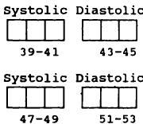
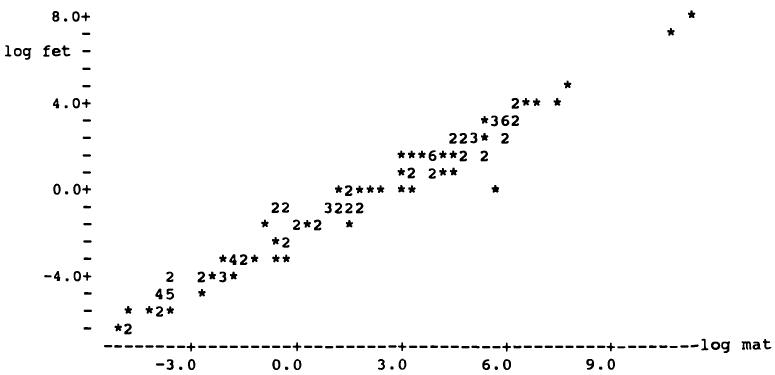

# 6 使用计算机  6 Using a computer  

好消息是统计分析正变得越来越容易和便宜。坏消息是统计分析正变得越来越容易和便宜。  
The good news is that statistical analysis is becoming easier and cheaper. The bad news is that statistical analysis is becoming easier and cheaper.  

Hofacker (1983)  
Hofacker (1983)  

## 6.1 引言  6.1 INTRODUCTION  

近期技术进步使得许多医学研究者能够接触到计算机。这一变化在很大程度上是有益的，但Hofacker上述的话语应牢记在心。计算机消除了统计分析中大部分繁琐的环节，并且应该给我们正确的答案，但它们并不能保证我们能获得正确且有效的结果。在本章中，我将探讨使用计算机进行统计分析的优缺点，并提出数据分析的方法。我还将讨论用于收集待计算机分析数据的表格设计。  
Recent technological advances have provided many medical researchers with access to a computer. This change has largely been beneficial, but Hofacker's words above should be borne in mind. Computers remove most of the tedious aspects of statistical analysis, and should give us correct answers, but they do not guarantee that we will obtain correct and valid results. In this chapter I shall consider the advantages and disadvantages of using computers for statistical analysis, and suggest ways to approach the analysis of data. I shall also consider the design of forms for collecting data to be analysed by computer.  

## 6.2 使用计算机的优点  6.2 ADVANTAGES OF USING A COMPUTER  

使用计算机进行统计分析有许多优点。最明显的是，它使我们能够完成原本无法完成的工作，但还有许多其他益处：  
There are many advantages in using a computer to carry out statistical analyses. Most obviously it enables us to do things we couldn't otherwise do, but there are many other benefits:  

### (a) 准确性和速度  (a) Accuracy and speed  

好的计算机程序（即软件）能迅速给出正确答案。手工分析容易出现计算错误，而且除了最简单的任务外，速度都慢得令人痛苦。  
Good computer programs (known as software) will give the correct answers quickly. Analysis by hand is prone to arithmetical errors, and is painfully slow for all but the simplest tasks.  

### (b) 多功能性  (b) Versatility  

计算机可以实现广泛的统计技术，远超本书所描述的范围。即使是复杂的分析也能快速完成。  
A computer gives access to a wide range of statistical techniques, many more than are described in this book. Even complex analyses can be performed quickly.  

### (c) 图形  (c) Graphics  

(c) 图形计算机程序可以方便地绘制观测值或统计结果图。应充分利用这一功能。直方图和散点图可用于检查原始数据（参见第7章），图表也可用于研究分析结果。第6.8节讨论了与计算机绘图相关的一些实际问题。  
(c) GraphicsComputer programs enable plots of observations or statistical results to be obtained easily. Full advantage should be taken of this facility. Histograms and scatter diagrams can be used to inspect the raw data (see Chapter 7), and plots can also be used to study the results from an analysis. Section 6.8 discusses some practical issues relating to computer plots.  

### (d) 灵活性  (d) Flexibility  

(d) 灵活性一个主要优点是能够进行微小修改并重复分析。例如，在数据转换后（可能通过取对数，参见第7章）重新运行分析，对数据子集执行相同的分析，或添加一些新的观测值，都非常简单。  
(d) FlexibilityA major advantage is the ability to make small changes and repeat the analysis. For example, it is simple to rerun an analysis after transforming the data, perhaps by taking logs (see Chapter 7), to perform the same analysis on a subset of the data, or to add some new observations.  

### (e) 新变量  (e) New variables  

(e) 新变量生成新变量很简单。我们可以根据受试者的出生日期和研究日期计算其年龄，或者通过计算治疗前后的测量值之差来确定测量值的变化，或者计算患者的症状数量。这些计算应始终在计算机上完成，这比手动计算更快、更准确。当然，如果创建新变量的指令不正确或输入错误，所有观测值都将是错误的。  
(e) New variablesIt is simple to generate new variables. We may calculate a subject's age from their date of birth and the date of the study, or the change in a measurement by taking the difference between pre- and post-treatment values, or count the number of symptoms a patient has. Such calculations should always be done on the computer, which is faster and more accurate than doing the calculations by hand. Of course, if the instruction to create a new variable is incorrect or is typed wrongly all of the observations will be wrong.  

### (f) 数据量  (f) Volume of data  

(V) 数据量可以处理大量数据。实际上，对于某些程序而言，可分析的受试者（案例）数量没有限制。  
(V) Volume of dataVast amounts of data can be handled. Indeed for some programs there is no limit to the number of subjects (cases) that can be analysed.  

### (g) 数据易于传输  (g) Easy transfer of data  

(g) 数据易于传输一旦数据被输入到计算机文件中，它们就可以在研究人员之间轻松传输，无论是通过电子方式（通过电话线）还是通过邮寄“软盘”。永远不应该需要将相同的数据输入计算机两次，但不幸的是，计算机使用各种不同的磁盘格式和尺寸。  
(g) Easy transfer of dataOnce data have been entered into a computer file they can easily be transferred between researchers either electronically (by telephone line) or by sending a 'floppy disk' by post. It should never be necessary to enter the same data into a computer twice, but unfortunately computers use a variety of disk formats and sizes.  

## 6.3 使用计算机的缺点  6.3 DISADVANTAGES OF USING A COMPUTER  

为了抵消主要的优点，统计软件用户应该注意几个潜在的问题。  
To counterbalance the major benefits there are several potential problems that users of statistical software should be aware of.  

### (a) 软件错误  (a) Errors in software  

(a) 软件错误并非所有统计程序都编写得很好。有些程序在某些情况下可能会给出不正确的答案，这可能是由于编程不佳或对统计理论理解不足造成的。建议使用信誉良好且存在时间足够长以发现错误的程序  
(a) Errors in softwareNot all statistical programs are well-written. Some may give incorrect answers in certain circumstances, either through poor programming or inadequate understanding of the statistical theory. It is advisable to use programs that are reputable and have been around long enough for errors  

其中最著名的是 BMDP、Minitab、SAS 和 SPSS。自微型计算机（PC）出现以来，市场上的统计程序数量大幅增加，其中一些质量较差，有些甚至不正确（Bland 和 Altman，1988；Dallal，1988）。第 6.4 节和第 6.5 节提供了关于选择和评估统计软件的建议。  
to be found, the best known of which are BMDP, Minitab, SAS and SPSS. Since the advent of microcomputers (PCs) there has been a huge increase in the number of statistical programs on the market, some of which are poor and some incorrect (Bland and Altman, 1988; Dallal, 1988). Sections 6.4 and 6.5 give advice about choosing and evaluating statistical software.  

### (b) 多功能性  (b) Versatility  

多功能性被认为是使用计算机的优点之一，但它也可能导致困难。由于可用的分析方法种类繁多，很容易使用不恰当的方法。了解自己统计知识的局限性至关重要，并且只使用自己理解的方法。如果您的问题似乎需要您不熟悉的方法，您应该寻求专家建议。  
Versatility was given as one of the advantages of using a computer, but it can lead to difficulties too. Because of the wide variety of analyses available, it is easy to use an inappropriate method. It is essential to be aware of the limits of your statistical knowledge, and to use only methods that you understand. If your problem seems to require methods you are not familiar with you should seek expert advice.  

### (c) 黑箱方法  (c) The black box approach  

使用计算机可能会让您与数据产生距离。统计分析可以自动进行：数据从一端输入，结果从另一端输出，不受人类思维的干预。由于许多统计分析都关注平均效应，您可能无法体会个体是如何响应的。  
Using a computer may distance you from your data. It is possible to perform statistical analyses automatically: the data go in at one end and the results come out at the other, untouched by human thought. Because much statistical analysis is concerned with average effects you may get no feel for the way individuals respond.  

### (d) 垃圾进，垃圾出  (d) Garbage in garbage out  

“垃圾进，垃圾出”指的是只有明智的问题才能得出明智的答案。如果数据输入或分析规范有误，那么结果也会是错误的。例如，一个常见的问题是如何处理缺失观测值。当数据输入计算机时，这些值有时会留空，在这种情况下，该值将自动被视为零；或者它们被赋予一个数字化的“缺失值代码”，例如99。通常会使用9、99、999等值作为缺失值，或者一个负数—任何值都可以，只要它明显不可能是真实的观测值。  
'Garbage in garbage out' refers to the fact that sensible answers follow only from sensible questions. If the data input or the specification of the analysis was wrong then the results will be wrong. For example, a common problem is what to do about missing observations. When data are entered into the computer such values are sometimes left blank, in which case the value will automatically be taken as zero, or they are given a numerical 'missing value code', such as 99. It is common to use values like 9, 99, 999, etc. as missing values, or perhaps a negative number - any value will do as long as it clearly could not be a genuine observation.  

表3.1显示了25名囊性纤维化患者的PImax值；平均值和标准差分别为92.6和24.92 cm $\mathrm{H}_2\mathrm{O}$。假设研究中还有另外五名患者的PImax未知。如果他们的值留空（零）或编码为999，并且所有30个值都由计算机程序分析，那么结果将如下：  
Table 3.1 showed the PImax values of 25 patients with cystic fibrosis; the mean and standard deviation were 92.6 and 24.92 cm  $\mathrm{H}_2\mathrm{O}$  respectively. Suppose that there had been five other patients in the study whose PImax was unknown. If their values were left blank (zero) or coded 999 and all 30 values analysed by a computer program then the results would have been as follows:  

<table><tr><td rowspan="2">缺失数据的值</td><td colspan="2">30名受试者的结果</td></tr><tr><td>均值</td><td>标准差</td></tr><tr><td>0</td><td>77.2</td><td>41.79</td></tr><tr><td>999</td><td>243.7</td><td>344.32</td></tr></table>  
<table><tr><td rowspan="2">Value for missing data</td><td colspan="2">Result for 30 subjects</td></tr><tr><td>Mean</td><td>SD</td></tr><tr><td>0</td><td>77.2</td><td>41.79</td></tr><tr><td>999</td><td>243.7</td><td>344.32</td></tr></table>  

这两者都严重扭曲了事实。计算机将接受0或999作为真实的观测值，从而给出错误的答案。缺失数据必须在程序中被识别出来（参见第6.6节）。  
both of which are major distortions of the truth. The computer will accept the values 0 or 999 as genuine observations, and so will give false answers. Missing data must be identified as such to the program (see section 6.6).  

当信息不适用于某些个体而非实际缺失时，也可能出现类似问题。例如，怀孕次数只适用于女性，在研究中可能对所有男性记录为9或99。这些例子表明了在分析前检查数据的重要性，正如第6.6节和下一章所讨论的。  
A similar problem may arise when information is not appropriate for some individuals rather than actually missing. For example, the number of pregnancies is only appropriate for women, and may be recorded as 9 or 99 for all males in a study. These examples show the importance of checking the data before analysis, as discussed in section 6.6 and in the next chapter.  

## 6.4 统计程序类型  6.4 TYPES OF STATISTICAL PROGRAM  

市售的统计软件通常能够执行多种类型的统计分析。统计程序，常被称为软件包，其功能和工作方式各不相同。需要考虑的一些更重要的方面是：  
Commercially available statistical software is generally capable of perform­ ing many types of statistical analysis. Statistical programs, often called packages, vary in their capability and the way in which they work. Some of the more important aspects to consider are:  

1. 可用的统计方法   
1. statistical methods available   
2. 准确性   
2. accuracy   
3. 可分析的最大数据量   
3. maximum amount of data that can be analysed   
4. 数据处理功能（包括编辑）   
4. facilities for data manipulation (including editing)   
5. 接受缺失数据的能力   
5. ability to accept missing data   
6. 易用性（是否“用户友好”？）   
6. ease of use (is it 'user-friendly'？)   
7. 成熟度（是否经过反复试验和验证？）   
7. maturity (is it tried and tested？)   
8. 速度   
8. speed   
9. 文档   
9. documentation   
10. 错误处理   
10. error handling   
11. 图形功能   
11. graphics capability   
12. 输出质量   
12. quality of output   
13. 成本。  
13. cost.  

最重要的考虑因素是上述列表中的前两项，因为你显然需要一个能够执行所需分析并获得正确结果的软件包。然而，评估准确性并不容易。其他关键问题包括简单创建图表的能力，以及在你犯错时（这会经常发生）提供有用的错误信息。此外，告诉程序你想要做什么的方式也不同。在某些软件包中，你输入诸如  
The most important considerations are the first two in the above list. because you obviously need a package that will perform the analyses desired and achieve correct results. However, assessing accuracy is not easy. Other key issues are the ability to create plots simply, and helpful error messages when you make a mistake, as you often will. In addition. there are different ways of telling the program what you want done. In some packages one enters commands such as  

 **plot height age**  
**plot height age**  

之类的命令，但在其他软件包中，你从选项菜单中选择。这被称为交互式系统。对于使用命令的程序，通常可以创建一个命令文件，然后作为一个整体执行。这样做的好处是，可能复杂的指令只需  
but in others one chooses from a menu of options. This is known as an interactive system. For programs that use commands it is usually possible to create a file of commands which can then be executed as a block. This has the advantage that possibly complicated instructions only have to be  

输入一次，并且可以轻松编辑文件以生成略有不同的分析。  
typed once, and that it is easy to edit the file to produce slightly different analyses.  

除了涵盖广泛分析的统计软件包外，还有一些用于特定目的的专业程序，例如计算样本量或置信区间。这些程序也受上述某些要求的影响，但主要应根据它们执行常规软件包无法完成的特定能力来判断。  
As well as statistical packages, which cover a wide range of analyses, there are also some specialized programs for particular purposes, such as calculating sample sizes or confidence intervals. These are subject to some of the above requirements too, but should be judged mainly on their specific ability to do things that cannot be done in the usual packages.  

在选择或购买软件包之前，最好向同事或统计学家寻求建议。我强烈建议你将所有分析都使用同一个软件包，因为即使是熟悉一个软件包也需要付出相当大的努力。因此，仔细选择你的软件非常重要。很少有（如果有的话）软件包能执行本书中的所有分析，因此有必要了解你可能希望进行的所有分析类型，这绝非易事。市场上有许多微型计算机统计程序（甚至免费的）可能会给出不正确的结果（Dallal, 1988），因此如果你对某个特定的统计程序有疑问，建议将其输出与另一个程序进行比较。  
It is worth seeking advice from a colleague or from a statistician before choosing a package to use, or buy. I strongly recommend that you use the same package for all your analyses, as it takes a considerable effort to become fully acquainted with even one package. So it is important to choose your software carefully. Few, if any, packages will perform all the analyses in this book, so that it is necessary to know all the types of analysis you might wish to do, which is not at all easy. There are many microcomputer statistics programs on the market (or even free) that can give incorrect results (Dallal, 1988), so if you have doubts about a particular statistical program it is advisable to compare its output with that from another.  

下一节将讨论评估统计软件的某些方面。如果你知道自己拥有可靠的软件，那么你可以继续阅读6.6节，该节描述了一种通用的分析策略。  
The next section discusses some aspects of evaluating statistical software. If you know that you have reliable software then you can go on to section 6.6, which describes a general strategy for analysis.  

## 6.5 评估统计软件包  6.5 EVALUATING A STATISTICAL PACKAGE  

（本节可省略，不影响连贯性。）  
(This section can be omitted without loss of continuity.)  

评估统计计算程序时，主要关注点是：  
The main concerns when evaluating a statistical computer program are:  

1. 它是否能执行所有所需功能？  
1. Does it perform all the desired functions？  

2. 它是否易于使用？  
2. Is it easy to use？  

3. 它是否给出正确答案？  
3. Does it give the correct answers？  

同事或统计学家的建议在回答前两个问题时会大有帮助，因为需要对一个软件包有一定熟悉度才能真正判断其价值和易用性。第6.4节中给出的功能列表可以帮助评估。本节的目的是为上述第(3)点提供有限的帮助。  
Advice from colleagues or from a statistician can be of great assistance in answering the first two questions, because it takes some familiarity with a package before one can really judge its value and ease of use. The list of features given in section 6.4 can aid evaluation. The purpose of this section is to give limited assistance in relation to (3. ) above.  

计算机程序给出错误答案，可能是因为它使用了不正确的公式，也可能是因为它编写得不好。前者不太可能但有可能发生。更常见的问题是由于程序编写方式不当。计算机程序执行给定计算的过程称为算法。有些算法较差，因为它们在某些情况下会失去准确性。举一个简单的例子，可以证明三个数 $x$、$x + c$ 和 $x + 2c$ 的标准差是 $c$，无论我们给 $x$ 和 $c$ 赋什么值。我  
A computer program may give the wrong answers either because it uses an incorrect formula or because it is not well written. The former is unlikely but possible. More often problems occur because of the way in which the program was written. The procedure by which a computer program performs a given calculation is known as an algorithm. Some algorithms are inferior in that they lose accuracy in some circumstances. To take a simple example, it can be shown that the standard deviation of three numbers  $x$ ,  $x + c$  and  $x + 2c$  is  $c$ , whatever values we give  $x$  and  $c$ . I  

使用两台袖珍计算器计算了三组数字的标准差，其中 $\pmb{x}$ 增加而 $c$ 保持在0.1。对于以下四组数字中的每一组：  
calculated the standard deviations of sets of three numbers where  $\pmb{x}$  increases but  $c$  is held at 0.1 using two pocket calculators. For each of the four sets of numbers  

(a) 7.0 7.1 7.2  
(a) 7.0 7.1 7.2  

(b) 77.0 77.1 77.2  
(b) 77.0 77.1 77.2  

(c) 777.0 777.1 777.2  
(c) 777.0 777.1 777.2  

(d) 7777.0 7777.1 7777.2  
(d) 7777.0 7777.1 7777.2  

两台计算器都给出了0.1的正确答案，但对于数据集  
both gave the correct answer of 0.1, but for the set  

(e) 77777.0 77777.1 77777.2  
(e) 77777.0 77777.1 77777.2  

一台计算器给出的标准差为0.0，而另一台则报错—它无法计算标准差。出现这个问题的原因是，在极端情况下，计算器会因为无法存储数据平方后得到的大数而失去精度。有一些算法可以避免这个问题，虽然我们可能不期望它们在袖珍计算器上使用，但我们肯定期望计算机程序能为这类数据给出正确答案。然而，许多微型计算机软件包使用了较差的算法（Dallal, 1988）。在一些复杂的分析中也存在失去数值精度的风险；回归分析中的问题将在第12章讨论。  
one calculator gave the standard deviation as 0.0 while the other gave an error - it would not calculate the standard deviation. The reason for this problem is that in extreme circumstances the calculator loses accuracy because it cannot store the large numbers obtained when the data are squared. There are algorithms that avoid this problem, and while we may not expect them to be used on a pocket calculator we would certainly expect a computer program to give the correct answers for such data. However,  many  microcomputer  packages  use  the  inferior  algorithm (Dallal, 1988). There is also a risk of losing numerical accuracy in some complex  analyses;  problems  with  regression  analysis  are  discussed in Chapter 12.  

电子表格软件越来越多地被用于执行简单的统计分析。这些程序不太适合统计学，并且可能使用劣质或不正确的方法。我不推荐它们用于严肃的统计分析。  
Increasing use is being made of spreadsheet software for performing simple statistical analyses. These programs are not well suited to statistics, and may use inferior or incorrect methods. I do not recommend them for serious statistics.  

对于某些类型的分析，需要考虑的另一个方面是，当有不同形式的检验可用时，应使用哪种形式。后续章节将讨论诸如单侧和双侧检验、连续性校正的使用，以及秩分析（非参数方法）中对并列值的调整等问题。了解程序使用的具体方法非常重要，而这一点在手册中并不总是很清楚。事实上，有些手册甚至具有误导性（Bland and Altman, 1988）。  
Another aspect to consider for some types of analysis is which form of a test is used when there are different forms available. Subsequent chapters will discuss matters such as one and two- sided tests, the use of continuity corrections, and the adjustment for ties in analyses of ranks (non- paramet­ ric methods). It is important to know precisely what method the program uses, and this is not always clear from the manual. Indeed some manuals are positively misleading (Bland and Altman, 1988).  

首次使用软件包执行特定分析时，建议先分析一些您已知答案的数据集。本书中，尽可能提供了已完成示例的原始数据，以便您进行此操作。  
When using a package to perform a particular analysis for the first time it is advisable to begin by analysing some sets of data for which you already know the answers. In this book the raw data are given for the worked examples wherever possible to enable you to do this.  

## 6.6 计算机辅助分析策略  6.6 STRATEGY FOR COMPUTER-AIDED ANALYSIS  

本节包含在计算机上分析数据的广泛策略。请注意，在进入数据分析之前，有几个步骤需要完成。  
This section contains a broad strategy for analysing data on a computer. Notice that there are several steps to pass through before moving to the analysis of the data.  

### (a) 数据收集  (a) Data collection  

(a) 数据收集第6.7节描述了为将要输入计算机的数据准备编码表的几个方面。如果有一个精心设计的编码表，数据输入将更快、更准确。  
(a) Data collectionSection 6.7 describes several aspects of preparing a coding sheet for data that are going to be typed into a computer. Data entry will be much quicker and more accurate if there is a well-designed coding form to work from.  

### (b) 数据输入  (b) Data entry  

(b) 数据输入数据应输入到计算机文件。这可以在统计软件包中完成，也可以使用通用编辑程序完成。存储数据的原因是，你通常需要在以后进行进一步分析，而你只想输入一次数据。此外，列出数据并检查数值是否正确输入也很容易。我在第6.7节中讨论了数据文件的格式。不能从文件读取数据的统计软件包应该被拒绝。  
(b) Data entryData should be typed into a file on the computer. This may be possible within the statistics package or using a general purpose editing program. The reason for storing the data is that you will often need to carry out further analyses at a later date, and you only want to enter the data once. Also it is easy to list the data and check that the values have been entered correctly. I consider formats for data files in section 6.7. A statistical package that cannot read data from a file should be rejected.  

### (c) 数据核查  (c) Data checking  

(c) 数据核查人们倾向于认为一旦数据进入计算机就一定是正确的。事实上，无论多么小心，在输入（打字）数据时都太容易出错。因此，无论多么繁琐，核查数据是否正确输入至关重要。最大限度地减少错误的最佳方法是将数据输入两次，最好由两个不同的人输入。在这里，有一个比较文件的程序会很有用。两个文件之间的任何差异都会被检查，并获得正确的值。数据核查在第7.2节中讨论。  
(c) Data checkingThere is a tendency to believe that once the data are on the computer they must be correct. In fact it is all too easy to make errors when entering (typing) data, however careful one is. It is essential to check that the data have been typed correctly, however tedious this may be. The best way to minimize errors is to have the data entered twice, preferably by two different people. Here it is useful to have a program for comparing files. Any differences between the two files are checked and the correct value obtained. Data checking is discussed in section 7.2.  

### (d) 数据筛选  (d) Data screening  

(d) 数据筛选在开始主要统计分析之前，查看数据很重要。生成每个变量的直方图是一项简单的任务，并且可以通过散点图检查成对的变量。这些图将初步显示平均值、变异性、分布形状以及是否存在任何异常值或缺失值。数据筛选在第7.5节中讨论。  
(d) Data screeningBefore starting the main statistical analysis it is important to look at the data. It is a simple task to produce a histogram of each variable, and pairs of variables can be inspected by scatter diagrams. These plots will give a first idea of the average value, the variability, the shape of the distribution, and whether there are any outlying or missing values. Data screening is discussed in section 7.5.  

### (e) 数据分析  (e) Data analysis  

适当的统计分析形式通常会直接根据研究设计得出。特别是，变量的值可以在组间或组内进行比较，如第5章所讨论的。组内比较必须使用针对该类型数据的方法。  
The appropriate form of statistical analysis will often follow directly from the design. In particular, values of a variable may be compared between groups or within a group, as discussed in Chapter 5. Within group comparisons must make use of techniques intended for that type of data.  

研究目标应指明几个主要的感兴趣分析。尽管预先指定的分析是最重要的，但检查数据可能会提示一些额外的感兴趣分析。这些“探索性”分析的结果应谨慎解释（参见第8章）。  
The objectives of the study should indicate a few main analyses of interest. Although the pre- specified analyses are the most important ones, inspection of the data may suggest some additional analyses of interest. The results of these 'exploratory' analyses should be interpreted cautiously (see Chapter 8).  

许多统计方法都基于对数据的某些假设。  
Many statistical methods are based on certain assumptions about the  

这可能需要进一步的分析来验证这些假设。  
data. These may require further analyses to verify them.  

我强烈建议，如果软件有此功能，您应保留计算会话的“日志”，其中显示输入命令和结果。当命令未存储在文件中时，这一点尤为重要。  
I strongly recommend that you keep a 'log' of the computing session if the software has the facility, in which both the input commands and results are shown. This is especially important when the commands are not stored on a file.  

### (f) 结果核查  (f) Checking results  

您应该核查结果是否与正确的观察数量相关—令人惊讶的是，在不知不觉中丢失或增加几个病例是很容易的。重要的是要认识到，从计算机获得的结果不应被视为自动正确。对数据进行简单的初步检查应该能让您对预期结果有所了解。如果获得的结果与预期显著不同，那么您应该检查数据中是否存在错误，以及是否执行了正确的分析。在尝试分析数据时，尤其是在进行复杂分析时，很容易犯错。只有当您提出正确的问题时，计算机才会给出正确的答案。显然，如果分析有日志，如上所述，核查结果会容易得多。  
(f) Checking resultsYou should check that the results relate to the correct number of observations – it is surprisingly easy to lose or gain a few cases unwittingly. It is important to appreciate that the results obtained from a computer should not be taken as automatically correct. Simple preliminary inspection of the data should give you some idea of what results to expect. If the results obtained differ markedly from expectation, then you should check that there are no errors in the data, and that the proper analysis has been performed. It is easy to make mistakes when trying to analyse data, especially with complex analyses. The computer will give you the correct answer only if you ask the correct question. Clearly it is much easier to check results when there is a log of the analysis, as suggested above.  

### (g) 结果解释  (g) Interpretation  

结果的解释将在后续章节中讨论。  
(g) InterpretationInterpretation of results is discussed in subsequent chapters.  

## 6.7 数据收集表格  6.7 FORMS FOR DATA COLLECTION  

当需要收集数据以便后续使用计算机进行分析时，最好使用带有指定框（用于每个数字）的标准表格。这适用于从现有记录（如医院病历）中提取数据的研究，也适用于前瞻性研究。当为每个个体收集许多变量的信息时，这一点尤为重要。  
When data are to be collected for subsequent analysis using a computer, it is a good idea to use a standard form with assigned boxes for each digit. This applies to studies where data are to be extracted from existing records, such as hospital notes, as well as to prospective studies. It is especially important when information on many variables is collected for each individual.  

我将首先考虑计算机程序可以从文件中接受（读取）数据的替代方式，然后讨论表格设计的各个方面。Pocock (1983, pp. 160-6)、De Pauw 和 Buyse (1984)（特别提及癌症试验）以及 Armitage 和 Berry (1987, pp. 8-14) 对表格设计进行了进一步讨论。  
I shall first consider alternative ways in which computer programs can accept (read) data from a file, and then aspects of form design. Further discussion of form design is given by Pocock (1983, pp. 160- 6), De Pauw and Buyse (1984) (with special reference to cancer trials) and Armitage and Berry (1987, pp. 8- 14).  

### 6.7.1 计算机程序输入格式  6.7.1 Formats for input to computer programs  

大多数软件包都能读取的一种标准格式（称为自由格式）如图6.1所示，该图展示了一项比较两种降压药物试验数据的开头部分。在此，文件的每一行包含一个受试者的多个变量，并且每个信息项都通过一个或多个空格与下一个信息项分隔开。虽然本例中各列无需垂直对齐，但我建议这样做  
6.7.1 Formats for input to computer programsA standard format (called free format) that most packages will read is shown in Figure 6.1 which illustrates the first part of the data from a trial comparing two antihypertensive drugs. Here each row of the file contains several variables for one individual and each item of information is separated from the next by one or more spaces. There is no necessity for the columns to line up vertically as in this example, but I recommend this  

001 17 02 89 25 11 33 1 2 170.2 77.1 141 82 129 79 002 21 02 89 02 02 44 1 1 162.3 80.8 150 85 144 81 003 28 02 89 14 06 40 2 2 151.9 72.2 142 79 142 76 004 05 03 89 01 12 28 1 1 178.8 91.4 181 101 155 87 005 11 03 89 18 05 48 1 1 166.0 81.8 170 90 158 84 006 12 03 89 24 09 37 2 1 171.4 73.3 139 82 134 78 007 17 03 89 07 04 36 2 2 155.8 61.5 184 107 177 102 008 20 03 89 12 02 38 1 2 185.2 100.6 157 93 150 88  
001 17 02 89 25 11 33 1 2 170.2 77.1 141 82 129 79 002 21 02 89 02 02 44 1 1 162.3 80.8 150 85 144 81 003 28 02 89 14 06 40 2 2 151.9 72.2 142 79 142 76 004 05 03 89 01 12 28 1 1 178.8 91.4 181 101 155 87 005 11 03 89 18 05 48 1 1 166.0 81.8 170 90 158 84 006 12 03 89 24 09 37 2 1 171.4 73.3 139 82 134 78 007 17 03 89 07 04 36 2 2 155.8 61.5 184 107 177 102 008 20 03 89 12 02 38 1 2 185.2 100.6 157 93 150 88  

等等  
etc  

图6.1 适用于统计计算机程序输入的数据布局示例。不同项目之间用一个或多个空格分隔，各列中的数字对齐。各列依次包含患者编号、入组日期、出生日期、性别、治疗、身高、体重、初始血压（收缩压和舒张压）以及最终血压。  
Figure 6.1 An example of a generally applicable style of data layout for entry into a statistical computer program. Different items are separated by one or more spaces and the figures in each column are aligned. The columns contain, in sequence, patient number, date of entry to study, date of birth, sex, treatment, height, weight, initial blood pressure (systolic and diastolic) and final blood pressure.  

这种做法，因为它便于目视检查所有信息是否已正确输入。我强烈建议使用代码编号来识别每个受试者，如图6.1所示。这使得检查任何可疑值、在以后添加额外变量、检查是否有人重复入组等操作变得容易。  
practice as it makes it easy to check visually that all information has been entered correctly. I strongly recommend that a code number is used to identify each subject, as in Figure 6.1. This makes it easy to check any suspicious values, to add extra variables at a later date, to check that nobody is in the study twice, and so on.  

与自由格式相对的是固定格式，在这种格式中，数据文件中的项目无需用空格分隔。这种格式的缺点是，必须告知程序所使用的精确格式，如果您不熟悉计算机编程，这可能会很复杂。使用固定格式时，您可以使用空白来表示缺失数据，但这是一个糟糕的主意，因为空白无法与因疏忽造成的遗漏区分开来。此外，大多数程序会将空白解释为零，这可能导致灾难性后果（如第6.3节所示）。固定格式文件在磁盘上占用的空间略少，但这并没有实际意义。并非所有软件包都能接受固定格式的数据，而且无论如何，自由格式更容易处理。  
The alternative to free format is fixed format, in which items need not be separated by spaces in the data file. The disadvantage of this format is that it is necessary to tell the program the precise format used, and this can be complicated if you are unused to computer programming. With fixed format you can use blanks to indicate missing data, but this is a bad idea as a blank cannot be distinguished from an omission due to oversight. Also, most programs will interpret blanks as zero, which is potentially disastrous (as shown in section 6.3). Fixed format files occupy slightly less space on the disk, but this is of no real practical consequence. Not all packages can accept data in fixed format, and in any case free format is easier to deal with.  

统计程序要求每个受试者的每个变量都有一个值，因此自由格式的一个优点是，即使值缺失，您也需要输入某个量。不能使用空白，因为空白用于分隔相邻项目。有些程序具有一项有用的功能，允许您在文件中用特殊符号（如？或*）指示缺失数据。否则，您必须给缺失数据一个该变量不可能取到的数值，例如-1或99，然后记住向程序给出适当的指令以指示  
Statistical programs require a value for every variable for each subject, so a good feature of free format is that you will need to enter some quantity even when a value is missing. A blank cannot be used because blanks are used to separate adjacent items. Some programs have the useful facility of letting you indicate missing data in the file by a special symbol, such as ？ or *. Otherwise you must give missing data a numerical value which is impossible for that variable, perhaps - 1 or 99, and then remember to give the appropriate instruction to the program to indicate  

缺失值代码。如果一个统计软件包没有缺失值代码功能，那它将是不可接受的。  
the missing value code. The absence of a missing value code facility would make a statistical package unacceptable.  

当每个个体的数据量过大，无法适应屏幕宽度（80个字符）时，程序有多种处理方式。您需要查阅您的手册。  
There is a variety of ways in which programs can handle the situation where you have too much data for each individual to fit onto the width of your screen (80 characters). You will need to consult your manual.  

### 6.7.2 表格设计  6.7.2 Form design  

图6.2展示了一个可用于收集图6.1所示数据的表格。其中一些特点已经描述过，例如受试者的识别码。每个方框组旁边的数字表示数据输入计算机时，从行首开始的字符数。缺失的数字表示每条信息之间有一个空格，表明数据将采用自由格式。请注意，患者姓名不应输入到计算机文件中。  
Figure 6.2 shows a form that could have been used to collect the data shown in Figure 6.1. Some of its features have been described already, such as the subject's identifying code number. The numbers associated with each group of boxes indicate the number of characters from the start of the line when the data are typed into the computer. The missing numbers mean that there is a blank between each piece of information, indicating that the data will be in free format. Note that the patient's name should not be entered into the computer file.  

患者姓名  
Patient's name  

患者编号  
Patient's number  

入组日期  
Date of entry to study  

出生日期  
Date of birth  

性别（1=男，2=女）  
Sex (1=Male, 2=Female)  

药物（1=安德普文，2=多利普文）  
Drug (1=Andreprevin, 2=Doryprevin)  

身高（厘米）  
Height (cm)  

体重（千克）  
Weight (kg)  

初始血压 (mm Hg)  
Initial Blood Pressure (mm Hg)  

最终血压 (mm Hg)  
Final Blood Pressure (mm Hg)  

  

  
图6.2 用于收集比较两种降压药物试验数据的一部分表格，对应图6.1中的数据。  
Figure 6.2 Part of a form to collect data for a trial comparing two antihypertensive drugs, corresponding to the data in Figure 6.1.  

用于记录数据的表格设计方式需要仔细考虑。分类变量和连续变量会带来不同的问题。  
The way in which forms are designed for recording data needs careful thought. Categorical and continuous variables pose different problems.  

#### (a) 分类数据  (a) Categorical data  

应为每个可能的类别分配一个数字，例如：  
A number should be assigned to each possible category, as in the following examples:  

糖尿病： $\mathbf{1} = \mathbf{Y}\mathbf{e}\mathbf{s}$ $2 = \mathbf{N}\mathbf{o}$ 血型： $\mathbf{1} = \mathbf{A}$ $2 = \mathbf{B}$ $3 = \mathbf{A}\mathbf{B}$ $4 = 0$  
Diabetes:  $\mathbf{1} = \mathbf{Y}\mathbf{e}\mathbf{s}$ $2 = \mathbf{N}\mathbf{o}$  Blood group:  $\mathbf{1} = \mathbf{A}$ $2 = \mathbf{B}$ $3 = \mathbf{A}\mathbf{B}$ $4 = 0$  

我强烈建议所有代码都直接印在表格上，而不是单独放在一张纸上。图6.2展示了两个简单的例子。如果需要使用大于九的编码，则需要第二个框。  
I strongly recommend that all the codes are on the form itself rather than on a separate sheet. Two simple examples are shown in Figure 6.2. If it is necessary to use codes higher than nine, a second box will be needed.  

当使用固定格式时，建议避免使用零作为代码，因为某些程序无法区分零和未填写的空白框。对于自由格式输入，这不是问题，因为每个变量都必须输入一个数字。  
It is advisable to avoid zero as a code when fixed format is used, as some programs do not distinguish 0 from a blank corresponding to a box which has not been filled in. This is not a problem for free format input, as some number must be entered for every variable.  

有些变量可能有多个非互斥的答案，例如既往治疗或伴随治疗。在这种情况下，需要为每个感兴趣的可能答案设置一个“是/否”框。在可能的情况下，最好使用一致的代码。例如，所有“是”或“否”的回答都应使用相同的代码。  
Some variables have several possible non- mutually exclusive answers, such as prior or concomitant therapy. Here it is necessary to have one yes/no box for each possible answer of interest. It is desirable to have consistent codes where possible. For example, all questions with yes or no answers should use the same codes.  

有些程序允许分类数据使用字母而非数字。例如，性别可以输入为M或F，药物可以输入为A或D。这有一些优点，但意味着数据文件并非所有程序都能接受。  
It is possible with some programs to use letters instead of numbers for categorical data. Thus sex could be entered as M or F, and drug as, say, A or D. This has some advantages, but means that the data file will not be acceptable to all programs.  

#### (b) 连续数据  (b) Continuous data  

测量值应以其测量的相同精度记录—在记录前四舍五入数值没有任何好处。在记录数据时，通常也不宜将连续变量分类，例如通过将数值代码分配给数值范围。为了统计分析，最好将数据记录得尽可能精确。每个数字应留一个方框，如果相关，应显示小数点的位置，如图6.2中的身高和体重。小数点不必有自己的方框；如果此处省略，我们在分析前需要将所有身高和体重除以10。在表格上注明使用的单位很有用，尤其是在有常用替代单位的情况下。  
Measurements should be recorded to the same accuracy as that to which they are measured - there is no advantage in rounding values before recording them. Nor is it usually a good idea to categorize continuous variables when recording data, for example by allocating numeric codes to ranges of values. For statistical analysis it is desirable to have the data recorded as precisely as possible. One box should be allowed for each digit, and the location of the decimal point should be shown if relevant, as for height and weight in Figure 6.2. The decimal point does not have to have its own box; if it were omitted here we would need to divide all heights and weights by 10 before analysis. It is useful to indicate on the form the units used, especially where there are alternatives in common use.  

每个方框只能填一个数字，因此必须为可能记录的最大值预留足够的方框。因此，对于成年人体重的公斤数，小数点前我们应该预留三个方框，因为有些人体重超过 $100\mathrm{kg}$。即使第一个方框最终从未使用，也无关紧要。  
Only one digit should go in each box, so it is essential to allow enough boxes for the largest value that could be recorded. Thus we ought to allow three boxes before the decimal point for adult body weight in kg because some people weigh more than  $100\mathrm{kg}$  . It will not matter if it turns out that the first box is never used.  

填写表格的人应理解使用  
Whoever fills in the forms should understand the importance of using the  

右侧方框的重要性，当并非所有方框都需要时。因此，低于100的舒张压必须写在三个可用方框的第二和第三个。  
right- hand boxes when not all boxes are needed. Thus diastolic blood pressure below 100 must be written in the second and third of the three available boxes.  

#### (c) 日期  (c) Dates  

英国常用的日期顺序是日、月、年，如图6.2所示，但在美国是月、日、年。在表格上注明所需的顺序很重要。  
The usual British ordering of dates is day, month, year, as shown in Figure 6.2, but in the USA it is month, day, year. It is important to indicate on the form which order is required.  

实际上，年、月、日的顺序是一个不错的选择，除了它不常见之外，因为它允许数据通过将日期作为六位数字简单地排序。  
In fact the order year, month, day is a good option, apart from its unfamiliarity, as it allows the data to be sorted simply by using the date as a six digit number.  

#### (d) 缺失数据  (d) Missing data  

如果您的程序接受用于此目的的符号，例如 `*`，则可以使用此符号，但这可能意味着您的文件无法被任何其他统计程序读取。否则，应使用特殊的数字代码。最常见的方法是用九位数字填充每个框，以便将未知血压记录为 999，未知性别记录为 9。  
If your program will accept a symbol for this purpose, such as \*, then this can be used, but it will mean that your file may not be readable by any other statistical program. Otherwise a special numeric code should be used. The most common method is to fill each box with nines, so that unknown blood pressure is recorded as 999 and unknown sex as 9.  

### 6.7.3 多重表格  6.7.3 Multiple forms  

临床数据通常在受试者每次就诊时获取，例如在怀孕期间。当患者就诊频率不同时，所研究受试者之间的信息量也会不同。图 6.1 暗示每个受试者应有相同的信息量。尽管可以使用称为数据库的软件类型存储每个受试者不等量的数据，但大多数统计计算机程序只能处理所有受试者都具有相同信息的数据集（称为矩形数据）。在分析开始之前，有必要对这些数据集进行一些汇总。  
Clinical data are often obtained from a subject each time they are seen, for example during pregnancy. When patients are not seen equally often there will be varying amounts of information among the subjects being studied. It is implicit in Figure 6.1 that there should be the same amount of information about each subject. Although unequal amounts of data per subject can be stored using a type of software known as a database, most statistical computer programs can only deal with data sets where the same information is available for all subjects (called rectangular data). Some summarizing of such data sets will be necessary before analysis can begin.  

绝不应采取将每次就诊视为一个单独数据集的简单权宜之计—将来自一名患者的多条记录视为来自多名患者是完全无效的。在规划研究时，即使是基于检查病历的回顾性研究，也应考虑数据量。这类数据可能极难为统计分析进行适当组织。如果需要从每个受试者收集多组数据，我建议寻求专家协助。  
The simple expedient of treating each visit as a separate data set should never be adopted - it is completely invalid to treat multiple records from one patient as if they were from several patients. The amount of data should be considered when the study is being planned, even for retrospective studies based on examining case notes. This type of data can be extremely difficult to organize appropriately for statistical analysis. I recommend expert assistance if it is necessary to collect multiple sets of data from each subject.  

### 6.7.4 文件数据分析  6.7.4 Analysis of data on a file  

上述格式的结果是，在计算机文件中，每一行代表一个个体，不同变量位于不同的列中。在许多分析中，我们希望比较受试者的亚组，因此有必要  
A consequence of the formats described above is that on the computer file each row represents an individual, with different variables in columns. In many analyses we wish to compare subgroups of subjects, so it is necessary  

程序接受所有值都在单个列中，并且亚组指示符在不同列中的数据。例如，对于图 6.1 和图 6.2 中显示的数据，我们希望比较接受不同治疗的患者的最终血压。有些程序期望要比较的数据集位于不同的列中，在这种情况下，它们不适合对以所述方式存储在文件中的数据进行统计分析。这是评估统计软件时需要考虑的另一个特点。  
for the program to accept data where all the values are in a single column, and an indicator of the subgroup is in a different column. For example, for the data shown in Figures 6.1 and 6.2 we would wish to compare final blood pressures for patients receiving the different treatments. Some programs expect sets of data to be compared to be in different columns, in which case they would be unsuitable for statistical analysis of data stored in files in the manner described. This is a further feature to be considered when evaluating statistical software.  

## 6.8 绘图  6.8 PLOTTING  

绘图能力是使用计算机的一大优势。无论是屏幕绘图还是纸张绘图，都可以生成两种类型的图表—线图或高分辨率图。第一种方法使用常规的“字母数字”字符集，并将每个点尽可能地放置在其正确位置附近，而第二种方法则利用计算机的图形功能来生成更精确的图表。图 6.3 显示了图 11.4 中数据的线图；大多数统计软件包都可以生成线图。重合点通常通过显示点数（最多 9 个）来表示。通常很难指定轴的刻度并指示不同的组。大多数统计软件包可以绘制直方图和散点图，有些可以生成箱线图或茎叶图。线图在数据分析时非常有用，但它们并非顶级质量。直到最近，很少有统计软件包能够生成高分辨率图，但改进的图形功能正变得越来越普遍。本书中的图表是  
The ability to plot data is a major advantage of using a computer. There are two types of plot that can be produced, whether plotting on the screen or on paper - a line plot or a high- resolution plot. The first method uses the usual 'alphanumeric' character set and places each point as near as possible to its correct location, while the second uses the graphical capability of the computer to give a much more accurate plot. Figure 6.3 shows a line plot of the data shown in Figure 11.4; line plots can be produced by most statistical packages. Coincident points are usually indicated by showing the number of points (up to 9). It is often difficult to specify the scaling of axes and to indicate different groups. Most statistical packages can plot histograms and scatter diagrams, and some can produce box- and- whisker or stem- and- leaf plots. Line plots are very useful when analysing data, but they are not of top quality. Until recently few statistical packages could produce high- resolution plots, but improved graphical facilities are becoming more common. The figures in this book were  

  
图 6.3 图 11.4 中所示数据的线图，显示了哺乳动物的母体体重对数与胎儿体重对数的关系。  
Figure 6.3 Line plot of data shown in Figure 11.4 relating log maternal weight to log fetal weight in mammals.  

是在个人电脑上（使用 STATA 软件包）生成并用高分辨率激光打印机打印的。  
produced on a personal computer (using the package STATA) and printed on a high- resolution laser printer.  

## 6.9 计算机的其他用途  6.9 OTHER USES OF COMPUTERS  

计算机最主要的统计学价值显然在于数据分析，以及如前所述的图形制作。然而，还有一些其他有用的应用，主要与随机数有关。  
The obvious main statistical value of computers is in the analysis of data and, as just indicated, for producing graphs. However, there are some other applications which can be useful, mostly relating to random numbers.  

我们在第 5 章中看到了随机分配在研究中的重要性，尤其是在临床试验中治疗方案的分配。表 B13 可用于此目的，它是通过一个计算机程序生成的，该程序使用一种算法，能够产生一系列与随机数具有几乎相同特性的数字。使用表格的缺点是，每次都必须使用同一组数字，尽管可以从表格中的任意位置开始。更好的方法是每次使用合适的算法生成新的随机数，许多统计程序都可以做到这一点。算法的质量各不相同，但所有算法都可能足以用于治疗分配。  
We saw in Chapter 5 the importance of random allocation in research, especially for allocation of treatments in clinical trials. Table B13, which can be used for this purpose, was generated by a computer program using an algorithm that produces a sequence of numbers which have virtually the same properties as random numbers. The disadvantage of using a table is that you must use the same set of numbers each time, although you can start at an arbitrary place in the table. It is better to generate new random numbers each time using a suitable algorithm, and many statistical programs can do this. Algorithms vary in quality, but all are likely to be good enough for treatment allocation.  

表 B13 中的数字是 0 到 9 范围内的数字，因此它们是来自均匀分布的随机样本，如第 4 章所述。有时我们希望从其他分布中获取随机样本，特别是正态分布，以便在已知条件下研究变异性。图 4.7 中就看到了这种用途的一个例子，它显示了来自标准正态分布的 50 个随机样本。有几个程序可以从正态分布中生成随机样本。  
The numbers in Table B13 are digits in the range 0 to 9, and are thus a random sample from a Uniform distribution, as described in Chapter 4. Sometimes we wish to obtain a random sample from some other distribution, especially the Normal distribution, in order to study variability under known conditions. An example of this use was seen in Figure 4.7 which showed random samples of size 50 from a standard Normal distribution. Several programs can generate random samples from a Normal distribution.  

研究在特定情况下会发生什么，是被称为模拟的一种方法的简单示例。其思想是研究在关于过程性质的某些假设下会发生什么，以及改变假设会产生什么影响。第 8 章中使用了模拟来阐明从具有特定特征的总体中抽取的样本之间的变异性。  
Investigating what happens in a defined situation is a simple example of an approach known as simulation. The idea is to study what happens under certain assumptions about the nature of a process, and what the effect is of varying the assumptions. Simulation is used in Chapter 8 to illustrate variability among samples drawn from a population with specified characteristics.  

## 6.10 计算机的滥用  6.10 MISUSES OF THE COMPUTER  

本章前面已经提到了一些使用计算机的缺点。还有三种应避免的计算机滥用。  
Some disadvantages of using computers were given earlier in this chapter. There are three further misuses of computers that should be avoided.  

### (a) “数据挖掘”  (a) 'Data-dredging'  

许多研究有明确定义的目标，但也会收集其他信息，因为它们“可能有趣”。特别是在目标不明确的研究中，人们很容易进行大量的统计分析，希望能够发现一些有趣的东西。正如我们将在第 8 章中看到的那样，在  
Many studies have clearly defined objectives, but other information is collected because it 'may be interesting'. It is easy to perform a large number of statistical analyses in the hope that something interesting will turn up, especially in studies without clear objectives. As we will see in Chapter 8, there is a good chance of finding some apparent relationship in  

仅仅是由于偶然性，在总体中并不存在真实的关系。因此，我在第5章中强调，主要目标以及主要的分析方法应提前明确。任何探索性分析，即使有用，也应仅视为用于为后续研究生成假设。  
a sample purely by chance when there is no real relationship in the population. For this reason I stressed in Chapter 5 that the main objectives, and thus the principal analyses, should be clearly identified in advance. Any exploratory analyses should be considered as useful, if at all, only for generating hypotheses for examination in further studies.  

### (b) 过度复杂化  (b) Over-complexity  

将数据进行复杂的统计分析可能很诱人，因为方法学是现成的，但这并非良好的统计实践。分析应限制在回答相关问题的最低必要限度内。保持分析简单的一个重要原因是，这样更容易向其他研究人员解释你的操作和发现。  
It may be tempting to subject your data to a complex statistical analysis because the methodology is available, but this is not good statistical practice. The analysis should be restricted to the minimum necessary to answer the relevant questions. One important reason for keeping analyses simple is that it is much easier to explain to other researchers what you did and what you found.  

### (c) 虚假精度  (c) Spurious precision  

计算机通常会生成许多有效数字的结果，但这些结果在报告前几乎总是需要进行四舍五入。我曾见过发表的例子，其中方程声称能精确到 $1 / 10000 \mathrm{g}$ 预测出生体重，以及精确到十分钟预测妊娠期长度，这些结果似乎是直接来自计算机输出。关于统计分析结果的适当数值呈现，在2.8节中已给出了一些指导，后续章节中还有进一步的评论。  
Computers usually produce results to many significant figures, but they should nearly always be rounded before being reported. I have seen published examples of equations purporting to predict birthweight to the nearest  $1 / 10000 \mathrm{g}$  and length of gestation to the nearest ten minutes, results which appeared to have come straight from computer output. Some guidance on the appropriate numerical presentation of the results of statistical analysis was given in section 2.8, and there are further comments in subsequent chapters.  

## 6.11 总结性评论  6.11 CONCLUDING REMARKS  

除了最小的数据集，使用计算机进行统计分析是可取的，因为它具有所有指示的优点。然而，尽管计算机消除了手工计算的繁琐和错误，但存在原始数据从未得到适当检查的危险。下一章将讨论数据的初步检查。此外，在不真正理解所用方法的情况下进行统计分析也很容易。正确使用时，计算机对统计分析非常有益，但它们并不能消除在适当时候寻求专家建议的必要性。  
For all but the smallest data sets it is desirable to use a computer for statistical analysis because of all the benefits indicated. However, while computers remove the drudgery and errors associated with hand calculations, there is a danger that the raw data are never examined properly. The next chapter discusses the preliminary inspection of data. Also, it is easy to perform statistical analyses without a true understanding of the methods used. Properly used, computers are enormously beneficial for statistical analysis, but they do not obviate the need for expert advice when appropriate.  
