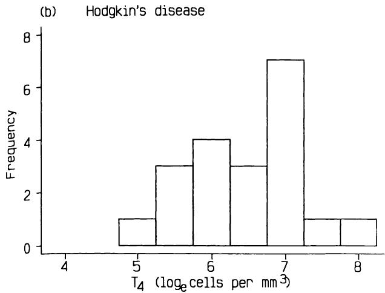
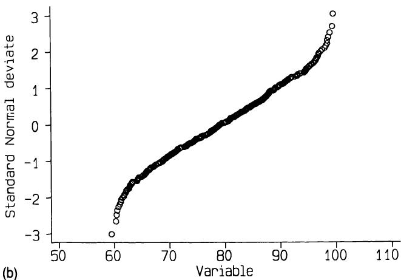
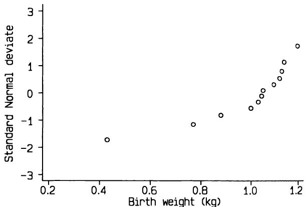

# 7 数据分析准备  7 Preparing to analyse data  

任何统计技术都无法从质量可疑的数据中得出“好”的结果。  
No statistical technique will ever yield 'good' results from data of dubious quality.  

Buyse (1984)  
Buyse (1984)  

## 7.1 引言  7.1 INTRODUCTION  

在分析数据集之前，尽可能检查数据是否正确至关重要。错误可能发生在测量时、数据原始记录时、从原始来源（如病历）转录时，或输入计算机时。我们通常无法知道什么是正确的，因此我们只关注确保记录值是合理的。这个过程称为数据核查（或数据清洗）。我们不能指望发现所有的转录和数据录入错误，但我们希望能找到主要的错误。正如我们将看到的，正是那些大的错误会影响统计分析。如果数据在计算机上进行分析，那么核查应在数据输入计算机后进行。对于非常大型的调查或临床试验，数据清洗可能是一个漫长的过程。  
Before analysing a set of data it is important to check as far as possible that the data seem correct. Errors can be made when measurements are taken, when the data are originally recorded, when they are transcribed from the original source (such as from hospital notes), or when being typed into a computer. We cannot usually know what is correct, so we restrict our attention to making sure that the recorded values are plausible. This process is called data checking (or data cleaning). We cannot expect to spot all transcription and data entry errors, but we hope to find the major errors. As we will see, it is the large errors that can influence statistical analyses. If the data are being analysed on a computer, then checking should take place after the data have been entered into the computer. For very large surveys or clinical trials cleaning the data may be a lengthy process.  

筛选数据以识别在分析过程中可能导致困难的特征也同样重要。本章将考虑三个具体方面—缺失数据、异常值以及数据转换的可能需求。核查和筛选的方面是相似的，在实践中可以同时进行。  
It is also important to screen the data to identify features that may cause difficulties during the analysis. Three specific aspects are considered in this chapter - missing data, outlying values, and the possible need for data transformation. Aspects of checking and screening are similar and in practice they can be carried out at the same time.  

本章中的思想主要针对具有许多变量或受试者或两者兼有的研究，但其一般原则适用于任何研究。在进行实质性分析之前，仔细检查数据至关重要。  
The ideas in this chapter are particularly aimed at studies with many variables or subjects or both, but the general principles apply to any study. It is important to examine the data carefully before proceeding to the substantive analysis.  

## 7.2 数据核查  7.2 DATA CHECKING  

记录数据中的错误很常见。例如，记录值可能因混淆正确的测量单位而错误。  
Errors in recorded data are common. For example the recorded values may be wrong because of confusion over the correct units of measurement.  

数据转录时数字可能颠倒，或数据输入计算机时可能打错。数据核查旨在识别并尽可能纠正数据中的错误。显然，原始数据中的错误通常无法纠正，但后期引入的错误如果查阅原始记录则可以纠正。  
digits may be transposed when data are transcribed, or data may be mistyped when being entered onto a computer. Data checking aims to identify and, if possible, rectify errors in the data. Clearly errors in the original data cannot usually be rectified, but errors introduced at a later stage can be put right if the original record is consulted.  

如第6.6节所述，一个重要的第一步是检查数据是否已正确输入计算机文件。对于大型文件，最好采用双重录入，即数据重新输入后与第一版进行比较，最好使用为此目的设计的计算机程序。对于小型数据集，最简单的方法是由一个人从计算机上读出数据，另一个人对照原始数据进行核对。  
As noted in section 6.6, an important first step is to check that the data have been typed into the computer file correctly. For large files double entry is best, whereby the data are retyped and compared with the first version, preferably using a computer program designed for this purpose. For small data sets the simplest way is for one person to read aloud the data from the computer with another person checking against the original data.  

数据核对可能会发现一些观测值，它们虽然合理，但与数据主体相距甚远。它还可能发现一些预期的观测值缺失。这些问题将在第7.3节和第7.4节中讨论。  
Checking the data is likely to reveal some observations that, while plausible, are distant from the main body of the data. It is also likely to reveal that a number of intended observations are missing. These problems are discussed in sections 7.3 and 7.4.  

### 7.2.1 分类数据  7.2.1 Categorical data  

对于分类变量，检查所有记录的数据值是否合理很简单，因为预先指定的值的数量是固定的。例如，如果我们有四种血型代码，如下所示：  
For categorical variables it is simple to check that all recorded data values are plausible because there is a fixed number of pre- specified values. For example, if we have four codes for blood group, as follows  

$$  
\begin{array}{l}1 = \mathbf{A} \\ 2 = \mathbf{B} \\ 3 = \mathbf{O} \\ 4 = \mathbf{AB} \end{array}  
\begin{array}{l}1 = \mathbf{A} \\ 2 = \mathbf{B} \\ 3 = \mathbf{O} \\ 4 = \mathbf{AB} \end{array}  
$$  

那么我们期望在数据中只找到值1、2、3或4，除了任何信息缺失的受试者。如果缺失值编码为9（如第6章推荐），那么我们知道任何编码为0、5、6、7或8的血型显然是错误的。  
then we expect to find only values 1, 2, 3 or 4 in the data, except for any subjects with missing information. If missing values are coded as 9, as recommended in Chapter 6, then we know that any blood group coded as 0, 5, 6, 7, or 8 is clearly wrong.  

从计算机分析中获得的0值可能表示血型留空了—大多数计算机程序不区分空白和零。在这个例子中，O血型可能被编码为0而不是3。应尽可能检查错误值（如有必要，追溯到原始信息来源）。如果发现错误，应将该值更改为有效代码之一，此处为1、2、3或4；如果未发现错误，则应使用缺失值代码。  
Values of 0 obtained from computer analysis may indicate that the blood group was left blank - most computer programs do not distinguish blanks and zeros. In this example it is possible that O might be coded as 0 rather than 3. Erroneous values should be checked as far as is possible (if necessary, back to the original source of the information). If a mistake is found the value should be changed to one of the valid codes, here 1, 2, 3, or 4; if not, the missing value code should be used.  

### 7.2.2 连续数据  7.2.2 Continuous data  

对于连续测量，我们通常无法精确识别哪些  
For continuous measurements we cannot usually identify precisely which  

值是合理的，哪些是不合理的，这样做也不重要。然而，对于相关变量，应该始终能够指定合理值的下限和上限。例如，在妊娠研究中，我们可能将孕妇年龄的限制设为14至45岁；或者在成年男性研究中，我们可能将收缩压的限制设为70至$250 \mathrm{mmHg}$。然后我们需要识别超出这些限制的值，这个过程称为范围检查。然而，与分类数据的情况不同，这些值不一定都是错误的。可疑值应进行检查，发现的任何错误都应纠正。如果仍有值超出预设范围，则必须保持原样，或者如果认为它们是不可能的而非仅仅是不太可能，则记录为“缺失”。因此，建议为每个变量设置两组限制，分别表示可疑（或不太可能）值和不可能值。定义什么是“不可能”可能极其困难。孕妇年龄或收缩压的哪些值是不可能的？“不可能”的界限又在哪里？  
values are plausible and which are not, and it is not important to do so. It should, however, always be possible to specify lower and upper limits on what is reasonable for the variable concerned. For example, in a study of pregnancy we might put limits of 14 and 45 on maternal age, or in a study of adult males we may use limits of 70 and  $250 \mathrm{mmHg}$  for systolic blood pressure. We then need to identify values outside the limits, a procedure known as range checking. Unlike the categorical data case, however, these values are not necessarily wrong. Suspicious values should be checked and any errors found should be corrected. Values remaining outside the prespecified range must either be left as they are, or recorded as 'missing' if they are felt to be impossible rather than just unlikely. It may, therefore, be advisable to have two sets of limits for each variable, denoting suspicious (or unlikely) values and impossible values. Defining what is impossible may be extremely difficult. What values of maternal age or systolic blood pressure are impossible？ And at what point is 'impossible' reached？  

一个常见的错误原因是小数点错位，这可能是由于对正确测量单位的混淆或转录错误造成的。通常，十倍的误差会产生一个不可能的值，但如果记录的值是合理的，小数点错位很可能未被发现。合理但不太可能的值只有在有错误证据时才应纠正。  
A common cause of error is misplacing the decimal point, perhaps because of confusion over the right units of measurement to use or a transcription error. Often an error by a factor of ten will give an impossible value, but if the recorded value is plausible a misplaced decimal point may well go undetected. Plausible but unlikely values should be corrected only if there is evidence of a mistake.  

### 7.2.3 逻辑检查  7.2.3 Logical checks  

当一个变量的合理值取决于另一个变量的值时，数据检查会变得更加复杂。我们称之为逻辑检查。首先，某些信息通常只在特定情况下才需要。例如，在肾移植后生存期研究中，既往妊娠次数的信息仅与女性相关，因此对于男性应设置为缺失或用不同代码表示“不适用”。（有些计算机程序允许不同类型的缺失信息。）  
Checking the data is more complicated when the values of a variable that are reasonable depend on the value of some other variable. We call these logical checks. Firstly, it is common for some information to be sought only in certain cases. For example, in a study of survival after a kidney transplant, information on number of previous pregnancies is relevant only for women, and so for men should be set to missing or to a different code indicating 'not applicable'. (Some computer programs allow for different types of missing information.)  

如果对研究参与者有限制（例如，临床试验的入选标准—参见第15章），那么应尽可能检查数据，以确保所有人都确实符合条件。一个常见的例子是抗高血压药物研究，其中受试者可以入组的血压有一个范围。许多研究对参与者的年龄也有限制。  
If there were restrictions on who should be in the study (for example, entry criteria in a clinical trial - see Chapter 15), then the data should be checked as far as possible to see that everyone really was eligible. A common example is in studies of anti- hypertensive agents, in which there is a range of blood pressures for which subjects can be entered in the study. Many studies have restrictions on the age of participants.  

当使用两个变量来构建另一个变量时，会出现一个不同的问题。新变量的值可能是不可能的，即使原始变量的值都是合理的。例如，一个常见的身体尺寸测量指标（粗略的肥胖度测量指标）是  
A different problem occurs when two variables are used to construct another variable. The value of the new variable may be impossible even though the values of the original variable were both reasonable. For example, a common measure of body size (a crude measure of fatness) is  

‘身体质量指数’或‘Quetelet指数’，定义为Weight/Height²。如果这些派生变量特别重要，则应在开始主要分析之前与记录的变量一起检查。  
the 'body mass index' or 'Quetelet's index', defined as Weight/Height². If such derived variables are especially important they should be checked along with recorded variables before beginning the main analysis.  

更一般地，可能存在某些受试者，他们两个变量值的组合非常不可能，即使每个值都在可接受的限度内。如果我们有两个密切相关的变量，例如收缩压和舒张压，我们不期望收缩压分布的第5百分位数的受试者，其舒张压处于第95百分位数。在大型研究中，以这种方式考虑所有变量对是不切实际的，但那些非常重要的变量，例如抗高血压药物试验中的血压，应仔细研究，最简单的方法是检查散点图。  
More generally, there may be subjects who have a combination of values of two variables that is very unlikely even though each is within acceptable limits. If we have two closely related variables, such as systolic and diastolic blood pressure, we do not expect a subject at the 5th centile of the distribution of systolic pressure to be at the 95th centile for diastolic pressure. In a large study it is impracticable to consider all pairs of variables in this way, but those of major importance, such as blood pressure in anti- hypertensive drug trials, should be studied closely, most simply by examining scatter diagrams.  

本节最后一点是，同一变量在每个受试者身上测量多次的情况。绘制每个人的记录值序列以确保它们表现合理是很有价值的。有时我们会期望每次测量都大于前一次测量，例如儿童年度身高测量，这很容易验证。不幸的是，使用统计软件生成此类图表可能很困难，因为很少有程序能处理每个受试者的序列数据。  
Lastly in this section, there is the case where the same variable is measured several times on each subject. It is valuable to plot each person's sequence of recorded values to ensure that they behave reasonably. Sometimes we will expect each measurement to be larger than the previous one, such as annual height measurements of children, and this is easily verified. Unfortunately it may be difficult to produce such plots using statistical software, as few programs can cope with serial data on each subject.  

### 7.2.4 日期  7.2.4 Dates  

记录的日期在用于计算两个事件之间的时间时很重要。例如，我们可以根据事件日期和受试者出生日期，计算受试者在某个事件（如手术或死亡）发生时的年龄。其他常见的计算包括事件与患者死亡之间的时间（他们的生存时间）或首个症状与疾病诊断之间的时间。如第6章所建议，最好记录所有相关日期，因为时间间隔的心算极其不可靠。然而，记录日期也会带来问题，因为它们特别容易出现转录错误。  
Recorded dates are important when they are used to calculate the time between two events. For example, we can calculate a subject's age at some event, such as surgery or death, from the date of the event and the subject's date of birth. Other common calculations are the time between an event and the patient's death (their survival time) or the time between the first symptom and the diagnosis of the disease. As recommended in Chapter 6, it is preferable to record all the relevant dates, as mental calculation of time intervals is extremely unreliable. However, recording dates also causes problems as they are especially prone to transcription errors.  

日期应按以下方式检查：  
Dates should be checked as follows:  

1.检查所有日期是否在合理的时间范围内。出生日期可能与纳入研究的年龄范围有关。请注意，包括老年人的研究可能包含1900年之前的出生日期。其他事件的日期，例如手术或死亡，可能在研究的时间范围内。  
1. Check that all dates are within a reasonable time span. Dates of birth may relate to the age range for inclusion in a study. Note that studies including elderly people may include dates of birth before 1900. Dates of other events, such as surgery or death, will probably lie within the time span of the study.  

2.检查所有日期是否有效。月份中的日期应在1到31的范围内，依此类推，但2月30日等日期是不可能的。一些计算机程序具有检查日期有效性的例程。  
2. Check that all dates are valid. The day of month should lie in the range 1 to 31, and so on, but dates such as 30 February are impossible. Some computer programs have routines for checking the validity of dates.  

3.检查日期是否正确排序。通常，不同事件的日期应按特定顺序排列，例如出生、手术和死亡日期。  
3. Check that dates are correctly sequenced. Often dates of different events should fall in a certain sequence, such as dates of birth, surgery, and death.  

4.检查推导出的年龄和时间间隔。在检查（1）和（2）之后，应使用日期计算感兴趣的年龄和时间间隔，例如手术时的年龄或手术与死亡之间的时间。然后应按前述方法对这些值进行范围检查。  
4. Check derived ages and time intervals. After checks (1) and (2) the dates should be used to calculate ages and time intervals of interest, such as age at surgery or time between surgery and death. These should then be range checked as described earlier.  

## 7.3 异常值  7.3 OUTLIERS  

检查连续变量的数据可能会发现一些与其余数据不兼容的异常值。通常，少数变量可能有一两个异常值，尽管大多数变量不会有任何异常值。  
Checking the data for continuous variables may reveal some outlying values that are incompatible with the rest of the data. Typically there may be one or two outliers for a few variables, although for most variables there will not be any.  

如前所述，可疑值应仔细检查。如果没有证据表明存在错误，并且该值是合理的，则不应更改它。此规则的一个例外是，当值正确但调查显示该个体有特殊之处时，例如并发疾病。在这种情况下，排除该观察值可能是合理的。相反，仅仅因为值最大或最小而将其删除是特别危险的。此外，没有理由支持自动化程序，例如删除所有偏离均值三个标准差以上的值。统计技术可用于检测可疑值，但不应用于确定如何处理它们。  
As already discussed, suspicious values should be carefully checked. If there is no evidence of a mistake, and the value is plausible, then it should not be altered. An exception to this rule is where the value is correct but investigation reveals that there is something special about that individual, such as a concurrent illness. Here it may be reasonable to exclude the observation. In contrast, it is especially dangerous to remove values simply because they are largest or smallest. Also, there is no justification behind automated procedures such as removing all values more than three standard deviations away from the mean. Statistical techniques can be used to detect suspicious values, but should not be used to determine what happens to them.  

异常值特别重要，因为它们可能对统计分析结果产生相当大的影响。由于它们根据定义是极端值，它们的纳入或排除会对分析结果产生显著影响。举一个简单的例子，表7.1显示了20名霍奇金病缓解期患者血液样本中每 $\mathbf{mm}^{3}$ 的 $\mathbf{T_{4}}$ 细胞数量。这些值的平均值为823.2，标准差为566.4。如果我们认为最高值2415是一个异常值并将其丢弃，则剩余19个值的平均值为739.4，标准差为436.4—当最大值被省略时，两者都必须下降。排除单个观察值的影响可能像这里一样非常显著，这就是为什么在完整分析开始之前就应该决定要分析哪些数据。  
Outliers are particularly important because they can have a considerable influence on the results of a statistical analysis. Because by definition they are extreme values, their inclusion or exclusion can have a marked effect on the results of an analysis. To take a simple example, Table 7.1 shows numbers of  $\mathbf{T_{4}}$  cells per  $\mathbf{mm}^{3}$  in blood samples from 20 patients in remission from Hodgkin's disease. The mean of the values is 823.2 and the standard deviation is 566.4. If we consider that the highest value of 2415 is an outlier and discard it, the mean of the remaining 19 values is 739.4 and the standard deviation is 436.4 - both must fall when the largest value is omitted. The effect of excluding a single observation can, as here, be quite marked, which is why decisions about which data are to be analysed should be made before the full analysis starts.  

$\mathbf{T_{4}}$ 数据的直方图显示分布是偏斜的（图7.1a），而细胞计数对数的分布是对称的（图7.1b）。此外，在对数尺度上，明显的异常值看起来非常合理。转换将在7.6节中讨论。  
A histogram of the  $\mathbf{T_{4}}$  data shows that the distribution is skewed (Figure 7.1a), whereas that for the logarithm of the cell counts is symmetric (Figure 7.1b). Further, the apparent outlier is seen in the log scale to be very reasonable. Transformations are considered in section 7.6.  

异常值在回归分析中可能具有影响力，回归分析是一种在第11章中描述的、用于找到描述变量之间关系的最佳直线的技术。  
Outliers can be influential in regression analysis, a technique described in Chapter 11 for finding the best straight line describing the relation  

表7.1 20名霍奇金病缓解期患者和20名播散性恶性肿瘤（非霍奇金病）缓解期患者血样中每立方毫米T4细胞数量（Shapiro et al., 1986）  
Table 7.1 Numbers of  $\mathbf{T_{4}}$  cells  $/\mathrm{mm}^{3}$  in blood samples from 20 patients in remission from Hodgkin's disease and 20 patients in remission from disseminated malignancies (nonHodgkin's) (Shapiro et al., 1986)  

<table><tr><td></td><td>霍奇金病</td><td>非霍奇金病</td></tr><tr><td>171</td><td>116</td><td></td></tr><tr><td>257</td><td>151</td><td></td></tr><tr><td>288</td><td>192</td><td></td></tr><tr><td>295</td><td>208</td><td></td></tr><tr><td>396</td><td>315</td><td></td></tr><tr><td>397</td><td>375</td><td></td></tr><tr><td>431</td><td>375</td><td></td></tr><tr><td>435</td><td>377</td><td></td></tr><tr><td>554</td><td>410</td><td></td></tr><tr><td>568</td><td>426</td><td></td></tr><tr><td>795</td><td>440</td><td></td></tr><tr><td>902</td><td>503</td><td></td></tr><tr><td>958</td><td>675</td><td></td></tr><tr><td>1004</td><td>688</td><td></td></tr><tr><td>1104</td><td>700</td><td></td></tr><tr><td>1212</td><td>736</td><td></td></tr><tr><td>1283</td><td>752</td><td></td></tr><tr><td>1378</td><td>771</td><td></td></tr><tr><td>1621</td><td>979</td><td></td></tr><tr><td>2415</td><td>1252</td><td></td></tr><tr><td>均值</td><td>823.2</td><td>522.1</td></tr><tr><td>标准差</td><td>566.4</td><td>293.0</td></tr></table>  
<table><tr><td></td><td>Hodgkin&#x27;s</td><td>non-Hodgkin&#x27;s</td></tr><tr><td>171</td><td>116</td><td></td></tr><tr><td>257</td><td>151</td><td></td></tr><tr><td>288</td><td>192</td><td></td></tr><tr><td>295</td><td>208</td><td></td></tr><tr><td>396</td><td>315</td><td></td></tr><tr><td>397</td><td>375</td><td></td></tr><tr><td>431</td><td>375</td><td></td></tr><tr><td>435</td><td>377</td><td></td></tr><tr><td>554</td><td>410</td><td></td></tr><tr><td>568</td><td>426</td><td></td></tr><tr><td>795</td><td>440</td><td></td></tr><tr><td>902</td><td>503</td><td></td></tr><tr><td>958</td><td>675</td><td></td></tr><tr><td>1004</td><td>688</td><td></td></tr><tr><td>1104</td><td>700</td><td></td></tr><tr><td>1212</td><td>736</td><td></td></tr><tr><td>1283</td><td>752</td><td></td></tr><tr><td>1378</td><td>771</td><td></td></tr><tr><td>1621</td><td>979</td><td></td></tr><tr><td>2415</td><td>1252</td><td></td></tr><tr><td>Mean</td><td>823.2</td><td>522.1</td></tr><tr><td>SD</td><td>566.4</td><td>293.0</td></tr></table>  

在两个连续变量之间。图7.2显示了12名慢性肾衰竭患者血液透析后血浆蛋白水平的变化，其中最年轻的患者可能是一个异常值。图中还显示了包含所有数据和排除该患者后的拟合回归线。它们说明了回归线会被异常值“拉动”，无论其余数据的分布如何，尤其是在小样本中。单个异常点会对视觉印象产生相当大的影响。如果我们遮盖住可疑值，很明显其余数据中没有明显的关联。在第11章中，我建议散点图应始终伴随回归分析。  
between two continuous variables. Figure 7.2 shows the change in plasma protein levels after haemodialysis in 12 patients with chronic renal failure, in which the youngest patient is a possible outlier. Also shown are the fitted regression lines for all the data and with that patient excluded. They illustrate that the regression line gets 'pulled' towards outlying values, regardless of the distribution of the rest of the data, especially in small samples. A single outlying point can have a considerable effect on the visual impression. If we cover the suspicious value it is clear that there is no apparent relation in the rest of the data. In Chapter 11 I suggest that a scatter diagram should always accompany regression analyses.  

异常值会影响多种类型的统计分析，通常通过夸大一组观测值的方差来掩盖感兴趣的效应。识别任何异常值是检查数据的一个非常有益的附带结果。  
Outliers can affect many types of statistical analysis, often by inflating the variance of a set of observations and so obscuring the effect of interest. Awareness of any outliers is a highly beneficial spin- off from checking the data.  

  

  

  

  
非霍奇金病 图7.1 表7.1中所示的霍奇金病患者和非霍奇金病患者的T4细胞计数/mm³直方图 (a) 原始数据；(b) 经过log2转换后。  
Non-Hodgkin's disease  Figure 7.1 Histograms of  $\mathbf{T_{4}}$  cell counts  $/\mathbf{m}\mathbf{m}^{3}$  in patients with and without Hodgkin's disease shown in Table 7.1 (a) raw data; (b) after  $\log_{2}$  transformation.  

  
图7.2 显示了12名慢性肾衰竭患者血液透析后血浆蛋白（g/l）变化与年龄之间关系的数据，显示了包含所有数据（—）和排除最年轻患者（- - - - - -）的回归线。数据来自Toulon et al. (1987)。  
Figure 7.2 Data showing the relation between change in plasma protein  $(g / l)$  after haemodialysis and age in 12 patients with chronic renal failure, showing regression lines for all data (—) and excluding the youngest patient (- - - - - -). Data from Toulon et al. (1987).  

分析数据时，一个有用的策略是同时进行包含和排除可疑值（如在图7.2中所示）的分析。如果所得结果差异很小，则异常值影响微乎其微；但如果排除它们确实产生影响，则最好寻找替代的分析方法。第8章中介绍的秩方法可能是一个很好的方法。这是一个需要专家统计建议的领域。  
A useful strategy to adopt when analysing data is to carry out the analysis both including and excluding the suspicious value(s), as in Figure 7.2. If there is little difference in the results obtained then the outlier(s) had minimal effect, but if excluding them does have an effect it may be better to find an alternative method of analysis. Rank methods, introduced in Chapter 8, may be a good approach here. This is an area where expert statistical advice is valuable.  

## 7.4 缺失数据  7.4 MISSING DATA  

检查数据的另一个副产品是识别任何缺失的观测值。如第6章所述，最常用的方法是根据变量的性质使用9、99、999或99.9等代码，尽管有些计算机程序（不幸的是很少）允许使用*或其他符号来表示缺失观测值。如果使用数值来表示缺失值，在分析数据之前，务必将该值标识为统计软件中的缺失值。在进行分析时，很容易忘记一两个值是缺失的，可能被编码为999。正如第6.3节所示，这对分析的影响可能很严重。  
Another by- product of checking your data is that any missing observations will be identified. As noted in Chapter 6, the most common device is to use codes such as 9, 99, 999, or 99.9, according to the nature of the variable, although some computer programs (unfortunately few) allow * or some other symbol to indicate a missing observation. If a numeric value is used it is essential to identify the value as a missing value to the statistical software before analysing the data. It is very easy to forget that one or two values are missing, perhaps coded as 999, when carrying out an analysis. The effect on the analysis can be severe, as was illustrated in section 6.3.  

使用 $\clubsuit$ 的优点是，不存在后续分析将缺失值代码视为真实观测值的危险。  
The advantage of using  $\clubsuit$  is that there is no danger that subsequent analysis will treat the missing value code as a real observation.  

对于分类变量，缺失值只是一个额外的类别，因此这些个体可以包含在任何交叉制表中。然而，在执行统计分析时，计算机程序中将该代码（例如9）识别为缺失值仍然很重要。对于连续变量，识别缺失数据至关重要。  
For categorical variables missing is just an additional category and so these individuals can be included in any cross- tabulations. However, it is still important that the code (say 9) is identified as missing in a computer program when performing a statistical analysis. For continuous variables it is essential that missing data are identified.  

在创建新的“派生”变量时，记住缺失值代码的可能性很重要。例如，如果我们使用身高和体重来推导身体质量指数（BMI）（在第7.2.3节中描述），并且其中一个或两个变量缺失，如果我们没有将这些代码识别为缺失值，我们可能会得到非常误导性的答案：  
It is important to remember the possibility of missing value codes when creating a new 'derived' variable. For example, if we use height and weight to derive the body mass index (BMI) (described in section 7.2.3), and either or both variables are missing we can get very misleading answers if we have not identified the codes as missing:  

<table><tr><td>Height (m)</td><td>Weight (kg)</td><td>BMI (Wt/Ht²)</td></tr><tr><td>1.62</td><td>68.2</td><td>26.0</td></tr><tr><td>1.62</td><td>999.9</td><td>381.0</td></tr><tr><td>9.99</td><td>68.2</td><td>0.7</td></tr><tr><td>9.99</td><td>999.9</td><td>10.0</td></tr></table>  
<table><tr><td>Height (m)</td><td>Weight (kg)</td><td>BMI (Wt/Ht²)</td></tr><tr><td>1.62</td><td>68.2</td><td>26.0</td></tr><tr><td>1.62</td><td>999.9</td><td>381.0</td></tr><tr><td>9.99</td><td>68.2</td><td>0.7</td></tr><tr><td>9.99</td><td>999.9</td><td>10.0</td></tr></table>  

在这种情况下，如果任一变量缺失，派生值将是不可能的，但并非总是如此。在构建派生变量之前，应识别缺失值代码。好的计算机程序会在派生变量的任何组成部分缺失时，将其值设为缺失。  
In this case the derived values if either variable is missing are impossible, but this will not always be the case. Missing value codes should be identified before derived variables are constructed. Good computer programs will set the value of a derived variable to missing if any of its components is missing.  

日期有时只被部分记录。如果日期中的“日”缺失，可以将其设为15（平均月份的中间），缺失的“月”可以设为6或7（一年中的中间），以最大程度地减少可能的误差。如果这种替代所产生的影响与所调查的时间跨度相比非常小，那么它是合理的。然而，应注意这种替代不会导致两个日期顺序的颠倒。例如，如果手术日期为08-89（日缺失），而死亡日期为13-08-89，那么将手术日期中的“日”设为15将使患者的生存时间变为-2天。  
Dates are sometimes only partially recorded. If the day is missing it can be set to 15 (halfway through an average month), and a missing month can be set to 6 or 7 (halfway through the year) to minimize the possible error. Substitutions like these are reasonable if the effect is very small compared with the time span being investigated. However, care should be taken that this substitution does not result in a reversal of the sequence of two dates. For example, if date of surgery is given as 08- 89, with the day missing, and date of death is 13- 08- 89, then setting the day of surgery to 15 will make the patient's survival time - 2 days.  

### 7.4.1 数据为何缺失？  7.4.1 Why are data missing？  

值得思考数据为何缺失；特别是，我们应该知道是否存在与研究性质相关的原因。与不可能的值一样，可能可以与原始来源核对  
It is worth thinking about why the data are missing; in particular we ought to know if there is a reason related to the nature of the study. As with impossible values, it may be possible to check with the original source of  

缺失的观测值是否确实缺失。缺失值通常是随机的，原因与研究无关。例如，有些患者可能没有被问到某个特定问题，或者血样可能丢失或被毁。大多数大型研究都会因这些原因而存在一些缺失数据。然而，信息的缺失可能具有信息性。在一项多次收集患者信息的研究中，后期时间的信息缺失可能是因为患者因副作用而退出研究，甚至是因为他们死亡。另一种可能性是，他们可能因为感兴趣的变量反应不当而退出研究。例如，在高血压研究中，如果患者的血压升至预设水平以上，通常会让他们退出研究，这必然会影响血压变化的分析。第14.6节对此类数据有进一步讨论。  
the information that missing observations are really missing. Frequently values are missing essentially at random, for reasons not related to the study. For example, some patients may not have been asked a particular question, or a blood sample may have been lost or destroyed. Most large studies will have some missing data for reasons like these. The lack of information may, however, be informative. In a study in which information about a patient is collected on several occasions, lack of information for the later times may be because the patient was withdrawn from the study due to side- effects, or even because they died. Another possibility is that they may have been withdrawn from the study because the variable of interest responded inappropriately. For example, it is common in studies in hypertension to withdraw patients if their blood pressure rises above a pre- selected level, which must compromise an analysis of change in blood pressure. There is further discussion of this type of data in section 14.6.  

对于编码为“是”或“否”的信息，例如特定症状的存在，可能会倾向于将缺失值替换为“否”，理由是如果症状存在，信息就会被记录下来。这种假设通常是没有根据的，不应轻易做出。这个问题最常出现在回顾性研究中，例如当数据从患者的病历中获取时。  
For information that is coded as 'yes' or 'no', such as the presence of a particular symptom, it may be tempting to consider replacing missing values by 'no', on the grounds that the information would have been recorded if the symptom had been present. This assumption is usually unwarranted, and should not be made lightly. This problem is most likely in retrospective studies, for example when data are obtained from patients' hospital notes.  

## 7.5 数据筛选  7.5 DATA SCREENING  

本章迄今为止，我已尽可能地探讨了检查数据正确性的各个方面。初步数据检查的另一个重要方面是查看数据是否适合预期的分析类型，这一过程有时称为数据筛选。如前所述，一个或多个异常值的存在会显著影响，甚至可能使分析失效。数据筛选主要关注连续数据的分布，其中异常值只是本节考虑的方面之一。  
So far in this chapter I have considered various aspects of checking, as far as possible, that the data are correct. The other important aspect of preliminary data examination is to see how suitable the data are for the type of analysis that is intended, a process sometimes called data screening. As already indicated, the presence of one or more outliers can markedly affect, and perhaps invalidate, an analysis. Data screening is concerned largely with the distribution of continuous data, outliers being just one of the aspects considered in this section.  

### 7.5.1 观测值的分布  7.5.1 The distribution of observations  

正如后续章节将展示的，许多类型的连续数据统计分析都基于数据来自正态分布总体的假设。通常有不依赖该假设的基于秩次的替代方法，但它们具有一定的缺点。在开始基于正态性假设的分析之前，了解数据的分布至关重要。与正态分布不兼容的数据通常可以  
As subsequent chapters will show, many types of statistical analysis of continuous data are based on the assumption that the data are a sample from a population with a Normal distribution. Alternative methods based on ranks are usually available that do not make that assumption, but they have certain disadvantages. It is important to know the distribution of the data before embarking on an analysis based on the assumption of Normality. Data that are not compatible with a Normal distribution can often be  

通过转换使其可接受地接近正态分布，如第7.6节所述。  
transformed to make them acceptably near to Normal, as described in section 7.6.  

对于每个连续变量，应计算其均值和标准差（SD）。如果可能，应绘制直方图以查看分布的形状。如果不可能，则可以检查分布的分位数（例如，第10、第50和第90百分位数）以查看分布是否呈对称性。  
For each continuous variable the mean and standard deviation (SD) should be calculated. If possible a histogram should be produced to see the shape of the distribution. If this is not possible then quantiles of the distribution (for example, the 10th, 50th and 90th centiles) can be examined to see if the distribution appears symmetric.  

特别是对于小样本，可能难以判断一组数据的正态性程度。如图4.7所示，即使是来自正态分布的50个样本，也可能看起来非正态。下文描述的名为正态图的图形技术，能更好地反映正态性。  
For small samples especially it may be difficult to judge the degree of Normality of a set of data. As Figure 4.7 showed, even samples of size 50 from a Normal distribution may look non- Normal. The graphical technique called a Normal plot, described below, gives a much better idea of Normality.  

目视检查多个变量的一个好方法是生成所有变量对的散点图“矩阵”。图12.2给出了一个例子。  
A good way of checking many variables visually is to produce a 'matrix' of scatter plots of all pairs of variables. An example is given in Figure 12.2.  

### 7.5.2 正态图  7.5.2 The Normal plot  

正态图基于两个思想。首先，累积频率分布比频率分布能更好地反映数据的形状。它受图4.7中看到的小波动的影响要小得多。正态分布数据的累积频率分布呈S形，如图4.6所示。然而，很难从累积频率分布中判断正态性，这就是第二个思想的用武之地。因为所有正态分布的形状都完全相同（图4.4），所以如果数据是正态的，我们可以拉伸垂直刻度，使累积分布函数成为一条直线。因此，样本数据偏离正态性很容易被视为偏离直线。  
The Normal plot is based on two ideas. First, the cumulative frequency distribution gives a better idea of the shape of the data than does the frequency distribution. It is much less affected by the small fluctuations that were seen in Figure 4.7. The cumulative frequency distribution for data that are Normally distributed has an S shape, as shown in Figure 4.6. It is, however, difficult to judge Normality from the cumulative frequency distribution, which is where the second idea comes in. Because all Normal distributions are precisely the same shape (Figure 4.4) we can stretch the vertical scale to make the cumulative distribution function a straight line if the data are Normal. Departures of the sample data from Normality are thus easily seen as departures from a straight line.  

假设我们有一个变量，其在总体中的值服从均值为34.46、标准差为5.84的正态分布。图7.3展示了(a)频率分布，(b)累积频率分布，以及(c)正态概率图。正态概率图的横轴显示观测值的数值，纵轴以距均值的标准差数量表示相对频率。正态概率图纵轴上标注的值对应于累积百分比 $0.1\%$、$2.3\%$、$16\%$、$50\%$、$84\%$、$97.7\%$ 和 $99.9\%$（参见第4.5.1节）。绘图坐标的计算将在下文解释。图7.3展示了理论上发生的情况，而图7.4展示了从同一总体中随机抽取的216个样本的相同过程。顶部面板显示了数据的直方图，其中显示出一些不规则性。第二个面板显示了累积频率分布，最后一个面板显示了正态概率图。数据显示在正态概率图中接近一条直线。  
Suppose we have a variable whose values in the population have a Normal distribution with a mean of 34.46 and a standard deviation of 5.84. Figure 7.3 shows (a) the frequency distribution, (b) the cumulative frequency distribution, and (c) the Normal plot. The horizontal axis of the Normal plot shows the numerical value of the observation, and the vertical axis gives the relative frequency in terms of the number of standard deviations from the mean. The values labelled on the vertical axis of the Normal plot correspond to cumulative percentages of  $0.1\%$ ,  $2.3\%$ ,  $16\%$ ,  $50\%$ ,  $84\%$ ,  $97.7\%$  and  $99.9\%$  (see section 4.5.1). The calculation of the plotting coordinates is explained below. Figure 7.3 shows what happens in theory, and Figure 7.4 shows the same process for a sample of size 216 chosen at random from the same population. The top panel shows a histogram of the data, which exhibits some irregularities. The second shows the cumulative frequency distribution and the last the Normal plot. The data are close to a straight line in the Normal plot.  

  

  

既然我们知道了当数据确实来自正态分布时应预期的图示，我们就有了一些判断真实数据的基础。图7.5给出了前述216例原发性胆汁性肝硬化患者血清白蛋白值的正态概率图。这些数据的均值为 $34.46 \mathrm{g} / \mathrm{l}$，标准差为 $5.84 \mathrm{g} / \mathrm{l}$。因此，图7.3、7.4和7.5可以直接进行比较。当我们为某些数据生成正态概率图时，这种比较是隐含进行的。图7.5(c)中的正态概率图非常接近一条直线，表明这些患者血清白蛋白值的分布接近正态分布，这与图4.5一致。我将在下文讨论如何量化这种接近程度。  
Now that we know what sort of picture to expect when the data really do come from a Normal distribution, we have some basis for judging some real data. Figure 7.5 gives a Normal plot for the serum albumin values from the study of 216 patients with primary biliary cirrhosis previously discussed. These data had a mean of  $34.46 \mathrm{g} / \mathrm{l}$  and the standard deviation was  $5.84 \mathrm{g} / \mathrm{l}$ . Figures 7.3, 7.4 and 7.5 are thus directly comparable. When we produce a Normal plot for some data this is the comparison that is implicitly being made. The Normal plot in Figure 7.5(c) is very near to a straight line, indicating that the distribution of serum albumin values in these patients is near to a Normal distribution, in agreement with Figure 4.5. I shall consider below how we can quantify the nearness.  

相比之下，同一患者血清胆红素值的分布在图4.8中显示出高度偏斜，不接近正态分布。图7.6(a)中数据明显弯曲的正态概率图证实了这一发现。然而，如第4章所述，经过对数变换后，数据呈现近似正态分布，如图7.6(b)中的正态概率图所示。我们可能希望对一组数据进行变换以获得近似正态分布的原因将在第7.6节中讨论。  
By contrast, the distribution of serum bilirubin values in the same patients was shown in Figure 4.8 to be highly skewed and not near to a Normal distribution. The markedly curved Normal plot of the data in Figure 7.6(a) confirms this finding. However, as described in Chapter 4, after log transformation the data have a nearly Normal distribution, as shown by the Normal plot in Figure 7.6(b). The reasons why we might wish to transform a set of data to get an approximately Normal distribution are discussed in section 7.6.  

虽然正态概率图是判断一组数据正态性非常有用的图形工具，但它只允许进行主观评估。由于抽样变异，我们知道来自正态分布的样本不会完全正态（参见图4.7），特别是当样本量较小时。当数据接近正态性很重要时，拥有一种量化偏离正态性程度的方法会很有用。  
While the Normal plot is a very useful graphical device for judging the Normality of a set of data, it only allows for a subjective assessment. Because of sampling variation we know that samples from Normal distributions will not be exactly Normal (see Figure 4.7) especially if the sample is small. Where it is important for the data to be close to Normal it is useful to have a method for quantifying the deviations from Normality.  

### 7.5.3 评估偏离正态分布的程度  7.5.3 Evaluating departures from a Normal distribution  

衡量非正态性的一种方法是计算数据分布的所谓“高阶矩”。前两个矩已经描述过—它们是均值和方差。然而，这些值不提供关于分布形状的信息。我们可以通过基于以下量的度量来衡量形状：  
One way of measuring non- Normality is to calculate what are called 'higher moments' of the distribution of data. The first two moments have already been described - they are the mean and variance. However, these values give no information about the shape of the distribution. We can measure shape by means of quantities based on  

$$  
\sum \frac{(x_{i} - \bar{x})^{3}}{n - 1} \qquad \text{and} \qquad \sum \frac{(x_{i} - \bar{x})^{4}}{n - 1}  
\sum \frac{(x_{i} - \bar{x})^{3}}{n - 1} \qquad \text{and} \qquad \sum \frac{(x_{i} - \bar{x})^{4}}{n - 1}  
$$  

这些是方差公式的明显扩展。从中我们可以推导出称为偏度（skewness）的量，它是衡量不对称性的指标；以及峰度（kurtosis），它是衡量平坦度或尖峭度的指标。然后可以将这些值与正态分布的理论值进行比较。然而，我不推荐这种方法，因为最好是对正态性进行单一评估，而不是两次评估。  
which are obvious extensions to the formula for the variance. From these we can derive quantities called skewness, which is a measure of asymmetry. and kurtosis, which is a measure of flatness or peakedness. These values can then be compared with the theoretical values for a Normal distribution. I do not recommend this approach, however, as it is preferable to have a single assessment of Normality rather than two.  

我们可能希望评估一组数据正态性的情况  
Situations in which we may wish to assess the Normality of a set of data  

  
图7.5 216例原发性胆汁性肝硬化患者血清白蛋白值表示为(a)频率直方图；(b)累积频率分布；(c)正态概率图。  
Figure 7.5 Serum albumin values of 216 patients with primary biliary cirrhosis expressed as (a) frequency histogram; (b) cumulative frequency distribution; (c) Normal plot.  

  

  

将在后续章节中出现。在许多情况下，只需通过目视检查正态图即可，但如果需要更精确的判断，则一种更有效的方法是基于测量正态图的直线度。我们可以计算在总体呈正态分布的情况下，样本中获得如此值的概率，如果此概率足够大，例如大于0.05（1/20），我们就可以得出结论，数据合理地接近正态分布。此程序是标准统计推断方法的一个示例，将在下一章中详细介绍和讨论。  
arise in subsequent chapters. For many purposes it is not necessary to do more than check the Normal plot by eye, but if something more is required then a more useful approach is based on measuring the straightness of the Normal plot. We can then calculate the probability that such a value would be obtained in a sample if the population had a Normal distribution, and if this probability is large enough, say greater than 0.05 (1 in 20), we conclude that the data are reasonably near to a Normal distribution. This procedure is an example of a standard statistical approach to inference which is introduced properly and discussed in detail in the next chapter.  

Shapiro-Wilk W正态性检验在多种统计计算机程序中均有提供。然而，如果无法获得，则可以相当容易地计算出密切相关的Shapiro-Francia $W^{\prime}$。但是，它直到第11.6节才进行描述，因为它需要该章中介绍的一种分析方法。对于图7.5所示的白蛋白数据，Shapiro-Wilk W检验得出的概率为0.76，而图7.6中的胆红素数据得出的概率非常小（表7.2）。显然，血清白蛋白数据与正态分布兼容，而原始血清胆红素值则不兼容。对数血清胆红素值的正态图（图7.6b）除了在低端有几个值外，其余部分是直的，但W检验表明数据与正态分布完全不兼容（表7.2）。这说明了一个事实：在大型样本中，该检验能够检测出少量非正态性，而在大多数情况下，这些非正态性并不重要。正如图4.9所示，对数胆红素数据与正态分布非常相似。因此，在评估正态图和W检验时需要一些判断。  
The Shapiro- Wilk W test for Normality is available in several statistical computer programs. However, if it is unavailable the closely related Shapiro- Francia  $W^{\prime}$  can be calculated fairly easily. It is, however, not described until section 11.6 as it requires a method of analysis introduced in that chapter. For the albumin data shown in Figure 7.5 the Shapiro- Wilk W test yields a large probability of 0.76, while the bilirubin data in Figure 7.6 yield a very small probability (Table 7.2). Clearly the serum albumin data are compatible with a Normal distribution, while the raw serum bilirubin values are not. The Normal plot of the log serum bilirubin values (Figure 7.6b) is straight except for a few values at the lower end, but the W test shows that the data are not at all compatible with a Normal distribution (Table 7.2). This illustrates the fact that in large samples the test is able to detect small amounts of non- Normality, that in most circumstances would be unimportant. As Figure 4.9 showed, the log bilirubin data are very similar to a Normal distribution. Thus some judgement is required in assessing the Normal plot and the W test.  

表7.2 Shapiro和Wilk的W检验应用于216个血清白蛋白、血清胆红素和对数血清胆红素值（来自Christensen等人，1985年的研究）  
Table 7.2 Shapiro and Wilk's W test applied to 216 values of serum albumin, serum bilirubin and log serum bilirubin (from the study by Christensen et al., 1985)  

<table><tr><td>变量</td><td>W</td><td>概率 (P)</td></tr><tr><td>血清白蛋白</td><td>0.986</td><td>0.76</td></tr><tr><td>血清胆红素</td><td>0.668</td><td>&amp;lt; 0.0001</td></tr><tr><td>对数血清胆红素</td><td>0.956</td><td>&amp;lt; 0.0001</td></tr></table>  
<table><tr><td>Variable</td><td>W</td><td>Probability (P)</td></tr><tr><td>Serum albumin</td><td>0.986</td><td>0.76</td></tr><tr><td>Serum bilirubin</td><td>0.668</td><td>&amp;lt; 0.0001</td></tr><tr><td>Log serum bilirubin</td><td>0.956</td><td>&amp;lt; 0.0001</td></tr></table>  

非正态性通常在分布的尾部最为显著。异常值将在正态图中显示为偏离其余数据总体线性趋势的一个或多个点。即使一个异常值也可能导致数据未能通过Shapiro-Wilk检验。系统性弯曲，如在图7.6(a)中所示，表示偏斜（向右），而S形图则表示与正态分布相比，分布的两个尾部的值过多或过少，如图7.7和7.8所示。  
Non- Normality is usually most marked in the tails of the distribution. Outliers will show up in a Normal plot as one or more points lying away from the general linear trend of the rest of the data. Even one outlier can make the data fail the Shapiro- Wilk test. Systematic curvature, as seen in Figure 7.6(a), indicates skewness (to the right), while an S shaped plot will indicate either too many or too few values in both tails of the distribution in comparison with a Normal distribution, as shown in Figures 7.7 and 7.8  

  

  

  

  
图7.8 分布尾部值过少的数据 $(n = 400$ , 均值 $= 80$ , 标准差 $= 9.7)$ (a) 直方图；(b) 正态图。  
Figure 7.8 Data with too few values in the tails of the distribution  $(n = 400$ , mean  $= 80$ , SD  $= 9.7)$  (a) histogram; (b) Normal plot.  

正态图还可以揭示数据中两种分布的混合。图7.9显示了一窝仔猪出生体重的正态图，暗示存在一个正常生长的群体和三个体重较低的“小猪”群体（Royston等人，1982）。不同的斜率表明这两个假定群体具有不同的标准差。  
respectively. Normal plots can also reveal a mixture of two distributions in the data. Figure 7.9 shows a Normal plot of birth weights of one litter of piglets, suggesting a normally grown group and a group of three 'runt' piglets with lower weights (Royston et al., 1982). The different slopes indicate different standard deviations in the two putative groups.  

### 7.5.4 绘制正态图  7.5.4 Constructing a Normal plot  

（本节技术性较强，可跳过而不影响连贯性。）  
(This section is more technical and can be omitted without loss of continuity.)  

正态图（如图7.7）中Y轴的刻度是观测值标准差的线性倍数。正态图的绘制方法是：将观测值按升序排列，然后将数据与相应的正态分数进行绘图。正态分数是指我们期望在给定大小的正态分布样本中，具有给定排名的观测值与均值相差的标准差数量。许多统计程序可以计算正态分数以用于绘图，有些程序可以轻松生成正态图。对于手绘正态图，有专门的正态概率纸，其刻度与正态分布的百分位数相对应。观测值被排序，然后第i个  
The scale of the  $Y$  axis in the Normal plots such as Figure 7.7 is linear in multiples of the standard deviation of the observations. The Normal plot is constructed by sorting the observations into ascending order and then plotting the data against the corresponding Normal scores. The Normal score is the number of standard deviations below or above the mean that we expect to find the observation with a given rank from a sample from a Normal distribution of a given size. Many statistical programs can calculate Normal scores for plotting against the data, and some can produce Normal plots easily. For drawing a Normal plot by hand there is special Normal probability paper with divisions corresponding to the percentage points of the Normal distribution. The observations are sorted and then the ith  

  
图7.9 仔猪出生体重的正态图（Royston 等，1982）。  
Figure 7.9 Normal plot of piglet birth weights (Royston et al., 1982).  

观测值对照对应于百分比 $P_{i}$ 的正态分数绘制，由下式给出  
observation is plotted against the Normal score corresponding to the percentage  $P_{i}$ , given by  

$$  
P_{i} = \frac{i - 3 / 8}{n + 1 / 4} \times 100.  
P_{i} = \frac{i - 3 / 8}{n + 1 / 4} \times 100.  
$$  

## 7.6 为什么要转换数据？  7.6 WHY TRANSFORM DATA？  

### 7.6.1 转换为正态性  7.6.1 Transforming to Normality  

正如在接下来的几章中将看到的那样，大多数用于分析连续数据的统计方法（参数方法）都包含了关于样本所来自总体数据的假设。特别是，它们包括一个假设，即数据来自一个值呈正态分布的总体。因此，我们期望数据与该假设一致，这就是为什么我们需要第7.5节中描述的正态性检验。我们经常发现，对数据进行转换会得到一个更接近正态分布的分布。迄今为止最常见的是对数变换或log变换。对数正态分布在第4.6节中介绍过，它是通过取对数可以转换为正态分布的分布。图7.6中所示的血清胆红素数据就是一个例子，图7.1中的 $\mathbf{T_{4}}$ 细胞计数也是如此。  
As will be seen in the next few chapters, most statistical methods (parametric methods) for analysing continuous data incorporate assumptions about the data in the population from which the sample was drawn. In particular they include an assumption that the data come from a population where the values are Normally distributed. Thus we expect the data to be consistent with that assumption, which is why we need the test of Normality described in section 7.5. We often find that a transformation of the data will yield a distribution that is much nearer to a Normal distribution. By far the most common is the logarithmic or log transformation. The Lognormal distribution was introduced in section 4.6, as the distribution that can be transformed to a Normal distribution by taking logs. The serum bilirubin data shown in Figure 7.6 are an example, as are the  $\mathbf{T_{4}}$  cell counts in Figure 7.1.  

对于某些方法，分布假设不是太关键，特别是当样本量较大时。然而，还有其他原因希望数据接近正态分布。许多参数方法的另一个重要假设是不同组的观测值具有相同的标准差。标准差的变化通常伴随着非正态数据，并且在数据转换后，这两个要求都可以更接近地满足。例如，表7.1中霍奇金病和非霍奇金病患者的 $\mathbf{T_{4}}$ 数据具有相当不同的标准差，分别为566.4和397.9，但 $\log_{e} \mathbf{T_{4}}$ 的标准差则更为相似，分别为0.708和0.632，且分布更接近正态（图7.1）。如果几个观测组中标准差与均值的比率相似，则对数变换可能效果很好。此计算仅对原始数据有意义，对于只有两组的情况可能帮助不大。对于 $\mathbf{T_{4}}$ 数据，比率分别为0.69和0.56，这相当相似。  
For some methods the distributional assumption is not too critical, especially if the sample size is large. There are other reasons, however, for wishing data to be near to a Normal distribution. Another important assumption of many parametric methods is that different groups of observations have the same standard deviations. It is often the case that variation in standard deviations accompanies non- Normal data, and both requirements can be met more closely after transforming the data. For example, the  $\mathbf{T_{4}}$  data in Table 7.1 for Hodgkin's and non- Hodgkin's disease patients have rather different standard deviations of 566.4 and 397.9, but the standard deviations of  $\log_{e} \mathbf{T_{4}}$  are much more similar, being 0.708 and 0.632, and the distributions are much nearer to Normal (Figure 7.1). The log transformation is likely to work well if the ratio of the standard deviation to the mean is similar among several groups of observations. This calculation has meaning only for the raw data, and may not be very helpful with just two groups. For the  $\mathbf{T_{4}}$  data the ratios are 0.69 and 0.56, which are reasonably similar.  

其他有时使用的转换是平方根变换和倒数变换。图7.10显示了血清胆红素数据在不同转换前后的直方图。平方根变换（图7.10c）的效果不如取对数那么显著。当变量是计数（频率）并因此预期遵循  
Other transformations sometimes used are the square root and reciprocal transformations. Figure 7.10 shows histograms of the serum bilirubin data before and after different transformations. The square root transformation (Figure 7.10c) is less dramatic than taking logs. It is particularly used when the variable is a count (frequency) and thus would be expected to follow a  

  

泊松分布时，它特别有用。倒数变换（图7.10d）比取对数具有更剧烈的效果（注意它会颠倒观测值的顺序），如果观测数据具有极度偏斜的分布，则可能有用。Gore（1982）描述了倒数变换用于肾移植患者的血浆肌酐值以及平方根变换用于肿瘤大小测量。然而，它们的用途并不常见，并且只要对数变换能产生令人满意的结果，就有某些理由优先使用它而不是其他任何变换（参见第9.7节）。有时，使用特定变换可能有很强的逻辑原因。例如，立方根可能适用于体积数据，而记录的步行一定距离时间的倒数将得到速度。  
Poisson distribution. The reciprocal transformation (Figure 7.10d) has a much more drastic effect than taking logs (note that it reverses the order of the observations), and may be useful if the observed data have an extremely skewed distribution. The use of the reciprocal transformation for plasma creatinine values of kidney transplant patients and the square root transformation for tumour size measurements were described by Gore (1982). Their use is not common, however, and there are certain reasons for using the log transformation in preference to any other as long as it yields satisfactory results (see section 9.7). Sometimes there may be a strong logical reason for using a particular transformation. For example, the cube root may be appropriate for data that are volumes and the reciprocal of a recorded time to walk a certain distance will yield the speed.  

转换为正态性的另一个原因是减少异常值（因此是非典型值）对分析结果的影响，图7.2中说明了这个问题。Armitage和Berry（1987，第368页）很好地总结了总体情况：“如果连续变量不偏离正态太剧烈，通常会很方便”。当无法实现这一点时，我们可以使用秩（非参数）分析方法（在后续章节中描述），但这些方法通常不如参数方法令人满意。  
Another reason for transforming to Normality is to reduce the influence of outlying (and thus atypical) values on the results of analysis, a problem illustrated in Figure 7.2. The overall picture has been well summarized by Armitage and Berry (1987, p. 368): 'It is usually convenient if continuous variables do not depart too drastically from Normal'. When this cannot be achieved we can use rank (non- parametric) methods of analysis (described in subsequent chapters), but these are in general less satisfactory than parametric methods.  

数据转换有时被认为是统计学家使用的“技巧”，这种看法是基于测量值的自然尺度在某种程度上是神圣不可侵犯的观念。事实并非如此，实际上，有些测量值，例如 $\mathbf{pH}$ 值和滴定度，实际上已经是对数转换后的值。然而，最好始终以原始测量尺度呈现结果。在后续章节中，我将展示如何做到这一点。  
Transforming the data is sometimes felt to be a trick used by statisticians, a belief that is based on the idea that the natural scale of measurement is in some way sacrosanct. This is not really the case, and indeed some measurements, such as  $\mathbf{pH}$  values and titres, are effectively already log transformed values. It is, however, always best to present results in the original scale of measurement. In later chapters I show how this is done.  

### 7.6.2 转换比例  7.6.2 Transforming proportions  

转换的另一个主要用途是分析比例。在0.2到0.8范围内的观测比例具有相似的不确定性，但非常小或非常大的比例具有较小的不确定性，因为它们在尺度两端（零和一）受到一定程度的限制。为了进行统计分析，我们通常希望所有比例都具有相等的不确定性，我们可以通过 logit 转换来实现这一点，其定义为  
The other main use of transformations is in the analysis of proportions. Observed proportions in the range 0.2 to 0.8 have similar uncertainty but very small or large proportions have smaller uncertainty as they are somewhat constrained towards the ends of the scale (zero and one). For statistical analyses we often wish to have equal uncertainty attached to all proportions, and we can achieve this by the logit transformation, which is defined by  

$$  
\mathrm{logit}(p) = \mathrm{log}_{\mathrm{e}}\left(\frac{p}{1 - p}\right).  
\mathrm{logit}(p) = \mathrm{log}_{\mathrm{e}}\left(\frac{p}{1 - p}\right).  
$$  

Logit 转换以与正态分布的百分位数在正态图中被拉伸相同的方式拉伸比例，  
The logit transformation stretches out proportions in the same way as the percentiles of the Normal distribution are stretched out in the Normal plot,  

如表7.3所示。Logit 转换主要用于涉及比例的回归分析（在第12章讨论），以及使用优势比比较不同组的风险（在第10章描述）。  
as Table 7.3 shows. The logit transformation is mainly used in regression analysis involving proportions, discussed in Chapter 12, and with the use of odds ratios to compare risks in different groups, described in Chapter 10.  

表7.3 比例 $\pmb{p}$ 的 logit 转换效应  
Table 7.3 Effect of logit transformation of a proportion  $\pmb{p}$  

<table><tr><td>p</td><td>logit(p)</td></tr><tr><td>0.01</td><td>-4.60</td></tr><tr><td>0.05</td><td>-2.94</td></tr><tr><td>0.10</td><td>-2.20</td></tr><tr><td>0.25</td><td>-1.10</td></tr><tr><td>0.50</td><td>0.00</td></tr><tr><td>0.75</td><td>1.10</td></tr><tr><td>0.90</td><td>2.20</td></tr><tr><td>0.95</td><td>2.94</td></tr><tr><td>0.99</td><td>4.60</td></tr></table>  
<table><tr><td>p</td><td>logit(p)</td></tr><tr><td>0.01</td><td>-4.60</td></tr><tr><td>0.05</td><td>-2.94</td></tr><tr><td>0.10</td><td>-2.20</td></tr><tr><td>0.25</td><td>-1.10</td></tr><tr><td>0.50</td><td>0.00</td></tr><tr><td>0.75</td><td>1.10</td></tr><tr><td>0.90</td><td>2.20</td></tr><tr><td>0.95</td><td>2.94</td></tr><tr><td>0.99</td><td>4.60</td></tr></table>  

## 7.7 数据的其他特征  7.7 OTHER FEATURES OF THE DATA  

本章前几节讨论了在分析前筛选数据时需要注意的主要特征。本节将探讨数据检查中两个不那么明显的方面，它们可以为研究提供启示。  
The previous sections of this chapter have discussed the main features to look for when screening data before analysis. This section considers two less obvious aspects of data examination that can shed light on a study.  

### 7.7.1 数字偏好  7.7.1 Digit preference  

当人们测量某物时，他们可能无法准确测量。量化指标越难测量，观察者内部变异性就越大，同时潜意识偏见的可能性也越大。数字偏好是指个体在记录观察结果时，会无意识地施加个人（潜意识）偏见的方式。我们可以在测量结果的最后一位数字中看到数字偏好。例如，身高通常以整厘米为单位测量，血压则精确到最近的 $2 \mathrm{mmHg}$。在一系列大量的观察中，我们预期会看到以0到9中每个数字结尾的身高测量值数量相等，以及以0、2、4、6或8结尾的血压测量值数量相等。但在实践中，我们经常看到与预期均匀分布的显著偏差。有时这是因为观察者没有按照研究方案中规定的精度进行测量。例如，他或她可能将血压测量到最近的 $5 \mathrm{mmHg}$。然而，通常情况下，这种分布与预期值之间的差异没有明确的原因—仅仅是测量者似乎对某些数字有偏好  
When people measure something they may not do so accurately. The harder the quantity is to measure the greater will be the within- observer variability and also the possibility of subconscious biases. Digit preference is the name given to the way individuals can impose their personal (subconscious) prejudice on the way they record observations. We see digit preference in the final recorded digit of a measurement. For example, height is usually measured in whole centimetres, and blood pressure to the nearest  $2 \mathrm{mmHg}$ . In a large series of observations we would expect to see equal numbers of height measurements with each terminating digit from 0 to 9, and equal numbers of blood pressure measurements ending in 0, 2, 4, 6 or 8. In practice we often see marked deviations from the expected Uniform distribution. Sometimes this is because the observer does not make the measurements to the precision specified in the study protocol. For example, he or she might measure blood pressure to the nearest  $5 \mathrm{mmHg}$ . Often, however, the distribution varies from expected for no definable reason - it is simply that the person seems to have a preference  

例如，对以3或7结尾的数字有偏好。最常见的数字偏好形式导致以下数字过多：  
for numbers ending in, say, 3 or 7. The most common forms of digit preference lead to an excess of  

1. 零   
1. zeros   
2. 零和五   
2. zeros and fives   
3.偶数。  
3. even digits.  

对于（1），将会导致数字1和9的短缺。  
For (1) there will be a consequent shortage of ones and nines.  

这些特征中的一些可以在表7.4的数据中看到，该表显示了一项病例对照研究中三组血压读数的末位数字。病例测量了两次，而对照组只测量了一次。三组数字中有两组显示出非常相似的模式，表明它们是由同一个人记录的。然而，第三组显示出不同的模式，表明它们肯定是由不同的人记录的。（我随后与研究组织者核实，证实了这一点。）请注意，两位观察者都记录了过多的零，但他们显然以不同的精度记录血压。  
Several of these features can be seen in the data in Table 7.4, which shows terminal digits from three sets of blood pressure readings from a case- control study. The cases were measured twice while the controls were measured only once. Two of the three sets of digits show closely similar patterns, indicating that they were made by the same person. However, the third set shows a different pattern, showing that they must have been made by a different person. (I subsequently verified with the study organizer that this had happened.) Notice that both observers had an excess of zeros, but that they were clearly recording blood pressure to different accuracy.  

表7.4 一项病例对照研究中记录血压的末位数字  
Table 7.4 Final digits of recorded blood pressures in a case-control study  

<table><tr><td>末位数字</td><td>首次检查</td><td>病例   
<table><tr><td>Final digit</td><td>First exam</td><td>Cases   
Second exam</td><td>对照组</td></tr><tr><td>0</td><td>71</td><td>23</td><td>23</td></tr><tr><td>1</td><td>0</td><td>0</td><td>0</td></tr><tr><td>2</td><td>0</td><td>15</td><td>17</td></tr><tr><td>3</td><td>0</td><td>0</td><td>0</td></tr><tr><td>4</td><td>0</td><td>18</td><td>14</td></tr><tr><td>5</td><td>21</td><td>1</td><td>9</td></tr><tr><td>6</td><td>0</td><td>10</td><td>9</td></tr><tr><td>7</td><td>0</td><td>1</td><td>0</td></tr><tr><td>8</td><td>0</td><td>24</td><td>28</td></tr><tr><td>9</td><td>0</td><td>0</td><td>2</td></tr><tr><td>Total</td><td>92</td><td>92</td><td>102</td></tr></table>  
Second exam</td><td>Controls</td></tr><tr><td>0</td><td>71</td><td>23</td><td>23</td></tr><tr><td>1</td><td>0</td><td>0</td><td>0</td></tr><tr><td>2</td><td>0</td><td>15</td><td>17</td></tr><tr><td>3</td><td>0</td><td>0</td><td>0</td></tr><tr><td>4</td><td>0</td><td>18</td><td>14</td></tr><tr><td>5</td><td>21</td><td>1</td><td>9</td></tr><tr><td>6</td><td>0</td><td>10</td><td>9</td></tr><tr><td>7</td><td>0</td><td>1</td><td>0</td></tr><tr><td>8</td><td>0</td><td>24</td><td>28</td></tr><tr><td>9</td><td>0</td><td>0</td><td>2</td></tr><tr><td>Total</td><td>92</td><td>92</td><td>102</td></tr></table>  

血压的案例尤其有趣。血压是一种非常难以测量的指标，因为它涉及到在观察水银柱快速下降的同时，聆听声音的变化。由于数字偏好在血压测量中是一个如此严重的问题，因此设计了几种特殊的机器来解决这个问题。最著名的是  
The case of blood pressure is particularly interesting. Blood pressure is a very difficult measurement to take as it involves listening for a change in sound while observing a rapidly falling column of mercury. Because digit preference was such a problem with blood pressure several special machines were designed to get round the problem. The best known is the  

“随机零点血压计”，它包含一个随机高度的第二个隐藏水银柱，在每次测量前进行调整。记录的血压是观察到的水银柱高度与随后测量的隐藏水银柱高度之和。然而，即使使用这种机器也可能无法消除数字偏好的强烈影响（Silman，1985）。  
'random- zero sphygmomanometer' which incorporates a second, hidden column of mercury of random height which is adjusted before each measurement. The recorded blood pressure is then the sum of the heights of the observed column of mercury and the subsequently measured hidden column. However, even the use of this machine may not remove the strong effect of digit preference (Silman, 1985).  

数字偏好的另一个例子可见于图7.5中的白蛋白数据。第二个和第三个图中的阶梯状是由于许多值被记录为整数（单位为 $\mathbf{g} / \mathbf{l}$），而不是保留一位小数。  
Another example of digit preference is seen in the albumin data in Figure 7.5. The steps in the second and third plots are due to many values having been recorded as a whole number (in  $\mathbf{g} / \mathbf{l}$ ) rather than to one decimal place.  

数字偏好的一个奇特之处在于，即使你了解这种现象，它仍然可能存在于你的测量中。数字偏好很少会对数据分析产生重要影响，但它是数据筛选的另一个有用产物，通过它你可以了解测量是如何进行的。  
A curious feature of digit preference is that even if you know about the phenomenon it is still likely to be present in your measurements. Digit preference will rarely have an important influence on the data analysis, but it is another useful product of data screening that you may see how the measurements were made.  

### 7.7.2 隐藏的时间效应  7.7.2 Hidden time effects  

许多研究都是在一段时间内进行的。通常隐含地假设在不同时间收集的数据是可比较的，但情况并非总是如此。可能存在两种主要的隐藏时间效应。较广为人知的影响是季节性或昼夜节律（24小时）变化。例如，许多疾病的发病率具有显著的季节性，许多激素水平也表现出昼夜节律。许多此类效应都是众所周知的，设计研究以避免问题并不困难。例如，建议在一天中的同一时间对同一受试者进行重复血压测量，因为血压具有很强的昼夜节律，在早晨最高。第14.7节对这类数据有进一步的讨论。  
Many studies are carried out over a period of time. It is usually implicitly assumed that the data collected at different times are comparable, but this will not always be the case. Two main types of hidden time effect may exist. The better known effect is that of seasonal or circadian (24 hour) changes. For example, incidence rates of many diseases are strongly seasonal, and the levels of many hormone levels display a circadian 'rhythm'. Many effects of this nature are well- known, and it is not difficult to design studies to avoid problems. For example, it is advisable to take repeat measurements of blood pressure from the same subject at the same time of day because blood pressure has a strong circadian rhythm, being highest in the morning. There is further discussion of this type of data in section 14.7.  

还有第二种可能存在的隐藏时间效应，它并未得到广泛认可。在一项受试者招募持续数月或数年的研究中，受试者特征或对其进行的测量可能会发生变化。例如，在之前讨论的原发性胆汁性肝硬化研究中（Christensen 等，1985），发现入组患者的血清胆红素值在7年的患者招募期内稳步下降（Altman 和 Royston，1988）。血清胆红素是肝功能的一个良好指标，因此在试验后期加入研究的患者比在开始时加入的患者病情更轻。由于这是一项随机试验，患者在整个期间随机接受硫唑嘌呤或安慰剂，因此患者特征的时间趋势并不重要。（然而，这表明了在临床试验中使用同期对照的原因之一—参见第15章。）  
There is a second type of possible hidden time effect that is not widely recognized. In a study in which subjects are recruited over some months or years it is possible that there may be changes in the characteristics of the subjects or in the measurements made on them. For example, in the study of primary biliary cirrhosis previously discussed (Christensen et al., 1985) it was found that the serum bilirubin values of patients entering the trial steadily declined over the 7 years of patient recruitment (Altman and Royston, 1988). Serum bilirubin is a good indicator of liver function, so patients joining the study towards the end of the trial were rather less ill than those joining at the beginning. As this was a randomized trial, with patients given azathioprine or placebo at random throughout the period, the time trend in patient characteristics was not important. (It indicates however, one of the reasons for using concurrent controls in clinical trials - see Chapter 15. )  

如果观察日期已知（我建议将其记录下来），那么将数据绘制成时间图以查看是否存在任何趋势就很简单。Altman 和 Royston（1988）进一步讨论了这个问题并给出了其他例子。  
If the date of observations is known (and I recommend that it is recorded) then it is simple to plot the data against time to see if there are any trends. Altman and Royston (1988) discuss this issue further and give other examples.  

## 7.8 总结性评论  7.8 CONCLUDING REMARKS  

本章讨论了检查数据集的一致性以及（如果可能）准确性的方法，以及在分析前对数据进行筛选的方法。这些程序对任何研究都很重要，尽管可能与大型数据集尤其相关。如果没有计算机，这些操作将非常不切实际，但分析数据也需要计算机，因此，首先使用计算机生成上述描述性表格和图表是一个相对简单的扩展。可能的例外是正态图，并非所有统计程序都能执行。关于这些事项的进一步讨论，以及大型研究中质量控制的其他方面，可参见 Buyse (1984)。  
This chapter has dealt with ways of checking the consistency and, where possible, the accuracy of a set of data, and of screening the data prior to analysis. These procedures are important for any study, although perhaps particularly relevant to large data sets. They are not terribly practical without a computer, but a computer will also be needed to analyse the data, so it is a relatively simple extension to use the computer first to produce the descriptive tabulations and graphs described above. The possible exception is the Normal plot, which cannot be performed by all statistical programs. Further discussion of these matters, together with other aspects of quality control in large studies, is given by Buyse (1984).  

为了清晰起见，数据检查和筛选的各个方面已分开考虑。然而，在实践中，可以在一次分析中执行范围检查、查找异常值和缺失值，并检查数据集分布的形状。  
For clarity the various aspects of data checking and screening have been considered separately. In practice, however, it is possible to perform range checks, look for outliers and missing values, and examine the shape of the distribution of a set of data in a single analysis.  

尽管不总是作为统计方法论的一部分进行讨论，但本章描述的方法是统计分析的重要组成部分，它允许您检查数据的正确性。在开始时花费时间检查数据是值得的；如果在主要分析进行中才发现数据中的错误，则需要重新进行所有工作。筛选数据还可以让您对数据有所了解。这最后一个想法有些模糊，但通过熟悉数据，您应该能更好地选择合适且有效的分析方法。  
Although not always discussed as part of statistical methodology the methods described in this chapter are an essential part of statistical analysis, allowing you to check the correctness of your data. Time spent at the beginning checking the data is time well spent; errors in the data that are not detected until the main analysis is under way will require everything to be redone. Screening the data also allows you to get a feel for the data. This last idea is rather nebulous, but by familiarizing yourself with the data you should be much better equipped to choose appropriate and valid methods of analysis.  

## 练习  EXERCISES  <!— 非数字开头标题 —>  

7.1 下表显示了20名慢性充血性心力衰竭患者的研究数据（Caruana 等，1988）。显示了两个测量值—射血分数（衡量左心室功能障碍的指标）和肺动脉楔压：  
7.1 The table overleaf shows data from a study of 20 patients with chronic congestive heart failure (Caruana et al., 1988). Two measurements are shown - ejection fraction, which is a measure of left ventricular dysfunction, and pulmonary arterial wedge pressure:  

<table><tr><td>患者</td><td>射血分数 (%)</td><td>楔压 (mm Hg)</td></tr><tr><td>1</td><td>28</td><td>15</td></tr><tr><td>2</td><td>26</td><td>14</td></tr><tr><td>3</td><td>42</td><td>15</td></tr><tr><td>4</td><td>29</td><td>12</td></tr><tr><td>5</td><td>16</td><td>37</td></tr><tr><td>6</td><td>21</td><td>30</td></tr><tr><td>7</td><td>25</td><td>7</td></tr><tr><td>8</td><td>35</td><td>14</td></tr><tr><td>9</td><td>30</td><td>28</td></tr><tr><td>10</td><td>36</td><td>13</td></tr><tr><td>11</td><td>37</td><td>5</td></tr><tr><td>12</td><td>41</td><td>13</td></tr><tr><td>13</td><td>20</td><td>24</td></tr><tr><td>14</td><td>26</td><td>8</td></tr><tr><td>15</td><td>38</td><td>13</td></tr><tr><td>16</td><td>26</td><td>17</td></tr><tr><td>17</td><td>10</td><td>27</td></tr><tr><td>18</td><td>18</td><td>29</td></tr><tr><td>19</td><td>10</td><td>8</td></tr><tr><td>20</td><td>31</td><td>5</td></tr></table>  
<table><tr><td>Patient</td><td>Ejection fraction (%)</td><td>Wedge pressure (mm Hg)</td></tr><tr><td>1</td><td>28</td><td>15</td></tr><tr><td>2</td><td>26</td><td>14</td></tr><tr><td>3</td><td>42</td><td>15</td></tr><tr><td>4</td><td>29</td><td>12</td></tr><tr><td>5</td><td>16</td><td>37</td></tr><tr><td>6</td><td>21</td><td>30</td></tr><tr><td>7</td><td>25</td><td>7</td></tr><tr><td>8</td><td>35</td><td>14</td></tr><tr><td>9</td><td>30</td><td>28</td></tr><tr><td>10</td><td>36</td><td>13</td></tr><tr><td>11</td><td>37</td><td>5</td></tr><tr><td>12</td><td>41</td><td>13</td></tr><tr><td>13</td><td>20</td><td>24</td></tr><tr><td>14</td><td>26</td><td>8</td></tr><tr><td>15</td><td>38</td><td>13</td></tr><tr><td>16</td><td>26</td><td>17</td></tr><tr><td>17</td><td>10</td><td>27</td></tr><tr><td>18</td><td>18</td><td>29</td></tr><tr><td>19</td><td>10</td><td>8</td></tr><tr><td>20</td><td>31</td><td>5</td></tr></table>  

有一个值是从论文中错误转录的。哪位患者的数据最可能是错误的？  
One value has been mistranscribed from the paper. Which patient's data is most likely to be wrong？  

7.2 使用第7.5.4节描述的方法，为表7.1第一列中给出的20名霍奇金淋巴瘤患者的 $\log_{e}T_{4}$ 细胞计数构建正态图。  
7.2 Use the method described in section 7.5.4 to construct a Normal plot of the  $\log_{e}T_{4}$  cell counts for 20 Hodgkin's disease patients given in the first column of Table 7.1.  

7.3 评论练习3.1表中所示的三个变量的末位数字。  
7.3 Comment on the terminal digits of the three variables shown in the table in Exercise 3.1.  

7.4 调查以下血清孕酮数据（也显示为表14.13中的第2组）末位数字是否存在数字偏好。  
7.4 Investigate the possibility of digit preference in the final digits of the following serum progesterone data (also shown as Group 2 in Table 14.13).  

<table><tr><td rowspan="2">时间</td><td colspan="6">患者</td></tr><tr><td>1</td><td>2</td><td>3</td><td>4</td><td>5</td><td>6</td></tr><tr><td>0</td><td>1.0</td><td>1.0</td><td>1.0</td><td>3.0</td><td>8.3</td><td>6.2</td></tr><tr><td>1</td><td>1.5</td><td>1.0</td><td>1.0</td><td>2.5</td><td>7.5</td><td>5.9</td></tr><tr><td>3</td><td>5.0</td><td>6.5</td><td>7.3</td><td>2.0</td><td>9.6</td><td>6.8</td></tr><tr><td>5</td><td>11.0</td><td>20.0</td><td>7.5</td><td>2.7</td><td>11.0</td><td>7.7</td></tr><tr><td>10</td><td>16.0</td><td>22.5</td><td>18.0</td><td>3.4</td><td>11.5</td><td>9.0</td></tr><tr><td>15</td><td>23.0</td><td>27.8</td><td>20.0</td><td>3.6</td><td>15.7</td><td>9.3</td></tr><tr><td>30</td><td>15.0</td><td>19.0</td><td>18.9</td><td>14.0</td><td>15.2</td><td>12.1</td></tr><tr><td>45</td><td>9.0</td><td>9.0</td><td>12.8</td><td>7.3</td><td>15.8</td><td>12.2</td></tr><tr><td>60</td><td>6.0</td><td>8.2</td><td>6.3</td><td>7.7</td><td>14.0</td><td>11.0</td></tr><tr><td>120</td><td>5.0</td><td>8.0</td><td>4.8</td><td>4.7</td><td>11.5</td><td>9.0</td></tr></table>  
<table><tr><td rowspan="2">Time</td><td colspan="6">Patient</td></tr><tr><td>1</td><td>2</td><td>3</td><td>4</td><td>5</td><td>6</td></tr><tr><td>0</td><td>1.0</td><td>1.0</td><td>1.0</td><td>3.0</td><td>8.3</td><td>6.2</td></tr><tr><td>1</td><td>1.5</td><td>1.0</td><td>1.0</td><td>2.5</td><td>7.5</td><td>5.9</td></tr><tr><td>3</td><td>5.0</td><td>6.5</td><td>7.3</td><td>2.0</td><td>9.6</td><td>6.8</td></tr><tr><td>5</td><td>11.0</td><td>20.0</td><td>7.5</td><td>2.7</td><td>11.0</td><td>7.7</td></tr><tr><td>10</td><td>16.0</td><td>22.5</td><td>18.0</td><td>3.4</td><td>11.5</td><td>9.0</td></tr><tr><td>15</td><td>23.0</td><td>27.8</td><td>20.0</td><td>3.6</td><td>15.7</td><td>9.3</td></tr><tr><td>30</td><td>15.0</td><td>19.0</td><td>18.9</td><td>14.0</td><td>15.2</td><td>12.1</td></tr><tr><td>45</td><td>9.0</td><td>9.0</td><td>12.8</td><td>7.3</td><td>15.8</td><td>12.2</td></tr><tr><td>60</td><td>6.0</td><td>8.2</td><td>6.3</td><td>7.7</td><td>14.0</td><td>11.0</td></tr><tr><td>120</td><td>5.0</td><td>8.0</td><td>4.8</td><td>4.7</td><td>11.5</td><td>9.0</td></tr></table>  
