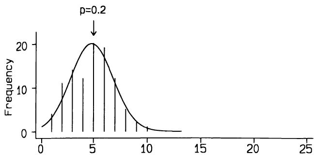
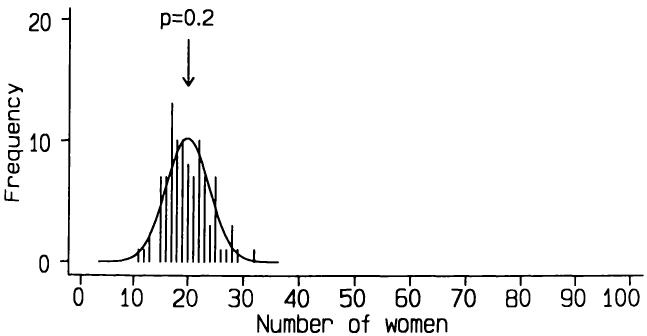
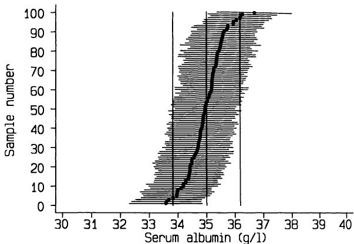

# 8 统计分析原则
# 8 Principles of statistical analysis

统计学的一个独特功能是：它使科学家能够对其结论的不确定性进行数值评估。
A distinctive function of statistics is this: it enables the scientist to make a numerical evaluation of the uncertainty of his conclusion.

Snedecor (1950)
Snedecor (1950)

## 8.1 引言
## 8.1 INTRODUCTION

当我们出于研究目的分析医学数据时，其意图是将从个体样本中得出的结果推断到所有相似个体的总体。我们在动物和实验室研究以及许多流行病学研究中，最清楚地看到了这一点，在这些研究中，数据无法与个体受试者对应，但它同样适用于病例对照研究、临床试验以及一般的临床研究。虽然我们可能也从临床角度对每个个体感兴趣，但研究通常旨在总结许多个体的经验以得出普遍结论。因此，统计学的主要思想之一是—统计分析的目的是利用从个体样本中获得的信息对相关总体进行推断。
When we analyse medical data for research purposes the intention is to extrapolate the findings from a sample of individuals to the population of all similar individuals. We see this most clearly in animal and laboratory studies as well as in much epidemiological research, where the data cannot be identified with individual subjects, but it applies equally to case- control studies, clinical trials and indeed to clinical research in general. While we may also be interested in each individual from a clinical point of view, research is usually aimed at summarizing the experience of many individuals to draw general conclusions. Thus one of the main ideas of statistics is this - the aim of statistical analysis is to use the information gained from a sample of individuals to make inferences about the relevant population.

在大多数研究中，会收集一些数据用于描述性目的，例如关于研究对象的社会人口学和临床特征的信息。分析一组数据的第一步是描述这些基本数据，第3章中描述了用于此目的的简单描述性方法。在观察性研究中，大部分（如果不是全部）数据都属于这种类型。干预研究，包括临床试验和实验室实验，明确是不同观察集之间的比较。我们如何比较数据集，特别是考虑到推广研究结果的愿望？
In most research studies some data are collected for descriptive purposes, for example information about the demographic and clinical characteristics of subjects being studied. The first step in the analysis of a set of data is to describe such basic data, and simple descriptive methods for this purpose were described in Chapter 3. In observational studies most if not all the data will be of this type. Intervention studies, which include clinical trials and laboratory experiments, are explicitly comparisons between different sets of observations. How do we compare sets of data, especially in view of the desire to generalize the findings？

接下来的七个章节描述了大量统计方法，用于分析各种类型数据，以适应不同的研究设计。所考虑的大多数问题都涉及比较同类型观察组之间的数据，或关联同一组个体内的不同观察结果。尽管医学问题和统计解决方案种类繁多，但统计分析有两种基本方法
The following seven chapters describe a large number of statistical methods for analysing data of various types for different research designs. The majority of the problems considered involve making comparisons between groups of observations of the same type or relating different observations within one group of individuals. Despite the enormous variety of medical problems and statistical solutions there are two basic approaches

贯穿所有这些方法—估计和假设检验。接下来的部分将讨论这些方法背后的原理，然后将它们进行比较。本章中的思想对于理解统计思维以及理解后续章节至关重要。
to statistical analysis that run through all of these methods - estimation and hypothesis testing. The next sections will discuss the principles behind each of these methods, and then they will be compared. The ideas in this chapter are fundamental to an appreciation of statistical thinking and thus to an understanding of the subsequent chapters.

## 8.2 抽样分布
## 8.2 SAMPLING DISTRIBUTIONS

最重要的思想，已在第4.3节中介绍过，即我们取样本中获得的结果，并将其作为我们对相关总体真实情况的最佳估计。因此，例如，如果我们发现一种新的银屑病治疗方法比标准治疗方法更能缓解患者症状，或者男性血清胆固醇高于女性，或者某种温度和光照组合在实验室实验中优化了细胞生长，那么在每种情况下，我们都会预期在总体中也可能如此。为了使这种解释有效，样本必须具有总体代表性。本章描述的方法展示了如何量化证据的强度或其不确定性。
The most important idea, already introduced in section 4.3, is that we take the results obtained in the sample and use them as our best estimate of what is true for the relevant population. So, for example, if we find that a new treatment for psoriasis relieves the symptoms of patients more often than a standard treatment, or that serum cholesterol is higher in men than women, or that a certain combination of temperature and light optimizes cell growth in a laboratory experiment, then in each case we would expect that the same is likely to be true in the population. For this interpretation to be valid the sample must be representative of the population. The methods described in this chapter show how to quantify the strength of the evidence, or its uncertainty.

正如我们在第4章中看到的，来自正态分布的小型随机样本，其分布可能与正态分布完全不同。同样，随机样本的均值可能与总体均值不同，这仅仅是由于偶然性，尽管我们自然期望样本均值会非常接近总体均值。我们使用样本均值作为总体均值的估计值，因为这是我们所拥有的最佳信息，但单个样本的均值作为总体值的估计有多好呢？我们需要一种方法来评估与我们估计值相关的不确定性。解决这个问题的一种方法是假设我们可以从总体中抽取许多给定大小的样本。关于这些样本均值的变异性与总体（即真实）均值之间的关系，我们能说些什么呢？
As we saw in Chapter 4, small random samples from a Normal distribution may have a distribution that is not at all like a Normal distribution. Similarly, the mean of a random sample may differ from the population mean, just by chance, although naturally we expect the sample mean to be quite close to the population mean. We use the sample mean as an estimate of the population mean, because that is the best information we have, but how good is the mean of a single sample as an estimate of the population value？ We need a way of assessing the uncertainty associated with our estimate. One way to approach this problem is to suppose that we could take many samples of a given size from the population. What can we say about the variability of the means of these samples in relation to the population (i.e. true) mean？

在第3章中，标准差被引入作为衡量一组观测值围绕其均值变异性的指标。衡量假设的样本均值围绕真实均值的变异性显然是一个类似的问题。事实证明，我们可以对多个样本均值的性质做出一些令人惊讶的强有力陈述，并且我们可以利用这些信息来回答上面提出的问题，即当我们只抽取了一个样本时，我们能对不确定性说些什么。
In Chapter 3 the standard deviation was introduced as a measure of the variability of a set of observations around their mean. Measuring the variability of hypothetical sample means about the true mean is clearly a similar problem. It turns out that we can make some surprisingly strong statements about the properties of the means of several samples, and that we can use this information to answer the question posed above, namely what we can say about uncertainty when we have taken only one sample.

直观上，样本均值的变异性将具有以下特性是合理的：
It is intuitively reasonable that the variability of sample means will have the following properties:

1. 大样本均值之间的变异性将小于小样本均值之间的变异性； 
1. it will be less among the means of large samples than small samples; 
2. 它将小于总体中单个观测值的变异性；
2. it will be less than the variability of the individual observations in the population;

3. 它将随着总体中单个值之间变异性（标准差）的增大而增大。
3. it will increase with greater variability (standard deviation) among the individual values in the population.

所有这些确实都是正确的。数学上可以证明，随机样本均值的分布具有以下特性：
All of these are indeed true. It can be shown mathematically that the distribution of the means of random samples has the following properties:

(i) 样本均值分布的均值的期望值与总体均值相同。换句话说，平均而言，样本的均值将是总体的均值。此外，样本方差的期望值是总体方差。
(i) The expected value of the mean of the distribution of the sample means is the same as the population mean. In other words, on average the mean of a sample will be the mean of the population. Further, the expected value of the variance of a sample is the variance of the population.

(ii) 多个样本均值的标准差的期望值是 $\sigma /\sqrt{n}$ ，其中 $\sigma$ 是总体中变量的标准差， $n$ 是每个样本的大小。量 $\sigma /\sqrt{n}$ 被称为均值的标准误，以区别于观测值的标准差。我们可以使用单个样本中观察到的标准差 $s$ 来代替 $\sigma$ ，从而估计标准误。标准误的解释和使用将在第8.4节中讨论。
(ii) The expected value of the standard deviation of the means of several samples is  $\sigma /\sqrt{n}$  where  $\sigma$  is the standard deviation of the variable in the population and  $n$  is the size of each sample. The quantity  $\sigma /\sqrt{n}$  is known as the standard error of the mean, to distinguish it from the standard deviation of the observations. We can estimate the standard error from a single sample using the observed standard deviation in that sample,  $s$ , in place of  $\sigma$ . The interpretation and use of the standard error are discussed in section 8.4.

(iii) 如果总体中数据的分布是正态的，则样本均值的分布将是正态的。此外，令人惊讶的是，无论总体中变量的分布如何，只要样本足够大，样本均值的分布都将近似正态。这一重要结果被称为中心极限定理。它是许多主要统计方法的基础。有时我们关注的是一组值的和而不是均值。两者仅在除以观测值数量方面有所不同，因此中心极限定理同样适用于和与均值。
(iii) The distribution of the sample means will be Normal if the distribution of the data in the population is Normal. Further, and somewhat remarkably, the distribution of the sample means will be nearly Normal whatever the distribution of the variable in the population as long as the samples are large enough. This important result is known as the central limit theorem. It underlies many of the main statistical methods. Sometimes we will be concerned with the sum of a set of values rather than the mean. The two differ only with respect to division by the number of observations, so the central limit theorem applies equally to sums and means.

在实践中，当数据分布是单峰且不对称性不强时，（iii）中的样本量限制并不重要。反之，如果样本量足够大，无论数据分布如何，均值的分布都将是正态的。一般来说，数据越接近正态分布，均值在重复抽样中呈正态分布的假设就越合理。如果我们可以假设均值服从正态分布，那么就可以很容易地使用基于正态分布的方法（在第4章中介绍）来表示样本均值作为总体均值估计值的不确定性。我将在下一节回到这个问题。
In practice, the sample size restriction in (iii) is not relevant when the data have a distribution that is unimodal and not particularly asymmetric. Conversely, if the sample size is large enough the distribution of means will be Normal regardless of the distribution of the data. In general, the more Normal the data, the more reasonable will be the assumption that the mean will itself be Normally distributed in repeated sampling. If we can assume a Normal distribution for the mean it is easy to use the methods based on the Normal distribution (introduced in Chapter 4) to indicate the uncertainty of a sample mean as an estimate of the population mean. I shall return to this problem in the next section.

前面的讨论涉及从总体中抽取的样本均值，但声明（i）到（iii）也适用于样本比例。如果我们用1和0来表示感兴趣属性的存在或缺失，例如是否切除了扁桃体，那么样本中具有该属性的比例就是具有该属性的数量除以样本量。换句话说，具有该属性的比例 $p$ 是样本中1和0的均值，因此上述性质（i）到（iii）适用。然而，由于总体值肯定不是正态的（只能是1或0），性质（iii）将仅适用于大样本。另一种看待比例的方式是，具有某个属性的数量（等于样本量乘以 $p$）将遵循二项分布。正如我在第4章中提到的，对于较大的样本，二项分布会变得更像正态分布。如果观察到的比例是 $p$ 且样本量是 $n$，那么实际上是乘积 $np$ 的大小决定了与正态分布的接近程度。
The preceding discussion has related to the mean of a sample from a population, but statements (i) to (iii) also apply to a sample proportion. If we give the values 1 and 0 to indicate the presence or absence of the attribute of interest, for example having had one's tonsils removed, the proportion with the attribute in a sample is the number with the attribute divided by the sample size. In other words, the proportion  $p$  with the attribute is the mean of the 1s and 0s in the sample, and so properties (i) to (iii) above apply. However, as the population values are certainly not Normal, being either 1 or 0, property (iii) will apply only to large samples. Another way of looking at proportions is that the number with an attribute (which is equal to the sample size times  $p$ ) will follow a Binomial distribution. As I mentioned in Chapter 4, the Binomial distribution becomes more like a Normal distribution for larger samples. If the observed proportion is  $p$  and the sample size is  $n$ , then it is in fact the magnitude of the product  $np$  that determines the closeness to a Normal distribution.

## 8.3 样本均值分布的演示
## 8.3 A DEMONSTRATION OF THE DISTRIBUTION OF SAMPLE MEANS

关于从多个样本估计的均值或比例分布的上述陈述的真实性，最好通过观察从总体中抽取许多样本时实际发生的情况来理解。找到合适的真实数据并不容易，因此为了演示所发生的情况，我使用了计算机模拟，这是一种在第6章中提到的技术。
The truth of the above statements about the distribution of means or proportions estimated from several samples can best be appreciated by seeing what actually happens when many samples are taken from a population. It is not easy to find appropriate real data, so to demonstrate what happens I have used computer simulation, a technique mentioned in Chapter 6.

首先，我将考虑总体中分布为正态的情况。根据上一节中的（i）和（ii），我们预期一组随机样本的均值也将具有正态分布，并且我们预期所有样本均值的标准差将是总体标准差除以 $\sqrt{n}$。像往常一样，这里的“预期”是指这平均而言会发生—一组多个样本仍然受到抽样变异的影响。
First I shall consider the case where the distribution in the population is Normal. From (i) and (ii) in the previous section we expect that the means of a set of random samples will also have a Normal distribution, and we expect the standard deviation of all the sample means to be the population standard deviation divided by  $\sqrt{n}$ . As usual, by 'expect' we mean that this will happen on average - a set of several samples is still subject to sampling variation.

我使用第4章中讨论的原发性胆汁性肝硬化（PBC）患者研究作为模拟的基础。我假设在所有PBC患者（这里是感兴趣的总体）中，血清白蛋白值服从均值为 $35 \mathrm{~g} / \mathrm{l}$，标准差为 $6 \mathrm{~g} / \mathrm{l}$ 的正态分布。我使用计算机模拟来研究从该正态分布中随机抽取大小为10、25和100的样本的分布。图8.1显示了PBC患者总体中血清白蛋白的理论正态分布，以及100个大小为10、25和100的随机样本均值的直方图。（请注意，由于有100个样本，直方图同时显示了频率和相对频率。）这100个均值集的预期标准差分别为 $6 / \sqrt{10}$、$6 / \sqrt{25}$ 和 $6 / \sqrt{100}$，即1.90、1.20和0.60。可以看出，观察到的分布是相当正态的，
I used the study of patients with primary biliary cirrhosis (PBC) discussed in Chapter 4 as the basis for the simulations. I supposed that among all patients with PBC, which is the population of interest here, serum albumin values have a Normal distribution with a mean of  $35 \mathrm{~g} / \mathrm{l}$  and a standard deviation of  $6 \mathrm{~g} / \mathrm{l}$ . I used computer simulation to study the distributions of samples of sizes 10, 25 and 100 drawn at random from this Normal distribution. Figure 8.1 shows the theoretical Normal distribution of serum albumin in the population of patients with PBC together with histograms of the means of 100 random samples of sizes 10, 25, and 100. (Note that as there were 100 samples the histograms show both frequencies and relative frequencies.) The expected standard deviations of the sets of 100 means are  $6 / \sqrt{10}$ ,  $6 / \sqrt{25}$  and  $6 / \sqrt{100}$  respectively, or 1.90, 1.20 and 0.60. It can be seen that the observed distributions are reasonably Normal,

特别是对于较大的样本，并且它们的均值和标准差接近预期值。随着均值数量的增加，直方图将更接近正态分布。
especially for larger samples, and that their means and standard deviations are close to the expected values. The histograms will get nearer to a Normal distribution as the number of means increases.

上一节中的性质（iii）指出，对于足够大的样本，即使总体值不服从正态分布，我们也应该观察到类似的现象。我们可以使用基于PBC试验中血清胆红素数据的模拟来研究这种效应。实际的胆红素值具有高度偏斜的分布，均值为 $60.73 \mu \mathrm{mol} / \mathrm{l}$，标准差为 $77.91 \mu \mathrm{mol} / \mathrm{l}$，但血清胆红素的对数近似服从正态分布，均值为3.55，标准差为1.03。我假设在所有PBC患者的总体中，血清胆红素对数服从均值为 $3.6 \log \mu \mathrm{mol} / \mathrm{l}$，标准差为 $1.1 \log \mu \mathrm{mol} / \mathrm{l}$ 的正态分布。图8.2显示了原始血清胆红素值的相应对数正态分布，以及从这个明显偏斜的分布中抽取大小为10、25和100的随机样本的结果。我们可以看到，随着样本量的增加，样本均值的分布变得更接近正态，但即使对于100个样本，均值的分布仍然略微不对称。总体值越偏斜，均值要接近正态分布所需的样本量就越大。
Property (iii) in the previous section stated that for samples large enough we should observe a similar phenomenon even when the population values do not have a Normal distribution. We can study this effect using simulation based on the serum bilirubin data in the PBC trial. The actual bilirubin values had a highly skewed distribution with a mean of  $60.73 \mu \mathrm{mol} / \mathrm{l}$  and a standard deviation of  $77.91 \mu \mathrm{mol} / \mathrm{l}$ , but log serum bilirubin had an approximately Normal distribution, with a mean of 3.55 and standard deviation 1.03. I supposed that in the population of all PBC patients log serum bilirubin has a Normal distribution with a mean of  $3.6 \log \mu \mathrm{mol} / \mathrm{l}$  and a standard deviation of  $1.1 \log \mu \mathrm{mol} / \mathrm{l}$ . Figure 8.2 shows the corresponding Lognormal distribution of raw serum bilirubin values and the results of taking random samples of size 10, 25 and 100 from this markedly skewed distribution. We can see that the distribution of the sample means becomes more nearly Normal as the size of the sample increases, but even for samples of 100 the distribution of means is still slightly asymmetric. The more skewed the population values the larger the sample size needed for the means to have a near Normal distribution.

我们可以用类似的方式研究观察到的比例的行为。根据全科医生咨询的数据，英国女性哮喘的患病率约为0.20（即 $20\%$）（Fleming and Crombie, 1987）。我们预期，在一系列英国女性随机样本中观察到的哮喘患者比例会随着样本量的增加而趋于正态分布。
We can study the behaviour of observed proportions in a similar way. On the basis of general practitioner consultations it seems that the prevalence of asthma among women in England is about 0.20 (i.e.  $20\%$ ) (Fleming and Crombie, 1987). We would expect that the observed proportions of asthma sufferers in a series of random samples of English women would tend to have a Normal distribution as the sample size is increased.

正如第4章所讨论的，样本中具有特定属性的受试者数量遵循二项分布。观察到的比例可以被视为一个均值，因此在重复的大样本中，我们预期样本比例的分布近似正态。我使用计算机模拟来研究当总体比例为0.2时样本比例的变异。图8.3显示了100个大小为10、25和100的随机样本中患哮喘女性比例的分布。很明显，随着样本量的增加，分布确实变得更像正态分布。二项分布与正态分布相似的速度取决于比例和样本量。比例越接近0或1，即使对于相当大的样本，二项分布也越不对称。
As discussed in Chapter 4, the number of subjects in a sample who have a particular attribute follows a Binomial distribution. The observed proportion can be considered to be a mean, and thus in repeated large samples we expect the distribution of the sample proportions to be approximately Normal. I used computer simulation to study the variation in the sample proportion when the population proportion is 0.2. Figure 8.3 shows the resulting distributions of the proportion of women suffering from asthma in 100 random samples of size 10, 25 and 100. It is clear that the distribution does indeed become more like a Normal distribution as the sample size increases. The speed with which the Binomial distribution resembles a Normal distribution depends upon the proportion and sample size. The nearer the proportion is to 0 or 1 the more asymmetric is the Binomial distribution even for quite large samples.

这些模拟实验从经验上验证了前一节中的三个论断。在实践中，我们几乎总是只获得一个样本，但由于我们可以预测如果抽取多个样本会发生什么，因此我们可以利用单个样本的值对总体做出有力的推断，并量化其不确定性。
These simulations have verified empirically the three statements in the previous section. In practice we nearly always have just a single sample, but because we can predict what would happen if many samples were taken we can use values from a single sample to make some strong inferences about the population, and can quantify the uncertainty.

  
图8.3 100个样本量分别为10、25和100的随机样本中，患哮喘女性人数（概率0.20）的观察分布。
Figure 8.3 Observed distributions of the number of women with asthma (probability 0.20) in 100 random samples of sizes 10, 25, and 100.

## 8.4 估计
## 8.4 ESTIMATION

我将首先考虑从样本中获取测量数据并希望得出总体均值结论的情况，然后考虑与总体中感兴趣的比例相关的相同问题。
I shall first consider the case where we have taken measurements from a sample of people and wish to draw conclusions about the mean of the population, and then consider the same problem relating to a proportion of interest in the population.

### 8.4.1 样本均值的标准误
### 8.4.1 Standard error of a sample mean

图4.5显示，216名PBC患者的血清白蛋白观测值分布接近正态分布。这些值的均值为 $34.46 \mathrm{g} / \mathrm{l}$，标准差为 $5.84 \mathrm{g} / \mathrm{l}$。我们能从这一个样本中推断出所有PBC患者总体中血清白蛋白值的情况吗？显然，任何推断都必须依赖于我们的样本能够代表总体，本节中的所有例子我都将做出这一假设。根据8.2节，我们对总体均值和标准差的最佳估计值也分别是34.46和 $5.84 \mathrm{g} / \mathrm{l}$。
Figure 4.5 showed that the distribution of the observed serum albumin values in 216 patients with PBC was close to a Normal distribution. The mean of these values was  $34.46 \mathrm{g} / \mathrm{l}$  and the standard deviation was  $5.84 \mathrm{g} / \mathrm{l}$ . What can we infer about serum albumin values in the population of all patients with PBC from this single sample？ Clearly any inference must depend on our sample being representative of the population, and I shall make this assumption for all the examples in this section. From section 8.2 our best estimates of the mean and standard deviation in the population are also 34.46 and  $5.84 \mathrm{g} / \mathrm{l}$ .

在上一节中我提到，许多样本均值的标准差将是 $\sigma /\sqrt{n}$，其中 $\sigma$ 是总体的标准差，这一点已通过模拟得到证实。样本均值的标准差是一个假设量，因为在实践中我们只抽取一个样本，所以我们给它一个不同的名称：均值的标准误（SEM）。尽管还有其他类型的标准误与其他的估计量相关联，但均值的标准误通常简写为标准误（SE），因为这样做通常不会引起歧义。标准误这个名称给出了其解释的指示，因为我们感兴趣的是以某种方式量化我们对均值的估计与真实、未知总体均值之间的好坏程度—我们可能犯多大的误差？
In the previous section I stated that the standard deviation of many sample means will be  $\sigma /\sqrt{n}$ , where  $\sigma$  is the standard deviation in the population, and this was demonstrated by simulation. The standard deviation of sample means is a hypothetical quantity, because in practice we take only a single sample, so we give it the different name of the standard error of the mean (SEM). Although there are other types of standard error associated with other estimates, the standard error of the mean is often abbreviated to standard error (SE) as it is not usually ambiguous to do so. The name standard error gives an indication of the interpretation, because we are interested to quantify in some way how good our estimate of the mean is of the true, and unknown, population mean - how large an error might we be making？

样本均值血清白蛋白的标准误因此是 $5.84 / \sqrt{216} = 0.397$。我们预期相同大小的重复样本的均值将服从均值为 $34.46 \mathrm{g} / \mathrm{l}$、标准差为 $0.397 \mathrm{g} / \mathrm{l}$ 的正态分布。请注意，标准误不是总体中任何量的估计值，而是许多样本均值之间变异性的一种指示，或者，换句话说，是单个样本均值作为总体均值估计值的不确定性度量。不确定性随样本量的增加而减小，这从公式中显而易见，并在图8.1中得到了证实。在8.4.5节中，我将展示如何使用标准误来构建置信区间。标准误本身虽然被广泛引用，但其作为量化指标的实用性较低。
The standard error of the sample mean serum albumin is thus  $5.84 / \sqrt{216} = 0.397$ . We would expect the means of repeated samples of the same size to have a Normal distribution with mean  $34.46 \mathrm{g} / \mathrm{l}$  and standard deviation  $0.397 \mathrm{g} / \mathrm{l}$ . Note that the standard error is not an estimate of any quantity in the population, but an indication of the variability among many sample means or, alternatively, a measure of the uncertainty of a single sample mean as an estimate of the population mean. The uncertainty decreases as the sample size increases, as is apparent from the formula and was demonstrated in Figure 8.1. In section 8.4.5 I shall show how to use the standard error to construct a confidence interval. The standard error itself, although widely quoted, is a less useful quantity.

### 8.4.2 两个样本均值之差的标准误
### 8.4.2 Standard error of the difference between two sample means

大多数医学研究是比较性的，因此我们更常关注
Most medical research is comparative, and so we are more often concerned

涉及两个或更多样本而非单个样本。比较两个样本尤其常见，为此，我们需要知道两个样本均值之差的标准误。
with two or more samples rather than a single sample. Comparing two samples is particularly common, and for this we need to know the standard error of the difference between the means of two samples.

在来自标准差为 $\sigma$ 的总体的单个样本中，均值抽样分布的方差为 $\sigma^{2} / n$，因此均值的标准误为 $\sigma /\sqrt{n}$。如果我们有两个独立样本，它们均值之差的方差是各自方差之和，因此均值之差的标准误是各自方差之和的平方根。用数学符号表示，如果两个均值分别为 $\bar{x}_{1}$ 和 $\bar{x}_{2}$，则
In a single sample from a population with a standard deviation of  $\sigma$  the variance of the sampling distribution of the mean is  $\sigma^{2} / n$ , and so the standard error of the mean is  $\sigma /\sqrt{n}$ . If we have two independent samples the variance of the difference between their means is the sum of the separate variances, so the standard error of the difference in means is the square root of the sum of the separate variances. In mathematical notation, if the two means are  $\bar{x}_{1}$  and  $\bar{x}_{2}$ , then

$$
\begin{array}{r l} & {s e(\bar{x}_{1} - \bar{x}_{2}) = \sqrt{v a r(\bar{x}_{1}) + v a r(\bar{x}_{2})}}\\ & {\qquad = \sqrt{\{s e(\bar{x}_{1})\}^{2} + \{s e(\bar{x}_{2})\}^{2}}}\\ & {\qquad = \sqrt{\frac{s_{1}^{2}}{n_{1}} + \frac{s_{2}^{2}}{n_{2}}}.} \end{array}
\begin{array}{r l} & {s e(\bar{x}_{1} - \bar{x}_{2}) = \sqrt{v a r(\bar{x}_{1}) + v a r(\bar{x}_{2})}}\\ & {\qquad = \sqrt{\{s e(\bar{x}_{1})\}^{2} + \{s e(\bar{x}_{2})\}^{2}}}\\ & {\qquad = \sqrt{\frac{s_{1}^{2}}{n_{1}} + \frac{s_{2}^{2}}{n_{2}}}.} \end{array}
$$

例如，一项关于急性心肌功能的大型研究发现，1551名男性的平均血尿素氮为 $23 \mathrm{mg / dl}$ (标准差13)，而538名女性的平均血尿素氮为 $25 \mathrm{mg / dl}$ (标准差15) (Dittrich 等，1988)。差值为 $2 \mathrm{mg / dl}$，其标准误为
For example, a large study of acute myocardial function found that 1551 men had a mean blood urea nitrogen of  $23 \mathrm{mg / dl}$  (SD 13) while among 538 women the mean was  $25 \mathrm{mg / dl}$  (SD 15) (Dittrich et al., 1988). The difference is  $2 \mathrm{mg / dl}$ , and its standard error is

$$
\sqrt{\frac{13^{2}}{1551} + \frac{15^{2}}{538}} = 0.726 \mathrm{mg / dl}.
\sqrt{\frac{13^{2}}{1551} + \frac{15^{2}}{538}} = 0.726 \mathrm{mg / dl}.
$$

如果样本量足够大（参见第8.4.5节），标准误可用于构建两个独立连续变量样本均值之差的置信区间。对于小样本，则采用略有不同的方法，这将在第9章中描述。
The standard error can be used to construct a confidence interval for the difference in the means of two independent samples of values of a continuous variable if the samples are large (see section 8.4.5). For small samples a slightly different approach is used, as will be described in Chapter 9.

### 8.4.3 样本比例的标准误
### 8.4.3 Standard error of a sample proportion

我已经表明，在大型样本中，样本比例将近似服从正态分布。因此，我们可以在样本量足够大的假设下，通过计算样本比例的标准误来进行近似。正如我们所见，对于 $p = 0.20$，即使是相当小的样本，这种近似也相当好。当 $p$ 和 $1 - p$ 都大于 $5 / n$ 时，使用这种近似是合理的。例如，对于样本量大于约50的样本，当比例在0.1到0.9之间时，该近似效果良好，但对于超出此范围的 $p$ 值，则需要更大的样本。
I showed that a sample proportion will have an approximately Normal distribution in large samples. We can thus make an approximation by calculating the standard error of a sample proportion under the assumption that the sample size is large enough. As we have seen, for  $p = 0.20$  the approximation is quite good even for fairly small samples. It is reasonable to use this approximation when  $p$  and  $1 - p$  are greater than  $5 / n$ . For example, the approximation is good for proportions in the range 0.1 and 0.9 for samples greater than about 50, but for values of  $p$  outside this range a larger sample is required.

在第4章中，样本量为 $n$ 的二项式比例 $p$ 的标准误已给出为 $\sqrt{p(1 - p) / n}$。因此，使用正态近似，我们预计如果总体比例为 $p$，那么在相同大小的重复样本中，观察到的比例将服从正态
The standard error of the Binomial proportion  $p$  in a sample of size  $n$  was given in Chapter 4 as  $\sqrt{p(1 - p) / n}$ . Using the Normal approximation we thus expect that if the population proportion is  $p$  then in repeated samples of the same size the observed proportions will have a Normal

分布，其均值为 $p$，标准差为 $\sqrt{p(1 - p) / n}$。回到之前的例子，如果我们观察到80名女性随机样本中有13名患有哮喘，那么根据该样本，我们将估计总体中患哮喘女性的比例为 $13 / 80 = 0.16$，标准误为 $\sqrt{0.16 \times 0.84 / 80} = 0.041$。
distribution with mean  $p$  and standard deviation  $\sqrt{p(1 - p) / n}$ . Returning to the earlier example, if we observe that 13 of a random sample of 80 women have asthma, then from that sample we would estimate that the proportion of women in the population with asthma is  $13 / 80 = 0.16$ , with a standard error of  $\sqrt{0.16 \times 0.84 / 80} = 0.041$ .

### 8.4.4 两个比例之差的标准误
### 8.4.4 Standard error of the difference between two proportions

我们可以用与8.4.2节中两个均值之差的标准误相同的方式来计算两个比例之差的标准误。如果我们从两个独立样本中得到两个观察到的比例 $p_{1}$ 和 $p_{2}$，那么它们之差 $p_{1} - p_{2}$ 的标准误由下式给出：
We can calculate the standard error of the difference between two proportions in the same manner as that of the difference between two means given in section 8.4.2. If we have two observed proportions,  $p_{1}$  and  $p_{2}$ , from two independent samples, then the standard error of their difference,  $p_{1} - p_{2}$ , is given by

$$
\begin{array}{r l} & {s e(p_{1} - p_{2}) = \sqrt{v a r(p_{1}) + v a r(p_{2})}}\\ & {\qquad = \sqrt{\{s e(p_{1})\}^{2} + \{s e(p_{2})\}^{2}}}\\ & {\qquad = \sqrt{\frac{p_{1}(1 - p_{1})}{n_{1}} + \frac{p_{2}(1 - p_{2})}{n_{2}}}.} \end{array}
\begin{array}{r l} & {s e(p_{1} - p_{2}) = \sqrt{v a r(p_{1}) + v a r(p_{2})}}\\ & {\qquad = \sqrt{\{s e(p_{1})\}^{2} + \{s e(p_{2})\}^{2}}}\\ & {\qquad = \sqrt{\frac{p_{1}(1 - p_{1})}{n_{1}} + \frac{p_{2}(1 - p_{2})}{n_{2}}}.} \end{array}
$$

例如，在一项针对青少年的大型研究中，712名男孩中有165人报告他们总是使用安全带，而641名女孩中有91人报告总是使用安全带（Maron et al., 1986）。这两个比例分别为0.232和0.142，因此比例之差为0.090。其差值的标准误为：
For example, in a large study of adolescents 165 of 712 boys reported that they always used a seat belt compared with 91 of 641 girls (Maron et al., 1986). The two proportions are 0.232 and 0.142, so the difference in proportions is 0.090. The standard error of the difference is

$$
\sqrt{\frac{0.232(1 - 0.232)}{712} + \frac{0.142(1 - 0.142)}{641}} = 0.0210
\sqrt{\frac{0.232(1 - 0.232)}{712} + \frac{0.142(1 - 0.142)}{641}} = 0.0210
$$

### 8.4.5 置信区间
### 8.4.5 Confidence intervals

我在8.2节中提到，样本中观察到的均值或比例是总体“真实”值的最佳估计，并且对于大样本，从多个样本中获得的值的分布将近似呈正态分布。我们可以将样本估计的这些特征与正态分布的已知特性结合起来，以了解单个样本对总体值估计的不确定性。我们通过构建置信区间来做到这一点，置信区间是一个我们确信包含真实值的范围。基本思想是置信区间覆盖了感兴趣统计量的抽样分布的很大一部分。
I observed in section 8.2 that the mean or proportion observed in a sample is the best estimate of the 'true' value in the population, and that the distribution of the values obtained in several samples would be approximately Normal for large samples. We can combine these features of estimates from a sample with the known properties of the Normal distribution to get an idea of the uncertainty associated with a single sample estimate of the population value. We do this by constructing a confidence interval, which is a range of values which we can be confident includes the true value. The basic idea is that the confidence interval covers a large proportion of the sampling distribution of the statistic of interest.

估计均值的置信区间以均值为中心，向两侧延伸均值标准误的倍数。例如，均值减3倍标准误到均值加3倍标准误之间的区间将是99.7%置信区间。因为从正态分布中获得一个值，其与均值的偏差达到三个
A confidence interval for the estimated mean extends either side of the mean by a multiple of the standard error. For example, the interval between mean - 3SE and mean + 3SE will be a 99.7% confidence interval. because the probability of getting a value from a Normal distribution three

或更多标准差的概率是 $0.3\%$（如4.5节和表B2所示）。最常见的是计算 $95\%$ 置信区间，其范围是从均值减1.96倍标准误到均值加1.96倍标准误。然而，选择 $95\%$ 除了惯例之外没有特别的原因，有时也会使用 $80\%$、$90\%$ 和 $99\%$ 的水平。
or more standard deviations from the mean is  $0.3\%$  (as shown in section 4.5 and Table B2). It is most common to calculate a  $95\%$  confidence interval, which is the range of values from mean - 1.96SE to mean +1.96SE. However, there is no particular reason for choosing  $95\%$  other than convention, and levels of  $80\%$ ,  $90\%$  and  $99\%$  are sometimes used.

我们预期 $95\%$ 置信区间将有 $5\%$ 的时间不包含真实的总体值。我们可以通过使用例如 $99\%$ 置信区间来提高包含总体均值的概率，但代价是区间更宽，从而不确定性更大。重要的一点是，无论样本量大小，由单个样本构建的置信区间都有很小的机会不包含真实的总体均值。
We expect that the  $95\%$  confidence interval will not include the true population value  $5\%$  of the time. We can improve the probability of including the population mean by using, say, a  $99\%$  confidence interval, but at the cost of having a wider interval and thus greater uncertainty. The important point is that there is a small chance that the confidence interval constructed from a single sample will not include the true population mean, whatever the sample size.

样本均值的 $95\%$ 置信区间通常被解释为一个数值范围，其中包含真实总体均值的概率为0.95。因此，我们预期，如果使用图8.1所示的100个随机样本中的每一个来计算血清白蛋白平均值的 $95\%$ 置信区间，我们会发现其中大约有 $5\%$ 不包含 $35 \mathrm{g / l}$ 的值。图8.4显示了基于100个样本大小的全部100个置信区间，其中有七个不包含 $35 \mathrm{g / l}$。图8.5显示了按样本均值大小排序的置信区间，我们可以看到有七个样本均值落在我们预期 $95\%$ 样本均值会落入的范围之外。这个范围是使用
The  $95\%$  confidence interval for the sample mean is usually interpreted as a range of values which contains the true population mean with probability 0.95. We thus expect that if we calculate a  $95\%$  confidence interval for the mean serum albumin using each of the 100 random samples shown in Figure 8.1 we would find that about  $5\%$  of them would not include the value of  $35 \mathrm{g / l}$ . Figure 8.4 shows all 100 confidence intervals based on samples of size 100 of which seven do not include  $35 \mathrm{g / l}$ . Figure 8.5 shows the confidence intervals sorted by the size of the sample mean and we can see that seven sample means fall outside the range within which we expect  $95\%$  of sample means. This range is calculated using the

  
图8.4 根据100个大小为100的随机样本构建的平均血清白蛋白置信区间。垂直线显示了预期 $95\%$ 样本均值会落入的范围。
Figure 8.4 Confidence intervals for mean serum albumin constructed from 100 random samples of size 100. The vertical lines show the range within which  $95\%$  of sample means are expected to fall.

  
图8.5 图8.4中的置信区间，按随机样本均值的大小排序。
Figure 8.5 Confidence intervals from Figure 8.4 ordered by the magnitude of the mean of the random sample.

总体均值和标准差计算得出的均值 $\pm 1.96\mathrm{SD} / \sqrt{n}$；即 $35 \pm 1.96 \times 6 / \sqrt{100}$ 或 33.8 到 36.2。观察到的 $7\%$ 与预期的 $5\%$ 之间的差异并不重要—我们不期望精确地观察到 $5\%$。
population mean and standard deviation to get mean  $\pm 1.96\mathrm{SD} / \sqrt{n}$ ; that is  $35 \pm 1.96 \times 6 / \sqrt{100}$  or 33.8 to 36.2. The difference between the observed  $7\%$  and the expected  $5\%$  is of no importance - we would not expect to observe exactly  $5\%$ .

在PBC试验中，我们实际观察到216名原发性胆汁性肝硬化患者样本的平均血清白蛋白为 $34.46 \mathrm{~g} / \mathrm{l}$，标准误为 $0.397 \mathrm{~g} / \mathrm{l}$。因此，$95\%$ 置信区间由 $34.46 - 1.96 \times 0.397$ 到 $34.46 + 1.96 \times 0.397$ 的值范围给出，即从 33.68 到 $35.24 \mathrm{~g} / \mathrm{l}$。因此，根据这项研究，我们有 $95\%$ 的信心认为所有此类患者的真实平均血清白蛋白介于 33.68 到 $35.24 \mathrm{~g} / \mathrm{l}$ 之间，其中 34.46 是我们最好的估计值。如前所述，这种解释取决于216名患者样本代表所有患病患者的假设。
In the PBC trial we actually observed a mean serum albumin of  $34.46 \mathrm{~g} / \mathrm{l}$  with a standard error of  $0.397 \mathrm{~g} / \mathrm{l}$  from a sample of 216 patients with primary biliary cirrhosis. The  $95\%$  confidence interval is thus given by the range of values from  $34.46 - 1.96 \times 0.397$  to  $34.46 + 1.96 \times 0.397$ , or from 33.68 to  $35.24 \mathrm{~g} / \mathrm{l}$ . We can thus be  $95\%$  confident from this study that the true mean serum albumin among all such patients lies somewhere in the range 33.68 to  $35.24 \mathrm{~g} / \mathrm{l}$ , with 34.46 as our best estimate. As mentioned earlier, this interpretation depends on the assumption that the sample of 216 patients is representative of all patients with the disease.

同样是这216名PBC患者，其血清胆红素值近似呈对数正态分布。我们可以通过依赖中心极限定理并使用与血清白蛋白相同的方法来计算血清胆红素均值的置信区间。然而，由于血清胆红素的分布高度偏斜，我们可能对中位数而非均值更感兴趣。因此，一个更有用的置信区间将是针对中位数的，或者我们可以计算血清胆红素对数值均值的置信区间，并将其反向转换以给出几何均值的置信区间。这些方法将在下一章中描述。
The same 216 patients with PBC had serum bilirubin values that had an approximately Lognormal distribution. We could calculate a confidence interval for the mean serum bilirubin by relying on the central limit theorem and using the same method as for serum albumin. However, because the distribution of serum bilirubin is highly skewed we would be more interested in the median rather than the mean. A more useful confidence interval would therefore be for the median, or we could calculate a confidence interval for the mean of the log serum bilirubin values and back- transform these to give a confidence interval for the geometric mean. These methods are described in the next chapter.

类似地，我们可以为我们80名女性样本构建一个 $95\%$ 置信区间，其中观察到的哮喘比例为0.16，标准误为0.039。样本比例的 $95\%$ 置信区间为从 $0.16 - 1.96 \times 0.039$ 到 $0.16 + 1.96 \times 0.039$，即从 0.08 到 0.24。因此，我们有 $95\%$ 的信心认为，根据这个样本，英国女性患哮喘的比例在 0.08 到 0.24 之间。置信区间较宽，因为80的样本量对于估计比例来说相当小。相比之下，男孩和女孩总是使用安全带的比例差异的 $95\%$ 置信区间较窄，因为这项研究规模较大。比例差异为0.090，其标准误为0.0210，因此 $95\%$ 置信区间为从 $0.090 - 1.96 \times 0.0210$ 到 $0.090 + 1.96 \times 0.0210$，即从 0.05 到 0.13。这些说明置信区间构建的例子利用了应用于大样本的正态分布理论。在后面的章节中，我们将使用 $t$ 分布而非正态分布来分析连续数据，但对比例数据仍使用正态分布。通过从估计值中加减其标准误的倍数来构建置信区间的一般原则几乎适用于所有情况。
Similarly, we can construct a  $95\%$  confidence interval for our sample of 80 women among whom the observed proportion with asthma was 0.16 with a standard error of 0.039. A  $95\%$  confidence interval for the sample proportion is from  $0.16 - 1.96 \times 0.039$  to  $0.16 + 1.96 \times 0.039$ , or from 0.08 to 0.24. We are thus  $95\%$  confident that on the basis of this sample the proportion of English women with asthma lies in the range 0.08 to 0.24. The confidence interval is wide because the sample size of 80 is rather small for estimating a proportion. In contrast, a  $95\%$  confidence interval for the difference in the proportions of boys and girls always using seat belts is narrower because the study was large. The difference in proportions was 0.090 and its standard error was 0.0210, so the  $95\%$  confidence interval is from  $0.090 - 1.96 \times 0.0210$  to  $0.090 + 1.96 \times 0.0210$ , or from 0.05 to 0.13. These examples illustrating the construction of confidence intervals have made use of Normal distribution theory applied to large samples. In later chapters we will use the  $t$  distribution rather than the Normal distribution for analysis of continuous data, but use the Normal distribution for proportions. The general principle of constructing a confidence interval by adding to or subtracting from an estimate a multiple of its standard error applies in nearly all cases.

这些说明置信区间构建的例子利用了应用于大样本的正态分布理论。在后面的章节中，我们将使用 $t$ 分布而非正态分布来分析连续数据，但对比例数据仍使用正态分布。通过从估计值中加减其标准误的倍数来构建置信区间的一般原则几乎适用于所有情况。
These examples illustrating the construction of confidence intervals have made use of Normal distribution theory applied to large samples. In later chapters we will use the  $t$  distribution rather than the Normal distribution for analysis of continuous data, but use the Normal distribution for proportions. The general principle of constructing a confidence interval by adding to or subtracting from an estimate a multiple of its standard error applies in nearly all cases.

许多统计分析旨在估计一个或多个感兴趣的量。本章讨论了均值和比例，但相同的思想也适用于其他量的估计。计算感兴趣估计量的标准误，由此获得置信区间。
Much statistical analysis aims to estimate one or more quantities of interest. Means and proportions have been discussed in this chapter, but the same ideas apply to estimates of other quantities. The standard error of the estimate of interest is calculated, from which one obtains a confidence interval.

## 8.5 假设检验
## 8.5 HYPOTHESIS TESTING

前几节中概述的方法看似非常直接，因此，医学中大多数统计分析并非采用这种形式，而是基于一种不同且不那么直观的方法，即假设检验，这可能会让人感到有些惊讶。大多数统计分析都涉及比较，最明显的是治疗或操作之间，或受试者组之间的比较。与所关注的比较对应的数值通常称为效应。我们可以提出一个假设，称为零假设，即所关注的效应为零，例如，男性和女性的平均血清胆固醇水平相同，或者两种治疗头痛的方法同样有效。这种统计零假设通常是产生数据的研究假设的否定。在第一个例子中，研究假设可能是男性和女性的血清胆固醇水平存在差异。我们还有一个备择假设，通常只是指所关注的效应不为零。在设定零假设后，我们接着评估在零假设为真时，
The approach outlined in the preceding sections seems so straightforward that it may come as some surprise that most statistical analysis in medicine is not of this form, but is based on a different and less intuitive approach called hypothesis testing. The majority of statistical analyses involve comparison, most obviously between treatments or procedures or between groups of subjects. The numerical value corresponding to the comparison of interest is often called the effect. We can state a hypothesis called the null hypothesis that the effect of interest is zero, for example that serum cholesterol is the same on average for men and women or that two treatments for headache are equally effective. This statistical null hypothesis is often the negation of the research hypothesis that generated the data. In the first example, the research hypothesis might be that there was a difference between men and women with respect to their serum cholesterol levels. We also have an alternative hypothesis, which is usually simply that the effect of interest is not zero. Having set up the null hypothesis, we then evaluate the probability that

在设定零假设后，我们接着评估
Having set up the null hypothesis, we then evaluate the probability that

我们获得观察到的数据（或更极端的数据）的可能性。这个概率通常称为 $\mathbf{P}$ 值；它越小，零假设就越站不住脚。这种方法之所以称为检验，是因为它涉及决定我们是否可以拒绝零假设。例如，我们可能会发现，在一项比较男性和女性血清胆固醇水平的研究中，男性有较高的趋势，并且 $\mathbf{P}$ 值为0.10。请注意，这种方法没有直接提及所关注效应的大小：分析结果用一个概率值来概括。由于这个原因以及其他原因，基于估计和置信区间的方法被广泛认为是更优越的，但假设检验仍然是一种重要的统计方法，理解其基本原理和解释至关重要。第7.5.3节中描述的Shapiro-Wilk非正态性检验就是假设检验的一个例子。
we could have obtained the observed data (or data that were more extreme) if the null hypothesis were true. This probability is usually called the  $\mathbf{P}$  value; the smaller it is the more untenable is the null hypothesis. The method is called testing because of the aspect of deciding whether or not we can reject the null hypothesis. We might find, for example, that in a study comparing serum cholesterol levels of men and women, there was a tendency for higher levels in men, and the  $\mathbf{P}$  value was 0.10. Notice that there is no direct reference in this method to the magnitude of the effect of interest: the analysis is summarized by a probability value. For this and other reasons the approach based on estimation and confidence intervals is widely considered superior, but hypothesis testing remains an important statistical method, and it is essential to understand the underlying principles and interpretation. The Shapiro- Wilk test for non- Normality, described in section 7.5.3, is an example of a hypothesis test.

如果零假设为真，我们如何评估获得我们数据的概率？对于本书中讨论的大多数问题，答案在于计算一个检验统计量—一个我们可以与零假设为真时所期望的已知分布进行比较的值。检验统计量的一般形式可以表示为与感兴趣量的观测值和零假设为真时期望值之间的关系。观测值是感兴趣的估计值，例如男性和女性平均血清胆固醇的差异。对于迄今为止描述的情况，检验统计量由以下公式给出：
How do we evaluate the probability of obtaining our data if the null hypothesis is true？ For most of the problems discussed in this book the answer lies in calculating a test statistic - a value which we can compare with the known distribution of what we expect when the null hypothesis is true. The general form of the test statistic can be expressed in relation to the observed value of the quantity of interest and the value expected if the null hypothesis were true. The observed value is the estimate of interest, such as the difference in mean serum cholesterol between men and women. For the situations so far described the test statistic is given by

在许多情况下，假设值为零，因此检验统计量变为感兴趣的观测值与其标准误之比。将感兴趣量的大小评估为其标准误的倍数这一思想在统计分析的主要方法中很常见。然而，在后面章节中讨论的几种情况下，检验统计量并非上述形式。
In many cases the hypothesized value is zero, so that the test statistic becomes the ratio of the observed quantity of interest to its standard error. The idea that the magnitude of the quantity of interest is evaluated as a multiple of its standard error is common in the main methods of statistical analysis. However, there are several situations discussed in later chapters where the test statistic is not of the above form.

在后面章节中讨论的某些情况下，我们将看到，当零假设为真时，检验统计量可以被认为是服从正态分布的。在其他情况下，特别是研究均值时，我们需要使用略有不同的 $t$ 分布，但原理是相同的。
In some circumstances discussed in later chapters we will see that when the null hypothesis is true the test statistic can be considered to have a Normal distribution. In other cases, notably when studying means, we need to use the slightly different  $t$  distribution, but the principle is the same.

我们通过计算在零假设为真时，我们观察到该值或更极端（即更不可能）值的概率来评估检验统计量。感兴趣的概率，即 $\mathbf{P}$ 值，因此是分布的尾部面积。举例来说，我将考虑检验统计量在零假设为真时服从正态分布的情况。假设我们希望使用216名PBC患者的样本来评估零假设，即所有PBC患者的平均血清白蛋白为 $33.5 \mathrm{g} / \mathrm{l}$。如前所示，样本中血清白蛋白的平均值为
We evaluate a test statistic by calculating the probability that we could have observed that value, or one that is more extreme (i.e. more unlikely). if the null hypothesis is true. The probability of interest, or  $\mathbf{P}$  value, is thus the tail area of the distribution. As an example, I shall consider the case where the test statistic has a Normal distribution when the null hypothesis is true. Suppose we wish to use the sample of 216 PBC patients to evaluate the null hypothesis that the mean serum albumin in all PBC patients is  $33.5 \mathrm{g} / \mathrm{l}$  . As shown earlier, the mean serum albumin in the sample was

34.46 g/l，其标准误为 $0.397 \mathrm{g} / \mathrm{l}$。在这种情况下，我们可以使用上面给出的公式，因此我们计算检验统计量为 (34.46 - 33.5)/0.397，结果为2.42。根据表B1，正态分布中对应于该检验统计量值的尾部面积为0.0078，即 $0.78\%$。然而，检验统计量可能是负值，当零假设为真时，分布另一尾部的等效值同样极端或不可能，因此我们将面积加倍，得到P值为0.0155。这个值可以直接从表B2中获得。换句话说，如果零假设为真，检验统计量为2.42或更大的概率仅为0.0155。我们称之为双侧检验，原因显而易见。关于是使用双侧检验还是单侧检验的问题将在第8.5.6节中讨论。我们可以在第8.4节中描述的所有可以计算置信区间的情况下进行假设检验，这在一般情况下是正确的。然而，在后面的章节中，我们将看到在某些情况下我们可以进行假设检验但无法获得置信区间。
34.46 g/l and its standard error was  $0.397 \mathrm{g} / \mathrm{l}$ . This is a situation where we can use the formula given above, so we calculate the test statistic as (34.46 - 33.5)/0.397, which is 2.42. From Table B1 the tail area of the Normal distribution corresponding to this value of the test statistic is 0.0078, or  $0.78\%$ . However, the test statistic could be negative, and the equivalent values in the other tail of the distribution are just as extreme, or unlikely, when the null hypothesis is true so we double the area to get a P value of 0.0155. This value can be obtained directly from Table B2. In other words, a test statistic of 2.42 or more would arise with a probability of only 0.0155 if the null hypothesis is true. We call this a two- tailed test, for obvious reasons. The question of whether to use a two- tailed or a one- tailed test is discussed in section 8.5.6. We can carry out a hypothesis test for all the situations described in section 8.4 where we can calculate a confidence interval, and this is true in general. In later chapters, however, we will see that there are some circumstances where we can perform a hypothesis test but cannot obtain a confidence interval.

我们可以在第8.4节中描述的所有可以计算置信区间的情况下进行假设检验，这在一般情况下是正确的。然而，在后面的章节中，我们将看到在某些情况下我们可以进行假设检验但无法获得置信区间。
We can carry out a hypothesis test for all the situations described in section 8.4 where we can calculate a confidence interval, and this is true in general. In later chapters, however, we will see that there are some circumstances where we can perform a hypothesis test but cannot obtain a confidence interval.

### 8.5.1 P值的解释
### 8.5.1 Interpretation of P values

P值在医学研究论文中比比皆是，因此，理解它们的精确含义以及它们不意味着什么至关重要。P值是在零假设为真时，观察到我们的数据（或更极端的数据）的概率。例如，在临床试验中，这个陈述指的是治疗组之间观察到的差异。因此，我们正在将我们的数据与当零假设在总体中为真时，样本中由于偶然性引起的可能变异联系起来。
P values abound in medical research papers, so it is essential to understand precisely what they mean, and also what they do not mean. The P value is the probability of having observed our data (or more extreme data) when the null hypothesis is true. For example, in a clinical trial this statement refers to the observed difference between the treatment groups. We are therefore relating our data to the likely variation in a sample due to chance when the null hypothesis is true in the population.

我们已经看到，样本产生的结果与总体中的真实情况不同，并且样本间的变异性随着样本量的增加而减小。在后续章节中将看到，在计算检验统计量以及P值时，这些事实都已被考虑在内。
We have seen that samples give results that differ from what is true in the population, and that the variability among samples decreases as the sample size increases. It will be seen in subsequent chapters that these facts are taken into account when test statistics, and hence P values, are calculated.

P值的解释是有问题的。如果我们进行一项临床试验来比较两种治疗方法，并得到一个“大”P值，例如大于0.2，那么我们可以说，当零假设确实为真时，像我们这样的数据可能经常出现。因此，我们不能排除零假设为真的可能性—也就是说，两种治疗方法同样有效。反之，如果P值非常小，例如小于0.001，那么零假设似乎就不太可能，因为当零假设为真时，我们的数据几乎不可能纯粹偶然产生。因此，我们可以确信零假设不为真，并且一种治疗方法更优。在这两个极端之间存在一个灰色区域，但通常会选择一个截断点，如果P值小于该截断值，则拒绝零假设。因此，对零假设的检验是
The interpretation of a P value is problematic. If we carry out a clinical trial to compare two treatments and get a 'large' value of P, say greater than 0.2, then we can say that data such as ours could occur often when the null hypothesis is really true. We thus cannot rule out the possibility that the null hypothesis is true - that is, that the two treatments are equally effective. Conversely if P is very small, say less than 0.001, then the null hypothesis appears implausible because our data could hardly ever arise purely by chance when the null hypothesis is true. We can therefore feel confident that the null hypothesis is not true and one treatment is superior. Between these two extremes lies a grey area, but conventionally a cut- off is chosen and if P is smaller than the cut- off value the null hypothesis is rejected. The test of the null hypothesis is therefore whether

P值是否低于所选的截断点。
or not P lies below the chosen cut- off point.

尽管截断点的选择是任意的，但在实践中，大多数情况下我们使用0.05。换句话说，当零假设为真时，一个发生概率小于二十分之一的结果将导致零假设被拒绝。在这种表述中，当我们拒绝零假设时，我们接受一个互补的备择假设，在临床试验的例子中，即两种治疗方法效果不相等。如果P值超过临界值，我们不拒绝零假设。然而，我们不能说我们相信零假设为真，而只能说没有足够的证据来拒绝它。这是一个微妙但重要的区别。
Although the choice of cut- off is arbitrary, in practice in most cases we use 0.05. In other words, an outcome that could occur less than one time in 20 when the null hypothesis is true would lead to the rejection of the null hypothesis. In this formulation, when we reject the null hypothesis we accept a complementary alternative hypothesis, which in the clinical trial example is that the two treatments are not equally effective. If the P value exceeds the critical value we do not reject the null hypothesis. However, we cannot say that we believe the null hypothesis is true, but only that there is not enough evidence to reject it. This is a subtle but important distinction.

当 $\mathbf{P}$ 低于截断值，例如0.05时，结果被称为统计学显著（如果低于某个更低的水平，例如0.01，则可能被称为高度显著）；当高于0.05时，则被称为不显著。因此，假设检验常被称为显著性检验。“显著”一词的使用导致统计学显著性和临床显著性之间产生许多混淆。由于假设检验的广泛使用，一些医学期刊将“显著”一词的用法限制在其统计学含义上。然而，将统计学显著的结果视为真实效应，并常常暗示其也具有临床重要性，这是一种常见做法。这两种解释都不一定合理。例如，在5.4节描述的比较左右臂血压的研究中，发现了一个约 $1\mathrm{mmHg}$ 的微小差异（包括收缩压和舒张压）（Gould et al., 1985）。这个差异在统计学上高度显著，但在临床上却不重要。同样，仅仅因为我们不能排除零假设，就将不显著的结果视为没有效应，这也是不合理的。
When  $\mathbf{P}$  is below the cut- off, say 0.05, the result is called statistically significant (and below some lower level, such as 0.01, it may be called highly significant); when above 0.05 it is called not significant. For this reason hypothesis tests are often called significance tests. The use of the word significant leads to much confusion between statistical and clinical significance. Because of the widespread use of hypothesis tests some medical journals restrict the use of the word significant to its statistical meaning. However, it is common practice to take a statistically significant result as a real effect, and often, by implication, as a clinically important effect too. Neither interpretation is necessarily justified. For example. in the study to compare blood pressure in the left and right arms described in section 5.4, a small difference of about  $1\mathrm{mmHg}$  (both systolic and diastolic) was found (Gould et al., 1985). This difference was highly statistically significant but of no importance clinically. Similarly it is not reasonable to take a non- significant result as indicating no effect. just because we cannot rule out the null hypothesis.

### 8.5.2 P值作为显著性水平
### 8.5.2 P as a significance level

统计显著性的截断水平通常设为0.05，但有时也设为0.01。这些截断点是任意的，没有特定的重要性。根据所获得的 $\mathbf{P}$ 值是0.055还是0.045就对研究结果进行不同的解释，这是荒谬的。这些 $\mathbf{P}$ 值应该得出非常相似的结论，而不是截然相反的结论。数据的微小变化很容易使 $\mathbf{P}$ 值发生如此或更大的偏移。
The cut- off level for statistical significance is usually taken at 0.05. but sometimes at 0.01. These cut- offs are arbitrary and have no specif. importance. It is ridiculous to interpret the results of a study differentl. according to whether the  $\mathbf{P}$  value obtained was, say, 0.055 or 0.045. The.  $\mathbf{P}$  values should lead to very similar conclusions, not diametrically opposed ones. A minor change to the data can easily shift the  $\mathbf{P}$  value by this amount or more.

近年来，人们对 $\mathbf{P}$ 值的看法已从根据其是否位于任意的0.05值一侧而将其视为显著或不显著，转向引用实际的 $\mathbf{P}$ 值，这是一个可喜的转变。现在越来越常见地看到诸如 $\mathbf{P} = 0.02$ 或 $\mathbf{P} = 0.15$ 的表达，而不是 $\mathbf{P}< 0.05$ 或 $\mathbf{P} > 0.05$ 。原因之一是许多统计计算机程序会给出精确的 $\mathbf{P}$ 值，而过去则需要从仅给出与某些 $\mathbf{P}$ 值（如0.1、0.05、0.01和0.001）对应的检验统计量的表格中评估 $\mathbf[P13]$ 值。（表B3就是这种类型。）引用实际的 $\mathbf[P14]$ 值允许读者自行解释。
In recent years there has been a welcome move away from regarding the  $\mathbf{P}$  value as significant or not significant, according to which side of the arbitrary 0.05 value it is, towards quoting the actual  $\mathbf{P}$  value. It is increasingly common to see expressions such as  $\mathbf{P} = 0.02$  or  $\mathbf{P} = 0.15$  rather than  $\mathbf{P}< 0.05$  or  $\mathbf{P} > 0.05$ . One reason for this is that many statistical computer programs give the exact  $\mathbf{P}$  value, whereas it used to be necessary to evaluate a  $\mathbf{P}$  value from tables in which test statistics were given.

仅对应于某些 $\mathbf{P}$ 值，例如0.1、0.05、0.01和0.001。（表B3就是这种类型。）引用实际的 $\mathbf{P}$ 值允许读者自行解释。
corresponding to certain  $\mathbf{P}$  values only, such as 0.1, 0.05, 0.01 and 0.001. (Table B3 is of this type.) Quoting the actual  $\mathbf{P}$  value allows the reader to make his or her own interpretation.

但是，如果不参照0.05的水平，又该如何解释 $\mathbf{P}$ 值呢？对于这个问题，并没有真正令人满意的答案，因为 $\mathbf{P}$ 值是一种不自然的表达结果的方式。在第8.8节中，我将对比假设检验和通过置信区间进行的估计，并解释为什么后者更受青睐。
But how does one interpret  $\mathbf{P}$  values if not in relation to the 0.05 level？ There is no really satisfactory answer to this question, because  $\mathbf{P}$  values are an unnatural way of expressing results. In section 8.8 I contrast hypothesis testing and estimation via confidence intervals, and explain why the latter are greatly preferred.

### 8.5.3 I型和II型错误
### 8.5.3 Type I and Type II errors

对 $\mathbf{P}$ 值使用截断点（cut-off）会导致将分析视为一个决策过程。在此框架内，通常（但不明智地）认为统计学上显著的效应是真实存在的，反之，非显著结果则表明没有效应。强制在显著和非显著之间做出选择，会掩盖我们从样本中进行推断时固有的不确定性。当我们构建置信区间时，不确定性是明确显示的，但对于假设检验而言，它则是隐含的，并且很容易被忽视。
The use of a cut- off for  $\mathbf{P}$  leads to treating the analysis as a process for making a decision. Within this framework it is customary (but unwise) to consider that a statistically significant effect is a real one, and conversely that a non- significant result indicates that there is no effect. Forcing a choice between significant and non- significant obscures the uncertainty present whenever we draw inferences from a sample. When we construct a confidence interval the uncertainty is shown explicitly, but with a hypothesis test it is implicit, and may easily be overlooked.

当使用 $\mathbf{P}$ 值进行决策时，可能会犯两种错误。首先，当原假设实际上为真时，我们却可能得到一个显著结果，从而拒绝原假设。这被称为I型错误，可以认为是“假阳性”结果。或者，当原假设不为真时，我们却可能得到一个非显著结果，在这种情况下，我们犯了II型错误。这可以认为是“假阴性”发现。
Two possible errors can be made when using  $\mathbf{P}$  to make a decision. Firstly, we can obtain a significant result, and thus reject the null hypothesis, when the null hypothesis is in fact true. This is called a Type I error, and may be thought of as a 'false positive' result. Alternatively, we may obtain a non significant result when the null hypothesis is not true, in which case we make a Type II error. This can be thought of as a 'false negative' finding.

I型和II型错误的概率有时分别称为alpha $(\alpha)$ 和beta $(\beta)$。对于任何假设检验，alpha的值是预先确定的，通常为 $5\%$。beta的值取决于我们感兴趣的效应大小，也取决于样本量。我们更常谈论研究检测特定大小效应的把握度（power），其中把握度是 $1 - \beta$，或 $100(1 - \beta)\%$。宽泛的置信区间表明把握度较低。
The probabilities of Type I and Type II errors are sometimes called alpha  $(\alpha)$  and beta  $(\beta)$ . For any hypothesis test the value of alpha is determined in advance, usually as  $5\%$ . The value of beta depends upon the size of effect that one is interested in, and also the sample size. More often we talk about the power of a study to detect an effect of a specified size, where the power is  $1 - \beta$ , or  $100(1 - \beta)\%$ . A wide confidence interval is an indication of low power.

我们也可以通过选择合适的样本量来预先确定β值。换句话说，我们可以计算一项研究所需的样本量，使其以高概率发现给定效应量的真实效应。第15章展示了如何对比较两组的研究进行计算。对于更复杂的设计，建议向统计学家咨询样本量。
We can also fix beta in advance by choosing an appropriate sample size. In other words, we can calculate the necessary sample size for a study to have a high probability of finding a true effect of a given magnitude. Chapter 15 shows how to perform the calculations for studies comparing two groups. For more complicated designs it is advisable to get advice on sample size from a statistician.

### 8.5.4 过度依赖 $\mathbf{P}$ 值
### 8.5.4 Over-reliance on  $\mathbf{P}$  values

将统计分析表述为只有两种可能结果—显著或不显著—的检验，对医学文献产生了有害影响。越来越多的证据表明，存在有利于
The formulation of statistical analysis as a test with two possible outcomes - significant or not significant - has had harmful effects on the medical literature. There is increasing evidence of publication bias in favour of

报告显著结果的论文的发表偏倚。如果进行多项相同的研究，它们的结果会因抽样变异而不同。那些显示出更大效应的研究更有可能达到统计学显著性，因此也更有可能被发表。即使在零假设为真时，情况也一样，因为我们知道20项研究中会有1项在5%水平上得出显著结果。结果是，已发表的研究是所有已进行研究中的有偏选择（参见第15.5.2节）。
papers reporting significant findings. If several identical studies are performed their results will vary because of sampling variation. Those studies that show larger effects will be more likely to be statistically significant and thus more likely to be published. The same applies even when the null hypothesis is true, as we know that one study in 20 will give a result significant at the  $5\%$  level. The consequence is that published studies are a biased selection of all studies carried out (see section 15.5.2).

达到统计学显著性常被视为成功，而非显著结果则被视为失败。这种现象体现在用“阳性”和“阴性”来描述具有显著或非显著结果的研究，这种用法应该被摒弃。同样的态度也体现在许多论文中出现的“未能达到统计学显著性”这一难听的短语中。
The achievement of statistical significance is often seen as success and a non- significant result as failure. This is exemplified by the use of the terms 'positive' and 'negative' to describe studies with significant or non- significant results, a usage that should be abandoned. The same attitude is also seen in the ugly phrase 'failed to reach statistical significance' which is seen in many papers.

Freiman 等人（1978）研究了 71 项已发表的“阴性”结果试验，这些试验的定义是 $\mathbf{P}$ 值大于 0.1，并为每项研究构建了置信区间。他们发现，对于近一半的试验，结果与 50% 的治疗改善相符，我们有理由认为这对于任何试验都具有临床价值。换句话说，置信区间足够宽，以至于包含了其中一种治疗效果比另一种好 50% 的可能性。在原始论文中，没有一篇论文的作者构建了置信区间。看待这些试验的其他方式是，它们的统计功效较低，并且样本量过小。由于标准误与样本量相关，一项小型研究可能未能检测到（并认定为显著）一个真实存在的差异。这些试验表明了统计显著性与临床重要性之间的非等同性。
Freiman et al. (1978) looked at 71 published trials with 'negative' results, defined as having  $\mathbf{P}$  values greater than 0.1, and constructed confidence intervals for each study. They found that for nearly half the trials the results were compatible with a  $50\%$  therapeutic improvement, which we may reasonably take as clinically valuable for any trial. In other words, the confidence intervals were wide enough to include the possibility that one treatment was  $50\%$  better than the other. In none of the original papers had the authors constructed a confidence interval. Other ways of looking at these trials are that they had low power and that the sample size was too small. Because the standard error is related to sample size, a small study may fail to detect (as significant) a difference that is real. These trials demonstrate the non- equivalence of statistical significance and clinical importance.

### 8.5.5 P 值的误解
### 8.5.5 Misinterpretation of P values

对 $\mathbf{P}$ 值的一个常见误解是，它是数据偶然发生的概率，或者等同于，$\mathbf{P}$ 是观察到的效应并非真实效应的概率。这种不正确定义与前面给出的真实定义之间的区别在于缺少“当原假设为真时”这个短语。这种遗漏导致了可以评估观察到的效应是真实效应的概率的错误信念。样本中观察到的效应是真实的，但我们不知道总体中什么是真实的。通过这种统计分析方法，我们所能做的只是在原假设为真时，计算观察到我们数据（或更不可能的数据）的概率。
A common misinterpretation of the  $\mathbf{P}$  value is that it is the probability of the data having arisen by chance or, equivalently, that  $\mathbf{P}$  is the probability that the observed effect is not a real one. The distinction between this incorrect definition and the true definition given earlier is the absence of the phrase when the null hypothesis is true. The omission leads to the incorrect belief that it is possible to evaluate the probability of the observed effect being a real one. The observed effect in the sample is genuine, but we do not know what is true in the population. All we can do with this approach to statistical analysis is to calculate the probability of observing our data (or more unlikely data) when the null hypothesis is true.

### 8.5.6 双侧 P 值还是单侧 P 值？
### 8.5.6 Two-sided or one-sided P values？

重申一下，$\mathbf{P}$ 值是在原假设为真时，获得至少与观察结果一样极端结果的概率。我之前指出
To reiterate, the  $\mathbf{P}$  value is the probability of obtaining a result at least as extreme as the observed result when the null hypothesis is true. I pointed

极端结果在两个方向上偶然发生的可能性是均等的，我们通过计算双侧 $\mathbf{P}$ 值来考虑这一点。在绝大多数情况下，这是正确的程序。在极少数情况下，如果认为真实差异只能在一个方向上发生，那么在相反方向上观察到的差异必然是偶然的，这是合理的。在这种情况下，备择假设仅限于一个方向上的效应，通过只考虑检验统计量分布的一个尾部来计算单侧 $\mathbf{P}$ 值是合理的。对于服从正态分布的检验统计量，通常的双侧 5% 截断点是 1.96，而单侧 5% 截断点是 1.64。差异不是特别大，但可能导致与固定统计显著性水平相关的不同解释。
out earlier that extreme results can occur by chance equally often in either direction, which we allow for by calculating a two- sided  $\mathbf{P}$  value. In the vast majority of cases this is the correct procedure. In rare cases it is reasonable to consider that a real difference can occur in only one direction, so that an observed difference in the opposite direction must be due to chance. Here the alternative hypothesis is restricted to an effect in one direction only, and it is reasonable to calculate a one- sided  $\mathbf{P}$  value by considering only one tail of the distribution of the test statistic. For a test statistic with a Normal distribution the usual two- sided  $5\%$  cut- off point is 1.96, whereas a one- sided  $5\%$  cut- off is given by 1.64. The difference is not particularly large but can lead to a different interpretation in relation to fixed levels of statistical significance.

单侧检验很少适用。即使我们有很强的先验预期，例如新疗法不可能比旧疗法差，我们也无法确定我们是对的。如果我们能确定，我们就不需要做实验了！如果认为单侧检验确实合适，那么这个决定必须在数据分析之前做出；它绝不能取决于结果是什么。我所见过的已发表论文中报告的少数单侧检验通常产生的 $\mathbf{P}$ 值介于 0.025 和 0.05 之间，这意味着如果采用双侧检验，结果将不显著。我怀疑其中大多数是预先计划的单侧检验。
One- sided tests are rarely appropriate. Even when we have strong prior expectations, for example that a new treatment cannot be worse than an old one, we cannot be sure that we are right. If we could be sure we would not need to do an experiment! If it is felt that a one- sided test really is appropriate, then this decision must be made before the data are analysed; it must not depend on what the results were. The small number of one- sided tests that I have seen reported in published papers have usually yielded  $\mathbf{P}$  values between 0.025 and 0.05, so that the result would have been non- significant with a two- sided test. I doubt that most of these were pre- planned one- sided tests.

估计和假设检验方法将在 8.8 节中进行比较。两者之间存在密切关系，但仅限于双侧假设检验。本书将始终使用双侧 $\mathbf{P}$ 值，我建议常规使用它们。在某些地方，我引用的值比附录 B 中表格能获得的值更精确。许多计算机程序提供精确的 $\mathbf{P}$ 值。
The estimation and hypothesis testing approaches will be compared in section 8.8. There is a close relation between the two, but only for a two- sided hypothesis test. Two- sided  $\mathbf{P}$  values will be used throughout this book, and I recommend that they are used routinely. In some places I quote more exact values than can be obtained from the tables in Appendix B. Many computer programs give exact  $\mathbf{P}$  values.

## 8.6 非参数方法
## 8.6 NON-PARAMETRIC METHODS

尽管置信区间和假设检验是两种截然不同的统计分析方法，但对于大多数统计方法而言，它们之间存在密切的数学联系，因为它们都基于相同的统计模型和关于抽样分布的相同假设。理论分布由称为参数的量来描述，特别是均值和标准差，因此使用分布假设的方法称为参数方法。还有另一类不涉及分布假设的统计方法，称为免分布方法或非参数方法。由于这些方法基于对秩而不是实际数据的分析，因此有时也称为秩方法。不幸的是，这三个术语都不能准确描述通常归入此类别中的所有方法。在本书中，我通常将这些方法称为
Although confidence intervals and hypothesis testing are rather different approaches to statistical analysis, they have a close mathematical link for the majority of statistical methods, because they are both based on the same statistical model and the same assumptions about sampling distributions. Theoretical distributions are described by quantities called parameters, notably the mean and standard deviation, so methods that use distributional assumptions are called parametric methods. There is another class of statistical methods which do not involve distributional assumptions which are called distribution- free or non- parametric methods. Because these methods are based on analysis of ranks rather than actual data, they are sometimes called rank methods. Unfortunately none of these three terms accurately describes all the methods usually considered to fall into this category. In this book I shall usually refer to these methods as

非参数，因为这是最常用的术语。请注意，“非参数”适用于分析数据的统计方法，而不是数据的属性。
non- parametric as this is the term in most frequent use. Note that 'non- parametric' applies to the statistical method used to analyse data, and is not a property of the data.

由于非参数方法通常不涉及任何分布假设，因此它们最常用于分析不符合参数方法分布要求的数据—通常是数据不服从正态分布。偏态数据通常通过非参数方法进行分析，而使用秩次的方法特别适用于评分而非测量数据。这些数据可能具有许多可能的值，例如来自视觉模拟量表的数据，或者只有少量值，例如Apgar评分或疾病分期。
As they do not usually involve any distributional assumptions, non- parametric methods are most often used to analyse data which do not meet the distributional requirements of parametric methods - usually that the data have a Normal distribution. Skewed data are commonly analysed by non- parametric methods, and methods using ranks are especially suitable for data which are scores rather than measurements. These could have many possible values, such as data from visual analogue scales, or only a few values, such as Apgar scores or stage of disease.

表8.1显示了来自一项1型糖尿病患者研究（Thuesen et al., 1985）的空腹血糖数据以及观测值的秩次。当存在两个或多个相同值时，取平均秩次。
Table 8.1 shows fasting blood glucose data from a study of Type 1 diabetics (Thuesen et al., 1985) together with the ranks of the observations. When there are two or more identical values the average rank is

表8.1 24名1型糖尿病患者的空腹血糖水平（Thuesen et al., 1985）  
Table 8.1 Fasting blood glucose levels in 24 Type 1 diabetics (Thuesen et al., 1985)  

<table><tr><td>血糖 (mmol/l)</td><td>秩次</td></tr><tr><td>4.2</td><td>1</td></tr><tr><td>4.9</td><td>2</td></tr><tr><td>5.2</td><td>3</td></tr><tr><td>5.3</td><td>4</td></tr><tr><td>6.7</td><td>5.5</td></tr><tr><td>6.7</td><td>5.5</td></tr><tr><td>7.2</td><td>7</td></tr><tr><td>7.5</td><td>8</td></tr><tr><td>8.1</td><td>9</td></tr><tr><td>8.6</td><td>10</td></tr><tr><td>8.8</td><td>11</td></tr><tr><td>9.3</td><td>12</td></tr><tr><td>9.5</td><td>13</td></tr><tr><td>10.3</td><td>14</td></tr><tr><td>10.8</td><td>15</td></tr><tr><td>11.1</td><td>16</td></tr><tr><td>12.2</td><td>17</td></tr><tr><td>12.5</td><td>18</td></tr><tr><td>13.3</td><td>19</td></tr><tr><td>15.1</td><td>20</td></tr><tr><td>15.3</td><td>21</td></tr><tr><td>16.1</td><td>22</td></tr><tr><td>19.0</td><td>23</td></tr><tr><td>19.5</td><td>24</td></tr></table>
<table><tr><td>Blood glucose (mmol/l)</td><td>Rank order</td></tr><tr><td>4.2</td><td>1</td></tr><tr><td>4.9</td><td>2</td></tr><tr><td>5.2</td><td>3</td></tr><tr><td>5.3</td><td>4</td></tr><tr><td>6.7</td><td>5.5</td></tr><tr><td>6.7</td><td>5.5</td></tr><tr><td>7.2</td><td>7</td></tr><tr><td>7.5</td><td>8</td></tr><tr><td>8.1</td><td>9</td></tr><tr><td>8.6</td><td>10</td></tr><tr><td>8.8</td><td>11</td></tr><tr><td>9.3</td><td>12</td></tr><tr><td>9.5</td><td>13</td></tr><tr><td>10.3</td><td>14</td></tr><tr><td>10.8</td><td>15</td></tr><tr><td>11.1</td><td>16</td></tr><tr><td>12.2</td><td>17</td></tr><tr><td>12.5</td><td>18</td></tr><tr><td>13.3</td><td>19</td></tr><tr><td>15.1</td><td>20</td></tr><tr><td>15.3</td><td>21</td></tr><tr><td>16.1</td><td>22</td></tr><tr><td>19.0</td><td>23</td></tr><tr><td>19.5</td><td>24</td></tr></table>

赋予每个“并列”观测值，如两个 $6.7 \mathrm{mmol / l}$ 值所示。我们可以不使用参数方法分析实际观测值，而是使用非参数方法分析秩次。例如，我们可能希望比较糖尿病患者两个亚组的血糖数据，此时分析将基于每个亚组内所有受试者的秩次之和。适当的方法将在下一章讨论。
given to each of the 'tied' observations concerned, as is shown for the two values of  $6.7 \mathrm{mmol / l}$ . Instead of analysing the actual observations using parametric methods we could analyse the ranks using non- parametric methods. For example, we might wish to compare the blood glucose data for two subgroups of the diabetics, for which the analysis would be based on the sums of the ranks for all subjects within each subgroup. The appropriate methods are discussed in the next chapter.

为了弥补无需对数据分布进行假设这一重要优势，秩次方法存在一个缺点，即它们更适合于假设检验而非估计。然而，非参数估计可以计算，最著名的例子是中位数，在某些情况下也可以计算非参数置信区间。对于更复杂的数据结构，估计变得困难或不可能，许多问题根本无法使用秩次方法处理。
To compensate for the important advantage of being free of assumptions about the distribution of the data there is the disadvantage that rank methods tend to be more suited to hypothesis testing than estimation. Non- parametric estimates can be calculated, however, the best known example being the median, and it is also possible in some cases to calculate non- parametric confidence intervals. Estimation becomes difficult or impossible for more complex data structures and many problems cannot be handled at all using rank methods.

对于简单的问题，例如比较两组受试者中的一个变量或在一组内关联两个变量，免分布方法具有明显的优势，其使用将在后续章节中与参数方法进行对比。
For simple problems, such as comparing one variable in two groups of subjects or relating two variables within one group the distribution free approach has definite advantages, and its use will be contrasted to the parametric approach in later chapters.

非参数方法大多基于比较秩次之和。一组观测值的和是其平均值的简单倍数，因此中心极限定理也适用于这些秩次和。因此，除非样本量很小，否则在进行非参数检验时通常可以使用正态近似，从而使方法更容易应用。以这种方式使用正态分布似乎很奇怪，因为这些方法明确避免了对观测值分布的具体性质做出任何假设。区分正态分布在统计学中的两种用途很重要：描述一组观测值的分布和描述（或近似）某个感兴趣量的抽样分布。
Non- parametric methods are mostly based on comparing sums of ranks. The sum of a set of observations is a simple multiple of their average, so the central limit theorem also applies to these rank sums. Thus unless the samples are small it is often possible to use a Normal approximation when carrying out a non- parametric test, making it easier to apply the method. It seems strange to use the Normal distribution in this way when the methods explicitly avoid having to make any assumptions about the specific nature of the distribution of the observations. It is important to distinguish the two uses of the Normal distribution in statistics: to describe the distribution of a set of observations and to describe (or approximate) the sampling distribution of some quantity of interest.

## 8.7 统计建模
## 8.7 STATISTICAL MODELLING

在估计和假设检验的思想背后，隐藏着一种被称为“建模”的通用统计分析策略。统计模型是两个或多个变量之间的数学关系，它能近似描述观测数据。我们通常不认为模型描述了变量之间关系的潜在机制，但它是一种与数据兼容的简化。
Behind the ideas of estimation and hypothesis testing lies a general strategy for statistical analysis called modelling. A statistical model is a mathematical relationship between two or more variables that gives an approximate description of the observed data. We do not usually believe that the model describes the underlying mechanism of a relation between variables, but it is a simplification which is compatible with the data.

本书中描述的大多数参数方法都属于一个统一的理论框架，称为线性模型，其中“线性”意味着“可加性”。其思想是，观测数据可以通过一个模型来解释，在该模型中，不同影响的效果是相加的。回到第3章开头给出的血压例子，一个统计
Most of the parametric methods described in this book fall into a unified theoretical framework known as linear models, where 'linear' means 'additive'. The idea is that the observed data can be explained by a model in which the effects of different influences are added. To return to the example of blood pressure given at the start of Chapter 3, a statistical

血压模型可能包括与年龄、性别、种族、吸烟、一天中的时间等相关的贡献。
model for blood pressure might include contributions relating to age, sex, race, smoking, time of day, and so on.

血压模型可能包括与年龄、性别、种族、吸烟、一天中的时间等相关的贡献。本书中描述的大多数分析所依据的统计模型都非常简单，通常不会被详细描述，但我将在第11章和第12章明确介绍模型。然而，与统计模型相关的两个关键思想将贯穿始终。首先，当我们拟合模型时会做出某些假设，并且尝试验证这些假设是否合理非常重要。一个明显的常见例子是假设数据近似服从正态分布，这种形式几乎出现在本书中描述的所有模型中。其次，考虑模型“拟合”数据的程度的两个方面也很重要。我们需要检查是否存在系统性差异，并且我们还必须考虑模型在预测个体值方面的有用性。例如，许多研究人员已经拟合模型，试图根据母亲特征和胎儿测量值来预测出生体重。尽管已知许多变量与出生体重相关，但包含所有已知影响的模型并不能准确预测单个婴儿的出生体重。在第11章中将定义的一种意义上，这些模型仅解释了出生体重变异性的 $25 - 30\%$ 。这里我们再次看到了估计和假设检验之间的区别。模型中的变量与出生体重显著相关，无论是单独还是集体，但从模型中得出的出生体重估计值过于不精确，以至于在临床上没有用（尽管它们在流行病学上可能有用）。
model for blood pressure might include contributions relating to age, sex, race, smoking, time of day, and so on.For most analyses described in this book the underlying statistical model is very simple and will not usually be described, but I shall introduce models explicitly in Chapters 11 and 12. However, two key ideas associated with statistical models will be apparent throughout. First, certain assumptions are made when we fit a model, and it is important to try to verify that these are reasonable. An obvious common example is the assumption that the data have an approximately Normal distribution, some form of which appears in nearly all of the models described in this book. Second, it is also important to consider two aspects of how well the model 'fits' the data. We need to check that there are no systematic discrepancies, and we must also consider how useful the model is at predicting a value for an individual. For example, many researchers have fitted models to try to predict birthweight from maternal characteristics and fetal measurements. Although many variables are known to be related to birthweight, models that include all known influences do not allow us to predict birthweight at all accurately for an individual baby. In a sense to be defined in Chapter 11, the models account for only  $25 - 30\%$  of the variability in birthweight. Here we see again the distinction between estimation and hypothesis testing. The variables in the model are significantly associated with birthweight, both individually and collectively, but the estimates of birthweight derived from the model are too imprecise to be clinically useful (although they may be epidemiologically useful).

## 8.8 估计还是假设检验？
## 8.8 ESTIMATION OR HYPOTHESIS TESTING？

在过去的40年里，统计方法在医学研究中的应用急剧增加，假设检验被广泛使用，并且分析方法也趋于复杂。如今，很少有研究论文不包含假设检验，但不幸的是，它们的使用往往是以牺牲对数据的其他解释为代价的。特别是，常见的是将某些比较的结果仅仅表示为一个P值，甚至仅仅是“显著”或“不显著”。虽然P值提供了信息，但它们只讲述了故事的一部分，需要伴随更直接的关于实际观察到的信息。
Over the last 40 years there has been a dramatic surge in the use of statistical methods in medical research, with widespread use of hypothesis tests and a trend towards more complex methods of analysis. Nowadays few research papers do not include hypothesis tests, but unfortunately their use is often at the expense of any other interpretation of the data. In particular it is common to see the results of some comparison expressed solely as a P value, or even just as 'significant' or 'not significant'. While P values are informative they tell only part of the story, and need to be accompanied by more direct information about what was actually observed.

有些研究纯粹是探索性的，例如寻找可能值得更详细研究的关联，但对于大多数研究而言，仅仅通过“统计学显著”的宣告无法有意义地解释结果。如上所述，这样的结果不一定是临床显著的，非显著的发现也并非必然可以忽略。通过简单估计对结果进行量化是数据分析的重要组成部分。临床医生是否会使用一种能降低血压或偏头痛频率的新疗法，将
Some research is purely exploratory, for example looking for possible associations worthy of more detailed study, but for most research the results cannot be meaningfully interpreted from a pronouncement of 'statistically significant'. As discussed above, it is not necessarily true that such a result is clinically significant, nor is a non- significant finding necessarily ignorable. Quantification of the results by simple estimates is an essential part of the analysis of data. Whether a clinician will use a new treatment that reduces blood pressure or the frequency of migraines will

取决于降低的幅度。这也可能取决于效果的一致性。一种能使每个人的偏头痛发病率降低 $30\%$ 的药物，可能比一种能使某些患者发病率降低 $50\%$ 但对其他患者无效的药物更好。一个单一的数字（P值）无法传达所有必要的信息；还需要适当的估计值和置信区间。
depend on the amount of the reduction. It may also depend on how consistent the effect is. A drug that reduces everybody's incidence of migraines by  $30\%$  may be better than one which reduces the incidence by  $50\%$  for some patients but does nothing for others. A single number (the P value) cannot convey all the necessary information; the appropriate estimates and confidence intervals are needed too.

大多数已发表的研究确实包含了感兴趣效应的估计值，并且包含 $\mathbf{P}$ 值的做法已成为标准，但直到最近，置信区间的使用仍然罕见。然而，最近，一些领先的医学期刊朝着鼓励甚至要求作者在主要发现中同时呈现置信区间的方向迈出了可喜的一步（参见 Gardner 和 Altman，1989a）。
Most published research does include estimates of the effects of interest, and it has become standard practice to include  $\mathbf{P}$  values, but until recently the use of confidence intervals was rare. Lately, however, there has been a welcome move by several leading medical journals towards encouraging or even requiring authors to present confidence intervals in conjunction with their main findings (see Gardner and Altman, 1989a).

### 8.8.1 置信区间与统计显著性之间的关系
### 8.8.1 Relation between confidence intervals and statistical significance

尽管假设检验和置信区间看起来不同，但它们之间实际上存在密切关系。$\mathbf{P}$值将小于0.05（即“显著”）仅当$95\%$置信区间不包含零时（或者，更一般地，不包含零假设中指定的值）。这种关系的原因是，这两种方法都基于检验统计量理论分布的相似方面。$99\%$置信区间与$1\%$水平的相关显著性检验之间也存在同样的关系，依此类推。
Different though hypothesis testing and confidence intervals may appear there is in fact a close relation between them. The  $\mathbf{P}$  value will be less than 0.05 (i.e. 'significant') only when the  $95\%$  confidence interval does not include zero (or, more generally, the value specified in the null hypothesis). The reason for this relation is that both methods are based on similar aspects of the theoretical distribution of the test statistic. The same relation applies between the  $99\%$  confidence interval and the related significance test at the  $1\%$  level, and so on.

置信区间显示了感兴趣估计值的不确定性或缺乏精确性，因此比$\mathbf{P}$值传达了更多有用的信息。由于上述关系，通过呈现置信区间，我们也表明了$\mathbf{P}$是否高于或低于$5\%$的截止水平。同时呈现实际的$\mathbf{P}$值和置信区间是可取的，但如果只给出其中一个，$\mathbf{P}$值可以省略—它不那么重要，而且无论如何都可以从置信区间中粗略估计出来。
The confidence interval shows the uncertainty, or lack of precision, in the estimate of interest, and thus conveys more useful information than the  $\mathbf{P}$  value. Because of the relation described above, by presenting a confidence interval we also indicate whether  $\mathbf{P}$  is above or below the cut- off level of  $5\%$ . The presentation of both the actual  $\mathbf{P}$  value and the confidence interval is desirable, but if only one is given the  $\mathbf{P}$  value may be omitted - - it is less important, and in any case can be gauged roughly from the confidence interval.

本节讨论的问题在Cox (1982)和Gardner和Altman (1989b)中有更详细的探讨。
The issues discussed in this section are considered at greater length by Cox (1982) and Gardner and Altman (1989b).

## 8.9 数据分析策略
## 8.9 STRATEGY FOR ANALYSING DATA

我强烈建议使用计算机，或者至少是可编程计算器进行统计分析。第6章介绍了使用计算机的各种优点，但也提到了一些缺点。第6.6节给出了使用计算机分析数据的策略，尽管这些原则并非计算机分析所特有。
I strongly recommend that a computer, or at least a programmable calculator, is used for statistical analysis. Chapter 6 presented various advantages, but also some drawbacks, of using a computer. Section 6.6 gave a strategy for analysing data using a computer, although the principles are not specific to analysis by computer.

第6章未涵盖的一个方面是如何判断哪种方法适合分析一组数据。第9至12章描述了
One aspect not covered in Chapter 6 was how to tell which is the appropriate method of analysing a set of data. Chapters 9 to 12 describe a

大量不同的分析方法。这些章节的标题描述的是所解决的问题，而不是方法的名称：
large number of different methods of analysis. The titles of these chapters are descriptive of the problems tackled rather than the names of the methods:

章节标题
Chapter Title

9 比较组别—连续数据
9 Comparing groups - continuous data

10 比较组别—分类数据
10 Comparing groups - categorical data

11 两个连续变量之间的关系
11 Relation between two continuous variables

12 多个变量之间的关系
12 Relation between several variables

第9章和第10章涵盖了对一个、两个或多个组中单个感兴趣变量的分析。在这些章节中，区分了对不同个体组进行的观察和对相同个体在多个场合进行的观察—即“配对数据”。相比之下，第11章和第12章涵盖了分析，其中我们关注的是单个个体组中两个或更多变量之间的相互关系。请注意，在大多数研究中，会收集大量变量的信息，但这些变量通常使用第9章和第10章中更简单的技术进行单独分析。第12章提供了关于何时这种方法是或不是明智的指导。
Chapter 9 and 10 cover analyses where you have a single variable of interest for one, two or more groups. Within these chapters the distinction is made between observations made on different groups of individuals and observations made on more than one occasion on the same individuals - 'paired data'. Chapters 11 and 12, in contrast, cover analytes where we are interested in the inter- relationship between two or more variables for a single group of individuals. Note that in most studies information on a large number of variables is collected, but the variables are analyzed separately using the simpler techniques of Chapters 9 and 10. Chapter 12 gives guidance on when this is or is not a sensible approach.

第13章考虑了生存时间的分析，这是第9章所考虑问题的一个特例，需要特殊的分析方法，以及时间相关数据分析中更普遍的问题。第14章讨论了医学数据分析中一些常见的特定问题。在这些章节描述的许多方法中，同时呈现了置信区间和假设检验。
Chapter 13 considers the analysis of survival times, which is a special case of the problems considered in Chapter 9, and requires special method of analysis, and more general problems in the analysis of time- related data. Chapter 14 discusses some specific common problems in the analysis of medical data. For many of the methods described in these chapters both confidence intervals and hypothesis tests are presented.

## 8.10 结果的呈现
## 8.10 PRESENTATION OF RESULTS

本章介绍的方法在随后的几章中会反复出现，因此对结果的呈现方式提出一些一般性评论可能会有所帮助。
The methods introduced in this chapter recur in several subsequent chapters so some general comments on presentation of results may be helpful.

估计值和置信区间应以相同的方式处理，即均值和标准差（参见第3.7节）。应说明置信区间的覆盖百分比。
Estimates and confidence intervals should be treated in the same way, means and standard deviations (see section 3.7). The percentage coverage of confidence intervals should be stated.

在可能的情况下，给出实际的P值，而不是诸如P<0.05的范围。P值无需引用超过两位有效数字，例如P=0.14，P=0.012，P=0.001。通常无需指定P值低于0.0001。如果您从表格中获取P值，那么您将根据表格中的值得到一个介于两个限值之间的值。我们使用“<”（小于）和“>”（大于）符号，例如P<0.05或0.05 >P>0.01。当P值介于0.01和0.05之间时，习惯上使用较短的限值P<0.05，因为假定如果P值小于0.01，您会使用P<0.01。对于P值大于0.05的情况，最好比P>0.05更具体，例如P=0.15。
Where possible give actual P values rather than ranges such as P<0.05 No more than two significant figures need be quoted. as in P=0.14 P=0.012. P=0.001. It is not usually necessary to specify P below. 0.0001. If you obtain P from tables then you will cad up with a value between two limits, according to the values that are tabulated. We use the signs <' (less than) and >' (greater than) in expressions such as P<0.05 or 0.05 >P>0.01. It is convcational to use the shorter limits P<0.05 when P is between 0.01 and 0.05. as it is assumed that if P was less than 0.01 you would have used P<0.01. For values of P greater than 0.05 it is useful to be more specific than P>0.05. for example by P=0.15

或 $\mathbf{P} > 0.2$ 。不要在未定义术语（通常为 $\mathbf{P} > 0.05$ ）的情况下使用NS作为不显著的缩写，并且请不要使用糟糕的 $\mathbf{P} = \mathbf{NS}$ 。通常假定 $\mathbf{P}$ 值为双侧的，除非另有说明。单侧检验的使用应始终注明（并给出理由）。
or  $\mathbf{P} > 0.2$ . Do not use the abbreviation NS for not significant without defining the term (usually  $\mathbf{P} > 0.05$ ) and please do not use the appalling  $\mathbf{P} = \mathbf{NS}$ . It is generally assumed that  $\mathbf{P}$  values are two- sided unless stated otherwise. The use of one- sided tests should always be noted (and justified).

## 8.11 总结
## 8.11 SUMMARY

分析自己的数据和评估医学文献的能力，都取决于理解统计分析背后的基本思想，以及熟悉所使用的统计方法。
Analysing your own data and being able to evaluate the medical literature depend upon understanding the basic ideas behind statistical analysis as well as being familiar with the statistical methods used.

在本章中，我详细讨论了与感兴趣的参数（如均值或比例）相关的抽样分布概念。其中一个主要议题是中心极限定理，根据该定理，无论总体中数据的分布形状如何，随着样本量的增加，样本均值的抽样分布都趋近于正态分布。这一结果构成了后续章节中许多方法的基础。
In this chapter I have discussed in detail the idea of a sampling distribution relating to a parameter of interest, such as a mean or a proportion. A major topic covered was the central limit theorem, by which the sampling distribution of the mean of a sample approaches a Normal distribution as the sample size increases, regardless of the shape of the distribution of the data in the population. This result underlies many of the methods described in subsequent chapters.

我还介绍了统计推断的两种主要方法—估计和假设检验。所概述的一般原则对于理解本书的其余章节以及理解统计分析和解释的全部内容至关重要。已发表的论文倾向于以一种可能不透明的速记方式呈现结果—例如，以均值和标准误的形式。重要的是要了解可以从这些量中推断出什么以及不能推断出什么，特别是通过构建置信区间。同样，大多数已发表的论文都包含 $\mathbf{P}$ 值，但对其解释往往是错误的。重要的是要理解 $\mathbf{P}$ 值的真正含义，并认识到统计显著性与临床重要性并非一回事。
I have also introduced the two main approaches to statistical inference - - estimation and hypothesis testing. The general principles outlined are fundamental to an appreciation of the remaining chapters of this book, and to understanding what statistical analysis and interpretation is all about. Published papers tend to present results in a shorthand way that can be opaque - for example as means and standard errors. It is important to know what can and cannot be inferred from these quantities, especially by constructing confidence intervals. Likewise, most published papers contain  $\mathbf{P}$  values but the interpretation of them is often faulty. It is important to understand the true meaning of the  $\mathbf{P}$  value, and to realize that statistical significance and clinical importance are not the same thing.

在阅读完接下来的几章（描述特定统计方法）之后，重读本章的部分内容可能会有所帮助。
It may be helpful to re- read parts of this chapter after the next few chapters describing particular statistical methods.

## 练习
## EXERCISES

8.1 镇上有两家医院。平均而言，较大的医院每天出生45名婴儿，较小的医院每天出生15名婴儿。婴儿是男孩的概率约为0.52，双胞胎的概率约为0.012。在任何一天，哪家医院更有可能：
8.1 There are two hospitals in a town. On average 45 babies are born each day in the larger hospital, and 15 in the smaller. The probability of a baby being a boy is about 0.52, and the probability of twins is about 0.012. On any day which hospital is more likely

(a) 有一对双胞胎出生，
(a) to have a set of twins delivered,

(b) 超过 $60\%$ 的婴儿是男孩？
(b) to have more than  $60\%$  of babies being boys？

（回答这些问题不需要数学计算。）
(No mathematics is required to answer these questions.)

（基于Kahneman和Tversky，1982）
(Based on Kahneman and Tversky, 1982)

8.2 八名糖尿病患者在口服 $100 \text{g}$ 葡萄糖前和一小时后测量了血浆葡萄糖水平（mmol/l）（Feingold 等人，1989），结果如下：
8.2 Eight diabetic patients had plasma glucose levels (mmol/l) measured before and one hour after oral administration of  $100 \text{g}$  glucose (Feingold et al., 1989), with the following results

<table><tr><td rowspan="2">Patient</td><td rowspan="2">Before</td><td colspan="2">Plasma glucose (mmol/l)</td></tr><tr><td>After</td><td>Change</td></tr><tr><td>1</td><td>4.67</td><td>5.44</td><td>0.77</td></tr><tr><td>2</td><td>4.97</td><td>10.11</td><td>5.14</td></tr><tr><td>3</td><td>5.11</td><td>8.49</td><td>3.38</td></tr><tr><td>4</td><td>5.17</td><td>6.61</td><td>1.44</td></tr><tr><td>5</td><td>5.33</td><td>10.67</td><td>5.34</td></tr><tr><td>6</td><td>6.22</td><td>5.67</td><td>-0.55</td></tr><tr><td>7</td><td>6.50</td><td>5.78</td><td>-0.72</td></tr><tr><td>8</td><td>7.00</td><td>9.89</td><td>2.89</td></tr></table>
<table><tr><td rowspan="2">Patient</td><td rowspan="2">Before</td><td colspan="2">Plasma glucose (mmol/l)</td></tr><tr><td>After</td><td>Change</td></tr><tr><td>1</td><td>4.67</td><td>5.44</td><td>0.77</td></tr><tr><td>2</td><td>4.97</td><td>10.11</td><td>5.14</td></tr><tr><td>3</td><td>5.11</td><td>8.49</td><td>3.38</td></tr><tr><td>4</td><td>5.17</td><td>6.61</td><td>1.44</td></tr><tr><td>5</td><td>5.33</td><td>10.67</td><td>5.34</td></tr><tr><td>6</td><td>6.22</td><td>5.67</td><td>-0.55</td></tr><tr><td>7</td><td>6.50</td><td>5.78</td><td>-0.72</td></tr><tr><td>8</td><td>7.00</td><td>9.89</td><td>2.89</td></tr></table>

(a) 计算血浆葡萄糖平均变化量的标准误。
(a) Calculate the standard error of the mean change in plasma glucose.

(b) 基于这些数据，需要研究多少名糖尿病患者，才能使血浆葡萄糖水平平均变化量的 $95\%$ 置信区间宽度为 $0.5 \text{mmol / l}$？（假设正态分布是血浆葡萄糖变化量的适当抽样分布。）
(b) On the basis of these data, how many diabetic patients would need to be studied so that the width of the  $95\%$  confidence interval for the mean change in plasma glucose level was  $0.5 \text{mmol / l}$ ？ (Assume that the Normal distribution is the appropriate sampling distribution for the change in plasma glucose.)

8.3 在一项临床试验中，共有 100 名患者通过简单随机化被分配到两种治疗方案，证明两个治疗组中患者数量的差异超过 20 的概率大约是 $5\%$。（提示：考虑分配到其中一个组的患者数量的分布。）
8.3 In a clinical trial in which a total of 100 patients are allocated to two treatments by simple randomization, show that the probability that the difference between the numbers of patients in the two treatment groups exceeds 20 is about  $5\%$ . (Hint: consider the distribution of the number of patients allocated to one of the groups.)

8.4 进行了一项对照试验，旨在比较皮质类固醇泼尼松龙和安慰剂在乙型肝炎表面抗原阳性的慢性活动性肝炎患者中的效果（Lam 等人，1981）。在回复一封批评其分析的信件时，作者写道：“计算中使用了单尾检验，因为在之前的分析中，类固醇治疗组中主要并发症的发生频率显著更高”（Ng 等人，1981）。（此信息未在原始论文中给出。）
8.4 A controlled trial was performed to compare the corticosteroid prednisolone and placebo in patients with chronic active hepatitis positive for hepatitis B surface antigen (Lam et al., 1981). In response to a letter criticizing the analysis the author wrote: 'The one- tailed test was used in the calculations, since in a previous analysis major complications were encountered significantly more frequently in the steroid- treated group' (Ng et al., 1981). (This information had not been given in the original paper.)

这是否是执行单尾检验的有效理由？如果不是，为什么不是？
Is this a valid justification for performing one- tailed tests？ If not, why not？
