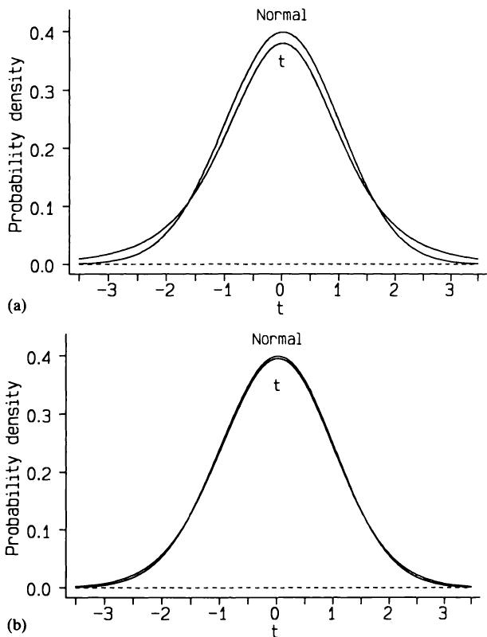

# 9 组间比较—连续性数据
# 9 Comparing groups - continuous data

好的答案源于好的问题，而非深奥的分析。Schoolman 等人（1968）
Good answers come from good questions not from esoteric analysis. Schoolman et al., (1968)

## 9.1 引言
## 9.1 INTRODUCTION

我们现在可以基于前几章的理念，来探讨数据分析的主要方法。特别是，我们将运用前一章中介绍的估计和假设检验思想。其他重要的理念包括分析与研究设计（第5章）以及观测数据性质（第2章）之间的关系。
We can now build on the ideas of the previous chapters to consider the main methods of data analysis. In particular we will use the ideas introduced in the previous chapter - estimation and hypothesis testing. Other important ideas are the relation between the analysis and the research design (Chapter 5) and the nature of the observations (Chapter 2).

本章讨论连续性数据的组间比较，从最简单的情况开始，即我们希望将一组观测数据与某个预设值进行比较，逐步过渡到对一组个体进行多组观测的情况。本章将介绍参数和非参数两种分析方法。第10章将讨论数据为分类变量时的相同情况。
This chapter deals with comparing groups of observations with respect to continuous data, starting with the simplest case where we wish to compare a single group of observations with some prespecified value, and moving through to the case where we have several sets of observations on each of a group of individuals. Both parametric and non- parametric approaches to analysis are introduced. Chapter 10 considers the same situations when the data are categorical.

## 9.2 选择合适的分析方法
## 9.2 CHOOSING AN APPROPRIATE METHOD OF ANALYSIS

在选择合适的分析方法时，我们必须考虑数据的几个方面，这些方面与研究设计、数据性质以及分析目的相关。
When choosing an appropriate method of analysis there are several aspects of the data that we must consider, relating to the design of the study, the nature of the data, and the purpose of the analysis.

### 9.2.1 观测组的数量
### 9.2.1 The number of groups of observations

尽管处理多组观测数据的方法也可以用于一组或两组数据，但为了方便起见，我们通常将单组和两组情况分开考虑，因为这样可以简化方法，并且解释起来问题较少。两组比较是统计分析中最常见的类型。
Although methods of dealing with several groups of observations can be used for just one or two groups it is convenient to consider the one and two group cases separately, as the methods can be simplified, and there are fewer problems of interpretation. The two group case is the most common type of statistical analysis.

### 9.2.2 独立或依赖的观测组
### 9.2.2 Independent or dependent groups of observations

当存在两组或多组观测值时，必须区分两种设计类型：
When there are two or more sets of observations there are two types of design that must be distinguished:

1. 观测值与独立的个体组相关。例如，我们可能有男孩和女孩的出生体重，或者患有不同疾病的患者组。样本量可能因组而异。
1. The observations relate to independent groups of individuals. For example, we may have birthweights of boys and girls or groups of patients with different diseases. The sample size may vary from group to group.

2. 每组观测值都是在同一组个体上进行的。例如，我们可能有一组女性的产前和产后血压测量值。我们将此类数据称为配对数据，以表明观测值来自同一批个体而非独立的样本。显然，每组数据中的观测值数量必须相同。
2. Each set of observations is made on the same group of individuals. For example, we may have antenatal and postnatal blood pressure measurements from one group of women. We call such data paired to indicate that the observations are on the same individuals rather than from independent samples. Clearly we must have the same number of observations in each set of data.

有时会研究两组不同的受试者，其中每个人都与另一组的成员进行个体匹配。在这种情况下，数据显然是关联的，应将其视为对一组进行配对观测。
Sometimes two different groups of subjects are studied where each person is individually matched with a member of the other group. Here the data are clearly linked and should be treated as if they are paired observations on one group.

### 9.2.3 数据类型
### 9.2.3 The type of data

连续数据和分类数据之间的区别已在第2章中讨论。然而，连续数据有几种类型，观测值的性质对统计分析有影响。具体来说，参数方法是基于计算均值和标准差的，因此它们不适用于有序分类数据，例如第2章中描述的Apgar评分。
The distinction between continuous and categorical data was discussed in Chapter 2. There are several types of continuous data, however, and the nature of the observations has implications for statistical analysis. Specifically, parametric methods are based on calculating means and standard deviations, so they are inappropriate for ordered categorical data such as the Apgar score described in Chapter 2.

### 9.2.4 数据的分布
### 9.2.4 The distribution of data

对于独立组，参数方法要求每组内的观测值具有近似正态分布，并且每组的标准差应相似。如果原始数据不满足这些条件，转换可能成功（参见第7章）。否则，应使用非参数方法。
For independent groups, parametric methods require the observations within each group to have an approximately Normal distribution, and the standard deviations in each group should be similar. If the raw data do not satisfy these conditions, a transformation may be successful (see Chapter 7). Otherwise a non- parametric method should be used.

对于与同一批人的两次或多次观测相关的配对数据，没有假设每组观测值都应呈正态分布，但存在一个不同的正态性假设，将在下文讨论。
For paired data relating to two or more observations on the same people there is no assumption that each set of observations should be Normally distributed, but there is a different assumption of Normality, discussed below.

### 9.2.5 分析目的
### 9.2.5 The objective of the analysis

本章通篇考虑了估计和假设检验。然而，当数据有三个或更多组时，组间有多种
Both estimation and hypothesis testing are considered throughout this chapter. However, with three or more groups of data there are several

可能的比较。选择调查哪些比较应直接根据研究目标。
possible comparisons between groups. The choice of which to investigate should follow directly from the objectives of the study.

## 9.3 $t$ 分布
## 9.3 THE  $t$  DISTRIBUTION

在上一章中，我展示了如何基于感兴趣的估计量（无论是均值还是比例）服从正态分布的假设来计算置信区间和执行假设检验。由于中心极限定理，我们知道这对于大样本来说是一个合理的假设，但并非所有样本都很大（例如，超过100个）。在连续数据分析中，均值的计算占据了重要地位，因此我们需要考虑小样本均值的分布。
In the previous chapter I showed how to calculate confidence intervals and perform hypothesis tests based on the assumption that the estimates of interest, either means or proportions, had a Normal distribution. Because of the central limit theorem we know that this is a reasonable assumption for large samples, but not all samples are large (more than 100, say). In the analysis of continuous data the calculation of means plays a prominent part, and so we need to consider the distribution of the mean for smaller samples.

本世纪初，W. S. Gossett 以“Student”之名撰文指出，从方差未知的正态分布中抽取的样本均值，其分布与正态分布相似但又不完全相同。他称之为 $t$ 分布，我们至今仍称之为 Student's $t$ 分布。随着样本量的增加，均值的抽样分布越来越接近正态分布。我们使用 $t$ 分布进行与一个或两个样本均值相关的估计和假设检验。尽管我们可以对大样本使用正态分布，但这样做意义不大，因为对于大样本，这两种方法给出的结果几乎相同，并且无论样本大小如何，使用相同的方法更简单。
Early in this century it was shown by W. S. Gossett, writing under the name of 'Student', that the mean of a sample from a Normal distribution with unknown variance has a distribution that is similar to, but not quite the same as, a Normal distribution. He called it the  $t$  distribution, and we still refer to it as Student's  $t$  distribution. As the sample size increases the sampling distribution of the mean becomes closer to the Normal distribution. We use the  $t$  distribution for estimation and hypothesis testing relating to the means of one or two samples. Although we can use the Normal distribution for large samples there is little point in doing so, since for large samples the methods give virtually identical answers and it is simpler to use the same method regardless of the sample size.

$t$ 分布有一个参数，一个称为自由度的量。自由度的概念是统计学中比较难以捉摸的思想之一。一般来说，自由度计算为样本量减去估计参数的数量。$t$ 分布的自由度与估计标准差有关，后者是围绕估计均值的变异计算得出的。因此，对于 $n$ 个观测值的单个样本，我们有 $n - 1$ 个自由度。
The  $t$  distribution has one parameter, a quantity called the degrees of freedom. The concept of degrees of freedom is one of the more elusive statistical ideas. In general the degrees of freedom are calculated as the sample size minus the number of estimated parameters. The degrees of freedom for the  $t$  distribution relate to the estimated standard deviation, which is calculated as variation around the estimated mean. Hence for a single sample of  $n$  observations we have  $n - 1$  degrees of freedom.

图9.1显示了自由度为5和25的 $t$ 分布，以及正态分布。后者接近正态分布，并且随着样本量的增加，$t$ 分布变得越来越接近正态。差异在分布的尾部最为显著，而这通常是我们感兴趣的部分。
Figure 9.1 shows the  $t$  distributions with 5 and 25 degrees of freedom, together with the Normal distribution. The latter is close to the Normal distribution, and as the sample size increases the  $t$  distribution becomes ever more Normal. The difference is most marked in the tails of the distributions, which is usually the part that we are interested in.

本章介绍的几乎所有参数方法，以及后续章节中的大多数方法，都使用了 $t$ 分布。在第8章中，我展示了如何通过将感兴趣的量与其标准误之比来计算使用正态分布的检验统计量。在使用 $t$ 分布时，我们使用相同的计算方法。唯一的区别是，我们在 $t$ 分布表（表B4）中查找结果，而不是正态分布表。同样，我们使用 $t$ 分布来计算置信区间。
Nearly all the parametric methods introduced in this chapter, and most that follow, make use of the  $t$  distribution. In Chapter 8 I showed how we calculate a test statistic using the Normal distribution by taking the ratio of the quantity of interest to its standard error. We use the same method of calculation when using the  $t$  distribution. The only difference is that we look up the result in a table of the  $t$  distribution (Table B4) rather than the Normal distribution. Likewise, we use the  $t$  distribution to calculate confidence intervals.

  
图9.1 Student's $t$ 分布，自由度分别为 (a) 5 和 (b) 25，以及标准正态分布。
Figure 9.1 Student's  $t$  distribution with (a) five, and (b) 25 degrees of freedom. together with the standard Normal distribution.

本章首先讨论了三种使用该分布的情况—单样本、配对样本和两个独立样本。最后，对于样本数量多于两个的情况，我们需要使用方差分析方法，为此我们使用 $F$ 分布（稍后介绍）而不是 $t$ 分布。所有这些参数方法都对正态性做出了假设。9.7节描述了通过取对数来分析偏斜数据。或者，本章讨论的所有问题都有非参数方法可用，并在各节中介绍。
This chapter deals first with three situations where we use the distribution - for one sample, paired samples, and two independent samples. Lastly, for the case with more than two samples we need the method called analysis of variance, for which we use the  $F$  distribution (introduced later) rather than the  $t$  distribution. All these parametric methods make assumptions about Normality. Section 9.7 describes the analysis of skewed data by taking logarithms. Alternatively, non- parametric methods are available for all the problems discussed in this chapter, and are introduced within each section.

## 9.4 一组观测值
## 9.4 ONE GROUP OF OBSERVATIONS

最简单的情况是，我们希望将一组观测值的均值与一个特定值进行比较。这种比较并不常见，但这种简单情况下的方法论为统计推断的主要方法提供了很好的入门。第9.4.1节和第9.4.2节描述了参数方法，而相应的非参数方法则在第9.4.3节至第9.4.5节中描述。
The simplest case to consider is when we wish to compare the mean of a single group of observations with a specific value. Comparisons like this are not very common, but the methodology for this simple case gives a good introduction to the main methods of statistical inference. Sections 9.4.1 and 9.4.2 describe parametric methods, with the equivalent non- parametric methods described in sections 9.4.3 to 9.4.5.

举例来说，假设我们希望将特定人群的平均膳食摄入量与推荐的每日摄入量进行比较。表9.1显示了11名22-30岁健康女性在十天内的平均每日能量摄入量。她们的平均每日摄入量为 $6753.6\mathrm{kJ}$。这一小样本观测值没有明显的偏态，可以合理地视为近似正态分布。请注意，每个观测值本身是多天内的平均值。对于高度可变的量，有时最好取多个值。关于这些女性的能量摄入量与推荐的每日摄入量 $7725\mathrm{kJ}$ 相比，我们能说些什么？
As an example, suppose we wish to compare the mean dietary intake of a particular group of individuals with the recommended daily intake. Table 9.1 shows the average daily energy intake over ten days in 11 healthy women aged 22- 30. Their mean daily intake was  $6753.6\mathrm{kJ}$ . The small sample of observations shows no obvious skewness and may reasonably be taken as approximately Normal. Notice that each observation is itself an average value over several days. It is sometimes a good idea to take several values of a highly variable quantity. What can we say about the energy intake of these women in relation to a recommended daily intake of  $7725\mathrm{kJ}$ ？

表9.1 11名健康女性10天内的平均每日能量摄入量 (kJ) (Manocha et al.,1986)  
Table 9.1 Average daily energy intake (kJ) over 10 days of 11 healthy women (Manocha et al.,1986)  

<table><tr><td>受试者</td><td>平均每日能量摄入量 (kJ)</td></tr><tr><td>1</td><td>5260</td></tr><tr><td>2</td><td>5470</td></tr><tr><td>3</td><td>5640</td></tr><tr><td>4</td><td>6180</td></tr><tr><td>5</td><td>6390</td></tr><tr><td>6</td><td>6515</td></tr><tr><td>7</td><td>6805</td></tr><tr><td>8</td><td>7515</td></tr><tr><td>9</td><td>7515</td></tr><tr><td>10</td><td>8230</td></tr><tr><td>11</td><td>8770</td></tr><tr><td>均值</td><td>6753.6</td></tr><tr><td>标准差</td><td>1142.1</td></tr></table>
<table><tr><td>Subject</td><td>Average daily energy intake (kJ)</td></tr><tr><td>1</td><td>5260</td></tr><tr><td>2</td><td>5470</td></tr><tr><td>3</td><td>5640</td></tr><tr><td>4</td><td>6180</td></tr><tr><td>5</td><td>6390</td></tr><tr><td>6</td><td>6515</td></tr><tr><td>7</td><td>6805</td></tr><tr><td>8</td><td>7515</td></tr><tr><td>9</td><td>7515</td></tr><tr><td>10</td><td>8230</td></tr><tr><td>11</td><td>8770</td></tr><tr><td>Mean</td><td>6753.6</td></tr><tr><td>SD</td><td>1142.1</td></tr></table>

### 9.4.1 均值的置信区间
### 9.4.1 Confidence interval for the mean

平均而言，这11名女性的每日能量摄入量低于推荐水平 $7725\mathrm{kJ}$，平均赤字为 $7725 - 6753.6 = 971.4\mathrm{kJ}$。
On average the 11 women had a daily energy intake below the recommended level of  $7725\mathrm{kJ}$ , the average deficit being  $7725 - 6753.6 = 971.4\mathrm{kJ}$ .

这11份每日摄入量的标准差为 $1142.1 \mathrm{kJ}$，因此平均摄入量的标准误为 $1142.1 / \sqrt{11} = 344.4 \mathrm{kJ}$。我们使用 $t$ 分布来计算平均每日摄入量的置信区间，遵循第8.4.5节中概述的原则。对于 $95\%$ 置信区间，我们需要与尾部面积0.05相对应的 $t$ 值，记作 $t_{0.975}$，自由度为 $11 - 1 = 10$。从表B4中，我们需要的 $t$ 值为2.228。因此，平均摄入量的 $95\%$ 置信区间为
The standard deviation of the eleven daily intakes was  $1142.1 \mathrm{kJ}$ , so the standard error of the mean intake is  $1142.1 / \sqrt{11} = 344.4 \mathrm{kJ}$ . We use the  $t$  distribution to calculate a confidence interval for the mean daily intake, following the principles outlined in section 8.4.5. For a  $95\%$  confidence interval we need the value of  $t$  corresponding to a tail area of 0.05, denoted  $t_{0.975}$ , with  $11 - 1 = 10$  degrees of freedom. From Table B4 the value of  $t$  we need is 2.228. The  $95\%$  confidence interval for the mean intake is thus

$$
6753.6 - 2.228 \times 344.4 \qquad \text{to} \qquad 6753.6 + 2.228 \times 344.4
6753.6 - 2.228 \times 344.4 \qquad \text{to} \qquad 6753.6 + 2.228 \times 344.4
$$

即 5986 至 $7521 \mathrm{kJ}$。
or 5986 to  $7521 \mathrm{kJ}$ .

该范围不包括推荐水平 $7725 \mathrm{kJ}$。如果我们假设这些女性是一个有代表性的样本，那么我们可以推断，对于所有这个年龄段的女性，平均每日能量消耗低于推荐水平。然而，基于如此小的样本进行这种解释是不明智的，尤其是在不了解样本是如何选择的情况下。
This range does not include the recommended level of  $7725 \mathrm{kJ}$ . If we assume that the women are a representative sample, then we can infer that for all women of this age average daily energy consumption is less than is recommended. The interpretation would, however, be unwise on the basis of such a small sample, especially without knowledge of how the sample was selected.

类似地，我们可以计算能量赤字的置信区间。平均能量赤字为 $971.4 \mathrm{kJ}$。平均赤字的标准误与平均摄入量的标准误相同，因为从分布或观测值集合的每个值中减去一个常数不会影响标准差。因此，能量赤字的 $95\%$ 置信区间是通过从平均每日摄入量的置信区间中减去 7725 得到的。忽略负号，我们得到能量赤字的 $95\%$ 置信区间为 204 到 $1739 \mathrm{kJ}$。
Similarly we can calculate a confidence interval for the energy deficit. The mean energy deficit was  $971.4 \mathrm{kJ}$ . The standard error of the mean deficit is the same as the standard error of the mean intake because subtracting a constant from each value of a distribution or set of observations does not affect the standard deviation. The  $95\%$  confidence interval for the energy deficit is thus obtained by subtracting 7725 from the confidence interval for the mean daily intake. Ignoring the negative sign, we get the  $95\%$  confidence interval for the energy deficit as 204 to  $1739 \mathrm{kJ}$ .

### 9.4.2 单样本 $t$ 检验
### 9.4.2 One sample  $t$  test

我们还可以对零假设进行检验，即我们的数据是来自具有特定“假设”均值的总体的样本。该检验称为单样本 $t$ 检验，其 $t$ 值计算如下：
We can also carry out a test of the null hypothesis that our data are a sample from a population with a specific 'hypothesized' mean. The test is called the one sample  $t$  test, and the value of  $t$  is calculated as

$$
t = \frac{\text{sample mean} - \text{hypothesized mean}}{\text{standard error of sample mean}}
t = \frac{\text{sample mean} - \text{hypothesized mean}}{\text{standard error of sample mean}}
$$

遵循第 8.5 节中描述的假设检验的常见形式。如果假设的总体均值为某个值 $k$，我们可以将公式改写为：
following the common form of hypothesis tests described in section 8.5. If the hypothetical population mean is some value  $k$ , we can rewrite the formula as

$$
t = \frac{\bar{x} - k}{s / \sqrt{n}}
t = \frac{\bar{x} - k}{s / \sqrt{n}}
$$

或
or

$$
t = \frac{(\bar{x} - k) \sqrt{n}}{s}
t = \frac{(\bar{x} - k) \sqrt{n}}{s}
$$

其中 $\bar{x}$ 和 $s$ 分别是大小为 $n$ 的样本的均值和标准差。因此，$t$ 的大小是样本值与假设均值的平均差异，除以样本均值的标准误。
where  $\bar{x}$  and  $s$  are the mean and standard deviation of the sample of size  $n$ . The magnitude of  $t$  is thus the average discrepancy of the sample values from the hypothetical mean, divided by the standard error of the sample mean.

膳食摄入数据的均值为 6753.6 kJ，标准差为 1142.1 kJ，感兴趣的假设值为推荐摄入量 7725 kJ。因此，我们可以计算 $t$ 值如下：
The mean and standard deviation of the dietary intake data were 6753.6 and  $1142.1 \mathrm{kJ}$ , and the hypothetical value of interest was the recommended intake of  $7725 \mathrm{kJ}$ . We can thus calculate the value of  $t$  as

$$
t = \frac{6753.6 - 7725}{1142.1 / \sqrt{11}} = -2.821.
t = \frac{6753.6 - 7725}{1142.1 / \sqrt{11}} = -2.821.
$$

我们使用表 B4 查找与观察到的 $t$ 值相关的 $\mathbf{P}$ 值。对于双侧检验，我们可以忽略 $t$ 的符号，并使用 10 自由度，查找低于我们观察值的最大列表 $t$ 值。从表 B4 中，我们得到 $\mathbf{P} < 0.02$，因此，根据通常的 $\mathbf{P} < 0.05$ 标准，这些女性的膳食摄入量显著低于推荐水平。请注意，统计显著性并未提供关于能量赤字的大小或该估计的不确定性的任何信息。
We use Table B4 to find the  $\mathbf{P}$  value associated with an observed value of  $t$ . We can ignore the sign of  $t$  for a two- sided test, and look for the largest tabulated value of  $t$  below our observed value, using 10 degrees of freedom. From Table B4 we get  $\mathbf{P} < 0.02$ , so that the dietary intake of these women was significantly less than the recommended level using the usual criterion of  $\mathbf{P} < 0.05$ . Notice that statistical significance gives no information about the magnitude of the energy deficit, nor the uncertainty of that estimate.

请注意，我们使用 $t$ 来表示检验统计量的观察值，也表示理论 $t$ 分布中的特定值。为了清晰起见，在后一种情况下我总是使用下标。对于许多其他统计方法，我们对这两种用途使用略微不同的符号。
Note that we use  $t$  to indicate the observed value of the test statistic and also a particular value from the theoretical  $t$  distribution. For clarity I always use a subscript in the latter case. For many other statistical methods we use slightly different notation for these two purposes.

### 9.4.3 中位数的置信区间
### 9.4.3 Confidence interval for the median

使用 $t$ 分布计算置信区间或执行 $t$ 检验的方法要求数据近似服从正态分布。如果数据偏斜或具有其他非正态分布，我们可以基于中位数而不是均值进行推断。11 名女性的能量摄入中位数为第 6 高的摄入量，表 9.1 显示为 6515 kJ。我们可以在不作任何数据分布假设的情况下计算样本中位数的置信区间。数据按升序排列，定义置信区间的值的秩从表 B11 等表格中查找。从该表中，中位数的 95% 置信区间由秩为 2 和 10 的数据值给出；即从 5470 到 8230 kJ。
The methods using the  $t$  distribution to calculate a confidence interval or perform a  $t$  test require the data to be approximately Normally distributed. If the data are skewed or have some other non- Normal distribution we can base our inference on the median rather than the mean. The median energy intake in the 11 women was the 6th highest intake, which Table 9.1 shows was  $6515 \mathrm{kJ}$ . We can calculate a confidence interval for a sample median without making any assumptions about the distribution of the data. The data are ranked in ascending order, and the ranks of the values defining the confidence interval are found from a table such as that given in Table B11. From that table the  $95\%$  confidence interval for the median is given by the data values with ranks 2 and 10; that is, from 5470 to  $8230 \mathrm{kJ}$ .

对于小样本，中位数的置信区间相当宽，此处几乎是前面给出的均值置信区间的两倍。对于具有正态分布的较大样本数据，均值和中位数将非常相似，它们的置信区间也将非常相似（尽管中位数的置信区间会倾向于更宽）。如果数据不接近正态分布，则最好使用中位数。
For small samples the confidence interval for the median is rather wide, here being nearly twice as wide as the confidence interval for the mean given earlier. For larger samples of data that have a Normal distribution the mean and median will be very similar as will their confidence intervals (although that for the median will tend to be wider). It is preferable to use the median if the data are not near to Normal.

我将描述两种对单个样本进行非参数假设检验的方法：符号检验和 Wilcoxon 符号秩和检验。
I shall describe two methods for carrying out a non- parametric hypothesis test for a single sample, the sign test and the Wilcoxon signed rank sum test.

### 9.4.4 符号检验
### 9.4.4 Sign test

如果样本值与假设的特定值之间平均没有差异，我们预期观察值高于和低于特定值的数量相等。因此，我们可以通过计算观察到的高于和低于特定值的频率的概率，来判断在原假设为真时观察到我们数据的可能性有多大。这与例如计算样本中血型为 B 的给定人数的概率是完全相同类型的问题。因此，我们使用二项分布或其正态近似来评估当超过预期摄入量的真实概率 $p$ 为 $\frac{1}{2}$ 时观察到的频率的概率。在我们的例子中，感兴趣的假设摄入量是 7725 kJ。两名女性的每日摄入量高于 7725 kJ，九名低于 7725 kJ。我们使用第 8.5 节中给出的检验统计量通用公式：
If there were no difference on average between the sample values and the hypothesized specific value we would expect an equal number of observations above and below the specific value. We can thus see how likely it would be to have observed our data when the null hypothesis is true by calculating the probability of our observed frequencies above and below the specific value. This is precisely the same type of problem as, for example, calculating the probability of observing given numbers of people in a sample who are in blood group B. We thus use the Binomial distribution, or the Normal approximation to it, to evaluate the probability of the observed frequencies when the true probability of exceeding the expected intake,  $p$ , is  $\frac{1}{2}$ .In our example the hypothesized intake of interest was  $7725 \mathrm{kJ}$ . Two women had daily intakes above 7725 and nine were below. We use the general formula for a test statistic given in section 8.5:

在我们的例子中，感兴趣的假设摄入量为 $7725\mathrm{kJ}$。两名女性的每日摄入量高于 7725，九名低于此值。我们使用第 8.5 节中给出的检验统计量通用公式：
In our example the hypothesized intake of interest was  $7725\mathrm{kJ}$  .Two women had daily intakes above 7725 and nine were below. We use the general formula for a test statistic given in section 8.5:

在这里，我们感兴趣的是二项分布，其中 $\begin{array}{r}{p = \frac{1}{2}} \end{array}$ 且 $n = 11$。我们的观测计数是 $r = 2$ 或 $r = 9$—使用哪个都无所谓，因为当 $\begin{array}{r}{p = \frac{1}{2}} \end{array}$ 时，分布具有对称性。假设原假设为真，则期望计数为 $n p = 11\times {\textstyle{\frac{1}{2}}} = 5.5$。根据第 4.9 节， $r$ 的标准误为
Here we are interested in the Binomial distribution with  $\begin{array}{r}{p = \frac{1}{2}} \end{array}$  and  $n = 11$  Our observed count is either  $r = 2$  or  $r = 9$  - it does not matter which we use because of the symmetry of the distribution when  $\begin{array}{r}{p = \frac{1}{2}} \end{array}$  . The expected count, assuming the null hypothesis is true, is  $n p = 11\times {\textstyle{\frac{1}{2}}} = 5.5$  . From section 4.9, the standard error of  $r$  is

$$
{\sqrt{n p(1-p)}}={\sqrt{11\times{\frac{1}{2}}\times{\frac{1}{2}}}}=1.658.
{\sqrt{n p(1-p)}}={\sqrt{11\times{\frac{1}{2}}\times{\frac{1}{2}}}}=1.658.
$$

我们可以使用精确的二项分布，但是当 $p = \frac{1}{2}$ 时，即使对于小样本，二项分布的正态近似也是合理的，并且使用起来更简单。我们计算检验统计量 $z$ 如下：
We could use the exact Binomial distribution, but the Normal approximation to the Binomial is reasonable when  $p = \frac{1}{2}$  even for small samples, and is simpler to use. We calculate the test statistic,  $z$  ,as

$$
{\begin{array}{r l}&{z={\frac{r-n p}{\sqrt{n p(1-p)}}}}\\ &{\quad={\frac{9-5.5}{1.658}}}\\ &{\quad=2.11.}\end{array}}
{\begin{array}{r l}&{z={\frac{r-n p}{\sqrt{n p(1-p)}}}}\\ &{\quad={\frac{9-5.5}{1.658}}}\\ &{\quad=2.11.}\end{array}}
$$

从表B2可知，正态分布中对应于 $z = 2.11$ 的双侧尾部面积为 $\mathbf{P} = 0.035$。如果我们使用 $r = 2$，我们将得到 $z = - 2.11$，这会给出相同的双侧 $\mathbf{P}$ 值。因此，观察数据与推荐值之间的差异
From Table B2 the two- sided tail area of the Normal distribution corresponding to  $z = 2.11$  is  $\mathbf{P} = 0.035$  . If we had used  $r = 2$  ,we would have arrived at  $z = - 2.11$  , which would give the same two- sided  $\mathbf{P}$  value. Thus the difference between the observed data and the recommended

值在大约 $3\%$ 的水平上具有统计学意义，我们推断这些女性的平均每日摄入量确实低于推荐水平。
value is statistically significant at about the  $3\%$  level, and we infer that the average daily intake of these women really is lower than the recommended level.

关于符号检验，还需要补充两点。首先，最好在检验中引入连续性校正。当连续分布被用作非连续数据的近似时，我们在多种情况下使用连续性校正，本例即是如此。这种调整涉及将观察计数 $r$ 与假设值 $np$ 之间的差值减小 $\frac{1}{2}$。我们将其写为 $\left|r - np\right| - \frac{1}{2}$，其中竖线表示我们取 $r - np$ 的绝对值；也就是说，如果 $r - np$ 为负，我们忽略其符号。使用连续性校正重新计算我们的检验统计量得到
Two further comments are needed in relation to the sign test. Firstly, it is preferable to incorporate a continuity correction into the test. We use the continuity correction in several circumstances when a continuous distribution is used as an approximation to non- continuous data, as is the case here. The adjustment involves reducing the difference between the observed count  $r$  and the hypothesized value  $np$  by  $\frac{1}{2}$ . We write this as  $\left|r - np\right| - \frac{1}{2}$ , where the vertical bars indicate that we take the absolute value of  $r - np$ ; that is we ignore the sign if  $r - np$  is negative. Recalculating our test statistic with the continuity correction gives

$$
\begin{array}{l}{{z=\frac{\left|r-n p\right|-\frac{1}{2}}{\sqrt{n p(1-p)}}}}\\ {{=\frac{\left|9-5.5\right|-0.5}{1.658}}}\\ {{=1.81.}}\end{array}
\begin{array}{l}{{z=\frac{\left|r-n p\right|-\frac{1}{2}}{\sqrt{n p(1-p)}}}}\\ {{=\frac{\left|9-5.5\right|-0.5}{1.658}}}\\ {{=1.81.}}\end{array}
$$

不可避免地，使用连续性校正会减小 $z$ 值并增加 $\mathbf{P}$ 值，但如果没有校正，计算结果在拒绝原假设方面会显得过于“乐观”。由于我们样本量较小，校正后的 $z$ 值会小很多，但在大样本中，这种影响微乎其微。从表B2可知，$z$ 值为 1.81 对应一个双侧 $\mathbf{P}$ 值为 0.07，因此这种更正的检验版本给出的结果在 $5\%$ 水平上不完全显著。连续性校正应始终用于小样本，并且可以常规地纳入计算中。
Inevitably the use of the continuity correction will reduce  $z$  and increase  $\mathbf{P}$ , but without the correction the calculations are a little too 'optimistic' in favour of rejecting the null hypothesis. Because we have a small sample the corrected value of  $z$  is quite a lot smaller, but in large samples the effect is minimal. From Table B2 a  $z$  value of 1.81 corresponds to a two- sided  $\mathbf{P}$  value of 0.07, so that this more correct version of the test gives a result that is not quite significant at the  $5\%$  level. The continuity correction should always be used for small samples and can be incorporated routinely.

其次，如果任何观测值与假设值完全相同，那么我们在计算中忽略该观测值。因此，符号检验的样本量是与假设值不同的观测值数量。
Secondly, if any of the observations is exactly the same as the hypothesized value then we ignore that observation in the calculation. Thus the sample size for the sign test is the number of observations that differ from the hypothesized value.

符号检验是最基本的假设检验之一，并以不同的形式作为其他问题的解决方案出现，最显著的是作为比较配对比例的McNemar检验（第10.7.5节）。
The sign test is one of the most basic of hypothesis tests, and occurs in different guises as the solution to other problems, most notably as the McNemar test for comparing paired proportions (section 10.7.5).

### 9.4.5 Wilcoxon符号秩和检验
### 9.4.5 The Wilcoxon signed rank sum test

符号检验只考虑每个观测值是高于还是低于所选的感兴趣值。最好能考虑观测值的大小，我们可以通过使用Wilcoxon符号秩和检验来实现这一点。该方法有三个步骤：
The sign test considers only whether each observation is above or below the chosen value of interest. It is preferable to take some account of the magnitude of the observations and we can do this by using the Wilcoxon signed rank sum test. The method has three steps:

1. 计算每个观测值与感兴趣值之间的差值；
1. calculate the difference between each observation and the value of interest;

2. 忽略差值的符号，按大小顺序对它们进行排序（赋秩）； 
2. ignoring the signs of the differences, rank them in order of magnitude; 
3. 计算所有负（或正）秩的秩和，对应于低于（或高于）所选假设值的观测值。
3. calculate the sum of the ranks of all the negative (or positive) ranks, corresponding to the observations below (or above) the chosen hypothetical value.

尽管此方法对观测值分布的特定形式不作任何假设，但它确实假设它们来自一个对称分布的总体。对于单样本检验来说，这不是一个重要的考虑因素（但请参见第9.7.2节）。
Although this method makes no assumptions about the particular form of the distribution of the observations, it does assume that they come from a population with a symmetric distribution. This is not an important consideration for a single sample test (but see section 9.7.2).

对于小样本（最多25个），P值可以从表B9中获得。对于大样本，检验统计量近似服从正态分布，均值为 $n(n + 1) / 4$ ，方差为 $n(n + 1)(2n + 1) / 24$ 。与符号检验一样，零差值在计算中被省略，因此在此公式中，$\pmb{n}$ 是非零差值的数量，因此可能小于样本量。
For small samples (up to 25) P values can be obtained from Table B9. For larger samples the test statistic has an approximately Normal distribution, with mean  $n(n + 1) / 4$  and variance  $n(n + 1)(2n + 1) / 24$  . As with the sign test, zero differences are omitted from the calculations, so in this formula  $\pmb{n}$  is the number of non- zero differences, and so may be less than the sample size.

表9.2显示了表9.1中11名女性的膳食摄入量以及与推荐摄入量的差值。还显示了忽略符号的差值秩。高于推荐摄入量$7725\mathrm{~kJ}$的两个观测摄入量的秩和为$3 + 5 = 8$，因此从表B9我们得到$\mathbf{P}< 0.05$。我们同样可以使用低于推荐摄入量的摄入量的秩和，即$1.5 + 1.5 + 4 + 6 + 7 + 8 + 9 + 10 + 11 = 58$，从表B9中同样得到$\mathbf{P}< 0.05$。总是值得检查秩是否已
Table 9.2 shows the dietary intakes of 11 women from Table 9.1 together with the differences from the recommended intake. Also shown are the ranks of the differences, ignoring their signs. The sum of the ranks of the two observed intakes above the recommended  $7725\mathrm{~kJ}$  is  $3 + 5 = 8$  , so from Table B9 we get  $\mathbf{P}< 0.05$  . We could equally well have used the sum of the ranks  of  the  intakes  below  the  recommended  intake,  which  is  $1.5 + 1.5 + 4 + 6 + 7 + 8 + 9 + 10 + 11 = 58$  ,  which  from  Table B9  also gives  $\mathbf{P}< 0.05$  .  It  is  always  worth  checking  that  the  ranks  have  been

表9.2 11名健康女性的每日能量摄入量及其与推荐摄入量差异（忽略符号）的秩次  
Table 9.2 Daily energy intake of 11 healthy women with rank order of differences (ignoring their signs) from the recommended intake of  

<table><tr><td>受试者</td><td>每日能量摄入量 (kJ)</td><td>与7725 kJ的差异</td><td>差异的秩次</td></tr><tr><td>1</td><td>5260</td><td>2465</td><td>11</td></tr><tr><td>2</td><td>5470</td><td>2255</td><td>10</td></tr><tr><td>3</td><td>5640</td><td>2085</td><td>9</td></tr><tr><td>4</td><td>6180</td><td>1545</td><td>8</td></tr><tr><td>5</td><td>6390</td><td>1335</td><td>7</td></tr><tr><td>6</td><td>6515</td><td>1210</td><td>6</td></tr><tr><td>7</td><td>6805</td><td>920</td><td>4</td></tr><tr><td>8</td><td>7515</td><td>210</td><td>1.5</td></tr><tr><td>9</td><td>7515</td><td>210</td><td>1.5</td></tr><tr><td>10</td><td>8230</td><td>-505</td><td>3</td></tr><tr><td>11</td><td>8770</td><td>-1045</td><td>5</td></tr></table>
<table><tr><td>Subject</td><td>Daily energy intake (kJ)</td><td>Difference from 7725 kJ</td><td>Ranks of differences</td></tr><tr><td>1</td><td>5260</td><td>2465</td><td>11</td></tr><tr><td>2</td><td>5470</td><td>2255</td><td>10</td></tr><tr><td>3</td><td>5640</td><td>2085</td><td>9</td></tr><tr><td>4</td><td>6180</td><td>1545</td><td>8</td></tr><tr><td>5</td><td>6390</td><td>1335</td><td>7</td></tr><tr><td>6</td><td>6515</td><td>1210</td><td>6</td></tr><tr><td>7</td><td>6805</td><td>920</td><td>4</td></tr><tr><td>8</td><td>7515</td><td>210</td><td>1.5</td></tr><tr><td>9</td><td>7515</td><td>210</td><td>1.5</td></tr><tr><td>10</td><td>8230</td><td>-505</td><td>3</td></tr><tr><td>11</td><td>8770</td><td>-1045</td><td>5</td></tr></table>

计算正确，这很容易，因为所有秩次之和是 $n(n + 1) / 2$。这里我们有 $11 \times 12 / 2 = 66$，并且 $8 + 58 = 66$。
calculated correctly, which is easy because the sum of all the ranks is  $n(n + 1) / 2$ . Here we have  $11 \times 12 / 2 = 66$  and also  $8 + 58 = 66$ .

一个重要的普遍观点是，当应用于相同数据时，我们不期望不同的检验会给出相同的结果。它们不作相同的假设，并利用观测值的不同方面。然而，一般来说，两种有效的方法会得出相似的结果。然而，在小样本中，非参数方法通常缺乏检验效能，因此，如上述示例所示，它们往往会给出比等效参数检验更不显著（更大）的P值。
An important general point is that we do not expect different tests to give the same answer when applied to the same data. They do not make the same assumptions and use different aspects of the observations. In general, however, two valid methods will lead to similar answers. In small samples, however, non- parametric methods are rather lacking in power and so, as in the above example, will tend to give a less significant (larger) P value than the equivalent parametric test.

在实践中，我们通常只对一组数据进行一次分析，选择参数或非参数替代方法。我们通常使用参数方法，除非有明确迹象表明其无效，即如果其基本假设不满足。
In practice we usually perform only one analysis of a set of data, choosing between parametric or non- parametric alternatives. We usually use a parametric method unless there is some clear indication that it is not valid, that is if the underlying assumptions are not met.

## 9.5 两组配对观测值
## 9.5 TWO GROUPS OF PAIRED OBSERVATIONS

当我们有不止一组观测值时，区分数据是配对的还是组间独立的至关重要。配对数据产生于对相同个体进行多次研究的情况，通常是在不同环境下。此外，当我们有两组不同的受试者，他们经过个体匹配，例如在配对病例对照研究中，那么我们也应将数据视为配对数据。
When we have more than one group of observations it is vital to distinguish the case where the data are paired from that where the groups are independent. Paired data arise when the same individuals are studied more than once, usually in different circumstances. Also, when we have two different groups of subjects who have been individually matched, for example in a matched pair case- control study, then we should treat the data as paired.

上一节分析的膳食摄入量数据来自一项研究，其中11名女性连续60天记录了她们的膳食摄入量。她们并不知道这项研究的目的是比较月经周期中经前和经后几天的摄入量。表9.1中已分析的数据是经前膳食摄入量。表9.3显示了同一批女性在一个月经周期内的经前和经后膳食摄入量，从中我们看到每位女性的经后平均每日摄入量均低于其经前摄入量。
The dietary intake data analysed in the previous section come from a study in which the 11 women recorded their dietary intake for 60 consecutive days. They were unaware that the purpose of the study was to compare intake on the pre- and post- menstrual days of the menstrual cycle. The data in Table 9.1 already analysed were pre- menstrual dietary intakes. Table 9.3 shows both the pre- menstrual and post- menstrual dietary intakes for one cycle for the same women, from which we see that each woman's post- menstrual average daily intake was lower than her pre- menstrual intake.

对于配对数据，我们关注的是每个个体观测值之间的平均差异以及这些差异的变异性。因此，我们关注的是受试者内部差异的变异性，而不是受试者间的变异。一般来说，我们对受试者间的变异不特别感兴趣，事实上，这种变异可能会掩盖我们感兴趣的效果。配对设计的优势在于，我们只关注受试者内部差异，从而可以消除受试者间变异，这些差异也因此构成了即将描述的分析方法的基础。通过考察差异，我们有效地将分析简化为一个单样本问题，因此我们可以使用与上一节讨论的方法非常相似的方法。因为我们将受试者内部差异视为一个单一样本，所以正是这些差异
With paired data we are interested in the average difference between the observations for each individual and the variability of these differences. We are thus interested in the variability of the within- subject differences rather than between- subject variation. In general we are not particularly interested in variation between subjects, and indeed such variability may obscure the effects that we are interested in. The strength of the paired design is that we can remove between- subject variability by looking only at within- subject differences, and these thus form the basis for the method of analysis to be described. By looking at differences we effectively reduce the analysis to a one sample problem, so that we can use very similar methods to those discussed in the previous section. Because we treat the within- subject differences as a single sample, it is these differences which

表9.3 10个经前日和10个经后日的平均每日膳食摄入量（Manocha 等人，1986）  
Table 9.3 Mean daily dietary intake over 10 pre-menstrual and 10 post-menstrual days (Manocha et al., 1986)  

<table><tr><td rowspan="2">受试者</td><td colspan="3">膳食摄入量 (kJ)</td></tr><tr><td>经前</td><td>经后</td><td>差异</td></tr><tr><td>1</td><td>5260</td><td>3910</td><td>1350</td></tr><tr><td>2</td><td>5470</td><td>4220</td><td>1250</td></tr><tr><td>3</td><td>5640</td><td>3885</td><td>1755</td></tr><tr><td>4</td><td>6180</td><td>5160</td><td>1020</td></tr><tr><td>5</td><td>6390</td><td>5645</td><td>745</td></tr><tr><td>6</td><td>6515</td><td>4680</td><td>1835</td></tr><tr><td>7</td><td>6805</td><td>5265</td><td>1540</td></tr><tr><td>8</td><td>7515</td><td>5975</td><td>1540</td></tr><tr><td>9</td><td>7515</td><td>6790</td><td>725</td></tr><tr><td>10</td><td>8230</td><td>6900</td><td>1330</td></tr><tr><td>11</td><td>8770</td><td>7335</td><td>1435</td></tr><tr><td>均值</td><td>6753.6</td><td>5433.2</td><td>1320.5</td></tr><tr><td>标准差</td><td>1142.1</td><td>1216.8</td><td>366.7</td></tr></table>
<table><tr><td rowspan="2">Subject</td><td colspan="3">Dietary intake (kJ)</td></tr><tr><td>Pre-menstrual</td><td>Post-menstrual</td><td>Difference</td></tr><tr><td>1</td><td>5260</td><td>3910</td><td>1350</td></tr><tr><td>2</td><td>5470</td><td>4220</td><td>1250</td></tr><tr><td>3</td><td>5640</td><td>3885</td><td>1755</td></tr><tr><td>4</td><td>6180</td><td>5160</td><td>1020</td></tr><tr><td>5</td><td>6390</td><td>5645</td><td>745</td></tr><tr><td>6</td><td>6515</td><td>4680</td><td>1835</td></tr><tr><td>7</td><td>6805</td><td>5265</td><td>1540</td></tr><tr><td>8</td><td>7515</td><td>5975</td><td>1540</td></tr><tr><td>9</td><td>7515</td><td>6790</td><td>725</td></tr><tr><td>10</td><td>8230</td><td>6900</td><td>1330</td></tr><tr><td>11</td><td>8770</td><td>7335</td><td>1435</td></tr><tr><td>Mean</td><td>6753.6</td><td>5433.2</td><td>1320.5</td></tr><tr><td>SD</td><td>1142.1</td><td>1216.8</td><td>366.7</td></tr></table>

我们要求数据近似服从正态分布。但对每组数据是否正态分布没有要求。
we require to have an approximately Normal distribution. There is no requirement for each set of data to be Normally distributed.

### 9.5.1 均值差的置信区间
### 9.5.1 Confidence interval for the difference between means

表9.3显示了每位女性经前和经后膳食摄入量的差异，以及这些差异的均值和标准差。我们可以将这些差异视为一个单样本观测值，并使用9.4节中介绍的方法进行估计和假设检验。
Table 9.3 shows the difference in dietary intake between the pre- and post- menstrual days for each woman, and the mean and standard deviation of the differences. We can treat the differences as if they were a single sample of observations and use the methods introduced in section 9.4 for estimation and hypothesis testing.

因此，我们使用与自由度为10、尾部面积为0.05的 $t$ 值相同的 $t_{0.975} = 2.228$。经前和经后膳食摄入量差异的标准差为366.7，因此平均差异的标准误为 $366.7 / \sqrt{11} = 110.6 \mathrm{kJ}$。平均差异的 $95\%$ 置信区间因此为
Thus, we use the same  $t$  value corresponding to a tail area of 0.05 with 10 degrees of freedom, which is  $t_{0.975} = 2.228$  . The standard deviation of the differences between the pre- and post- menstrual days is 366.7, so the standard error of the mean difference is  $366.7 / \sqrt{11} = 110.6 \mathrm{kJ}$  . The  $95\%$  confidence interval for the mean difference is thus

$$
1320.5 - 2.228\times 110.6\qquad \mathrm{to}\qquad 1320.5 + 2.228\times 110.6
1320.5 - 2.228\times 110.6\qquad \mathrm{to}\qquad 1320.5 + 2.228\times 110.6
$$

或1074.2至 $1566.8 \mathrm{kJ}$。整个置信区间远大于零，表明我们可以合理确信，通常情况下，经后膳食摄入量显著降低。请注意，这个置信区间比经前平均摄入量（5986至 $7521 \mathrm{kJ}$）的置信区间窄得多，因为我们消除了受试者间的变异性。
or 1074.2 to  $1566.8 \mathrm{kJ}$  . The whole confidence interval is much greater than zero, indicating that we can be reasonably sure that, in general, dietary intake is much lower in the post- menstrual period. Note that this confidence interval is considerably narrower than that for the mean pre- menstrual intake (5986 to  $7521 \mathrm{kJ}$  ) because we have removed between- subject variability.

### 9.5.2 配对 $t$ 检验
### 9.5.2 Paired t test

我们可以使用单样本 $t$ 检验来计算均值比较的 $\mathbf{P}$ 值。这里我们希望将观察到的平均差异 $(\vec{d})$ $1320.5\mathrm{kJ}$ 与假设值零进行比较，即零假设是经前和经后膳食摄入量相同。 $t$ 值由以下公式给出
We can use the one sample  $t$  test to calculate a  $\mathbf{P}$  value for the comparison of means. Here we wish to compare the observed mean difference  $(\vec{d})$  of  $1320.5\mathrm{kJ}$  with a hypothetical value of zero, i.e. the null hypothesis is that pre- and post- menstrual dietary intake is the same. The  $t$  value is then given by

$$
\begin{array}{c}{{t=\frac{\vec{d}-0}{s e(\vec{d})}}}\\ {{=1320.5/110.6}}\\ {{=11.94}}\end{array}
\begin{array}{c}{{t=\frac{\vec{d}-0}{s e(\vec{d})}}}\\ {{=1320.5/110.6}}\\ {{=11.94}}\end{array}
$$

在10个自由度下。从表B4中我们可以看到，11.94远大于$t$分布的$\mathbf{P} = \mathbf{0.001}$值，因此$\mathbf{P}$远小于0.001。通常写成$\mathbf{P}< 0.001$就足够了。（实际的$\mathbf{P}$值实际上是0.0000003。）
on 10 degrees of freedom. From Table B4 we can see that 11.94 is much larger than the  $\mathbf{P} = \mathbf{0.001}$  value of the  $t$  distribution, so that  $\mathbf{P}$  is considerably less than 0.001. It will usually suffice to write  $\mathbf{P}< 0.001$  . (The actual  $\mathbf{P}$  value is in fact 0.0000003. )

### 9.5.3 非参数方法
### 9.5.3 Non-parametric methods

我们也可以将单样本符号检验应用于配对观测值之间的差异。对于表9.3中的数据，所有11个差异都具有相同的符号，因此，经过连续性校正后的检验统计量为
We can also apply the one sample sign test to the differences between paired observations. For the data in Table 9.3 all 11 differences have the same sign, so the test statistic, with the continuity correction, is

$$
\frac{|11 - 5.5| - 0.5}{\sqrt{11\times0.5\times0.5}} = 5 / 1.658 = 3.02
\frac{|11 - 5.5| - 0.5}{\sqrt{11\times0.5\times0.5}} = 5 / 1.658 = 3.02
$$

根据表B2，这对应于$\mathbf{P} = 0.003$。
which, from Table B2, corresponds to  $\mathbf{P} = 0.003$

我们也可以将Wilcoxon检验应用于配对数据，同样通过直接处理每个个体的差异。在这种形式下，该检验被称为Wilcoxon配对符号秩和检验。我将不在相同饮食数据上演示该检验，因为结果已经很明确，而是在9.7.2节的一些新数据上探讨该方法，其中将说明Wilcoxon检验的一个缺点。
We can also apply a Wilcoxon test to paired data, again by working directly on the differences for each individual. In this form the test is called the Wilcoxon matched pairs signed rank sum test. Rather than illustrate the test on the same dietary data, for which the result is clear cut, I shall look at the method on some new data in section 9.7.2, where a drawback of the Wilcoxon test is illustrated.

## 9.6 两组独立的观测值
## 9.6 TWO INDEPENDENT GROUPS OF OBSERVATIONS

最常见的统计分析可能就是用于比较两组独立观测值的分析。大多数临床试验以及比较不同受试者群体的观察性研究都会产生这类数据。对于连续数据，我们同样可以使用参数方法或非参数方法，这些方法将依次介绍。
The most common statistical analyses are probably those used for comparing two independent groups of observations. Most clinical trials yield data of this type, as do observational studies comparing different groups of subjects. For continuous data we can again use either parametric or non- parametric methods, and these will be described in turn.

对于配对数据，我们处理的是配对观测值之间的差异，
With paired data we treated the differences between paired observations

将其视为一个单一样本。用于置信区间和配对$t$检验的平均差异的标准误是基于每个受试者内部的差异，因此不受受试者之间变异性的影响。
as a single sample. The standard error of the mean difference, which was used for both the confidence interval and paired  $t$  test, was based on the differences within each subject, and was thus unaffected by the variability between subjects.

对于独立的观察组，我们再次关注组间的均值差，但受试者间的变异性变得重要。置信区间和两样本 $t$ 检验都基于以下假设：每组观察值都来自一个正态分布的总体，并且两个总体的方差相同。正态性假设是熟悉的，处理方式与之前相同。齐方差假设以前未遇到。我将在后面展示如何正式检验此假设，并讨论当样本方差不相似时如何处理。
With independent groups of observations we are again interested in the mean difference between the groups, but the variability between subjects becomes important. Both the confidence interval and the two sample  $t$  tests are based on the assumption that each set of observations is sampled from a population with a Normal distribution, and that the variances of the two populations are the same. The assumption of Normality is familiar, and is dealt with in the same way as previously. The assumption of equal variances has not been met before. I shall show later how to examine this assumption formally, and discuss what to do when the sample variances are not similar.

### 9.6.1 均值差的置信区间
### 9.6.1 Confidence interval for difference between means

一组观察值均值的标准误来源于数据的标准差，进而来源于方差。对于两样本，我们关注的是两个均值之差的方差。可以证明，我们所需的标准误是基于两个方差的平均值，但对较大样本赋予了更多权重。
The standard error of the mean of one group of observations is derived from the standard deviation of the data and hence from the variance. With two samples we are interested in the variance of the difference between the two means. It can be shown that the standard error we need is based on the average of the two variances, but giving more weight to the larger sample.

所需的标准误通过比单样本情况更复杂的公式获得，但它仅涉及每组的均值、方差和样本量。首先，我们计算汇合方差 $s^{2}$ ，如下：
The required standard error is obtained from a more complicated formula than for the one sample case, but it involves only the mean, variance and sample size for each group. First we calculate the pooled variance,  $s^{2}$  , as

$$
s^{2} = \frac{(n_{1} - 1)s_{1}^{2} + (n_{2} - 1)s_{2}^{2}}{n_{1} + n_{2} - 2}
s^{2} = \frac{(n_{1} - 1)s_{1}^{2} + (n_{2} - 1)s_{2}^{2}}{n_{1} + n_{2} - 2}
$$

其中 $\pmb{s}_{1}$ 和 $\pmb{s}_{2}$ 分别是样本量为 $\pmb{n}_{1}$ 和 $\pmb{n}_{2}$ 的两组的标准差。使用 $\bar{x}_{1}$ 和 $\bar{x}_{2}$ 表示两个样本的均值，并使用 $\pmb{s}$ 作为汇合标准差，我们得到：
where  $\pmb{s}_{1}$  and  $\pmb{s}_{2}$  are the standard deviations of the two groups of sizes  $\pmb{n}_{1}$  and  $\pmb{n}_{2}$  . Using  $\bar{x}_{1}$  and  $\bar{x}_{2}$  to denote the means of the two samples, and  $\pmb{s}$  as the pooled standard deviation, we have

$$
s e(\bar{x}_{1} - \bar{x}_{2}) = s \times \sqrt{\frac{1}{n_{1}} + \frac{1}{n_{2}}}.
s e(\bar{x}_{1} - \bar{x}_{2}) = s \times \sqrt{\frac{1}{n_{1}} + \frac{1}{n_{2}}}.
$$

每组都对与 $s$ 相关的自由度有所贡献，从而得到 $n_{1} + n_{2} - 2$ 个自由度。获得均值差的标准误后，我们就可以得到置信区间。均值差的 $95\%$ 置信区间如下：
Each group contributes to the degrees of freedom associated with s, to give  $n_{1} + n_{2} - 2$  degrees of freedom. Having acquired the standard error of the difference between the means we can produce a confidence interval. The  $95\%$  confidence interval for the difference between the means is given by

$$
\bar{x}_{1} - \bar{x}_{2}\pm t_{0.975}\times s e(\bar{x}_{1} - \bar{x}_{2})
\bar{x}_{1} - \bar{x}_{2}\pm t_{0.975}\times s e(\bar{x}_{1} - \bar{x}_{2})
$$

其中 $t$ 值具有 $n_{1} + n_{2} - 2$ 个自由度。
where the value of  $t$  has  $n_{1} + n_{2} - 2$  degrees of freedom.

表9.4 瘦组和肥胖组女性的24小时总能量消耗（MJ/天）（Prentice 等人，1986）  
Table 9.4 24 hour total energy expenditure (MJ/day) in groups of lean and obese women (Prentice et al., 1986)  

<table><tr><td></td><td>瘦组 
<table><tr><td></td><td>Lean 
(n = 13)</td><td>肥胖组 
(n = 13)</td><td>Obese 
(n = 9)</td></tr><tr><td>6.13</td><td>8.79</td><td></td></tr><tr><td>7.05</td><td>9.19</td><td></td></tr><tr><td>7.48</td><td>9.21</td><td></td></tr><tr><td>7.48</td><td>9.68</td><td></td></tr><tr><td>7.53</td><td>9.69</td><td></td></tr><tr><td>7.58</td><td>9.97</td><td></td></tr><tr><td>7.90</td><td>11.51</td><td></td></tr><tr><td>8.08</td><td>11.85</td><td></td></tr><tr><td>8.09</td><td>12.79</td><td></td></tr><tr><td>8.11</td><td></td><td></td></tr><tr><td>8.40</td><td></td><td></td></tr><tr><td>10.15</td><td></td><td></td></tr><tr><td>10.88</td><td></td><td></td></tr><tr><td>均值</td><td>8.066</td><td>10.298</td></tr><tr><td>标准差</td><td>1.238</td><td>1.398</td></tr></table>
(n = 9)</td></tr><tr><td>6.13</td><td>8.79</td><td></td></tr><tr><td>7.05</td><td>9.19</td><td></td></tr><tr><td>7.48</td><td>9.21</td><td></td></tr><tr><td>7.48</td><td>9.68</td><td></td></tr><tr><td>7.53</td><td>9.69</td><td></td></tr><tr><td>7.58</td><td>9.97</td><td></td></tr><tr><td>7.90</td><td>11.51</td><td></td></tr><tr><td>8.08</td><td>11.85</td><td></td></tr><tr><td>8.09</td><td>12.79</td><td></td></tr><tr><td>8.11</td><td></td><td></td></tr><tr><td>8.40</td><td></td><td></td></tr><tr><td>10.15</td><td></td><td></td></tr><tr><td>10.88</td><td></td><td></td></tr><tr><td>Mean</td><td>8.066</td><td>10.298</td></tr><tr><td>SD</td><td>1.238</td><td>1.398</td></tr></table>

表9.4显示了瘦组和肥胖组女性的24小时能量消耗。肥胖组的平均能量消耗为10.3 MJ/天，高于瘦组的8.1 MJ/天，且两个标准差非常相似。汇总标准差为
Table 9.4 shows the 24 hour energy expenditure of groups of lean and obese women. The obese group had a higher mean energy expenditure of 10.3 compared with 8.1 MJ/day for the lean group and the two standard deviations were very similar. The pooled standard deviation is

$$
\sqrt{\frac{12 \times 1.238^2 + 8 \times 1.398^2}{20}}
\sqrt{\frac{12 \times 1.238^2 + 8 \times 1.398^2}{20}}
$$

$$
= 1.3044 \mathrm{MJ / day}.
= 1.3044 \mathrm{MJ / day}.
$$

平均摄入量差异的标准误由以下公式给出
The standard error of the difference in mean intakes is given by

$$
\begin{array}{l}1.3044 \times \sqrt{\frac{1}{13} + \frac{1}{9}} \\ = 0.5656 \mathrm{MJ / day}. \end{array}
\begin{array}{l}1.3044 \times \sqrt{\frac{1}{13} + \frac{1}{9}} \\ = 0.5656 \mathrm{MJ / day}. \end{array}
$$

两组平均摄入量的差异为2.232 MJ/天。为了构建平均差异的95%置信区间，我们需要自由度为20的 $t_{0.975}$ 值，表B4显示该值为2.086。因此，肥胖组和瘦组女性24小时能量消耗平均差异的95%置信区间为
The difference in the mean intakes of the two groups was 2.232 MJ/day. To construct the 95% confidence interval for the mean difference we need the value of  $t_{0.975}$  on 20 degrees of freedom, which Table B4 shows is 2.086. The 95% confidence interval for the mean difference in 24 hour energy expenditure between obese and lean women is thus

$$
2.232 - 2.086 \times 0.5656 \qquad \text{至} \qquad 2.232 + 2.086 \times 0.5656
2.232 - 2.086 \times 0.5656 \qquad \text{to} \qquad 2.232 + 2.086 \times 0.5656
$$

或 1.05 至 3.41 兆焦耳/天。
or 1.05 to 3.41 MJ/day.

### 9.6.2 两样本t检验
### 9.6.2 Two sample t test

还有一种适用于比较两独立数据组的t检验。两样本t检验与单样本或配对t检验非常相似，其统计量由以下公式得出：
There is also a  $t$  test appropriate for comparing two independent groups of data. The two sample  $t$  test looks much the same as the single sample or paired  $t$  tests, the statistic being obtained from

$$
t = \frac{\bar{x}_{1} - \bar{x}_{2}}{s e(\bar{x}_{1} - \bar{x}_{2})}
t = \frac{\bar{x}_{1} - \bar{x}_{2}}{s e(\bar{x}_{1} - \bar{x}_{2})}
$$

并与自由度为 $n_{1} + n_{2} - 2$ 的t分布进行比较。我们已经计算出均值差的标准误为 0.5656 兆焦耳/天，因此我们得到 $t = 2.232 / 0.5656 = 3.95$，自由度为 20，P值小于 0.001。我们可以说，肥胖女性的总能量消耗显著高于瘦女性。
and compared with the  $t$  distribution with  $n_{1} + n_{2} - 2$  degrees of freedom. We have already calculated the standard error of the difference in the means as 0.5656 MJ/day, so we have  $t = 2.232 / 0.5656 = 3.95$  on 20 degrees of freedom, giving  $P< 0.001$  . We can say that the total energy expenditure in the obese women was highly significantly greater than that of the lean women.

几乎所有统计软件包都包含两样本t检验。但不幸的是，如果您已经计算出均值和标准差，很少有软件包能直接进行计算。因此，如果您希望使用已发表论文中的汇总统计量来计算置信区间或进行t检验，您可能需要手动进行计算，使用上一节中给出的公式。
Virtually all statistical computer packages include the two sample  $t$  test. but unfortunately very few will do the calculations if you have already calculated the mean and standard deviation. Thus if you wish to calculate a confidence interval or  $t$  test using summary statistics from a published paper you will probably have to perform the calculations by hand, using the equations given in the previous section.

### 9.6.3 中位数差异的置信区间
### 9.6.3 Confidence interval for difference between medians

有一种非参数方法可以构建两组观测值中位数之间差异的置信区间。它需要一个限制性假设，即样本来自形状相同、仅位置不同的总体分布。（因此，它也是两均值差异的非参数置信区间。）此方法不常用且操作起来相当复杂，因此此处不详述。Campbell和Gardner（1989）对此方法进行了描述。
There is a non- parametric method for constructing a confidence interval for the difference between the medians of two groups of observations. It requires the restrictive assumption that the samples are from populations with distributions that are identical in shape, and differ only by a shift in location. (It is thus also a non- parametric confidence interval for the difference between two means.) This method is not widely used and is rather complicated to carry out, so details are not given here. The method is described by Campbell and Gardner (1989).

### 9.6.4 两组的非参数比较—曼-惠特尼检验
### 9.6.4 Non-parametric comparison of two groups - the Mann-Whitney test

对于比较来自两个独立组的数据，除了 $t$ 检验之外，还有一种非参数替代方法。该检验有两种推导方式，一种是 Wilcoxon 提出的，另一种是 Mann 和 Whitney 提出的。为了避免与同样由 Wilcoxon 提出的配对检验混淆，最好将该方法称为 Mann-Whitney 检验，尽管有些人将其称为 Mann-Whitney-Wilcoxon 检验。
There is a non- parametric alternative to the  $t$  test for comparing data from two independent groups. There are two derivations of the test, one due to Wilcoxon and the other to Mann and Whitney. It is better to call the method the Mann- Whitney test to avoid confusion with the paired test also due to Wilcoxon, although some people refer to the test as the Mann- Whitney- Wilcoxon test.

Mann-Whitney 检验要求将所有观测值像来自单个样本一样进行排序。然后计算其中一个组的秩和，并从表 B10 中找到一个 $\mathbf{P}$ 值。表 9.5 显示了以这种方式处理的能量消耗数据。秩和在
The Mann- Whitney test requires all the observations to be ranked as if they were from a single sample. Then the sum of the ranks in one group is calculated and a  $\mathbf{P}$  value found from Table B10. Table 9.5 shows the energy expenditure data treated in this way. The sums of the ranks in the

表 9.5 Mann-Whitney $U$ 检验对表 9.4 中能量消耗（EE）数据（MJ/天）的计算  
Table 9.5 Calculations for the Mann-Whitney  $U$  test on energy expenditure (EE) data (MJ/day) in Table 9.4  

<table><tr><td colspan="2">瘦组 (n = 13)</td><td colspan="2">肥胖组 (n = 9)</td></tr><tr><td>秩</td><td>EE</td><td>EE</td><td>秩</td></tr><tr><td>1</td><td>6.13</td><td></td><td></td></tr><tr><td>2</td><td>7.05</td><td></td><td></td></tr><tr><td>3.5</td><td>7.48</td><td></td><td></td></tr><tr><td>3.5</td><td>7.48</td><td></td><td></td></tr><tr><td>5</td><td>7.53</td><td></td><td></td></tr><tr><td>6</td><td>7.58</td><td></td><td></td></tr><tr><td>7</td><td>7.90</td><td></td><td></td></tr><tr><td>8</td><td>8.08</td><td></td><td></td></tr><tr><td>9</td><td>8.09</td><td></td><td></td></tr><tr><td>10</td><td>8.11</td><td></td><td></td></tr><tr><td>11</td><td>8.40</td><td></td><td></td></tr><tr><td></td><td></td><td>8.79</td><td>12</td></tr><tr><td></td><td></td><td>9.19</td><td>13</td></tr><tr><td></td><td></td><td>9.21</td><td>14</td></tr><tr><td></td><td></td><td>9.68</td><td>15</td></tr><tr><td></td><td></td><td>9.69</td><td>16</td></tr><tr><td></td><td></td><td>9.97</td><td>17</td></tr><tr><td>18</td><td>10.15</td><td></td><td></td></tr><tr><td>19</td><td>10.88</td><td></td><td></td></tr><tr><td></td><td></td><td>11.51</td><td>20</td></tr><tr><td></td><td></td><td>11.85</td><td>21</td></tr><tr><td></td><td></td><td>12.79</td><td>22</td></tr><tr><td>和 = 103</td><td></td><td>和 = 150</td><td></td></tr></table>
<table><tr><td colspan="2">Lean (n = 13)</td><td colspan="2">Obese (n = 9)</td></tr><tr><td>Rank</td><td>EE</td><td>EE</td><td>Rank</td></tr><tr><td>1</td><td>6.13</td><td></td><td></td></tr><tr><td>2</td><td>7.05</td><td></td><td></td></tr><tr><td>3.5</td><td>7.48</td><td></td><td></td></tr><tr><td>3.5</td><td>7.48</td><td></td><td></td></tr><tr><td>5</td><td>7.53</td><td></td><td></td></tr><tr><td>6</td><td>7.58</td><td></td><td></td></tr><tr><td>7</td><td>7.90</td><td></td><td></td></tr><tr><td>8</td><td>8.08</td><td></td><td></td></tr><tr><td>9</td><td>8.09</td><td></td><td></td></tr><tr><td>10</td><td>8.11</td><td></td><td></td></tr><tr><td>11</td><td>8.40</td><td></td><td></td></tr><tr><td></td><td></td><td>8.79</td><td>12</td></tr><tr><td></td><td></td><td>9.19</td><td>13</td></tr><tr><td></td><td></td><td>9.21</td><td>14</td></tr><tr><td></td><td></td><td>9.68</td><td>15</td></tr><tr><td></td><td></td><td>9.69</td><td>16</td></tr><tr><td></td><td></td><td>9.97</td><td>17</td></tr><tr><td>18</td><td>10.15</td><td></td><td></td></tr><tr><td>19</td><td>10.88</td><td></td><td></td></tr><tr><td></td><td></td><td>11.51</td><td>20</td></tr><tr><td></td><td></td><td>11.85</td><td>21</td></tr><tr><td></td><td></td><td>12.79</td><td>22</td></tr><tr><td>Sum = 103</td><td></td><td>Sum = 150</td><td></td></tr></table>

两组的秩和分别为 103 和 150。（我们可以通过注意到 $N$ 个观测值的秩和必须是 $N(N + 1) / 2$，这里是 253，来检查我们的计算。）我们现在可以使用两种替代统计量，$T$ 和 $U$。统计量 $T$（由 Wilcoxon 提出）就是较小组的秩和，在我们的例子中是 150。（如果两组大小相同，则可以取任意一组。）统计量 $U$（由 Mann 和 Whitney 提出）则更复杂，其计算公式为
two groups are 103 and 150. (We can check our calculations by noting that the sum of all ranks of  $N$  observations must be  $N(N + 1) / 2$ , which here is 253. ) We can now use two alternative statistics,  $T$  and  $U$ . The statistic  $T$  (due to Wilcoxon) is simply the sum of the ranks in the smaller group, 150 in our example. (Either group can be taken if they are of the same size.) The statistic  $U$  (due to Mann and Whitney) is more complicated, being calculated as

$$
\begin{array}{r}{U = n_{1}n_{2} + \frac{1}{2} n_{1}(n_{1} + 1) - T.} \end{array}
\begin{array}{r}{U = n_{1}n_{2} + \frac{1}{2} n_{1}(n_{1} + 1) - T.} \end{array}
$$

使用 $U$ 的优点是，它是少数具有有用解释的非参数统计量之一。$U$ 是所有可能的观测值对（每对包含一个来自每个样本的观测值，例如 $x_{i}$ 和 $y_{j}$）中，$x_{i} < y_{j}$ 的对数。因此，如果样本大小分别为 $n_{1}$ 和 $n_{2}$，那么 $U / n_{1}n_{2}$ 是所有此类对的比例，因此也是从第一个总体中抽取的新观测值小于从第二个总体中抽取的新
The advantage of using  $U$  is that it is one of the few non- parametric statistics that has a useful interpretation.  $U$  is the number of all possible pairs of observations comprising one from each sample, say  $x_{i}$  and  $y_{j}$ , for which  $x_{i} < y_{j}$ . Thus if the sample sizes are  $n_{1}$  and  $n_{2}$  then  $U / n_{1}n_{2}$  is the proportion of all such pairs, and so is also the estimated probability that a new observation from the first population will be less than a new

观测值的估计概率。对于计算机分析，Mann-Whitney $U$ 统计量因其解释性而更受青睐，但对于手动计算，Wilcoxon $T$ 统计量更容易获得。
observation sampled from the second population. For analysis by computer the Mann- Whitney  $U$  statistic is thus preferable because of its interpretation, but for hand calculation the Wilcoxon  $T$  statistic is much easier to obtain.

对于小样本，可以通过考虑大小为 $n_{1}$ 和 $n_{2}$ 的样本中所有可能的秩和分布来评估检验统计量的观测值。举一个简单的例子，如果我们有大小为 2 和 5 的样本，那么七个观测值的可能排序只有少数几种。较小组中两个值的秩必须是以下 21 种组合之一：
For small samples it is possible to evaluate the observed value of the test statistic by considering the distribution of all the possible sums of ranks with samples of size  $n_{1}$  and  $n_{2}$ . To take a simple example, if we have samples of sizes 2 and 5, there are only a small number of possible orderings of the seven observations. The ranks of the two values in the smaller group must be one of the following 21 combinations:

每种组合都会产生如下的秩和
Each combination yields a sum of ranks as follows

如果零假设成立，则这些可能性中的任何一种都同样可能，因为各组之间没有差异。对于任何一对样本量，都可以使用相同的程序来获得可能的秩和分布，从而计算出获得任何特定秩和（或更极端秩和）的概率。因此，我们可以计算出在任何显著性水平下与零假设相符的秩和值范围。如此获得的 $\mathbf{P}$ 值被称为精确概率。在上述示例中，观察到的秩和为5将对应于一个精确的单侧 $\mathbf{P}$ 值为 $4 / 21$ 或0.19，因此双侧 $\mathbf{P}$ 值为0.38。
If the null hypothesis is true, any one of these possibilities is equally likely because there is no difference between the groups. For any pair of sample sizes the same procedure can be used to get the distribution of possible rank sums, from which the probability of obtaining any particular rank sum (or a more extreme one) can be calculated. Thus we can calculate the range of values of the rank sum that is compatible with the null hypothesis at any level of significance. The  $\mathbf{P}$  values thus obtained are known as exact probabilities. In the above example, an observed rank sum of 5 would correspond to an exact one- sided  $\mathbf{P}$  value of  $4 / 21$ , or 0.19, so that the two- sided  $\mathbf{P}$  value is 0.38.

表B10给出了统计量 $T$ 的这些临界值，显示当样本量为9和13时，秩和150超出了零假设下预期秩和的 $\mathbf{P} = 0.01$ 范围，但未超出 $\mathbf{P} = 0.001$ 范围，因此我们写成 $\mathbf{P}< 0.01$ 。
Table B10 gives these critical values of the statistic  $T$ , showing that with sample sizes of 9 and 13 the rank sum of 150 is outside the  $\mathbf{P} = 0.01$  range of expected rank sums under the null hypothesis but not outside the  $\mathbf{P} = 0.001$  range, so we write  $\mathbf{P}< 0.01$ .

对于每组约十个或更多的大样本，统计量 $T$ 近似服从正态分布，其均值为 $\mu_{T} = n_{S}(n_{S} + n_{L} + 1) / 2$ ，标准差为 $\sigma_{T} = \sqrt{n_{L}\mu_{T} / 6}$ ，其中 $n_{S}$ 和 $n_{L}$ 分别是较小和较大组的样本量。从这些值中，我们可以计算检验统计量 $z$ 为 $(T - \mu_{T}) / \sigma_{T}$ ，并查阅正态分布表（表B2）。
For larger samples of about ten or more in each group the statistic  $T$  has an approximately Normal distribution with mean  $\mu_{T} = n_{S}(n_{S} + n_{L} + 1) / 2$  and standard deviation  $\sigma_{T} = \sqrt{n_{L}\mu_{T} / 6}$ , where  $n_{S}$  and  $n_{L}$  are the sample sizes in the smaller and larger group respectively. From these we can calculate the test statistic  $z$  as  $(T - \mu_{T}) / \sigma_{T}$  and refer to tables of the Normal distribution (Table B2).

对于上述样本量为9和13的例子，使用大样本近似是合理的。零假设下检验统计量的均值和标准差如下：
It is reasonable to use the large sample approximation for the above example with sample sizes 9 and 13. The mean and standard deviation of the test statistic under the null hypothesis are given by

$$
\mu_{T} = 9(9 + 13 + 1) / 2 = 103.5
\mu_{T} = 9(9 + 13 + 1) / 2 = 103.5
$$

和
and

$$
\sigma_{T} = \sqrt{13\times103.5 / 6} = 14.975
\sigma_{T} = \sqrt{13\times103.5 / 6} = 14.975
$$

得到
giving

$$
\begin{array}{c}z = \frac{150 - 103.5}{14.975} \\ = 3.105, \end{array}
\begin{array}{c}z = \frac{150 - 103.5}{14.975} \\ = 3.105, \end{array}
$$

根据表B2，这对应于 $\mathbf{P} = 0.002$ 。统计量 $U$ 也有一个等效的大样本近似；详细信息见Bland（1987，第223页）。
which, from Table B2, corresponds to  $\mathbf{P} = 0.002$ . There is an equivalent large sample approximation for the statistic  $U$ ; details are given by Bland (1987, p. 223).

如前所述，Mann-Whitney 检验基于不存在并列秩次的假设。如果存在许多相同的数据值，则应向大样本公式应用复杂的校正。计算机软件包应该自动调整并列秩次，但并非所有软件包都这样做。
The Mann- Whitney test as described is based on the assumption that there are no tied ranks. If there are many identical data values complicated corrections should be applied to the large sample formula. Computer packages ought automatically to adjust for tied ranks, but not all do.

计算机程序中的非参数方法可能会使用大样本正态近似，即使对于小样本也是如此。对于小样本，建议将计算出的统计量（如果给出）与相应的表格进行核对。然而，并非总是清楚给出了哪个统计量。例如，在 Minitab（release 6.1）中，$T$ 是为第一个样本（不一定是较小的样本）计算的，但它被称为 $W$。
Non- parametric methods in computer programs may use the large sample Normal approximation, even for small samples. For small samples it is advisable to check the calculated statistic (if given) against the appropriate table. However, it is not always clear which statistic is given. For example, in Minitab (release 6.1)  $T$  is calculated for the first sample (not necessarily the smaller sample) but it is called  $W$ .

### 9.6.5 方差不齐
### 9.6.5 Unequal variances

有时我们希望比较两组观测值，其中正态性假设是合理的，但两组的变异性显著不同。这就引出了两个问题：方差需要差异多大我们才不应该使用两样本 $t$ 检验，以及如果发生这种情况我们能做什么？
Sometimes we wish to compare two groups of observations where the assumption of Normality is reasonable, but the variability in the two groups is markedly different. Two questions arise: how different do the variances have to be before we should not use the two sample  $t$  test, and what can we do if this happens？

$t$ 检验是“稳健的”，因为它很少受到不满足假设的轻微影响。我们无法确定两组的方差差异多大我们才不能使用 $t$ 检验。然而，$t$ 检验基于两个总体方差相同的假设，因此我们可以使用 $F$ 检验来检验这一零假设。
The  $t$  test is known to be 'robust' in that it is little affected by moderate failure to meet the assumptions. It is not possible to say how different the variances in the two groups can be before we cannot use the  $t$  test. However, the  $t$  test is based on the assumption that the two population variances are the same, so we can test the null hypothesis that this is so, using the  $F$  test.

$F$ 检验或方差比检验非常简单。在两个正态分布总体方差相等的零假设下，我们预期两个样本方差之比具有一种称为 $F$ 分布的抽样分布。方差比是
The  $F$  test or variance ratio test is very simple. Under the null hypothesis that two Normally distributed populations have equal variances we expect the ratio of the two sample variances to have a sampling distribution known as the  $F$  distribution. The variance ratio is the ratio of

样本方差之比，或者样本标准差之比的平方。我们通过将较大的标准差除以较小的标准差来计算样本中观察到的方差比，并在表 B6 中查找该值的平方。$F$ 统计量的分布有两个自由度值，每个自由度值对应一个方差。
the sample variances or the square of the ratio of the sample standard deviations. We calculate the variance ratio observed in our sample, by taking the larger standard deviation divided by the smaller, and look up the square of this value in Table B6. The distribution of the  $F$  statistic has two values of degrees of freedom, one corresponding to each variance.

表 9.6 显示了 16 名诊断为甲状腺功能减退症的婴儿的血清甲状腺素测量值。我们希望比较按症状严重程度定义的两个组的甲状腺素水平，但标准差显著不同。方差比为 $(37.48 / 14.22)^{2} = 6.95$。我们使用表 B6 将 6.95 与自由度为 6 和 8 的 $F$ 分布进行比较，第一个值与分子（37.48）相关，第二个值与分母（14.22）相关，两者都比观测值数量少一。因为我们取较大方差与较小方差之比，所以我们只考虑 $F$ 分布的上限。我们得到 $\mathbf{P}< 0.01$，因此这两个样本不太可能来自具有相同方差的总体。
Table 9.6 shows serum thyroxine measurements from 16 infants diag. nosed as hypothyroid. We wish to compare thyroxine levels in two groups defined by severity of symptoms, but the standard deviations are markedly different. The ratio of variances is  $(37.48 / 14.22)^{2} = 6.95$  . We use Table B6 to compare 6.95 with the  $F$  distribution with 6 and 8 degrees of freedom, the first value relating to the numerator (37.48) and the second to the denominator (14.22), and both being one less than the number of observations. Because we take the ratio of the larger variance to the smaller we consider only the upper tail of the  $F$  distribution. We get  $\mathbf{P}< 0.01$  , so it is unlikely that the two samples come from populations with the same variance.

我们现在不应该使用两样本 $t$ 检验来比较这两个均值。我们可以改用 Mann-Whitney 检验，但我们也可以使用 $t$ 检验的修改版本，用于方差不齐的情况，称为 Welch 检验，本书未涵盖（参见 Armitage 和 Berry，1987，第 110 页）。然而，如果样本量大，我们可以使用第 8.4 节中描述的大样本正态分布方法，该方法不要求各组具有相同的方差。
We should not now use the two sample  $t$  test to compare the two means. We could instead use the Mann- Whitney test, but we could also use a modification of the  $t$  test for the case with unequal variances, known as the Welch test, which is not covered in this book (see Armitage and Berry. 1987, p. 110). If, however, the samples are large we can use the large sample Normal distribution methods described in section 8.4, for which there is no requirement that the groups have the same variance.

表 9.6 16 名甲状腺功能减退症婴儿的血清甲状腺素水平 $(\mathbf{nmol} / \mathbf{l})$ 按症状严重程度分类（Hulse et al., 1979）  
Table 9.6 Serum thyroxine level  $(\mathbf{nmol} / \mathbf{l})$  in 16 hypothyroid infants by severity of symptoms (Hulse et al., 1979)  

<table><tr><td></td><td>轻度或无症状 (n = 9)</td><td>明显症状 (n = 7)</td></tr><tr><td rowspan="10">均值</td><td>34</td><td>5</td></tr><tr><td>45</td><td>8</td></tr><tr><td>49</td><td>18</td></tr><tr><td>55</td><td>24</td></tr><tr><td>58</td><td>60</td></tr><tr><td>59</td><td>84</td></tr><tr><td>60</td><td>96</td></tr><tr><td>62</td><td></td></tr><tr><td>86</td><td></td></tr><tr><td>标准差</td><td>14.22</td></tr></table>
<table><tr><td></td><td>Slight or no symptoms (n = 9)</td><td>Marked symptoms (n = 7)</td></tr><tr><td rowspan="10">Mean</td><td>34</td><td>5</td></tr><tr><td>45</td><td>8</td></tr><tr><td>49</td><td>18</td></tr><tr><td>55</td><td>24</td></tr><tr><td>58</td><td>60</td></tr><tr><td>59</td><td>84</td></tr><tr><td>60</td><td>96</td></tr><tr><td>62</td><td></td></tr><tr><td>86</td><td></td></tr><tr><td>SD</td><td>14.22</td></tr></table>

## 9.7 偏态数据分析
## 9.7 ANALYSIS OF SKEWED DATA

$t$ 检验的使用基于以下假设：各组数据（独立样本）或差值（配对样本）近似服从正态分布，对于两样本情况，我们还要求两组具有相似的方差。我们有时会发现至少有一个要求未满足。当数据偏态时，我们可以使用非参数方法，或尝试对原始数据进行变换。
The use of the  $t$  test is based on the assumption that the data for each group (with independent samples) or the differences (with paired samples) have an approximately Normal distribution, and for the two sample case we also require the two groups to have similar variances. We sometimes find that at least one requirement is not met. When the data are skewed we can either use a non- parametric method, or try a transformation of the raw data.

最有用的变换是对数变换。它具有一个特殊性质，即可以获得与原始数据相关的组间差异的置信区间。没有其他变换具有此性质。幸运的是，取对数通常能成功消除偏态并使方差更趋于相等。
The most useful transformation is the logarithmic transformation. It has the special property that it is possible to get a confidence interval for the difference between the groups that relates to the original data. No other transformation has this property. Fortunately taking logs is very often successful in removing skewness and also making variances more equal.

我将使用一项研究的数据来说明配对样本分析，该研究涉及
I shall illustrate the paired samples analysis using data from a study of

表 9.7 20名霍奇金病缓解期患者和20名弥漫性恶性肿瘤缓解期患者血样中 $\mathbf{T_{4}}$ 和 $\mathbf{T_{8}}$ 细胞的数量 $\mathbf{\dot{m}m^{3}}$（Shapiro 等人，1986）  
Table 9.7 Numbers of  $\mathbf{T_{4}}$  and  $\mathbf{T_{8}}$  cells  $\mathbf{\dot{m}m^{3}}$  in blood samples from 20 patients in remission from Hodgkin's disease and 20 patients in remission from disseminated malignancies (Shapiro et al., 1986)  

<table><tr><td colspan="2">霍奇金病</td><td colspan="2">非霍奇金病</td><td></td></tr><tr><td>T4</td><td>T8</td><td>T4</td><td>T8</td><td></td></tr><tr><td>396</td><td>836</td><td>375</td><td>340</td><td></td></tr><tr><td>568</td><td>978</td><td>375</td><td>330</td><td></td></tr><tr><td>1212</td><td>1678</td><td>752</td><td>627</td><td></td></tr><tr><td>171</td><td>212</td><td>208</td><td>153</td><td></td></tr><tr><td>554</td><td>670</td><td>151</td><td>101</td><td></td></tr><tr><td>1104</td><td>1335</td><td>116</td><td>72</td><td></td></tr><tr><td>257</td><td>272</td><td>736</td><td>449</td><td></td></tr><tr><td>435</td><td>446</td><td>192</td><td>108</td><td></td></tr><tr><td>295</td><td>262</td><td>315</td><td>177</td><td></td></tr><tr><td>397</td><td>340</td><td>1252</td><td>575</td><td></td></tr><tr><td>288</td><td>236</td><td>675</td><td>318</td><td></td></tr><tr><td>1004</td><td>786</td><td>700</td><td>320</td><td></td></tr><tr><td>431</td><td>311</td><td>440</td><td>200</td><td></td></tr><tr><td>795</td><td>449</td><td>771</td><td>289</td><td></td></tr><tr><td>1621</td><td>811</td><td>688</td><td>263</td><td></td></tr><tr><td>1378</td><td>686</td><td>426</td><td>157</td><td></td></tr><tr><td>902</td><td>412</td><td>410</td><td>140</td><td></td></tr><tr><td>958</td><td>286</td><td>979</td><td>310</td><td></td></tr><tr><td>1283</td><td>336</td><td>377</td><td>108</td><td></td></tr><tr><td>2415</td><td>936</td><td>503</td><td>163</td><td></td></tr><tr><td>均值</td><td>823.2</td><td>613.9</td><td>522.1</td><td>260.0</td></tr><tr><td>标准差</td><td>566.4</td><td>397.9</td><td>293.0</td><td>154.7</td></tr></table>
<table><tr><td colspan="2">Hodgkin&#x27;s disease</td><td colspan="2">Non-Hodgkin&#x27;s disease</td><td></td></tr><tr><td>T4</td><td>T8</td><td>T4</td><td>T8</td><td></td></tr><tr><td>396</td><td>836</td><td>375</td><td>340</td><td></td></tr><tr><td>568</td><td>978</td><td>375</td><td>330</td><td></td></tr><tr><td>1212</td><td>1678</td><td>752</td><td>627</td><td></td></tr><tr><td>171</td><td>212</td><td>208</td><td>153</td><td></td></tr><tr><td>554</td><td>670</td><td>151</td><td>101</td><td></td></tr><tr><td>1104</td><td>1335</td><td>116</td><td>72</td><td></td></tr><tr><td>257</td><td>272</td><td>736</td><td>449</td><td></td></tr><tr><td>435</td><td>446</td><td>192</td><td>108</td><td></td></tr><tr><td>295</td><td>262</td><td>315</td><td>177</td><td></td></tr><tr><td>397</td><td>340</td><td>1252</td><td>575</td><td></td></tr><tr><td>288</td><td>236</td><td>675</td><td>318</td><td></td></tr><tr><td>1004</td><td>786</td><td>700</td><td>320</td><td></td></tr><tr><td>431</td><td>311</td><td>440</td><td>200</td><td></td></tr><tr><td>795</td><td>449</td><td>771</td><td>289</td><td></td></tr><tr><td>1621</td><td>811</td><td>688</td><td>263</td><td></td></tr><tr><td>1378</td><td>686</td><td>426</td><td>157</td><td></td></tr><tr><td>902</td><td>412</td><td>410</td><td>140</td><td></td></tr><tr><td>958</td><td>286</td><td>979</td><td>310</td><td></td></tr><tr><td>1283</td><td>336</td><td>377</td><td>108</td><td></td></tr><tr><td>2415</td><td>936</td><td>503</td><td>163</td><td></td></tr><tr><td>Mean</td><td>823.2</td><td>613.9</td><td>522.1</td><td>260.0</td></tr><tr><td>SD</td><td>566.4</td><td>397.9</td><td>293.0</td><td>154.7</td></tr></table>

霍奇金病或各种弥漫性恶性肿瘤（称为非霍奇金病组）缓解期患者的淋巴细胞异常。每组有20名患者，但组间没有配对。表9.7显示了他们血液中每 $\mathbf{m}\mathbf{m}^{3}$ 的 $\mathbf{T_{4}}$ 和 $\mathbf{T_{8}}$ 细胞数量。除了 $\mathbf{T_{4}}$ 和 $\mathbf{T_{8}}$ 细胞的实际水平外，作者们特别关注 $\mathbf{T_{4}}$ 细胞（辅助细胞）与 $\mathbf{T_{8}}$ 细胞（抑制细胞）数量的比值，因此数据按各组内 $\mathbf{T_{4}} / \mathbf{T_{8}}$ 比值的升序排列。表9.7还显示了各组观测值的均值和标准差。所有标准差都大于均值的一半，这强烈表明（对于不可能出现负值的变量）数据是偏态的。此外，均值越大，标准差也越大，这表明对数
lymphocyte abnormalities in patients in remission from Hodgkin's disease or diverse, disseminated malignancies (called the non- Hodgkin's disease group). There were 20 patients in each group, but no pairing between the groups. Table 9.7 shows the numbers of  $\mathbf{T_{4}}$  and  $\mathbf{T_{8}}$  cells per  $\mathbf{m}\mathbf{m}^{3}$  in their blood. As well as the actual levels of  $\mathbf{T_{4}}$  and  $\mathbf{T_{8}}$  cells, the authors were particularly interested in the ratio of the numbers of  $\mathbf{T_{4}}$  cells (helper cells) to  $\mathbf{T_{8}}$  cells (suppressor cells), so the data are tabulated in ascending order of the ratio  $\mathbf{T_{4}} / \mathbf{T_{8}}$  within each group. Table 9.7 also shows the mean and standard deviation of each group of observations. The standard deviations are all greater than half the mean, strongly suggesting (for variables where negative values are impossible) that the data are skewed. Also the standard deviations are larger for the larger means, which suggests that a log

  
图 9.2 20名霍奇金病缓解期患者和20名弥漫性恶性肿瘤（非霍奇金病）缓解期患者的 $\mathbf{T_{4}}$ 和 $\mathbf{T_{8}}$ 直方图（细胞数/mm³）。
Figure 9.2 Histograms of  $\mathbf{T_{4}}$  and  $\mathbf{T_{8}}$  (cells/mm³) in 20 patients in remission from Hodgkin's disease and 20 patients in remission from disseminated malignancies (non-Hodgkin's disease).

  
图 9.3 $\log_{e}\mathbf{T_{4}}$ 和 $\log_{e}\mathbf{T_{8}}$ 的直方图
Figure 9.3 Histograms of  $\log_{e}\mathbf{T_{4}}$  and  $\log_{e}\mathbf{T_{8}}$

变换可能在消除偏度和使变异性更相似方面都取得成功。
transformation may be successful both in removing skewness and making the variability more similar.

图9.2显示了原始数据的直方图，清楚地展示了偏度和不等的离散度。图9.3显示了对数变换在生成可能符合正态分布且具有相似标准差的数据方面的成功。其中一些数据已在图7.1中以图形方式显示。图9.4显示，对数变换也使得 $\mathbf{T}_{4} - \mathbf{T}_{8}$ 的差异更接近正态分布，特别是在非霍奇金淋巴瘤组中。
Figure 9.2 shows histograms of the raw data, clearly showing the skewness and unequal scatter. Figure 9.3 shows the success of the log transformation in producing data that are plausibly Normal and have similar standard deviations. Some of these data were shown graphically in Figure 7.1. Figure 9.4 shows that log transformation has also made the  $\mathbf{T}_{4} - \mathbf{T}_{8}$  differences more Normal, especially in the non- Hodgkin's disease group.

(a) 原始数据
(a) Raw data

霍奇金淋巴瘤 非霍奇金淋巴瘤 (n=20) (n=20) 区间下限 $\mathbf{T}_{4} - \mathbf{T}_{8}$ $\mathbf{T}_{4} - \mathbf{T}_{8}$
Hodgkin's disease Non- Hodgkin's disease (n=20) (n=20) Lower limit of interval  $\mathbf{T}_{4} - \mathbf{T}_{8}$ $\mathbf{T}_{4} - \mathbf{T}_{8}$

- 600 \*\*\*
- 600 \*\*\*

- 400
- 400

- 200
- 200

0

\*\*\*\*

200

400

600

800

1000

1200

1400

1500

均值
Mean

标准差
SD

(b) 对数数据
(b) Log data

- 0.75
- 0.75

- 0.50
- 0.50

- 0.25
- 0.25

0.00
0.00

0.25
0.25

0.50
0.50

0.50
0.50

0.75
0.75

1.00
1.00

1.25
1.25

均值
Mean

标准差
SD

图9.4 (a) $\mathbf{T}_{4} - \mathbf{T}_{8}$ 和 (b) $\log_{\mathrm{e}}\mathbf{T}_{4} - \log_{\mathrm{e}}\mathbf{T}_{8}$ 的直方图
Figure 9.4 Histograms of (a)  $\mathbf{T}_{4} - \mathbf{T}_{8}$  and (b)  $\log_{\mathrm{e}}\mathbf{T}_{4} - \log_{\mathrm{e}}\mathbf{T}_{8}$

### 9.7.1 参数分析
### 9.7.1 Parametric analysis

#### (a) 置信区间
#### (a) Confidence Interval

我们可以使用配对 $t$ 检验来比较霍奇金淋巴瘤组中 $\mathbf{T}_{4}$ 和 $\mathbf{T}_{8}$ 细胞计数的对数值，并计算置信区间，
We can use the paired  $t$  test to compare the logs of the numbers of  $\mathbf{T}_{4}$  and  $\mathbf{T}_{8}$  cells in the Hodgkin's disease group and calculate a confidence interval,

使用前面给出的方法。根据图9.4，$\log_{e}\mathbf{T}_{4}$ 和 $\log_{e}\mathbf{T}_{8}$ 计数差异的均值和标准差分别为0.25和0.569，因此均值的标准误为 $0.569 / \sqrt{20} = 0.127$。自由度为19时，$t_{0.975}$ 的值为2.093，因此霍奇金淋巴瘤患者 $\log \mathbf{T}_{4}$ 和 $\log \mathbf{T}_{8}$ 细胞计数平均差异的 $95\%$ 置信区间由以下公式给出：
using the methods given earlier. From Figure 9.4 the mean and standard deviation of the differences between the  $\log_{e}\mathbf{T}_{4}$  and  $\log_{e}\mathbf{T}_{8}$  counts are 0.25 and 0.569, so the standard error of the mean is  $0.569 / \sqrt{20} = 0.127$ . The value of  $t_{0.975}$  on 19 degrees of freedom is 2.093, so the  $95\%$  confidence interval for the mean difference between  $\log \mathbf{T}_{4}$  and  $\log \mathbf{T}_{8}$  cell counts in patients with Hodgkin's disease is given by

$$
0.25 - 2.093 \times 0.127 \qquad \text{to} \qquad 0.25 + 2.093 \times 0.127
0.25 - 2.093 \times 0.127 \qquad \text{to} \qquad 0.25 + 2.093 \times 0.127
$$

或 $- 0.016$ 到 0.516。
or  $- 0.016$  to 0.516.

这个置信区间是针对 $\log \mathbf{T}_{4} - \log \mathbf{T}_{8}$ 的，但我们通常对与原始数据尺度相关的置信区间更感兴趣。我们可以这样做，因为两个值的对数之差与它们比值的对数完全相同，即 $\log X - \log Y = \log (X / Y)$。因此，对数差均值的反对数将是变量比值几何均值的估计。$\log \mathbf{T}_{4} - \log \mathbf{T}_{8}$ 的平均值为0.25，所以 $\mathbf{T}_{4} / \mathbf{T}_{8}$ 的几何均值由 $\mathrm{e}^{0.25} = 1.28$ 给出。此外，我们可以“反向转换”平均对数差的置信区间，以获得比值 $\mathbf{T}_{4} / \mathbf{T}_{8}$ 几何均值的置信区间。$95\%$ 置信区间变为 $\mathrm{e}^{- 0.016}$ 到 $\mathrm{e}^{0.516}$，即0.98到1.67。因此，我们可以 $95\%$ 确信，霍奇金淋巴瘤缓解期患者 $\mathbf{T}_{4}$ 与 $\mathbf{T}_{8}$ 血细胞计数的平均比值在0.98到1.67之间，其中1.28是我们的最佳估计值。
This confidence interval is for  $\log \mathbf{T}_{4} - \log \mathbf{T}_{8}$ , but we are usually more interested in a confidence interval relating to the scale of the original data. We can do this because the difference between the logarithms of two values is exactly the same as the logarithm of their ratio, i.e.  $\log X - \log Y = \log (X / Y)$ . It follows that the antilog of the mean of the log differences will be an estimate of the geometric mean of the ratio of the variables. The mean value of  $\log \mathbf{T}_{4} - \log \mathbf{T}_{8}$  was 0.25, so that the geometric mean of  $\mathbf{T}_{4} / \mathbf{T}_{8}$  is given by  $\mathrm{e}^{0.25} = 1.28$ . Further, we can 'back- transform' our confidence interval for the mean log difference to get a confidence interval for the geometric mean of the ratio  $\mathbf{T}_{4} / \mathbf{T}_{8}$ . The  $95\%$  confidence interval becomes  $\mathrm{e}^{- 0.016}$  to  $\mathrm{e}^{0.516}$ , or 0.98 to 1.67. Thus we can be  $95\%$  sure that on average the ratio of  $\mathbf{T}_{4}$  to  $\mathbf{T}_{8}$  blood cell counts in patients in remission from Hodgkin's disease is between 0.98 to 1.67, with 1.28 as our best estimate.

以比率形式表达偏态数据的结果是非常合理的。事实上，研究人员（Shapiro 等人，1986）感兴趣的正是 $\mathbf{T}_{4} / \mathbf{T}_{8}$ 比率。尽管反变换后的比率置信区间不是原始单位，但它以一种易于解释的方式与原始数据直接相关。除了取对数，没有其他数据变换允许反变换。变换单位中的置信区间不易解释，因此，其他变换（如取平方根）的主要缺点是无法获得有意义的置信区间。
It is very reasonable to express results for skewed data in terms of ratios. Indeed, it was the  $\mathbf{T}_{4} / \mathbf{T}_{8}$  ratio that the researchers (Shapiro et al., 1986) were interested in. Although not in the original units, the back- transformed confidence interval for the ratio is directly related to the original data in an easily interpretable way. No other transformation of data other than taking logs allows back- transformation. Confidence intervals in transformed units are not easily interpretable, so it is a major disadvantage of other transformations, such as taking square roots, that it is not possible to obtain meaningful confidence intervals.

#### (b) 配对 $t$ 检验
#### (b) Paired  $t$  test

对 $\log \mathbf{T}_{4}$ 和 $\mathbf{T}_{8}$ 数据进行配对 $t$ 检验得到 $t = 0.25 / 0.127 = 1.97$，其 $\mathbf{P} = 0.07$。因此，数据表明，霍奇金病缓解期患者的 $\mathbf{T}_{8}$ 细胞计数低于 $\mathbf{T}_{4}$，尽管这种差异在 $5\%$ 水平上不完全显著。
The paired  $t$  test of the  $\log \mathbf{T}_{4}$  and  $\mathbf{T}_{8}$  data gives  $t = 0.25 / 0.127 = 1.97$  for which we have  $\mathbf{P} = 0.07$ . The data thus suggest that  $\mathbf{T}_{8}$  cell counts are lower than  $\mathbf{T}_{4}$  among patients in remission from Hodgkin's disease. although the difference is not quite significant at the  $5\%$  level.

#### (c) 评论
#### (c) Comment

类似的方法也用于比较独立组。例如，使用第 9.6.1 和 9.6.2 节中描述的置信区间和两样本 $t$ 检验来比较两组患者的 $\mathbf{T}_{4}$ 计数。通过取对数分析偏态数据的原则同样适用于
A similar approach is used for comparing independent groups. For example,  $\mathbf{T}_{4}$  counts in the two groups of patients are compared using the confidence interval and two sample  $t$  test described in sections 9.6.1 and 9.6.2. The principle of analysing skewed data by taking logs applies equally

本章和后续章节中描述的更复杂的分析。它不会为每种方法都进行说明。
to more complex analyses described later in this chapter and in subsequent chapters. It will not be illustrated for each method.

### 9.7.2 非参数分析
### 9.7.2 Non-parametric analysis

配对 $t$ 检验的非参数等效方法是 Wilcoxon 配对符号秩和检验，我们可以用它对表 9.7 中给出的原始 $\mathbf{T_{4}}$ 和 $\mathbf{T_{8}}$ 数据进行非参数分析。此检验与第 9.4.5 节中描述的单样本 Wilcoxon 符号秩和检验相同，我们将在其中将配对值之间的差值视为计算秩的样本。计算结果如表 9.8 所示。我们可以在表 B9 中查找负差值的秩和（63）或正差值的秩和（147），得到 $\mathbf{P} > 0.10$。
The non- parametric equivalent of the paired  $t$  test is the Wilcoxon matched pairs signed rank sum test, which we can use to perform a non- parametric analysis of the raw  $\mathbf{T_{4}}$  and  $\mathbf{T_{8}}$  data given in Table 9.7. This test is identical to the one- sample Wilcoxon signed rank sum test described in section 9.4.5, where we treat the differences between the paired values as our sample for calculating the ranks. The calculations are shown in Table 9.8. We can look up either the sum of the ranks of negative differences (63) or positive differences (147) in Table B9, giving  $\mathbf{P} > 0.10$ .

表 9.8 Wilcoxon 配对符号秩和检验的计算，用于比较霍奇金病组的 $\mathbf{T_{4}}$ 和 $\mathbf{T_{8}}$ 细胞计数  
Table 9.8 Calculations for Wilcoxon matched pairs signed rank sum test to compare  $\mathbf{T_{4}}$  and  $\mathbf{T_{8}}$  cell counts in the Hodgkin's disease group  

<table><tr><td>差值 
<table><tr><td>Difference 
T4 - T8 
(细胞/mm3)</td><td>绝对差值 
(cells/mm3)</td><td>Absolute difference 
T4 - T8</td><td>秩</td></tr><tr><td>-440</td><td>440</td><td>13</td></tr><tr><td>-410</td><td>410</td><td>12</td></tr><tr><td>-466</td><td>466</td><td>14</td></tr><tr><td>-41</td><td>41</td><td>4</td></tr><tr><td>-116</td><td>116</td><td>7</td></tr><tr><td>-231</td><td>231</td><td>10</td></tr><tr><td>-15</td><td>15</td><td>2</td></tr><tr><td>-11</td><td>11</td><td>1</td></tr><tr><td>33</td><td>33</td><td>3</td></tr><tr><td>57</td><td>57</td><td>6</td></tr><tr><td>52</td><td>52</td><td>5</td></tr><tr><td>218</td><td>218</td><td>9</td></tr><tr><td>120</td><td>120</td><td>8</td></tr><tr><td>346</td><td>346</td><td>11</td></tr><tr><td>810</td><td>810</td><td>18</td></tr><tr><td>692</td><td>692</td><td>17</td></tr><tr><td>490</td><td>490</td><td>15</td></tr><tr><td>1479</td><td>1479</td><td>20</td></tr><tr><td>672</td><td>672</td><td>16</td></tr><tr><td>947</td><td>947</td><td>19</td></tr></table>
T4 - T8</td><td>Rank</td></tr><tr><td>-440</td><td>440</td><td>13</td></tr><tr><td>-410</td><td>410</td><td>12</td></tr><tr><td>-466</td><td>466</td><td>14</td></tr><tr><td>-41</td><td>41</td><td>4</td></tr><tr><td>-116</td><td>116</td><td>7</td></tr><tr><td>-231</td><td>231</td><td>10</td></tr><tr><td>-15</td><td>15</td><td>2</td></tr><tr><td>-11</td><td>11</td><td>1</td></tr><tr><td>33</td><td>33</td><td>3</td></tr><tr><td>57</td><td>57</td><td>6</td></tr><tr><td>52</td><td>52</td><td>5</td></tr><tr><td>218</td><td>218</td><td>9</td></tr><tr><td>120</td><td>120</td><td>8</td></tr><tr><td>346</td><td>346</td><td>11</td></tr><tr><td>810</td><td>810</td><td>18</td></tr><tr><td>692</td><td>692</td><td>17</td></tr><tr><td>490</td><td>490</td><td>15</td></tr><tr><td>1479</td><td>1479</td><td>20</td></tr><tr><td>672</td><td>672</td><td>16</td></tr><tr><td>947</td><td>947</td><td>19</td></tr></table>

负差值的秩和 $= 63$ 正差值的秩和 $= 147$
Sum of ranks of negative differences  $= 63$  Sum of ranks of positive differences  $= 147$

表9.9 Wilcoxon配对检验计算，用于比较 $\log \mathbf{T_{4}}$ 和 $\log \mathbf{T_{8}}$  
Table 9.9 Calculations for Wilcoxon matched pairs test to compare  $\log \mathbf{T_{4}}$  and  $\log \mathbf{T_{8}}$  

<table><tr><td>差值 logT4 - logT8</td><td>绝对差值</td><td>秩</td><td>原始数据的秩</td></tr><tr><td>-0.747</td><td>0.747</td><td>16</td><td>13</td></tr><tr><td>-0.543</td><td>0.543</td><td>12</td><td>12</td></tr><tr><td>-0.325</td><td>0.325</td><td>10</td><td>14</td></tr><tr><td>-0.215</td><td>0.215</td><td>8</td><td>4</td></tr><tr><td>-0.190</td><td>0.190</td><td>5.5</td><td>7</td></tr><tr><td>-0.190</td><td>0.190</td><td>5.5</td><td>10</td></tr><tr><td>-0.057</td><td>0.057</td><td>2</td><td>2</td></tr><tr><td>-0.025</td><td>0.025</td><td>1</td><td>1</td></tr><tr><td>0.119</td><td>0.119</td><td>3</td><td>3</td></tr><tr><td>0.155</td><td>0.155</td><td>4</td><td>6</td></tr><tr><td>0.199</td><td>0.199</td><td>7</td><td>5</td></tr><tr><td>0.245</td><td>0.245</td><td>9</td><td>9</td></tr><tr><td>0.326</td><td>0.326</td><td>11</td><td>8</td></tr><tr><td>0.571</td><td>0.571</td><td>13</td><td>11</td></tr><tr><td>0.693</td><td>0.693</td><td>14</td><td>18</td></tr><tr><td>0.698</td><td>0.698</td><td>15</td><td>17</td></tr><tr><td>0.784</td><td>0.784</td><td>17</td><td>15</td></tr><tr><td>0.948</td><td>0.948</td><td>18</td><td>20</td></tr><tr><td>1.209</td><td>1.209</td><td>19</td><td>16</td></tr><tr><td>1.340</td><td>1.340</td><td>20</td><td>19</td></tr></table>
<table><tr><td>Difference logT4 - logT8</td><td>Absolute difference</td><td>Rank</td><td>Rank of raw data</td></tr><tr><td>-0.747</td><td>0.747</td><td>16</td><td>13</td></tr><tr><td>-0.543</td><td>0.543</td><td>12</td><td>12</td></tr><tr><td>-0.325</td><td>0.325</td><td>10</td><td>14</td></tr><tr><td>-0.215</td><td>0.215</td><td>8</td><td>4</td></tr><tr><td>-0.190</td><td>0.190</td><td>5.5</td><td>7</td></tr><tr><td>-0.190</td><td>0.190</td><td>5.5</td><td>10</td></tr><tr><td>-0.057</td><td>0.057</td><td>2</td><td>2</td></tr><tr><td>-0.025</td><td>0.025</td><td>1</td><td>1</td></tr><tr><td>0.119</td><td>0.119</td><td>3</td><td>3</td></tr><tr><td>0.155</td><td>0.155</td><td>4</td><td>6</td></tr><tr><td>0.199</td><td>0.199</td><td>7</td><td>5</td></tr><tr><td>0.245</td><td>0.245</td><td>9</td><td>9</td></tr><tr><td>0.326</td><td>0.326</td><td>11</td><td>8</td></tr><tr><td>0.571</td><td>0.571</td><td>13</td><td>11</td></tr><tr><td>0.693</td><td>0.693</td><td>14</td><td>18</td></tr><tr><td>0.698</td><td>0.698</td><td>15</td><td>17</td></tr><tr><td>0.784</td><td>0.784</td><td>17</td><td>15</td></tr><tr><td>0.948</td><td>0.948</td><td>18</td><td>20</td></tr><tr><td>1.209</td><td>1.209</td><td>19</td><td>16</td></tr><tr><td>1.340</td><td>1.340</td><td>20</td><td>19</td></tr></table>

负差值的秩和 $= 60$ 正差值的秩和 $= 150$
Sum of ranks of negative differences  $= 60$  Sum of ranks of positive differences  $= 150$

Wilcoxon配对检验有一个特殊之处，即在常用非参数方法中，其结果可能受数据转换的影响。如果我们在计算差值秩之前对 $\mathbf{T_{4}}$ 和 $\mathbf{T_{8}}$ 取对数，我们可能会得到不同的结果。由于这种可能性，一些统计学家倾向于弃用此检验而选择符号检验，而另一些人则建议，如果原始数据显示较大的数据值对应较大的差值（如通过 $X - Y$ 对 $(X + Y) / 2$ 的图所示），则应对数据进行转换。事实上，正如单样本检验（第9.4.5节）所指出的，该方法基于差值呈对称分布的假设。因此，只有当转换使差值的分布更对称时才应使用转换。
It is a peculiarity of the Wilcoxon matched pairs test that, alone among the commonly used non- parametric methods, the result can be affected by transforming the data. If we take logs of  $\mathbf{T_{4}}$  and  $\mathbf{T_{8}}$  before calculating the ranks of the differences we may get a different result. Because of this possibility some statisticians reject this test in favour of the sign test, while others suggest that the data should be transformed if the raw data show larger differences for larger data values, as shown by a plot of  $X - Y$  against  $(X + Y) / 2$ . In fact, as noted for the single sample test (section 9.4.5), the method is based on the assumption that the differences have a symmetric distribution. A transformation should therefore be used only if it makes the distribution of the differences more symmetric.

图9.4显示，差值 $\mathbf{T_{4}} - \mathbf{T_{8}}$ 的分布是偏斜的，而 $\log \mathbf{T_{4}} - \log \mathbf{T_{8}}$ 的分布则更对称。表9.9显示了对数值之间的差值以及应用于 $\log \mathbf{T_{4}}$ 和 $\log \mathbf{T_{8}}$ 的Wilcoxon检验。秩和与之前获得的结果略有不同，但在本例中，$\mathbf{P}$ 值为0.10，结果相似。然而，比较从对数数据和原始数据（在表9.9中）获得的秩，发现个体患者的排名存在一些相当大的差异。由于Wilcoxon检验基于成对观测值之间差值对称的假设，因此对于这些数据，最好使用对数转换。
Figure 9.4 showed that the distributions of the differences  $\mathbf{T_{4}} - \mathbf{T_{8}}$  are skewed, while those for  $\log \mathbf{T_{4}} - \log \mathbf{T_{8}}$  are more symmetric. Table 9.9 shows the differences between the log values and the Wilcoxon test applied to  $\log \mathbf{T_{4}}$  and  $\log \mathbf{T_{8}}$ . The rank sums are slightly different from those obtained before, but the  $\mathbf{P}$  value of 0.10 is a similar result in this case. However, comparison of the ranks obtained from the log data and from the raw data (in Table 9.9) shows that there are some quite substantial differences in the rankings for individual patients. Because the Wilcoxon test is based on the assumption of symmetry of the differences between pairs of observations, it is preferable for these data to use the log transformation.

将转换与非参数方法结合使用对某些人来说并不具吸引力，他们认为符号检验可能是分析配对数据的更优选的非参数方法。然而，并非所有非参数或无分布假设的方法都完全没有分布假设，当对称性假设合理时，Wilcoxon配对检验优于符号检验。
The use of transformations in conjunction with non- parametric methods is unappealing to some people, who feel that the sign test is probably the preferable non- parametric method for analysing paired data. Not all non- parametric or distribution- free methods are completely free of assumptions about the distribution, however, and the Wilcoxon paired test is preferable to the sign test when the assumption of symmetry is plausible.

## 9.8 三个或更多独立观测组
## 9.8 THREE OR MORE INDEPENDENT GROUPS OF OBSERVATIONS

本章到目前为止的大部分内容都涉及两组观测数据的分析，无论是针对单个个体样本的配对数据，还是来自两个独立样本的数据。这些思想可以扩展到我们有三组或更多组观测数据的情况，无论是来自单个样本还是来自独立样本。在本节中，我将只考虑独立组。单个样本中每个个体进行多次测量的情况将在第12章中讨论。
Most of this chapter so far has related to the analysis of two sets of observations, either paired data for a single sample of individuals or data from two independent samples. These ideas extend to situations where we have three or more sets of observations, either from a single sample or from independent samples. In this section I shall consider only independent groups. The case where several measurements are taken on each individual in a single sample is considered in Chapter 12.

当有几组观测数据时，显然可以使用 $t$ 检验比较每对组，但这并不是一个好的方法。更好的方法是使用一种单一的分析方法，使我们能够一次性查看所有数据，我们使用的方法称为单向方差分析（有时缩写为ANOVA）。本节介绍的方法，无论是参数的还是非参数的，都可以在只有两组观测数据时使用，并且会给出与已描述的两样本方法相同的结果。例如，两样本 $t$ 检验是单向方差分析的一个特例。顾名思义，单向方差分析是最简单的类型，用于只有一种分类个体方式的情况。当有两个因素对观测数据进行分类时，我们需要双向方差分析，依此类推。一些更复杂的分析将在12.3节中描述。
With several groups of observations it is obviously possible to compare each pair of groups using  $t$  tests, but this is not a good approach. It is far better to use a single analysis that enables us to look at all the data in one go, and the method we use is called one way analysis of variance (sometimes abbreviated to anova). The methods introduced in this section, both parametric and non- parametric, can all be used when there are only two groups of observations and will give identical results to the two sample methods already described. The two sample  $t$  test is, for example, a special case of one way analysis of variance. As its name implies, one way analysis of variance is the simplest type which is used when there is a single way of classifying individuals. When there are two factors classifying the observations we need two way analysis of variance, and so on. Some more complicated analyses are described in section 12.3.

本节涵盖的分析最好通过计算机完成—我们已经达到了“手动计算”的实际极限。尽管本节和后续章节中描述的方法将给出公式，但数学细节大多会放在单独的部分，我将假定主要分析使用计算机完成。
The analyses covered in this section are better done by computer - we are reaching the limit of what is practicable for 'hand calculation'. Although the formulae will be given for the methods described in this section and in some subsequent chapters, the mathematical details will mostly be in separate sections, and I shall assume that a computer is used for the main analysis.

### 9.8.1 单向方差分析
### 9.8.1 One way analysis of variance

方差分析的原理是将一组数据的总变异性分解为由不同变异来源引起的组成部分。例如，表9.4中能量消耗数据的变异性可以分解为组内个体间的变异，以及组间任何系统性差异引起的变异。事实上，由于我们的零假设是组间没有差异，因此检验是基于观察到的组间变异（即它们均值之间的变异）与从观察到的受试者间变异中预期的变异进行比较。这种比较通常采用 $\pmb{F}$ 检验的形式来比较方差，但对于两组数据， $t$ 检验会得出完全相同的结果。样本不必都具有相同的大小。
The principle behind analysis of variance is to partition the total variability of a set of data into components due to different sources of variation. For example, the variability of the energy expenditure data in Table 9.4 could be partitioned into that due to variation between individuals within each group, and that due to any systematic difference between the groups. Indeed, because our null hypothesis is that there is no difference between the groups, the test is based on a comparison of the observed variation between the groups (i.e. between their means) with that expected from the observed variability between subjects. The comparison takes the general form of an  $\pmb{F}$  test to compare variances, but for two groups the  $t$  test leads to exactly the same answer. The samples do not all have to be the same size.

方差分析最好使用统计计算机软件包进行，但计算方法在9.9节中给出。统计软件包会生成数值结果，但理解其中涉及的原理非常重要。
Analysis of variance should preferably be performed using a statistical computer package, but the method of calculation is given in section 9.9. A statistical package will produce the numerical results, but it is important to understand the principles involved.

1. 该分析基于的假设是样本来自具有相同标准差（或方差）的正态分布总体。正态性和方差齐性不应被假定，而应进行验证，如下文（5）所述。
1. The analysis is based on the assumption that the samples come from Normally distributed populations with the same standard deviation (or variance). Normally and equal variance should not be assumed, but should be verified, as described in (5) below.

2. 因为我们假设样本来自具有相同方差的总体，所以每组内的方差是总体方差的估计值。因此，我们合并样本方差（与我们对两样本 $t$ 检验所做的方式相同）以获得总体方差的估计值。
2. Because we assume that the samples are from populations with the same variance, the variance within each group is an estimate of the population variance. We thus pool the sample variances (in the same way as we did for the two sample  $t$  test) to get an estimate of the population variance.

3. 我们可以使用合并的方差估计值来计算任意一对均值之间差异的置信区间。
3. We can use the pooled estimate of variance to calculate a confidence interval for the difference between any pair of means.

4. 我们可以基于零假设进行假设检验，即样本来自具有相同均值和方差的总体。因此，我们可以将观察到的样本均值之间的变异与如果零假设为真时随机样本所预期的变异进行比较。换句话说，我们可以计算从同一总体中随机抽取的样本均值之间观察到这种变异的概率。这种比较采用组均值估计的方差（组间变异）与组内个体间方差之比的形式。正如我们前面所看到的，我们使用 $\pmb{F}$ 分布表来检验两个方差的相等性。
4. We can perform a hypothesis test based on the null hypothesis that the samples are from populations with the same mean and variance. We can thus compare the variation among the observed sample means with what we would expect from random samples if the null hypothesis was true. In other words, we can calculate the probability of observing such variability among means of samples drawn at random from the same population. The comparison takes the form of the ratio of the variance estimated from the means of the groups (the between group variation) and the variance between the individuals within the groups. As we saw earlier, we use tables of the  $\pmb{F}$  distribution to test the equality of two variances.

5. 在进行方差分析后，我们应该检查个体观测值围绕其样本均值的变异情况。对于每个个体，其组的均值是模型拟合的值，观测值与拟合值之间的差异称为残差。我们使用这些残差的方差作为我们对受试者间变异性的估计，并以此来评估组间方差。我们可以绘制残差的正态图来评估正态性假设。如果正态图不令人满意，我们必须重新分析数据，可能在数据转换后或使用非参数替代方法。
5. After carrying out the analysis of variance we should examine the variation of the individual observations around the mean of their sample. For each individual the mean of their group is the value fitted by the model, and the difference between the observed and fitted values is called a residual. It is the variance of these residuals that we use as our estimate of between subject variability, against which we evaluate the between group variance. We can construct a Normal plot of the residuals to assess the assumption of Normality. If the Normal plot is unsatisfactory, we must reanalyse the data, perhaps after transforming the data or by using a non- parametric alternative.

另一种看待与方差分析相关的假设检验的方式是，我们正在比较两种备选统计模型。其中一种模型认为每个总体的均值和标准差都相同，而另一种模型认为均值不同（且等于观测到的样本均值），但标准差再次相同。 $F$ 检验评估第一种模型的合理性。如果组间变异性大于预期（例如， $\mathbf{P}< 0.05$ ），我们将倾向于第二种模型，即各组的均值不同。
Another way of viewing the hypothesis test associated with analysis of variance is that we are comparing two alternative statistical models. In one the mean and standard deviation are the same in each population, while in the other the means are different (and equal to the observed sample means) but the standard deviations are again the same. The  $F$  test assesses the plausibility of the first model. If the between group variability is greater than expected (with, say,  $\mathbf{P}< 0.05$ ) we will prefer the second model, in which the means of the groups differ.

如果我们只有两组，方差分析与两个独立组的 $t$ 检验完全等价。因此， $F$ 检验产生与 $t$ 检验相同的 $\mathbf{P}$ 值。方差比的分子只有1个自由度，我们有关系式 $F = t^{2}$ ，这可以从表B4和B6中看出。
If we have only two groups the analysis of variance is exactly equivalent to the  $t$  test for two independent groups. Thus the  $F$  test yields the same  $\mathbf{P}$  value as the  $t$  test. The numerator in the variance ratio has just one degree of freedom and we have the relation  $F = t^{2}$ , as can be seen from Tables B4 and B6.

### 9.8.2 示例
### 9.8.2 Example

二十二名接受心脏搭桥手术的患者被随机分配到三个通气组中的一个：
Twenty- two patients undergoing cardiac bypass surgery were randomized to one of three ventilation groups:

I组 患者连续24小时接受 $50\%$ 氧化亚氮和 $50\%$ 氧气混合物；
Group I Patients received a  $50\%$  nitrous oxide and  $50\%$  oxygen mixture continuously for 24 hours;

II组 患者仅在手术期间接受 $50\%$ 氧化亚氮和 $50\%$ 氧气混合物；
Group II Patients received a  $50\%$  nitrous oxide and  $50\%$  oxygen mixture only during the operation;

III组 患者未接受氧化亚氮，但在24小时内接受 $35 - 50\%$ 氧气。
Group III Patients received no nitrous oxide but received  $35 - 50\%$  oxygen for 24 hours.

表9.10显示了三组患者在通气24小时后的红细胞叶酸水平。我们希望比较这三组，并检验三组红细胞叶酸水平相同的零假设。
Table 9.10 shows red cell folate levels for the three groups after 24 hours' ventilation. We wish to compare the three groups, and test the null hypothesis that the three groups have the same red cell folate levels.

对数据的检查未发现任何明显的异常值，并且每组数据看起来都像是来自正态分布的合理样本。这些特征从图9.5比表9.10更容易看出。I组的标准差略高于其他组，但适度的变异性不是问题，特别是当样本量较小时。然而，总的来说，各组来自具有相同方差的总体的假设很重要。Bartlett检验是 $F$ 检验的扩展（在9.6.5节中描述），用于评估两个以上样本来自具有相同方差的总体的零假设。
Examination of the data does not reveal any obvious outliers and the data in each group look plausible samples from a Normal distribution. These attributes are more easily seen from Figure 9.5 than Table 9.10. The standard deviation in group I is rather higher than those in the other groups, but moderate variability is not a problem, especially when the samples are small. In general, however, the assumption that the groups come from populations with the same variance is important. Bartlett's test is an extension of the  $F$  test (described in section 9.6.5) for assessing the null hypothesis that more than two samples come from populations with

208 组间比较 - 连续数据
208 Comparing groups - continuous data

表 9.10 三组接受不同水平一氧化二氮通气的心脏搭桥患者的红细胞叶酸水平（$\mu \mathrm{g} / 1$）（Amess 等人，1978）  
Table 9.10 Red cell folate levels  $(\mu \mathrm{g} / 1)$  in three groups of cardiac bypass patients given different levels of nitrous oxide ventilation (Amess et al., 1978)  

<table><tr><td colspan="2">组 I (n = 8)</td><td>组 II (n = 9)</td><td>组 III (n = 5)</td></tr><tr><td colspan="2">243</td><td>206</td><td>241</td></tr><tr><td colspan="2">251</td><td>210</td><td>258</td></tr><tr><td colspan="2">275</td><td>226</td><td>270</td></tr><tr><td colspan="2">291</td><td>249</td><td>293</td></tr><tr><td colspan="2">347</td><td>255</td><td>328</td></tr><tr><td colspan="2">354</td><td>273</td><td></td></tr><tr><td colspan="2">380</td><td>285</td><td></td></tr><tr><td colspan="2">392</td><td>295</td><td></td></tr><tr><td colspan="2"></td><td>309</td><td></td></tr><tr><td>均值</td><td>316.6</td><td>256.4</td><td>278.0</td></tr><tr><td>标准差</td><td>58.7</td><td>37.1</td><td>33.8</td></tr></table>
<table><tr><td colspan="2">Group I (n = 8)</td><td>Group II (n = 9)</td><td>Group III (n = 5)</td></tr><tr><td colspan="2">243</td><td>206</td><td>241</td></tr><tr><td colspan="2">251</td><td>210</td><td>258</td></tr><tr><td colspan="2">275</td><td>226</td><td>270</td></tr><tr><td colspan="2">291</td><td>249</td><td>293</td></tr><tr><td colspan="2">347</td><td>255</td><td>328</td></tr><tr><td colspan="2">354</td><td>273</td><td></td></tr><tr><td colspan="2">380</td><td>285</td><td></td></tr><tr><td colspan="2">392</td><td>295</td><td></td></tr><tr><td colspan="2"></td><td>309</td><td></td></tr><tr><td>Mean</td><td>316.6</td><td>256.4</td><td>278.0</td></tr><tr><td>SD</td><td>58.7</td><td>37.1</td><td>33.8</td></tr></table>

  
图 9.5 三组心脏搭桥患者的红细胞叶酸水平（数据见表 9.10）。
Figure 9.5 Red cell folate levels in three groups of cardiac bypass patients (data 1 Table 9.10).

方差相同。一些计算机程序包含此检验。尽管它的检验效能不高（详见 Armitage 和 Berry (1987, p. 209)）。
the same variance. Some computer programs incorporate this test. Although it is not very powerful (see Armitage and Berry (1987, p. 209) for details).

方差分析的计算结果如表 9.11 所示。数据集的总变异性由总平方和衡量，该总平方和基于 22 个观测值中每个观测值与总均值之差的平方和。这个总和被分解为 (a) 组内平方和，计算方法是每个观测值与其所属组的均值之差的平方和，以及 (b) 组间平方和，其基于每组均值与总均值之差的平方和。每个平方和通过除以其自由度转换为估计方差（称为均方）。遵循方差的自由度比观测值数量少一的通常原则，组间有 $3 - 1 = 2$ 个自由度，组内有 $7 + 8 + 4 = 19$ 个自由度。如表 9.11 所示，如果我们将数据视为一个单一样本，平方和和自由度之和与所得值相符。
The analysis of variance calculations are shown in Table 9.11. The total variability of the data set is measured by the total sum of squares, which based on the sum of the squares of the differences of each of the 22 observations from the overall mean. This total is partitioned into (a) the within groups sum of squares, calculated as the sum of squares of the difference between each observation and the mean of its relevant group, and (b) the between groups sum of squares, which is based on the sum of squares of the difference between the mean of each group and the overall mean. Each sum of squares is converted into an estimated variance (known as a mean square) by dividing by its degrees of freedom. Following the usual principle that the degrees of freedom for a variance are one less than the number of observations, there are  $3 - 1 = 2$  degrees of freedom between groups and  $7 + 8 + 4 = 19$  degrees of freedom within groups. As Table 9.11 shows, the sums of squares and degrees of freedom add up to the values that are obtained if we consider the data as a single sample.

表 9.11 表 9.10 数据的方差分析表  
Table 9.11 Analysis of variance table for data in Table 9.10  

<table><tr><td>变异来源</td><td>自由度</td><td>平方和</td><td>均方</td><td>F</td><td>P</td></tr><tr><td>组间</td><td>2</td><td>15 515.88</td><td>7757.9</td><td>3.71</td><td>0.04</td></tr><tr><td>组内</td><td>19</td><td>39 716.09</td><td>2090.3</td><td></td><td></td></tr><tr><td>总计</td><td>21</td><td>55 231.97</td><td></td><td></td><td></td></tr></table>
<table><tr><td>Source of variation</td><td>Degrees of freedom</td><td>Sums of squares</td><td>Mean squares</td><td>F</td><td>P</td></tr><tr><td>Between groups</td><td>2</td><td>15 515.88</td><td>7757.9</td><td>3.71</td><td>0.04</td></tr><tr><td>Within groups</td><td>19</td><td>39 716.09</td><td>2090.3</td><td></td><td></td></tr><tr><td>Total</td><td>21</td><td>55 231.97</td><td></td><td></td><td></td></tr></table>

在所有组具有相同均值和方差的零假设下，我们预期组间方差和组内方差是相同的，因此我们预期方差比率为 1。我们可以使用 $F$ 分布来比较方差，从而评估零假设。这两个方差是 7757.9 和 2090.3，它们的比率为 3.71。换句话说，观察到的组间方差是零假设为真时我们预期值的 3.71 倍。将 3.71 与表 B6 中给出的自由度为 2 和 19 的 $F$ 分布进行比较，我们发现 $\mathbf{P}< 0.05$。（更精确的值是 $\mathbf{P} = 0.04.$
Under the null hypothesis that all the groups have the same mean and variance we expect the between groups variance and the within groups variance to be the same, so we expect the ratio of the variances to be 1. We can use the  $F$  distribution to compare the variances and so evaluate the null hypothesis. The two variances are 7757.9 and 2090.3, and their ratio is 3.71. In other words, the observed variance among the groups is 3.71 times what we would expect if the null hypothesis were true. Comparing 3.71 with the  $F$  distribution with 2 and 19 degrees of freedom given in Table B6, we find  $\mathbf{P}< 0.05$  . (A more exact value is  $\mathbf{P} = 0.04.$

表 9.11 中最后一点需要注意的是，组内均方的平方根称为残差标准差（$s_{res}$），因为它表示残差的标准差。残差标准差也是合并组内标准差（类似于两样本 $t$ 检验中计算的），我们可以从中推导出置信区间。
A last point to note from Table 9.11 is that the square root of the within group mean square is called the residual standard deviation  $(s_{res})$  because it is the standard deviation of the residuals. The residual standard deviation is also the pooled within groups standard deviation (analogous to that calculated for the two sample  $t$  test) from which we can derive confidence intervals.

### 9.8.3 置信区间
### 9.8.3 Confidence intervals

可以按常规方法构建任何组均值的置信区间，但我们使用的标准误是基于残差标准差的。因此，如果某组中有 $n_{1}$ 个观测值，
A confidence interval can be constructed for the mean of any group in the usual way, except that the standard error we use is based on the residual standard deviation. Thus, if there are  $n_{1}$  observations in the group of

且其均值为 $\bar{x}_{1}$，则均值的标准误由下式给出：
interest with a mean of  $\bar{x}_{1}$ , the standard error of the mean is given by

$$
se(\bar{x}_{1}) = s_{res} / \sqrt{n_{1}}.
se(\bar{x}_{1}) = s_{res} / \sqrt{n_{1}}.
$$

则 $95\%$ 置信区间由下式给出：
The  $95\%$  confidence interval is given by

$$
\bar{x}_{1} - t_{0.975} \times se(\bar{x}_{1}) \qquad \text{to} \qquad \bar{x}_{1} + t_{0.975} \times se(\bar{x}_{1})
\bar{x}_{1} - t_{0.975} \times se(\bar{x}_{1}) \qquad \text{to} \qquad \bar{x}_{1} + t_{0.975} \times se(\bar{x}_{1})
$$

其中 $t$ 值具有方差分析表中与残差相关的自由度。
where the  $t$  value has the number of degrees of freedom associated with the residual in the analysis of variance table.

类似地，对于任意两个均值（例如 $\bar{x}_{1}$ 和 $\bar{x}_{2}$）之间差异的置信区间，需要 $\bar{x}_{1} - \bar{x}_{2}$ 的标准误，其由下式给出：
Similarly, a confidence interval for the difference between any two means, say  $\bar{x}_{1}$  and  $\bar{x}_{2}$ , requires the standard error of  $\bar{x}_{1} - \bar{x}_{2}$ , which is given by

$$
se(\bar{x}_{1} - \bar{x}_{2}) = s_{res} \times \sqrt{\frac{1}{n_{1}} + \frac{1}{n_{2}}}.
se(\bar{x}_{1} - \bar{x}_{2}) = s_{res} \times \sqrt{\frac{1}{n_{1}} + \frac{1}{n_{2}}}.
$$

因此，两个均值之间差异的 $95\%$ 置信区间由下式给出：
The  $95\%$  confidence interval for the difference between the two means is thus given by

$$
(\bar{x}_{1} - \bar{x}_{2}) - t_{0.975} \times se(\bar{x}_{1} - \bar{x}_{2}) \quad \text{to} \quad (\bar{x}_{1} - \bar{x}_{2}) + t_{0.975} \times se(\bar{x}_{1} - \bar{x}_{2})
(\bar{x}_{1} - \bar{x}_{2}) - t_{0.975} \times se(\bar{x}_{1} - \bar{x}_{2}) \quad \text{to} \quad (\bar{x}_{1} - \bar{x}_{2}) + t_{0.975} \times se(\bar{x}_{1} - \bar{x}_{2})
$$

其中 $t$ 值再次具有残差自由度。
where the  $t$  value again has the residual degrees of freedom.

例如，我们可以为表 9.10 中第一组和第二组之间的差异计算一个置信区间。红细胞叶酸平均水平的差异为 $316.6 - 256.4 = 60.2 \mu \mathrm{g} / \mathrm{l}$。残差标准差为 $\sqrt{2090.3} = 45.72$，因此均值差异的标准误为 $45.72 \times \sqrt{\frac{1}{8} + \frac{1}{9}} = 22.22$。具有 19 个自由度的 $t_{0.975}$ 值（查表 B4）为 2.093，因此均值差异的 95% 置信区间为
For example, we can produce a confidence interval for the difference between groups I and II in Table 9.10. The difference in mean red cell folate levels was  $316.6 - 256.4 = 60.2 \mu \mathrm{g} / \mathrm{l}$ . The residual standard deviation is  $\sqrt{2090.3} = 45.72$ , so the standard error of the difference in means is  $45.72 \times \sqrt{\frac{1}{8} + \frac{1}{9}} = 22.22$ . The value of  $t_{0.975}$  with 19 degrees of freedom is found (from Table B4) to be 2.093, so the  $95\%$  confidence interval for the difference in means is

$$
60.2 - 2.093 \times 22.22 \qquad \text{to} \qquad 60.2 + 2.093 \times 22.22
60.2 - 2.093 \times 22.22 \qquad \text{to} \qquad 60.2 + 2.093 \times 22.22
$$

即 13.7 到 $106.7 \mu \mathrm{g} / \mathrm{l}$。
or 13.7 to  $106.7 \mu \mathrm{g} / \mathrm{l}$ .

### 9.8.4 多重比较
### 9.8.4 Multiple comparisons

当只有两组时，显著性差异的解释相对简单明了，但我们如何解释三组或更多组均值之间的显著性变异呢？需要进一步分析以找出均值之间如何不同，例如，某一组是否与所有其他组不同。如果各组之间存在明确的顺序，例如当比较不同剂量的药物时，有一种直接的方法，将在下一节中描述。然而，当各组没有顺序时，没有明确的最佳方法来研究组间的变异。请注意，只有当方差分析中各组的总体比较具有显著性时，才应调查各组之间的差异，除非在分析之前就已预先确定了某些比较。
With two groups the interpretation of a significant difference is reasonably straightforward, but how do we interpret significant variation among the means of three or more groups？ Further analysis is required to find out how the means differ, for example whether one group differs from all the others. If the groups have a clear ordering, for example when different doses of a drug are compared, there is a straightforward approach which will be described in the next section. When the groups are not ordered. however, there is no clearly best approach to investigate variation among the groups. Note that you should only investigate differences between individual groups when the overall comparison of groups in the analysis of variance is significant unless certain comparisons were intended in advance of the analysis.

一种可能性是依次比较每对均值，或者只比较感兴趣的那些对。这里的困难在于，多重显著性检验会大大增加偶然发现显著性差异的概率。当没有真实差异时，每次检验都有 5% 的假阳性结果（I 类错误）的几率，因此如果我们有四组并进行所有六个配对检验，那么至少出现一个假阳性结果的概率将远大于 5%。已经提出了几种方法来处理这个问题，它们的名字有些奇怪，例如 Bonferroni、Newman-Keuls、Duncan 和 Scheffe。每种方法都旨在将总体 I 类错误率控制在不超过 5%（或某个其他指定水平）。
One possibility is to compare each pair of means in turn, or perhaps just those pairs of interest. The difficulty here is that multiple significance testing gives a high probability of finding a significant difference just by chance. Each test has a  $5\%$  chance of a false positive result when there is no real difference (a Type I error) so if we have, say, four groups and perform all six paired tests the probability of at least one false positive result is very much greater than  $5\%$  . Several methods have been proposed to deal with this problem, with strange names such as Bonferroni, Newman- Keuls, Duncan and Scheffe. Each method is aimed at controlling the overall Type I error rate at no more than  $5\%$  (or some other specified level).

所有这些方法的缺点是它们是“保守的”，因为它们倾向于保守（非显著性）。令人不安的是，尽管方差分析中的 $F$ 检验具有统计学显著性，但没有一对均值存在显著性差异。
The disadvantage of all of these methods is that they are 'conservative', in that they err on the side of safety (non- significance). It can be disconcerting to find that, although the  $F$  test in the analysis of variance is statistically significant, no pair of means is significantly different.

对于这些问题，没有简单或完全令人满意的解决方案，但当各组没有自然顺序时，我推荐以下策略：
There is no simple nor totally satisfactory solution to these problems, but I recommend the following strategy when the groups do not have any natural order:

1.在分析之前，预先决定你特别感兴趣要比较的组（越少越好）；
1. Decide in advance of the analysis which groups you are particularly interested in comparing (the fewer the better);

2.执行修正的 $t$ 检验以比较感兴趣的组对，使用 Bonferroni（或其他）方法调整 $\mathbf{P}$ 值。
2. Perform modified  $t$  tests to compare the pairs of groups of interest, using the Bonferroni (or some other) method to adjust the  $\mathbf{P}$  values.

修正的 $t$ 检验基于所有组的方差合并估计（即方差分析表中的残差方差），而不仅仅是正在考虑的组对。因此 $t$ 的计算公式为
The modified  $t$  test is based on the pooled estimate of variance from all the groups (which is the residual variance in the anova table), not just the pair being considered. So  $t$  is calculated as

$$
t = \frac{\bar{x}_{1} - \bar{x}_{2}}{s e(\bar{x}_{1} - \bar{x}_{2})}
t = \frac{\bar{x}_{1} - \bar{x}_{2}}{s e(\bar{x}_{1} - \bar{x}_{2})}
$$

其中 $s e(\bar{x}_{1} - \bar{x}_{2})$ 如前一节所述。
where  $s e(\bar{x}_{1} - \bar{x}_{2})$  is as given in the previous section.

如果我们进行 $k$ 次配对比较，那么我们应该将每次检验获得的 $\mathbf{P}$ 值乘以 $k$；也就是说，我们计算 $\mathbf{P}^{\prime} = k\mathbf{P}$，限制条件是 $\mathbf{P}^{\prime}$ 不能超过 1。这种简单的调整被称为 Bonferroni 方法。对于少量比较（例如最多五次），其使用是合理的，但对于大量比较，它会非常保守。然而，我不建议进行大量比较，因为这可能表明研究目标定义不清。统计软件包可能会提供不同的多重比较程序，例如 Duncan 多重范围检验。这些方法的工作方式都相似，但比 Bonferroni 方法保守性更低。
If we perform  $k$  paired comparisons, then we should multiply the  $\mathbf{P}$  value obtained from each test by  $k$  ; that is, we calculate  $\mathbf{P}^{\prime} = k\mathbf{P}$  with the restriction that  $\mathbf{P}^{\prime}$  cannot exceed 1. This simple adjustment is known as the Bonferroni method. For small numbers of comparisons (say up to five) its use is reasonable, but for large numbers it is highly conservative. However, I do not recommend that large numbers of comparisons are performed, which would suggest poorly specified research objectives. Statistical packages may offer different multiple comparison procedures, such as Duncan's multiple range test. These all work in a similar way, but are less conservative than the Bonferroni method.

回到表 9.10 和 9.11 中的红细胞叶酸数据，残差标准差为 $\sqrt{2090.3} = 45.72$。通过计算来执行比较组 I 和组 II 的修正 $t$ 检验
Returning to the red cell folate data in Tables 9.10 and 9.11, the residual standard deviation was  $\sqrt{2090.3} = 45.72$ . A modified  $t$  test to compare groups I and II is performed by calculating

212 比较组别 - 连续数据
212 Comparing groups - continuous data

$$
t = \frac{316.6 - 256.4}{45.72\times{\sqrt{\frac{1}{8} + \frac{1}{9}}}}
t = \frac{316.6 - 256.4}{45.72\times{\sqrt{\frac{1}{8} + \frac{1}{9}}}}
$$

如果我们比较每对组，我们将进行三次比较。上述 $t$ 值为 2.71 对应于 $\mathbf{P}< 0.02$（表 B4），其精确值为 $\mathbf{P} = 0.014$。修正后的 $\mathbf{P}$ 值为 $\mathbf{P}^{\prime} = 0.014\times 3 = 0.042$，因此在调整后，它在 $5\%$ 水平上刚好显著。其他比较均不显著。因此，在方差分析（表 9.11）中确定的组间差异的主要解释是组 I 和组 II 之间的差异。
If we are comparing each pair of groups we will make three comparisons. The above  $t$  value of 2.71 corresponds to  $\mathbf{P}< 0.02$  (Table B4), with an exact value of  $\mathbf{P} = 0.014$  . The corrected  $\mathbf{P}$  value is  $\mathbf{P}^{\prime} = 0.014\times 3 = 0.042$  so it is just significant at the  $5\%$  level after adjustment. Neither of the other comparisons is significant. The main explanation for the difference between the groups that was identified in the analysis of variance (Table 9.11) is thus the difference between groups I and II.

### 9.8.5 有序组
### 9.8.5 Ordered groups

当组别有序时，比较每对组别是不合理的，而我们应该研究组间是否存在趋势的可能性。对于许多目的而言，考虑是否存在线性趋势就足够了。
When the groups are ordered it is not reasonable to compare each pair of groups, but rather we should study the possibility that there is a trend across groups. For many purposes it will suffice to consider whether there is a linear trend.

表9.12显示了健康志愿者按六个年龄组划分的血清胰蛋白酶水平的均值和标准差。我们可以利用第9.9节中给出的公式，仅凭这些汇总统计量（无需原始观测值）进行单向方差分析，得到表9.13所示的结果。(遗憾的是，很少有统计软件包能够使用已计算好的均值和标准差进行方差分析。) 显然，这六个年龄组之间存在高度显著的变异。然而，我们可以通过将组间变异“分解”为不同的分量来进一步分析。在这里，我们更感兴趣的是是否存在线性趋势，即血清胰蛋白酶值是否随着年龄的增长以恒定速率上升。
Table 9.12 shows the mean and standard deviation of serum trypsin levels in healthy volunteers divided into six age groups. We can carry out one way analysis of variance from these summary statistics without having the raw observations, using the formulae given in section 9.9, to get the results shown in Table 9.13. (Unfortunately, very few statistical packages will perform analysis of variance using means and standard deviations that are already calculated.) Clearly there is highly significant variation among the six age groups. However, we can go further by 'partitioning' the variability between groups into components. Here we would be more interested in whether there was a linear trend, that is whether serum trypsin values tend to rise at a constant rate with increasing age.

表9.12 健康志愿者按六个年龄组划分的免疫反应性胰蛋白酶血清水平 (基于Koehn和Mostbeck，1981年提供的数据)  
Table 9.12 Serum levels of immunoreactive trypsin in healthy volunteers divided into six age groups (based on data given by Koehn and Mostbeck, 1981)  

<table><tr><td rowspan="2"></td><td colspan="6">年龄</td></tr><tr><td>10-19</td><td>20-29</td><td>30-39</td><td>40-49</td><td>50-59</td><td>60-69</td></tr><tr><td>受试者数量</td><td>32</td><td>137</td><td>38</td><td>44</td><td>16</td><td>4</td></tr><tr><td>均值 (ng/ml)</td><td>128</td><td>152</td><td>194</td><td>207</td><td>215</td><td>218</td></tr><tr><td>标准差 
<table><tr><td rowspan="2"></td><td colspan="6">Age</td></tr><tr><td>10-19</td><td>20-29</td><td>30-39</td><td>40-49</td><td>50-59</td><td>60-69</td></tr><tr><td>Number of subjects</td><td>32</td><td>137</td><td>38</td><td>44</td><td>16</td><td>4</td></tr><tr><td>Mean (ng/ml)</td><td>128</td><td>152</td><td>194</td><td>207</td><td>215</td><td>218</td></tr><tr><td>Standard deviation 
(ng/ml)</td><td>50.9</td><td>58.5</td><td>49.3</td><td>66.3</td><td>60.0</td><td>14.0</td></tr></table>
(ng/ml)</td><td>50.9</td><td>58.5</td><td>49.3</td><td>66.3</td><td>60.0</td><td>14.0</td></tr></table>

表9.13 表9.12数据的单向方差分析  
Table 9.13 One way analysis of variance of data in Table 9.12  

<table><tr><td>变异来源</td><td>自由度</td><td>平方和</td><td>均方</td><td>F</td><td>P</td></tr><tr><td>组间</td><td>5</td><td>224 103</td><td>44 820.6</td><td>13.5</td><td>&amp;lt; 0.0001</td></tr><tr><td>组内</td><td>265</td><td>879 272</td><td>3 318.0</td><td></td><td></td></tr><tr><td>总计</td><td>270</td><td>1 103 375</td><td></td><td></td><td></td></tr></table>
<table><tr><td>Source of variation</td><td>df</td><td>Sums of squares</td><td>Mean squares</td><td>F</td><td>P</td></tr><tr><td>Between groups</td><td>5</td><td>224 103</td><td>44 820.6</td><td>13.5</td><td>&amp;lt; 0.0001</td></tr><tr><td>Within groups</td><td>265</td><td>879 272</td><td>3 318.0</td><td></td><td></td></tr><tr><td>Total</td><td>270</td><td>1 103 375</td><td></td><td></td><td></td></tr></table>

利用第9.9节中给出的公式，我们发现与线性趋势相关的平方和为55147，自由度为1，因此方差分析表可以改写为表9.14所示。存在高度显著的线性趋势，表明平均血清胰蛋白酶水平随年龄增长而升高。然而，年龄组间的非线性变异也高度显著，这表明线性趋势仅解释了部分年龄效应。在单向方差分析中拟合线性趋势等同于线性回归分析，后者在第11章中描述。
Using the formula given in section 9.9 we find that the sum of squares associated with a linear trend is 55147 on one degree of freedom, so the analysis of variance table can be rewritten as shown in Table 9.14. There is a highly significant linear trend, showing that mean serum trypsin level rises with age. However, the non- linear variation between the age groups is also highly significant, indicating that the linear trend only explains some of the age effect. Fitting a linear trend in one way analysis of variance is equivalent to linear regression analysis, which is described in Chapter 11.

表9.14 显示线性趋势检验的方差分析表  
Table 9.14 Analysis of variance table showing test for linear trend  

<table><tr><td>变异来源</td><td>df</td><td>平方和</td><td>均方</td><td>F</td><td>P</td></tr><tr><td rowspan="2">组间变异：(a) 线性</td><td>5</td><td>224 103</td><td>44 820.6</td><td></td><td></td></tr><tr><td>1</td><td>55 147</td><td>55 147.0</td><td>16.6</td><td>&amp;lt; 0.0001</td></tr><tr><td>(b) 非线性</td><td>4</td><td>168 956</td><td>42 239.0</td><td>12.7</td><td>&amp;lt; 0.0001</td></tr><tr><td>组内变异：</td><td>265</td><td>879 272</td><td>3 318.0</td><td></td><td></td></tr><tr><td>总计</td><td>270</td><td>1 103 375</td><td></td><td></td><td></td></tr></table>
<table><tr><td>Source of variation</td><td>df</td><td>Sums of squares</td><td>Mean squares</td><td>F</td><td>P</td></tr><tr><td rowspan="2">Between groups: (a) linear</td><td>5</td><td>224 103</td><td>44 820.6</td><td></td><td></td></tr><tr><td>1</td><td>55 147</td><td>55 147.0</td><td>16.6</td><td>&amp;lt; 0.0001</td></tr><tr><td>(b) non-linear</td><td>4</td><td>168 956</td><td>42 239.0</td><td>12.7</td><td>&amp;lt; 0.0001</td></tr><tr><td>Within groups:</td><td>265</td><td>879 272</td><td>3 318.0</td><td></td><td></td></tr><tr><td>Total</td><td>270</td><td>1 103 375</td><td></td><td></td><td></td></tr></table>

### 9.8.6 非参数单向方差分析—Kruskal-Wallis 检验
### 9.8.6 Non-parametric one way analysis of variance - the Kruskal-Wallis test

正如方差分析是 $t$ 检验的一种更一般形式一样，非参数 Mann-Whitney 检验也有一种更一般形式。Kruskal-Wallis 检验是 Mann-Whitney 检验的明显数学扩展，其解释问题与我们刚刚讨论的单向方差分析相同。
Just as analysis of variance is a more general form of  $t$  test, so there is a more general form of the non- parametric Mann- Whitney test. The Kruskal- Wallis test is an obvious mathematical extension of the Mann- Whitney test, with the same problems of interpretation as were just discussed for one way analysis of variance.

检验统计量的计算很简单。将全部 $N$ 个观测值不分所属组别，从 1 到 $N$ 进行排序，并计算每个组的秩和。如果第 $i$ 组中 $n_i$ 个观测值的秩和为 $R_i$，则每个组的平均秩由 $\bar{R}_i$ 给出。我们计算由以下公式定义的统计量 $H$：
The calculation of the test statistic is simple. The complete set of  $N$  observations are ranked from 1 to  $N$  regardless of which group they are in, and for each group the sum of the ranks is calculated. If the sum of the ranks of  $n_i$  observations in the  $i$ th group is  $R_i$ , then the average rank in each group is given by  $\bar{R}_i$ . We calculate the statistic  $H$  defined by

$$
H = \frac{12\Sigma n_i(\bar{R}_i - \bar{R})^2}{N(N + 1)}
H = \frac{12\Sigma n_i(\bar{R}_i - \bar{R})^2}{N(N + 1)}
$$

其中 $\bar{R}$ 是所有秩的平均值，并且总是等于 $(N + 1) / 2$。此公式中的求和项与参数单向方差分析中计算的组间
where  $\bar{R}$  is the average of all the ranks, and is always equal to  $(N + 1) / 2$ . The summation term in this formula is very similar to the between group

平方和非常相似（在第 9.9 节中以数学形式展示）。虽然这个 $H$ 的公式显示了检验的工作原理，但有一个等效但更简单的计算版本，其中 $H$ 由以下公式给出：
sum of squares calculated in parametric one way analysis of variance (shown mathematically in section 9.9). While this formula for  $H$  shows the way the test works, there is an equivalent but simpler version for calculation, with  $H$  given by

$$
H = \frac{12}{N(N + 1)}\sum \frac{R_{i}^{2}}{n_{i}} -3(N + 1).
H = \frac{12}{N(N + 1)}\sum \frac{R_{i}^{2}}{n_{i}} -3(N + 1).
$$

Kruskal-Wallis 检验统计量与本章中描述的其他方法具有不同的分布。当原假设为真时，检验统计量遵循卡方分布，其中 Chi 是希腊字母 $\chi$，发音为“sky”中的“ky”。卡方分布主要用于分类数据的分析，因此将在下一章（第 10.6.3 节）中更详细地讨论。目前，只需注意组间任何变异都会增加检验统计量 $H$ 就足够了。因此，我们只关注卡方分布的右尾。单侧和双侧检验的概念不适用于三个或更多组的情况。
The Kruskal- Wallis test statistic has a different distribution from the other methods described in this chapter. When the null hypothesis is true the test statistic follows the Chi squared distribution, where Chi is the Greek letter  $\chi$  which is pronounced as 'ky' in 'sky'. The Chi squared distribution is mainly used for the analysis of categorical data, and so will be considered in more detail in the next chapter (section 10.6.3). For the moment it should be sufficient to note that any variation among the groups will increase the test statistic  $H$ . We therefore are concerned with only the upper tail of the Chi squared distribution. The idea of one- and two- sided tests does not apply with three or more groups.

如果存在 $k$ 组观测值，则将统计量 $H$ 与具有 $k - 1$ 自由度的卡方分布进行比较。统计学上显著的结果意味着我们拒绝这些组来自具有相同中位数总体的假设，并得出组间存在差异的结论。
If there are  $k$  groups of observations, the statistic  $H$  is compared with a Chi squared distribution with  $k - 1$  degrees of freedom. A statistically significant result means that we reject the hypothesis that the groups come from populations with the same median, and conclude that there are differences among the groups.

可以使用两样本 Mann-Whitney 检验来尝试确定差异所在，同时对多重检验进行适当调整。如果组别是有序的，则可以像上述单向方差分析那样检验趋势（参见第 9.8.7 节）。
Two sample Mann- Whitney tests can be used to try to identify where the differences are, making due allowance for multiple testing. If the groups are ordered it is possible to test for a trend, in a similar way as described above for one way analysis of variance (see section 9.8.7).

Fentress 等人（1986）报告了一项随机比较研究的结果，该研究涉及三组各六名患有频繁严重偏头痛的儿童。给予的积极治疗是放松反应，有或没有生物反馈，第三组儿童未接受治疗。研究期前后记录头痛的频率和持续时间，并将这些测量值之间的差异用作每周头痛活动的衡量指标。
Fentress et al. (1986) reported the results of a randomized comparison of three groups of six children suffering from frequent and severe migraine. The active treatments given were relaxation response, either with or without biofeedback, and a third group of children was not treated. The frequency and duration of headaches were recorded before and after the study period, and the difference between these measurements was used as a measure of weekly headache activity.

表 9.15 显示了每个儿童头痛活动的减少量，以百分比表示。请注意，负值表示头痛活动增加。三名儿童在研究期结束时完全没有头痛，因此减少了 $100\%$。这些观察结果显然不适合进行方差分析，但我们可以应用 Kruskal-Wallis 检验。表 9.15 还显示了数据的秩次和每组的平均秩次。使用上述公式，我们可以计算统计量 $H$ 为
Table 9.15 shows the reduction in headache activity for each child, expressed as a percentage. Note that a negative value indicates an increase in headache activity. Three children had a complete absence of headaches at the end of the study period and thus a reduction of  $100\%$ . These observations are clearly unsuited for analysis of variance, but we can apply the Kruskal- Wallis test. Table 9.15 also shows the ranks of the data and the mean rank for each group. Using the equation given above we can calculate the statistic  $H$  as

$$
\begin{array}{l}{{H=\frac{12}{18\times19}\left(\frac{55^{2}}{6}+\frac{36^{2}}{6}+\frac{80^{2}}{6}\right)-3\times19}}\\ {{\mathrm{}}}\\ {{=5.69.}}\end{array}
\begin{array}{l}{{H=\frac{12}{18\times19}\left(\frac{55^{2}}{6}+\frac{36^{2}}{6}+\frac{80^{2}}{6}\right)-3\times19}}\\ {{\mathrm{}}}\\ {{=5.69.}}\end{array}
$$

表 9.15 三个治疗组每周头痛活动的减少量，以基线数据的百分比表示（Fentress 等人，1986）。秩次显示在括号中。  
Table 9.15 Reduction in weekly headache activity for three treatment groups, expressed as a percentage of baseline data (Fentress et al., 1986). Ranks are shown in brackets.  

<table><tr><td></td><td>放松反应和生物反馈</td><td>单独放松反应</td><td>未治疗</td></tr><tr><td></td><td>62 (11)</td><td>69 (10)</td><td>50 (12)</td></tr><tr><td></td><td>74 (8.5)</td><td>43 (13)</td><td>-120 (17)</td></tr><tr><td></td><td>86 (7)</td><td>100 (2)</td><td>100 (2)</td></tr><tr><td></td><td>74 (8.5)</td><td>94 (5)</td><td>-288 (18)</td></tr><tr><td></td><td>91 (6)</td><td>100 (2)</td><td>4 (15)</td></tr><tr><td></td><td>37 (14)</td><td>98 (4)</td><td>-76 (16)</td></tr><tr><td>秩和</td><td>55</td><td>36</td><td>80</td></tr><tr><td>平均秩次</td><td>9.17</td><td>6.00</td><td>13.33</td></tr></table>
<table><tr><td></td><td>Relaxation response and biofeedback</td><td>Relaxation response alone</td><td>Untreated</td></tr><tr><td></td><td>62 (11)</td><td>69 (10)</td><td>50 (12)</td></tr><tr><td></td><td>74 (8.5)</td><td>43 (13)</td><td>-120 (17)</td></tr><tr><td></td><td>86 (7)</td><td>100 (2)</td><td>100 (2)</td></tr><tr><td></td><td>74 (8.5)</td><td>94 (5)</td><td>-288 (18)</td></tr><tr><td></td><td>91 (6)</td><td>100 (2)</td><td>4 (15)</td></tr><tr><td></td><td>37 (14)</td><td>98 (4)</td><td>-76 (16)</td></tr><tr><td>Rank sum</td><td>55</td><td>36</td><td>80</td></tr><tr><td>Mean rank</td><td>9.17</td><td>6.00</td><td>13.33</td></tr></table>

从表 B5 中我们发现，2 自由度下 $\chi^{2}$ 值为 5.69 对应的 $\mathbf{P}$ 介于 0.1 和 0.05 之间，并且更接近 $\mathbf{P} = 0.05$。（实际为 0.058。）
From Table B5 we find that a  $\chi^{2}$  value of 5.69 on 2 degrees of freedom gives  $\mathbf{P}$  between 0.1 and 0.05, and is much nearer to  $\mathbf{P} = 0.05$ . (It is actually 0.058. )

由于组别较小，使用 Mann-Whitney 检验比较每对组的效力不高，事实上，即使不考虑多重比较，所有三个 $\mathbf{P}$ 值都大于 0.05。然而，考虑两个积极治疗组是否比未治疗对照组表现更好是合理的，Mann-Whitney 检验给出的 $\mathbf{P} = 0.03$，这支持了两种治疗均有益的观点，但研究规模太小，无法区分它们。
Because the groups are small, comparison of each pair of groups with Mann- Whitney tests is not very powerful, and in fact all three  $\mathbf{P}$  values are greater than 0.05 even without allowing for multiple comparisons. However, it is reasonable to consider whether the two actively treated groups together did better than the untreated controls, and a Mann- Whitney test gives  $\mathbf{P} = 0.03$ , supporting the suggestion that both treatments are beneficial but that the study is too small to be able to distinguish them.

如果我们将 Kruskal-Wallis 检验应用于仅两组观察结果，我们将得到与 Mann-Whitney 检验完全相同的结果。前者得到的检验统计量 $H$ 是后者得到的 $z$ 统计量的平方。
If we apply the Kruskal- Wallis test to just two groups of observations we obtain exactly the same result as that from the Mann- Whitney test. The test statistic  $H$  from the former is the square of the  $z$  statistic from the latter.

### 9.8.7 有序组的非参数检验
### 9.8.7 Non-parametric test for ordered groups

(本节可省略，不影响连续性。)
(This section can be omitted without loss of continuity.)

有几种非参数方法可以检验有序组间的趋势。下面描述的方法是Cuzick（1985）提出的。如果只关注趋势，则不必进行Kruskal-Wallis检验。
There are several non- parametric methods to test for trend across ordered groups. The method described below is due to Cuzick (1985). It is not necessary to perform the Kruskal- Wallis test if the trend is the only aspect of interest.

我们有 $k$ 个组，样本量分别为 $n_{i}$ （ $i = 1, \ldots , k$ ），其中 $N = \Sigma n_{i}$ 。这些组被赋予反映其顺序的分数 $l_{i}$ ，例如1、2和3。这些分数不必等距，但通常是等距的。将全部 $N$ 个观测值从1到 $N$ 进行排序，并计算每个组的
We have  $k$  groups of sample sizes  $n_{i}$  ( $i = 1, \ldots , k$ ), where  $N = \Sigma n_{i}$ . The groups are given scores,  $l_{i}$ , which reflect their ordering, such as 1, 2 and 3. The scores do not have to be equally spaced, but they usually are. The total set of  $N$  observations are ranked from 1 to  $N$ , and the sums of

秩和 $R_{i}$ 。我们计算所有组分数的加权和 $L$ ，如下：
the ranks in each group,  $R_{i}$ , are obtained. We calculate a weighted sum of all the group scores,  $L$ , as

$$
L = \sum_{i = 1}^{k}l_{i}n_{i}.
L = \sum_{i = 1}^{k}l_{i}n_{i}.
$$

统计量 $T$ 计算如下：
The statistic  $T$  is calculated as

$$
T = \sum_{i = 1}^{k}l_{i}R_{i}.
T = \sum_{i = 1}^{k}l_{i}R_{i}.
$$

在零假设下，$T$ 的期望值为 $E(T) = \frac{1}{2} (N + 1)L$ ，其标准误为
Under the null hypothesis the expected value of  $T$  is  $E(T) = \frac{1}{2} (N + 1)L$ , and its standard error is

$$
se(T) = \sqrt{\frac{N + 1}{12}\left(N\sum_{i = 1}^{k}l_{i}^{2}n_{i} - L^{2}\right)}
se(T) = \sqrt{\frac{N + 1}{12}\left(N\sum_{i = 1}^{k}l_{i}^{2}n_{i} - L^{2}\right)}
$$

因此，检验统计量 $z$ 由下式给出：
so that the test statistic,  $z$ , is given by

$$
z = \frac{T - E(T)}{se(T)}
z = \frac{T - E(T)}{se(T)}
$$

当无趋势的零假设成立时，该统计量近似服从标准正态分布。
which has an approximately standard Normal distribution when the null hypothesis of no trend is true.

表9.16显示了32副太阳镜的眼部紫外线辐射暴露量，这些太阳镜根据可见光透射量分为三组。我们可以使用刚刚描述的方法来检验这三组之间暴露量增加的趋势。
Table 9.16 shows ocular exposure to ultraviolet radiation for 32 pairs of sunglasses classified into three groups according to the amount of visible light transmitted. We can use the method just described to test for a trend for increasing exposure across the three groups.

各组被赋予分数 $- 1$、 $0$ 和 $1$（与分数 $1$、$2$ 和 $3$ 相比，这简化了计算）。部分计算，包括 $T$ 的计算，显示在表9.16中。我们有
The groups are given scores  $- 1$ ,  $0$ , and  $1$  (which simplifies the arithmetic in comparison with scores of  $1$ ,  $2$ , and  $3$ ). Some of the calculations, including that of  $T$ , are shown in Table 9.16. We have

$$
E(T) = 33\times 2 / 2 = 33
E(T) = 33\times 2 / 2 = 33
$$

和
and

$$
se(T) = \sqrt{\frac{33}{12}(32\times 14 - 4)} = 34.94
se(T) = \sqrt{\frac{33}{12}(32\times 14 - 4)} = 34.94
$$

因此检验统计量为
so that the test statistic is given by

$$
\begin{array}{c}{{z=\frac{86-33}{34.94}}}\\ {{=1.52\left(\mathrm{P}=0.13\right).}}\end{array}
\begin{array}{c}{{z=\frac{86-33}{34.94}}}\\ {{=1.52\left(\mathrm{P}=0.13\right).}}\end{array}
$$

因此，几乎没有证据支持眼部紫外线辐射暴露量与可见光透射量相关的说法。
There is thus little evidence to support the suggestion that ocular exposure to ultraviolet radiation is related to the amount of visible light transmitted.

表9.16 太阳镜对眼睛紫外线暴露的影响与可见光透射量之间的关系（Rosenthal 等人，1988）。眼睛暴露量表示为未戴太阳镜时的暴露百分比。观测值的秩显示在括号中  
Table 9.16 The effect of sunglasses on ocular exposure to ultraviolet radiation in relation to amount of visible light transmitted (Rosenthal et al., 1988). Ocular exposure is expressed as the percentage of exposure without sunglasses. The ranks of the observations are shown in brackets  

<table><tr><td rowspan="2" colspan="2">&amp;lt; 25%</td><td colspan="5">可见光透射率</td></tr><tr><td colspan="2">25% 至 35%</td><td colspan="2">&amp;gt; 35%</td><td></td></tr><tr><td>1.4</td><td>(9)</td><td>0.9</td><td>( 2 )</td><td>0.8</td><td>( 1)</td><td></td></tr><tr><td>1.4</td><td>(9)</td><td>1.0</td><td>( 3 )</td><td>1.7</td><td>(14)</td><td></td></tr><tr><td>1.4</td><td>(9)</td><td>1.1</td><td>( 4.5)</td><td>1.7</td><td>(14)</td><td></td></tr><tr><td>1.6</td><td>(12)</td><td>1.1</td><td>( 4.5)</td><td>1.7</td><td>(14)</td><td></td></tr><tr><td>2.3</td><td>(18)</td><td>1.2</td><td>( 6.5)</td><td>3.4</td><td>(26)</td><td></td></tr><tr><td>2.5</td><td>(19)</td><td>1.2</td><td>( 6.5)</td><td>7.1</td><td>(30)</td><td></td></tr><tr><td></td><td></td><td>1.5</td><td>(11 )</td><td>8.9</td><td>(31)</td><td></td></tr><tr><td></td><td></td><td>1.9</td><td>(16 )</td><td>13.5</td><td>(32)</td><td></td></tr><tr><td></td><td></td><td>2.2</td><td>(17 )</td><td></td><td></td><td></td></tr><tr><td></td><td></td><td>2.6</td><td>(21 )</td><td></td><td></td><td></td></tr><tr><td></td><td></td><td>2.6</td><td>(21 )</td><td></td><td></td><td></td></tr><tr><td></td><td></td><td>2.6</td><td>(21 )</td><td></td><td></td><td></td></tr><tr><td></td><td></td><td>2.8</td><td>(23.5)</td><td></td><td></td><td></td></tr><tr><td></td><td></td><td>2.8</td><td>(23.5)</td><td></td><td></td><td></td></tr><tr><td></td><td></td><td>3.2</td><td>(25 )</td><td></td><td></td><td></td></tr><tr><td></td><td></td><td>3.5</td><td>(27 )</td><td></td><td></td><td></td></tr><tr><td></td><td></td><td>4.3</td><td>(28 )</td><td></td><td></td><td></td></tr><tr><td></td><td></td><td>5.1</td><td>(29 )</td><td></td><td></td><td></td></tr><tr><td></td><td></td><td></td><td></td><td></td><td></td><td>总计</td></tr><tr><td>ni</td><td>6</td><td>18</td><td></td><td>8</td><td>32(=N)</td><td></td></tr><tr><td>Ri</td><td>76</td><td>290</td><td></td><td>162</td><td></td><td></td></tr><tr><td>li</td><td>-1</td><td>0</td><td></td><td>1</td><td></td><td></td></tr><tr><td>lini</td><td>-6</td><td>0</td><td></td><td>8</td><td>2(=L)</td><td></td></tr><tr><td>Ri li</td><td>-76</td><td>0</td><td></td><td>162</td><td>86(=T)</td><td></td></tr><tr><td>li2ni</td><td>6</td><td>0</td><td></td><td>8</td><td>14</td><td></td></tr></table>
<table><tr><td rowspan="2" colspan="2">&amp;lt; 25%</td><td colspan="5">Transmission of visible light</td></tr><tr><td colspan="2">25 to 35%</td><td colspan="2">&amp;gt; 35%</td><td></td></tr><tr><td>1.4</td><td>(9)</td><td>0.9</td><td>( 2 )</td><td>0.8</td><td>( 1)</td><td></td></tr><tr><td>1.4</td><td>(9)</td><td>1.0</td><td>( 3 )</td><td>1.7</td><td>(14)</td><td></td></tr><tr><td>1.4</td><td>(9)</td><td>1.1</td><td>( 4.5)</td><td>1.7</td><td>(14)</td><td></td></tr><tr><td>1.6</td><td>(12)</td><td>1.1</td><td>( 4.5)</td><td>1.7</td><td>(14)</td><td></td></tr><tr><td>2.3</td><td>(18)</td><td>1.2</td><td>( 6.5)</td><td>3.4</td><td>(26)</td><td></td></tr><tr><td>2.5</td><td>(19)</td><td>1.2</td><td>( 6.5)</td><td>7.1</td><td>(30)</td><td></td></tr><tr><td></td><td></td><td>1.5</td><td>(11 )</td><td>8.9</td><td>(31)</td><td></td></tr><tr><td></td><td></td><td>1.9</td><td>(16 )</td><td>13.5</td><td>(32)</td><td></td></tr><tr><td></td><td></td><td>2.2</td><td>(17 )</td><td></td><td></td><td></td></tr><tr><td></td><td></td><td>2.6</td><td>(21 )</td><td></td><td></td><td></td></tr><tr><td></td><td></td><td>2.6</td><td>(21 )</td><td></td><td></td><td></td></tr><tr><td></td><td></td><td>2.6</td><td>(21 )</td><td></td><td></td><td></td></tr><tr><td></td><td></td><td>2.8</td><td>(23.5)</td><td></td><td></td><td></td></tr><tr><td></td><td></td><td>2.8</td><td>(23.5)</td><td></td><td></td><td></td></tr><tr><td></td><td></td><td>3.2</td><td>(25 )</td><td></td><td></td><td></td></tr><tr><td></td><td></td><td>3.5</td><td>(27 )</td><td></td><td></td><td></td></tr><tr><td></td><td></td><td>4.3</td><td>(28 )</td><td></td><td></td><td></td></tr><tr><td></td><td></td><td>5.1</td><td>(29 )</td><td></td><td></td><td></td></tr><tr><td></td><td></td><td></td><td></td><td></td><td></td><td>Total</td></tr><tr><td>ni</td><td>6</td><td>18</td><td></td><td>8</td><td>32(=N)</td><td></td></tr><tr><td>Ri</td><td>76</td><td>290</td><td></td><td>162</td><td></td><td></td></tr><tr><td>li</td><td>-1</td><td>0</td><td></td><td>1</td><td></td><td></td></tr><tr><td>lini</td><td>-6</td><td>0</td><td></td><td>8</td><td>2(=L)</td><td></td></tr><tr><td>Ri li</td><td>-76</td><td>0</td><td></td><td>162</td><td>86(=T)</td><td></td></tr><tr><td>li2ni</td><td>6</td><td>0</td><td></td><td>8</td><td>14</td><td></td></tr></table>

### 9.8.8 重复观测
### 9.8.8 Replicated observations

本节描述的方法仅适用于对每个个体进行单次测量的情况。如果对每个人进行了两次或更多次重复测量，则必须使用更复杂的方法，其中一些方法在第12.3节中描述。对于第12章未涵盖的设计，建议咨询统计学家。在某些情况下，分析重复观测的平均值可能是合理的，但这可能会丢失有价值的信息。将每个个体的多次观测视为独立观测是永远无效的。
The methods described in this section apply only when a single measurement is made for each individual. If two or more replicated measurements are taken for each person, then more complex methods must be used, some of which are described in section 12.3. For designs not covered in Chapter 12 it is advisable to consult a statistician. In some cases it may be reasonable to analyse the average of replicate observations but this may throw away valuable information. It is never valid to treat multiple observations from each individual as if they were independent.

## 9.9 单向方差分析—数学和实例
## 9.9 ONE WAY ANALYSIS OF VARIANCE - MATHEMATICS AND WORKED EXAMPLE

（本节给出第9.8节中描述的计算的数学公式。可以省略而不影响连贯性。）
(This section gives the mathematical formulae for the calculations described in section 9.8. It can be omitted without loss of continuity.)

### 9.9.1 单向方差分析
### 9.9.1 One way analysis of variance

大多数统计软件包都包含使用原始数据进行单向方差分析的功能，因此可能不需要使用下面（a）中的公式。然而，当只有均值和标准差可用时，如第9.9.3节中的实例，可能需要使用（b）中给出的方法。
Most statistical packages include one way analysis of variance using the raw data, so it should not be necessary to use the formulae in (a) below. However, the method given in (b) will probably be needed when only means and standard deviations are available, as in the worked example in section 9.9.3.

#### (a) 原始数据可用
#### (a) Raw data available

单向方差分析的计算是根据每个样本中观测值的总和来表示的。假设我们有 $k$ 个观测样本，其中第 $i$ 个样本中有 $n_i$ 个观测值，那么我们计算
The calculations for one way analysis of variance are expressed in relation to the sum of the observations in each sample. Suppose we have  $k$  samples of observations, with  $n_i$  observations in the  $i^{\text{th}}$  sample, then we calculate

$M_i =$ 第 $i$ 组观测值的均值，
$M_i =$  mean of observations in  $i^{\text{th}}$  group,

$S_i =$ 第 $i$ 组观测值的平方和，
$S_i =$  sum of squares of observations in  $i^{\text{th}}$  group,

$T =$ 所有观测值的总和 $= \sum_{i = 1}^{k} n_i M_i$ ，
$T =$  sum of all observations  $= \sum_{i = 1}^{k} n_i M_i$ ,

$S =$ 所有观测值的平方和 $= \sum_{i = 1}^{k} S_i$ ，
$S =$  sum of squares of all observations  $= \sum_{i = 1}^{k} S_i$ ,

$N =$ 观测值总数 $= \sum_{i = 1}^{k} n_i$ 。
$N =$  total number of observations  $= \sum_{i = 1}^{k} n_i$ .

单向方差分析的平方和如下：
The sums of squares for the one way analysis of variance are as follows:

<table><tr><td>变异来源</td><td>平方和</td></tr><tr><td>组间：</td><td>B = ∑k
<table><tr><td>Source of variation</td><td>Sum of squares</td></tr><tr><td>Between groups:</td><td>B = ∑k
i=1
i=1
niM2i - T2/N</td></tr><tr><td>组内：</td><td>W = S - ∑k
niM2i - T2/N</td></tr><tr><td>Within groups:</td><td>W = S - ∑k
i=1
i=1
niM2i</td></tr><tr><td>总计</td><td>S - T2/N (= B + W)</td></tr></table>
niM2i</td></tr><tr><td>Total</td><td>S - T2/N (= B + W)</td></tr></table>

组间自由度为 $k - 1$，组内自由度为 $n - k$。均方是平方和除以自由度。组内均方的平方根是残差标准差，$s_{res}$。
There are  $k - 1$  degrees of freedom between groups and  $n - k$  within groups. The mean squares are the sums of squares divided by the degrees of freedom. The square root of the within groups mean square is the residual standard deviation,  $s_{res}$ .

#### (b) 已知均值和标准差
#### (b) Means and standard deviations available

如果我们已经有了每个大小为 $n_{i}$ 的组的均值 $(M_{i})$ 和标准差 $(s_{i})$，我们可以使用上述 $T$ 和 $B$ 的公式，并结合一种更简单的方法来计算组内平方和 $W$，即
If we already have the mean  $(M_{i})$  and standard deviation  $(s_{i})$  for each group of size  $n_{i}$  we can use the above formulae for  $T$  and  $B$  together with a simpler method of calculating the within groups sum of squares,  $W$ , as

$$
W = \sum_{i = 1}^{k}(n_{i} - 1)s_{i}^{2}.
W = \sum_{i = 1}^{k}(n_{i} - 1)s_{i}^{2}.
$$

### 9.9.2 线性趋势
### 9.9.2 Linear trend

如果各组之间存在自然顺序，则组间平方和可以分解为线性趋势分量和剩余的（非线性）分量。我们给各组赋予得分 $l_{i}$，其中 $l_{i}$ 的值等距且选择使其和为零。然后我们计算
If there is a natural ordering of the groups, the between groups sum of squares can be partitioned into a component due to a linear trend, and the remaining (non- linear) component. We give scores  $l_{i}$  to the groups, where the values of the  $l_{i}$  are equally spaced and chosen so that their sum is zero. We then calculate

$$
\begin{array}{r}{L = \sum l_{i}\bar{y}_{i}} \end{array}
\begin{array}{r}{L = \sum l_{i}\bar{y}_{i}} \end{array}
$$

及其标准误
and its standard error

$$
se(L) = s_{res}\sqrt{\Sigma(l_{i}^{2} / n_{i})}.
se(L) = s_{res}\sqrt{\Sigma(l_{i}^{2} / n_{i})}.
$$

单样本 $t$ 检验可以通过比较 $L / se(L)$ 与组内自由度数为依据的 $t$ 分布来执行。
A one sample  $t$  test can be performed by comparing  $L / se(L)$  to the  $t$  distribution with the number of degrees of freedom within groups.

或者，由 $L$ 引起的平方和可以计算为
Alternatively, the sum of squares due to  $L$  can be calculated as

$$
S S(L) = L^{2} / \sum (l_{i}^{2} / n_{i})
S S(L) = L^{2} / \sum (l_{i}^{2} / n_{i})
$$

并且可以通过将组间平方和划分为线性和非线性分量来重新计算方差分析表。线性对比的 $F$ 检验与上述 $t$ 检验完全等效。
and the analysis of variance table recalculated by partitioning the between group sum of squares into linear and non- linear components. The  $F$  test for the linear contrast is exactly equivalent to the above  $t$  test.

（此方法等同于以 $l_{i}$ 作为解释变量进行回归分析—参见第 11.10 节和 11.15.1 节。）
(This method is equivalent to performing a regression analysis with the  $l_{i}$  as explanatory variable - see sections 11.10 and 11.15.1. )

### 9.9.3 实例
### 9.9.3 Worked example

对于表 9.12 中的血清胰蛋白酶数据，271 个观测值的总和由以下公式给出
For the serum trypsin data in Table 9.12 the sum of the 271 observations is given by

$$
\begin{array}{c}{{T=32\times128+137\times152+38\times194+44\times207+16\times215+4\times218}}\\ {{{}}}\\ {{=45712.}}\end{array}
\begin{array}{c}{{T=32\times128+137\times152+38\times194+44\times207+16\times215+4\times218}}\\ {{{}}}\\ {{=45712.}}\end{array}
$$

组内平方和根据标准差公式计算为
The within groups sum of squares is obtained from the formula based on standard deviations as

$$
W = 31\times 50.9^{2} + 136\times 58.5^{2} + \ldots +3\times 14.0^{2} = 879271.9
W = 31\times 50.9^{2} + 136\times 58.5^{2} + \ldots +3\times 14.0^{2} = 879271.9
$$

量 $\Sigma n_{i}M_{i}^{2}$ 为
and the quantity  $\Sigma n_{i}M_{i}^{2}$  is

$$
32\times 128^{2} + 137\times 152^{2} + \ldots +4\times 218^{2} = 7934756.
32\times 128^{2} + 137\times 152^{2} + \ldots +4\times 218^{2} = 7934756.
$$

组间平方和因此为
The between groups sum of squares is thus

$$
\begin{array}{c}{{B=7934756-45712^{2}/271}}\\ {{=224103.1.}}\end{array}
\begin{array}{c}{{B=7934756-45712^{2}/271}}\\ {{=224103.1.}}\end{array}
$$

完整的方差分析表如表9.13所示。残差标准差为 $\sqrt{3318} = 57.602$。为了评估可能的线性趋势，我们给各组分配等间距且和为零的分数 $l_{i}$，例如 $- 5, - 3, - 1, 1, 3$ 和 5。线性对比的值为
The complete analysis of variance table is shown in Table 9.13. The residual standard deviation is  $\sqrt{3318} = 57.602$ . To evaluate a possible linear trend we give the groups scores  $l_{i}$  which are equally spaced and add to zero, such as  $- 5, - 3, - 1, 1, 3$ , and 5. The value of the linear contrast is then

$$
\begin{array}{c}{{L=-5\times128-3\times152-1\times194+1\times207+3\times215+5\times218}}\\ {{=652}}\end{array}
\begin{array}{c}{{L=-5\times128-3\times152-1\times194+1\times207+3\times215+5\times218}}\\ {{=652}}\end{array}
$$

其标准误为
and its standard error is

$$
\begin{array}{c}{{s e(L)=57.602\times\sqrt{\frac{(-5)^{2}}{32}+\frac{(-3)^{2}}{137}+\frac{(-1)^{2}}{38}+\frac{1^{2}}{44}+\frac{3^{2}}{16}+\frac{5^{2}}{4}}}}\\ {{=159.93.}}\end{array}
\begin{array}{c}{{s e(L)=57.602\times\sqrt{\frac{(-5)^{2}}{32}+\frac{(-3)^{2}}{137}+\frac{(-1)^{2}}{38}+\frac{1^{2}}{44}+\frac{3^{2}}{16}+\frac{5^{2}}{4}}}}\\ {{=159.93.}}\end{array}
$$

拟合年龄组线性趋势的计算如表9.17所示。线性对比的 $t$ 检验结果为 $t = 652 / 159.93 = 4.08$ $(P = 0.00006)$。
The calculations for fitting a linear trend across age groups are shown in Table 9.17. The  $t$  test for the linear contrast gives  $t = 652 / 159.93 = 4.08$ $(P = 0.00006)$ .

或者，$L$ 的平方和为 $652.07 / 7.7085 = 55147$。这在表9.14中显示。$F$ 检验与上述 $t$ 检验完全等效。这通过 $F$ 值（16.6）等于 $t$ 值（4.08）的平方来体现。
Alternatively, the sum of squares for  $L$  is  $652.07 / 7.7085 = 55147$ . It is shown in Table 9.14. The  $F$  test is exactly equivalent to the  $t$  test above. It is shown by the value of  $F$  (16.6) being equal to the square of the value of  $t$  (4.08).

表9.17 计算表9.12中血清胰蛋白酶数据线性趋势的平方和  
Table 9.17 Calculating the sum of squares for linear trend in scrue trypsin data from Table 9.12  

<table><tr><td>组别</td><td>n</td><td>y1</td><td>l1</td><td>l1y1</td><td>l2/n1</td></tr><tr><td>1</td><td>32</td><td>128</td><td>-5</td><td>-640.0</td><td>0.78125</td></tr><tr><td>2</td><td>137</td><td>152</td><td>-3</td><td>-456.0</td><td>0.06569</td></tr><tr><td>3</td><td>38</td><td>194</td><td>-1</td><td>-194.0</td><td>0.02632</td></tr><tr><td>4</td><td>44</td><td>207</td><td>1</td><td>207.0</td><td>0.02273</td></tr><tr><td>5</td><td>16</td><td>215</td><td>3</td><td>645.0</td><td>0.56250</td></tr><tr><td>6</td><td>4</td><td>218</td><td>5</td><td>1090.0</td><td>6.25000</td></tr><tr><td>总计</td><td></td><td></td><td></td><td>652.0</td><td>7.70849</td></tr></table>
<table><tr><td>Group</td><td>n</td><td>y1</td><td>l1</td><td>l1y1</td><td>l2/n1</td></tr><tr><td>1</td><td>32</td><td>128</td><td>-5</td><td>-640.0</td><td>0.78125</td></tr><tr><td>2</td><td>137</td><td>152</td><td>-3</td><td>-456.0</td><td>0.06569</td></tr><tr><td>3</td><td>38</td><td>194</td><td>-1</td><td>-194.0</td><td>0.02632</td></tr><tr><td>4</td><td>44</td><td>207</td><td>1</td><td>207.0</td><td>0.02273</td></tr><tr><td>5</td><td>16</td><td>215</td><td>3</td><td>645.0</td><td>0.56250</td></tr><tr><td>6</td><td>4</td><td>218</td><td>5</td><td>1090.0</td><td>6.25000</td></tr><tr><td>Total</td><td></td><td></td><td></td><td>652.0</td><td>7.70849</td></tr></table>

## 9.10 结果的呈现
## 9.10 PRESENTATION OF RESULTS

仅仅将统计分析的结果呈现为P值，甚至仅仅是检验统计量和P值，是远远不够的。应该引用一些实际结果。本章关注的是连续性数据，
It is never sufficient to present the results of a statistical analysis solely as a P value, or even as a test statistic and P value. Some actual results should be quoted. This chapter has been concerned with continuous data for

对于这类数据，应给出均值或中位数，以及衡量数据变异性的一些指标。
which means or medians should be given, along with some measure of variability of the data.

如果使用了 $t$ 检验或方差分析，则应给出每组数据的标准差。然而，如果使用配对 $t$ 检验，则应引用组间差异的标准差。对于单向方差分析，没有必要呈现方差分析表，但这样做可能有所帮助。引用残差标准差是很有价值的。
If a  $t$  test or analysis of variance has been used then the standard deviation of the data in each group should be given. However, if a paired  $t$  test is used the standard deviation of the differences between groups should be quoted. For one way analysis of variance it is not necessary to present the analysis of variance table, but it may be helpful. It is valuable to quote the residual standard deviation.

此外，构建一个或多个均值或均值差异的置信区间可能很有用。置信区间优于引用标准误，因为标准误本身并没有太大帮助（参见第8章）。
In addition it may be useful to construct one or more confidence intervals for means or differences between means. Confidence intervals are preferable to quoting standard errors, which are not very helpful as they stand (see Chapter 8).

对于通过非参数方法分析的数据，如果未显示原始数据，则应给出每组的中位数和选定的百分位数（例如第10和第90百分位数）。对于小样本，可以给出中位数和范围。对于所有分析，引用检验统计量 $(t, F \text{or} \chi^2)$ 以及由此得出的 $\mathbf{P}$ 值是一种良好实践。自由度应始终明确。
For data analysed by a non- parametric method the median and selected centiles (e.g. 10th and 90th) should be given for each group if the raw data are not shown. For small samples the median and range can be given. For all analyses, it is good practice to quote the test statistic  $(t, F \text{or} \chi^2)$  as well as the  $\mathbf{P}$  value derived from it. It should always be clear what the degrees of freedom are.

图形呈现通常通过均值和标准差或标准误“条”来完成，但如果可能，显示原始数据会提供更多信息。图3.14显示了Lind等人（1984）的一些数据，其中显示了所有原始数据和汇总统计量。图9.6显示了均值和标准误单独呈现时信息量是多么相对不足。对于偏态分布的数据，信息损失尤其显著。呈现为例如均值 $\pm 1$ SD 意味着
Graphical presentation is often by means and standard deviation or standard error 'bars', but it is much more informative to show the raw data where possible. Figure 3.14 showed some data of Lind et al. (1984), in which all the raw data and summary statistics are shown. Figure 9.6 shows how comparatively uninformative the means and standard errors are on their own. For data which have a skewed distribution the loss of information is particularly marked. The presentation as, say, mean  $\pm 1$ SD implies a

  
图9.6 图3.14仅以均值和标准误条显示（数据来自Lind等人，1984）。
Figure 9.6 Figure 3.14 shown as means and standard error bars only (data from Lind et al., 1984).

  
图9.7 四组各25个观测值，每组均值为30，标准差为5.9。
Figure 9.7 Four groups of 25 observations each having a mean of 30 and standard deviation of 5.9.

数据中可能不存在的对称性。图9.7显示了四组各25个观测值，它们都具有相同的均值（30）和标准差（5.9）。在可能的情况下，在图中显示所有数据，并在正文或表格中给出相关的均值、标准误或置信区间，这是很有价值的。
symmetry in the data that may not exist. Figure 9.7 shows four groups of 25 observations that all have the same mean (30) and standard deviation (5.9). Where possible it is valuable to show all the data in a figure, with relevant means and standard errors or confidence intervals given in the text or a table.

## 9.11 总结
## 9.11 SUMMARY

本章描述了分析来自一个、两个或几个独立个体组的连续数据以及两组配对观测值的各种方法。这些方法涵盖了连续数据分析中很大一部分实际问题。然而，在许多情况下需要更复杂的分析。例如，当每个个体有两个或更多分类时（在第12章中讨论），或者当我们对两个或更多连续变量之间的关系感兴趣时（第11章）。
This chapter has described various methods for analysing continuous data from one, two, or several independent groups of individuals, and also two sets of paired observations. These methods cover a large proportion of practical problems in the analysis of continuous data. However, there are many circumstances which require a more complicated analysis. For example, when there are two or more classifications for each individual (considered in Chapter 12), or where we are interested in relations between two or more continuous variables (Chapter 11).

我强调了分析方法对数据基本假设的依赖性。我们可以对不符合假设的数据进行任何分析，但结果将无法解释。例如，计算出的两个均值之差的$95\%$置信区间实际上将不是一个$95\%$置信区间，而是一个具有其他未知置信水平的区间。同样，如果数据不符合假设，与两样本$t$检验相关的P值将
I have emphasized the dependence of the methods of analysis on the underlying assumptions about the data. We can carry out any analysis on data that do not meet the assumptions, but the results would not be interpretable. For example, the calculated  $95\%$  confidence interval for the difference between two means would not in fact be a  $95\%$  confidence interval but an interval with some other, unknown level of confidence. Likewise, the P value associated with a two sample  $t$  test will be wrong to

错误到未知程度。数据偏离假设（例如，具有正态分布）对结果有效性的影响程度尚不明确—无法给出任何一般性规则。当然，没有哪个数据样本具有完全的正态分布；假设并非如此，而是样本来自一个正态分布的总体。来自正态分布的样本，尤其是小样本，可能看起来与预期的对称分布大相径庭。尽管存在检验假设的正式方法，但这是一个经验能让人对什么是合理或不合理有所感觉的领域。我们通常会对一组数据进行参数检验或非参数检验，而不是两者都做。然而，有时当对参数方法的假设有效性存在疑问时，也会进行非参数分析。如果假设得到满足，两种方法应该给出非常相似的结果，因此如果结果不同（这又是一个主观判断），那么非参数方法可能更可靠。
an unknown degree if the data do not meet the assumptions. The extent to which data may depart from the assumptions of, for example, having a Normal distribution, with minimal effect on the validity of the results is unclear - it is not possible to give any general rule. Of course no sample of data has an exactly Normal distribution; the assumption is not that it does, but rather that the sample comes from a population which does. Samples from Normal distributions, especially small ones, may look quite unlike the expected symmetric distribution. Although formal methods exist for testing assumptions, this is an area where experience gives a feel for what is or is not reasonable. We would usually carry out either a parametric or a non- parametric test of a set of data, not both. However, sometimes when there are doubts about the validity of the assumptions for the parametric method, a non- parametric analysis is carried out too. If the assumptions are met the two methods should give very similar answers, so if the answers differ (again this is a subjective assessment) then the non- parametric method is likely to be the more reliable.

总而言之，参数和非参数方法都可以用于连续数据，并且已经描述了替代方法。如果假设得到满足，我倾向于使用参数方法，因为它们更适合估计和置信区间，并且它们也更容易扩展到后续章节中描述的更复杂的数据结构。除了少数例外，非参数方法不适用于更复杂的情况。
In summary, both parametric and non- parametric methods can be used for continuous data, and the alternative approaches have been described. If the assumptions are met I favour the use of parametric methods because they are more amenable to estimation and confidence intervals, and also because they are readily extended to the more complicated data structures described in later chapters. With a few exceptions, non- parametric methods do not extend to more complex situations.

## 练习
## EXERCISES

9.1 对前八次航天飞机飞行中的所有26名宇航员进行了一项研究（Bungo et al., 1985）。在自愿的基础上，17名宇航员在着陆前摄入了大量盐和液体，作为应对太空失调的措施，而9名宇航员没有。下表显示了航天飞机飞行前后的仰卧心率（次/分钟）。
9.1 A study was made of all 26 astronauts on the first eight space shuttle flights (Bungo et al., 1985). On a voluntary basis 17 astronauts consumed large quantities of salt and fluid prior to landing as a countermeasure to space deconditioning, while nine did not. The table below shows supine heart rates (beats/minute) before and after flights in the space shuttle.

(a) 使用参数和非参数方法比较对策组飞行前后的测量值。哪种分析更可取？
(a) Compare the pre- and post-flight measurements in the countermeasure group using both a parametric and a non-parametric method. Which analysis is preferable？

(b) 参照第 
(b) In the light of the answer to 
(a)问的答案，进行适当的分析以比较两组心率的变化。关于反制措施的有效性，可以得出什么结论？
(a), perform a suitable analysis to compare the changes in heart rate in the two groups. What conclusion can be made about the effectiveness of the countermeasure？

(c) 有两名宇航员各执行了两次任务，因此在数据集中被代表了两次。这有关系吗？
(c) Two astronauts each flew on two missions and are thus represented twice in the data set. Does this matter？

(d) 评论这项研究的自愿性方面，以及它可能如何影响结果的解释。
(d) Comment on the voluntary aspect of the study, and how it might affect the interpretation of the results.

<table><tr><td colspan="3">采取反制措施</td><td colspan="3">未采取反制措施</td><td></td></tr><tr><td>前</td><td>后</td><td>变化</td><td>前</td><td>后</td><td>变化</td><td></td></tr><tr><td>71</td><td>61</td><td>-10</td><td>61</td><td>61</td><td>0</td><td></td></tr><tr><td>65</td><td>59</td><td>-6</td><td>59</td><td>66</td><td>7</td><td></td></tr><tr><td>52</td><td>47</td><td>-5</td><td>52</td><td>61</td><td>9</td><td></td></tr><tr><td>68</td><td>65</td><td>-3</td><td>54</td><td>68</td><td>14</td><td></td></tr><tr><td>69</td><td>69</td><td>0</td><td>53</td><td>77</td><td>24</td><td></td></tr><tr><td>49</td><td>50</td><td>1</td><td>78</td><td>103</td><td>25</td><td></td></tr><tr><td>49</td><td>51</td><td>2</td><td>52</td><td>77</td><td>25</td><td></td></tr><tr><td>57</td><td>60</td><td>3</td><td>54</td><td>80</td><td>26</td><td></td></tr><tr><td>51</td><td>57</td><td>6</td><td>52</td><td>79</td><td>27</td><td></td></tr><tr><td>55</td><td>64</td><td>9</td><td></td><td></td><td></td><td></td></tr><tr><td>58</td><td>67</td><td>9</td><td></td><td></td><td></td><td></td></tr><tr><td>57</td><td>69</td><td>12</td><td></td><td></td><td></td><td></td></tr><tr><td>59</td><td>72</td><td>13</td><td></td><td></td><td></td><td></td></tr><tr><td>53</td><td>69</td><td>16</td><td></td><td></td><td></td><td></td></tr><tr><td>53</td><td>72</td><td>19</td><td></td><td></td><td></td><td></td></tr><tr><td>53</td><td>75</td><td>22</td><td></td><td></td><td></td><td></td></tr><tr><td>48</td><td>77</td><td>29</td><td></td><td></td><td></td><td></td></tr><tr><td>平均值 56.88</td><td>63.76</td><td>6.88</td><td>57.22</td><td>74.67</td><td>17.44</td><td></td></tr><tr><td>标准差</td><td>7.30</td><td>8.86</td><td>10.70</td><td>8.44</td><td>13.01</td><td>10.11</td></tr></table>
<table><tr><td colspan="3">Countermeasure taken</td><td colspan="3">Countermeasure not taken</td><td></td></tr><tr><td>Pre</td><td>Post</td><td>Change</td><td>Pre</td><td>Post</td><td>Change</td><td></td></tr><tr><td>71</td><td>61</td><td>-10</td><td>61</td><td>61</td><td>0</td><td></td></tr><tr><td>65</td><td>59</td><td>-6</td><td>59</td><td>66</td><td>7</td><td></td></tr><tr><td>52</td><td>47</td><td>-5</td><td>52</td><td>61</td><td>9</td><td></td></tr><tr><td>68</td><td>65</td><td>-3</td><td>54</td><td>68</td><td>14</td><td></td></tr><tr><td>69</td><td>69</td><td>0</td><td>53</td><td>77</td><td>24</td><td></td></tr><tr><td>49</td><td>50</td><td>1</td><td>78</td><td>103</td><td>25</td><td></td></tr><tr><td>49</td><td>51</td><td>2</td><td>52</td><td>77</td><td>25</td><td></td></tr><tr><td>57</td><td>60</td><td>3</td><td>54</td><td>80</td><td>26</td><td></td></tr><tr><td>51</td><td>57</td><td>6</td><td>52</td><td>79</td><td>27</td><td></td></tr><tr><td>55</td><td>64</td><td>9</td><td></td><td></td><td></td><td></td></tr><tr><td>58</td><td>67</td><td>9</td><td></td><td></td><td></td><td></td></tr><tr><td>57</td><td>69</td><td>12</td><td></td><td></td><td></td><td></td></tr><tr><td>59</td><td>72</td><td>13</td><td></td><td></td><td></td><td></td></tr><tr><td>53</td><td>69</td><td>16</td><td></td><td></td><td></td><td></td></tr><tr><td>53</td><td>72</td><td>19</td><td></td><td></td><td></td><td></td></tr><tr><td>53</td><td>75</td><td>22</td><td></td><td></td><td></td><td></td></tr><tr><td>48</td><td>77</td><td>29</td><td></td><td></td><td></td><td></td></tr><tr><td>Mean 56.88</td><td>63.76</td><td>6.88</td><td>57.22</td><td>74.67</td><td>17.44</td><td></td></tr><tr><td>SD</td><td>7.30</td><td>8.86</td><td>10.70</td><td>8.44</td><td>13.01</td><td>10.11</td></tr></table>

9.2 下表显示了20名志愿者在免疫前后对B组链球菌III型（GBS）的抗体浓度（Baker et al., 1980）。
9.2 The table below shows concentrations of antibody to Type III Group B Streptococcus (GBS) in 20 volunteers before and after immunization (Baker et al., 1980).

<table><tr><td colspan="3">对B组链球菌III型抗体浓度</td></tr><tr><td>免疫前</td><td>免疫后4周</td><td></td></tr><tr><td>1</td><td>0.4</td><td>0.4</td></tr><tr><td>2</td><td>0.4</td><td>0.5</td></tr><tr><td>3</td><td>0.4</td><td>0.5</td></tr><tr><td>4</td><td>0.4</td><td>0.9</td></tr><tr><td>5</td><td>0.5</td><td>0.5</td></tr><tr><td>6</td><td>0.5</td><td>0.5</td></tr><tr><td>7</td><td>0.5</td><td>0.5</td></tr><tr><td>8</td><td>0.5</td><td>0.5</td></tr><tr><td>9</td><td>0.5</td><td>0.5</td></tr></table>
<table><tr><td colspan="3">Antibodyconcentration to Type III GBS</td></tr><tr><td>Before immunization</td><td>4 weeks after immunization</td><td></td></tr><tr><td>1</td><td>0.4</td><td>0.4</td></tr><tr><td>2</td><td>0.4</td><td>0.5</td></tr><tr><td>3</td><td>0.4</td><td>0.5</td></tr><tr><td>4</td><td>0.4</td><td>0.9</td></tr><tr><td>5</td><td>0.5</td><td>0.5</td></tr><tr><td>6</td><td>0.5</td><td>0.5</td></tr><tr><td>7</td><td>0.5</td><td>0.5</td></tr><tr><td>8</td><td>0.5</td><td>0.5</td></tr><tr><td>9</td><td>0.5</td><td>0.5</td></tr></table>

<table><tr><td colspan="3">对B组链球菌III型抗体浓度</td></tr><tr><td></td><td>免疫前</td><td>免疫后4周</td></tr><tr><td>10</td><td>0.6</td><td>0.6</td></tr><tr><td>11</td><td>0.6</td><td>12.2</td></tr><tr><td>12</td><td>0.7</td><td>1.1</td></tr><tr><td>13</td><td>0.7</td><td>1.2</td></tr><tr><td>14</td><td>0.8</td><td>0.8</td></tr><tr><td>15</td><td>0.9</td><td>1.2</td></tr><tr><td>16</td><td>0.9</td><td>1.9</td></tr><tr><td>17</td><td>1.0</td><td>0.9</td></tr><tr><td>18</td><td>1.0</td><td>2.0</td></tr><tr><td>19</td><td>1.6</td><td>8.1</td></tr><tr><td>20</td><td>2.0</td><td>3.7</td></tr></table>
<table><tr><td colspan="3">Antibodyconcentration to Type III GBS</td></tr><tr><td></td><td>Before immunization</td><td>4 weeks after immunization</td></tr><tr><td>10</td><td>0.6</td><td>0.6</td></tr><tr><td>11</td><td>0.6</td><td>12.2</td></tr><tr><td>12</td><td>0.7</td><td>1.1</td></tr><tr><td>13</td><td>0.7</td><td>1.2</td></tr><tr><td>14</td><td>0.8</td><td>0.8</td></tr><tr><td>15</td><td>0.9</td><td>1.2</td></tr><tr><td>16</td><td>0.9</td><td>1.9</td></tr><tr><td>17</td><td>1.0</td><td>0.9</td></tr><tr><td>18</td><td>1.0</td><td>2.0</td></tr><tr><td>19</td><td>1.6</td><td>8.1</td></tr><tr><td>20</td><td>2.0</td><td>3.7</td></tr></table>

(a) 这项研究的报告中将抗体水平的比较总结为 ${}^{\ast}t = 1.8$ 。 $\mathbf{P} > 0.05^{\circ}$ 。请评论这一结果。
(a) The comparison of the antibody levels was summarized in the report of this study as  ${}^{\ast}t = 1.8$  .  $\mathbf{P} > 0.05^{\circ}$  . Comment on this result.

(b) 哪种方法更适合分析这些数据？用适当的方法分析数据并评论结果。
(b) What method would be more appropriate to analyse these data？ Analyse the data with the appropriate method and comment on the result.

9.3 使用表9.7中的数据，计算霍奇金病和非霍奇金病患者 $\mathbf{T_{4}}$ 细胞数量比较的 $90\%$ 置信区间。
9.3 Using the data in Table 9.7 calculate a  $90\%$  confidence interval for the comparison of numbers of  $\mathbf{T_{4}}$  cells in Hodgkin's disease and non- Hodgkin's disease patients.

9.4 接受门诊化疗的患者被随机分配接受活性止吐治疗或安慰剂（Williams 等人，1989）。下表显示了在 $100 \mathrm{~mm}$ 视觉模拟自评量表上对恶心程度的测量值（单位：毫米）。
9.4 Patients receiving chemotherapy as outpatients were randomized to receive either an active antiemetic treatment or placebo (Williams et al., 1989). The following table shows measurements (in mm) on a  $100 \mathrm{~mm}$  linear analogue self- assessment scale for nausea.

<table><tr><td colspan="2">治疗组</td></tr><tr><td>活性组 
<table><tr><td colspan="2">Treatment group</td></tr><tr><td>Active 
(n = 20)</td><td>安慰剂组 
(n = 20)</td><td>Placebo 
(n = 20)</td></tr><tr><td>0</td><td>0</td></tr><tr><td>0</td><td>10</td></tr><tr><td>0</td><td>12</td></tr><tr><td>0</td><td>15</td></tr><tr><td>0</td><td>15</td></tr><tr><td>2</td><td>30</td></tr><tr><td>7</td><td>35</td></tr><tr><td>8</td><td>38</td></tr><tr><td>10</td><td>42</td></tr><tr><td>13</td><td>45</td></tr></table>
(n = 20)</td></tr><tr><td>0</td><td>0</td></tr><tr><td>0</td><td>10</td></tr><tr><td>0</td><td>12</td></tr><tr><td>0</td><td>15</td></tr><tr><td>0</td><td>15</td></tr><tr><td>2</td><td>30</td></tr><tr><td>7</td><td>35</td></tr><tr><td>8</td><td>38</td></tr><tr><td>10</td><td>42</td></tr><tr><td>13</td><td>45</td></tr></table>

226 组间比较 - 连续数据
226 Comparing groups - continuous data

<table><tr><td colspan="2">治疗组</td></tr><tr><td>活性组 
<table><tr><td colspan="2">Treatment group</td></tr><tr><td>Active 
(n = 20)</td><td>安慰剂组 
(n = 20)</td><td>Placebo 
(n = 20)</td></tr><tr><td>15</td><td>50</td></tr><tr><td>18</td><td>50</td></tr><tr><td>20</td><td>60</td></tr><tr><td>20</td><td>64</td></tr><tr><td>21</td><td>68</td></tr><tr><td>22</td><td>71</td></tr><tr><td>23</td><td>74</td></tr><tr><td>30</td><td>82</td></tr><tr><td>52</td><td>86</td></tr><tr><td>76</td><td>95</td></tr></table>
(n = 20)</td></tr><tr><td>15</td><td>50</td></tr><tr><td>18</td><td>50</td></tr><tr><td>20</td><td>60</td></tr><tr><td>20</td><td>64</td></tr><tr><td>21</td><td>68</td></tr><tr><td>22</td><td>71</td></tr><tr><td>23</td><td>74</td></tr><tr><td>30</td><td>82</td></tr><tr><td>52</td><td>86</td></tr><tr><td>76</td><td>95</td></tr></table>

确定并执行适当的分析，以比较两组中的数值。
Identify and carry out an appropriate analysis to compare the values in the two groups.

9.5 对与吸烟者同住的非吸烟者测量了尿可替宁排泄量。下表显示了论文中给出的研究结果摘要（Matsukura et al., 1984）。
9.5 Urinary cotinine excretion was measured in nonsmokers who lived with smokers. The following table shows the summary of findings given in the paper (Matsukura et al., 1984).

<table><tr><td>吸烟者每日吸烟支数</td><td>n</td><td>尿可替宁排泄量（μg/mg 肌酐）均值（标准误）</td></tr><tr><td>1-9</td><td>25</td><td>0.31 (0.08)</td></tr><tr><td>10-19</td><td>57</td><td>0.42 (0.10)</td></tr><tr><td>20-29</td><td>99</td><td>0.87 (0.19)</td></tr><tr><td>30-39</td><td>38</td><td>1.03 (0.25)</td></tr><tr><td>&amp;gt; 40</td><td>28</td><td>1.56 (0.57)</td></tr><tr><td>未指定</td><td>25</td><td>0.56 (0.16)</td></tr></table>
<table><tr><td>Cigarettes smoked per day by smoker</td><td>n</td><td>Urinary cotinine excretion (μg/mg of creatinine) mean (se)</td></tr><tr><td>1-9</td><td>25</td><td>0.31 (0.08)</td></tr><tr><td>10-19</td><td>57</td><td>0.42 (0.10)</td></tr><tr><td>20-29</td><td>99</td><td>0.87 (0.19)</td></tr><tr><td>30-39</td><td>38</td><td>1.03 (0.25)</td></tr><tr><td>&amp;gt; 40</td><td>28</td><td>1.56 (0.57)</td></tr><tr><td>Unspecified</td><td>25</td><td>0.56 (0.16)</td></tr></table>

(a) 关于这些非吸烟者尿可替宁分布的形状，你能说些什么？
(a) What can you say about the shape of the distribution of urinary cotinine in these nonsmokers？

(b) 要想了解吸烟支数与尿可替宁水平之间是否存在系统性关系，何种分析方法是合适的？
(b) What would be an appropriate analysis to see if there was a systematic relation between number of cigarettes and urinary cotinine levels？

(c) 标准误在各组间差异很大，这有关系吗？
(c) Does it matter that the standard errors vary greatly among the groups？

(d) 作者使用多次 $t$ 检验比较各组对，并对多重检验进行了校正。请评论其分析的恰当性。
(d) The authors used multiple  $t$  tests to compare pairs of groups with a correction for multiple testing. Comment on the appropriateness of their analysis.

9.6 接受血液透析的慢性肾衰竭患者被分为血浆肝素辅因子II
9.6 Patients with chronic renal failure undergoing haemodialysis were divided into groups with low or normal plasma heparin cofactor II

(HC II) 水平低或正常的组（Toulon et al., 1987）。五个月后，通过分析血液透析前后采集的血浆样本，研究了血液透析的急性效应。由于透析会增加血浆总蛋白浓度，因此计算了HC II与蛋白的比值，结果如下表所示：
(HC II) levels (Toulon et al., 1987). Five months later the acute effects of haemodialysis were studied by analysing plasma samples taken before and after haemodialysis. As dialysis increases total protein concentration in plasma, the ratio of HC II to protein was calculated, with the results shown in the following table:

<table><tr><td>第1组（低） 透析前</td><td>透析后</td><td>第2组（正常） 透析前</td><td>透析后</td></tr><tr><td>1.41</td><td>1.47</td><td>2.11</td><td>2.15</td></tr><tr><td>1.37</td><td>1.45</td><td>1.85</td><td>2.11</td></tr><tr><td>1.33</td><td>1.50</td><td>1.82</td><td>1.93</td></tr><tr><td>1.13</td><td>1.25</td><td>1.75</td><td>1.83</td></tr><tr><td>1.09</td><td>1.01</td><td>1.54</td><td>1.90</td></tr><tr><td>1.03</td><td>1.14</td><td>1.52</td><td>1.56</td></tr><tr><td>0.89</td><td>0.98</td><td>1.49</td><td>1.44</td></tr><tr><td>0.86</td><td>0.89</td><td>1.44</td><td>1.43</td></tr><tr><td>0.75</td><td>0.95</td><td>1.38</td><td>1.28</td></tr><tr><td>0.75</td><td>0.83</td><td>1.30</td><td>1.30</td></tr><tr><td>0.70</td><td>0.75</td><td>1.20</td><td>1.21</td></tr><tr><td>0.69</td><td>0.71</td><td>1.19</td><td>1.30</td></tr></table>
<table><tr><td>Group 1 (low) before</td><td>after</td><td>Group 2 (normal) before</td><td>after</td></tr><tr><td>1.41</td><td>1.47</td><td>2.11</td><td>2.15</td></tr><tr><td>1.37</td><td>1.45</td><td>1.85</td><td>2.11</td></tr><tr><td>1.33</td><td>1.50</td><td>1.82</td><td>1.93</td></tr><tr><td>1.13</td><td>1.25</td><td>1.75</td><td>1.83</td></tr><tr><td>1.09</td><td>1.01</td><td>1.54</td><td>1.90</td></tr><tr><td>1.03</td><td>1.14</td><td>1.52</td><td>1.56</td></tr><tr><td>0.89</td><td>0.98</td><td>1.49</td><td>1.44</td></tr><tr><td>0.86</td><td>0.89</td><td>1.44</td><td>1.43</td></tr><tr><td>0.75</td><td>0.95</td><td>1.38</td><td>1.28</td></tr><tr><td>0.75</td><td>0.83</td><td>1.30</td><td>1.30</td></tr><tr><td>0.70</td><td>0.75</td><td>1.20</td><td>1.21</td></tr><tr><td>0.69</td><td>0.71</td><td>1.19</td><td>1.30</td></tr></table>

数据通过对每组数据分别进行配对Wilcoxon检验进行分析，结果显示第1组 $\mathbf{P}< 0.01$，第2组 $\mathbf{P} > 0.05$。为什么像作者那样得出HC II活性在第1组增加而在第2组未增加的结论是错误的？请对这些数据进行更好的分析。
The data were analysed by separate paired Wilcoxon tests on the data for each group, giving  $\mathbf{P}< 0.01$  for group 1 and  $\mathbf{P} > 0.05$  for group 2. Why is it wrong to conclude, as the authors did, that HC II activity increased in group 1 but not in group 2？ Carry out a better analysis of these data.

9.7 一项随机双盲安慰剂对照试验评估了歌曲酮对无症状子宫内膜异位症患者的影响（Thomas 和 Cooke，1987）。治疗前，每位患者根据美国生育协会制定的量表进行评分，并在治疗24周后重复评分，结果如下（高分表示疾病更严重）：
9.7 The effect of gestrinone on patients with asymptomatic endometriosis was evaluated in a randomized double- blind placebo controlled trial (Thomas and Cooke, 1987). Before treatment each patient was given a score on a scale derived by the American Fertility Society, and this was repeated after 24 weeks' treatment, with the following results (high scores indicate more serious disease):

(a) 确定并执行治疗后评分的合适比较。
(a) Identify and carry out a suitable comparison of the scores after treatment.

(b) 两组的治疗前评分略有不同，六个最高分中有五个在安慰剂组。考虑到这种差异的一个简单方法是考虑试验期间评分的变化。确定并执行两组评分变化的合适比较。
(b) The pre-treatment scores were somewhat different in the two groups, with five of the six highest scores being in the placebo group. A simple way to allow for this difference is to consider the change in scores over the period of the trial. Identify and carry out a suitable comparison of the changes in scores in the two groups.

<table><tr><td rowspan="2"></td><td colspan="2">Placebo group</td><td colspan="2">Gestrinone group</td></tr><tr><td>Before treatment</td><td>After treatment</td><td>Before treatment</td><td>After treatment</td></tr><tr><td>1</td><td>1</td><td>0</td><td>1</td><td>1</td></tr><tr><td>2</td><td>1</td><td>1</td><td>2</td><td>1</td></tr><tr><td>3</td><td>1</td><td>2</td><td>3</td><td>1</td></tr><tr><td>4</td><td>2</td><td>0</td><td>4</td><td>1</td></tr><tr><td>5</td><td>2</td><td>0</td><td>5</td><td>1</td></tr><tr><td>6</td><td>2</td><td>2</td><td>6</td><td>1</td></tr><tr><td>7</td><td>2</td><td>3</td><td>7</td><td>1</td></tr><tr><td>8</td><td>3</td><td>3</td><td>8</td><td>2</td></tr><tr><td>9</td><td>3</td><td>5</td><td>9</td><td>2</td></tr><tr><td>10</td><td>3</td><td>5</td><td>10</td><td>2</td></tr><tr><td>11</td><td>3</td><td>5</td><td>11</td><td>2</td></tr><tr><td>12</td><td>3</td><td>9</td><td>12</td><td>2</td></tr><tr><td>13</td><td>5</td><td>1</td><td>13</td><td>2</td></tr><tr><td>14</td><td>5</td><td>5</td><td>14</td><td>3</td></tr><tr><td>15</td><td>6</td><td>4</td><td>15</td><td>3</td></tr><tr><td>16</td><td>6</td><td>10</td><td>16</td><td>3</td></tr><tr><td>17</td><td>6</td><td>12</td><td>17</td><td>4</td></tr><tr><td></td><td></td><td></td><td>18</td><td>5</td></tr></table>
<table><tr><td rowspan="2"></td><td colspan="2">Placebo group</td><td colspan="2">Gestrinone group</td></tr><tr><td>Before treatment</td><td>After treatment</td><td>Before treatment</td><td>After treatment</td></tr><tr><td>1</td><td>1</td><td>0</td><td>1</td><td>1</td></tr><tr><td>2</td><td>1</td><td>1</td><td>2</td><td>1</td></tr><tr><td>3</td><td>1</td><td>2</td><td>3</td><td>1</td></tr><tr><td>4</td><td>2</td><td>0</td><td>4</td><td>1</td></tr><tr><td>5</td><td>2</td><td>0</td><td>5</td><td>1</td></tr><tr><td>6</td><td>2</td><td>2</td><td>6</td><td>1</td></tr><tr><td>7</td><td>2</td><td>3</td><td>7</td><td>1</td></tr><tr><td>8</td><td>3</td><td>3</td><td>8</td><td>2</td></tr><tr><td>9</td><td>3</td><td>5</td><td>9</td><td>2</td></tr><tr><td>10</td><td>3</td><td>5</td><td>10</td><td>2</td></tr><tr><td>11</td><td>3</td><td>5</td><td>11</td><td>2</td></tr><tr><td>12</td><td>3</td><td>9</td><td>12</td><td>2</td></tr><tr><td>13</td><td>5</td><td>1</td><td>13</td><td>2</td></tr><tr><td>14</td><td>5</td><td>5</td><td>14</td><td>3</td></tr><tr><td>15</td><td>6</td><td>4</td><td>15</td><td>3</td></tr><tr><td>16</td><td>6</td><td>10</td><td>16</td><td>3</td></tr><tr><td>17</td><td>6</td><td>12</td><td>17</td><td>4</td></tr><tr><td></td><td></td><td></td><td>18</td><td>5</td></tr></table>

9.8 可以使用什么检验来比较练习3.1中所示的两组患者的SI值？
9.8 What test could be used to compare the SI values in the two groups of patients shown in Exercise 3.1？
