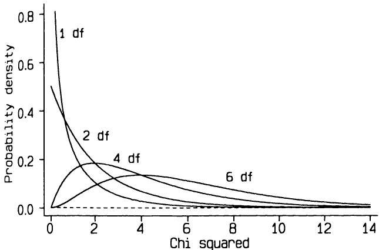
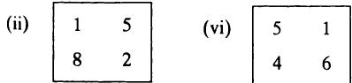
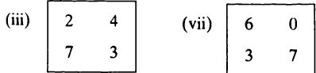
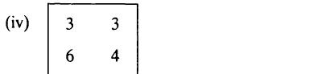

# 10 组间比较—分类数据
# 10 Comparing groups - categorical data

## 10.1 引言
## 10.1 INTRODUCTION

分类数据在医学研究中非常常见，当个体被归类到两个或多个互斥组中的一个时就会产生。在个体样本中，落入特定组的个体数量称为频率，因此分类数据的分析就是频率的分析。当比较两个或多个组时，数据通常以频率表的形式显示。表10.1展示了一个频率表的例子—这些数据将在本章后面用于说明一种分析形式。频率表也可以被视为两个分类变量的交叉制表，其中任何一个或两个变量都可以是序数变量。
Categorical data are very common in medical research, arising when individuals are categorized into one of two or more mutually exclusive groups. In a sample of individuals the number falling into a particular group is called the frequency, so the analysis of categorical data is the analysis of frequencies. When two or more groups are compared the data are often shown in the form of a frequency table. Table 10.1 shows an example of a frequency table - these data will be used to illustrate one form of analysis later in the chapter. A frequency table can also be considered as a cross- tabulation of two categorical variables, either or both of which can be ordinal.

当其中一个变量只有两个类别时，例如患者是否有特定症状，数据可以总结为某一类别中个体总数的比例。表10.1中的数据可以表示为六个鞋码组中每组女性进行剖宫产的比例。对于这类数据，我将描述以比例或频率表形式表示的分类数据分析。由于这些分析涉及表达相同信息的不同方式，因此这两种方法会得出相同的答案。之所以描述这两种方法，是因为它们在
When there are only two categories for one of the variables, for example whether a patient has a particular symptom or not, the data can be summarized as the proportion of the total number of individuals in one of the categories. The data in Table 10.1 can be expressed as the proportion of women having a Caesarean section in each of the six shoe size groups. For this type of data I shall describe the analysis of categorical data expressed either as proportions or as frequency tables. As the analyses relate to alternative ways of expressing the same information, the two methods yield the same answers. Both are described because they are in

表10.1 剖宫产频率与产妇鞋码的关系  
Table 10.1 Relation between frequency of Caesarean section and maternal shoe size  

<table><tr><td rowspan="2">剖宫产</td><td colspan="7">鞋码</td></tr><tr><td>&amp;lt; 4</td><td>4</td><td>4/2</td><td>5</td><td>5/2</td><td>6+</td><td>总计</td></tr><tr><td>是</td><td>5</td><td>7</td><td>6</td><td>7</td><td>8</td><td>10</td><td>43</td></tr><tr><td>否</td><td>17</td><td>28</td><td>36</td><td>41</td><td>46</td><td>140</td><td>308</td></tr><tr><td>总计</td><td>22</td><td>35</td><td>42</td><td>48</td><td>54</td><td>150</td><td>351</td></tr></table>
<table><tr><td rowspan="2">Caesarean section</td><td colspan="7">Shoe size</td></tr><tr><td>&amp;lt; 4</td><td>4</td><td>4/2</td><td>5</td><td>5/2</td><td>6+</td><td>Total</td></tr><tr><td>Yes</td><td>5</td><td>7</td><td>6</td><td>7</td><td>8</td><td>10</td><td>43</td></tr><tr><td>No</td><td>17</td><td>28</td><td>36</td><td>41</td><td>46</td><td>140</td><td>308</td></tr><tr><td>Total</td><td>22</td><td>35</td><td>42</td><td>48</td><td>54</td><td>150</td><td>351</td></tr></table>

普遍使用。频率表方法更为常见，但比例比较更可取，因为它容易得出估计值和置信区间。对于两个变量都至少有三个类别的大型表格，没有简单的替代方法，我们使用适合分析频率表的方法。
common use. The frequency table approach is more common, but the comparison of proportions is preferable because it readily yields estimates and confidence intervals. For larger tables where both variables have at least three categories there is no simple alternative, and we use methods suitable for analysing frequency tables.

在本章中，除非另有明确说明，否则假定每个个体只有一次观察—也就是说，我们有独立的观察结果。
Throughout the chapter, except where explicitly stated otherwise, it is assumed that there is only one observation per individual - that is, we have independent observations.

## 10.2 一个比例
## 10.2 ONE PROPORTION

最简单的情况是，我们有一组个体，并观察到其中一定比例的个体具有某种特定特征。我们能对总体中具有该特征的比例说些什么？
The simplest case to consider is when we have a single group of individuals, and have observed that a certain proportion have a particular characteristic. What can we say about the proportion with that characteristic in the population？

### 10.2.1 置信区间
### 10.2.1 Confidence interval

假设一位全科医生从其全科诊所的患者登记册中随机抽取了215名女性，发现其中39名有哮喘病史。我将用 $r$ 表示样本量为 $n$ 时具有该特征的病例数，用 $p$ 表示病例的比例，因此在本例中 $p = r / n = 0.18$。正如第8章所述，比例的相关抽样分布是二项分布。然而，我们通常可以使用二项分布的正态近似来获得观测比例的标准误，从而可以获得总体比例的置信区间。当 $np$ 和 $n(1 - p)$ 都超过5时，即 $r$ 和 $n - r$ 都应超过5时，使用正态近似是合理的。这通常是符合的。
Suppose a general practitioner chooses a random sample of 215 women from the patient register for her general practice, and finds that 39 of them have a history of suffering from asthma. I shall use  $r$  to denote the number of cases with the characteristic out of a sample size of  $n$ , and  $p$  as the proportion of cases, so  $p = r / n = 0.18$  in this example. As described in Chapter 8, the relevant sampling distribution for a proportion is the Binomial distribution. However, we can usually use the Normal approximation to the Binomial distribution to obtain the standard error of the observed proportion, and so can obtain a confidence interval for the proportion in the population. It is reasonable to use the Normal approximation when both  $np$  and  $n(1 - p)$  exceed 5; in other words, both  $r$  and  $n - r$  should exceed 5. This will usually be the case.

正如我们在8.4.3节中看到的，比例 $p$ 的标准误是 $se(p) = \sqrt{p(1 - p) / n}$。因此，观测到的哮喘女性比例的标准误是 $\sqrt{0.18 \times 0.82 / 215} = 0.0262$。所以，总体中哮喘女性比例的95%置信区间为
As we saw in section 8.4.3, the standard error of a proportion  $p$  is  $se(p) = \sqrt{p(1 - p) / n}$ . So the standard error of the observed proportion of women with asthma is  $\sqrt{0.18 \times 0.82 / 215} = 0.0262$ . The 95% confidence interval for the proportion of women with asthma in the population is thus from

$$
0.18 - 1.96 \times 0.0262 \qquad \text{to} \qquad 0.18 + 1.96 \times 0.0262
0.18 - 1.96 \times 0.0262 \qquad \text{to} \qquad 0.18 + 1.96 \times 0.0262
$$

即从0.13到0.23。如果我们能假设该全科诊所的女性代表了全国所有女性，那么根据这个样本，我们可以相当确定全国女性哮喘的患病率在13%到23%之间。
that is from 0.13 to 0.23. If we can assume that the women in this general practice are representative of all women in the country then we can be reasonably sure on the basis of this sample that the national prevalence of asthma in women is between 13 and 23%.

### 10.2.2 假设检验
### 10.2.2 Hypothesis test

我们可以检验总体比例为某个
We can test the null hypothesis that the population proportion is some

预设值的零假设。为此，我们使用8.5节中给出的通用检验统计量，即
pre- specified value. To do this we use the general test statistic given in section 8.5, namely

在零假设下，该统计量将近似服从正态分布（样本量要求与上一节相同）。因此我们计算
which will have an approximately Normal distribution under the null hypothesis (with the same sample size requirement as in the previous section). We thus calculate

$$
z = \frac{p - p_{\mathrm{exp}}}{s e(p)}
z = \frac{p - p_{\mathrm{exp}}}{s e(p)}
$$

其中  $p_{\mathrm{exp}}$  是预先指定或“预期”的比例。请注意，因为我们正在检验零假设，所以我们使用在零假设为真时预期的比例的标准误。换句话说，我们有
where  $p_{\mathrm{exp}}$  is the pre- specified or 'expected' proportion. Note that because we are testing the null hypothesis, we use the standard error of the proportion expected if the null hypothesis is true. In other words, we have

$$
s e(p) = \sqrt{\frac{p_{\mathrm{exp}}(1 - p_{\mathrm{exp}})}{n}}
s e(p) = \sqrt{\frac{p_{\mathrm{exp}}(1 - p_{\mathrm{exp}})}{n}}
$$

这与用于获得置信区间的标准误会略有不同。如果我们希望检验预先指定的假设，即女性哮喘的全国患病率为  $15\%$ ，我们计算
which will be slightly different from the standard error used to obtain a confidence interval. If we wish to test the pre- specified hypothesis that the national prevalence of asthma in women is  $15\%$ , we calculate

$$
s e(p) = \sqrt{\frac{0.15 \times 0.85}{215}}
s e(p) = \sqrt{\frac{0.15 \times 0.85}{215}}
$$

因此
and so

$$
\begin{array}{c}{{z=\frac{0.18-0.15}{0.0244}}}\\ {{{}}}\\ {{=1.23}}\end{array}
\begin{array}{c}{{z=\frac{0.18-0.15}{0.0244}}}\\ {{{}}}\\ {{=1.23}}\end{array}
$$

根据表B2，这对应于  $\mathbf{P} = 0.22$ 。我们不能拒绝女性哮喘患病率为  $15\%$  的零假设，并使用上面给出的置信区间来给出可能包含真实患病率的范围。
which, from Table B2, corresponds to  $\mathbf{P} = 0.22$ . We cannot reject the null hypothesis that the prevalence of asthma in women is  $15\%$ , and use the confidence interval given above to give a range likely to include the true prevalence.

### 10.2.3 连续性校正
### 10.2.3 Continuity correction

刚才描述的方法使用连续正态分布作为离散二项分布的近似。图10.1显示了刚才检验的例子中这两种分布，其中  $n = 215$  和  $p = 0.15$ 。假设检验基于计算正态分布中超出观测值（此处为39）的尾部面积。当我们对观测频率进行  $\frac{1}{2}$  的小校正时，正态分布与二项分布的对应性更好，以考虑到变量只能取整数值的事实。
The method just described uses the continuous Normal distribution as an approximation to the discrete Binomial distribution. Figure 10.1 shows these two distributions for the example just examined, with  $n = 215$  and  $p = 0.15$ . The hypothesis test is based on calculating the tail area of the Normal distribution beyond the observed value, here 39. The Normal distribution corresponds better to the Binomial distribution when we make a small correction of  $\frac{1}{2}$  to the observed frequency to allow for the fact that the variable can only take integer values.

  
图10.1 二项分布（ $p = 0.15$  和  $n = 215$ ）及其近似正态分布。
Figure 10.1 Binomial distribution with  $p = 0.15$  and  $n = 215$  with the approximating Normal distribution.

经过连续性校正的检验统计量为
The test statistic with the continuity correction is

$$
z_{c} = \frac{|p - p_{\mathrm{exp}}| - \frac{1}{2n}}{se(p)}
z_{c} = \frac{|p - p_{\mathrm{exp}}| - \frac{1}{2n}}{se(p)}
$$

其中符号 $|\ldots |$ 表示忽略比例之间差异的符号，$se(p)$ 保持不变。因此，连续性校正包括减小观察比例与预期比例之间的差异。显然，校正的效果随着样本量的增加而减小。
where the symbols  $|\ldots |$  indicate that the sign of the difference between the proportions is ignored and  $se(p)$  is unchanged. The continuity correction thus consists of reducing the difference between the observed and expected proportions. Clearly the effect of the correction diminishes as the sample size increases.

对于哮喘数据，经过连续性校正的检验统计量为
For the asthma data, the test statistic with the continuity correction is

$$
z_{c} = \frac{|0.18 - 0.15| - \frac{1}{2 \times 215}}{0.0244} = 1.14
z_{c} = \frac{|0.18 - 0.15| - \frac{1}{2 \times 215}}{0.0244} = 1.14
$$

这仅比之前略低，因为样本量相当大。
which is only slightly lower than before because the sample size is quite large.

## 10.3 两个独立组中的比例
## 10.3 PROPORTIONS IN TWO INDEPENDENT GROUPS

医学研究中最常见的问题可能涉及比较两个独立组中观察到的比例。此类
Probably the most common question in medical research involves the comparison of observed proportions in two independent groups. Such

问题可能出现在所有类型的研究中，无论是观察性研究还是实验性研究。
questions can arise in all types of study, whether observational or experimental.

举例来说，我将考虑一项随机临床试验的数据，该试验比较了红外线刺激（IRS）与安慰剂对颈椎骨关节炎引起的疼痛的影响（Lewith 和 Machin，1981）。安慰剂治疗是模拟经皮电刺激，患者对所接受的治疗是盲法的。共有26名患者入组，但其中一名在试验结束前退出。IRS组的12名患者中有9名报告疼痛改善，而接受安慰剂治疗的13名患者中有4名报告疼痛改善。因此，观察到的改善比例分别为0.75和0.31，差异为0.44。为了计算总体中差异的置信区间或进行假设检验，我们需要考虑两个比例之间差异的抽样分布。
As an example I will consider data from a randomized clinical trial comparing infra- red stimulation (IRS) with a placebo on the pain caused by cervical osteoarthrosis (Lewith and Machin, 1981). The placebo treatment was mock transcutaneous electrical stimulation and the patients were blind to the treatment given. Twenty- six patients were entered into the trial, but one dropped out before the end. Nine of the 12 patients in the IRS group reported an improvement in pain compared with four of the 13 receiving the placebo treatment. The observed proportions improving were thus 0.75 and 0.31, with a difference of 0.44. In order to calculate a confidence interval for the difference in the population or perform a hypothesis test, we need to consider the sampling distribution of the difference between two proportions.

### 10.3.1 置信区间
### 10.3.1 Confidence interval

如第8.4.4节所示，观察到的比例差 $p_{1} - p_{2}$ 的标准误由以下公式给出：
As shown in section 8.4.4, the standard error of the difference between the observed proportions,  $p_{1} - p_{2}$ , is given by

$$
\begin{array}{r}{s e(p_{1} - p_{2}) = \sqrt{v a r(p_{1}) + v a r(p_{2})}}\\ {= \sqrt{\frac{p_{1}(1 - p_{1})}{n_{1}} + \frac{p_{2}(1 - p_{2})}{n_{2}}}.} \end{array}
\begin{array}{r}{s e(p_{1} - p_{2}) = \sqrt{v a r(p_{1}) + v a r(p_{2})}}\\ {= \sqrt{\frac{p_{1}(1 - p_{1})}{n_{1}} + \frac{p_{2}(1 - p_{2})}{n_{2}}}.} \end{array}
$$

只要样本量和比例不是非常小，$p_{1} - p_{2}$ 的抽样分布将近似服从正态分布。因此，我们可以非常简单地计算95%置信区间，如下所示：
The sampling distribution of  $p_{1} - p_{2}$  will be approximately Normal as long as the sample size and proportions are not very small. We can thus calculate the 95% confidence interval very simply as

$$
p_{1} - p_{2} - 1.96 \times s e(p_{1} - p_{2}) \qquad \text{to} \qquad p_{1} - p_{2} + 1.96 \times s e(p_{1} - p_{2}).
p_{1} - p_{2} - 1.96 \times s e(p_{1} - p_{2}) \qquad \text{to} \qquad p_{1} - p_{2} + 1.96 \times s e(p_{1} - p_{2}).
$$

在本例中，观察到的比例差为：
In the example, the difference in observed proportions is

$$
p_{1} - p_{2} = 0.7500 - 0.3077 = 0.4423
p_{1} - p_{2} = 0.7500 - 0.3077 = 0.4423
$$

标准误为：
and the standard error is

$$
s e(p_{1} - p_{2}) = \sqrt{\frac{0.75 \times 0.25}{12} + \frac{0.3077 \times 0.6923}{13}} = 0.1789.
s e(p_{1} - p_{2}) = \sqrt{\frac{0.75 \times 0.25}{12} + \frac{0.3077 \times 0.6923}{13}} = 0.1789.
$$

因此，疼痛缓解比例差异的95%置信区间为：
The 95% confidence interval for the difference in proportions with pain relief is thus

$$
0.4423 - 1.96 \times 0.1789 \qquad \text{to} \qquad 0.4423 + 1.96 \times 0.1789
0.4423 - 1.96 \times 0.1789 \qquad \text{to} \qquad 0.4423 + 1.96 \times 0.1789
$$

即 0.09 至 0.79。
or 0.09 to 0.79.

### 10.3.2 假设检验
### 10.3.2 Hypothesis test

在进行比较两个比例的假设检验时，也采用类似的方法。同样会计算比例差的标准误，但由于我们是在假设零假设为真的前提下评估数据的概率，因此我们计算的标准误略有不同。如果零假设为真，则两个样本来自具有相同目标特征真实比例（例如 $p$）的总体。我们不知道 $p$，但 $p_{1}$ 和 $p_{2}$ 都是 $p$ 的估计值。我们对 $p$ 的最佳估计是通过计算合并两个样本中所有数据后具有该特征的比例，即
A similar approach is adopted when performing a hypothesis test to compare two proportions. The standard error of the difference in proportions is again calculated, but because we are evaluating the probability of the data on the assumption that the null hypothesis is true we calculate a slightly different standard error. If the null hypothesis is true, the two samples come from populations having the same true proportion of individuals with the characteristic of interest, say  $p$  . We do not know  $p$  but both  $p_{1}$  and  $p_{2}$  are estimates of  $p$  . Our best estimate of  $p$  is given by calculating the proportion with the characteristic using all the data in the two samples combined, which is

$$
\hat{p} = \frac{r_{1} + r_{2}}{n_{1} + n_{2}}.
\hat{p} = \frac{r_{1} + r_{2}}{n_{1} + n_{2}}.
$$

因此，在零假设下，$p_{1} - p_{2}$ 的标准误是基于每个组的比例均为 $\hat{p}$ 的假设计算的，所以我们有
The standard error of  $p_{1} - p_{2}$  under the null hypothesis is thus calculated on the assumption that the proportion in each group is  $\hat{p}$  , so that we have

$$
\begin{array}{r}{s e(p_{1} - p_{2}) = \sqrt{\frac{\hat{p}(1 - \hat{p})}{n_{1}} + \frac{\hat{p}(1 - \hat{p})}{n_{2}}}}\\ {= \sqrt{\hat{p}(1 - \hat{p})\biggl(\frac{1}{n_{1}} + \frac{1}{n_{2}}\biggr)}.} \end{array}
\begin{array}{r}{s e(p_{1} - p_{2}) = \sqrt{\frac{\hat{p}(1 - \hat{p})}{n_{1}} + \frac{\hat{p}(1 - \hat{p})}{n_{2}}}}\\ {= \sqrt{\hat{p}(1 - \hat{p})\biggl(\frac{1}{n_{1}} + \frac{1}{n_{2}}\biggr)}.} \end{array}
$$

如上所述，这个标准误与前一节中计算的并不完全相同。
As noted above, this standard error is not quite the same as that calculated in the previous section.

$p_{1} - p_{2}$ 的抽样分布是正态的，因此我们计算标准正态离差 $z$，如下所示：
The sampling distribution of  $p_{1} - p_{2}$  is Normal, so we calculate a standard Normal deviate,  $z$  , as

$$
z = \frac{p_{1} - p_{2}}{s e(p_{1} - p_{2})}.
z = \frac{p_{1} - p_{2}}{s e(p_{1} - p_{2})}.
$$

在本例中，观察到的比例差为 $p_{1} - p_{2} = 0.4423$，与之前相同。这两个比例分别为 9/12 和 4/13，因此，在零假设下，总体比例的合并估计值为
In  the  example,  the  difference  in  observed  proportions  is  $p_{1} - p_{2} = 0.4423$  as before. The two proportions were 9/12 and 4/13, so the pooled estimate of the population proportion under the null hypothesis is

$$
\hat{p} = \frac{9 + 4}{12 + 13} = 0.52,
\hat{p} = \frac{9 + 4}{12 + 13} = 0.52,
$$

比例差的标准误为
and the standard error of the difference in proportions is

$$
\sqrt{0.52\times0.48\times(\frac{1}{12} + \frac{1}{13})} = 0.2000.
\sqrt{0.52\times0.48\times(\frac{1}{12} + \frac{1}{13})} = 0.2000.
$$

因此，检验统计量为 $z = 0.4423 / 0.2000 = 2.21$，从表 B2 可知 $\mathbf{P} = 0.027$。因此，有证据表明治疗之间存在差异。然而，如前所述，由于样本量小，该差异的置信区间很宽。
The test statistic is thus  $z = 0.4423 / 0.2000 = 2.21$  , which from Table B2 gives  $\mathbf{P} = 0.027$  . Thus there is evidence of a difference between the treatments. As shown earlier, however, the confidence interval for the difference is wide because the samples are small.

### 10.3.3 连续性校正
### 10.3.3 Continuity correction

与单样本情况一样，在比较两个比例时，建议使用连续性校正，尤其是在样本量较小的情况下。这样做的效果是略微减小两个比例之间的观察差异。$z$ 的修正公式为
As with the single sample case, it is advisable to use a continuity correction when comparing two proportions, especially when the samples are small. The effect is to reduce slightly the observed difference between the two proportions. The modified formula for  $z$  is

$$
z_{c} = \frac{\left|p_{1} - p_{2}\right| - \frac{1}{2}\left(\frac{1}{n_{1}} + \frac{1}{n_{2}}\right)}{se(p_{1} - p_{2})}
z_{c} = \frac{\left|p_{1} - p_{2}\right| - \frac{1}{2}\left(\frac{1}{n_{1}} + \frac{1}{n_{2}}\right)}{se(p_{1} - p_{2})}
$$

其中 $se(p_{1} - p_{2})$ 保持不变。可以看出，分子（上方）中的额外项是基于分母（下方）中已计算出的量。在我们的例子中，经过连续性校正的检验统计量为
where  $se(p_{1} - p_{2})$  is unchanged. It can be seen that the extra term in the numerator (on the top) is based on a quantity already calculated in the denominator (on the bottom). In our example the continuity corrected test statistic is

$$
\begin{array}{r l} & {z_{c} = \frac{0.4423 - \frac{1}{2}(\frac{1}{12} + \frac{1}{13})}{\sqrt{0.52\times0.48\times(\frac{1}{12} + \frac{1}{13})}}}\\ & {\quad = 0.3622 / 0.2000}\\ & {\quad = 1.811} \end{array}
\begin{array}{r l} & {z_{c} = \frac{0.4423 - \frac{1}{2}(\frac{1}{12} + \frac{1}{13})}{\sqrt{0.52\times0.48\times(\frac{1}{12} + \frac{1}{13})}}}\\ & {\quad = 0.3622 / 0.2000}\\ & {\quad = 1.811} \end{array}
$$

这对应于 $\mathbf{P} = 0.07$。
which corresponds to  $\mathbf{P} = 0.07$

由于样本量较小，连续性校正对检验统计量产生了相当大的影响。从公式中的额外项可以清楚地看出，随着样本量的增加，校正的影响会减小。
The continuity correction has made quite a large impact on the test statistic because the samples were small. It is clear from the extra term in the formula that the impact of the correction diminishes as the sample sizes increase.

建议对单样本和双样本检验都常规使用连续性校正。不使用校正时，结果往往会略显乐观，导致 $\mathbf{P}$ 值过小。在本例中，使用校正会得到一个更大的 $\mathbf{P}$ 值，该值现在高于 $5\%$ 的水平。我们仍然可以报告有证据表明两种治疗的有效性存在差异，但这种证据不如未经校正的分析所显示的那样强烈。
It is advisable to use the continuity correction routinely for both one and two sample tests. Without it results tend to be slightly optimistic, so that the  $\mathbf{P}$  values are too small. In the example, the use of the correction gives a rather larger  $\mathbf{P}$  value which is now above the  $5\%$  level. We can still report that there is evidence to suggest a difference in effectiveness of the two treatments, but it is not as strong as was suggested by the uncorrected analysis.

由于用于计算置信区间的标准误与用于假设检验的标准误不同，因此偶尔会发生（如本例），当假设检验给出非显著性结果时，置信区间却排除了零假设下指定的值。这种解释上的差异并不重要。请注意，构建置信区间时不需要连续性校正，因为我们不是基于分布的尾部面积计算概率。
Because the standard error used for calculating the confidence interval differs from that used in the hypothesis test it can occasionally happen, as here, that the confidence interval excludes the value specified under the null hypothesis when the hypothesis test gives a non- significant result. The difference in interpretation will not be important. Note that no continuity correction is necessary for constructing a confidence interval as we are not calculating probabilities based on the tail area of a distribution.

## 10.4 两个配对比例
## 10.4 TWO PAIRED PROPORTIONS

在某些情况下，我们可能会在同一批个体上观察到两个比例。我们可能希望比较两种
There are several circumstances in which we may observe two proportions on the same individuals. We may wish to compare the pain relief by two

不同镇痛药在同一受试者中的镇痛效果，或者比较治疗前后具有特定症状的受试者比例。当我们需要比较两个配对组中的一个特征时，也会出现统计学上相同的问题。
different analgesics in the same subjects or to compare the proportion of subjects with a particular symptom before and after treatment. A statistically identical problem arises when we wish to compare one characteristic in two pair- matched groups.

例如，Karacan 等人（1976）比较了 32 名大麻使用者和 32 名配对对照组的睡眠困难情况。7 名大麻使用者（$22\%$）报告有时或总是出现睡眠困难，而对照组中有 13 名（$41\%$）报告有睡眠困难。由于这些组是单独配对的，我们不应将观察结果视为独立的，因此需要采用与上一节所述方法不同的方法。我们将看到，如果只知道这两个比例，我们就无法进行适当的分析。
As an example, Karacan et al. (1976) compared a group of 32 marijuana users with 32 matched controls with respect to their sleeping difficulties. Seven of the marijuana users  $(22\%)$  reported sleep difficulties sometimes or always compared with 13  $(41\%)$  of the controls. Because the groups were individually matched we should not treat the observations as independent and thus need different methods from those described in the previous section. We will see that we cannot perform the appropriate analyses if we know only the two proportions.

### 10.4.1 置信区间
### 10.4.1 Confidence interval

我们希望计算两个比例 $p_{1}$ 和 $p_{2}$ 之间差异的置信区间，其中两组观察结果不是独立的。因此，差异的标准误并非简单地基于每个比例的方差，而是必须以某种方式考虑配对结果。
We want to calculate a confidence interval for the difference between two proportions  $p_{1}$  and  $p_{2}$  where the two groups of observations are not independent. The standard error of the difference is not, therefore, based simply on the variances of each proportion but must take account of the paired results in some way.

我们可以将配对观测结果分为四组，根据每对成员中是否存在该特征进行划分，如表10.2所示。我们希望比较的两个比例是 $p_{1} = (a + b) / n$ 和 $p_{2} = (a + c) / n$。这些比例不是独立的，因为它们都包含 $a$，即“是-是”配对的数量。然而，比例的差异由以下公式给出：
We can divide the paired observations into four groups, according to whether the characteristic is present or not in each member of the pair, as shown in Table 10.2. The two proportions we wish to compare are  $p_{1} = (a + b) / n$  and  $p_{2} = (a + c) / n$ . These proportions are not independent as they both contain  $a$ , the number of Yes- Yes pairs. The difference in proportions is, however, given by

$$
\begin{array}{c}{{p_{1}-p_{2}=\frac{a+b}{n}-\frac{a+c}{n}}}\\ {{=\frac{b-c}{n}}}\end{array}
\begin{array}{c}{{p_{1}-p_{2}=\frac{a+b}{n}-\frac{a+c}{n}}}\\ {{=\frac{b-c}{n}}}\end{array}
$$

因此，数字 $a$ 消失了，这相当令人惊讶。尽管如此，
so that the number  $a$  disappears, which is rather surprising. Nevertheless.

表10.2 配对特征每种组合的频率  
Table 10.2 Frequency of each combination of paired characteristics  

<table><tr><td colspan="2">观测结果</td><td rowspan="2">配对数量</td></tr><tr><td>1</td><td>2</td></tr><tr><td>是</td><td>是</td><td>a</td></tr><tr><td>是</td><td>否</td><td>b</td></tr><tr><td>否</td><td>是</td><td>c</td></tr><tr><td>否</td><td>否</td><td>d</td></tr><tr><td>总计</td><td></td><td>n</td></tr></table>
<table><tr><td colspan="2">Observation</td><td rowspan="2">Number of pairs</td></tr><tr><td>1</td><td>2</td></tr><tr><td>Yes</td><td>Yes</td><td>a</td></tr><tr><td>Yes</td><td>No</td><td>b</td></tr><tr><td>No</td><td>Yes</td><td>c</td></tr><tr><td>No</td><td>No</td><td>d</td></tr><tr><td>Total</td><td></td><td>n</td></tr></table>

我们仍在比较非独立的比例。比例差异的标准误由以下公式给出：
we are still comparing non- independent proportions. The standard error of the difference in proportions is given by

$$
se(p_{1} - p_{2}) = \frac{1}{n} \sqrt{b + c - \frac{(b - c)^{2}}{n}}.
se(p_{1} - p_{2}) = \frac{1}{n} \sqrt{b + c - \frac{(b - c)^{2}}{n}}.
$$

（此公式的推导此处不予给出。）因此，$p_{1} - p_{2}$ 的 $95\%$ 置信区间如下：
(The derivation of this formula will not be given here.) The  $95\%$  confidence interval for  $p_{1} - p_{2}$  is thus obtained as

$$
p_{1} - p_{2} - 1.96 \times se(p_{1} - p_{2}) \qquad \text{to} \qquad p_{1} - p_{2} + 1.96 \times se(p_{1} - p_{2}).
p_{1} - p_{2} - 1.96 \times se(p_{1} - p_{2}) \qquad \text{to} \qquad p_{1} - p_{2} + 1.96 \times se(p_{1} - p_{2}).
$$

在我们的例子中，我们需要知道 $a, b, c$ 和 $d$ 的值，这些值显示在表10.3中。我们有 $p_{m} = (a + b) / n = 7 / 32$ 和 $p_{c} = (a + c) / n = 13 / 32$，因此观察到的比例差异是
In our example, we need to know the values  $a, b, c$  and  $d$  which are shown in Table 10.3. We have  $p_{m} = (a + b) / n = 7 / 32$  and  $p_{c} = (a + c) / n = 13 / 32$ , so the observed difference in proportions is

$$
\begin{array}{c}p_{c} - p_{m} = \frac{13 - 7}{32} \\ = 0.1875 \end{array}
\begin{array}{c}p_{c} - p_{m} = \frac{13 - 7}{32} \\ = 0.1875 \end{array}
$$

其标准误为
and its standard error is

$$
se(p_{c} - p_{m}) = \frac{1}{32} \sqrt{3 + 9 - \frac{6^{2}}{32}} \\ = 0.1031.
se(p_{c} - p_{m}) = \frac{1}{32} \sqrt{3 + 9 - \frac{6^{2}}{32}} \\ = 0.1031.
$$

表10.3 大麻使用者和匹配对照组报告睡眠困难的人数（Karacan 等，1976）  
Table 10.3 Numbers of marijuana users and matched controls reporting sleeping difficulties (Karacan et al., 1976)  

<table><tr><td colspan="3">睡眠困难</td></tr><tr><td>大麻组</td><td>对照组</td><td>配对数</td></tr><tr><td>是</td><td>是</td><td>a = 4</td></tr><tr><td>是</td><td>否</td><td>b = 3</td></tr><tr><td>否</td><td>是</td><td>c = 9</td></tr><tr><td>否</td><td>否</td><td>d = 16</td></tr><tr><td>总计</td><td></td><td>n = 32</td></tr></table>
<table><tr><td colspan="3">Sleep difficulties</td></tr><tr><td>Marijuana group</td><td>Control group</td><td>Number of pairs</td></tr><tr><td>Yes</td><td>Yes</td><td>a = 4</td></tr><tr><td>Yes</td><td>No</td><td>b = 3</td></tr><tr><td>No</td><td>Yes</td><td>c = 9</td></tr><tr><td>No</td><td>No</td><td>d = 16</td></tr><tr><td>Total</td><td></td><td>n = 32</td></tr></table>

因此，经历睡眠困难的比例差异的 $95\%$ 置信区间为
So the  $95\%$  confidence interval for the difference in the proportions experiencing sleep difficulties is

$$
0.1875 - 1.96 \times 0.1031 \qquad \text{to} \qquad 0.1875 + 1.96 \times 0.1031
0.1875 - 1.96 \times 0.1031 \qquad \text{to} \qquad 0.1875 + 1.96 \times 0.1031
$$

或 - 0.01 至 0.39。因此，有微弱证据表明大麻使用者比对照组经历更少的睡眠困难，但差异的置信区间非常宽。
or - 0.01 to 0.39. There is thus some weak evidence that marijuana users experience fewer sleeping difficulties than controls, but the confidence interval for the difference is very wide.

### 10.4.2 假设检验
### 10.4.2 Hypothesis test

我们还可以对配对比例之间没有差异的原假设进行显著性检验。与两个独立样本一样，我们需要在原假设为真的假设下评估差异的标准误，这意味着我们将 $b$ 和 $c$ 都替换为 $(b + c) / 2$。因此，上一节中给出的标准误公式简化为
We can also perform a significance test of the null hypothesis that there is no difference between the paired proportions. As with two independent samples, we need to evaluate the standard error of the difference on the assumption that the null hypothesis is true, which means that we replace both  $b$  and  $c$  by  $(b + c) / 2$  . The formula for the standard error given in the previous section thus simplifies to

$$
\begin{array}{c}{{s e(p_{1}-p_{2})=\frac{1}{n}\sqrt{\frac{b+c}{2}+\frac{b+c}{2}+0}}}\\ {{=\frac{1}{n}\sqrt{b+c}}}\end{array}
\begin{array}{c}{{s e(p_{1}-p_{2})=\frac{1}{n}\sqrt{\frac{b+c}{2}+\frac{b+c}{2}+0}}}\\ {{=\frac{1}{n}\sqrt{b+c}}}\end{array}
$$

我们计算检验统计量为
and we calculate our test statistic as

$$
\begin{array}{c}{{z=\frac{p_{1}-p_{2}}{s e(p_{1}-p_{2})}}}\\ {{=\frac{(b-c)/n}{\sqrt{b+c}/n}}}\\ {{=\frac{b-c}{\sqrt{b+c}}}}\end{array}
\begin{array}{c}{{z=\frac{p_{1}-p_{2}}{s e(p_{1}-p_{2})}}}\\ {{=\frac{(b-c)/n}{\sqrt{b+c}/n}}}\\ {{=\frac{b-c}{\sqrt{b+c}}}}\end{array}
$$

这是统计学中最简单的公式之一。该公式的另一种推导方法见第10.4.4节。
which is one of the simplest formulae in statistics. An alternative derivation of this formula is given in section 10.4.4.

在本例中，我们得到
In the example we get

$$
z = \frac{3 - 9}{\sqrt{3 + 9}} = -1.73
z = \frac{3 - 9}{\sqrt{3 + 9}} = -1.73
$$

得到 $\mathbf{P} = 0.08$。我们不能在 $5\%$ 的水平上拒绝零假设。注意，在公式中取 $b - c$ 或 $c - b$ 并不重要，因为 $z = +1.73$ 会给出相同的双侧 $\mathbf{P}$ 值。
giving  $\mathbf{P} = 0.08$  . We cannot reject the null hypothesis at the  $5\%$  level. Note that it does not matter whether we take  $b - c$  or  $c - b$  in the equation, as  $z = +1.73$  would give the same two- sided  $\mathbf{P}$  value.

### 10.4.3 连续性校正
### 10.4.3 Continuity correction

在比较配对比例时，我们应该使用连续性校正，尤其是在小样本中。与非配对情况一样，我们使用公式
We ought to use a continuity correction when comparing paired proportions, especially in small samples. As with the unpaired case we use the formula

$$
z_{c} = \frac{|p_{1} - p_{2}| - \frac{1}{2}\Big(\frac{1}{n_{1}} + \frac{1}{n_{2}}\Big)}{s e(p_{1} - p_{2})}
z_{c} = \frac{|p_{1} - p_{2}| - \frac{1}{2}\Big(\frac{1}{n_{1}} + \frac{1}{n_{2}}\Big)}{s e(p_{1} - p_{2})}
$$

但这里两个样本大小相同，所以我们得到
but here the two samples are the same size, so we get

$$
\begin{array}{c}{{z_{c}=\frac{\frac{1}{n}\left|b-c\right|-\frac{1}{2}\left(\frac{1}{n}+\frac{1}{n}\right)}{(\sqrt{b+c})/n}}}\\ {{=\frac{\left|b-c\right|-1}{\sqrt{b+c}}.}}\end{array}
\begin{array}{c}{{z_{c}=\frac{\frac{1}{n}\left|b-c\right|-\frac{1}{2}\left(\frac{1}{n}+\frac{1}{n}\right)}{(\sqrt{b+c})/n}}}\\ {{=\frac{\left|b-c\right|-1}{\sqrt{b+c}}.}}\end{array}
$$

换句话说，为了使用连续性校正，我们先从 $b$ 和 $c$ 的绝对差中减去 1，然后除以 $\sqrt{b + c}$。
In other words, to use the continuity correction we subtract 1 from the absolute difference between  $b$  and  $c$  before dividing by  $\sqrt{b + c}$ .

在我们的例子中，我们有
In our example we have

$$
\begin{array}{c}{{z_{c}=\frac{\left|3-9\right|-1}{\sqrt{3+9}}}}\\ {{=5/\sqrt{12}=1.44}}\end{array}
\begin{array}{c}{{z_{c}=\frac{\left|3-9\right|-1}{\sqrt{3+9}}}}\\ {{=5/\sqrt{12}=1.44}}\end{array}
$$

对应于 $\mathbf{P} = 0.15$。正如我们在上一节中看到的，连续性校正对小样本的影响相当显著。它的使用总是会增加 $\mathbf{P}$ 值。
corresponding to  $\mathbf{P} = 0.15$ . As we saw in the previous section, the effect of the continuity correction is quite marked in small samples. Its use will always increase the  $\mathbf{P}$  value.

### 10.4.4 基于二项分布的另一种推导
### 10.4.4 An alternative derivation based on the Binomial distribution

如上所示，比较配对比例的假设检验仅基于显示不一致的对数，$b$ 和 $c$。显示一致的对数，$a$ 和 $d$，不出现在公式中。
As shown above, the hypothesis test for comparing paired proportions is based only on the numbers of pairs showing disagreement,  $b$  and  $c$ . Those showing agreement,  $a$  and  $d$ , do not appear in the formula.

因此，考虑这个问题的另一种方法是看总的不一致对数，$b + c$。在零假设下，我们预期“是-否”和“否-是”对的数量相同，所以我们可以评估在 $b + c$ 对中观察到 $b$ 对属于其中一组（或者等效地，$c$ 对属于 $b + c$ 对）的概率。数字 $b$ 将遵循参数为 $p = 0.5$ 的二项分布。因为 $p$ 是 0.5，所以二项分布的正态近似即使对于相当小的样本也非常好。$b$ 的标准误是
Another way of considering the problem, therefore, is to look at the total number of disagreements,  $b + c$ . Under the null hypothesis we expect the numbers of 'Yes- No' and 'No- Yes' pairs to be the same so we can evaluate the probability of observing  $b$  out of  $b + c$  to be in one of these groups (or, equivalently,  $c$  out of  $b + c$ ). The number  $b$  will follow a Binomial distribution with  $p = 0.5$ . Because  $p$  is 0.5 the Normal approximation to the Binomial distribution is very good even for quite small samples. The standard error of  $b$  is

$$
se(b) = \sqrt{np(1 - p)} = \sqrt{(b + c) \times \frac{1}{2} \times \frac{1}{2}} = \frac{\sqrt{b + c}}{2}.
se(b) = \sqrt{np(1 - p)} = \sqrt{(b + c) \times \frac{1}{2} \times \frac{1}{2}} = \frac{\sqrt{b + c}}{2}.
$$

统计量 $z$ 的计算方法如下：
The statistic  $z$  is calculated as

$$
\begin{array}{c}{{z=\frac{b-\frac{(b+c)}{2}}{s e(b)}}}\\ {{=\frac{(b-c)/2}{\sqrt{b+c}/2}}}\\ {{=\frac{b-c}{\sqrt{b+c}}}}\end{array}
\begin{array}{c}{{z=\frac{b-\frac{(b+c)}{2}}{s e(b)}}}\\ {{=\frac{(b-c)/2}{\sqrt{b+c}/2}}}\\ {{=\frac{b-c}{\sqrt{b+c}}}}\end{array}
$$

与之前一样。这个检验与9.4.4节介绍的符号检验是相同的。这里，比较是用比例来表示的，而在之前的描述中，它是用实际频率来表示的，但两者是完全等价的。我们还会遇到其他可以简化为单个比例的简单二项检验。当数据以频率表的形式表示时，该检验通常被称为McNemar检验，在10.7.5节中将以此名称进行讨论。
as before. This test is identical to the sign test which was introduced in section 9.4.4. Here the comparison is expressed in terms of the proportions whereas in the earlier description it was in terms of the actual frequencies, but the two are exactly equivalent. We will meet other tests which reduce to a simple Binomial test of a single proportion. When the data are expressed as a frequency table the test is usually called the McNemar test, under which name it is discussed in section 10.7.5.

### 10.4.5 $a$ 和 $d$ 真的被忽略了吗？
### 10.4.5 Are a and d really ignored？

所有用于分析配对比例的公式似乎都只基于那些显示不一致的配对—表10.2和10.3中的“是-否” $(b)$ 或“否-是” $(c)$。虽然比较两种分类的假设检验结果确实只取决于 $b$ 和 $c$，但置信区间也取决于样本量。我们期望置信区间和假设检验方法能给出非常一致的结果（由于使用了不同的标准误，会存在一些小的差异），一个例子将表明这确实会发生。
All of the formulae for analysing paired proportions seem to be based on only those pairs showing disagreement - 'Yes- No'  $(b)$  or 'No- Yes'  $(c)$  in Tables 10.2 and 10.3. While it is true that the result of the hypothesis test comparing the two classifications depends only on  $b$  and  $c$ , the confidence interval depends on the sample size too. We expect the confidence interval and hypothesis testing approaches to give closely corresponding results (with some small discrepancies due to the use of different standard errors) and an example will show that this does indeed happen.

考虑表10.4中的两组数据，它们显示了治疗前后症状的存在或缺失。在表(i)和(ii)中，$b = 15$ 且 $c = 6$，因此对于这两组数据，检验零假设（即两个特征之间没有差异）的结果由下式给出：
Consider the two sets of data in Table 10.4 showing presence or absence of a symptom before and after treatment. In both tables (i) and (ii)  $b = 15$  and  $c = 6$ , so for both of them a test of the null hypothesis that there is no difference between the two features is given by

$$
\begin{array}{c} z = \frac{15 - 6}{\sqrt{15 + 6}} \\ = 1.96 (\mathrm{P} = 0.05). \end{array}
\begin{array}{c} z = \frac{15 - 6}{\sqrt{15 + 6}} \\ = 1.96 (\mathrm{P} = 0.05). \end{array}
$$

（在这个说明性例子中，我将忽略连续性校正。）我们期望两个比例差异的置信区间的一端非常接近零，因为 $\mathbf{P}$ 值几乎正好是0.05—这是否与 $a$ 和 $d$ 的大小无关呢？
(I shall ignore the continuity correction for this illustrative example.) We would expect the confidence interval for the difference between the two proportions to have one end very close to zero because the  $\mathbf{P}$  value is almost exactly 0.05 - does this happen regardless of the size of  $a$  and  $d$ ？

表10.4 显示相同“是-否”和“否-是”配对数量的两组配对数据  
Table 10.4 Two sets of paired data showing the same numbers of Yes-No and No-Yes pairs  

<table><tr><td colspan="3">(i)</td><td colspan="3">(ii)</td></tr><tr><td colspan="3">症状存在</td><td colspan="3">症状存在</td></tr><tr><td>时间</td><td>时间</td><td>时间</td><td>时间</td><td>时间</td><td></td></tr><tr><td>1</td><td>2</td><td>1</td><td>2</td><td></td><td></td></tr><tr><td>是</td><td>是</td><td>a = 10</td><td>是</td><td>是</td><td>a = 51</td></tr><tr><td>是</td><td>否</td><td>b = 15</td><td>是</td><td>否</td><td>b = 15</td></tr><tr><td>否</td><td>是</td><td>c = 6</td><td>否</td><td>是</td><td>c = 6</td></tr><tr><td>否</td><td>否</td><td>d = 5</td><td>否</td><td>否</td><td>d = 33</td></tr><tr><td>总计</td><td></td><td>n = 36</td><td>总计</td><td></td><td>n = 105</td></tr></table>
<table><tr><td colspan="3">(i)</td><td colspan="3">(ii)</td></tr><tr><td colspan="3">Presence of symptom</td><td colspan="3">Presence of symptom</td></tr><tr><td>Time</td><td>Time</td><td>Time</td><td>Time</td><td>Time</td><td></td></tr><tr><td>1</td><td>2</td><td>1</td><td>2</td><td></td><td></td></tr><tr><td>Yes</td><td>Yes</td><td>a = 10</td><td>Yes</td><td>Yes</td><td>a = 51</td></tr><tr><td>Yes</td><td>No</td><td>b = 15</td><td>Yes</td><td>No</td><td>b = 15</td></tr><tr><td>No</td><td>Yes</td><td>c = 6</td><td>No</td><td>Yes</td><td>c = 6</td></tr><tr><td>No</td><td>No</td><td>d = 5</td><td>No</td><td>No</td><td>d = 33</td></tr><tr><td>Total</td><td></td><td>n = 36</td><td>Total</td><td></td><td>n = 105</td></tr></table>

两组计算并行显示如下：
The two sets of calculations are shown below in parallel:

$$
\begin{array}{l l}{{p_{1}=(10+15)/36=0.694}}&{{\qquad p_{1}=(51+15)/105=0.629}}\\ {{p_{2}=(10+6)/36=0.444}}&{{\qquad p_{2}=(51+6)/105=0.543}}\\ {{p_{1}-p_{2}=0.250}}&{{\qquad p_{1}-p_{2}=0.086}}\\ {{s e(p_{1}-p_{2})}}&{{=\frac{1}{36}\sqrt{21-9^{2}/36}}}\\ {{}}&{{=0.1203}}\end{array} \tag{ii}
\begin{array}{l l}{{p_{1}=(10+15)/36=0.694}}&{{\qquad p_{1}=(51+15)/105=0.629}}\\ {{p_{2}=(10+6)/36=0.444}}&{{\qquad p_{2}=(51+6)/105=0.543}}\\ {{p_{1}-p_{2}=0.250}}&{{\qquad p_{1}-p_{2}=0.086}}\\ {{s e(p_{1}-p_{2})}}&{{=\frac{1}{36}\sqrt{21-9^{2}/36}}}\\ {{}}&{{=0.1203}}\end{array} \tag{ii}
$$

$95\%$ 置信区间为 $0.250 \pm 1.96 \times 0.1203$ $95\%$ 置信区间为 $0.086 \pm 1.96 \times 0.0428$
$95\%$  CI is  $0.250 \pm 1.96 \times 0.1203$ $95\%$  CI is  $0.086 \pm 1.96 \times 0.0428$

即 0.014 到 0.486。
i.e. 0.014 to 0.486.

即 0.002 到 0.170。
i.e. 0.002 to 0.170.

两个置信区间均符合预期，下限接近于零。对于较大的样本，比例差的 $95\%$ 置信区间明显更窄，这符合我们的预期。请注意，数据集 (i) 和 (ii) 之间的差异在于 $p_{1}$ 和 $p_{2}$ 的变化，从而导致 $p_{1} - p_{2}$ 的变化，而当仅检验假设 $b = c$ 时，这些差异均未体现。
Both confidence intervals behave as expected, with the lower limit close to zero. The  $95\%$  confidence interval for the difference in proportions is much narrower for the larger sample, as we would expect. Note that the difference between data sets (i) and (ii) is the change in  $p_{1}$  and  $p_{2}$  and thus  $p_{1} - p_{2}$ , none of which is seen when only testing the hypothesis that  $b = c$ .

## 10.5 比较多个比例
## 10.5 COMPARING SEVERAL PROPORTIONS

当比较与不同受试者组相关的多个比例时，必须考虑两种替代情况，取决于这些组是否有序。这些问题在第 10.8 节中讨论，因为在频数表的框架下更容易理解它们。
When comparing several proportions relating to different groups of subjects two alternative cases must be considered, according to whether the groups are ordered or not. These problems are discussed in section 10.8, as they are more easily considered in the framework of frequency tables.

对两个以上配对比例的比较超出了本书的范围。Fleiss (1981, p. 126) 对此分析进行了描述。
The comparison of more than two paired proportions is beyond the scope of this book. The analysis is described by Fleiss (1981, p. 126).

## 10.6 频数表的分析
## 10.6 THE ANALYSIS OF FREQUENCY TABLES

当只有两种可能的结果时，例如症状的存在或不存在，比例是表达计数或频率的一种方式。显示频率的一种更普遍的方式是在表格中，表格的每个单元格对应于与两个或更多分类相关的特定特征组合。这里我将只讨论“双向”表格，它们涉及两个分类变量。频率表有时被称为列联表。
Proportions are a way of expressing counts or frequencies when there are only two possible outcomes, such as the presence or absence of a symptom. A more general way of showing frequencies is in a table, where each cell of the table corresponds to a particular combination of characteristics relating to two or more classifications. Here I will deal only with 'two way' tables, which relate to two categorical variables. Frequency tables are sometimes called contingency tables.

所有频率表的分析都有一个单一的通用方法，但实际上分析方法根据以下因素而异：
There is a single, general approach to the analysis of all frequency tables, but in practice the method of analysis varies according to

1. 类别的数量
1. the number of categories

2. 类别是否有序
2. whether the categories are ordered or not

3. 受试者独立组的数量，以及
3. the number of independent groups of subjects, and

4. 所提问题的性质。
4. the nature of the question being asked.

我将首先考虑通用方法，然后是几种特殊情况。
I will first consider the general approach, and then several special cases.

### 10.6.1 通用情况 - $r \times c$ 表
### 10.6.1 The general case - the  $r \times c$  table

表10.5给出了一个双向频率表的例子，该表显示了3888名产前患者的咖啡因摄入量与婚姻状况。尽管我们用于分析此类数据的方法是基于观察到的频率，但通过将频率表示为行或列总数的百分比，更容易看出数据的情况，尤其是在行或列总数之间存在较大差异时。表10.6显示了表10.5的数据，表示为行百分比。在本节中，我将描述具有 $r$ 行和 $c$ 列的频率表的通用方法—即 $r \times c$ 表。尽管此方法可用于任何大小的表格，但如果 $r$ 或 $c$ 等于2，则该方法可以简化（对于 $2 \times 2$ 表格参见10.7节，对于 $2 \times k$ 表格参见10.8节）。
An example of a two way frequency table is given in Table 10.5, which shows caffeine consumption by marital status in a sample of 3888 antenatal patients. Although the methods we use to analyse data of this type are based on the observed frequencies, it is easier to see what is going on by expressing the frequencies as percentages of either the row or column totals, especially when there are large variations among the row or column totals. Table 10.6 shows the data from Table 10.5 expressed as row percentages. In this section I shall describe the general approach to frequency tables with  $r$  rows and  $c$  columns - the  $r \times c$  table. Although this method can be used for tables of any size, if either  $r$  or  $c$  is equal to 2, the method can be simplified (see section 10.7 for  $2 \times 2$  tables and section 10.8 for  $2 \times k$  tables).

表10.5 产前患者的咖啡因摄入量与婚姻状况（摘自Martin和Bracken，1987）  
Table 10.5 Caffeine consumption and marital status in antenatal patients (from Martin and Bracken, 1987)  

<table><tr><td rowspan="2">婚姻状况</td><td rowspan="2">0</td><td colspan="4">咖啡因摄入量 (mg/天)</td></tr><tr><td>1-150</td><td>151-300</td><td>&amp;gt; 300</td><td>总计</td></tr><tr><td>已婚</td><td>652</td><td>1537</td><td>598</td><td>242</td><td>3029</td></tr><tr><td>离异、分居或丧偶</td><td>36</td><td>46</td><td>38</td><td>21</td><td>141</td></tr><tr><td>单身</td><td>218</td><td>327</td><td>106</td><td>67</td><td>718</td></tr><tr><td>总计</td><td>906</td><td>1910</td><td>742</td><td>330</td><td>3888</td></tr></table>
<table><tr><td rowspan="2">Marital status</td><td rowspan="2">0</td><td colspan="4">Caffeine consumption (mg/day)</td></tr><tr><td>1-150</td><td>151-300</td><td>&amp;gt; 300</td><td>Total</td></tr><tr><td>Married</td><td>652</td><td>1537</td><td>598</td><td>242</td><td>3029</td></tr><tr><td>Divorced, separated or widowed</td><td>36</td><td>46</td><td>38</td><td>21</td><td>141</td></tr><tr><td>Single</td><td>218</td><td>327</td><td>106</td><td>67</td><td>718</td></tr><tr><td>Total</td><td>906</td><td>1910</td><td>742</td><td>330</td><td>3888</td></tr></table>

表 10.6 咖啡因摄入量与婚姻状况数据（来自表 10.5），以行百分比表示  
Table 10.6 Caffeine consumption and marital status data from Table 10.5 expressed as row percentages  

<table><tr><td rowspan="2">婚姻状况</td><td colspan="5">咖啡因摄入量 (mg/天)</td></tr><tr><td>0</td><td>1-150</td><td>151-300</td><td>&amp;gt; 300</td><td>总计</td></tr><tr><td>已婚</td><td>22%</td><td>51%</td><td>20%</td><td>8%</td><td>3029 (100%)</td></tr><tr><td>离异、分居或丧偶</td><td>26%</td><td>33%</td><td>27%</td><td>15%</td><td>141 (100%)</td></tr><tr><td>单身</td><td>30%</td><td>46%</td><td>15%</td><td>9%</td><td>718 (100%)</td></tr><tr><td>总计</td><td>23%</td><td>49%</td><td>19%</td><td>8%</td><td>3888 (100%)</td></tr></table>
<table><tr><td rowspan="2">Marital status</td><td colspan="5">Caffeine consumption (mg/day)</td></tr><tr><td>0</td><td>1-150</td><td>151-300</td><td>&amp;gt; 300</td><td>Total</td></tr><tr><td>Married</td><td>22%</td><td>51%</td><td>20%</td><td>8%</td><td>3029 (100%)</td></tr><tr><td>Divorced, separated or widowed</td><td>26%</td><td>33%</td><td>27%</td><td>15%</td><td>141 (100%)</td></tr><tr><td>Single</td><td>30%</td><td>46%</td><td>15%</td><td>9%</td><td>718 (100%)</td></tr><tr><td>Total</td><td>23%</td><td>49%</td><td>19%</td><td>8%</td><td>3888 (100%)</td></tr></table>

频数表的分析主要基于假设检验。零假设是，在相关人群（产前患者）中，这两种分类（咖啡因摄入量和婚姻状况）是不相关的。我们将观察频数与零假设成立时所期望的频数进行比较。我们根据整个样本中变量的分布（由行总计和列总计指示）来计算期望频数。行和列类别的组合称为单元格。
The analysis of frequency tables is largely based on hypothesis testing. The null hypothesis is that the two classifications (caffeine consumption and marital status) are unrelated in the relevant population (antenatal patients). We compare the observed frequencies with what we would expect if the null hypothesis were true. We base our calculation of the expected frequencies on the distribution of the variables in the whole sample, as indicated by the row and column totals. The combinations of row and column categories are known as cells.

出于将在第 10.6.4 节中解释的原因，结果表明，适当的检验统计量是通过计算表中所有单元格的量 $(O - E)^{2} / E$ 的总和，从观察频数 $O$ 和期望频数 $E$ 分别获得的。观察值与期望值偏离越大，零假设成立的可能性就越小。因此，$\Sigma (O - E)^{2} / E$ 的大值是行变量和列变量不独立的证据。
For reasons that will be explained in section 10.6.4 it turns out that the appropriate test statistic is obtained from the observed and expected frequencies,  $o$  and  $E$  respectively, by calculating the sum of the quantities  $(O - E)^{2} / E$  for all the cells in the table. The further the observed values are away from the expected values, the less likely is it that the null hypothesis is true. Thus a large value of  $\Sigma (O - E)^{2} / E$  is evidence that the row and column variables are not independent.

### 10.6.2 期望频数
### 10.6.2 Expected frequencies

如果零假设成立且这两个变量不相关（即独立），那么个体位于特定行的概率与他们位于哪一列是独立的。因此，位于表中特定单元格的概率就是位于包含该单元格的行和列的概率的乘积。这些概率是使用观察到的比例估计的。例如，在 3888 人的样本中有 3029 名已婚女性，因此已婚女性的比例为 3029/3888。同样，不摄入咖啡因的女性比例为 906/3888。因此，如果婚姻状况和咖啡因摄入量是独立的，那么整个样本中已婚且不摄入咖啡因的预期比例是这些比例的乘积：
If the null hypothesis is true and the two variables are unrelated (i.e. independent) then the probability of an individual being in a particular row is independent of which column they are in. The probability of being in a particular cell of the table is thus simply the product of the probabilities of being in the row and the column containing that cell. These probabilities are estimated using the observed proportions. For example, there were 3029 married women in the sample of 3888, so that the proportion of married women was 3029/3888. Likewise the proportion of women consuming no caffeine was 906/3888. Thus if marital status and caffeine consumption are independent the expected proportion of the whole sample who are married and consume no caffeine is the product of these proportions:

$$
\frac{3029}{3888} \times \frac{906}{3888} = 0.182.
\frac{3029}{3888} \times \frac{906}{3888} = 0.182.
$$

为了获得表中该单元格的期望频数，我们乘以样本量，得到
To get the expected frequency in that cell of the table we multiply by the sample size, to get

$$
3888 \times \frac{3029}{3888} \times \frac{906}{3888} = \frac{3029 \times 906}{3888} = 705.8.
3888 \times \frac{3029}{3888} \times \frac{906}{3888} = \frac{3029 \times 906}{3888} = 705.8.
$$

因此，每个单元格的期望频率是相关行和列总和的乘积，再除以表中所有观测频率的总和（即样本量）。表10.7显示了整个表的期望频率。假设检验基于表10.5和表10.7中频率的差异。如第10.6.4节所述，通过计算以下值可获得适当的检验统计量：
The expected frequency in each cell is thus the product of the relevant row and column totals divided by the sum of all the observed frequencies in the table (i.e. the sample size). Table 10.7 shows the expected frequencies for the whole table. The hypothesis test is based on the difference between the frequencies in Tables 10.5 and 10.7. As explained in section 10.6.4, the appropriate test statistic is obtained by calculating the

表10.7 对应表10.5的期望频率  
Table 10.7 Expected frequencies corresponding to Table 10.5  

<table><tr><td rowspan="2">婚姻状况</td><td rowspan="2">0</td><td colspan="4">咖啡因摄入量 (毫克/天)</td></tr><tr><td>1-150</td><td>151-300</td><td>&amp;gt; 300</td><td>总计</td></tr><tr><td>已婚</td><td>705.8</td><td>1488.0</td><td>578.1</td><td>257.1</td><td>3029</td></tr><tr><td>离异、分居或丧偶</td><td>32.9</td><td>69.3</td><td>26.9</td><td>12.0</td><td>141</td></tr><tr><td>单身</td><td>167.3</td><td>352.7</td><td>137.0</td><td>60.9</td><td>718</td></tr><tr><td>总计</td><td>906</td><td>1910</td><td>742</td><td>330</td><td>3888</td></tr></table>
<table><tr><td rowspan="2">Marital status</td><td rowspan="2">0</td><td colspan="4">Caffeine consumption (mg/day)</td></tr><tr><td>1-150</td><td>151-300</td><td>&amp;gt; 300</td><td>Total</td></tr><tr><td>Married</td><td>705.8</td><td>1488.0</td><td>578.1</td><td>257.1</td><td>3029</td></tr><tr><td>Divorced, separated or widowed</td><td>32.9</td><td>69.3</td><td>26.9</td><td>12.0</td><td>141</td></tr><tr><td>Single</td><td>167.3</td><td>352.7</td><td>137.0</td><td>60.9</td><td>718</td></tr><tr><td>Total</td><td>906</td><td>1910</td><td>742</td><td>330</td><td>3888</td></tr></table>

表中所有单元格的量 $(O - E)^{2} / E$ 的总和，其中 $O$ 和 $E$ 分别表示观测频率和期望频率。因此，检验统计量 $X^{2}$ 为
sum of the quantities  $(O - E)^{2} / E$  for all the cells in the table, where  $0$  and  $E$  denote the observed and expected frequencies. The test statistic  $X^{2}$  is thus

$$
X^{2} = \sum_{i = 1}^{r}\sum_{j = 1}^{c}\frac{(O_{ij} - E_{ij})^{2}}{E_{ij}},
X^{2} = \sum_{i = 1}^{r}\sum_{j = 1}^{c}\frac{(O_{ij} - E_{ij})^{2}}{E_{ij}},
$$

其中 $i$ 表示行号，$j$ 表示列号。此公式通常简写为
where  $i$  indicates the row number and  $j$  the column number. This formula is often written simply as

$$
X^{2} = \sum \frac{(O - E)^{2}}{E}.
X^{2} = \sum \frac{(O - E)^{2}}{E}.
$$

请注意，所有差异 $O_{ij} - E_{ij}$ 的总和为零，因为观测频率和期望频率加起来都等于样本量。我们在相加之前将差异平方，这与我们计算一组观测值围绕其均值的标准差时所做的方法相同。
Note that the sum of all the differences  $O_{ij} - E_{ij}$  is zero because the observed and expected frequencies both add up to the sample size. We square the differences before adding them, as we do when calculating the standard deviation of a set of observations around their mean.

当原假设为真时，统计量 $X^{2}$ 服从卡方分布；这在第9.8.6节中曾简要介绍。因此，该检验通常被称为卡方检验。检验统计量通常写为 $x^{2}$，但最好将其称为 $X^{2}$ 以区别于理论分布。
When the null hypothesis is true the statistic  $X^{2}$  has a Chi squared distribution; this was briefly introduced in section 9.8.6. For this reason the test is usually called the Chi squared test. The test statistic is often written  $x^{2}$ , but it is better to call the test statistic  $X^{2}$  to distinguish it from the theoretical distribution.

### 10.6.3 卡方分布
### 10.6.3 The Chi squared distribution

卡方分布的定义很简单。如果我们有一个具有标准正态分布的量（变量）$X$，那么$X^{2}$就具有卡方分布。显然，$X^{2}$只能取正值，并且其分布高度偏斜。$X^{2}$的这种分布具有一个自由度，是更一般的“卡方分布家族”中最简单的情况。如果我们有几个独立的变量，每个变量都具有标准正态分布，例如$X_{1}, X_{2}, X_{3}, \ldots , X_{k}$，那么所有$X$的平方和，$\sum X_{i}^{2}$，就具有一个卡方
The definition of the Chi squared distribution is simple. If we have a quantity (variable)  $X$  which has a standard Normal distribution, then  $X^{2}$  has a Chi squared distribution. Clearly  $X^{2}$  can have only positive values, and its distribution is highly skewed. This distribution of  $X^{2}$  has one degree of freedom, and is the simplest case of a more general 'family' of Chi squared distributions. If we have several independent variables, each of which has a standard Normal distribution, say  $X_{1}, X_{2}, X_{3}, \ldots , X_{k}$ , then the sum of the squares of all the  $X$ s,  $\sum X_{i}^{2}$ , has a Chi squared

  
图10.2 具有不同自由度的卡方分布。
Figure 10.2 Chi squared distributions with different numbers of degrees of freedom.

具有$k$个自由度的分布。图10.2显示了具有不同自由度的理论卡方分布。
distribution with  $k$  degrees of freedom. Figure 10.2 shows theoretical Chi squared distributions with different degrees of freedom.

具有一个自由度的卡方分布是标准正态分布的平方，因此$X^{2}$的5%截断点是正态分布5%截断点的平方，即$1.96^{2}$或3.84。请注意，具有一个自由度的卡方分布的上尾对应于标准正态分布的两个尾部。换句话说，对于假设检验，我们将$X^{2}$与$\chi_{0.95}^{2}$进行比较。
The Chi squared distribution with one degree of freedom is the square of a standard Normal distribution, so the  $5\%$  cut- off point for  $X^{2}$  is the square of the  $5\%$  cut- off for the Normal distribution, that is,  $1.96^{2}$  or 3.84. Note that the upper tail of the Chi squared distribution with one degree of freedom corresponds to both tails of the standard Normal distribution. In other words, for a hypothesis test we compare  $X^{2}$  with  $\chi_{0.95}^{2}$ .

当对二维频数表使用卡方检验时，自由度是$(r - 1)(c - 1)$的乘积，其中$r$是行数，$c$是列数。因此，对于一个$2 \times 2$表，我们将我们的检验统计量$X^{2}$与具有一个自由度的卡方分布进行比较。表10.5有3行4列，所以我们必须将$X^{2}$参照具有$(3 - 1)(4 - 1) = 6$个自由度的卡方分布。当原假设为真时，卡方分布的期望值就是自由度数。因为观测频率和期望频率之间的任何差异都被平方，所以行变量和列变量的不独立性由$X^{2}$的高值表示。表B5给出了具有不同自由度的卡方分布的上尾面积。很容易验证，一个自由度的条目是表B2中正态分布相应双尾面积的平方。接下来的两节解释了为什么我们使用卡方分布来分析频数表，以及为什么自由度是$(r - 1)(c - 1)$。
The number of degrees of freedom when using the Chi squared test for a two way frequency table is the product  $(r - 1)(c - 1)$ , where  $r$  is the number of rows and  $c$  the number of columns. For a  $2 \times 2$  table, therefore, we compare our test statistic  $X^{2}$  with the Chi squared distribution with one degree of freedom. Table 10.5 has 3 rows and 4 columns so we must refer  $X^{2}$  to the Chi squared distribution with  $(3 - 1)(4 - 1) = 6$  degrees of freedom. The expected value of the Chi squared distribution when the null hypothesis is true is the number of degrees of freedom. Because any differences between observed and expected frequencies are squared, non- independence of the row and column variables is indicated by high values of  $X^{2}$ . Table B5 gives upper tail areas for Chi squared distributions with different degrees of freedom. It is simple to verify that the entries for one degree of freedom are the squares of the corresponding two- tailed areas of the Normal distribution in Table B2. The next two sections explain why we use the Chi squared distribution for analysing frequency tables, and also why the degrees of freedom are  $(r - 1)(c - 1)$ .

###10.6.4 为什么我们使用卡方分布
###10.6.4 Why we use the Chi squared distribution

（这一小节更具理论性，尽管数学性不强。它解释了使用卡方分布的原理，卡方分布是分析频数表最常用的方法。可以省略而不影响连贯性。）
(This short section is more theoretical although not highly mathematical. It explains the rationale behind the use of the Chi squared distribution, the most common method for analysing frequency tables. It can be omitted without loss of continuity.)

为什么卡方分布适用于分类数据的分析？奇怪的是，这个问题的答案涉及到泊松分布和正态分布。如果我们观察到一些独立的个体，并根据两种分类将它们归类到互斥的组中，如表10.5所示，那么如果原假设为真，该表中任何单元格的计数将遵循泊松分布。为了进行假设检验，我们希望将每个单元格中观察到的计数$O$与如果原假设为真时期望的计数$E$进行比较。当$E$不太小时，泊松分布可以用均值为$E$、标准差为$\sqrt{E}$的正态分布来近似。因此，$X = (O - E) / \sqrt{E}$近似服从标准正态分布，而$X^{2} = (O - E)^{2} / E$近似服从具有一个自由度的卡方分布。如果我们有$k$个独立的观测频率，我们可以将每个$(O - E)^{2} / E$量相加，得到一个具有$k$个自由度的卡方分布。然而，在分析频数表时，并非所有频率都是独立的，因此我们必须修改自由度。
Why is the Chi squared distribution appropriate for the analysis of categorical data？ Strangely, the answer to this question involves both the Poisson and Normal distributions. If we observe a number of independent individuals, and categorize them into mutually exclusive groups in relation to two classifications, such as in Table 10.5, then the number in any cell of that table will follow a Poisson distribution if the null hypothesis is true. For the purpose of a hypothesis test we wish to compare the observed number,  $O$ , in each cell with the number expected,  $E$ , if the null hypothesis is true. The Poisson distribution can be approximated by a Normal distribution with mean  $E$  and standard deviation  $\sqrt{E}$ , when  $E$  is not too small. Thus  $X = (O - E) / \sqrt{E}$  has approximately a standard Normal distribution, and  $X^{2} = (O - E)^{2} / E$  has approximately a Chi squared distribution with one degree of freedom. If we have  $k$  independent observed frequencies we can add together the quantities  $(O - E)^{2} / E$  for each to get a Chi squared distribution with  $k$  degrees of freedom. When analysing frequency tables not all of the frequencies are independent, however, so we must modify the degrees of freedom.

### 10.6.5 自由度
### 10.6.5 Degrees of freedom

如第10.6.2节所示，任何单元格中的期望频率是相关行总计和列总计的乘积除以总样本量。期望频率是根据观测到的行总计和列总计计算的，因此卡方检验是“以这些总计为条件”的。由于使用了观测总计，期望频率并非全部独立。考虑表10.5的第一行。期望频率分别为705.8、1488.0、578.1和257.1，如表10.7所示。然而，我们知道第一行中期望频率的总和与观测频率的总和相同，即3029。因此，如果我们已经知道该行中的所有其他期望值，则可以获得任何一个期望值。这同样适用于每一行。因此，表中只有$c - 1$个独立的列。同样，只有$r - 1$个独立的行，因此有$(r - 1)(c - 1)$个独立的频率。因此，在原假设下，检验统计量$X^{2}$遵循具有$(r - 1)(c - 1)$个自由度的卡方分布。
As shown in section 10.6.2, the expected frequency in any cell is the product of the relevant row and column totals divided by the total sample size. The expected frequencies are calculated from the observed row and column totals, and so the Chi squared test is 'conditional' on these totals. Because of the use of observed totals the expected frequencies are not all independent. Consider the first row of Table 10.5. The expected frequencies are 705.8, 1488.0, 578.1 and 257.1, as shown in Table 10.7. We know. however, that the sum of the expected frequencies in the first row is the same as the sum of the observed frequencies, that is 3029. Any of the expected values can therefore be obtained if we already know all the others in that row. The same applies to every row. There are thus only  $c - 1$  independent columns in the table. Likewise there are only  $r - 1$  independent rows, and consequently  $(r - 1)(c - 1)$  independent frequencies. The test statistic  $X^{2}$  thus follows the Chi squared distribution with  $(r - 1)(c - 1)$  degrees of freedom under the null hypothesis.

我们可以非常简单地在 $2 \times 2$ 表格中看到上述过程，因为一旦我们得到其中一个期望频率，就可以推导出所有四个期望频率。
We can see the above process very simply in the  $2 \times 2$  table, for which all four expected frequencies can be obtained once we have one of them.

因此，只有1个自由度，这与一般公式 $(r - 1)(c - 1) = (2 - 1)(2 - 1) = 1$ 相符。
There is thus only one degree of freedom, agreeing with the general formula of  $(r - 1)(c - 1) = (2 - 1)(2 - 1) = 1$ .

### 10.6.6 $r \times c$ 表的卡方检验
### 10.6.6 The Chi squared test for an  $r \times c$  table

在第10.6.2节中，我介绍了检验统计量 $X^{2}$，用于评估表示行和列的分类变量独立的零假设。我们可以假设零假设为真，计算表格中每个单元格的期望频率，然后将 $X^{2}$ 计算为
In section 10.6.2 I introduced the test statistic  $X^{2}$  for evaluating the null hypothesis that the categorical variables denoting the rows and columns are independent. We can calculate expected frequencies in each cell of the table on the assumption that the null hypothesis is true, and then calculate  $X^{2}$  as

$$
X^{2} = \sum_{i = 1}^{r} \sum_{j = 1}^{c} \frac{(O_{ij} - E_{ij})^{2}}{E_{ij}}
X^{2} = \sum_{i = 1}^{r} \sum_{j = 1}^{c} \frac{(O_{ij} - E_{ij})^{2}}{E_{ij}}
$$

其中 $i$ 和 $j$ 表示行号和列号。表10.8显示了表10.5中每个单元格对检验统计量的贡献，即 $X^{2} = 51.61$。根据表B5，自由度为6的卡方分布在上尾截断 $0.1\%$ 的值为22.46，因此在该女性样本中，婚姻状况与咖啡因摄入量之间存在高度显著关联 $(P < 0.001)$。在第10.9.1节中，将进一步讨论此数据集，其中考虑了其中一个变量具有有序类别的事实。
where  $i$  and  $j$  indicate the row and column numbers. Table 10.8 shows the contribution of each cell of Table 10.5 to the test statistic, which is  $X^{2} = 51.61$ . From Table B5 the value of the Chi- squared distribution with 6 degrees of freedom which cuts off  $0.1\%$  in the upper tail is 22.46, so there is a highly significant association  $(P < 0.001)$  between marital status and caffeine consumption in this sample of women. In section 10.9.1 there is further discussion of this data set that takes account of the fact that one of the variables has ordered categories.

表10.8 表10.5中每个单元格对 $X^{2} = \Sigma (O - E)^{2} / E$ 的贡献  
Table 10.8 Contributions of each cell in Table 10.5 to  $X^{2} = \Sigma (O - E)^{2} / E$  

<table><tr><td rowspan="2">婚姻状况</td><td rowspan="2">0</td><td colspan="4">咖啡因摄入量 (毫克/天)</td></tr><tr><td>1-150</td><td>151-300</td><td>&amp;gt; 300</td><td>总计</td></tr><tr><td>已婚</td><td>4.11</td><td>1.61</td><td>0.69</td><td>0.89</td><td>7.30</td></tr><tr><td>离婚、分居或丧偶</td><td>0.30</td><td>7.82</td><td>4.57</td><td>6.82</td><td>19.51</td></tr><tr><td>单身</td><td>15.36</td><td>1.88</td><td>7.02</td><td>0.60</td><td>24.86</td></tr><tr><td>总计</td><td>19.77</td><td>11.31</td><td>12.28</td><td>8.31</td><td>51.66</td></tr></table>
<table><tr><td rowspan="2">Marital status</td><td rowspan="2">0</td><td colspan="4">Caffeine consumption (mg/day)</td></tr><tr><td>1-150</td><td>151-300</td><td>&amp;gt; 300</td><td>Total</td></tr><tr><td>Married</td><td>4.11</td><td>1.61</td><td>0.69</td><td>0.89</td><td>7.30</td></tr><tr><td>Divorced, separated or widowed</td><td>0.30</td><td>7.82</td><td>4.57</td><td>6.82</td><td>19.51</td></tr><tr><td>Single</td><td>15.36</td><td>1.88</td><td>7.02</td><td>0.60</td><td>24.86</td></tr><tr><td>Total</td><td>19.77</td><td>11.31</td><td>12.28</td><td>8.31</td><td>51.66</td></tr></table>

### 10.6.7 解释
### 10.6.7 Interpretation

许多统计分析涉及评估变量之间可能存在的关联，特别是卡方检验以及用于关联两个连续变量的等效方法—相关性（参见第11章）。至关重要的是要认识到，观察到的关联不一定表明变量之间存在因果关系。在没有外部证据的情况下，我们不应推断婚姻状况影响咖啡因摄入量，也不应推断咖啡因摄入量影响婚姻状况。非常
Many statistical analyses involve evaluation of possible associations between variables, notably the Chi squared test and the equivalent method for relating two continuous variables, correlation (see Chapter 11). It is essential to realize that an observed association does not necessarily indicate a causal relation between variables. We should not infer that marital status influences caffeine consumption, nor indeed that caffeine consumption influences marital status, without external evidence. Very

通常，如本例所示，会有其他因素同时影响这两个变量。关于关联性解释的进一步讨论见第11.8节。
often, as in this example, there will be other factors that influence both variables. Further discussion of the interpretation of association is given in section 11.8.

另一个不同的问题是，如何解释两个变量之间观察到的关联，每个变量都有几个类别，如咖啡因示例所示。仅仅说这两个变量相关联通常信息量不大。例如，我们可能希望知道，三个婚姻状况组中是否有一个组与另外两个组不同。这里我们遇到了一个多重比较问题，与第9.8.4节中讨论的连续变量的多重比较问题类似。一种方法是比较每对组之间的数据，或者如果存在某种先验假设认为某个组可能不同，那么可以将该组与来自其他组的合并数据进行比较。这些程序并不理想，因为它们涉及一些特设的或主观的分析。对大型表格的子集进行进一步检验，只有在整体分析显示出偏离零假设的证据（可能 $\mathbf{P}< 0.1$）或存在某些特定的先验假设时才应进行。幸运的是，如下文所述，我们不必经常处理这种类型的分析。特别是，只有两行（或两列）的表格分析将在第10.7节和第10.8节中讨论。
A different problem is the interpretation of an observed association between two variables each of which has several categories, as in the caffeine example. Just saying that the two variables are associated is often not very informative. We might wish to know, for example, if one of the three marital status groups differs from the other two groups. Here we have a multiple comparison problem comparable to that for continuous variables discussed in section 9.8.4. One way to proceed is to make comparisons between each pair of groups, or if there is some prior hypothesis that one group might differ then that group could be compared with the combined data from the other groups. These procedures are not ideal because they involve some ad hoc or subjective analyses. The further testing of subsets of a large table should only be carried out if the overall analysis shows some evidence of departure from the null hypothesis (perhaps  $\mathbf{P}< 0.1$ ) or where some specific prior hypothesis exists. Fortunately, as noted below, we do not often have to deal with this type of analysis. In particular, the analysis of tables with only two rows (or columns) is discussed in sections 10.7 and 10.8.

关于解释的最后一个重要评论是提醒， $X^{2}$ （或 $\mathbf{P}$）的大小并不表示关联的强度，而是表示反对无关联零假设的证据强度。
One last important comment on interpretation is the reminder that the size of  $X^{2}$  (or  $\mathbf{P}$ ) does not indicate the strength of the association, but rather the strength of the evidence against the null hypothesis of no association.

### 10.6.8 样本量
### 10.6.8 Sample size

如第10.6.4节所述，将卡方分布用于检验统计量 $X^{2}$ 是基于“大样本”近似。在频数表的背景下，对于该方法有效所需的频数大小有一些相当明确的指导原则。这些归因于统计学家W. G. Cochran的指导原则是，表格中 $80\%$ 的单元格的期望频数应大于5，并且所有单元格的期望频数应大于1。请注意，这里不涉及观察频数，只涉及期望频数。
As described in section 10.6.4, the use of Chi squared distribution for the test statistic  $X^{2}$  is based on a 'large sample' approximation. In the context of frequency tables there are some fairly clear guidelines on how large the frequencies need to be for the method to be valid. The guidelines. attributed to the statistician W. G. Cochran, are that  $80\%$  of the cells in the table should have expected frequencies greater than 5, and all cells should have expected frequencies greater than 1. Notice that the observed frequencies are not involved here, only the. expected frequencies.

如果任何单元格的期望频数非常小，它将极大地影响 $X^{2}$ 的值。例如，如果我们观察到某个单元格中有一个受试者，其期望频数为0.1，则该单元格对 $X^{2}$ 的贡献将是 $(1.0 - 0.1)^{2} / 0.1 = 8.1$，这足以在 $4 \times 2$ 表中产生显著结果，无论其他频数如何。
If any cell had a very small expected frequency it would contribute enormously to the value of  $X^{2}$ . For example, if we observe one subject in a cell with an expected frequency of 0.1, the contribution of that cell to  $X^{2}$  would be  $(1.0 - 0.1)^{2} / 0.1 = 8.1$ , enough to give a significant result in a  $4 \times 2$  table regardless of the other frequencies.

如果我们的表格中有太多小的期望频数，我们应该找到一些合理的方法来合并行和/或列变量中的某些类别。对于具有小频数的 $2 \times 2$ 表有一种特殊方法（第10.7.2节）。
If we have a table with too many small expected frequencies we should find some sensible way to combine some of the categories in the row and/or column variables. There is a special method for  $2 \times 2$  tables with small frequencies (section 10.7.2).

### 10.6.9 特定类型的频数表
### 10.6.9 Particular types of frequency table

卡方检验针对 $r\times c$ 频数表已以其最通用形式进行了讨论和说明。有两个考虑因素决定了特殊类型的表格并导致不同的分析：首先是如果一个变量（或两者）的类别是有序的，其次是如果一个变量（或两者）只有两个类别。实际上，在两个变量都没有有序类别的情况下，大型表格很少见。事实上，用于说明该方法的咖啡因数据就有一个有序变量，我稍后会回到该数据集。
The Chi squared test for the  $r\times c$  frequency table has been discussed and illustrated in its most general form. There are two considerations that determine special types of table and lead to different analyses: firstly if the categories of one variable (or both) are ordered, and secondly if one variable (or both) has only two categories. In practice large tables are rare where neither variable has ordered categories. Indeed the caffeine data used to illustrate the method had one variable ordered, and I shall return to that data set later.

有序类别的重要性已在第9.8节中讨论过，同样的论点也适用于分类变量。如果我们正在分析序数变量的数据，我们通常希望了解有序组之间是否存在某种趋势，而不仅仅是组是否不同。这种更具体的可能性允许进行更敏感（更有力）的统计分析。
The importance of ordered categories was discussed in section 9.8, and the same argument applies to categorical variables. If we are analysing data for an ordinal variable we will usually wish to know if there is some trend across the ordered groups rather than just whether the groups differ. This more specific possibility allows for a more sensitive (powerful) statistical analysis.

当一个变量只有两个类别时，这种情况很重要，因为数据也可以被视为比例；分析结果与10.3节和10.5节中描述的比较比例的方法完全等效。此外，尽管我们仍然使用 $X^{2} = \Sigma [(O - E)^{2} / E]$ 的通用公式，但它可以简化以便于计算。最简单的频数表，即 $2\times 2$ 表，结果发现它有其自身的一些问题，特别是对于小样本。表10.9列出了要考虑的各种类型的表格，以及描述分析的章节编号。
The case when one variable has only two categories is important because the data can also be considered as proportions; the analyses turn out to be precisely equivalent to the methods for comparing proportions described in sections 10.3 and 10.5. Also, although we still use the same general formula of  $X^{2} = \Sigma [(O - E)^{2} / E]$  , it can be simplified for easier calculation. The simplest frequency table, the  $2\times 2$  table, turns out to have certain problems all of its own, especially for small samples. The various types of table to consider are listed in Table 10.9 with the numbers of the sections in which the analysis is described.

表10.9 不同类型的频数表，根据类别数量（2或 $^{3 + }$ ）以及类别是否有序  
Table 10.9 Different types of frequency table, according to number of categories (2 or  $^{3 + }$  ) and whether categories are ordered  

<table><tr><td colspan="2">类别数量</td><td rowspan="2">书籍章节</td></tr><tr><td>变量1</td><td>变量2</td></tr><tr><td>2</td><td>2</td><td>10.7</td></tr><tr><td>2</td><td>3+ 无序</td><td>10.8.1</td></tr><tr><td>2</td><td>3+ 有序</td><td>10.8.2</td></tr><tr><td>3+ 无序</td><td>3+ 无序</td><td>10.6.6</td></tr><tr><td>3+ 有序</td><td>3+ 无序</td><td>10.9.1</td></tr><tr><td>3+ 有序</td><td>3+ 有序</td><td>10.9.2</td></tr></table>
<table><tr><td colspan="2">Number of categories</td><td rowspan="2">Section of book</td></tr><tr><td>Variable 1</td><td>Variable 2</td></tr><tr><td>2</td><td>2</td><td>10.7</td></tr><tr><td>2</td><td>3+ not ordered</td><td>10.8.1</td></tr><tr><td>2</td><td>3+ ordered</td><td>10.8.2</td></tr><tr><td>3+ not ordered</td><td>3+ not ordered</td><td>10.6.6</td></tr><tr><td>3+ ordered</td><td>3+ not ordered</td><td>10.9.1</td></tr><tr><td>3+ ordered</td><td>3+ ordered</td><td>10.9.2</td></tr></table>

$2 \times 2$ 表的分析是医学研究中最常见的分析之一，因此我将首先考虑它。
The analysis of  $2 \times 2$  tables is one of the most common in medical research, so I shall consider it first.

## 10.7 $2\times 2$ 频数表—两个比例的比较
## 10.7  $2\times 2$  FREQUENCY TABLES - COMPARISON OF TWO PROPORTIONS

$2\times 2$ 表的分析遵循与大型表格相同的基本方法，但有一些特殊之处需要注意。表10.10显示了对游泳者进行的一项病例对照研究的数据，旨在调查接触氯化游泳池水与牙釉质侵蚀之间可能存在的关联。在49名牙釉质侵蚀的游泳者（病例组）中，有32人报告每周游泳六小时或更长时间，而在245名没有牙釉质侵蚀的游泳者（对照组）中，有118人报告如此。我们可以看到，尽管数据以 $2\times 2$ 频数表的形式显示，但组间的比较实际上是两个比例的比较。我将在10.7.4节中展示，卡方检验与10.3节中给出的比较两个比例的假设检验完全等效。
The analysis of  $2\times 2$  tables follows the same basic method as used for larger tables, but there are some particular features to note. Table 10.10 shows data from a case- control study carried out among swimmers to investigate the possible association between exposure to chlorinated swimming pool water and erosion of dental enamel. Among 49 swimmers with enamel erosion (the cases) 32 reported swimming six or more hours per week, compared with 118 of 245 swimmers without enamel erosion (the controls). We can see that, although the data are displayed as a  $2\times 2$  frequency table, the comparison of the groups is in fact a comparison of two proportions. I shall show in section 10.7.4 that the Chi squared test is exactly equivalent to the hypothesis test for comparing two proportions given in section 10.3.

表10.10 牙釉质侵蚀与否的游泳者每周游泳时长的比较（Cen terwall 等，1986）  
Table 10.10 Comparison of number of hours' swimming by swimmers with or without erosion of dental enamel (Cen terwall et al., 1986)  

<table><tr><td rowspan="2">每周游泳量</td><td colspan="3">牙釉质侵蚀</td></tr><tr><td>是（病例）</td><td>否（对照）</td><td>总计</td></tr><tr><td>≥ 6 小时</td><td>32</td><td>118</td><td>150</td></tr><tr><td>&amp;lt; 6 小时</td><td>17</td><td>127</td><td>144</td></tr><tr><td>总计</td><td>49</td><td>245</td><td>294</td></tr></table>
<table><tr><td rowspan="2">Amount of swimming per week</td><td colspan="3">Erosion of dental enamel</td></tr><tr><td>Yes (cases)</td><td>No (controls)</td><td>Total</td></tr><tr><td>≥ 6 hours</td><td>32</td><td>118</td><td>150</td></tr><tr><td>&amp;lt; 6 hours</td><td>17</td><td>127</td><td>144</td></tr><tr><td>Total</td><td>49</td><td>245</td><td>294</td></tr></table>

零假设是牙釉质侵蚀与游泳量（以及因此与氯化水接触）无关。为了进行卡方检验，我们需要计算在零假设成立时的期望频数。如果使用 $a,b,c$ 和 $d$ 来表示四个观测频数，如表10.11所示，将有助于计算。
The null hypothesis is that enamel erosion is unrelated to amounts of swimming (and hence exposure to chlorinated water). To perform a Chi squared test we need to calculate the expected frequencies if the null hypothesis is true. It will help in the calculations if we use  $a,b,c$  and  $d$  to denote the four observed frequencies, as in Table 10.11.

表10.11 一般 $2\times 2$ 频数表  
Table 10.11 General  $2\times 2$  frequency table  

<table><tr><td></td><td>列 1</td><td>列 2</td><td>总计</td></tr><tr><td>行 1</td><td>a</td><td>b</td><td>a + b</td></tr><tr><td>行 2</td><td>c</td><td>d</td><td>c + d</td></tr><tr><td>总计</td><td>a + c</td><td>b + d</td><td>N</td></tr></table>
<table><tr><td></td><td>Column 1</td><td>Column 2</td><td>Total</td></tr><tr><td>Row 1</td><td>a</td><td>b</td><td>a + b</td></tr><tr><td>Row 2</td><td>c</td><td>d</td><td>c + d</td></tr><tr><td>Total</td><td>a + c</td><td>b + d</td><td>N</td></tr></table>

正如我们在第 10.6.2 节中看到的，单元格中的期望频率是相关行和列总和的乘积除以样本量。例如，对于观测频率为 a 的单元格，期望值为 $(a + b)(a + c) / N$。表 10.10 中的数据，其期望频率和对 $X^{2}$ 的贡献显示在表 10.12 中。对于所有四个单元格，O - E 的差值（除了符号）是相同的，这对于所有 $2 \times 2$ 表都是如此。这表明我们只有一个独立观测值而不是四个，因此只有一自由度。
As we saw in section 10.6.2 the expected frequency in a cell is the product of the relevant row and column totals divided by the sample size. For the cell with observed frequency  $a$ , for example, the expected value is  $(a + b)(a + c) / N$ . For the data in Table 10.10 the expected frequencies and contributions to  $X^{2}$  are shown in Table 10.12. The difference  $O - E$  is the same, apart from its sign, for all four cells, and this is true for all  $2 \times 2$  tables. This demonstrates that we have only one independent observation rather than four and so just one degree of freedom.

表 10.12 表 10.10 中数据的期望频率和对 $X^{2}$ 的贡献  
Table 10.12 Expected frequencies and contributions to  $X^{2}$  for the data in Table 10.10  

<table><tr><td rowspan="2">观测频率 (O)</td><td rowspan="2">期望频率 (E)</td><td rowspan="2">O-E</td><td>(O-E)²</td></tr><tr><td>E</td></tr><tr><td>a = 32</td><td>E(a) = 25</td><td>7</td><td>1.960</td></tr><tr><td>b = 118</td><td>E(b) = 125</td><td>-7</td><td>0.392</td></tr><tr><td>c = 17</td><td>E(c) = 24</td><td>-7</td><td>2.042</td></tr><tr><td>d = 127</td><td>E(d) = 120</td><td>7</td><td>0.408</td></tr><tr><td>总计 294</td><td>294</td><td>0</td><td>X²= 4.802</td></tr></table>
<table><tr><td rowspan="2">Observed frequency (O)</td><td rowspan="2">Expected frequency (E)</td><td rowspan="2">O-E</td><td>(O-E)²</td></tr><tr><td>E</td></tr><tr><td>a = 32</td><td>E(a) = 25</td><td>7</td><td>1.960</td></tr><tr><td>b = 118</td><td>E(b) = 125</td><td>-7</td><td>0.392</td></tr><tr><td>c = 17</td><td>E(c) = 24</td><td>-7</td><td>2.042</td></tr><tr><td>d = 127</td><td>E(d) = 120</td><td>7</td><td>0.408</td></tr><tr><td>Total 294</td><td>294</td><td>0</td><td>X²= 4.802</td></tr></table>

对于 $2 \times 2$ 表，$X^{2}$ 的公式可以简化。表中第一个单元格对 $X^{2} = \Sigma [(O - E)^{2} / E]$ 的贡献可以表示为
For a  $2 \times 2$  table the formula for  $X^{2}$  can be simplified. The contribution from the first cell in the table to  $X^{2} = \Sigma [(O - E)^{2} / E]$  can be expressed as

$$
\frac{\left[a - \frac{(a + b)(a + c)}{N}\right]^{2}}{\frac{(a + b)(a + c)}{N}}
\frac{\left[a - \frac{(a + b)(a + c)}{N}\right]^{2}}{\frac{(a + b)(a + c)}{N}}
$$

我们可以为其他三个单元格得出类似的表达式。这四项之和，经过大量繁琐的推导，可以转化为
and we can produce similar expressions for the other three cells. The sum of the four terms, after much tedious manipulation, can be turned into

$$
X^{2} = \frac{N(ad - bc)^{2}}{(a + b)(a + c)(b + d)(c + d)}.
X^{2} = \frac{N(ad - bc)^{2}}{(a + b)(a + c)(b + d)(c + d)}.
$$

X² 的这个版本公式常用于 $2 \times 2$ 表，因为它避免了显式计算期望值的需要。重要的是要认识到，这个来自 $2 \times 2$ 表的 $X^{2}$ 公式与通用公式 $X^{2} = \Sigma [(O - E)^{2} / E]$ 在数学上是等价的。
This version of the formula for  $X^{2}$  is often used for  $2 \times 2$  tables, because it avoids the need to calculate the expected values explicitly. It is important to appreciate that this formula for  $X^{2}$  from a  $2 \times 2$  table is mathematically identical to the general formula  $X^{2} = \Sigma [(O - E)^{2} / E]$ .

对于表 10.10 中的数据，我们得到
For the data in Table 10.10 we get

$$
\begin{aligned} X^{2} & = \frac{294 \times (32 \times 127 - 118 \times 17)^{2}}{150 \times 49 \times 245 \times 144} \\ & = 4.802 \end{aligned}
\begin{aligned} X^{2} & = \frac{294 \times (32 \times 127 - 118 \times 17)^{2}}{150 \times 49 \times 245 \times 144} \\ & = 4.802 \end{aligned}
$$

这与表 10.12 一致。从表 B5 可知 $P < 0.05$，这表明
which agrees with Table 10.12. From Table B5 we get  $P < 0.05$ , suggesting

有证据支持游泳量与牙釉质腐蚀之间存在关联。
that there is evidence in support of an association between amount of swimming and erosion of dental enamel.

卡方检验是一种假设检验。它与第 10.3.3 节所述的两种比例比较检验完全等效，但以这种方式分析数据时，无法获得组间差异的估计值（或置信区间）。因此，基于比例比较的方法更可取。还有第三种比较比例的方法，即计算两组比例的比值而不是它们的差值。这种方法特别适用于病例对照研究，并在第 10.11 节中进行了描述。
The Chi squared test is a hypothesis test. It is an exactly equivalent test to the comparison of two proportions described in section 10.3.3, but no estimate of the difference between the groups (or a confidence interval) is obtained when the data are analysed in this way. The approach based on comparing proportions is therefore preferable. There is a third way of comparing proportions, which involves calculating the ratio of proportions in two groups rather than their difference. This approach is particularly suitable for case- control studies and is described in section 10.11.

### 10.7.1 连续性校正
### 10.7.1 Continuity correction

当样本量较小时，使用连续卡方分布来近似频率会在计算中引入一些偏差，导致 $X^{2}$ 的值往往略微偏大。我们使用连续性校正来消除这种偏差，这与比较两个比例时（第 10.3.3 节）的方法相同。在 $2 \times 2$ 表的背景下，这种校正被称为 Yates 校正，以纪念提出该方法的统计学家。
When the sample sizes are small the use of the continuous Chi squared distribution to approximate frequencies introduces some bias into the calculation, so that the value of  $X^{2}$  tends to be a little too large. We use a continuity correction to remove the bias, in the same way as when comparing two proportions (section 10.3.3). In the context of  $2 \times 2$  tables the correction is known as Yates' correction after the statistician who devised it.

该校正包括将每个 $O - E$ 向零移动 $\frac{1}{2}$。换句话说，我们用 $|O - E| - \frac{1}{2}$ 替换 $O - E$。带有 Yates 校正的简化公式变为
The correction consists of moving each  $O - E$  nearer to zero by  $\frac{1}{2}$ . In other words we replace  $O - E$  by  $|O - E| - \frac{1}{2}$ . The short cut formula with Yates' correction becomes

$$
X_{Y}^{2} = \frac{N\left(|ad - bc| - \frac{N}{2}\right)^{2}}{(a + b)(a + c)(b + d)(c + d)}.
X_{Y}^{2} = \frac{N\left(|ad - bc| - \frac{N}{2}\right)^{2}}{(a + b)(a + c)(b + d)(c + d)}.
$$

我建议所有针对 $2 \times 2$ 表的卡方检验都使用此公式，尽管对于大样本而言，校正的影响会很小。
I recommend that this formula is used for all Chi squared tests on  $2 \times 2$  tables, although for large samples the effect of the correction will be small.

对于牙釉质腐蚀数据，使用连续性校正得到
For the dental erosion data the use of the continuity correction gives

$$
\begin{array}{c}{{X_{Y}^{2}=\frac{294\times\left(|32\times127-118\times17|-{\frac{294}{2}}\right)^{2}}{150\times49\times245\times144}}}\\ {{=4.140}}\end{array}
\begin{array}{c}{{X_{Y}^{2}=\frac{294\times\left(|32\times127-118\times17|-{\frac{294}{2}}\right)^{2}}{150\times49\times245\times144}}}\\ {{=4.140}}\end{array}
$$

我们仍然得到 $\mathbf{P}< 0.05$
and we still have  $\mathbf{P}< 0.05$

然而，对于小样本， $X^{2}$ 和 $X_{Y}^{2}$ 之间的差异更为显著。之前讨论过的关于IRS $\nu$ 安慰剂治疗颈椎骨关节炎患者的试验数据将说明这一效果；结果以频数表的形式显示在表10.13中。未校正的卡方检验结果为
For small samples, however, the difference between  $X^{2}$  and  $X_{Y}^{2}$  is more marked. The data from the previously discussed trial of IRS  $\nu$  placebo in patients with cervical osteoarthrosis will illustrate the effect; the results are shown as a frequency table in Table 10.13. The uncorrected Chi squared test gives

$$
\begin{array}{c}{{X^{2}=\frac{25\times(9\times9-4\times3)^{2}}{13\times12\times12\times13}}}\\ {{=4.891\qquad(\mathrm{P}< 0.05)}}\end{array}
\begin{array}{c}{{X^{2}=\frac{25\times(9\times9-4\times3)^{2}}{13\times12\times12\times13}}}\\ {{=4.891\qquad(\mathrm{P}< 0.05)}}\end{array}
$$

表10.13 比较IRS $\nu$ 安慰剂的临床试验结果（Lewith 和 Machin，1981）  
Table 10.13 Results of a clinical trial comparing IRS  $\nu$  placebo (Lewith and Machin, 1981)  

<table><tr><td></td><td></td><td>IRS</td><td>Placebo</td><td>Total</td></tr><tr><td rowspan="3">Improvement in pain</td><td>Yes</td><td>9</td><td>4</td><td>13</td></tr><tr><td>No</td><td>3</td><td>9</td><td>12</td></tr><tr><td>Total</td><td>12</td><td>13</td><td>25</td></tr></table>
<table><tr><td></td><td></td><td>IRS</td><td>Placebo</td><td>Total</td></tr><tr><td rowspan="3">Improvement in pain</td><td>Yes</td><td>9</td><td>4</td><td>13</td></tr><tr><td>No</td><td>3</td><td>9</td><td>12</td></tr><tr><td>Total</td><td>12</td><td>13</td><td>25</td></tr></table>

而使用 Yates 校正后得到
whereas the use of Yates' correction gives

$$
X_{Y}^{2} = \frac{25\times(|9\times9 - 4\times3| - \frac{5}{2})^{2}}{13\times12\times12\times13}
X_{Y}^{2} = \frac{25\times(|9\times9 - 4\times3| - \frac{5}{2})^{2}}{13\times12\times12\times13}
$$

$$
= 3.279\qquad (\mathrm{P} > 0.05).
= 3.279\qquad (\mathrm{P} > 0.05).
$$

这个例子显示了给出更精确的 $\mathbf{P}$ 值（而非从表格中获得的模糊值）的优势。许多计算机程序会给出卡方检验的精确 $\mathbf{P}$ 值，本例中 $X^{2}$ 和 $X_{Y}^{2}$ 的精确 $\mathbf{P} $ 值分别为 $0.027$ 和 $\mathbf{P} = 0.070$。正如第8.5节所讨论的，我们不应该仅仅因为 $\mathbf{P}$ 值越过了0.05的界限就对我们的解释进行根本性调整，但当我们使用更合适的、带有 Yates 校正的检验版本时，关联的证据会更弱。
This example shows the advantage of giving more exact  $\mathbf{P}$  values, rather than imprecise ones obtained from a table. Many computer programs give the precise  $\mathbf{P}$  values for Chi squared tests, which for  $X^{2}$  and  $X_{Y}^{2}$  in this example are  $\mathbf{P} = 0.027$  and  $\mathbf{P} = 0.070$  respectively. As discussed in section 8.5, we should not make a radical adjustment to our interpretation just because the  $\mathbf{P}$  value has moved the other side of 0.05, but the evidence of an association is weaker when we use the more appropriate version of the test with Yates' correction.

这些结果与10.3节中比较两组比例时得到的结果完全相同。如前所述，卡方方法只产生一个$\mathbf{P}$值，而比例比较则能得出比例差及其置信区间。这两种方法的数学等价性在10.7.4节中有所阐述。因此，卡方检验等同于比较列中的比例，也等同于比较行中的比例。
These results are exactly the same as when the proportions in the two groups were compared in section 10.3. As noted, the Chi squared method yields only a  $\mathbf{P}$  value, whereas the comparison of proportions also yields the difference in proportions and its confidence interval. The mathematical equivalence of the two methods is demonstrated in section 10.7.4. It follows that the Chi squared test is equivalent to a comparison of the proportions in the columns and also a comparison of the proportions in the rows.

### 10.7.2 小样本 - Fisher精确检验
### 10.7.2 Small samples - Fisher's exact test

使用Yates校正并不能消除对期望频数大小的要求。根据之前的规则，即$80\%$的单元格期望值应至少为5，我们要求$2\times 2$表的**所有**单元格都应满足此特性，尽管在实践中，这条规则可以放宽，允许一个单元格的期望值略低于5。请注意，表10.13中所有期望频数都大于5，尽管其中两个观察频数小于5。
The use of Yates' correction does not remove the requirement concerning the size of the expected frequencies. Using the earlier rule that  $80\%$  of cells should have expected values of at least 5 we would require all cells of a  $2\times 2$  table to have this property, although in practice this rule can be relaxed to allow one cell to have an expected value slightly lower than 5. Note that all the expected frequencies in Table 10.13 are greater than 5 even though two of the observed frequencies are less than 5.

对于期望频数非常小的表格，有一种替代方法，即以著名统计学家R. A.
There is an alternative approach for tables with very small expected frequencies, known as Fisher's exact test after the famous statistician R. A.

Fisher命名的Fisher精确检验。尽管该方法在原理上与本章描述的其他方法不同，但它同样基于观察到的行和列总计。该方法通过评估所有可能具有与观察数据相同行和列总计的$2 \times 2$表的概率，并假设原假设为真。如前所述，这里的原假设是行变量和列变量之间没有关联。像卡方检验一样，该方法纯粹是一种假设检验。
Fisher. Although the method is different in principle from any other described in this chapter, it is also based on the observed row and column totals. The method consists of evaluating the probability associated with all possible  $2 \times 2$  tables which have the same row and column totals as the observed data, making the assumption that the null hypothesis is true. As before, the null hypothesis here is that the row and column variables are unrelated. Like the Chi squared test, the method is purely a hypothesis test.

表10.14显示了一项比较少年犯男孩健康状况与对照组健康状况的研究数据。对于每个组，显示了有视力缺陷的男孩数量，以及佩戴或不佩戴眼镜的男孩数量。我们可以检验总体中佩戴眼镜的比例是否相同的原假设；也就是说，少年犯与其他男孩一样，意识到视力不佳的可能性相同。四个单元格中有三个的期望频数低于5，因此我们不应使用卡方检验，但我们可以使用Fisher精确检验，因为它没有样本量限制。
Table 10.14 shows data from a study comparing the health of juvenile delinquent boys and a control group. For each group, the number of boys with vision defects is shown, together with the numbers who did or did not wear spectacles (glasses). We can test the null hypothesis that the proportions wearing glasses in the population are the same; that is, that juvenile delinquents are equally likely to be aware of poor eyesight as other boys. The expected numbers in three of the four cells are below 5, so we should not use a Chi squared test, but we can use Fisher's exact test for which there is no sample size restriction.

表10.14 视力测试未通过的少年犯和非少年犯的眼镜佩戴情况 (Weindling 等，1986)  
Table 10.14 Spectacle wearing among juvenile delinquents and non-delinquents who failed a vision test (Weindling et al., 1986)  

<table><tr><td></td><td></td><td>少年犯</td><td>非少年犯</td><td>总计</td></tr><tr><td rowspan="3">眼镜佩戴者</td><td>是</td><td>1</td><td>5</td><td>6</td></tr><tr><td>否</td><td>8</td><td>2</td><td>10</td></tr><tr><td>总计</td><td>9</td><td>7</td><td>16</td></tr></table>
<table><tr><td></td><td></td><td>Juvenile delinquents</td><td>Non-delinquents</td><td>Total</td></tr><tr><td rowspan="3">Spectacle wearers</td><td>Yes</td><td>1</td><td>5</td><td>6</td></tr><tr><td>No</td><td>8</td><td>2</td><td>10</td></tr><tr><td>Total</td><td>9</td><td>7</td><td>16</td></tr></table>

表10.15显示了所有可能加总至观察到的行和列总计的频数集合，其中一个（表(ii)）对应于观察数据。对于每个表，我们可以计算在原假设为真时出现此类数据的概率。然后，我们利用这些概率来计算在原假设为真时获得观察数据或更不可能结果的总概率。
Table 10.15 shows all the possible sets of frequencies which add up to the observed row and column totals, one of which (table (ii)) corresponds to the observed data. For each table we can calculate the probability of such data arising if the null hypothesis is true. We then use these probabilities to calculate the overall probability of getting the observed data, or a less likely result, when the null hypothesis is true.

计算每个概率的数学公式相当复杂，因此最好由计算机完成计算。遗憾的是，统计软件包不包含Fisher精确检验，因此计算方法将在10.7.3节中描述。
The mathematical formula to calculate each probability is rather complicated, so the calculation is much better done by a computer. Unfortunately, statistical packages do not include Fisher's exact test, so the calculations are described in section 10.7.3.

表10.16显示了表10.15中所示的全部七组频率所关联的概率。在零假设为真时，组间差异至少与观察到的差异一样大的总体概率
Table 10.16 shows the probabilities associated with all seven sets of frequencies shown in Table 10.15. The overall probability of obtaining a difference between the groups at least as large as the observed difference

表10.15 所有行和列总计与表10.14相同的频率表
Table 10.15 All tables of frequencies which have the same row and column totals as Table 10.14

  
（ii）
(ii)

  
（iii）
(iii)

表10.16 表10.15中每组频率所关联的概率  
Table 10.16 Probability associated with each set of frequencies in Table 10.15  

<table><tr><td></td><td>a</td><td>b</td><td>c</td><td>d</td><td>P</td></tr><tr><td>(i)</td><td>0</td><td>6</td><td>9</td><td>1</td><td>0.00087</td></tr><tr><td>(ii)</td><td>1</td><td>5</td><td>8</td><td>2</td><td>0.02360</td></tr><tr><td>(iii)</td><td>2</td><td>4</td><td>7</td><td>3</td><td>0.15734</td></tr><tr><td>(iv)</td><td>3</td><td>3</td><td>6</td><td>4</td><td>0.36713</td></tr><tr><td>(v)</td><td>4</td><td>2</td><td>5</td><td>5</td><td>0.33042</td></tr><tr><td>(vi)</td><td>5</td><td>1</td><td>4</td><td>6</td><td>0.11014</td></tr><tr><td>(vii)</td><td>6</td><td>0</td><td>3</td><td>7</td><td>0.01049</td></tr><tr><td colspan="6">Total 0.99999</td></tr></table>
<table><tr><td></td><td>a</td><td>b</td><td>c</td><td>d</td><td>P</td></tr><tr><td>(i)</td><td>0</td><td>6</td><td>9</td><td>1</td><td>0.00087</td></tr><tr><td>(ii)</td><td>1</td><td>5</td><td>8</td><td>2</td><td>0.02360</td></tr><tr><td>(iii)</td><td>2</td><td>4</td><td>7</td><td>3</td><td>0.15734</td></tr><tr><td>(iv)</td><td>3</td><td>3</td><td>6</td><td>4</td><td>0.36713</td></tr><tr><td>(v)</td><td>4</td><td>2</td><td>5</td><td>5</td><td>0.33042</td></tr><tr><td>(vi)</td><td>5</td><td>1</td><td>4</td><td>6</td><td>0.11014</td></tr><tr><td>(vii)</td><td>6</td><td>0</td><td>3</td><td>7</td><td>0.01049</td></tr><tr><td colspan="6">Total 0.99999</td></tr></table>

可以通过两种方式计算。第一种是评估观察数据所在分布“尾部”的概率，然后将此值加倍以进行双尾检验。从表10.16中，我们使用表（i）和（ii）的概率得到 $\mathrm{P} = (0.00087 + 0.02360) \times 2 = 0.049$。或者，我们可以将所有概率小于或等于
when the null hypothesis is true can be calculated in two ways. The first is to evaluate the probabilities in the 'tail' of the distribution in which the observed data fall and then double this value to get a two- tailed test. From Table 10.16 we use the probabilities for tables (i) and (ii) to get  $\mathrm{P} = (0.00087 + 0.02360) \times 2 = 0.049$ . Alternatively, we can add up the probabilities of all tables that have probabilities less than or equal to that

对应于观察数据的表的概率相加。对于本例，我们使用表（i）、（ii）和（vii）的概率得到 $\mathbf{P} = 0.00087 + 0.02360 + 0.01049 =$ 0.035。我认为第二种方法更合理，但许多统计学家建议将单尾获得的 $\mathbf{P}$ 值加倍。在大多数情况下，差异不明显（但偶尔会）。第二种方法总是会给出小于或等于第一种方法获得的 $\mathbf{P}$ 值。在本例中，我们可以得出结论，有证据表明少年犯对视力问题的认识低于非少年犯。
corresponding to the observed data. For the example we use the probabilities for tables (i), (ii) and (vii) to get  $\mathbf{P} = 0.00087 + 0.02360 + 0.01049 =$  0.035. I feel that the second approach is more reasonable, but many statisticians recommend doubling the  $\mathbf{P}$  value obtained for one tail. In most cases the difference will not be marked (but occasionally it can be). The second approach will always give a value of  $\mathbf{P}$  less than or equal to that obtained by the first method. In this example we can conclude that there is some evidence that juvenile delinquents are less aware of eyesight problems than non- delinquents.

最后，应该指出的是，Fisher精确检验给出的 $\mathbf{P}$ 值通常与使用Yates校正的卡方检验得到的值非常相似，即使后者的预期频率过小，这表明与预期频率相关的规则可能过于严格。Fisher精确检验纯粹是一种假设检验—没有等效的估计方法来比较非常小样本的比例。
Lastly, it should be noted that Fisher's exact test usually gives a value for  $\mathbf{P}$  that is much the same as that from a Chi squared test with Yates' correction even when the expected frequencies are too small for the latter approach, suggesting that the rule relating to expected frequencies is probably too restrictive. Fisher's exact test is purely a hypothesis test - there is no equivalent method of estimation for comparing proportions from very small samples.

### 10.7.3 Fisher精确检验—数学原理和实例
### 10.7.3 Fisher's exact test - mathematics and worked example

(本节更偏理论，尽管不涉及高深数学。可以跳过，不影响连贯性。)
(This section is more theoretical although not highly mathematical. It can be omitted without loss of continuity.)

当原假设为真且行和列总数固定时，获得单元格频数 $a,b,c$ 和 $d$ 的概率由以下公式给出
The probability of obtaining the cell frequencies  $a,b,c$  and  $d$  when the null hypothesis is true and the row and column totals are fixed is given by

$$
\frac{(a + b)!(a + c)!(b + d)!(c + d)!}{N!a!b!c!d!}
\frac{(a + b)!(a + c)!(b + d)!(c + d)!}{N!a!b!c!d!}
$$

其中符号 $x!$，称为“$^{\ast}x$ 阶乘”，意味着我们将从1到 $x$ 的所有整数相乘（参见附录A）。例如，$4! = 1\times 2\times 3\times 4 = 24$。（注意，我们需要定义 $0! = 1$。）这个特殊的公式是通过计算将 $N$ 个个体排列在一个表中以得到观察到的行和列总数的所有不同方式（组合）而得出的。表10.15展示了表10.14中视力数据的七个此类表格。
where the symbol  $x!$  , called  $^{\ast}x$  factorial', means that we multiply together all the integers from 1 up to  $x$  (see Appendix A). For example.  $4! = 1\times 2\times 3\times 4 = 24$  . (Note that we need to define  $0! = 1.$  ) This peculiar formula is derived from calculating the number of different ways (combinations) in which the  $N$  individuals can be arranged in a table to give the observed row and column totals. Table 10.15 shows the seven such tables for the eyesight data of Table 10.14.

对于第一种可能性 (i)，我们有 $a = 0$，$b = 6$，$c = 9$ 和 $d = 1$，因此当原假设为真时，该表格偶然出现的概率为
For the first possibility (i) we have  $a = 0$  ,  $b = 6$  ,  $c = 9$  and  $d = 1$  , so that the probability of this table arising by chance when the null hypothesis is true is

$$
6!9!7!10! 16!0!6!9!1!
$$

计算这个公式很繁琐。在这个例子中，计算中涉及大约70个数字，并且首先将分子中的所有数字相乘可能会超出计算器或计算机的存储能力。然而，通过约分通常可以简化计算
Evaluating this formula is tedious. In this example there are some 70 numbers in the calculation, and multiplying together all the numbers in the top row first may exceed the storage capability of a calculator or computer. However,  the  calculation  can  usually  be  simplified  by  cancelling out

公式分子和分母中出现的序列。在这里，6! 和 9! 可以立即约去，并且我们可以省略 0! 和 1!，因为它们都等于1，这样概率就简化为
sequences that appear on the top and bottom of the formula. Here 6! and 9! can be deleted immediately, and we can omit 0! and 1! as they are both equal to 1, so that the probability reduces to

$$
\begin{array}{r l} & {\frac{7!10!}{16!} = \frac{1\times2\times3\times4\times5\times6\times7}{11\times12\times13\times14\times15\times16}}\\ & {\qquad = \frac{1}{11\times13\times8}}\\ & {\qquad = 0.0087.} \end{array}
\begin{array}{r l} & {\frac{7!10!}{16!} = \frac{1\times2\times3\times4\times5\times6\times7}{11\times12\times13\times14\times15\times16}}\\ & {\qquad = \frac{1}{11\times13\times8}}\\ & {\qquad = 0.0087.} \end{array}
$$

对于表格 (ii)，对应于观察到的数据，我们得到的概率为
For table (ii), which corresponds to the observed data, we get a probability of

$$
\frac{6!9!7!10!}{16!15!8!2!}.
\frac{6!9!7!10!}{16!15!8!2!}.
$$

我们可以通过注意到 $9! / 8! = 9$ 等等来简化这个表达式，从而得到
We can simplify this expression by noting that  $9! / 8! = 9$ , and so on, to get

$$
\begin{array}{c}{{\frac{6\times9\times2\times3\times4\times5\times6\times7}{11\times12\times13\times14\times15\times16\times2}}}\\ {{=0.02360.}}\end{array}
\begin{array}{c}{{\frac{6\times9\times2\times3\times4\times5\times6\times7}{11\times12\times13\times14\times15\times16\times2}}}\\ {{=0.02360.}}\end{array}
$$

为了执行费舍尔精确检验，我们对所有表格进行相同的计算，如表10.16所示。我们本可以只计算那些对概率分布的尾部有贡献的表格的概率，但提前识别这些表格并不容易。计算机程序的优势显而易见。
To perform Fisher's exact test we carry out the same calculation for all tables, as shown in Table 10.16. We could just calculate the probability for those tables which contribute to the tail(s) of the distribution of probabilities, but it is not easy to identify these in advance. The benefit of a computer program is clearly seen.

### 10.7.4 比例比较与卡方检验的等价性
### 10.7.4 Equivalence of the comparison of proportions and the Chi squared test

（本节更偏理论，尽管数学性不强。可以跳过而不影响连贯性。）
(This section is more theoretical although not highly mathematical. It can be omitted without loss of continuity.)

我曾不止一次地评论过，比较两个独立比例的方法与$2 \times 2$表格的卡方检验是相同的。这可以通过数学方式证明，即将两个比例的比较用表10.11的符号表示。我们有$p_{1} = a / (a + c)$，$p_{2} = b / (b + d)$，并且合并比例为$p = (a + b) / N$，因此用于比较两个观测比例的$z$值为
I have commented more than once that the method for comparing two independent proportions is identical to the Chi squared test for a  $2 \times 2$  table. This can be shown mathematically, by expressing the comparison of two proportions in the notation of Table 10.11. We have  $p_{1} = a / (a + c)$ ,  $p_{2} = b / (b + d)$ , and the pooled proportion is  $p = (a + b) / N$ , so that the value of  $z$  for comparing the two observed proportions is

$$
z = \frac{p_{1} - p_{2}}{\sqrt{p(1 - p)\left(\frac{1}{n_{1}} + \frac{1}{n_{2}}\right)}}
z = \frac{p_{1} - p_{2}}{\sqrt{p(1 - p)\left(\frac{1}{n_{1}} + \frac{1}{n_{2}}\right)}}
$$

$$
z = \frac{\frac{a}{a + c} - \frac{b}{b + d}}{\sqrt{\frac{a + b}{N} \frac{c + d}{N} \left(\frac{1}{a + c} + \frac{1}{b + d}\right)}}
z = \frac{\frac{a}{a + c} - \frac{b}{b + d}}{\sqrt{\frac{a + b}{N} \frac{c + d}{N} \left(\frac{1}{a + c} + \frac{1}{b + d}\right)}}
$$

经过一些数学推导后，得到
which, after some manipulation, gives

$$
\begin{array}{c}{{z=\sqrt{\frac{N(a d-b c)^{2}}{(a+b)(a+c)(b+d)(c+d)}}}}\\ {{=\sqrt{X^{2}}.}}\end{array}
\begin{array}{c}{{z=\sqrt{\frac{N(a d-b c)^{2}}{(a+b)(a+c)(b+d)(c+d)}}}}\\ {{=\sqrt{X^{2}}.}}\end{array}
$$

因此，$z$ 值是 $X^{2}$ 值的平方根，这两个检验是等效的，因为如第 10.6.3 节所述，具有一个自由度的卡方分布是标准正态分布的平方。
The value of  $z$  is thus the square root of the value of  $X^{2}$ , and the two tests are equivalent because, as noted in section 10.6.3, the Chi squared distribution with one degree of freedom is the square of the standard Normal distribution.

### 10.7.5 $2 \times 2$ 表格—配对样本
### 10.7.5  $2 \times 2$  tables - paired samples

配对比例也可以用 $2 \times 2$ 表格表示。例如，表 10.3 中的数据可以重新排列成表 10.17 的形式。尽管该表格与比较两个独立比例的表格（如表 10.10、10.13 和 10.14）非常相似，但务必记住这些比例是配对的，因此通常的卡方检验不适用。
Paired proportions may also be shown as a  $2 \times 2$  table. For example, the data in Table 10.3 can be rearranged as in Table 10.17. Although the table closely resembles those relating to the comparison of two independent proportions, such as Tables 10.10, 10.13 and 10.14, it is essential to remember that the proportions are paired and so the usual Chi squared test is inappropriate.

表 10.17 表 10.3 的结果重新排列为 $2\times 2$ 表格，显示大麻使用者和匹配对照组中存在 $(+)$ 或不存在 $(-)$ 睡眠困难的人数  
Table 10.17 Results of Table 10.3 rearranged as a  $2\times 2$  table, showing numbers with  $(+)$  or without  $(-)$  sleeping difficulties among marijuana users and matched controls  

<table><tr><td rowspan="2"></td><td rowspan="2"></td><td colspan="3">大麻组</td></tr><tr><td>+</td><td>-</td><td>总计</td></tr><tr><td rowspan="3">对照组</td><td>+</td><td>4</td><td>9</td><td>13</td></tr><tr><td>-</td><td>3</td><td>16</td><td>19</td></tr><tr><td>总计</td><td>7</td><td>25</td><td>32</td></tr></table>
<table><tr><td rowspan="2"></td><td rowspan="2"></td><td colspan="3">Marijuana group</td></tr><tr><td>+</td><td>-</td><td>Total</td></tr><tr><td rowspan="3">Control group</td><td>+</td><td>4</td><td>9</td><td>13</td></tr><tr><td>-</td><td>3</td><td>16</td><td>19</td></tr><tr><td>Total</td><td>7</td><td>25</td><td>32</td></tr></table>

配对比例的比较是基于不同结果的配对频率，正如我们在第 10.4 节中看到的，其中描述了置信区间和假设检验。在第 10.4.3 节中，包含连续性校正的检验统计量为
The comparison of paired proportions is based on the frequencies of pairs with different outcomes, as we saw in section 10.4 where the confidence interval and hypothesis test were described. In section 10.4.3 the test statistic incorporating the continuity correction was given as

$$
z_{c} = \frac{|b - c| - 1}{\sqrt{b + c}}.
z_{c} = \frac{|b - c| - 1}{\sqrt{b + c}}.
$$

有时检验统计量会略有不同地计算为
Sometimes the test statistic is calculated slightly differently as

$$
X^{2} = \frac{(|b - c| - 1)^{2}}{b + c},
X^{2} = \frac{(|b - c| - 1)^{2}}{b + c},
$$

这显然等于 $z_{c}^{2}$。$X^{2}$ 的值参照具有一个自由度的卡方分布。正如我们对独立比例所见，这两个检验是完全等效的。
which is clearly equal to  $z_{c}^{2}$ . The value of  $X^{2}$  is referred to the Chi squared distribution with one degree of freedom. As we have seen for independent proportions these two tests are exactly equivalent.

配对比例检验常被称为 McNemar 检验，特别是当数据以 $2 \times 2$ 表格形式呈现时。
The test of paired proportions is often known as McNemar's test, especially when the data are shown as a  $2 \times 2$  table.

## 10.8 $2 \times k$ 表格—多个比例的比较
## 10.8  $2 \times k$  TABLES - COMPARISON OF SEVERAL PROPORTIONS

如前所述，对来自两个以上组别的比例进行统计比较，其方法取决于定义这些组别的类别是否有序。
As indicated earlier, the statistical comparison of proportions derived from more than two groups differs according to whether the categories defining the groups are ordered or not.

将 $2 \times k$ 表格作为一个特例来讨论，可以更容易地探讨多重比较问题，并考虑有序组的特殊情况。此外，还有一种可用于手工计算的“捷径”公式。
Discussing  $2 \times k$  tables as a special case makes it rather easier to discuss the problems of multiple comparisons, and to consider the special situation of ordered groups. Also there is a 'short- cut' formula available for hand calculations.

### 10.8.1 无序类别
### 10.8.1 Unordered categories

表 10.18 显示了四种类型办公室工作人员报告的眼疲劳情况。这些数据来自一项旨在评估使用视觉显示器（VDUs）（即电脑显示器）可能产生的有害影响的研究。零假设是，这四组报告眼疲劳的比例没有差异。
Table 10.18 shows reported eye strain for four types of office workers. The data are from a study carried out to assess possible harmful effects of using visual display units (VDUs) (i.e. computer monitors). The null hypothesis is that there is no difference in the proportions reporting eye strain in the four groups.

对无序类别比例的分析可以基于
Analysis of proportions from unordered categories can be based on

表 10.18 四组办公室工作人员报告的眼疲劳情况（Reading 和 Weale，1986）  
Table 10.18 Eye strain reported by four groups of office workers (Reading and Weale, 1986)  

<table><tr><td>工作类型</td><td>样本数</td><td>有眼疲劳人数</td><td>有眼疲劳比例</td></tr><tr><td>VDUs 数据录入</td><td>53</td><td>11</td><td>0.208</td></tr><tr><td>VDUs 会话式使用</td><td>109</td><td>30</td><td>0.275</td></tr><tr><td>全职打字</td><td>78</td><td>14</td><td>0.179</td></tr><tr><td>传统办公室工作（文书）</td><td>55</td><td>3</td><td>0.055</td></tr><tr><td>总计</td><td>295</td><td>58</td><td>0.197</td></tr></table>
<table><tr><td>Type of work</td><td>Number in sample</td><td>Number with eye strain</td><td>Proportion with eye strain</td></tr><tr><td>Data entry in VDUs</td><td>53</td><td>11</td><td>0.208</td></tr><tr><td>Conversational use of VDUs</td><td>109</td><td>30</td><td>0.275</td></tr><tr><td>Full-time typing</td><td>78</td><td>14</td><td>0.179</td></tr><tr><td>Traditional office work (clerical)</td><td>55</td><td>3</td><td>0.055</td></tr><tr><td>Total</td><td>295</td><td>58</td><td>0.197</td></tr></table>

根据之前给出的通用公式计算 $X^{2}$：$X^{2} = \Sigma [(O - E)^{2} / E]$。另一种表述如下。如果第 $i$ 组有 $n_{i}$ 名受试者，其中 $r_{i}$ 名具有感兴趣的特征，我们可以将 $X^{2}$ 计算为
calculation of  $X^{2}$  according to the general formula previously given:  $X^{2} = \Sigma [(O - E)^{2} / E]$  . An alternative formulation is as follows. If there are  $n_{i}$  subjects in group  $i$  , of whom  $r_{i}$  have the characteristic of interest, we can calculate  $X^{2}$  as

$$
X^{2} = \frac{\sum_{i = 1}^{k}(r_{i}^{2} / n_{i}) - R^{2} / N}{P(1 - P)}
X^{2} = \frac{\sum_{i = 1}^{k}(r_{i}^{2} / n_{i}) - R^{2} / N}{P(1 - P)}
$$

其中 $R$ 是具有该特征的总数 $(R = \Sigma r_{i})$ ，$N$ 是总样本量，且 $P = R / N$。我们将 $X^{2}$ 与具有 $k - 1$ 个自由度的卡方分布进行比较。对于表 10.18 中的数据，我们得到
where  $R$  is the total number with the characteristic  $(R = \Sigma r_{i})$  ,  $N$  is the total sample size, and  $P = R / N$  . We compare  $X^{2}$  to the Chi squared distribution with  $k - 1$  degrees of freedom. For the data in Table 10.18, we have

$$
\begin{array}{r}{X^{2} = \frac{\frac{11^{2}}{53} + \frac{30^{2}}{109} + \frac{14^{2}}{78} + \frac{3^{2}}{55} - \frac{58^{2}}{295}}{\frac{58}{295}\times\frac{237}{295}}}\\ {= \frac{1.8130}{0.1580}}\\ {= 11.48} \end{array}
\begin{array}{r}{X^{2} = \frac{\frac{11^{2}}{53} + \frac{30^{2}}{109} + \frac{14^{2}}{78} + \frac{3^{2}}{55} - \frac{58^{2}}{295}}{\frac{58}{295}\times\frac{237}{295}}}\\ {= \frac{1.8130}{0.1580}}\\ {= 11.48} \end{array}
$$

根据具有 3 个自由度的卡方表（表 B5），这对应于 $\mathbf{P}< 0.01$（精确值为 $\mathbf{P} = 0.0094)$。因此，有强有力的证据表明眼疲劳在这四个组中并非同样常见。
which, from the table of Chi squared with 3 degrees of freedom (Table B5), corresponds to  $\mathbf{P}< 0.01$  (the exact value is  $\mathbf{P} = 0.0094)$  . There is thus strong evidence that eye strain is not equally common in all four groups.

对组间这种高度显著变异的解释取决于找出哪些组与其他组不同。在没有任何先验假设的情况下，比较每对组需要进行六次额外的检验，除非我们调整 $\mathbf{P}$ 值，否则出现假阳性结果的风险很高。一种更好的方法通常是合并或“折叠”一些组。由于本研究旨在检查使用 VDU 可能对健康造成的不利影响，因此可以将两个 VDU 组合理合并，并与另外两个组进行比较。在合并的两个 VDU 组的受试者中，41/162 (0.253) 有眼疲劳。
Interpretation  of  this  highly  significant  variation  among  the  groups depends upon isolating which groups differ from the others. In the absence of any prior hypothesis comparison of each pair of groups requires six further tests, and the risk of a false positive result is high unless we adjust the  $\mathbf{P}$  values. A better approach is often to combine, or 'collapse', some groups. As this study was carried out to examine the possible adverse health effect of using VDUs, the two VDU groups can reasonably be combined and compared with each of the other two groups. Of the subjects in the two VDU groups combined, 41/162 (0.253) had eye strain.

三次配对比较（采用 Yates 校正的 $2\times 2$ 表）的结果如下：
The results of the three paired comparisons (  $2\times 2$  tables with Yates' correction) are as follows:

<table><tr><td>Comparison</td><td>X²</td><td>P</td></tr><tr><td>VDU v Typing:</td><td>1.22</td><td>0.27</td></tr><tr><td>VDU v Traditional:</td><td>8.82</td><td>0.003</td></tr><tr><td>Typing v Traditional:</td><td>3.47</td><td>0.06</td></tr></table>
<table><tr><td>Comparison</td><td>X²</td><td>P</td></tr><tr><td>VDU v Typing:</td><td>1.22</td><td>0.27</td></tr><tr><td>VDU v Traditional:</td><td>8.82</td><td>0.003</td></tr><tr><td>Typing v Traditional:</td><td>3.47</td><td>0.06</td></tr></table>

因此，似乎打字和使用 VDU，尤其是后者，都比传统的文书
It seems, therefore, that both typing and using a VDU, especially the latter, are associated with more eye strain than traditional clerical offi

工作更容易引起眼疲劳。我们可能应该将 $\mathbf{P}$ 值乘以三（博诺弗罗尼校正），以考虑多重比较。无论哪种方式，本研究都没有证据表明使用 VDU 比打字更容易引起眼疲劳。
work. We probably should multiply the  $\mathbf{P}$  values by three (the Bonferroni correction) to allow for the multiple comparisons. Either way there is no evidence from this study to suggest that use of a VDU is associated with more eye strain than typing.

### 10.8.2 有序分类
### 10.8.2 Ordered categories

当我们希望比较具有序次（ordering）分组的频率或比例时，我们应该利用这种序次来增加统计分析的功效。前一节描述的方法评估了观测数据与“各组相同”这一零假设的偏离程度，但没有考虑特定的方式。当分组具有序次时，我们通常期望各组之间的任何差异都与这种序次相关。未能考虑分组的序次是一个常见的统计错误（Moses 等人，1984）。下面将描述两种主要的可能分析方法。
When we wish to compare frequencies or proportions among groups which have an ordering, we should make use of the ordering to increase the power of the statistical analysis. The method described in the previous section assesses departure of the observed data from the null hypothesis that the groups are the same, but in no particular manner. When the groups are ordered we usually expect any differences among the groups to be related to the ordering. Failure to take account of the ordering of groups is a common statistical error (Moses et al., 1984). Two main possible analyses are described below.

#### (a) 趋势卡方检验
#### (a) Chi squared test for trend

我们可以将各组间的变异细分为由各组比例趋势引起的变异和其余变异。尽管趋势卡方值（$X^{2}$ for trend）总是小于总体比较的卡方值（$X^{2}$），但趋势卡方检验是一种强有力的分析方法，因为它产生一个服从1个自由度卡方分布的检验统计量，而不是通常卡方检验的$k - 1$个自由度。如果大部分变异是由各组间的趋势引起的，那么趋势检验将产生一个更小的$\mathbf{P}$值。
We can subdivide variation among groups into that due to a trend in proportions across the groups and the remainder. Although the value of  $X^{2}$  for trend will always be less than  $X^{2}$  for the overall comparison, the Chi squared test for trend is a powerful method of analysis because it yields a test statistic from a Chi squared distribution with one degree of freedom rather than  $k - 1$  degrees of freedom for the usual Chi squared test. If most of the variation is due to a trend across the groups, then the test for trend will yield a much smaller  $\mathbf{P}$  value.

我们将使用表10.19（已在表10.1中显示）中的数据来阐述趋势检验，该数据涉及剖宫产分娩频率与产妇鞋码的关系。这项研究的基本原理是，小鞋码是骨盆小可能导致分娩困难的一个简单指标。为了确保所有单元格中有足够的期望频数，较大鞋码的数据已被合并。对这个$2 \times 6$表的标准卡方检验结果为$X^{2} = 9.29$，自由度为5，其$\mathbf{P} = 0.098$。
The test for trend will be illustrated using the data in Table 10.19 (already shown as Table 10.1) relating the frequency of babies delivered by Caesarean section to maternal shoe size. The rationale for this study was that small shoe size is a simple indicator of possible birth difficulty due to a small pelvis. The data for larger shoe sizes have been amalgamated to give adequate expected numbers in all cells. The standard Chi squared test of this  $2 \times 6$  table give  $X^{2} = 9.29$  with 5 degrees of freedom, for which  $\mathbf{P} = 0.098$ .

表10.19 剖宫产频率与产妇鞋码的关系（Frame 等人，1985）  
Table 10.19 Relation between frequency of Caesarean section and maternal shoe size (Frame et al., 1985)  

<table><tr><td rowspan="2">剖宫产</td><td colspan="7">鞋码</td></tr><tr><td>&amp;lt; 4</td><td>4</td><td>4 1/2</td><td>5</td><td>5 1/2</td><td>6+</td><td>总计</td></tr><tr><td>是</td><td>5</td><td>7</td><td>6</td><td>7</td><td>8</td><td>10</td><td>43</td></tr><tr><td>否</td><td>17</td><td>28</td><td>36</td><td>41</td><td>46</td><td>140</td><td>308</td></tr><tr><td>总计</td><td>22</td><td>35</td><td>42</td><td>48</td><td>54</td><td>150</td><td>351</td></tr></table>
<table><tr><td rowspan="2">Caesarean section</td><td colspan="7">Shoe size</td></tr><tr><td>&amp;lt; 4</td><td>4</td><td>4 1/2</td><td>5</td><td>5 1/2</td><td>6+</td><td>Total</td></tr><tr><td>Yes</td><td>5</td><td>7</td><td>6</td><td>7</td><td>8</td><td>10</td><td>43</td></tr><tr><td>No</td><td>17</td><td>28</td><td>36</td><td>41</td><td>46</td><td>140</td><td>308</td></tr><tr><td>Total</td><td>22</td><td>35</td><td>42</td><td>48</td><td>54</td><td>150</td><td>351</td></tr></table>

  
图10.3 不同鞋码组女性剖宫产的比例。
Figure 10.3 Proportions of women having a baby by Caesarean section in different shoe size groups.

表10.19显示了每个鞋码组中剖宫产女性的数量，从中我们可以得到每个组的比例，如图10.3所示。评估趋势的方法实际上是拟合一条直线到这些比例，并查看该直线的斜率是否与零（代表水平线）显著不同。我们需要考虑到每个比例是基于不同数量女性的事实。拟合这种直线的方法称为回归分析，直到第11.3节才进行描述，但我们可以通过基于观测频率的计算获得相同的结果。通过这种分析，我们可以得到一个具有一个自由度的检验统计量$X_{\text{rend}}^{2}$值。计算方法将在后面描述。
Table 10.19 shows the numbers of women having a baby by Caesarean section in each shoe size group, from which we can obtain the proportions in each group, shown graphically in Figure 10.3. The method for evaluating a trend is effectively to fit a straight line to the proportions, and see if the slope of the line is significantly different from zero (which represents a horizontal line). We need to take account of the fact that each proportion is based on different numbers of women. The method for fitting such a line is called regression analysis, and is not described until section 11.3, but we can obtain the same result by a calculation based on the observed frequencies. From this analysis we get a value of the test statistic  $X_{\text{rend}}^{2}$  on one degree of freedom. The calculations are described later.

为了进行这项检验，我们必须为每个组分配分数。如果变量具有明确的定量解释，我们可以根据组的定义推导出分数。例如，鞋码数据可以赋值为3.5、4.0、4.5、5.0、5.5和6.0（或者，等效地，1、2、3、4、5和6）。零假设现在是各组之间没有趋势。如果分数是等间距的，我们称观察到的趋势为线性趋势。
In order to carry out this test we have to assign scores to each group. If the variable has a clear quantitative interpretation we can derive the scores from the definition of the groups. For example, the shoe size data can be scored 3.5, 4.0, 4.5, 5.0, 5.5 and 6.0 (or, equivalently, 1, 2, 3, 4, 5 and 6). The null hypothesis is now that there is no trend across groups. If the scores are equally spaced we refer to an observed trend as a linear trend.

对剖宫产数据的分析结果是$X_{\text{rend}}^{2} = 8.02$，自由度为1（$P = 0.005$）。因此，有强有力的证据表明，剖宫产女性比例与鞋码之间存在线性趋势。当然，这种关系并非直接因果关系，也不应做此解释。鞋码在此处是小骨盆尺寸的一个方便的指标。
Analysis of the Caesarean section data gives  $X_{\text{rend}}^{2} = 8.02$  on 1 degree of freedom  $(P = 0.005)$ . There is thus strong evidence of a linear trend in the proportion of women giving birth by Caesarean section in relation to shoe size. This relation is not directly causal, of course, and no such interpretation should be made. Shoe size is here a convenient indicator of small pelvic size.

$X^{2}$ 的总值为9.29，自由度为5。我们可以减去 $X_{t r e n d}^{2}$ 的值（8.02），以获得关于除了趋势之外没有其他变异的零假设的卡方检验。这里我们得到 $X^{2} = 1.27$，自由度为4，这远未达到统计学意义。我们可以得出结论，组间所有观测到的变异都可以归因于线性趋势。
The overall value of  $X^{2}$  was 9.29 on 5 degrees of freedom. We can subtract the value of  $X_{t r e n d}^{2}$  (8.02) to get a Chi squared test of the null hypothesis of no variation other than that due to trend. Here we get  $X^{2} = 1.27$  on 4 degrees of freedom, which is nowhere near to statistical significance. We can conclude that all the observed variation between the groups can be attributed to a linear trend.

请注意，尽管线性趋势高度显著，但如果我们试图用鞋码来预测哪些女性需要剖宫产，我们大多数时候会出错。这类问题在第14.4节中讨论。
Note that, although the linear trend is highly significant, if we tried to use shoe size to predict which women would require a Caesarean section we would be wrong most of the time. This type of problem is considered in section 14.4.

#### (b) 方法与实例
#### (b) Method and worked example

计算 $X_{t r e n d}^{2}$ 最简单的方法是使用一个掩盖方法本质的公式。Fleiss（1981，第144页）展示了使用回归方法推导该公式的过程（另见第11.15.2节）。
The simplest way to calculate  $X_{t r e n d}^{2}$  is by means of a formula that disguises the nature of the method. Fleiss (1981, p. 144) shows the derivation of the formula using the regression approach (see also section 11.15.2).

对于第 $i$ 组，我们将具有某一特征的观测频率称为 $r_{i}$，个体总数称为 $n_{i}$。此外，我们让 $x_{i}$ 是分配给第 $i$ 组的得分。然后我们定义一些简化量如下：
For group  $i$  we will call the observed frequency with a characteristic  $r_{i}$  and the total number of individuals  $n_{i}$ . Further, we let  $x_{i}$  be the score allocated to group  $i$ . Then we define some simplifying quantities as follows:

$$
N = \sum_{i = 1}^{k}n_{i},\quad R = \sum_{i = 1}^{k}r_{i},\quad p = R / N,\quad \mathrm{and} \bar{x} = \sum_{i = 1}^{k}n_{i}x_{i} / N.
N = \sum_{i = 1}^{k}n_{i},\quad R = \sum_{i = 1}^{k}r_{i},\quad p = R / N,\quad \mathrm{and} \bar{x} = \sum_{i = 1}^{k}n_{i}x_{i} / N.
$$

检验统计量 $X_{t r e n d}^{2}$ 则通过以下公式获得
The test statistic  $X_{t r e n d}^{2}$  is then obtained as

$$
X_{t r e n d}^{2} = \frac{\left[\sum_{i = 1}^{k}r_{i}x_{i} - R\bar{x}\right]^{2}}{p(1 - p)\left[\sum_{i = 1}^{k}n_{i}x_{i}^{2} - N\bar{x}^{2}\right]}.
X_{t r e n d}^{2} = \frac{\left[\sum_{i = 1}^{k}r_{i}x_{i} - R\bar{x}\right]^{2}}{p(1 - p)\left[\sum_{i = 1}^{k}n_{i}x_{i}^{2} - N\bar{x}^{2}\right]}.
$$

表10.20 表10.19中数据 $X_{t r e n d}^{2}$ 的计算  
Table 10.20 Calculation of  $X_{t r e n d}^{2}$  for the data in Table 10.19  

<table><tr><td rowspan="2"></td><td colspan="7">鞋码</td></tr><tr><td>&amp;lt;4</td><td>4</td><td>41/2</td><td>5</td><td>51/2</td><td>6+</td><td>Total</td></tr><tr><td>剖宫产 (ri)</td><td>5</td><td>7</td><td>6</td><td>7</td><td>8</td><td>10</td><td>43 (= R)</td></tr><tr><td>总计 (ni)</td><td>22</td><td>35</td><td>42</td><td>48</td><td>54</td><td>150</td><td>351 (= N)</td></tr><tr><td>得分 (xi)</td><td>1</td><td>2</td><td>3</td><td>4</td><td>5</td><td>6</td><td></td></tr><tr><td>rixi</td><td>5</td><td>14</td><td>18</td><td>28</td><td>40</td><td>60</td><td>165</td></tr><tr><td>nixi</td><td>22</td><td>70</td><td>126</td><td>192</td><td>270</td><td>900</td><td>1580</td></tr><tr><td>nixi2</td><td>22</td><td>140</td><td>378</td><td>768</td><td>1350</td><td>5400</td><td>8058</td></tr></table>
<table><tr><td rowspan="2"></td><td colspan="7">Shoe size</td></tr><tr><td>&amp;lt;4</td><td>4</td><td>41/2</td><td>5</td><td>51/2</td><td>6+</td><td>Total</td></tr><tr><td>Caesarean section (ri)</td><td>5</td><td>7</td><td>6</td><td>7</td><td>8</td><td>10</td><td>43 (= R)</td></tr><tr><td>Total (ni)</td><td>22</td><td>35</td><td>42</td><td>48</td><td>54</td><td>150</td><td>351 (= N)</td></tr><tr><td>Score (xi)</td><td>1</td><td>2</td><td>3</td><td>4</td><td>5</td><td>6</td><td></td></tr><tr><td>rixi</td><td>5</td><td>14</td><td>18</td><td>28</td><td>40</td><td>60</td><td>165</td></tr><tr><td>nixi</td><td>22</td><td>70</td><td>126</td><td>192</td><td>270</td><td>900</td><td>1580</td></tr><tr><td>nixi2</td><td>22</td><td>140</td><td>378</td><td>768</td><td>1350</td><td>5400</td><td>8058</td></tr></table>

$\bar{x} = 1580 / 351 = 4.5014; p = 43 / 351 = 0.1225; 1 - p = 0.8775$
$\bar{x} = 1580 / 351 = 4.5014; p = 43 / 351 = 0.1225; 1 - p = 0.8775$

表10.20显示了剖宫产数据的基本计算。根据这些要素，我们得到
Table 10.20 shows the basic calculation for the Caesarean section data. From these elements we get

$$
\begin{array}{r l} & {X_{i r e n d}^{2} = \frac{(165 - 43\times4.5014)^{2}}{0.1225\times0.8775\times(8058 - 351\times4.5014^{2})}}\\ & {\qquad = \frac{815.6850}{101.6705}}\\ & {\qquad = 8.023 (\mathrm{P} = 0.0046).} \end{array}
\begin{array}{r l} & {X_{i r e n d}^{2} = \frac{(165 - 43\times4.5014)^{2}}{0.1225\times0.8775\times(8058 - 351\times4.5014^{2})}}\\ & {\qquad = \frac{815.6850}{101.6705}}\\ & {\qquad = 8.023 (\mathrm{P} = 0.0046).} \end{array}
$$

#### (c) 定性有序分组
#### (c) Qualitatively ordered groups

我们经常有来自明确有序分组的数据，但这些分组可能没有潜在的测量尺度，或者这样的尺度无法量化。这两种变量的例子是社会阶层和记录为“轻度”、“中度”或“重度”的疼痛。在没有相反指示的情况下，通常合理地给这些分组等距评分，并像处理线性趋势一样评估 $X_{t r e n d}^{2}$。
We often have data from groups which are clearly ordered, but where there is either no underlying scale of measurement or such a scale cannot be quantified. Examples of these two types of variable are social class and pain recorded as 'mild', 'moderate' or 'severe'. In the absence of any indication to the contrary it is generally reasonable to give such groups equally spaced scores and evaluate  $X_{t r e n d}^{2}$  as if for a linear trend.

然而，有时会觉得不同的评分间距更合适。例如，Norton和Dunn（1985）进行了一项调查，将打鼾频率与各种疾病状况联系起来。根据配偶的报告，受试者被分为非打鼾者、偶尔打鼾者、几乎每晚打鼾者和每晚打鼾者。表10.21显示了打鼾与心脏病相关的数据。作者使用1、3、5和6的评分对四组打鼾者进行了趋势卡方检验。组间总体比较的 $X^{2} = 72.8$，自由度为3，而趋势检验的 $X_{t r e n d}^{2} = 72.7$，自由度为1。这两者都非常显著。显然，组间的所有差异都可以归因于趋势。也就是说，打鼾频率与心脏病患病率之间存在强烈的关联。
Sometimes, however, it is felt that a different spacing of scores is appropriate. For example, Norton and Dunn (1985) carried out a survey in which they related frequency of snoring to various medical conditions. Subjects were categorized as either non- snorers, occasional snorers, those who snored nearly every night, and those who snored every night, on the basis of their spouses' reports. Table 10.21 shows data relating snoring to heart disease. The authors performed a Chi squared test for trend using scores of 1, 3, 5 and 6 for the four snoring groups. The overall comparison of the groups gives  $X^{2} = 72.8$  on 3 degrees of freedom while the trend test gives  $X_{t r e n d}^{2} = 72.7$  on 1 degree of freedom. Both of these are very highly significant. It is clear that all of the differences between the groups can be attributed to the trend. That is, there is a strong association between frequency of snoring and prevalence of heart disease.

本研究中使用的评分与等距评分差异不大—考虑到对组的描述，也许1、2、5和6会更合理。实际上，评分的微小差异不太可能对检验统计量产生很大影响。当然，评分不应该
The scores used in this study were not very different from equal spacing - given the descriptions of the groups perhaps 1, 2, 5 and 6 would have been more reasonable. In practice small differences in scoring are unlikely to have much effect on the test statistic. Of course, the scores should not

表10.21 打鼾行为与是否存在心脏病的关系（Norton和Dunn，1985）  
Table 10.21 Snoring behaviour in relation to presence or absence of heart disease (Norton and Dunn, 1985)  

<table><tr><td>心脏病</td><td>非打鼾者</td><td>偶尔打鼾者</td><td>几乎每晚打鼾</td><td>每晚打鼾</td><td>总计</td></tr><tr><td>是</td><td>24 (1.7%)</td><td>35 (5.5%)</td><td>21 (9.9%)</td><td>30 (11.8%)</td><td>110 (4.2%)</td></tr><tr><td>否</td><td>1355</td><td>603</td><td>192</td><td>224</td><td>2374</td></tr><tr><td>总计</td><td>1379</td><td>638</td><td>213</td><td>254</td><td>2484</td></tr></table>
<table><tr><td>Heart disease</td><td>Non-snorers</td><td>Occasional snorers</td><td>Snore nearly every night</td><td>Snore every night</td><td>Total</td></tr><tr><td>Yes</td><td>24 (1.7%)</td><td>35 (5.5%)</td><td>21 (9.9%)</td><td>30 (11.8%)</td><td>110 (4.2%)</td></tr><tr><td>No</td><td>1355</td><td>603</td><td>192</td><td>224</td><td>2374</td></tr><tr><td>Total</td><td>1379</td><td>638</td><td>213</td><td>254</td><td>2484</td></tr></table>

根据数据决定，而应根据先验考虑。
be decided on the basis of the data but on prior considerations.

#### (d) 替代方法—Mann-Whitney 检验
#### (d) Alternative approach - the Mann-Whitney test

处理有序组的频数数据，另一种方法是将数据视为来自有序量表的两个观测样本。例如，在表10.19中，这两个样本是接受剖宫产的女性和未接受剖宫产的女性。我们可以给有序组赋予秩次1、2、3等，然后使用Mann-Whitney检验（在第9.6.4节中描述）比较具有或不具有感兴趣特征的受试者的秩次。当然，这种类型的数据中存在大量的并列秩次，因为不同的值很少，因此必须使用经过并列秩次校正的版本。许多统计软件包都可以执行此检验。
A different approach to frequency data from ordered groups is to treat the data as two samples of observations on an ordinal scale. For example, in Table 10.19 the two samples are women who had a Caesarean section and those who did not. We can give ranks 1, 2, 3, …, etc. to the ordered groups, and then compare the ranks for the subjects with or without the characteristic of interest using the Mann- Whitney test (described in section 9.6.4). There are, of course, vast numbers of tied ranks in data of this type because there are few different values, so it is essential to use the version of the test with a correction for ties. Many statistical packages can perform this test.

通常，Mann-Whitney检验给出的结果与趋势卡方检验非常相似。例如，对于表10.19的剖宫产数据，我们得到 $z = 2.91$ $(\mathbf{P} = 0.0036)$，而趋势卡方检验的结果是 $\mathbf{P} = 0.0046$。
In general the Mann- Whitney test gives a very similar answer to the Chi squared test for trend. For example, for the Caesarean section data of Table 10.19 we get  $z = 2.91$ $(\mathbf{P} = 0.0036)$  compared with  $\mathbf{P} = 0.0046$  from the Chi squared test for trend.

## 10.9 带有有序类别的大型表格
## 10.9 LARGE TABLES WITH ORDERED CATEGORIES

在分析 $2 \times k$ 表格时，我们应始终考虑排序，对于更大的表格也应如此。有两种情况需要考虑：行变量或列变量之一有序，以及行变量和列变量都循序。
We should always take account of ordering in analysis of  $2 \times k$  tables, and we should do likewise for larger tables. There are two cases to consider: where either the row or column variable is ordered and where both are ordered.

### 10.9.1 一个有序变量
### 10.9.1 One ordered variable

当受试者被一个有序变量分为三组或更多组时，我们可以使用Kruskall-Wallis检验（第9.8.6节）来比较这些组。如果各组之间存在显著差异，我们可以使用Mann-Whitney检验来比较成对的组。重要的是，必须使用调整了并列秩次的版本。
With three or more groups of subjects classified by an ordinal variable we can use the Kruskall- Wallis test (section 9.8.6) to compare the groups. If the groups differ significantly we can use the Mann- Whitney test to compare pairs of groups. It is essential to use the versions of the tests that adjust for tied ranks.

两个变量均无序的大型频数表很少见，这就是为什么使用有序咖啡因数据（表10.5）来说明 $r \times c$ 表格的一般卡方分析。
Large frequency tables in which neither variable is ordered are rare, which is why the ordered caffeine data (Table 10.5) were used to illustrate the general Chi squared analysis of an  $r \times c$  table.

### 10.9.2 两个有序变量
### 10.9.2 Two ordered variables

分析两个有序变量之间关系的最简单方法是计算它们之间的秩相关。这种方法将在第11.7.2节中描述。然而，当我们希望比较一个样本（或匹配样本）上的两个或多个配对有序变量时，适当的分析方法是配对Wilcoxon检验，该检验在第9.7.2节中已描述。
The simplest way to analyse the relation between two ordered variables is to calculate the rank correlation between them. This method will be described in section 11.7.2. However, the appropriate analysis when we wish to compare two or more paired ordinal variables on one sample (or matched samples) is the paired Wilcoxon test, which was described in section 9.7.2.

## 10.10 $k \times k$ 表格—配对变量的分析
## 10.10 $k \times k$ TABLES - ANALYSIS OF MATCHED VARIABLES

有时我们对同一受试者的分类获得配对数据。例如，我们可能希望比较治疗前后疼痛的程度。最简单的情况是受试者被分为两组；我们使用正态方法或 McNemar 检验来比较配对比例，如第 10.4 节和 10.7.5 节所述。当有三组时，McNemar 检验有一个扩展，称为 Stuart-Maxwell 检验（有关描述，请参见 Fleiss (1981, p. 119)）。
Sometimes we obtain matched pairs of categorizations of the same subjects. For example, we may wish to compare degrees of pain before and after treatment. The simplest case is when subjects are classified into just two groups; we use the Normal method or the McNemar test to compare the paired proportions, as described in sections 10.4 and 10.7.5. When there are three groups there is an extension of the McNemar test known as the Stuart- Maxwell test (see Fleiss (1981, p. 119) for a description).

对于配对变量有三个或更多有序类别时，Wilcoxon 配对符号秩检验是合适的（参见第 9.7.2 节）。
With three or more ordered categories for paired variables the Wilcoxon matched pairs signed ranks test is appropriate (see section 9.7.2).

当我们需要评估两种分类的吻合程度时，也会出现一个相关问题；例如，我们可能希望比较两位组织学家对一系列活检样本中疾病分期的分类方式。观察者之间的比较将在第 14 章中描述。
A related problem occurs when we wish to assess how well two classifications agree; for example, we may wish to compare the way that two histologists classify stage of disease in a series of biopsy samples. The comparison of observers is described in Chapter 14.

## 10.11 比较风险
## 10.11 COMPARING RISKS

还有另一种分析 $2 \times 2$ 表格的方法，它涉及比较两组在某种事件风险方面的差异。这些方法在流行病学中发展起来，特别是用于病例对照研究的分析，但其应用正变得越来越广泛。我将只考虑有两组受试者和两种结局类型的情况，尽管存在扩展。
There is yet another way of analysing two by two tables, which involves the comparison of two groups with respect to the risk of some event. The methods were developed in epidemiology, especially for the analysis of case- control studies, but their use is becoming more widespread. I shall consider only the case where there are two groups of subjects and only two types of outcome, although extensions exist.

### 10.11.1 前瞻性研究—估计相对风险
### 10.11.1 Prospective study - estimating relative risk

在前瞻性研究中，对具有不同特征的受试者组进行随访，以观察感兴趣的结局是否发生。许多临床试验都是如此，但观察性研究也是如此，在这些研究中，无法随机分配感兴趣的特征，例如血型。我们可以很容易地计算出每组中发生结局的比例，因此这两个比例的比率是衡量一组相对于另一组风险增加的指标。我们将这个比率称为相对风险。表 10.22 显示了在这种情况下出现的 $2 \times 2$ 表格的一般布局。两组的风险分别为 $a / (a + c)$ 和 $b / (b + d)$，因此相对风险为
In a prospective study groups of subjects with different characteristics are followed up to see whether an outcome of interest occurs. Many clinical trials are like this, but so too are observational studies where it is not possible to randomize the feature of interest, such as blood group. We can easily calculate the proportions having the outcome in each group, and so the ratio of these two proportions is a measure of the raised risk in one group compared to the other. We term this ratio the relative risk. Table 10.22 shows the general layout of the  $2\times 2$  table that arises in this situation. The risks in the two groups are  $a / (a + c)$  and  $b / (b + d)$  , and the relative risk is thus

$$
R R = \frac{a / (a + c)}{b / (b + d)}.
R R = \frac{a / (a + c)}{b / (b + d)}.
$$

在零假设下，RR 的期望值为 1。
Under the null hypothesis the expected value of RR is 1.

表10.23显示了一项针对107名“小于胎龄儿”的研究结果，即根据已发表的标准，其出生体重低于同胎龄第五百分位数的婴儿。这些婴儿被分类为
Table 10.23 shows the results of a study of 107 'small- for- dates' babies. that is, of babies whose birth weight was below the fifth centile for their length of gestation using published standards. The babies were classified as

表10.22 前瞻性研究结果的 $2\times 2$ 表通用表示  
Table 10.22 General representation of the results of a prospective study as a  $2\times 2$  table  

<table><tr><td></td><td></td><td>组 
<table><tr><td></td><td></td><td>Group 
1</td><td>组 
1</td><td>Group 
2</td><td>总计</td></tr><tr><td rowspan="3">结局存在</td><td>是</td><td>a</td><td>b</td><td>a + b</td></tr><tr><td>否</td><td>c</td><td>d</td><td>c + d</td></tr><tr><td>总计</td><td>a + c</td><td>b + d</td><td>n</td></tr></table>
2</td><td>Total</td></tr><tr><td rowspan="3">Outcome present</td><td>Yes</td><td>a</td><td>b</td><td>a + b</td></tr><tr><td>No</td><td>c</td><td>d</td><td>c + d</td></tr><tr><td>Total</td><td>a + c</td><td>b + d</td><td>n</td></tr></table>

表10.23 Apgar评分 $< 7$ 与对称性或非对称性胎儿生长迟缓之间的关系 (Kurjak 等人，1978)  
Table 10.23 Relation between Apgar score  $< 7$  and symmetric or asymmetric fetal growth retardation (Kurjak et al., 1978)  

<table><tr><td></td><td></td><td>对称性</td><td>非对称性</td><td>总计</td></tr><tr><td rowspan="3">Apgar &amp;lt; 7</td><td>是</td><td>2</td><td>33</td><td>35</td></tr><tr><td>否</td><td>14</td><td>58</td><td>72</td></tr><tr><td>总计</td><td>16</td><td>91</td><td>107</td></tr></table>
<table><tr><td></td><td></td><td>Symmetric</td><td>Asymmetric</td><td>Total</td></tr><tr><td rowspan="3">Apgar &amp;lt; 7</td><td>Yes</td><td>2</td><td>33</td><td>35</td></tr><tr><td>No</td><td>14</td><td>58</td><td>72</td></tr><tr><td>Total</td><td>16</td><td>91</td><td>107</td></tr></table>

基于超声检查，具有“对称性”或“非对称性”生长迟缓。该分类与他们的Apgar评分相关联，Apgar评分是衡量其健康状况的评估（参见第2.4.4节）。
having either 'symmetric' or 'asymmetric' growth retardation on the basis of the ultrasound examination, and this classification is shown in relation to their Apgar score which is an assessment of their well- being (see section 2.4.4).

Apgar评分低于7的比例在对称性组中为2/16 (0.13)，在非对称性组中为33/91 (0.36)。因此，低Apgar评分的相对风险为
The proportions with an Apgar score less than 7 were 2/16 (0.13) in the symmetric group and 33/91 (0.36) in the asymmetric group. The relative risk of a low Apgar score is thus

$$
\frac{2 / 16}{33 / 91} = 0.345
\frac{2 / 16}{33 / 91} = 0.345
$$

也就是说，对称组的风险大约是非对称组的 $35\%$。
that is, the risk in the symmetric group is about  $35\%$  of that in the asymmetric group.

我们可以使用以下公式构建相对风险对数的标准误，从而得出相对风险的置信区间：
We can construct a confidence interval for the relative risk using the following formula for the standard error of its logarithm:

$$
SE(\log_{\mathrm{e}}RR) = \sqrt{\frac{1}{a} - \frac{1}{a + c} + \frac{1}{b} - \frac{1}{b + d}}.
SE(\log_{\mathrm{e}}RR) = \sqrt{\frac{1}{a} - \frac{1}{a + c} + \frac{1}{b} - \frac{1}{b + d}}.
$$

$\log RR$ 的抽样分布是正态分布，因此我们可以构建，例如，相对风险对数的 $90\%$ 置信区间，如下所示：
The sampling distribution of  $\log RR$  is the Normal distribution, so we can construct, say, a  $90\%$  confidence interval for the log of the relative risk as

$$
\log_{\mathrm{e}}RR - N_{0.95} \times SE(\log_{\mathrm{e}}RR) \qquad \text{to} \qquad \log_{\mathrm{e}}RR + N_{0.95} \times SE(\log_{\mathrm{e}}RR)
\log_{\mathrm{e}}RR - N_{0.95} \times SE(\log_{\mathrm{e}}RR) \qquad \text{to} \qquad \log_{\mathrm{e}}RR + N_{0.95} \times SE(\log_{\mathrm{e}}RR)
$$

其中 $N_{0.95}$ 是正态分布中的相应值。相对风险的置信区间通过对这些值取反对数获得。
where  $N_{0.95}$  is the appropriate value from the Normal distribution. The confidence interval for the relative risk is obtained by antilogging these values.

在本例中，相对风险为 0.345，其对数（以 e 为底）为 - 1.0651。该值的标准误是
In the example, the relative risk was 0.345 and its logarithm (to base e) is - 1.0651. The standard error of this value is

$$
\begin{array}{r}{S E(\log_{\mathsf{e}}R R) = \sqrt{\frac{1}{2} - \frac{1}{16} + \frac{1}{33} - \frac{1}{91}}}\\ {= 0.676.} \end{array}
\begin{array}{r}{S E(\log_{\mathsf{e}}R R) = \sqrt{\frac{1}{2} - \frac{1}{16} + \frac{1}{33} - \frac{1}{91}}}\\ {= 0.676.} \end{array}
$$

因此，我们可以获得所有此类婴儿总体中相对风险对数的 $90\%$ 置信区间，如下：
Thus we can obtain the  $90\%$  confidence interval for the log of the relative risk in the population of all such babies as

$$
-1.0651 - 1.645 \times 0.676 \qquad \text{to} \qquad -1.0651 + 1.645 \times 0.676
-1.0651 - 1.645 \times 0.676 \qquad \text{to} \qquad -1.0651 + 1.645 \times 0.676
$$

或 - 2.177 到 0.047，得出相对风险的 $90\%$ 置信区间为 0.11 到 1.05。置信区间较宽，因为对称组的样本量很小。
or - 2.177 to 0.047, giving a  $90\%$  confidence interval for the relative risk of 0.11 to 1.05. The confidence interval is wide because the sample size in the symmetric group is small.

这种比较两个比例的方法是基于它们的比率，而第 10.3 节中描述的方法则与它们的差值有关。通常，相对风险在流行病学工作中更常用，尽管它也可以（或许应该）更多地用于临床数据分析。比较组的第三种方法是通过下一节中描述的优势比。
This approach to the comparison of two proportions is based on their ratio, whereas the method described in section 10.3 is related to their difference. In general the relative risk is more frequently used in epidemiological work, although it could (and perhaps should) be used more for the analysis of clinical data. A third way of comparing groups is via the odds ratio described in the next section.

### 10.11.2 回顾性研究—优势比
### 10.11.2 Retrospective study - the odds ratio

#### (a) 两个样本
#### (a) Two samples

在回顾性病例对照研究中，我们仍然可以将数据整理成类似表 10.22 的表格，但存在一个重要的区别。受试者的选择是基于结局（行），而在前瞻性研究中，受试者的选择是基于定义组别的特征（列）。由于受试者的抽样方式，我们无法评估具有和不具有该特征的受试者发生结局的风险。很明显，通过改变我们选择研究的病例和对照的数量，我们可以得到任何我们想要的风险值，因此相对风险不是一个有效的估计量。我们需要一种基于各组内部计算的方法。我们可以使用比率 $a / c$，这是第一组中结局的优势。因此，例如，如果第一组中具有该特征的比例是 $2 / 20$，则该组中该特征的优势是 2 比 18 或 1/9。所以两组优势的比率，称为优势比，是比较组的另一种方式。
In retrospective case- control studies, we can still arrange the data in a table like Table 10.22, but there is an important difference. The selection of subjects is based on the outcome (the rows) whereas in a prospective study it is based on the characteristic defining the groups (the columns). We cannot evaluate the risk of the outcome in those with and without the characteristic because of the way the subjects were sampled. It is clear that we can get any value we like for the risk by varying the number of cases and controls that we choose to study, and so the relative risk is not a valid estimate. We need a method based on calculations within each group. We can use the ratio  $a / c$ , which is the odds of the outcome in the first group. Thus, for example, if the proportion with the feature in group 1 is  $2 / 20$ , the odds of the feature in that group are 2 to 18 or 1/9. So the ratio of the odds in the two groups, called the odds ratio, is another way of comparing groups.

如果定义病例的感兴趣结局是罕见的，那么 $a$ 将很小，且 $a / (a + c)$ 将近似等于 $a / c$。类似地，$b$ 将很小，且 $b / (b + d)$ 将近似等于 $b / d$。因此，相对风险将近似等于 $(a / c) / (b / d)$ 或 $ad/bc$。对于病例对照研究，感兴趣的结局通常是罕见的，因此优势比提供了一种获取近似相对风险的方法，尽管其样本选择方法不同。
If the outcome of interest that defines the cases is rare, then a will b small and  $a / (a + c)$  will be approximately equal to  $a / c$  . Similarly  $b$  will b small and  $b / (b + d)$  will be approximately equal to  $b / d$  . Thus the relative risk will be approximately equal to  $(a / c) / (b / d)$  or ad/bc. For case- control studies the outcome of interest is usually rare, so the odds ratio offers a method of getting an approximate relative risk despite the method of sample selection.

优势比定义为 $O R = a d / b c$。置信区间可以采用与相对风险类似的方式获得。我们使用优势比对数的标准误，其公式为
The odds ratio is defined as  $O R = a d / b c$  . A confidence interval can be obtained in a similar manner as for the relative risk. We use the standard error of the logarithm of the odds ratio, given by

$$
S E(\log_{\mathrm{e}}O R) = \sqrt{\frac{1}{a} + \frac{1}{b} + \frac{1}{c} + \frac{1}{d}},
S E(\log_{\mathrm{e}}O R) = \sqrt{\frac{1}{a} + \frac{1}{b} + \frac{1}{c} + \frac{1}{d}},
$$

因此，对数优势比的 $95\%$ 置信区间为
so that a  $95\%$  confidence interval for the log odds ratio is obtained as

$$
\log_{\mathrm{e}}O R - N_{0.975}\times S E(\log_{\mathrm{e}}O R)\qquad \mathrm{to}\qquad \log_{\mathrm{e}}O R + N_{0.975}\times S E(\log_{\mathrm{e}}O R)
\log_{\mathrm{e}}O R - N_{0.975}\times S E(\log_{\mathrm{e}}O R)\qquad \mathrm{to}\qquad \log_{\mathrm{e}}O R + N_{0.975}\times S E(\log_{\mathrm{e}}O R)
$$

其中 $N_{0.975}$ 是正态分布中的相应值。当 $2\times 2$ 表格中的四个单元格都没有非常小时，此方法适用；否则需要更高级的方法（参见 Breslow 和 Day，1980，第 124 页）。
where  $N_{0.975}$  is the appropriate value from the Normal distribution. This method is suitable when none of the four cells in the  $2\times 2$  table is very small; otherwise more advanced methods are needed (see Breslow and Day, 1980, p. 124).

表 10.10 显示了一项关于牙釉质腐蚀与在氯化池中游泳量之间关系的病例对照研究结果。该表的比值比为 $(32\times 127) / (118\times 17) = 2.026$，因此 $\log_{\mathrm{e}}O R = 0.706$。此外，我们有
Table 10.10 showed the results of a case- control study of erosion of dental enamel in relation to amount of swimming in a chlorinated pool. The odds ratio for that table is  $(32\times 127) / (118\times 17) = 2.026$  ,so  $\log_{\mathrm{e}}O R = 0.706$  . Also, we have

$$
\begin{array}{r}{S E(\log_{\mathrm{e}}O R) = \sqrt{\frac{1}{32} + \frac{1}{127} + \frac{1}{118} + \frac{1}{17}}}\\ {= 0.326.} \end{array}
\begin{array}{r}{S E(\log_{\mathrm{e}}O R) = \sqrt{\frac{1}{32} + \frac{1}{127} + \frac{1}{118} + \frac{1}{17}}}\\ {= 0.326.} \end{array}
$$

因此，总体对数比值比的 $95\%$ 置信区间为
The  $95\%$  confidence interval for the population log odds ratio is thus

$$
0.706 - 1.96\times 0.326\qquad \mathrm{to}\qquad 0.706 + 1.96\times 0.326
0.706 - 1.96\times 0.326\qquad \mathrm{to}\qquad 0.706 + 1.96\times 0.326
$$

或从 0.067 到 1.345。因此，比值比的 $95\%$ 置信区间是从 $\mathrm{e}^{0.067}$ 到 $\mathrm{e}^{1.345}$，即从 1.069 到 3.840。由于整个区间都大于 1（1 表示两组风险（或比值）相等），我们可以推断出每周游泳超过 6 小时的人群牙釉质腐蚀的风险增加。
or from 0.067 to 1.345. Thus the  $95\%$  confidence interval for the odds ratio is from  $\mathrm{e}^{0.067}$  to  $\mathrm{e}^{1.345}$  , or from 1.069 to 3.840. As the whole of the interval is greater than 1, which indicates equal risk (or odds) in the two groups, we can infer that there is a raised risk of erosion in dental enamel among those swimming more than 6 hours per week.

#### (b) 配对样本
#### (b) Paired samples

对于配对样本，我们需要一种不同的方法，这要求我们关注配对之间的差异。表 10.24 显示了配对病例对照研究的一般结构；表 10.17 给出了一个具体示例，尽管分析方法不同。与之前分析配对比例的方法一样，感兴趣的是暴露不同的配对数量，即 $b$ 和 $c$。比值比简单地从这些频率中得出，即 $b / c$，这是在 $b + c$ 对中只有一个人暴露的情况下，成为病例的几率。Morris 和 Gardner (1989) 以及 Fleiss (1981, p. 112) 给出了计算置信区间的方法，也给出了每例有多个对照情况下的方法。
With paired samples we need a different approach, which requires us to look at the differences between pairs. Table 10.24 shows the general structure of a matched pair case- control study; a specific example was given in Table 10.17, although the method of analysis was different. As with the earlier methods for analysing paired proportions, it is the numbers of pairs where the exposures differ that are of interest, that is,  $b$  and  $c$  The odds ratio is derived simply from these frequencies as  $b / c$  , this being the odds of being a case among the  $b + c$  pairs in which only one individual was exposed. A method for calculating a confidence interval is given by Morris and Gardner (1989) and Fleiss (1981, p. 112), as are methods for the situation where there are several controls for each case.

表 10.25 显示了来自一项关于压力与乳腺癌复发病例对照研究的数据。50 名治疗后首次复发的女性
Table 10.25 shows data from a case- control study of stress and relapse of breast cancer. Fifty women developing a first recurrence after treatment

表 10.24 配对病例对照研究结果的一般结构。暴露于可能风险的存在或缺失用 $^+$ 或 - 表示。  
Table 10.24 General structure of the results from a matched pair case-control study. Presence or absence of exposure to the possible risk are denoted by  $^+$  or -  

<table><tr><td rowspan="2"></td><td rowspan="2"></td><td colspan="3">病例</td></tr><tr><td>+</td><td>-</td><td>总计</td></tr><tr><td rowspan="3">对照</td><td>+</td><td>a</td><td>b</td><td>a + b</td></tr><tr><td>+</td><td>c</td><td>d</td><td>c + d</td></tr><tr><td>总计</td><td>a + c</td><td>b + d</td><td>n</td></tr></table>
<table><tr><td rowspan="2"></td><td rowspan="2"></td><td colspan="3">Cases</td></tr><tr><td>+</td><td>-</td><td>Total</td></tr><tr><td rowspan="3">Controls</td><td>+</td><td>a</td><td>b</td><td>a + b</td></tr><tr><td>+</td><td>c</td><td>d</td><td>c + d</td></tr><tr><td>Total</td><td>a + c</td><td>b + d</td><td>n</td></tr></table>

表10.25 一项关于乳腺癌复发的配对病例对照研究结果，研究对象为经历过 $(+)$ 或未经历过 $(-)$ 压力性生活事件的女性（Ramirez 等人，1989）  
Table 10.25 Results of a matched case-control study of a relapse from breast cancer among women who did  $(+)$  or did not  $(-)$  experience a stressful life event (Ramirez et al., 1989)  

<table><tr><td rowspan="2"></td><td rowspan="2"></td><td colspan="3">病例</td></tr><tr><td>+</td><td>-</td><td>总计</td></tr><tr><td rowspan="3">对照</td><td>+</td><td>9</td><td>3</td><td>12</td></tr><tr><td>+</td><td>17</td><td>21</td><td>38</td></tr><tr><td>总计</td><td>26</td><td>24</td><td>50</td></tr></table>
<table><tr><td rowspan="2"></td><td rowspan="2"></td><td colspan="3">Cases</td></tr><tr><td>+</td><td>-</td><td>Total</td></tr><tr><td rowspan="3">Controls</td><td>+</td><td>9</td><td>3</td><td>12</td></tr><tr><td>+</td><td>17</td><td>21</td><td>38</td></tr><tr><td>Total</td><td>26</td><td>24</td><td>50</td></tr></table>

可手术乳腺癌患者。研究人员利用一个大型数据库，将她们与50名未复发的女性进行个体配对，匹配了多项预后因素（包括手术类型和辅助化疗的使用）以及社会人口学因素。对于每位复发女性（病例），收集了她们手术至复发期间的压力性生活事件数据（如离婚或配偶死亡），而对于她们的配对对照，则在她们各自手术后的相同时间段内收集了同样的信息。比值比简单地计算为 $17 / 3 = 5.67$，其 $95\%$ 置信区间为1.64至30.2。尽管比值比较大，表明压力事件与乳腺癌复发风险之间存在关联，但样本量小意味着置信区间较宽，因此在解释这一发现时需要谨慎。
for operable breast cancer were identified. Using a large database, they were individually matched for several prognostic factors (including type of operation and use of adjuvant chemotherapy) and socio- demographic factors with 50 women who had not had a recurrence. For each woman having a recurrence (the cases) data were collected on stressful life events (such as divorce or the death of their spouse) in the period between their operation and recurrence, while for their matched control the same information was sought for the same period from the time of their own operation. The odds ratio is simply  $17 / 3 = 5.67$ , and the  $95\%$  confidence interval is from 1.64 to 30.2. Although the odds ratio is large, suggesting that there is an association between stressful events and risk of recurrence of breast cancer, the small sample means that there is a wide confidence interval and thus it is necessary to be cautious about the interpretation of the finding.

### 10.11.3 组合多个 $2 \times 2$ 表
### 10.11.3 Combining several  $2 \times 2$  tables

在某些情况下，我们可能希望组合多个频率表，特别是 $2 \times 2$ 表的结果，这主要有两种常见情况。第一种情况是，我们希望在单一研究中考察两个变量之间的关系，但需要考虑第三个变量的变异。例如，在病例对照研究中，两个
Two common situations arise where we might wish to combine results from several frequency tables, especially  $2 \times 2$  tables. The first is where we wish to examine the relation between two variables in a single study, but making allowance for variation in a third variable. For example, in a case- control study we might have a different age distribution in the two

组的年龄分布可能不同，并且我们可能怀疑年龄会影响暴露与结局之间的关系。我们可以为几个年龄组分别生成一个 $2 \times 2$ 表，然后将这些表组合起来，以获得一个有效调整了年龄的总体比值比。第二种情况是，我们希望组合来自多个独立研究的数据。这是一种越来越常见的分析类型，用于结合许多临床试验的结果，以对所有可用数据进行客观的综述或荟萃分析（参见第15.5.2节）。对于这两种情况，分析均采用Mantel-Haenszel方法，该方法在Fleiss（1981，第173页）中有描述。
groups and might suspect that age affected the relation between the exposure and the outcome. We could produce a  $2 \times 2$  table for each of several age groups, and then combine the tables to get an overall odds ratio that was effectively age- adjusted. The second is where we wish to combine data from several independent studies. This is an increasingly common type of analysis for combining the results from many clinical trials to perform an objective overview or meta- analysis of all the available data (see section 15.5.2). For both of these circumstances the analysis is by the Mantel- Haenszel method, which is described in Fleiss (1981, p. 173).

如果感兴趣的结局事件罕见，则比值比与相对风险近似相同。然而，对于常见事件，它们可能差异很大，因此最好将比值比视为一个独立的衡量指标。当我们把某个特征的存在与否与多个因素关联起来时，比值比也发挥作用。这种分析在第12.5节中有所描述。
The odds ratio is approximately the same as the relative risk if the outcome of interest is rare. For common events, however, they can be quite different, so it is best to think of the odds ratio as a measure in its own right. Odds ratios also feature when we relate the presence or absence of a feature to more than one factor. This analysis is described in section 12.5.

## 10.12 结果的呈现
## 10.12 PRESENTATION OF RESULTS

频率数据在结果呈现时遇到的问题相对较少。我倾向于同时给出所有观察到的频率和四舍五入的百分比（或比例）作为总结。这是因为通常无法从报告的百分比中重构出原始频率。给出百分比有助于快速直观地评估不同大小组之间的变异。表10.18和表10.21是这种呈现风格的示例。当行数多于两行时，应给出所有行的百分比。
Frequency data pose relatively few problems when presenting results. I am in favour of giving all observed frequencies together with summaries as rounded percentages (or proportions). This is because it is often not possible to reconstruct the frequencies from reported percentages. It is useful to give percentages to allow a quick visual appraisal of variation among groups of varying size. Tables 10.18 and 10.21 are examples of this style of presentation. Percentages should be given for all rows when there are more than two rows.

比例比较应附带检验统计量 $(z)$、$\mathbf{P}$ 值以及差值的置信区间。报告卡方检验时，应引用检验统计量 $X^{2}$、自由度以及 $\mathbf{P}$ 值。如果明确只涉及 $2 \times 2$ 表，则可以省略自由度。在本书中，我使用 $X^{2}$ 作为检验统计量，以区别于理论分布 $\chi^{2}$。然而，通常也使用 $\chi^{2}$ 作为检验统计量，两者均可接受。
Comparisons of proportions should be accompanied by the test statistic  $(z)$ , the  $\mathbf{P}$  value, and a confidence interval for the difference. The test statistic  $X^{2}$ , the degrees of freedom and the  $\mathbf{P}$  value should all be quoted when reporting Chi squared tests. The degrees of freedom can be omitted if it is clear that only  $2 \times 2$  tables are involved. In this book I have used  $X^{2}$  for the test statistic to distinguish it from  $\chi^{2}$  which is the theoretical distribution. It is common, however, to use  $\chi^{2}$  for the test statistic too, and either is acceptable.

## 10.13 总结
## 10.13 SUMMARY

通过比较比例来处理频数数据的方法优于卡方方法，因为它提供了感兴趣量的估计值和相关的置信区间。相比之下，卡方检验只产生 $\mathbf{P}$ 值。然而，对于更大的表格，除了使用卡方检验或有时使用秩方法之外，没有简单的替代方法。因此，频数数据不如连续数据那样适合使用统计估计方法而非假设检验方法。正因为如此，
The approach to frequency data via the comparison of proportions is preferable to the Chi squared approach because it provides estimates of quantities of interest and related confidence intervals. In contrast, Chi squared tests yield only  $\mathbf{P}$  values. For larger tables, however, there is no simple alternative to using Chi squared tests or sometimes rank methods. Frequency data thus are less amenable than continuous data to statistical methods of estimation rather than hypothesis testing. For this reason

仅凭这一点，将连续变量分类以“简化”分析是不明智的。虽然这在探索数据集时通常很有用，但在分析数据时通常不建议这样做，因为它会丢失信息；表10.5中给出了一个例子。还有用于建模频数数据的统计方法，称为对数线性模型，但它们超出了本书的范围。
alone, it is unwise to categorize a continuous variable to 'simplify' the analysis. While this is often useful when exploring a data set, it is not generally advisable when analysing data as it is throwing away information; an example is given in Table 10.5. There are also statistical methods for modelling frequency data, called log- linear models, but they are beyond the scope of this book.

无论使用何种分析方法，都必须考虑类别的任何排序。Moses 等人（1984）已经回顾了这些选择，并且本章已经描述了这些方法。
Whatever method of analysis is used, it is important to take any ordering of categories into account. Moses et al. (1984) have reviewed the options, and the methods have been described in this chapter.

频数表也出现在其他类型的分析中，其目的相当不同。两种这样的情况是比较观察者的评估（例如疾病分期）以及在诊断背景下使用一个变量预测另一个变量。这两种情况都在第12章中进行了讨论。
Frequency tables also arise in other types of analysis, where the aims are rather different. Two such cases are the comparison of observers' assessments, such as of stage of disease, and the use of one variable to predict another in the context of diagnosis. Both of these situations are considered in Chapter 12.

## 练习
## EXERCISES

10.1 一项研究旨在观察皮肤对二硝基氯苯（DNCB）（一种接触性过敏原）无反应的患者是否会对巴豆油（一种皮肤刺激物）表现出同样阴性的反应（Roth 等人，1975）。下表显示了173名皮肤癌患者同时进行DNCB和巴豆油皮肤反应测试的结果。
10.1 A study was carried out to see if patients whose skin did not respond to dinitrochlorobenzene (DNCB), a contact allergen, would show an equally negative response to croton oil, a skin irritant (Roth et al., 1975). The following table shows the results of simultaneous skin reaction tests to DNCB and croton oil in 173 patients with skin cancer.

<table><tr><td rowspan="2"></td><td rowspan="2"></td><td colspan="3">DNCB</td></tr><tr><td>+ve</td><td>-ve</td><td>Total</td></tr><tr><td rowspan="2">Croton oil</td><td>+ve</td><td>81</td><td>48</td><td>129</td></tr><tr><td>-ve</td><td>23</td><td>21</td><td>44</td></tr><tr><td></td><td>Total</td><td>104</td><td>69</td><td>173</td></tr></table>
<table><tr><td rowspan="2"></td><td rowspan="2"></td><td colspan="3">DNCB</td></tr><tr><td>+ve</td><td>-ve</td><td>Total</td></tr><tr><td rowspan="2">Croton oil</td><td>+ve</td><td>81</td><td>48</td><td>129</td></tr><tr><td>-ve</td><td>23</td><td>21</td><td>44</td></tr><tr><td></td><td>Total</td><td>104</td><td>69</td><td>173</td></tr></table>

(a) 作者报告称两项测试之间“无相关性”。请进行一项适合所提出临床问题的分析。
(a) The authors reported 'no correlation' between the two tests. Carry out an analysis appropriate to the clinical question posed.

(b) DNCB测试结果针对不同癌症分期的患者进行了比较，如下表所示。
(b) The results of the DNCB test were compared for patients with different stages of cancer, as shown in the following table.

<table><tr><td rowspan="2"></td><td rowspan="2"></td><td colspan="4">Stage of skin cancer</td></tr><tr><td>I</td><td>II</td><td>III</td><td>Total</td></tr><tr><td rowspan="2">DNCB reaction</td><td>+ve</td><td>39</td><td>39</td><td>26</td><td>104</td></tr><tr><td>-ve</td><td>13</td><td>19</td><td>37</td><td>69</td></tr><tr><td></td><td>Total</td><td>52</td><td>58</td><td>63</td><td>173</td></tr></table>
<table><tr><td rowspan="2"></td><td rowspan="2"></td><td colspan="4">Stage of skin cancer</td></tr><tr><td>I</td><td>II</td><td>III</td><td>Total</td></tr><tr><td rowspan="2">DNCB reaction</td><td>+ve</td><td>39</td><td>39</td><td>26</td><td>104</td></tr><tr><td>-ve</td><td>13</td><td>19</td><td>37</td><td>69</td></tr><tr><td></td><td>Total</td><td>52</td><td>58</td><td>63</td><td>173</td></tr></table>

DNCB反应性在这些患者中是否与癌症分期相关？
Is DNCB reactivity related to stage of cancer in these patients？

10.2 进行了一项调查，旨在检验以下假设：歌声低沉的男性可能比歌声高亢的男性拥有更高的睾酮水平（Lyster, 1984）。职业和学生男歌手被问及他们有多少兄弟姐妹。195名有兄弟姐妹的歌手的结果如下表所示：
10.2 A survey was carried out to test the hypothesis that men with deep singing voices are likely to have higher levels of testosterone than men with higher voices (Lyster, 1984). Professional and student male singers were asked how many brothers and sisters they had. The results for the 195 singers with siblings are shown in the following table:

<table><tr><td>Voice group</td><td>Brothers</td><td>Sisters</td><td>Total</td></tr><tr><td>Bass</td><td>77 (62%)</td><td>47</td><td>124</td></tr><tr><td>Bass-baritone</td><td>38 (56%)</td><td>30</td><td>68</td></tr><tr><td>Baritone</td><td>75 (56%)</td><td>58</td><td>133</td></tr><tr><td>Tenor-baritone</td><td>5 (56%)</td><td>4</td><td>9</td></tr><tr><td>Tenor</td><td>27 (42%)</td><td>37</td><td>64</td></tr><tr><td>Counter-tenor</td><td>9 (38%)</td><td>15</td><td>24</td></tr><tr><td>Total</td><td>231 (55%)</td><td>191</td><td>422</td></tr></table>
<table><tr><td>Voice group</td><td>Brothers</td><td>Sisters</td><td>Total</td></tr><tr><td>Bass</td><td>77 (62%)</td><td>47</td><td>124</td></tr><tr><td>Bass-baritone</td><td>38 (56%)</td><td>30</td><td>68</td></tr><tr><td>Baritone</td><td>75 (56%)</td><td>58</td><td>133</td></tr><tr><td>Tenor-baritone</td><td>5 (56%)</td><td>4</td><td>9</td></tr><tr><td>Tenor</td><td>27 (42%)</td><td>37</td><td>64</td></tr><tr><td>Counter-tenor</td><td>9 (38%)</td><td>15</td><td>24</td></tr><tr><td>Total</td><td>231 (55%)</td><td>191</td><td>422</td></tr></table>

报告的作者写道：
The author of the report wrote:

'对六个声部组中兄弟姐妹频率进行的 $\chi^{2}$ 检验没有显示出显著性。另一方面，如果只看男低音、男高音和假声男高音……则得到 $\chi^{2} = 11.27$；df $= 2$；$\mathbf{P}< 0.001$。因此，这两个变量之间的关系可以在极端情况下得到证明，但在中间范围则不成立。'
'A  $\chi^{2}$  test on the frequencies of brothers and sisters in the six voice- groups yields no significance. If, on the other hand, one chooses to look simply at bass, tenor and counter- tenor … one obtains  $\chi^{2} = 11.27$ ; df  $= 2$ ;  $\mathbf{P}< 0.001$ . A relationship between the two variables can thus be demonstrated at the extremes, but breaks down in the middle range.'

(a) 忽略声部组顺序的 $\chi^{2}$ 检验结果为 $X^{2} = 9.84$，自由度为 5，$\mathbf{P} = 0.08$。评论作者的解释。
(a) The  $\chi^{2}$  test ignoring the ordering of the voice groups gives  $X^{2} = 9.84$  on 5 df,  $\mathbf{P} = 0.08$ . Comment on the author's interpretation.

(b) 为什么这项检验不适合本研究的目的？进行适当的分析并解释结果。
(b) Why is this test not appropriate to the aim of the study？ Perform an appropriate analysis and interpret the answers.

(c) 作者进行了第二次分析，只涉及三个组。为什么这项分析是无效的？
(c) The author performed a second analysis involving just three groups. Why is this analysis invalid？

(d) 为什么他引用的 $X^{2}$ 值 11.27 明显是错误的？
(d) Why is his quoted value of  $X^{2}$  of 11.27 clearly wrong？

(e) 数据的哪个特征违反了所有卡方检验的一项基本假设？
(e) What feature of the data breaks a fundamental assumption of all Chi squared tests？

(f) 这个问题有多重要，我们能对此做些什么？(这相当困难！)
(f) How important is this problem, and what can we do about it？ (This is rather difficult!)

10.3 进行了一项随机对照临床试验，比较单剂量泼尼松龙和安慰剂对急性哮喘儿童的影响（Storr et al., 1987）。安慰剂组有73名儿童，泼尼松龙组有67名儿童。该论文的结果部分以以下陈述开头：'安慰剂组有2名患者（3%，95%置信区间 -1% 至 6%），泼尼松龙组有20名患者（30%，19% 至 41%）在首次检查时出院 $(\mathbb{P}< 0.0001)$ 。' 方法部分解释说，该P值是使用Fisher精确检验得出的。
10.3 A randomized controlled clinical trial was carried out to compare the effects of a single dose of prednisolone and placebo in children with acute asthma (Storr et al., 1987). There were 73 children in the placebo group and 67 in the prednisolone group. The results section of the paper begins with the following statement: '2 patients in the placebo group (3%, 95% confidence interval - 1 to 6%) and 20 in the prednisolone group  $(30\% , 19$  to  $41\%$  ) were discharged at first examination  $(\mathbb{P}< 0.0001)$  .' The methods section explains that this P value was derived using Fisher's exact test.

(a) 使用Fisher精确检验而不是卡方检验是否合理？
(a) Was it reasonable to use Fisher's exact test rather than the Chi squared test？

(b) 置信区间有什么问题，更好的分析方法是什么？
(b) What is wrong with the confidence intervals, and what would be a better analysis？

10.4 下表显示了14岁男孩和女孩的卧床时间（小时）（Macgregor and Balding, 1988）。时间向上取整到最近的半小时。
10.4 The following table shows the number of hours spent in bed by 14 year old boys and girls (Macgregor and Balding, 1988). Times were rounded up to the next half hour.

(a) 可以使用哪些分析方法来比较男孩和女孩的分布？
(a) Which methods of analysis could be used to compare the distributions for boys and girls？

(b) 男孩和女孩之间是否存在任何差异？
(b) Is there any difference between boys and girls？

<table><tr><td rowspan="2"></td><td rowspan="2">≤ 7.0</td><td rowspan="2">7.5</td><td rowspan="2">8.0</td><td colspan="6">卧床时间（小时）</td></tr><tr><td>8.5</td><td>9.0</td><td>9.5</td><td>10.0</td><td>&amp;gt; 10.0</td><td>总计</td></tr><tr><td>男孩</td><td>88</td><td>109</td><td>210</td><td>324</td><td>359</td><td>313</td><td>182</td><td>85</td><td>1670</td></tr><tr><td>女孩</td><td>92</td><td>108</td><td>217</td><td>349</td><td>436</td><td>334</td><td>198</td><td>65</td><td>1799</td></tr><tr><td>总计</td><td>180</td><td>217</td><td>427</td><td>673</td><td>795</td><td>647</td><td>380</td><td>150</td><td>3469</td></tr></table>
<table><tr><td rowspan="2"></td><td rowspan="2">≤ 7.0</td><td rowspan="2">7.5</td><td rowspan="2">8.0</td><td colspan="6">Time spent in bed (hours)</td></tr><tr><td>8.5</td><td>9.0</td><td>9.5</td><td>10.0</td><td>&amp;gt; 10.0</td><td>Total</td></tr><tr><td>Boys</td><td>88</td><td>109</td><td>210</td><td>324</td><td>359</td><td>313</td><td>182</td><td>85</td><td>1670</td></tr><tr><td>Girls</td><td>92</td><td>108</td><td>217</td><td>349</td><td>436</td><td>334</td><td>198</td><td>65</td><td>1799</td></tr><tr><td>Total</td><td>180</td><td>217</td><td>427</td><td>673</td><td>795</td><td>647</td><td>380</td><td>150</td><td>3469</td></tr></table>

10.5 一项研究对65名接受或正在接受硫代苹果酸金钠治疗类风湿性关节炎的患者进行了调查（Ayesh et al., 1987）。研究目的是探讨硫代苹果酸金钠（SA）的毒性是否与硫氧化能力相关，硫氧化能力通过硫氧化指数（SI）评估。数据已在练习3.1中给出。SI值大于6.0被认为是硫氧化受损的指标。他们得到了以下表格：
10.5 A study was made of 65 patients who had received or were receiving sodium aurothiomalate as a treatment for rheumatoid arthritis (Ayesh et al., 1987). The aim was to examine the possibility that toxicity to sodium aurothiomalate (SA) might be linked to sulphoxidation capacity, as assessed by the sulphoxidation index (SI). The data were given in Exercise 3.1. Values of  $\mathrm{SI} > 6.0$  were taken as indicating impaired sulphoxidation. They obtained the following table:

<table><tr><td rowspan="2"></td><td rowspan="2"></td><td colspan="3">主要不良反应 
<table><tr><td rowspan="2"></td><td rowspan="2"></td><td colspan="3">Major adverse reaction 
（毒性）</td></tr><tr><td>有</td><td>无</td><td>总计</td></tr><tr><td rowspan="3">硫氧化受损</td><td>是</td><td>30</td><td>9</td><td>39</td></tr><tr><td>否</td><td>7</td><td>19</td><td>26</td></tr><tr><td>总计</td><td>37</td><td>28</td><td>65</td></tr></table>
(toxicity)</td></tr><tr><td>Yes</td><td>No</td><td>Total</td></tr><tr><td rowspan="3">Impaired sulphoxidation</td><td>Yes</td><td>30</td><td>9</td><td>39</td></tr><tr><td>No</td><td>7</td><td>19</td><td>26</td></tr><tr><td>Total</td><td>37</td><td>28</td><td>65</td></tr></table>

作者写道：“在表现出SA毒性的患者中，硫氧化受损的发生率（30/37；81.0%）显著高于
The authors wrote: 'The incidence of impaired sulphoxidation in patients showing SA toxicity (30/37; 81.0%) was significantly greater

没有不良反应的组（9/28；32.1%）（$\chi^{2} = 27.6, \mathrm{P}< 0.001)$。同样，在硫氧化受损的患者中，毒性发生率显著增加（30/39；76.9%），而硫氧化能力强的患者中则较低（7/26；26.9%）（$\chi^{2} = 36.2, \mathrm{P}< 0.001)$。”
than in the group without adverse reaction  $(9 / 28; 32.1\%)$ $(\chi^{2} = 27.6, \mathrm{P}< 0.001)$ . Similarly, the incidence of toxicity was significantly increased in those with impaired sulphoxidation  $(30 / 39; 76.9\%)$  compared to those with extensive sulphoxidation  $(7 / 26; 26.9\%)$ $(\chi^{2} = 36.2, \mathrm{P}< 0.001)$ .

(a) 为什么上述两个卡方检验不能都正确？
(a) Why can't both of the above Chi squared tests be correct？

(b) 对表格中的数据进行卡方检验，并将你的结果与上述段落中的两个结果进行比较。
(b) Carry out a Chi squared test of the data in the table and compare your answer with the two results in the above paragraph.

10.6 在1982年至1986年间在印度喀拉拉邦登记的口腔癌患者中，研究了癌症部位与槟榔咀嚼、吸烟或饮酒之间的关系（Sankaranarayanan et al., 1989）。30岁以上患者的数据总结在下表中：
10.6 Among patients with oral cancer registered in Kerala, India, between 1982 and 1986, the relation between the site of the cancer and betel chewing, smoking or alcohol consumption was examined (Sankaranarayanan et al., 1989). The data for patients aged  $>30$  are summarized in the following table:

<table><tr><td rowspan="2">习惯</td><td colspan="3">口腔内亚部位</td></tr><tr><td>舌 
<table><tr><td rowspan="2">Habit</td><td colspan="3">Intra oral subsite</td></tr><tr><td>Tongue 
（n = 175）</td><td>颊粘膜 
(n = 175)</td><td>Buccal mucosa 
(n = 300)</td><td>其他 
(n = 300)</td><td>Other 
(n = 156)</td></tr><tr><td>咀嚼</td><td>146</td><td>267</td><td>121</td></tr><tr><td>吸烟</td><td>71</td><td>166</td><td>102</td></tr><tr><td>饮酒</td><td>51</td><td>71</td><td>46</td></tr><tr><td>以上均无</td><td>17</td><td>12</td><td>6</td></tr></table>
(n = 156)</td></tr><tr><td>Chewing</td><td>146</td><td>267</td><td>121</td></tr><tr><td>Smoking</td><td>71</td><td>166</td><td>102</td></tr><tr><td>Alcohol</td><td>51</td><td>71</td><td>46</td></tr><tr><td>None of these</td><td>17</td><td>12</td><td>6</td></tr></table>

应该进行何种检验以关联习惯与癌症部位？
What sort of test could be performed to relate habit to site of cancer？

10.7 六十五名患妊娠期高血压风险较高的孕妇参与了一项随机对照试验，比较了妊娠晚期每日 $100 \mathrm{mg}$ 阿司匹林与匹配安慰剂的效果（Schiff 等人，1989）。观察到的高血压发生率见下表：
10.7 Sixty- five pregnant women at a high risk of pregnancy- induced hypertension participated in a randomized controlled trial comparing  $100 \mathrm{mg}$  of aspirin daily and a matching placebo during the third trimester of pregnancy (Schiff et al., 1989). The observed rates of hypertension are shown in the following table:

<table><tr><td></td><td>阿司匹林治疗组</td><td>安慰剂治疗组</td><td>总计</td></tr><tr><td>高血压</td><td>4</td><td>11</td><td>15</td></tr><tr><td>无高血压</td><td>30</td><td>20</td><td>50</td></tr><tr><td>总计</td><td>34</td><td>31</td><td>65</td></tr></table>
<table><tr><td></td><td>Aspirin treated</td><td>Placebo treated</td><td>Total</td></tr><tr><td>Hypertension</td><td>4</td><td>11</td><td>15</td></tr><tr><td>No hypertension</td><td>30</td><td>20</td><td>50</td></tr><tr><td>Total</td><td>34</td><td>31</td><td>65</td></tr></table>

这些数据是否表明每日阿司匹林能降低妊娠晚期的高血压风险？
Do these data suggest that daily aspirin reduces the risk of hypertension in the last trimester of pregnancy？

10.8 进行了一项病例对照研究，以调查听神经瘤的病因（Preston- Martin 等人，1989）。符合纳入条件的为诊断时年龄在25-69岁且居住在
10.8 A case- control study was carried out to investigate the aetiology of acoustic neuromas (Preston- Martin et al., 1989). Men aged 25- 69 at

洛杉矶县的男性。共识别出118名存活且能够接受访谈的男性。二十八名患者未接受访谈，原因包括医生拒绝许可（12例）、患者选择不参与（9例）或患者无法找到（7例）。对于剩余的86名患者，研究人员识别并访谈了一名种族相同且年龄相差不超过五岁的社区对照者。
the time of diagnosis who were resident in Los Angeles County were eligible for inclusion. A total of 118 men were identified who were alive and able to be interviewed. Twenty- eight patients were not interviewed because the physician refused permission (12), the patient chose not to participate (9), or the patient could not be located (7). For 86 of the remaining patients the researchers identified and interviewed a neighbourhood control of the same race and within five years of age.

每对病例-对照组的两位成员由同一位访谈员以相同方式进行访谈，以获取关于各种生活经历的信息。工作中暴露于高噪音是特别关注的。总体而言，58例病例和46例对照曾有工作噪音暴露。有20对病例-对照组中，病例有此类暴露但对照没有，另有8对中，对照有此类暴露但病例没有。
Both members of each case- control pair were interviewed in the same manner by the same interviewer to obtain information about various life experiences. Exposure to loud noise at work was of particular interest. Overall 58 cases and 46 controls had had some exposure to loud noise at work. There were 20 case- control pairs for which the case but not the control had had such exposure, and 8 pairs where the control but not the case had had some exposure.

(a) 进行适当的分析以比较暴露病例和对照的比例。
(a) Carry out an appropriate analysis to compare the proportions of exposed cases and controls.

(b) 计算与工作场所噪音暴露相关的听神经瘤的优势比。
(b) Calculate the odds ratio for acoustic neuroma associated with exposure to loud noise at work.
