# 11 两个连续变量之间的关系  11 Relation between two continuous variables  

## 11.1 关联、预测与一致性  11.1 ASSOCIATION, PREDICTION AND AGREEMENT  

很大一部分统计分析旨在研究一组受试者中两个变量之间的关系。这类分析的三个主要目的可能是：  
A high proportion of statistical analyses are carried out to study the relation between two variables within a group of subjects. Three main purposes of such analyses might be:  

1. 评估两个变量是否关联，即一个变量的值是否倾向于随着另一个变量值的升高而升高（或者，反之，降低）；   
1. to assess whether the two variables are associated, that is, if the values of one variable tend to be higher (or, alternatively, lower) for higher values of the other variable;   
2. 能够根据另一个变量的任何已知值来预测一个变量的值；   
2. to enable the value of one variable to be predicted from any known value of the other variable;   
3. 评估两个变量值之间的一致性程度；最常见的情况是比较测量或评估同一事物的不同方法。  
3. to assess the amount of agreement between the values of the two variables; most commonly this situation arises in the comparison of alternative ways of measuring or assessing the same thing.  

在本章中，我将探讨前两种可能性。一致性问题将在第14.2节中讨论。  
In this chapter I shall consider the first two possibilities. The question of agreement is dealt with in section 14.2.  

第10章介绍了研究分类变量之间关联的方法。在本章中，我将探讨评估连续变量之间关联的类似方法，即使用相关性分析。相比之下，这是首次提及从一个变量预测另一个变量的方法。本章将讨论从一个连续变量预测另一个连续变量的方法，为此将使用线性回归技术。当一个变量是分类变量时所需的略有不同的逻辑回归技术，将在第12章中讨论。  
Methods for studying association between categorical variables were introduced in Chapter 10. In this chapter I shall consider comparable methods for assessing the association between continuous variables, using the method known as correlation. In contrast, this is the first mention of methods for predicting one variable from another. This chapter considers the prediction of one continuous variable from another, for which the technique of linear regression is used. The slightly different technique of logistic regression, which is needed when one variable is categorical, will be considered in Chapter 12.  

本章专门讨论相关和回归这两种技术，它们经常同时出现，以至于人们很容易认为它们密不可分。事实上，它们有不同的目的，而且很少有人真正对同一数据集同时进行这两种分析。相关和回归之间存在的明显混淆可能源于许多教科书中对这两种技术区分不清，而这又源于这两种方法之间非常紧密的数学关系。显然，  
This chapter is devoted to two techniques, correlation and regression, which are so often presented together that it is easy to get the impression that they are inseparable. In fact, they have distinct purposes and it is relatively rare that one is genuinely interested in performing both analyses on the same set of data. The confusion that clearly exists between correlation and regression may well stem from poor differentiation between the techniques in many textbooks, which in turn arises from the very close mathematical relation between the two methods. Clearly the rationale for  

进行特定分析的基本原理至关重要，本章将特别强调这方面。  
carrying out a particular analysis is of paramount importance, and this aspect will be particularly stressed in this chapter.  

## 11.2 相关性  11.2 CORRELATION  

当研究两个连续变量之间可能存在的关联时，相关性是应采用的分析方法。图11.1显示了18名年龄在23至61岁的正常成年人中，体脂百分比（$\% \mathrm{fat}$）与年龄之间的关系。这些数据来自一项调查身体成分新方法的小型研究。两个变量的值之间似乎存在某种关联；我们可以看到，年龄较大的人体脂百分比往往更高。  
Correlation is the method of analysis to use when studying the possible association between two continuous variables. Figure 11.1 shows the relation between body fat percentage  $(\% \mathrm{fat})$  and age among 18 normal adults aged 23 to 61. The data come from a small study investigating a new method of assessing body composition. There appears to be some association between the values of the two variables; we can see that there is a tendency for the older people to have a higher percentage of body fat.  

如果我们想衡量关联的程度，可以通过计算相关系数来完成，通常简称为相关性。标准方法（常归因于皮尔逊）得到一个量，称为$r$，其取值范围从$- 1$到$+1$。这个相关系数$r$衡量的是两个变量值之间“直线”关联的程度。因此，如果散点图中的所有点都位于一条完美的直线上，则$r$值为$+1.0$或$- 1.0$，如图11.2所示。图中还展示了$r$值介于中间的数据示例。如果一个变量的值越高，另一个变量的值也越高，则两个变量之间的相关性为正；如果一个变量的值趋于降低而另一个变量的值升高，则相关性为负。相关性接近零表示两个变量的值之间没有线性关系  
If we want to measure the degree of association, this can be done by calculating the correlation coefficient, often loosely just called the correlation. The standard method (often ascribed to Pearson) leads to a quantity called  $r$  which can take any value from  $- 1$  to  $+1$ . This correlation coefficient  $r$  measures the degree of 'straight- line' association between the values of the two variables. Thus a value of  $+1.0$  or  $- 1.0$  is obtained if all the points in a scatter diagram lie on a perfect straight line, as shown in Figure 11.2. Also shown are examples of data with intermediate values of  $r$ . The correlation between two variables is positive if higher values of one variable are associated with higher values of the other and negative if one variable tends to be lower as the other gets higher. A correlation of around zero indicates that there is no linear relation between the values of the two  

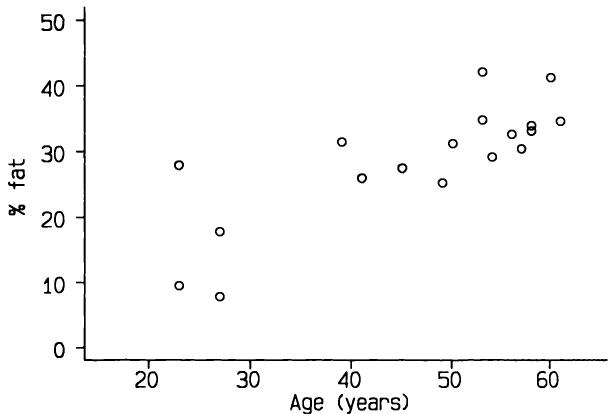  
图11.1 18名正常成年人的体脂百分比（%fat）与年龄的关系（Mazess et al., 1984）。  
Figure 11.1 Body fat percentage (%fat) related to age for 18 normal adults (Mazess et al., 1984).  

变量（即它们不相关）。显然，图11.1中的变量呈正相关；事实上，计算出的相关系数为$r = 0.79$。  
variables (i.e. they are uncorrelated). Clearly the variables in Figure 11.1 are positively correlated; in fact the correlation coefficient can be calculated to be  $r = 0.79$ .  

我们用$r$衡量的是什么？本质上，$r$是衡量点围绕潜在线性趋势的散布程度：点的散布越大，相关性越低。在前面提到的研究中，使用双光子吸收法来测量体脂占总身体质量的百分比。图11.3显示了相同18名受试者的体脂百分比（$\%$ fat）与体重之间的关系。很明显，数据散布很大，体脂百分比与体重之间没有明显的潜在关系。这两个变量之间的相关系数为0.03，证实了视觉印象。  
What are we measuring with  $r$ ？ In essence  $r$  is a measure of the scatter of the points around an underlying linear trend: the greater the spread of the points the lower the correlation. In the study already referred to, dual- photon absorptiometry was used to derive a measure of body fat as a percentage of total body mass. Figure 11.3 shows  $\%$  fat plotted against weight for the same 18 subjects. It is clear that there is considerable scatter with no obvious underlying relationship between  $\%$  fat and weight. The correlation between these two variables is 0.03, confirming the visual impression.  

一个非常强相关性的例子是关于不同哺乳动物物种的母体和胎儿体重的数据。图11.4显示了这些数据经过对数转换后的散点图。这两个变量之间的相关系数为0.985，这种关系显然从一端的蝙蝠到另一端的鲸鱼都表现出惊人的一致性。  
An example of very strong correlation is given by data relating maternal and fetal weight of different species of mammal. Figure 11.4 shows a plot of these data after log transformation. The correlation between the two variables is 0.985, and the relation is clearly remarkably consistent from bats at one extreme through to whales at the other.  

### 11.2.1 数据分布  11.2.1 Data distribution  

相关系数可以对任何数据集进行计算。然而，相关假设检验的有效性存在一个限制，即这两个变量是在个体随机样本上观察到的，并且至少其中一个变量的数据在总体中呈正态分布。为了计算$r$的有效置信区间，两个变量都应呈正态分布。  
The correlation coefficient can be calculated for any data set. However, there is a restriction on the validity of the associated hypothesis test, which is that the two variables are observed on a random sample of individuals and that the data for at least one of the variables have a Normal distribution in the population. For the calculation of a valid confidence interval for  $r$  both variables should have a Normal distribution.  

因此，在实践中，为了使用皮尔逊$r$，最好两个变量都近似呈正态分布。这类数据将显示出大致椭圆形的模式，椭圆的拉伸程度与相关系数相关。然而，对于小样本，或者当$r$接近$+1$或$- 1$时，这个特征可能难以检测。检查假设检验有效性的最简单方法是检查数据的散点图，在计算相关系数时，应常规生成散点图。应该很容易判断数据是否显示出合理的椭圆形模式。可以生成正态图，并且可以通过Shapiro-Wilk W检验正式检验正态性（参见第7章），但实际上没有必要，因为散点图通常就足够了。  
In practice, therefore, it is preferable for both variables to have approximately Normal distribution for any use of Pearson's  $r$ . Data of this type will display a roughly elliptical pattern, with the degree of elongation of the ellipse being related to the correlation coefficient. For small samples, or where  $r$  is near  $+1$  or  $- 1$ , this feature may be hard to detect, however. The easiest way to check the validity of the hypothesis test is by examining a scatter diagram of the data, which ought to be produced as a matter of routine whenever correlation coefficients are calculated. It should be easy to tell whether the data show a reasonably elliptical pattern. Normal plots could be produced, and Normality can be tested formally by the Shapiro- Wilk W test (see Chapter 7), but it is not really necessary because the scatter plot will usually suffice.  

如果数据不符合正态分布，则可以对其中一个或两个变量进行转换，如第11.4节所述，或者计算非参数相关系数，如第11.4节所述。  
If the data do not have a Normal distribution either or both of the variables can be transformed, as for the data shown in Figure 11.4, or a non- parametric correlation coefficient can be calculated, as described in section 11.4.  

关于 $r$、其置信区间以及相关假设检验的数学计算，详见第11.7节。  
The mathematical calculations for  $r$ , its confidence interval, and the associated hypothesis tests are shown in section 11.7.  

280 两个连续变量之间的关系  
280 Relation between two continuous variables  

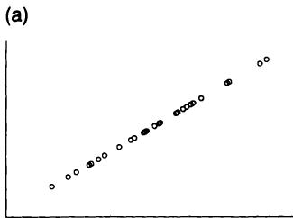  

(b)  
(b)  

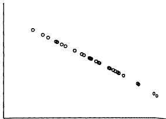  

  

  
(d)  
(d)  

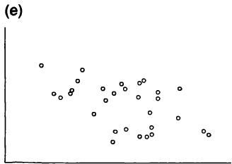  
图11.2 具有相关系数 (r) 的数据，分别为 (a) 1.0；(b) -1.0；(c) 0.0；(d) 0.3；(e) -0.5；(f) 0.7。  
Figure 11.2 Data with correlation coefficients (r) of (a) 1.0; (b) -1.0; (c) 0.0; (d) 0.3; (e) -0.5; (f) 0.7.  

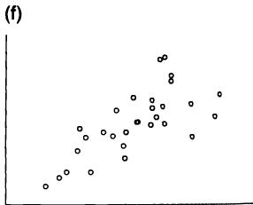  

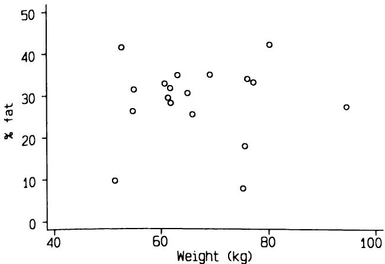  
图11.3 18名正常成年人脂肪百分比与体重的关系（Mazess 等，1984）。  
Figure 11.3 Relation between percentage of fat and bodyweight in 18 normal adults (Mazess et al., 1984).  

  
图11.4 121种哺乳动物的总胎儿体重与非妊娠母体体重的关系（Leitch 等，1959）。  
Figure 11.4 Relation between total fetal weight and non-pregnant maternal weight in 121 species of mammal (Leitch et al., 1959).  

### 11.2.2 $r$ 的置信区间  11.2.2 Confidence interval for  $r$  

11.2.2 $r$ 的置信区间 我们可以假设样本具有代表性，从而获得总体相关系数的置信区间。对于图11.1中的数据，相关系数为0.79。使用第11.7节中描述的方法，我们可以得到相关系数的 $95\%$ 置信区间为0.52至0.92。正如小样本中常见的情况，置信区间较宽，但这确实表明两个变量之间存在相当强的关联。  
11.2.2 Confidence interval for  $r$ We can obtain a confidence interval for the correlation in the population, on the assumption that the sample is representative. For the data in Figure 11.1 the correlation coefficient is 0.79. Using the method described in section 11.7 we can obtain the  $95\%$  confidence interval for the correlation coefficient as being from 0.52 to 0.92. As is usual in small samples, the confidence interval is wide, but it does suggest that there really is quite a strong association between the two variables.  

### 11.2.3 $r$ 的假设检验  11.2.3 Hypothesis test for  $r$  

11.2.3 $r$ 的假设检验 存在一种基于 $t$ 分布的简单显著性检验，用于检验无关联的零假设。该方法在第 11.7 节中描述。然而，表 B7 显示了临界值，可以直接查找 $r$ 的观测值；这些值对于大多数实际目的来说应该足够了。例如，图 11.1 所示数据中，脂肪百分比与年龄之间的相关系数为 0.79，从表 B7 中我们可以看到 $\mathbf{P}< 0.001$。  
11.2.3 Hypothesis test for  $r$ There is a simple test of significance of the null hypothesis of no association which is based on the  $t$  distribution. The method is described in section 11.7. However, Table B7 shows critical values which allow observed values of  $r$  to be looked up directly; these should suffice for most practical purposes. For example, the correlation between  $\%$  fat and age in the data shown in Figure 11.1 was 0.79, and from Table B7 we can see that  $\mathbf{P}< 0.001$ .  

## 11.3 相关性的使用与误用  11.3 USE AND MISUSE OF CORRELATION  

除了第 11.2.1 节中提到的分布假设外，另一个限制是所有观测值都应该是独立的。在实践中，这意味着研究中每个个体只能提供每个变量的一个观测值。当某些或所有受试者有多个观测值时，分析是无效的。例如，使用相关性来关联孕妇在不同孕周有不同数量的血压和雌激素水平观测值是不正确的。在这种情况下，正确的分析可能非常复杂。  
As well as the distributional assumptions mentioned in section 11.2.1, another restriction is that all the observations should be independent. In practice this means that only one observation of each variable should come from each individual in the study. The analysis is not valid when there is more than one observation for some or all of the subjects. For example, it would not be correct to use correlation to relate, say, blood pressure and oestrogen levels in pregnant women with varying numbers of observations at different gestational ages. In such circumstances a proper analysis can be very complex.  

即使上述假设没有被违反，相关性的使用也并非看起来那么简单。事实上，相关性的误用如此普遍，以至于一些统计学家希望这种方法从未被发明出来。最明显的普遍误用发生在记录了大量变量的研究中。显然，在有许多变量的情况下，可以计算出数百个相关系数，然后只挑出那些具有统计学意义的。虽然“数据挖掘”在探索性分析中在有限程度上是可以接受的，但如果走极端，过度解读的可能性就相当大。例如，即使只有十个变量，也可以计算出 45 个变量对之间的相关性。这个问题将在第 11.8 节中进一步讨论。  
Even when the assumptions just mentioned are not violated the use of correlation is not as simple as it looks. Indeed, misuse of correlation is so common that some statisticians have wished that the method had never been devised. The most obvious general misuse occurs in studies in which large numbers of variables have been recorded. Clearly, with many variables it is possible to calculate hundreds of correlation coefficients and then pick out just those which are statistically significant. While 'data- dredging' is acceptable in a limited way in exploratory analyses, when taken to extremes the scope for over- interpretation is considerable. For example, even with only ten variables 45 correlations between pairs of variables can be calculated. This problem is discussed further in section 11.8.  

相关性还有几种更具体的误用，每种性质略有不同，但都经常出现。下面将讨论六种类型。在每种情况下，数学计算本身没有问题，但解释是错误的。  
There are several rather more specific misuses of correlation, each somewhat different in nature but all frequently seen. Six types are discussed below. In each case there is nothing wrong with the mathematical calculations, but the interpretation is flawed.  

### 11.3.1 涉及时间的虚假相关  11.3.1 Spurious correlations involving time  

两个变量都随时间重复记录的相关性可能具有严重的误导性。通过这种方式，人们可以证明汽油价格与离婚率、黄油消费量与农民收入（负相关）等之间的关系。第 5.13 节中给出了另一个例子。  
The correlation of two variables both of which have been recorded repeatedly over time can be grossly misleading. By such means one may demonstrate relationships between the price of petrol and the divorce rate, consumption of butter and farmers' incomes (a negative relation), and so on. Another example was given in section 5.13.  

同样的注意事项也适用于研究个体随时间变化的两个变量。这种相关性通常是虚假的：在对这些数据进行关联之前，有必要去除时间趋势，这是一个需要专家协助的领域。与时间相关的数据将在第 14.6 节中进一步讨论。  
The same caution applies to studying two variables over time for an individual. Such correlations are often spurious: it is necessary to remove the time trends from such data before correlating them, and this is an area that requires expert assistance. Time- related data are considered further in section 14.6.  

### 11.3.2 个体抽样的限制  11.3.2 Restricted sampling of individuals  

如前所述，这里有一个隐含的假设，即所研究的受试者是来自特定人群（如孕妇或高血压男性）的随机样本（或近似随机样本）。如果因为某些个体在一个变量上的数值而刻意地从样本中增加或剔除他们，这会对相关性产生显著影响。例如，如果我们向图11.1所示的数据集中添加几个儿童，我们会大大增加相关性；而如果我们排除任何身高高于 $180~\mathrm{cm}$ 的人，我们会降低相关性（降至 $r = 0.34$）。这两种操作都不会使相关系数的解释有效，因为样本将不再是真正的随机样本。相关性分析对样本选择特别敏感，因为每个变量的受试者间变异直接参与计算。  
As already indicated, there is an implicit assumption that the subjects being studied are a random sample (or nearly so) from some specified population of individuals, such as pregnant women or hypertensive men. Deliberately adding or taking away from our sample some individuals because of their values of one of the variables can have a dramatic effect on the correlation. For example, if we added a few children to the data set shown in Figure 11.1 we would increase the correlation considerably, whereas if we excluded anyone taller than  $180~\mathrm{cm}$  we would decrease the correlation (to  $r = 0.34$ ). Neither manoeuvre would allow a valid interpretation of the correlation coefficient because the sample would no longer be a proper random sample. Correlation analysis is especially sensitive to the sample selection because the between subject variation in each variable enters directly into the calculation.  

### 11.3.3 混合样本  11.3.3 Mixed samples  

当样本包含不同的亚组时，计算相关性可能会产生误导。例如，图11.1中的体脂数据涉及14名女性和4名男性。男性体脂百分比往往较低，而且本研究中的四名男性恰好比女性年轻得多，因此混合性别会倾向于夸大相关性（参见图11.5）。因此，最好只考虑  
It may be misleading to calculate the correlation when the sample comprises different subgroups. For example, the body fat data in Figure 11.1 relate to 14 women and 4 men. Body fat percentage tends to be lower in men, and it happens that the four men in this study were considerably younger than the women, so mixing the sexes tends to inflate the correlation (see Figure 11.5). It would therefore be better to consider the  

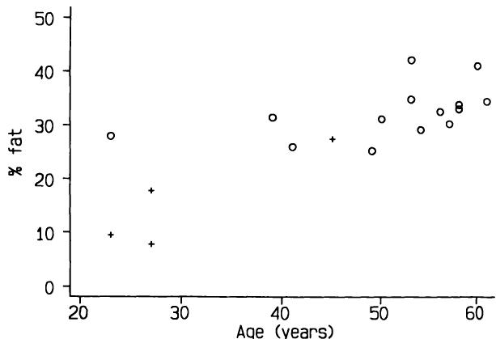  
图11.5 按年龄划分的体脂百分比，显示男性（+）和女性（O）。  
Figure 11.5 % fat by age showing males (+) and females (O).  

女性，这样我们得到的相关系数 $r = 0.51$ 会低得多。亚组混合的另一个后果是，混合后的数据可能不服从正态分布，但除非组间差异非常大且样本量足够大，否则这种效应无法被检测到。  
women only, for whom we get rather lower  $r = 0.51$ . Another consequence of the mixing of subgroups is that the data (when mixed) may not be Normally distributed, but the effect cannot be detected unless the groups are very different and the sample is large.  

### 11.3.4 评估一致性  11.3.4 Assessing agreement  

在医学研究中，经常需要比较两种测量同一量的方法。实验室方法会产生许多此类问题，但在临床医学中也普遍存在，尤其是在无法直接测量感兴趣量的情况下。血压就是一个明显的例子。  
In medical research there is frequently the need to compare two methods of measuring the same quantity. Laboratory methods throw up many such problems, but they are also common in clinical medicine, particularly where it is not possible to measure directly the quantity of interest. Blood pressure is an obvious example.  

分析此类数据最常用的方法是计算相关系数，但这种分析是错误的。正如我们所见，相关系数衡量的是两个量之间的关联程度；它并不衡量它们的一致程度（Bland and Altman, 1986）。方法比较研究将在第14.2节详细讨论。  
The most common method of analysing such data is to calculate the correlation coefficient, but this is a misconceived analysis. As we have seen, the correlation coefficient measures the degree of association between two quantities; it does not measure how closely they agree (Bland and Altman, 1986). Method comparison studies are discussed in detail in section 14.2.  

### 11.3.5 变化与初始值相关  11.3.5 Change related to initial value  

当使用相关性研究初始测量值与该测量值变化之间的关系时，会出现一个相当不同的问题。  
A rather different problem occurs with the use of correlation to study the relation between an initial measurement and the change in that measure.  

随时间的变化。例如，我们可能想知道一种旨在降低血清胆固醇的饮食，是否对血清胆固醇初始值较高的人群更有效。这是一个合理的问题，但不幸的是，事实证明在此处使用相关性会产生误导。这是因为对于任意两个量 $X$ 和 $Y$， $X$ 将与 $X - Y$ 相关。事实上，即使 $X$ 和 $Y$ 是随机数的样本，我们也会预期 $X$ 和 $X - Y$ 之间的相关性为 0.7。（你可以用表 B13 中的随机数表中的一些数字来尝试这一点。）换句话说，即使饮食无效，我们也预期初始血清胆固醇与血清胆固醇变化之间会存在显著相关性。这种现象的名称是均值回归，这再次导致了回归与相关性之间的混淆。  
ment over time. For example, we may be interested in seeing whether a diet designed to lower serum cholesterol was more effective in people with higher initial values of serum cholesterol. This is a reasonable question, but unfortunately it turns out that the use of correlation here is misleading. This is because for any two quantities  $X$  and  $Y$ ,  $X$  will be correlated with  $X - Y$ . Indeed, even if  $X$  and  $Y$  are samples of random numbers we would expect the correlation between  $X$  and  $X - Y$  to be 0.7. (You can try this with some numbers from the table of random numbers in Table B13. ) In other words, we expect to obtain a large correlation between initial serum cholesterol and the change in serum cholesterol even if the diet is ineffective. The name for the phenomenon is regression to the mean, giving another confusion between regression and correlation.  

解决这个问题的最简单方法是取初始测量值和最终测量值的平均值，并计算该平均值与观察到的变化之间的相关性。在上述记法中，这意味着将 $(X + Y) / 2$ 与 $X - Y$ 进行关联。如果这种相关性很大，则可以合理推断，变量的初始水平越高，随时间下降的幅度越大（或上升的幅度越小）。然而，处理这类数据的最佳方法是复杂的：Blomqvist (1986) 和 Hayes (1988) 对此有进一步的讨论。这类问题比表面看起来要复杂，建议寻求统计学建议。  
The simplest way around this problem is to take the average of the initial and final measurement and calculate the correlation between this quantity and the observed change. In the above notation this means correlating  $(X + Y) / 2$  with  $X - Y$ . If this correlation is large it may reasonably be inferred that higher initial levels of the variable are associated with larger falls over time (or smaller rises). However, the best approach to this type of data is complex: further discussion is given by Blomqvist (1986) and Hayes (1988). There is more to this type of problem than is apparent, and statistical advice is recommended.  

### 11.3.6 部分与整体的关系  11.3.6 Relating a part to the whole  

如果我们研究某个组成部分与总量之间的关系，也会出现类似的情况。例如，我们预期会发现以下各项之间存在相关性：  
A similar situation arises if we study the relation between a constituent and the total amount. For example, we would expect to find a correlation between:  

1. 5岁时的身高与成年身高；  
1. height at age 5 and adult height;  

2. 黄体期长度与整个月经周期长度；以及   
2. length of the luteal phase and length of the whole menstrual cycle; and   
3. 蛋白质摄入量与卡路里摄入量；  
3. intake of protein and intake of calories;  

因为在每种情况下，第二个量都包含第一个量，尽管不一定是显式包含。第一个量与其在总量中的补足部分之间可能没有关系（甚至可能是负相关）。正如前一节讨论的问题一样，将分析表达为 $X$ 与 $X + Y$ 之间的相关性表明，无论 $X$ 和 $Y$ 是什么，这两个量都是相关的。  
because in each case the second quantity contains the first, although not necessarily explicitly. There may be no relation (or even a negative relation) between the first quantity and its complement within the total. As with the problem discussed in the previous section, expressing the analysis as the correlation between  $X$  and  $X + Y$  shows that the two quantities are related whatever  $X$  and  $Y$  are.  

## 11.4 秩相关  11.4 RANK CORRELATION  

秩的概念在第 2 章中介绍过，其在两组连续数据比较中的应用则在第 9 章中展示。  
The concept of ranks was introduced in Chapter 2 and applications to the comparison of continuous data from two groups were shown in Chapter 9.  

在考虑两个变量之间的关系时，也可以采用类似的秩次（rank）方法。这里的思路很简单，就是对每组受试者在每个变量上进行排序，然后比较这些排序结果。例如，表11.1展示了图11.1中年龄和体脂百分比（% fat）测量数据，以及这些观测值的秩次。如果两个值相同，则将平均秩次分配给两者。  
A similar use of ranks is possible when considering the relation between two variables. The idea here is simply to rank a set of subjects for each variable and compare the orderings. For example, Table 11.1 shows the data for age and measurements of  $\%$  fat from Figure 11.1, together with the ranks of the observations. Where two values are the same the average rank is assigned to both.  

为了使关系更清晰，受试者已按年龄排序。这样排列数据可以让我们快速了解两个变量是否存在关联的可能性，因为很容易判断第二列秩次中的值是趋于增加还是减少。  
To make the relationship clearer, the subjects have been ordered by age. Arranging data like this allows us to get a quick impression about the possibility that the two variables are associated, as it is quite easy to judge whether the values in the second column of ranks are tending to increase or decrease.  

计算秩相关系数有两种常用方法，一种是斯皮尔曼（Spearman）方法，另一种是肯德尔（Kendall）方法。通常情况下，斯皮尔曼的 $r_{s}$ （常称为斯皮尔曼的 $\rho$ (rho)）比肯德尔的 $\tau$ (tau) 更容易计算，因此这里使用的是斯皮尔曼系数。计算方法见第11.7节。实际上，斯皮尔曼秩相关系数 $r_{s}$ 与对观测值的秩次计算出的皮尔逊相关系数 $r$ 完全相同。  
There are two commonly used methods of calculating the rank correlation coefficient, one due to Spearman and one to Kendall. It is easier in general to calculate Spearman's  $r_{s}$  (often called Spearman's  $\rho$  (rho)) than Kendall's  $\tau$  (tau), so it is the Spearman coefficient that is used here. The calculations are shown in section 11.7. In fact, Spearman's rank correlation coefficient  $r_{s}$  is exactly the same as the Pearson correlation coefficient  $r$  calculated on the ranks of the observations.  

表11.1所示的年龄和体脂百分比数据之间的秩相关系数为0.75，这接近于标准  
The rank correlation between the age and  $\%$  fat data shown in Table 11.1 is 0.75, which is close to the value 0.79 obtained as the standard  

表11.1 18名正常成年人的年龄和体脂百分比（通过双光子吸收法测量）（Mazess 等人，1984）  
Table 11.1 Age and  $\%$  fat (measured by dual-photon ab sorptiometry) for 18 normal adults (Mazess et al., 1984)  

<table><tr><td>Subject</td><td>Age</td><td>Rank</td><td>%Fat</td><td>Rank</td></tr><tr><td>1</td><td>23</td><td>1.5</td><td>9.5</td><td>2</td></tr><tr><td>2</td><td>23</td><td>1.5</td><td>27.9</td><td>7</td></tr><tr><td>3</td><td>27</td><td>3.5</td><td>7.8</td><td>1</td></tr><tr><td>4</td><td>27</td><td>3.5</td><td>17.8</td><td>3</td></tr><tr><td>5</td><td>39</td><td>5</td><td>31.4</td><td>11</td></tr><tr><td>6</td><td>41</td><td>6</td><td>25.9</td><td>5</td></tr><tr><td>7</td><td>45</td><td>7</td><td>27.4</td><td>6</td></tr><tr><td>8</td><td>49</td><td>8</td><td>25.2</td><td>4</td></tr><tr><td>9</td><td>50</td><td>9</td><td>31.1</td><td>10</td></tr><tr><td>10</td><td>53</td><td>10.5</td><td>34.7</td><td>16</td></tr><tr><td>11</td><td>53</td><td>10.5</td><td>42.0</td><td>18</td></tr><tr><td>12</td><td>54</td><td>12</td><td>29.1</td><td>8</td></tr><tr><td>13</td><td>56</td><td>13</td><td>32.5</td><td>12</td></tr><tr><td>14</td><td>57</td><td>14</td><td>30.3</td><td>9</td></tr><tr><td>15</td><td>58</td><td>15.5</td><td>33.0</td><td>13</td></tr><tr><td>16</td><td>58</td><td>15.5</td><td>33.8</td><td>14</td></tr><tr><td>17</td><td>60</td><td>17</td><td>41.1</td><td>17</td></tr><tr><td>18</td><td>61</td><td>18</td><td>34.5</td><td>15</td></tr></table>  
<table><tr><td>Subject</td><td>Age</td><td>Rank</td><td>%Fat</td><td>Rank</td></tr><tr><td>1</td><td>23</td><td>1.5</td><td>9.5</td><td>2</td></tr><tr><td>2</td><td>23</td><td>1.5</td><td>27.9</td><td>7</td></tr><tr><td>3</td><td>27</td><td>3.5</td><td>7.8</td><td>1</td></tr><tr><td>4</td><td>27</td><td>3.5</td><td>17.8</td><td>3</td></tr><tr><td>5</td><td>39</td><td>5</td><td>31.4</td><td>11</td></tr><tr><td>6</td><td>41</td><td>6</td><td>25.9</td><td>5</td></tr><tr><td>7</td><td>45</td><td>7</td><td>27.4</td><td>6</td></tr><tr><td>8</td><td>49</td><td>8</td><td>25.2</td><td>4</td></tr><tr><td>9</td><td>50</td><td>9</td><td>31.1</td><td>10</td></tr><tr><td>10</td><td>53</td><td>10.5</td><td>34.7</td><td>16</td></tr><tr><td>11</td><td>53</td><td>10.5</td><td>42.0</td><td>18</td></tr><tr><td>12</td><td>54</td><td>12</td><td>29.1</td><td>8</td></tr><tr><td>13</td><td>56</td><td>13</td><td>32.5</td><td>12</td></tr><tr><td>14</td><td>57</td><td>14</td><td>30.3</td><td>9</td></tr><tr><td>15</td><td>58</td><td>15.5</td><td>33.0</td><td>13</td></tr><tr><td>16</td><td>58</td><td>15.5</td><td>33.8</td><td>14</td></tr><tr><td>17</td><td>60</td><td>17</td><td>41.1</td><td>17</td></tr><tr><td>18</td><td>61</td><td>18</td><td>34.5</td><td>15</td></tr></table>  

皮尔逊相关系数。当然，情况并非总是如此。当散点图中的数据偏离椭圆形时，这两种方法往往会产生差异。由于这表明不宜计算皮尔逊 $r$，因此，当 $r$ 和 $r_{s}$ 明显不同时，应使用 $r_{s}$。实际上，我们不会同时计算 $r$ 和 $r_{s}$，而是根据散点图的形状选择方法。无论观察到何种模式，都可以使用秩相关，它的优点是不专门评估线性关联，而是评估更一般的关联。例如，从 $r_{s}$ 的值不受任何一个变量的对数变换影响这一事实可以看出这一点。然而，我之前对使用相关性的所有警告同样适用于秩相关。  
Pearson correlation. This is not always the case, of course. The two methods will tend to differ when the data deviate from an elliptical shape in the scatter diagram. As this is an indication against the calculation of Pearson's  $r$ , it follows that when  $r$  and  $r_{s}$  differ noticeably it is  $r_{s}$  that should be used. In practice we do not calculate both  $r$  and  $r_{s}$ , but choose the method according to the appearance of the scatter diagram. Rank correlation may be used whatever type of pattern is seen and it has the advantage of not specifically assessing linear association but more general association. This may be seen, for example, from the fact that the value of  $r_{s}$  is unchanged by logarithmic transformation of either of the variables. All my earlier cautions against the use of correlation apply equally to rank correlation, however.  

Hughes 和 Jones (1985) 研究了46个国家膳食纤维平均摄入量与初潮平均年龄之间的关系。他们引用了一个相关系数 $r = 0.84$ ( $\mathbf{P}< 0.0001$ )。然而，如图11.6所示，数据倾向于聚集在两个主要组中，大致对应于发达国家和发展中国家，并且存在一个极端点。因此，对于任一变量，数据都不接近正态分布。因此，我们可能更倾向于使用秩相关，它给出的 $r_{s} = 0.69$。我们可以将 $r$ 和 $r_{s}$ 的相同值解释为大致等效，因此从表B7来看，尽管秩相关较弱，但其也具有高度显著性 ( $\mathbf{P}< 0.0001$ )。  
Hughes and Jones (1985) studied the relation between average intake of dietary fibre and the average age of menarche in 46 countries. They quoted a correlation coefficient of  $r = 0.84$  ( $\mathbf{P}< 0.0001$ ). However, as Figure 11.6 shows, the data tend to cluster in two main groups, corresponding roughly to developed and developing countries, and there is one extreme point. The data are thus not near to a Normal distribution for either variable. We might, therefore, prefer to use rank correlation, which gives  $r_{s} = 0.69$ . We can interpret identical values of  $r$  and  $r_{s}$  as being roughly equivalent, so from Table B7 the rather weaker rank correlation is also highly significant ( $\mathbf{P}< 0.0001$ ).  

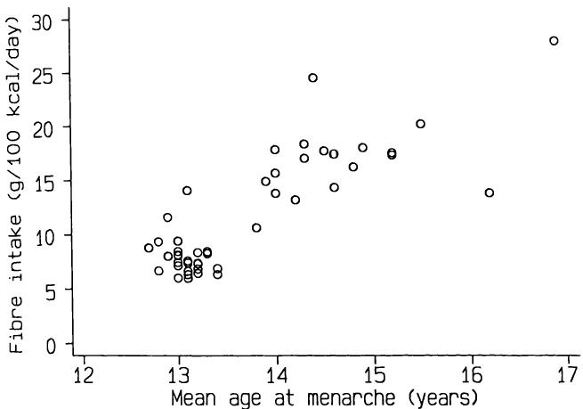  
图11.6 46个国家膳食纤维平均日摄入量与初潮平均年龄之间的关系 (Hughes and Jones, 1985)。  
Figure 11.6 Relation between average daily intake of dietary fibre and mean age of menarche in 46 countries (Hughes and Jones, 1985).  

我们可以像计算 $r$ 一样，以完全相同的方式计算 $r_{s}$ 的置信区间。根据第11.7节给出的方法，纤维和初潮数据的95%置信区间为0.32至0.87。因此，尽管 $\mathbf{P}$ 值非常小，但这些数据与总体相关性的广泛可能性是兼容的。  
We can calculate a confidence interval for  $r_{s}$  in exactly the same way as for  $r$ . Following the method given in section 11.7, the  $95\%$  confidence interval for the fibre and menarche data is from 0.32 to 0.87. The data are thus compatible with a wide range of possibilities for the population correlation, despite the very small  $\mathbf{P}$  value.  

我在第10.9.2节中提到，秩相关可用于评估两个有序分类变量之间的关联程度。显然，在这种情况下会有大量的并列值，因此必须使用允许处理这些并列值的方法版本（参见第11.7.2节）。  
I mentioned in section 10.9.2 that rank correlation can be used to assess the degree of association between two ordered categorical variables. Clearly there will be huge numbers of ties in this situation so it is essential to use the version of the method that allows for them (see section 11.7.2).  

秩相关应该更频繁地使用。它是唯一一种能提供与其参数等效方法一样多信息（而不仅仅是一个$\mathbf{P}$值）的非参数方法，并且具有更广泛的适用性。通过对数据进行秩转换并执行常规的皮尔逊相关分析，使用广泛可用的计算机程序可以轻松完成。  
Rank correlation should be used more often. It is the only non- parametric method which gives as much information as its parametric equivalent (rather than just a  $\mathbf{P}$  value), and it is of wider validity. It is easy to perform using widely available computer programs by ranking the data and performing the usual Pearson correlation analysis.  

## 11.5 对相关性进行其他变量的调整  11.5 ADJUSTING A CORRELATION FOR ANOTHER VARIABLE  

有时我们有关于第三个变量的数据，该变量可能影响了另外两个变量之间观察到的关系。我们可以通过计算偏相关系数来对第三个变量进行调整。我们可以将其视为在第三个变量值相同的个体（或国家等）之间，两个变量的估计相关性。同样的方法也可用于皮尔逊或斯皮尔曼相关系数。  
Sometimes we have data on a third variable that might have influenced the observed relationship between two other variables. We can adjust for the third variable by calculating the partial correlation coefficient. We can consider this to be the estimated correlation between two variables among individuals (or countries or whatever) with the same value of the third variable. The same approach can be used for Pearson's or Spearman's correlation coefficient.  

Begg和Hearns（1966）对血细胞比容（红细胞压积，PCV）、纤维蛋白原和其他蛋白质（白蛋白和球蛋白）对血液黏度的相对贡献感兴趣。表11.2显示了他们从32名住院患者获得的数据。四个变量之间的相关系数在表11.3中以相关矩阵的形式显示。血液黏度与PCV之间的相关系数为0.88 $(\mathbf{P}< 0.001)$，血液黏度与纤维蛋白原之间的相关系数为0.46 $(\mathbf{P}< 0.01)$。作者使用偏相关来观察在考虑了与PCV的关联后，血液黏度与纤维蛋白原的关联是否仍然存在。偏相关系数为0.21 $(\mathbf{P} = 0.25)$，这表明血液黏度与纤维蛋白原之间的关联可以主要由PCV的变异解释。  
Begg and Hearns (1966) were interested in the relative contributions of haematocrit (packed cell volume, PCV), fibrinogen and other proteins (albumin and globulin) to the viscosity of blood. Table 11.2 shows their data from 32 hospital patients. The correlation coefficients between the four variables are shown as a correlation matrix in Table 11.3. The correlation between blood viscosity and PCV was 0.88  $(\mathbf{P}< 0.001)$  and between blood viscosity and fibrinogen was 0.46  $(\mathbf{P}< 0.01)$ . The authors used partial correlation to see if the association of blood viscosity and fibrinogen remained after allowing for the association with PCV. The partial correlation is 0.21  $(\mathbf{P} = 0.25)$ , suggesting that the association between blood viscosity and fibrinogen can be largely explained by variation in PCV.  

James（1985）提供了19个欧洲国家的双卵（DZ）双生率和平均每日牛奶摄入量与纬度相关的数据（参见表11.4）。James特别关注DZ双生率与纬度之间的关系，如图11.7所示。秩相关系数为0.68，具有高度显著性 $(\mathbf{P}< 0.01)$。很明显，所有三个变量的值都倾向于共同增加，因此我们可能会问这种  
James (1985) gave data on dizygotic (DZ) twinning rates and average daily milk consumption for 19 European countries in relation to latitude (see Table 11.4). James was especially interested in the relation between DZ twinning rate and latitude, shown in Figure 11.7. The rank correlation is 0.68, which is highly significant  $(\mathbf{P}< 0.01)$ . It is clear that the values of all three variables tend to increase together so we might ask whether the  

观察到的关联是否可以通过牛奶摄入量的变异来（统计学上）“解释”。15个国家的人均牛奶摄入量信息是可用的；对于这些国家，DZ双生率与  
observed association could be 'explained' (statistically) by variation in milk consumption. Information on per capita consumption of milk was available for 15 countries; for these the correlation between DZ twinning rate and  

表11.2 来自32名住院患者的血液黏度、红细胞压积（PCV）、血浆纤维蛋白原及其他蛋白质数据（Begg和Hearns，1966）  
Table 11.2 Data on blood viscosity, packed cell volume (PCV), plasma fibrinogen and other proteins from 32 hospital patients (Begg and Hearns, 1966)  

<table><tr><td>Patient</td><td>Blood viscosity (cP)</td><td>PCV (%)</td><td>Plasma fibrinogen (mg/100 ml)</td><td>Plasma protein (g/100 ml)</td></tr><tr><td>1</td><td>3.71</td><td>40</td><td>344</td><td>6.27</td></tr><tr><td>2</td><td>3.78</td><td>40</td><td>330</td><td>4.86</td></tr><tr><td>3</td><td>3.85</td><td>42.5</td><td>280</td><td>5.09</td></tr><tr><td>4</td><td>3.88</td><td>42</td><td>418</td><td>6.79</td></tr><tr><td>5</td><td>3.98</td><td>45</td><td>774</td><td>6.40</td></tr><tr><td>6</td><td>4.03</td><td>42</td><td>388</td><td>5.48</td></tr><tr><td>7</td><td>4.05</td><td>42.5</td><td>336</td><td>6.27</td></tr><tr><td>8</td><td>4.14</td><td>47</td><td>431</td><td>6.89</td></tr><tr><td>9</td><td>4.14</td><td>46.75</td><td>276</td><td>5.18</td></tr><tr><td>10</td><td>4.20</td><td>48</td><td>422</td><td>5.73</td></tr><tr><td>11</td><td>4.20</td><td>46</td><td>280</td><td>5.89</td></tr><tr><td>12</td><td>4.27</td><td>47</td><td>460</td><td>6.58</td></tr><tr><td>13</td><td>4.27</td><td>43.25</td><td>412</td><td>5.67</td></tr><tr><td>14</td><td>4.37</td><td>45</td><td>320</td><td>6.23</td></tr><tr><td>15</td><td>4.41</td><td>50</td><td>502</td><td>4.99</td></tr><tr><td>16</td><td>4.64</td><td>45</td><td>550</td><td>6.37</td></tr><tr><td>17</td><td>4.68</td><td>51.25</td><td>414</td><td>6.40</td></tr><tr><td>18</td><td>4.73</td><td>50.25</td><td>304</td><td>6.00</td></tr><tr><td>19</td><td>4.87</td><td>49</td><td>472</td><td>5.94</td></tr><tr><td>20</td><td>4.94</td><td>50</td><td>728</td><td>5.16</td></tr><tr><td>21</td><td>4.95</td><td>50</td><td>716</td><td>6.29</td></tr><tr><td>22</td><td>4.96</td><td>49</td><td>400</td><td>5.96</td></tr><tr><td>23</td><td>5.02</td><td>50.5</td><td>576</td><td>5.90</td></tr><tr><td>24</td><td>5.02</td><td>51.25</td><td>354</td><td>5.81</td></tr><tr><td>25</td><td>5.12</td><td>49.5</td><td>392</td><td>5.49</td></tr><tr><td>26</td><td>5.15</td><td>56</td><td>352</td><td>5.41</td></tr><tr><td>27</td><td>5.17</td><td>50</td><td>572</td><td>6.24</td></tr><tr><td>28</td><td>5.18</td><td>47</td><td>634</td><td>6.50</td></tr><tr><td>29</td><td>5.38</td><td>53.25</td><td>458</td><td>6.60</td></tr><tr><td>30</td><td>5.77</td><td>57</td><td>1070</td><td>4.82</td></tr><tr><td>31</td><td>5.90</td><td>54</td><td>488</td><td>5.70</td></tr><tr><td>32</td><td>5.90</td><td>54</td><td>488</td><td>5.70</td></tr></table>  
<table><tr><td>Patient</td><td>Blood viscosity (cP)</td><td>PCV (%)</td><td>Plasma fibrinogen (mg/100 ml)</td><td>Plasma protein (g/100 ml)</td></tr><tr><td>1</td><td>3.71</td><td>40</td><td>344</td><td>6.27</td></tr><tr><td>2</td><td>3.78</td><td>40</td><td>330</td><td>4.86</td></tr><tr><td>3</td><td>3.85</td><td>42.5</td><td>280</td><td>5.09</td></tr><tr><td>4</td><td>3.88</td><td>42</td><td>418</td><td>6.79</td></tr><tr><td>5</td><td>3.98</td><td>45</td><td>774</td><td>6.40</td></tr><tr><td>6</td><td>4.03</td><td>42</td><td>388</td><td>5.48</td></tr><tr><td>7</td><td>4.05</td><td>42.5</td><td>336</td><td>6.27</td></tr><tr><td>8</td><td>4.14</td><td>47</td><td>431</td><td>6.89</td></tr><tr><td>9</td><td>4.14</td><td>46.75</td><td>276</td><td>5.18</td></tr><tr><td>10</td><td>4.20</td><td>48</td><td>422</td><td>5.73</td></tr><tr><td>11</td><td>4.20</td><td>46</td><td>280</td><td>5.89</td></tr><tr><td>12</td><td>4.27</td><td>47</td><td>460</td><td>6.58</td></tr><tr><td>13</td><td>4.27</td><td>43.25</td><td>412</td><td>5.67</td></tr><tr><td>14</td><td>4.37</td><td>45</td><td>320</td><td>6.23</td></tr><tr><td>15</td><td>4.41</td><td>50</td><td>502</td><td>4.99</td></tr><tr><td>16</td><td>4.64</td><td>45</td><td>550</td><td>6.37</td></tr><tr><td>17</td><td>4.68</td><td>51.25</td><td>414</td><td>6.40</td></tr><tr><td>18</td><td>4.73</td><td>50.25</td><td>304</td><td>6.00</td></tr><tr><td>19</td><td>4.87</td><td>49</td><td>472</td><td>5.94</td></tr><tr><td>20</td><td>4.94</td><td>50</td><td>728</td><td>5.16</td></tr><tr><td>21</td><td>4.95</td><td>50</td><td>716</td><td>6.29</td></tr><tr><td>22</td><td>4.96</td><td>49</td><td>400</td><td>5.96</td></tr><tr><td>23</td><td>5.02</td><td>50.5</td><td>576</td><td>5.90</td></tr><tr><td>24</td><td>5.02</td><td>51.25</td><td>354</td><td>5.81</td></tr><tr><td>25</td><td>5.12</td><td>49.5</td><td>392</td><td>5.49</td></tr><tr><td>26</td><td>5.15</td><td>56</td><td>352</td><td>5.41</td></tr><tr><td>27</td><td>5.17</td><td>50</td><td>572</td><td>6.24</td></tr><tr><td>28</td><td>5.18</td><td>47</td><td>634</td><td>6.50</td></tr><tr><td>29</td><td>5.38</td><td>53.25</td><td>458</td><td>6.60</td></tr><tr><td>30</td><td>5.77</td><td>57</td><td>1070</td><td>4.82</td></tr><tr><td>31</td><td>5.90</td><td>54</td><td>488</td><td>5.70</td></tr><tr><td>32</td><td>5.90</td><td>54</td><td>488</td><td>5.70</td></tr></table>  

纬度为0.61。牛奶摄入量与纬度之间的秩相关系数为0.92，牛奶摄入量与DZ双生率之间的秩相关系数为0.61。我们可以计算调整牛奶摄入量（M）后，纬度（L）与DZ双生率（T）之间的偏相关系数为$r_{s}(LT|M) = 0.18$（参见第11.7.3节）。这个小值表明，DZ双生与纬度之间观察到的关联的一个可能解释是牛奶摄入量。对这类国际相关性的解释是  
latitude was 0.61. The rank correlation between milk consumption and latitude is 0.92 and between milk consumption and DZ twinning rate it is 0.61. We can calculate the partial correlation between latitude (L) and DZ twinning rate (T) adjusted for milk consumption (M) as  $r_{s}(LT|M) = 0.18$  (see section 11.7.3). This small value suggests that one possible explanation for the observed association between DZ twinning and latitude might be milk consumption. Interpretation of such international correlations is  

表 11.3 表 11.2 中数据的相关矩阵  
Table 11.3 Correlation matrix of the data in Table 11.2  

<table><tr><td></td><td>粘度</td><td>PCV</td><td>纤维蛋白原</td></tr><tr><td>PCV</td><td>0.8788</td><td></td><td></td></tr><tr><td>纤维蛋白原</td><td>0.4573</td><td>0.4155</td><td></td></tr><tr><td>蛋白质</td><td>-0.1011</td><td>-0.1575</td><td>-0.0512</td></tr></table>  
<table><tr><td></td><td>Viscosity</td><td>PCV</td><td>Fibrinogen</td></tr><tr><td>PCV</td><td>0.8788</td><td></td><td></td></tr><tr><td>Fibrinogen</td><td>0.4573</td><td>0.4155</td><td></td></tr><tr><td>Protein</td><td>-0.1011</td><td>-0.1575</td><td>-0.0512</td></tr></table>  

表 11.4 纬度、按年龄标准化后的双卵双生率和人均每日奶制品消费量（James, 1985）。括号中的数字为排名  
Table 11.4 Latitude, age-standardized dizygotic twinning rates and daily per capita consumption of milk products (James, 1985). Figures in brackets are ranks  

<table><tr><td>国家</td><td>纬度 (L)</td><td>双卵双生 (T)</td><td>牛奶消费率/1000(M)</td></tr><tr><td>葡萄牙</td><td>40 (1.5)</td><td>6.5 (2)</td><td>3.8</td></tr><tr><td>希腊</td><td>40 (1.5)</td><td>8.8 (13)</td><td>7.7</td></tr><tr><td>西班牙</td><td>41 (3)</td><td>5.9 (1)</td><td>8.2</td></tr><tr><td>保加利亚</td><td>42 (4)</td><td>7.0 (3)</td><td>-</td></tr><tr><td>意大利</td><td>44 (5)</td><td>8.6 (11.5)</td><td>6.5</td></tr><tr><td>法国</td><td>47 (6.5)</td><td>7.1 (4)</td><td>10.9</td></tr><tr><td>瑞士</td><td>47 (6.5)</td><td>8.1 (7.5)</td><td>-</td></tr><tr><td>奥地利</td><td>48 (8)</td><td>7.5 (6)</td><td>15.9</td></tr><tr><td>比利时</td><td>51 (9.5)</td><td>7.3 (5)</td><td>11.6</td></tr><tr><td>西德</td><td>51 (9.5)</td><td>8.2 (9)</td><td>14.1</td></tr><tr><td>荷兰</td><td>52 (11.5)</td><td>8.1 (7.5)</td><td>18.9</td></tr><tr><td>东德</td><td>52 (11.5)</td><td>9.1 (16)</td><td>-</td></tr><tr><td>英格兰和威尔士</td><td>53 (13.5)</td><td>8.9 (14.5)</td><td>17.1</td></tr><tr><td>爱尔兰</td><td>53 (13.5)</td><td>11.0 (18)</td><td>24.4</td></tr><tr><td>苏格兰</td><td>56 (15.5)</td><td>8.9 (14.5)</td><td>-</td></tr><tr><td>丹麦</td><td>56 (15.5)</td><td>9.6 (17)</td><td>16.8</td></tr><tr><td>瑞典</td><td>60 (17)</td><td>8.6 (11.5)</td><td>20.9</td></tr><tr><td>挪威</td><td>61 (18)</td><td>8.3 (10)</td><td>19.3</td></tr><tr><td>芬兰</td><td>62 (19)</td><td>12.1 (19)</td><td>30.4</td></tr></table>  
<table><tr><td>Country</td><td>Latitude (L)</td><td>DZ twinning (T)</td><td>Milk consumption rate/1000(M)</td></tr><tr><td>Portugal</td><td>40 (1.5)</td><td>6.5 (2)</td><td>3.8</td></tr><tr><td>Greece</td><td>40 (1.5)</td><td>8.8 (13)</td><td>7.7</td></tr><tr><td>Spain</td><td>41 (3)</td><td>5.9 (1)</td><td>8.2</td></tr><tr><td>Bulgaria</td><td>42 (4)</td><td>7.0 (3)</td><td>-</td></tr><tr><td>Italy</td><td>44 (5)</td><td>8.6 (11.5)</td><td>6.5</td></tr><tr><td>France</td><td>47 (6.5)</td><td>7.1 (4)</td><td>10.9</td></tr><tr><td>Switzerland</td><td>47 (6.5)</td><td>8.1 (7.5)</td><td>-</td></tr><tr><td>Austria</td><td>48 (8)</td><td>7.5 (6)</td><td>15.9</td></tr><tr><td>Belgium</td><td>51 (9.5)</td><td>7.3 (5)</td><td>11.6</td></tr><tr><td>FR Germany</td><td>51 (9.5)</td><td>8.2 (9)</td><td>14.1</td></tr><tr><td>Holland</td><td>52 (11.5)</td><td>8.1 (7.5)</td><td>18.9</td></tr><tr><td>GDR</td><td>52 (11.5)</td><td>9.1 (16)</td><td>-</td></tr><tr><td>England and Wales</td><td>53 (13.5)</td><td>8.9 (14.5)</td><td>17.1</td></tr><tr><td>Eire</td><td>53 (13.5)</td><td>11.0 (18)</td><td>24.4</td></tr><tr><td>Scotland</td><td>56 (15.5)</td><td>8.9 (14.5)</td><td>-</td></tr><tr><td>Denmark</td><td>56 (15.5)</td><td>9.6 (17)</td><td>16.8</td></tr><tr><td>Sweden</td><td>60 (17)</td><td>8.6 (11.5)</td><td>20.9</td></tr><tr><td>Norway</td><td>61 (18)</td><td>8.3 (10)</td><td>19.3</td></tr><tr><td>Finland</td><td>62 (19)</td><td>12.1 (19)</td><td>30.4</td></tr></table>  

  
图 11.7 19个欧洲国家纬度与双卵双生率之间的关系（James, 1985）。  
Figure 11.7 Relation between latitude and dizygotic twinning rate in 19 European countries (James, 1985).  

然而，这尤其困难。请注意，尽管这些国家在技术上不应随机抽样，但相关性仍常用于此类数据。第 11.8 节讨论了解释相关系数的一般问题。  
particularly difficult, however. Note that correlation is frequently used for this type of data, although the countries are never randomly sampled as they technically should be. Section 11.8 discusses the general problems of interpreting correlation coefficients.  

偏相关在医学研究中不常用。三个或更多变量之间的关系通常使用信息更丰富的多元回归进行研究，这将在第 12.4 节中描述。然而，计算偏相关的方法在第 11.7.3 节中解释。  
Partial correlation is not used a great deal in medical studies. The relation between three or more variables is usually investigated using the more informative multiple regression, which will be described in section 12.4. However, the method of calculating the partial correlation is explained in section 11.7.3.  

## 11.6 相关系数在评估非正态性中的应用  11.6 USE OF THE CORRELATION COEFFICIENT IN ASSESSING NON-NORMALITY  

在第 7.5.2 节中，我描述了使用正态图来直观评估样本观测值与来自正态分布总体的兼容性。我描述了 Shapiro-Wilk W 检验的使用，但该检验在大多数统计软件包中不可用，并且手动执行过于困难。一个更简单的替代方法是使用类似的 Shapiro-Francia $W'$ 检验（Royston, 1983）。  
In section 7.5.2 I described the use of the Normal plot to get a visual assessment of how compatible a sample of observations is with having been drawn from a population with a Normal distribution. I described the use of the Shapiro- Wilk W test, but this is not available in most statistical packages and is too difficult to perform by hand. A much simpler alternative is to use the similar Shapiro- Francia  $W'$  test (Royston, 1983).  

相关系数评估两个变量值之间直线关联的程度。因此，它可用于评估正态图的直线度，从而判断数据是否与正态性的零假设兼容。正态图是观测数据与正态分数（见第 7.5.4 节）的散点图，  
The correlation coefficient assesses the degree of straight- line association between the values of two variables. It can thus be used to assess the straightness of a Normal plot, and so whether the data are compatible with the null hypothesis of Normality. The Normal plot is a plot of the observed  

数据与正态分数（参见第7.5.4节）之间的相关性，因此我们需要这两个量之间的皮尔逊相关系数，我将其称为 $r_{N}$。  
data against the Normal scores (see section 7.5.4), so we need the Pearson correlation coefficient between these two quantities, which I will call  $r_{N}$ .  

我们不能使用常规表格来评估这个相关系数，因为这里的零假设是相关系数为1，而不是0。考虑相关系数 $r_{N}$ 的平方会更容易，这个 $r_{N}^{2}$ 被称为 $W'$。表B12展示了如何评估 $W'$ 的观测值。  
We cannot use the usual tables for assessing this correlation coefficient, because the null hypothesis here is that the correlation is 1, not 0. It is easier to consider the square of the correlation  $r_{N}$ , and it is  $r_{N}^{2}$  which is termed  $W'$ . Table B12 shows how to assess an observed value of  $W'$ .  

表11.5显示了一些将在本章后面使用的血糖数据，已按升序排列。还显示了使用第7.5.2节公式计算的预期累积频率 $(P_{i})$，以及相应的正态分数。原始数据与正态分数之间的相关系数为0.9772，因此 $W'$ 的值为 $0.9772^{2} = 0.955$。从表B12中我们得到 $P > 0.2$，这表明数据与来自正态总体的样本是兼容的。  
Table 11.5 shows some blood glucose data that will be used later in this chapter, sorted into ascending order. Also shown are the expected cumulative frequencies  $(P_{i})$ , using the formula in section 7.5.2, and the corresponding Normal scores. The correlation coefficient between the raw data and the Normal scores is 0.9772, so the value of  $W'$  is  $0.9772^{2} = 0.955$ . From Table B12 we get  $P > 0.2$ , so that the data are compatible with being a sample from a Normal population.  

表11.5 24名1型糖尿病患者的空腹血糖数据（Thuesen et al., 1985），并计算了正态分数  
Table 11.5 Fasting blood glucose data from 24 type 1 diabetic patients (Thuesen et al., 1985), with calculation of Normal scores  

<table><tr><td>患者 (i)</td><td>血糖</td><td>Pi</td><td>正态分数</td></tr><tr><td>1</td><td>4.2</td><td>0.026</td><td>-1.947</td></tr><tr><td>2</td><td>4.9</td><td>0.067</td><td>-1.498</td></tr><tr><td>3</td><td>5.2</td><td>0.108</td><td>-1.236</td></tr><tr><td>4</td><td>5.3</td><td>0.149</td><td>-1.039</td></tr><tr><td>5</td><td>6.7</td><td>0.191</td><td>-0.875</td></tr><tr><td>6</td><td>6.7</td><td>0.232</td><td>-0.732</td></tr><tr><td>7</td><td>7.2</td><td>0.273</td><td>-0.603</td></tr><tr><td>8</td><td>7.5</td><td>0.314</td><td>-0.483</td></tr><tr><td>9</td><td>8.1</td><td>0.356</td><td>-0.370</td></tr><tr><td>10</td><td>8.6</td><td>0.397</td><td>-0.261</td></tr><tr><td>11</td><td>8.8</td><td>0.438</td><td>-0.156</td></tr><tr><td>12</td><td>9.3</td><td>0.479</td><td>-0.052</td></tr><tr><td>13</td><td>9.5</td><td>0.521</td><td>0.052</td></tr><tr><td>14</td><td>10.3</td><td>0.562</td><td>0.156</td></tr><tr><td>15</td><td>10.8</td><td>0.603</td><td>0.261</td></tr><tr><td>16</td><td>11.1</td><td>0.644</td><td>0.370</td></tr><tr><td>17</td><td>12.2</td><td>0.686</td><td>0.483</td></tr><tr><td>18</td><td>12.5</td><td>0.727</td><td>0.603</td></tr><tr><td>19</td><td>13.3</td><td>0.768</td><td>0.732</td></tr><tr><td>20</td><td>15.1</td><td>0.809</td><td>0.875</td></tr><tr><td>21</td><td>15.3</td><td>0.851</td><td>1.039</td></tr><tr><td>22</td><td>16.1</td><td>0.892</td><td>1.236</td></tr><tr><td>23</td><td>19.0</td><td>0.933</td><td>1.498</td></tr><tr><td>24</td><td>19.5</td><td>0.974</td><td>1.947</td></tr></table>  
<table><tr><td>Patient (i)</td><td>Blood glucose</td><td>Pi</td><td>Normal score</td></tr><tr><td>1</td><td>4.2</td><td>0.026</td><td>-1.947</td></tr><tr><td>2</td><td>4.9</td><td>0.067</td><td>-1.498</td></tr><tr><td>3</td><td>5.2</td><td>0.108</td><td>-1.236</td></tr><tr><td>4</td><td>5.3</td><td>0.149</td><td>-1.039</td></tr><tr><td>5</td><td>6.7</td><td>0.191</td><td>-0.875</td></tr><tr><td>6</td><td>6.7</td><td>0.232</td><td>-0.732</td></tr><tr><td>7</td><td>7.2</td><td>0.273</td><td>-0.603</td></tr><tr><td>8</td><td>7.5</td><td>0.314</td><td>-0.483</td></tr><tr><td>9</td><td>8.1</td><td>0.356</td><td>-0.370</td></tr><tr><td>10</td><td>8.6</td><td>0.397</td><td>-0.261</td></tr><tr><td>11</td><td>8.8</td><td>0.438</td><td>-0.156</td></tr><tr><td>12</td><td>9.3</td><td>0.479</td><td>-0.052</td></tr><tr><td>13</td><td>9.5</td><td>0.521</td><td>0.052</td></tr><tr><td>14</td><td>10.3</td><td>0.562</td><td>0.156</td></tr><tr><td>15</td><td>10.8</td><td>0.603</td><td>0.261</td></tr><tr><td>16</td><td>11.1</td><td>0.644</td><td>0.370</td></tr><tr><td>17</td><td>12.2</td><td>0.686</td><td>0.483</td></tr><tr><td>18</td><td>12.5</td><td>0.727</td><td>0.603</td></tr><tr><td>19</td><td>13.3</td><td>0.768</td><td>0.732</td></tr><tr><td>20</td><td>15.1</td><td>0.809</td><td>0.875</td></tr><tr><td>21</td><td>15.3</td><td>0.851</td><td>1.039</td></tr><tr><td>22</td><td>16.1</td><td>0.892</td><td>1.236</td></tr><tr><td>23</td><td>19.0</td><td>0.933</td><td>1.498</td></tr><tr><td>24</td><td>19.5</td><td>0.974</td><td>1.947</td></tr></table>  

## 11.7 相关性 - 数学与计算实例  11.7 CORRELATION - MATHEMATICS AND WORKED EXAMPLES  

（本节给出了本章第一部分所述计算的数学公式，以及一个计算实例。可以省略本节而不影响内容的连贯性。）  
(This section gives the mathematical formulae for the calculations described in the first part of this chapter, together with a worked example. It can be omitted without loss of continuity.)  

### 11.7.1 皮尔逊 $r$  11.7.1 Pearson's  $r$  

通常计算的相关系数称为皮尔逊 $r$ 或“积矩”相关系数。如果我们有两个变量 $X$ 和 $Y$，它们之间的相关性，表示为 $r(X,Y)$ 或通常简写为 $r$，由以下公式给出：  
The correlation coefficient that is usually calculated is called Pearson's  $r$  or the 'product- moment' correlation coefficient. If we have two variables  $X$  and  $Y$ , the correlation between them, denoted by  $r(X,Y)$  or usually just  $r$ , is given by  

$$
r = \frac{\Sigma(x_{i} - \bar{x})(y_{i} - \bar{y})}{\sqrt{\Sigma(x_{i} - \bar{x})^{2}\Sigma(y_{i} - \bar{y})^{2}}}
$$  

其中 $x_{i}$ 和 $y_{i}$ 分别是第 $i$ 个个体的 $X$ 和 $Y$ 值。$r$ 值可以粗略地看作是数据大致落入的椭圆的伸长程度的度量。该方程显然是对称的，即哪个变量是 $X$ 哪个是 $Y$ 并不重要。  
where  $x_{i}$  and  $y_{i}$  are the values of  $X$  and  $Y$  for the  $i^{\text{th}}$  individual. The value of  $r$  may loosely speaking be seen as a measure of the elongation of the ellipse that the data approximately fall within. The equation is clearly symmetric in that it does not matter which variable is  $X$  and which is  $Y$ .  

为了计算目的，一个更简单的公式是  
For the purposes of calculation a simpler formula to use is  

$$
r = \frac{\Sigma x_{i}y_{i} - (\Sigma x_{i})(\Sigma y_{i}) / n}{\sqrt{[\Sigma x_{i}^{2} - (\Sigma x_{i})^{2} / n][\Sigma y_{i}^{2} - (\Sigma y_{i})^{2} / n]}}
$$  

为此，需要获得 $\Sigma x_{i}, \Sigma y_{i}, \Sigma x_{i}^{2}, \Sigma y_{i}^{2}$ 和 $\Sigma x_{i}y_{i}$。  
for which it is necessary to obtain  $\Sigma x_{i}, \Sigma y_{i}, \Sigma x_{i}^{2}, \Sigma y_{i}^{2}$ , and  $\Sigma x_{i}y_{i}$ .  

如果你已经有了均值（$\bar{x}$ 和 $\bar{y}$）和标准差（$s_{x}$ 和 $s_{y}$），那么公式可以简化为  
If you already have the means ( $\bar{x}$  and  $\bar{y}$ ) and standard deviations ( $s_{x}$  and  $s_{y}$ ) the formula simplifies to  

$$
r = \frac{\Sigma x_{i}y_{i} - n\bar{x}\bar{y}}{(n - 1)s_{x}s_{y}}
$$  

因此，只需计算额外项 $\Sigma x_{i}y_{i}$ 即可。  
so that it is only necessary to calculate the extra term  $\Sigma x_{i}y_{i}$ .  

然而，此公式不应在计算机程序中使用，因为舍入误差偶尔会导致不准确。（应使用第一个 $r$ 的等式。）  
This formula should not be used in a computer program, however, as inaccuracy is occasionally introduced through rounding errors. (The first equation for  $r$  should be used.)  

#### (a) 置信区间   (a) Confidence interval   

Pearson's $r$ 的抽样分布不是正态的，但我们可以将 $r$ 转换得到一个称为 $z$ 的量，它具有正态抽样分布。转换公式为  
The sampling distribution of Pearson's  $r$  is not Normal, but we can transform  $r$  to get a quantity called  $z$  which does have a Normal sampling distribution. The transformation is  

$$
z = \frac{1}{2}\log_{\mathrm{e}}\left(\frac{1 + r}{1 - r}\right).
$$  

$z$ 的标准误大约是 $1 / \sqrt{n - 3}$，其中 $n$ 是样本量，因此我们可以构建 $z$ 的 95% 置信区间，范围为  
The standard error of  $z$  is approximately  $1 / \sqrt{n - 3}$  where  $n$  is the sample size, so we can construct a 95% confidence interval for  $z$  as being from  

$$
z_{1} = z - 1.96 / \sqrt{n - 3}\qquad \mathrm{to}\qquad z_{2} = z + 1.96 / \sqrt{n - 3}.
$$  

我们将上述值反向转换，以获得总体相关系数 $r$ 的置信区间，为  
We back- transform the above values to get a confidence interval for the population correlation coefficient  $r$  as  

$$
\frac{e^{2z_{1}} - 1}{e^{2z_{1}} + 1}\mathrm{to}\frac{e^{2z_{2}} - 1}{e^{2z_{2}} + 1}.
$$  

图 11.1 中的体脂百分比和年龄数据相关系数为 0.7921，因此我们有  
The  $\%$  fat and age data in Figure 11.1 had a correlation of 0.7921 so we have  

$$
z = \frac{1}{2}\log_{e}\left(\frac{1 + 0.7921}{1 - 0.7921}\right) = 1.0770.
$$  

我们可以通过计算得到 $z$ 的 $95\%$ 置信区间  
We can get a  $95\%$  confidence interval for  $z$  by calculating  

$$
z_{1} = 1.0770 - 1.96 / \sqrt{15}
$$  

和  
and  

$$
z_{2} = 1.0770 + 1.96 / \sqrt{15},
$$  

得到 0.5710 到 1.5831。我们将这些值反向转换，得到 $r$ 的 $95\%$ 置信区间为  
giving 0.5710 to 1.5831. We back- transform these values to get a  $95\%$  confidence interval for  $r$  as  

$$
\frac{e^{2\times 0.5710} - 1}{e^{2\times 0.5710} + 1}\mathrm{to}\frac{e^{2\times 1.5831} - 1}{e^{2\times 1.5831} + 1},
$$  

即 0.52 到 0.92。尽管整个置信区间远大于零，但它非常宽。  
or 0.52 to 0.92. Although the whole confidence interval is much greater than zero, it is very wide.  

#### (b) 假设检验  (b) Hypothesis test  
相关系数的假设检验可以非常容易地进行。在总体中没有关联（即零相关）的零假设下，可以证明量  
The hypothesis test for the correlation coefficient may be performed very easily. Under the null hypothesis that there is no association in the population (i.e. zero correlation) it can be shown that the quantity  

$$
r\sqrt{\frac{n - 2}{1 - r^{2}}}
$$  

服从自由度为 $n - 2$ 的 $t$ 分布。因此，可以通过查阅 $t$ 分布表（表 B4）来检验无关联的零假设。  
has a  $t$  distribution with  $n - 2$  degrees of freedom. Thus the null hypothesis of no association may be tested by looking this value up in the table of the  $t$  distribution (Table B4).  

图 11.1 中体脂百分比和年龄数据的相关系数为 0.7921，因此我们有  
The  $\%$  fat and age data in Figure 11.1 had a correlation of 0.7921 so we have  

$$
t = 0.7921\sqrt{\frac{16}{1 - 0.7921^{2}}} = 5.19
$$  

在16个自由度下 $(\mathbf{P}< 0.001)$  
on 16 degrees of freedom  $(\mathbf{P}< 0.001)$  

然而，表B7显示了 $r$ 本身的关键值，这更容易使用。此表足以满足大多数实际目的。  
However, Table B7 shows critical values for  $r$  itself, and this is much easier to use. This table will prove sufficient for most practical purposes.  

### 11.7.2 秩相关  11.7.2 Rank correlation  

斯皮尔曼秩相关系数 $r_{s}$ 是通过将两个变量的数值分别排序获得的。表11.4显示了一个示例。计算 $r_{s}$ 最简单的方法是对数据的秩计算皮尔逊 $r$。对于表11.4中DZ双生率和纬度的数据，这给出了 $r_{s} = 0.68$。  
Spearman's rank correlation coefficient  $r_{s}$  is obtained by ranking in order the values of each of the two variables. An example is shown in Table 11.4. The simplest way to get  $r_{s}$  is to calculate Pearson's  $r$  on the ranks of the data. For the data on DZ twinning rate and latitude in Table 11.4 this gives  $r_{s} = 0.68$  

还有一种替代方法，对于手动计算更简单，但它假设数据中没有并列（ties）。对于所研究的每个 $N$ 个受试者，计算秩的差值 $d_{i}$。斯皮尔曼秩相关系数然后由以下公式给出：  
There is an alternative approach which is simpler for hand calculation, but it assumes that there are no ties in the data. For each of the  $N$  subjects being studied the difference in the ranks,  $d_{i}$  , is calculated. Spearman's rank correlation coefficient is then given by  

$$
r_{s} = 1 - \frac{6\sum_{i = 1}^{n}d_{i}^{2}}{N^{3} - N}
$$  

这个公式与皮尔逊 $r$ 的公式没有明显的相似之处，但在没有并列时给出相同的结果。  
This formula bears no obvious similarity to the formula for Pearson's  $r$  but gives the identical answer when there are no ties.  

表11.4中显示了纬度和DZ双生率数据的秩。秩差的平方和为366.5，因此我们有：  
The ranks of the data on latitude and DZ twinning rate are shown in Table 11.4. The sum of the squares of the differences in the ranks is 366.5 so we have  

$$
r_{s} = 1 - \frac{6\times366.5}{6859 - 19} = 0.68.
$$  

尽管当数据中存在并列秩时，$r_{s}$ 的计算应进行修正，但除非并列数量相当多，否则影响很小。表11.4中的纬度和DZ双生数据有几个并列秩，但无论是否进行修正，$r_{s}$ 的值都是0.68（保留两位小数）。使用对秩计算的皮尔逊相关系数的优点是并列情况会自动处理。当然，使用标准统计软件也很容易实现。  
Although the calculation of  $r_{s}$  should be modified when there are tied ranks in the data, the effect is small unless there are considerable numbers of ties. The latitude and DZ twinning data in Table 11.4 have several tied ranks but the value of  $r_{s}$  is 0.68, to two decimal places, whether the correction is made or not. The advantage of the use of the Pearson correlation coefficient calculated on the ranks is that ties are automatically dealt with. Also, of course, it is easy to perform with standard statistical software.  

#### (a) 置信区间  (a) Confidence interval  

$r_{s}$ 的分布与 $r$ 的分布相似，当样本量大于约 10 时，因此可以使用上述针对 $r$ 的方法来获得 $r_{s}$ 的置信区间。  
The distribution of  $r_{s}$  is similar to that of  $r$  for samples larger than about 10, so a confidence interval for  $r_{s}$  can be obtained using the method given above for  $r$  

#### (b) 假设检验  (b) Hypothesis test  

在总体中没有关联（即零相关）的零假设下，可以证明，对于大样本 $(n > 30)$，以下量  
Under the null hypothesis that there is no association in the population (i.e. zero correlation) it can be shown that for large samples  $(n > 30)$  the quantity  

$$
r_{s}\sqrt{\frac{n - 2}{1 - r_{s}^{2}}}
$$  

具有 $n - 2$ 个自由度的 $t$ 分布。因此，可以通过查阅 $t$ 分布表（表 B4）来检验无关联的零假设。同样地，$r_{s}$ 可以与表 B7 中的临界值进行比较。对于较小的样本，应使用表 B8。  
has a  $t$  distribution with  $n - 2$  degrees of freedom. Thus the null hypothesis of no association may be tested by looking this value up in the table of the  $t$  distribution (Table B4). Equivalently,  $r_{s}$  can be compared with the critical values in Table B7. For smaller samples Table B8 should be used.  

### 11.7.3 偏相关  11.7.3 Partial correlation  

如果我们有每对变量之间的相关系数，例如 $r(AB)$、$r(AC)$ 和 $r(BC)$，我们可以计算调整了第三个变量后的两个变量之间的相关性。为了调整变量 $A$ 和 $B$ 之间的相关性以消除变量 $C$ 可能的影响，我们将 $A$ 和 $B$ 调整了 $C$ 后的偏相关性计算为  
We can calculate the correlation between two variables after adjusting for a third if we have the correlation coefficients between each pair of variables, say  $r(AB)$ ,  $r(AC)$  and  $r(BC)$ . To adjust the correlation between variables  $A$  and  $B$  for the possible effect of variable  $C$  we calculate the partial correlation of  $A$  and  $B$  adjusted for  $C$  as  

$$
r(AB|C) = \frac{r(AB) - r(AC)r(BC)}{\sqrt{[1 - r(AC)^2][1 - r(BC)^2]}}.
$$  

类似地，偏秩相关性计算为  
Similarly the partial rank correlation is calculated as  

$$   
r_{s}(AB|C) = \frac{r_{s}(AB) - r_{s}(AC)r_{s}(BC)}{\sqrt{[1 - r_{s}(AC)^2][1 - r_{s}(BC)^2]}}.  
$$  

偏相关系数的假设检验与普通相关系数的检验方式相同，只是自由度为 $N - 3$。表11.4中变量对之间的相关性（省略了四个没有牛奶消费率的国家）为：  
The hypothesis test for the partial correlation coefficient is performed in the same way as for the ordinary correlation coefficient, except that there are  $N - 3$  degrees of freedom. The correlations between pairs of variables in Table 11.4, omitting the four countries without milk consumption rates, were  

$$
r_{s}(LT) = 0.6147, r_{s}(LM) = 0.9221, \text{and} r_{s}(TM) = 0.6059  
$$  

因此，调整牛奶消费量后，纬度与DZ双生率之间的偏秩相关系数为：  
so that the partial rank correlation coefficient between latitude and DZ twinning rate adjusted for milk consumption is  

$$ 
r_{s}(LT|M) = \frac{0.6147 - 0.9221 \times 0.6059}{\sqrt{(1 - 0.9221^2)(1 - 0.6059^2)}} = 0.18.  
$$  

## 11.8 相关性的解释  11.8 INTERPRETATION OF CORRELATION  

相关系数的范围在 $- 1$ 到 $+1$ 之间，零点表示两个变量之间没有线性关联。然而，一个非常小的相关性不一定表示两个变量不相关。为了确定这一点，我们应该研究数据的散点图，因为两个变量可能显示出一种特殊（即非线性）的关系。例如，我们不会观察到平均中午温度与日历月份之间存在多少相关性（如果有的话），因为它们之间存在周期性模式。更常见的情况是两个变量之间存在曲线  
Correlation coefficients lie within the range  $- 1$  to  $+1$ , with the midpoint of zero indicating no linear association between the two variables. A very small correlation does not necessarily indicate that two variables are not associated, however. To be sure of this we should study a plot of the data, because it is possible that the two variables display a peculiar (i.e. non- linear) relationship. For example, we would not observe much, if any correlation between the average midday temperature and calendar month because there is a cyclic pattern. More common is the situation of a curved  

关系，例如出生体重与妊娠长度之间。在这种情况下，皮尔逊 $r$ 会低估关联性，因为它衡量的是线性关联。秩相关系数在这里更好，因为它以更普遍的方式评估变量是否倾向于共同上升（或向相反方向移动）。  
relationship between two variables, such as between birthweight and length of gestation. In this case Pearson's  $r$  will underestimate the association as it is a measure of linear association. The rank correlation coefficient is better here as it assesses in a more general way whether the variables tend to rise together (or move in opposite directions).  

令人惊讶的是，0.5甚至0.7的相关性是多么不令人印象深刻（图11.2）。如表B7所示，这种程度的相关性在样本量分别为16和9时，在5%的水平上是显著的。它们是否重要则是完全不同的问题。费恩斯坦（Feinstein, 1985）评论了在一个超过6000个样本中发现的、小于0.1的统计学显著相关性缺乏临床相关性。临床相关性问题必须根据具体情况进行判断，并取决于上下文。例如，相同的微小相关性在流行病学研究中可能很重要，但在临床上却不重要。  
It is surprising how unimpressive a correlation of 0.5 or even 0.7 is (Figure 11.2). As Table B7 shows, correlations of this magnitude are significant at the  $5\%$  level in samples as small as 16 and 9 respectively. Whether they are important is quite another matter. Feinstein (1985) commented on the lack of clinical relevance of a statistically significant correlation of less than 0.1 found in a sample of over 6000. The problem of clinical relevance is one that must be judged on its merits in each case, and depends on the context. For example, the same small correlation may be important in an epidemiological study but unimportant clinically.  

一种有助于修正过度热情地看待相关性的方法是计算 $100r^{2}$，这是数据变异性中由两个变量之间的关联“解释”的百分比。因此，0.7的相关性意味着大约一半（49%）的变异性可以归因于观察到的关联，依此类推。这个概念与回归的方差分析相关联，将在11.13.6节和第12章中讨论。计算相关系数的置信区间也可能有用，对于小样本来说，置信区间会很宽。  
One way of looking at the correlation that helps to modify over- enthusiasm is to calculate  $100r^{2}$ , which is the percentage of the variability of the data that is 'explained' by the association between the two variables. So a correlation of 0.7 implies that just about half (49%) of the variability may be put down to the observed association, and so on. This concept ties in with the analysis of variance for regression, discussed in section 11.13.6 and in Chapter 12. It may also be useful to calculate a confidence interval for the correlation coefficient, which for small samples will be wide.  

关联的解释常常存在问题，因为无法直接推断因果关系。如果我们观察到两个变量 $A$ 和 $B$ 之间存在关联，可能有以下几种解释。排除偶然发现的可能性，它可能是因为：  
Interpretation of association is often problematic because causation cannot be directly inferred. If we observe an association between two variables  $A$  and  $B$  there are several possible explanations. Excluding the possibility that it is a chance finding, it may be because  

1. $A$ 影响（或“导致”） $B$；  
1. A influences (or 'causes')  $B$ ;  
2. $B$ 影响 $A$；或者  
2. B influences  $A$ ; or  
3. $A$ 和 $B$ 都受到一个或多个其他变量的影响。  
3. both  $A$  and  $B$  are influenced by one or more other variables.  

如果存在某些可疑的共同原因 $C$ 的数据，则可以通过计算偏相关来查看在考虑 $C$ 的情况下，$A$ 和 $B$ 之间观察到的关联是否仍然存在。除了这种情况，通常无法在统计学上区分上述三种可能性，推断必须基于其他知识。在考察没有背景知识的变量时，推断因果联系是不合理的。这适用于无论观察到的关联强度如何的情况。  
Where data are available for some suspected common cause  $C$ , it is possible to see if the observed association between  $A$  and  $B$  remains when allowing for  $C$  by calculating the partial correlation. With this exception, it is not in general possible to distinguish statistically between the three possibilities above, and inferences must be based on other knowledge. When looking at variables where there is no background knowledge, inferring a causal link is not justified. This applies regardless of the strength of the observed association.  

例如，我们看到许多国家的数据显示酒精消费与肝硬化死亡之间存在关联（Smith, 1981），我们对此并不感到惊讶，因为有大量关于酒精对肝脏影响的科学知识。但是，对于显示猪肉消费与肝硬化死亡率之间存在关联的国际数据，我们应该如何理解呢？Nanji 和 French (1985) 报告了这样的相关性：  
For example, we are not surprised to see data from many countries that show a relation between consumption of alcohol and deaths from liver cirrhosis (Smith, 1981), because of the large body of scientific knowledge about the effect of alcohol on the liver. But what should we make of international data showing a relationship between pork consumption and cirrhosis mortality？ Nanji and French (1985) reported such a correlation of  

$r = 0.40$（针对 16 个国家）和秩相关 0.60（针对 10 个加拿大省份）。在没有任何科学理由支持这种关联的情况下，人们应该对此发现持怀疑态度。在可能的情况下，应该尝试在不同人群中检查相同的变量。Seely (1985) 研究了 21 个欧洲国家猪肉消费与肝硬化死亡率之间的关系，其秩相关为 0.001；根本没有关联。  
$r = 0.40$  for 16 countries and a rank correlation of 0.60 for 10 Canadian provinces. In the absence of any scientific reason for such an association one should be sceptical about such a finding. Wherever possible one should try to examine the same variables in a different population. Seely (1985) studied the relation between pork consumption and cirrhosis mortality in 21 European countries, for which the rank correlation was 0.001; there was no association at all.  

国际相关性的解释尤其困难，因为国家之间存在太多差异。我们不能安全地将图 11.6 的数据解释为高纤维饮食会导致月经初潮延迟（当然也不能反过来解释）。其他情况也并没有什么不同。我们不应该在没有旁证的情况下，将任何相关性视为因果关联，无论该假设多么“合理”。  
Interpretation of international correlations is particularly difficult because there are so many differences between countries. We could not safely interpret the data of Figure 11.6 as indicating that a high fibre diet leads to delayed menarche (and certainly not the converse). Other situations are not really any different. We ought not to take any correlation as indicating a causal association without collateral evidence, however 'reasonable' the hypothesis may be.  

相关性常被用作探索许多变量之间相互关系的方法，为此目的，使用假设检验是最明显的。尽管原则上可行，但这种方法常常被过度使用。问题在于，即使变量数量适中，相关系数的数量也很大—10 个变量会产生 $45~r$ 值，20 个变量会产生 190 个。其中每 20 个中就有一个纯粹是偶然在 5% 水平上显著，这些无法与真正的关联区分开来。此外，在 5% 水平上显著的相关性大小取决于样本量。在大型样本中，即使有几个显著的 $r$ 值在 0.2 到 0.3 左右，这些也不太可能非常有用。虽然这种查看大量变量的方法在确实没有先验假设时会有帮助，但显著的关联确实需要在另一组数据中得到证实才能被信任。  
Correlation is often used as an exploratory method for investigating inter- relationships among many variables, for which purpose it is most obvious to use hypothesis tests. Although fine in principle, this approach is often over- done. The problem is that even with a modest number of variables the number of correlation coefficients is large - 10 variables yield  $45~r$  values, and 20 variables yield 190. One in 20 of these will be significant at the  $5\%$  level purely by chance, and these cannot be distinguished from genuine associations. Further, the magnitude of correlation that is significant at the  $5\%$  level depends upon the sample size. In a large sample, even if there are several significant  $r$  values of around 0.2 to 0.3, say, these are unlikely to be very useful. While this way of looking at large numbers of variables can be helpful when one really has no prior hypotheses, significant associations really need to be confirmed in another set of data before credence can be given to them.  

另一个常见的解释问题发生在当我们知道两个变量中的每一个都与第三个变量相关联时。例如，如果 $A$ 与 $B$ 呈正相关，$B$ 与 $C$ 呈正相关，那么很容易推断 $A$ 必然与 $C$ 呈正相关。尽管这可能确实是真的，但这种推断是不合理的—我们无法对 $A$ 和 $C$ 之间的相关性做出任何判断。当观察到没有关联时也是如此。例如，在 Mazess 等人（1984）的数据中，年龄与体重之间的相关性为 0.05，体重与 % 脂肪之间的相关性为 0.03（图 11.3）。这并不意味着年龄与 % 脂肪之间的相关性也接近零。事实上，这种相关性为 0.79，正如我们前面所看到的（图 11.11）。这三种两两关系显示在图 11.8 中。相关性不能从间接关联中推断出来。  
Another common problem of interpretation occurs when we know that each of two variables is associated with a third variable. For example, if  $A$  is positively correlated with  $B$  and  $B$  is positively correlated with  $C$  it is tempting to infer that  $A$  must be positively correlated with  $C$ . Although this may indeed be true, such an inference is unjustified - we cannot say anything about the correlation between  $A$  and  $C$ . The same is true when one has observed no association. For example, in the data of Mazess et al. (1984) the correlation between age and weight was 0.05 and between weight and  $\%$  fat it was 0.03 (Figure 11.3). This does not imply that the correlation between age and  $\%$  fat was also near zero. In fact this correlation was 0.79, as we saw earlier (Figure 11.11). These three two- way relations are shown in Figure 11.8. Correlations cannot be inferred from indirect associations.  

相关性分析常在回归方法（11.10节及后续章节讨论）更适用时被错误地使用。这两种方法将在11.17节进行比较。  
Correlation is often used when it would be better to use regression methods, discussed in section 11.10 onwards. The two methods are compared in section 11.17.  

  
图11.8 散点图显示了18名正常成年人年龄、体脂百分比和体重之间的两两关系（Mazess et al., 1984）。  
Figure 11.8 Scatter diagrams showing each two way relation between age,  $\%$  fat, and weight of 18 normal adults (Mazess et al., 1984).  

## 11.9 相关性的呈现  11.9 PRESENTATION OF CORRELATION  

在可能的情况下，展示数据的散点图是很有用的。在这种图中，通过使用不同的符号来表示不同类别的观测值通常会有帮助，例如用来表示患者的性别。  
Where possible it is useful to show a scatter diagram of the data. In such a graph it is often helpful to indicate different categories of observations by using different symbols, for example to indicate patients' sex.  

如果进行了显著性检验，应给出 $r$ 值到小数点后两位，并附上 $\mathbf{P}$ 值。应说明观测值的数量。  
The value of  $r$  should be given to two decimal places, together with the  $\mathbf{P}$  value if a test of significance is performed. The number of observations should be stated.  

如果需要显示一组变量之间所有配对的相关性，可以通过相关矩阵来完成，如表11.3所示。其中，相关系数以三角形形式显示，类似于公路地图中显示城镇之间距离的图表。图11.8和图12.2所示的图形化表示甚至更好。  
If it is necessary to display the correlations between all pairs of a set of variables this can be done by means of a correlation matrix, as in Table 11.3. In this the correlation coefficients are shown in a triangular display similar to charts in road atlases showing the distances between each pair of towns. The graphical equivalent, shown in Figures 11.8 and 12.2, is even better.  

## 11.10 回归  11.10 REGRESSION  

当我们拥有一组关于两个连续变量的数据时，可能会出现其他问题。特别是，我们可能希望描述它们之间的关系，从而在只知道其中一个变量的情况下，能够预测个体另一个变量的值。显然，相关系数无法执行这些功能；它只是用一个单一的数字来表示关联的强度。我们想要一种描述  
Other questions may arise when we have a set of data on two continuous variables. In particular we might wish to describe the relation between them, and thus be able to predict the value of one variable for an individual when we only know the other variable. Clearly the correlation coefficient does not perform these functions; it just indicates the strength of the association as a single number. We want a way of describing the  

两个变量值之间关系的方法，对于这个普遍问题，我们需要一种称为回归的技术。在本章中，我将只考虑我们有两个变量的简单情况；扩展将在第12章和第14章中讨论。我将只考虑我们感兴趣的是两个变量之间线性（直线）关系的常见情况。  
relation between the values of the two variables, and for this general problem we need the technique called regression. In this chapter I shall consider just the simple case where we have two variables; extensions are discussed in Chapters 12 and 14. I shall consider only the common case where we are interested in a linear (straight- line) relationship between two variables.  

表11.6和图11.9显示了从24名1型糖尿病患者收集的数据。变量是空腹血糖（mmol/l）和超声心动图推导的左心室圆周缩短平均速度（Vcf）。其中一名患者的Vcf未记录。如果我们有兴趣尝试从血糖预测Vcf，那么，与相关性分析不同，这两个变量之间没有对称关系  
Table 11.6 and Figure 11.9 show data collected from 24 type 1 diabetic patients. The variables are fasting blood glucose (mmol/l) and mean velocity of circumferential shortening of the left ventricle (Vcf) derived from echocardiography. One patient's Vcf was not recorded. If we are interested in trying to predict Vcf from blood glucose, then, unlike the case for correlation, we do not have a symmetric relation between the two  

表11.6 24例1型糖尿病患者的数据（Thuesen et al., 1985）  
Table 11.6 Data from 24 type 1 diabetic patients (Thuesen et al., 1985)  

<table><tr><td>患者</td><td>空腹血糖 (mmol/l)</td><td>平均周向缩短速度 (Vcf) (%/秒)</td></tr><tr><td>1</td><td>15.3</td><td>1.76</td></tr><tr><td>2</td><td>10.8</td><td>1.34</td></tr><tr><td>3</td><td>8.1</td><td>1.27</td></tr><tr><td>4</td><td>19.5</td><td>1.47</td></tr><tr><td>5</td><td>7.2</td><td>1.27</td></tr><tr><td>6</td><td>5.3</td><td>1.49</td></tr><tr><td>7</td><td>9.3</td><td>1.31</td></tr><tr><td>8</td><td>11.1</td><td>1.09</td></tr><tr><td>9</td><td>7.5</td><td>1.18</td></tr><tr><td>10</td><td>12.2</td><td>1.22</td></tr><tr><td>11</td><td>6.7</td><td>1.25</td></tr><tr><td>12</td><td>5.2</td><td>1.19</td></tr><tr><td>13</td><td>19.0</td><td>1.95</td></tr><tr><td>14</td><td>15.1</td><td>1.28</td></tr><tr><td>15</td><td>6.7</td><td>1.52</td></tr><tr><td>16</td><td>8.6</td><td>-</td></tr><tr><td>17</td><td>4.2</td><td>1.12</td></tr><tr><td>18</td><td>10.3</td><td>1.37</td></tr><tr><td>19</td><td>12.5</td><td>1.19</td></tr><tr><td>20</td><td>16.1</td><td>1.05</td></tr><tr><td>21</td><td>13.3</td><td>1.32</td></tr><tr><td>22</td><td>4.9</td><td>1.03</td></tr><tr><td>23</td><td>8.8</td><td>1.12</td></tr><tr><td>24</td><td>9.5</td><td>1.70</td></tr></table>  
<table><tr><td>Patient</td><td>Fasting blood glucose (mmol/l)</td><td>Mean circumferential shortening velocity (Vcf) (%/sec)</td></tr><tr><td>1</td><td>15.3</td><td>1.76</td></tr><tr><td>2</td><td>10.8</td><td>1.34</td></tr><tr><td>3</td><td>8.1</td><td>1.27</td></tr><tr><td>4</td><td>19.5</td><td>1.47</td></tr><tr><td>5</td><td>7.2</td><td>1.27</td></tr><tr><td>6</td><td>5.3</td><td>1.49</td></tr><tr><td>7</td><td>9.3</td><td>1.31</td></tr><tr><td>8</td><td>11.1</td><td>1.09</td></tr><tr><td>9</td><td>7.5</td><td>1.18</td></tr><tr><td>10</td><td>12.2</td><td>1.22</td></tr><tr><td>11</td><td>6.7</td><td>1.25</td></tr><tr><td>12</td><td>5.2</td><td>1.19</td></tr><tr><td>13</td><td>19.0</td><td>1.95</td></tr><tr><td>14</td><td>15.1</td><td>1.28</td></tr><tr><td>15</td><td>6.7</td><td>1.52</td></tr><tr><td>16</td><td>8.6</td><td>-</td></tr><tr><td>17</td><td>4.2</td><td>1.12</td></tr><tr><td>18</td><td>10.3</td><td>1.37</td></tr><tr><td>19</td><td>12.5</td><td>1.19</td></tr><tr><td>20</td><td>16.1</td><td>1.05</td></tr><tr><td>21</td><td>13.3</td><td>1.32</td></tr><tr><td>22</td><td>4.9</td><td>1.03</td></tr><tr><td>23</td><td>8.8</td><td>1.12</td></tr><tr><td>24</td><td>9.5</td><td>1.70</td></tr></table>  

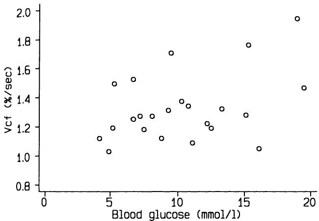  
图11.9 空腹血糖与左心室平均周向缩短速度（Vcf）之间的关系。数据来自23例1型糖尿病患者（Thuesen et al., 1985）。  
Figure 11.9 Relation between fasting blood glucose and mean velocity of circumferential shortening of the left ventricle (Vcf). Data from 23 type 1 diabetics (Thuesen et al., 1985).  

变量。我们可以将这些变量视为一个响应（或结果）变量（Vcf）和一个预测变量（血糖）。它们通常分别被称为因变量和自变量，这些名称容易混淆，但它们表示哪个变量依赖于另一个变量。响应变量总是绘制在垂直的Y轴上，预测变量绘制在水平的X轴上，如图11.9所示。  
variables. We may consider these as a response (or outcome) variable (Vcf) and a predictor variable (blood glucose). These are often called dependent and independent variables respectively, confusing names which indicate which variable is depending on the other. The response variable is always plotted on the vertical, or  $Y$ , axis and the predictor variable on the horizontal, or  $X$ , axis, as illustrated in Figure 11.9.  

问题在于如何拟合一条直线到数据，使得这条直线在某种意义上能“最佳”预测任意X值对应的Y值。直观上，这将是一条使数据点与拟合线之间距离最小的直线。解决这个问题有几种可能的方法，但标准方法称为最小二乘回归。当我们使用这种方法拟合回归线时，我们最小化观测值到线的垂直距离的平方和。图11.10显示了相同的数据以及最小二乘回归线，以及观测值到线的垂直距离。每个距离都是个体观测值与由拟合线给出的值（称为拟合值）之间的差值。这个距离的专业术语是残差，从现在起我将使用这个术语。请注意，这种方法得到的解不依赖于图的缩放比例。如果我们要取垂直于线的距离（这是另一种可能性），那么解将取决于图的绘制方式，这显然是一个不理想的特性。  
The problem is to fit a straight line to the data that in some sense gives the 'best' prediction of  $Y$  for any value of  $X$ . Intuitively this will be a line that minimizes the distance between the data and the fitted line. There are several possible approaches to this problem, but the standard method is called least squares regression. When we use this method to fit a regression line we minimize the sum of the squares of the vertical distances of the observations from the line. Figure 11.10 shows the same data with the least squares regression line, together with the vertical distances from the line. Each distance is the difference for an individual between the observed value and the value given by the line, known as the fitted value. The technical term for this distance is a residual, a term I shall use from now on. Notice that this approach gives a solution that does not depend on the scaling of the graph. If we were to take distances perpendicular to the line (which is an alternative possibility) the solution would depend on the way the graph was drawn, which is clearly an undesirable feature.  

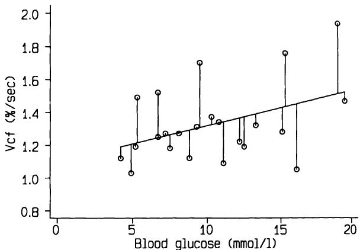  
图11.10 图11.9的数据，带有回归线，显示观测值与拟合值之间的差异。  
Figure 11.10 Data of Figure 11.9 with regression line, showing differences between observed and fitted values.  

最小二乘法产生的直线使残差平方和最小，因此它也使残差方差最小，残差方差就是残差平方和除以观测值数量减二。这个方差被称为残差方差，是衡量直线“拟合优度”的指标。残差方差在评估回归分析结果时非常重要。  
The least squares method produces the line that minimizes the sum of the squares of the residuals, and so it also minimizes the variance of the residuals, which is just the sum of squares divided by the number of observations minus two. This variance, known as the residual variance, is a measure of the 'goodness- of- fit' of the line. The residual variance is very important when assessing the results of a regression analysis.  

如果我们观测到两个变量的值，X（血糖）和Y（Vcf），我们可以进行“Y对X的回归”，以推导一条直线，该直线能为变量X的任何值提供Y的“拟合”估计值。回归线的通用方程是  
If we have observed values of two variables,  $X$  (blood glucose) and  $Y$  (Vcf), we can perform a 'regression of  $Y$  on  $X$ ' to derive a straight line that gives a 'fitted' estimated value of  $Y$  for any value of the variable  $X$ . The general equation of a regression line is  

$$
Y = a + b X.
$$  

这里，$b$是直线的斜率，$a$被称为截距，因为它是在直线与Y轴相交时（即$X = 0$时）Y的拟合值。在大多数医学应用中，$a$的值没有实际意义，因为X变量不可能接近零；例如血压和任何身体尺寸的测量值。  
Here  $b$  is the slope of the line and  $a$  is called the intercept because it is the fitted value of  $Y$  where the line crosses the  $Y$  axis, for which  $X = 0$ . In most medical applications the value of  $a$  will have no practical meaning, as the  $X$  variable cannot be anywhere near zero; examples are blood pressure and any measurements of body size.  

实践中，对于给定数据集，$a$ 和 $b$ 的计算很简单（参见第 11.13 节），尽管使用计算机进行计算无疑是更优的选择。对于糖尿病患者的数据，图 11.10 所示的回归线方程为  
In practice the calculation of  $a$  and  $b$  for a given set of data is easy (see section 11.13) although it is definitely preferable to use a computer to do the calculations. For the data on diabetics the equation of the regression line shown in Figure 11.10 is  

$$
\mathrm{Vcf} = 1.10 + 0.0220 \times \text{blood glucose}.
$$  

这个方程告诉我们什么？对于任何血糖值，从回归方程得出的 Vcf 估计值是 Vcf 的预测值，但我们需要某种衡量这种预测不确定性的方法。更根本地，我们通常会希望考虑这些受试者中两个变量之间观察到的关系是否仅仅是偶然发现的可能性，并考虑这条线与数据拟合得有多好。所有这些方面都可以结合前面介绍的残差进行研究。  
What does this equation tell us？ For any value of blood glucose the estimate of Vcf derived from the regression equation is the predicted value of Vcf, but we need some measure of the uncertainty of such a prediction. More basically, we would usually wish to consider the possibility that the observed relation between the two variables in these subjects is just a chance finding, and to consider how well the line fits the data. All of these aspects can be studied in relation to the residuals introduced earlier.  

### 11.10.1 假设  11.10.1 Assumptions  

在我们考虑使用回归分析之前，重要的是要考虑该方法所基于的三个假设：  
Before we can consider the use of a regression analysis it is important to consider three assumptions that underlie the method:  

1. 结果变量 $Y$（在本例中为 Vcf）的值对于预测变量 $X$ 的每个值都应服从正态分布；2. $Y$ 的变异性（通过方差或标准差评估）对于 $X$ 的每个值都应相同；3. 两个变量之间的关系应是线性的。  
1. the values of the outcome variable  $Y$  (Vcf in our example) should have a Normal distribution for each value of the predictor variable  $X$ ;2. the variability of  $Y$ , as assessed by the variance or standard deviation, should be the same for each value of  $X$ ;3. the relation between the two variables should be linear.  

与相关性不同，并非要求两个变量都必须是随机变量：如果预测变量 $(X)$ 的值是由实验者选择的，回归分析也是有效的，这种情况有时会发生。$X$ 的值也无需近似正态分布。  
Unlike for correlation, it is not a requirement that both variables should be random variables: regression analysis is valid if the values of the predictor  $(X)$  variable have been chosen by the experimenter, as is sometimes the case. Nor do the values of  $X$  need to be approximately Normal.  

我们通常可以从散点图上获得一个合理的视觉印象，判断数据是否与上述三个条件显著偏离。幸运的是，在拟合回归线之后，可以详细评估这些条件。同样，残差包含了相关信息。  
We can usually get a reasonable visual impression of whether the data deviate considerably from the three conditions listed above from a scatter diagram. Fortunately it is possible to assess them in detail after fitting the regression line. Again the residuals contain the relevant information.  

如果上述三个假设成立，那么残差应服从正态分布（均值为零）。如果我们将残差对 $X$ 值作图，则所有 $X$ 值上的点应均匀散布。我建议常规生成此图。图 11.11 展示了残差图的三种可能性：(a) 假设得到满足；(b) 随着 $X$ 增加，残差的变异性增加；(c) 残差与 $X$ 值之间存在弯曲关系。图 (b) 表明数据 $(Y)$ 可能需要进行对数变换，而图 (c) 则表明 $X$ 和 $Y$ 之间存在非线性关系（参见第 11.12.2 节）。可能会出现不同问题同时发生的情况，并且对 $Y$ 变量进行对数（或某种其他）变换将一次性解决所有问题。  
If the three above assumptions hold then the residuals should have a Normal distribution (with a mean of zero). If we plot the residuals against the  $X$  values the points should be evenly scattered at all  $X$  values. I recommend that this plot is produced routinely. Figure 11.11 shows three possibilities for a plot of the residuals where (a) the assumptions are met; (b) the residuals have increasing variability as  $X$  increases; (c) there is a curved relation between the residuals and the  $X$  values. Plot (b) suggests that the data  $(Y)$  might need log transformation, and plot (c) indicates a non- linear relation between  $X$  and  $Y$  (see section 11.12.2). It can happen that different problems occur simultaneously, and that log (or some other) transformation of the  $Y$  variable will solve all the problems at once.  

正态性假设可以通过残差的正态图进行正式评估（参见第 7.5.3 节）。一些计算机程序包含此分析。  
The assumption of Normality can be assessed formally by means of a Normal plot of the residuals (see section 7.5.3). Some computer programs incorporate this analysis.  

图11.12显示了残差与血糖的散点图，它看起来令人满意地类似于图11.11(a)。图11.13显示了残差的正态图，它相当直。然而，Shapiro-Francia  
Figure 11.12 shows the residuals plotted against blood glucose, which looks satisfactorily like Figure 11.11(a). Figure 11.13 shows a Normal plot of residuals, which is reasonably straight. However, the Shapiro- Francia  

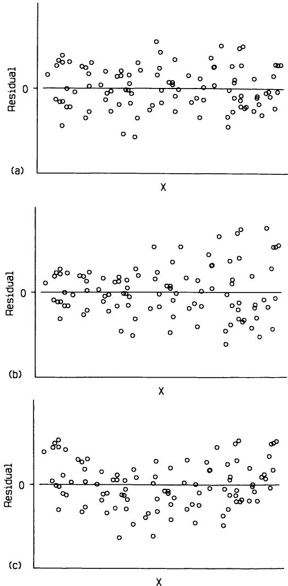  

  
图11.12 图11.10中回归线的残差，与血糖的散点图。  
Figure 11.12 Residuals from the regression line shown in Figure 11.10, plotted against blood glucose.  

  
图11.13 图11.12中残差的正态图。  
Figure 11.13 Normal plot of residuals shown in Figure 11.12.  

检验结果为 $W^{\prime} = 0.907$ $(\mathbf{P} = 0.03)$，表明存在一些非正态性。图11.13表明这不是一个大问题，但如果我们担心，可以尝试对Vcf进行对数变换。使用 $\log_{e}$ Vcf进行回归分析后，残差的 $W^{\prime}$ 值为 $W^{\prime} = 0.94$ $(\mathbf{P} = 0.12)$。  
test gives  $W^{\prime} = 0.907$ $(\mathbf{P} = 0.03)$  , indicating some non- Normality. Figure 11.13 suggests that this is not a major problem, but if we were worried we could try log transformation of Vcf. The value of  $W^{\prime}$  for the residuals after regression analysis using  $\log_{e}$  Vcf is  $W^{\prime} = 0.94$ $(\mathbf{P} = 0.12)$  .  

# 11.11 回归的应用  11.11 USE OF REGRESSION  

图11.10中所示的最小二乘回归线方程为  
The least squares regression line shown in Figure 11.10 has the equation  

$$
Y = 1.10 + 0.0220X。
$$  

从图11.10和图11.13来看，这项分析的假设似乎是合理的—回归线周围的散布相当均匀且对称，线性关系似乎合理，并且残差的分布与正态分布相差不远。  
From Figures 11.10 and 11.13 the assumptions of this analysis seem reasonable - the scatter around the regression line is fairly even and symmetric, a linear relation seems plausible, and the residuals have a distribution that is not too far from Normal.  

当假设成立时，回归线可以被认为是连接了每个 $X$ 值对应的 $Y$ 的平均值。因此，回归线给出了给定血糖水平下平均Vcf的估计值。拟合到样本数据的这条线是对总体中这些变量之间关系的估计，因此我们应该考虑这条估计线的不确定性。图11.14显示了回归线以及该线的 $95\%$ 置信区间。我们可以认为这个区间以 $95\%$ 的概率包含了真实关系。或者，对于任何血糖值，置信区间覆盖了我们有 $95\%$ 信心包含总体中真实平均Vcf的值范围。置信区间在平均血糖值 $(10.3\mathrm{mmol / l})$ 处最窄，并随着与平均值距离的增加而变宽。  
When the assumptions hold, the regression line can be thought of as joining the mean values of  $Y$  for each value of  $X$  . Hence the regression line gives an estimate of the average Vcf for a given blood glucose level. The line fitted to the sample data is an estimate of the relation between these variables in the population, so we should consider the uncertainty of this estimated line. Figure 11.14 shows the regression line together with the  $95\%$  confidence interval for the line. We can consider this interval as including the true relation with  $95\%$  probability. Alternatively, for any value of blood glucose the confidence interval covers the range of values which we are  $95\%$  confident includes the true mean Vcf in the population. The  confidence  interval  is  narrowest  at  the  mean  blood  glucose  $(10.3\mathrm{mmol / l})$  and gets wider with increasing distance from the mean.  

斜率是回归分析中主要关注的参数，因为它表示两个变量之间关系的强度。拟合线的斜率为0.022，这意味着我们估计空腹血糖每增加一个单位（即1 mmol/l），Vcf每秒增加 $0.022\%$。我们可以计算斜率的标准误，其值为0.0105。估计的斜率 $^b$ 的处理方式与样本均值大致相同。我们可以计算斜率的置信区间，并可以检验零斜率的假设，即Vcf与血糖之间没有关系。这些计算在第11.13节中描述，它们得出了斜率从0.000到0.044的 $95\%$ 置信区间；检验统计量为 $t = 2.10$， $\mathbf{P} = 0.05$。按照传统标准，斜率刚好显著不同于零。像往常一样，置信区间提供的信息更丰富，表明数据与Vcf和血糖之间没有关系或关系强度是观察到的两倍的情况兼容。  
The slope is the parameter of main interest in a regression analysis, as it indicates the strength of the relationship between the two variables. The slope of the fitted line is 0.022, which means that we estimate an increase in Vcf of  $0.022\%$  per second for every increase of one unit (i.e. 1 mmol/l) in fasting blood glucose. We can calculate the standard error of the slope, which is 0.0105. The estimated slope,  $^b$  , is treated in much the same way as the mean of a sample. We can calculate a confidence interval for the slope,  and  can  test  the  hypothesis  of  a  zero  slope,  that  is,  of  no relationship between Vcf and blood glucose. These calculations, which are described in section 11.13, yield a  $95\%$  confidence interval for the slope from  0.000  to  0.044;  the  test  statistic  is  $t = 2.10$  ,  with  $\mathbf{P} = 0.05$  .  By conventional criteria the slope is just significantly different from zero. As usual the confidence interval is more informative, showing that the data are compatible with no relation between Vcf and blood glucose or with one that is twice as strong as the observed one.  

这种分析中隐含着关系的一致性，这由观测数据围绕拟合线的散布情况所指示。点越接近该线，  
Implicit in this analysis is the consistency of the relationship, as indicated by the scatter of the observed data around the fitted line. The nearer the  

该线的置信区间就越窄（图11.14）。对于当前数据，散布程度相当大，如果我们考虑预测一个已知空腹血糖水平的新受试者的Vcf，这一点会更加明显。  
points are to the line the narrower will be the confidence interval for the line (Figure 11.14). With the present data there is considerable scatter, and this is more noticeable if we consider the prediction of Vcf for a new subject with a known fasting blood glucose level.  

图11.14显示了给定空腹血糖值下平均Vcf的 $95\%$ 置信区间。我们期望在尝试预测个体Vcf时存在更大的不确定性，图11.15显示 $95\%$ 预测区间确实宽得多。对于任何血糖值，我们期望未来 $95\%$ 的受试者的Vcf值落在所示值之间。因此，个体Vcf落在此区间内的概率为 $95\%$，尽管我们的最佳估计是由回归线上对应其血糖水平的值给出。 $95\%$ 预测区间也随与平均血糖水平的距离增加而变宽，尽管这一点不那么容易看出。显而易见的是，对于给定的血糖值，估计的Vcf存在巨大的不确定性。这种关系若要具有任何临床价值，需要一个更紧密的预测区间。请注意，与回归线的置信区间不同，预测区间只能通过增加样本量来略微缩小。这是因为预测区间主要反映个体围绕拟合线的变异性，这与样本量无关。当测量不精确时（例如血压），预测区间可以  
Figure 11.14 showed the  $95\%$  confidence interval for the mean Vcf for a given value of fasting blood glucose. We expect greater uncertainty when trying to predict Vcf for an individual, and Figure 11.15 shows that the  $95\%$  prediction interval is indeed much wider. For any value of blood glucose we would expect  $95\%$  of future subjects to have Vcf values between the values shown. There is thus a  $95\%$  probability of an individual's Vcf being within this interval, although our best estimate is given by the value on the regression line corresponding to their blood glucose level. The  $95\%$  prediction interval also widens with distance from the mean blood glucose level although this is not as easy to see. What is clear is that for a given blood glucose value there is enormous uncertainty attached to the estimated Vcf. A much tighter prediction interval is needed for such a relation to have any clinical value. Note that unlike the confidence interval for the regression line the prediction interval can be made only slightly narrower by increasing the sample size. This is because the prediction interval mainly reflects individual variability about the fitted line, which has nothing to do with sample size. Where the measurements are imprecise (such as blood pressure) the prediction interval can be  

  
图11.14 与图11.10相同，但显示了回归线的 $95\%$ 置信区间。  
Figure 11.14 As Figure 11.10, but showing the  $95\%$  confidence interval for the regression line.  

  
图11.15 与图11.10相同，但显示了预测个体受试者Vcf的 $95\%$ 区间。  
Figure 11.15 As Figure 11.10, but showing the  $95\%$  interval for predicting Vd from blood glucose for an individual subject.  

通过对每个个体的两次（或更多次）读数取平均值来缩小。  
narrowed by taking the average for each individual of two (or more) readings.  

拟合的回归线解释了因变量 $(Y)$ 变异性的一部分，而残差则表示未解释变异性的量。因此，回归分析可以以方差分析表的形式呈现，这与第9章中所示的表非常相似。表11.7显示了血糖对Vcf回归的方差分析表。该表的推导在第11.13.6节中解释。许多软件包都以这种方式呈现结果。这种显示回归分析结果的格式很容易扩展到复杂模型，如第12章所示。有两点需要注意。首先，由于这是显示相同分析的另一种方式，因此 $P$ 值与斜率获得的 $P$ 值相同。事实上， $F$ 统计量是早先获得的 $t$ 统计量的平方 $(4.41 = 2.10^{2})$。其次，残差均方（0.0470）是残差的方差，因此是残差标准差的平方。  
The fitted regression line explains a proportion of the variability in the dependent variable  $(Y)$ , and the residuals indicate the amount of unexplained variability. A regression analysis can thus be displayed as an analysis of variance table which is very similar to those shown in Chapter 9. Table 11.7 shows the analysis of variance table corresponding to the regression of blood glucose on Vcf. The derivation of this table is explained in section 11.13.6. Many software packages present the results in this way. This format for displaying the results of a regression analysis extends easily to complex models, as will be seen in Chapter 12. Two points should be noted. Firstly, as this is an alternative way of displaying the same analysis, the  $P$  value is the same as that obtained for the slope. In fact, the  $F$  statistic is the square of the  $t$  statistic obtained earlier  $(4.41 = 2.10^{2})$ . Secondly, the residual mean square (0.0470) is the variance of the residuals, and thus the square of the residual standard deviation.  

残差标准差表示回归线未解释的变异，因此它是以测量单位表示的线拟合优度的度量。评估拟合优度的一种更普遍的方法是考虑模型解释的总变异的比例。这通常通过将回归解释的平方和作为总平方和的百分比来完成。从表11.7可以看出，该值为 $0.2073 / 1.1934 = 0.17$ 或 $17\%$。此统计量称为 $R^{2}$，  
The residual standard deviation indicates the variation not explained by the regression line so it is a measure of the goodness- of- fit of the line in the units of measurement. A more general way of assessing goodness- of- fit is to consider the proportion of the total variation explained by the model. This is usually done by considering the sum of squares explained by the regression as a percentage of the total sum of squares. From Table 11.7 this value is  $0.2073 / 1.1934 = 0.17$  or  $17\%$ . This statistic is called  $R^{2}$ , and  

表11.7 血糖对Vcf回归的方差分析表  
Table 11.7 Analysis of variance table corresponding to regression of blood glucose on Vcf  

<table><tr><td>变异来源</td><td>自由度</td><td>平方和</td><td>均方</td><td>F</td><td>P</td></tr><tr><td>回归</td><td>1</td><td>0.2073</td><td>0.2073</td><td>4.41</td><td>0.048</td></tr><tr><td>残差</td><td>21</td><td>0.9861</td><td>0.0470</td><td></td><td></td></tr><tr><td>总计</td><td>22</td><td>1.1934</td><td></td><td></td><td></td></tr></table>  
<table><tr><td>Source of variation</td><td>Degrees of freedom</td><td>Sums of squares</td><td>Mean squares</td><td>F</td><td>P</td></tr><tr><td>Regression</td><td>1</td><td>0.2073</td><td>0.2073</td><td>4.41</td><td>0.048</td></tr><tr><td>Residual</td><td>21</td><td>0.9861</td><td>0.0470</td><td></td><td></td></tr><tr><td>Total</td><td>22</td><td>1.1934</td><td></td><td></td><td></td></tr></table>  

Vcf与血糖之间相关系数的平方。这个概念可以扩展到更复杂的模型，并将在下一章再次讨论。这里 $R^{2}$ 的低值表明，尽管斜率具有统计学意义，但Vcf的大部分变异不能用血糖水平的变异来解释。  
the square of the correlation coefficient between Vcf and blood glucose. The concept extends to more complex models, and will be discussed again in the next chapter. The low value of  $R^{2}$  here indicates that despite the statistically significant slope the majority of the variability in Vcf is not explained by variation in blood glucose levels.  

第11.13节给出了所有与回归相关的计算的数学公式。  
Section 11.13 gives the mathematical formulae for all the calculations relating to regression.  

## 11.12 扩展  11.12 EXTENSIONS  

前几节介绍了最简单的回归分析形式，即我们希望描述在单个样本中测量的两个连续变量之间的线性关系。各种扩展都是可能的，下面将介绍其中两种。它们都属于多重回归的类型，通过多重回归，我们可以同时考察一个结果变量对两个或更多其他变量的依赖性。多重回归将在第12章中更详细地讨论。  
The previous sections have presented the simplest form of regression analysis, where we wish to describe the linear relation between two continuous variables measured in a single sample. Various extensions are possible, two of which are described below. They are both types of multiple regression, whereby we can examine the dependence of one outcome variable on two or more other variables simultaneously. Multiple regression is discussed at more length in Chapter 12.  

### 11.12.1 比较组间差异  11.12.1 Comparing groups  

如果我们有来自两组受试者的数据，我们可以分别为每组拟合回归线，然后比较两条线的斜率，以判断它们是否合理相似。可以获得差异的置信区间，或者进行显著性检验。如果可以认为两条线具有相同的斜率，那么就可以拟合两条具有相同斜率（即平行）的数据线。此时，两条线之间的垂直距离就是两组中 $Y$ 变量均值之差，该差异已根据 $X$ 变量分布的任何差异进行了调整。这种分析被称为协方差分析。更多细节由Altman和Gardner（1989）给出。协方差分析（在第12.4.1节中也有讨论）可以扩展到两组以上的观测数据。  
If we have data from two groups of subjects we can fit regression lines to each, and then compare the slopes of the two lines to see if they are reasonably similar. A confidence interval can be obtained for the difference or a significance test can be carried out. If the two lines can be considered to have the same slope, then it is possible to fit lines to the two sets of data that have the same slope (i.e. they are parallel). The vertical distance between the two lines is then the difference in the means of the  $Y$  variable in the two groups adjusted for any difference in the distribution of the  $X$  variable. This analysis is known as analysis of covariance. Further details are given by Altman and Gardner (1989). Analysis of covariance, which is also discussed in section 12.4.1, can be extended to more than two groups of observations.  

### 11.12.2 非线性关系  11.12.2 Non-linear relationships  

有时从散点图可以清楚地看出两个变量之间的关系是曲线的。有几种统计模型可以用来处理非线性。最简单的方法，也是这里唯一考虑的方法，被称为多项式回归。  
Sometimes it can be clearly seen from a scatter plot that the relation between two variables is curved. There are several statistical models that can be used to cope with non- linearity. The simplest method, and the only one considered here, is known as polynomial regression.  

多项式回归是多重回归的一种特殊情况，当我们希望描述（或“建模”）一个结果变量与单个预测变量之间的非线性关系时使用。变量 $X$ 和 $Y$ 之间的线性关系会得到 $Y = a + b X$ 类型的回归方程。这个思想可以通过模型 $Y = a + b X + c X^{2}$ 扩展到非线性关系。这个模型被称为二次曲线，它认为结果变量 $(Y)$ 不仅依赖于预测变量 $(X)$，还依赖于它的平方 $(X^{2})$。通过这种方式，我们获得了 $Y$ 和 $X$ 之间的曲线关系，尽管（如上所述）这个模型是多重回归的一个特例，其中 $X$ 和 $X^{2}$ 都是预测变量。  
Polynomial regression is a special case of multiple regression when we wish to describe (or 'model') the non- linear relation between an outcome variable and a single predictor variable. A linear relation between variables  $X$  and  $Y$  leads to a regression equation of the type  $Y = a + b X$  . This idea can be extended to a non- linear relation by means of the model  $Y = a + b X + c X^{2}$  . This model, which is called a quadratic curve, consid- . ers the outcome variable  $(Y)$  to be dependent not just on the predictor variable  $(X)$  but also on its square  $(X^{2})$  . By this means we obtain a curved relation between  $Y$  and  $X$  , although (as explained above) this model is a special case of multiple regression, with both  $X$  and  $X^{2}$  as predictor variables.  

二次模型描述了一条简单的曲线，它以其最大值（或最小值）为中心对称地先上升后下降（或反之）。Altman和Coles（1980）将这种模型拟合到不同孕周的平均出生体重数据。例如，对于女性头胎婴儿，他们拟合的模型是  
The quadratic model describes a simple curve which rises and then falls (or vice versa) in a symmetric manner about its maximum (or minimum) value. Altman and Coles (1980) fitted such a model to data giving mean birthweight for different lengths of gestation. For example, for female first born babies their fitted model was  

出生体重 $(\mathbf{k}\mathbf{g}) = - 22.693 + 1.2122\times \mathbf{年龄} - 0.014102\times \mathbf{年龄}^{2}$ 其中“年龄”是胎龄（周）。这条曲线如图 11.16 所示。  
Birthweight  $(\mathbf{k}\mathbf{g}) = - 22.693 + 1.2122\times \mathbf{age} - 0.014102\times \mathbf{age}^{2}$  where 'age' is the gestational age in weeks. This curve is shown in Figure 11.16.  

## 11.13 回归—数学与实例  11.13 REGRESSION - MATHEMATICS AND WORKED EXAMPLE  

（本节提供了第 11.10 至 11.12 节所述计算的数学公式以及一个实例。可以省略本节，不影响内容的连贯性。这些公式使用起来可能很复杂，因此如果可能的话，最好使用计算机程序进行回归分析。）  
(This section gives the mathematical formulae for the calculations described in sections 11.10 to 11.12 together with a worked example. It can be omitted without loss of continuity. These formulae can be complicated to use, so it is preferable to perform regression analysis using a computer program if possible.)  

我们将使用表 11.6 中糖尿病患者的数据来说明回归分析。我们希望回归线能够根据血糖预测 Vcf（圆周缩短速度），因此 $X$（预测变量）是血糖，$Y$（结果变量）是 Vcf。  
Regression analysis will be illustrated using the data from diabetics shown in Table 11.6. We want the regression line to allow prediction of Vcf (velocity of circumferential shortening) from blood glucose, so the  $X$  (predictor) variable is blood glucose and the  $Y$  (outcome) variable is Vcf.  

### 11.13.1 回归线  11.13.1 The regression line  

最小二乘线性回归线的方程是 $Y = a + b X$，并且  
The equation of the least squares linear regression line is  $Y = a + b X$  and  

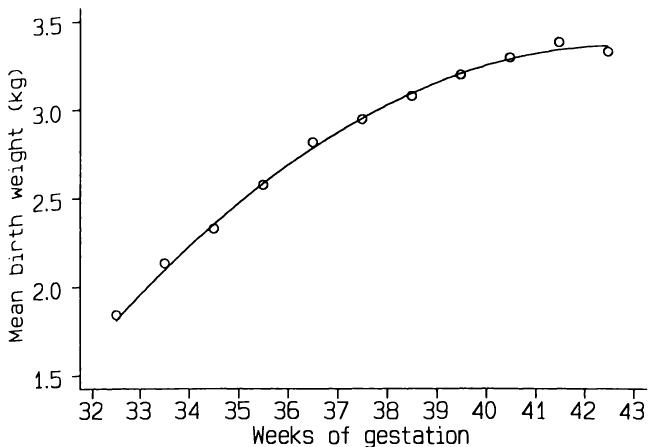  
图 11.16 按胎龄拟合平均出生体重的二次曲线（Altman 和 Coles，1980）。  
Figure 11.16 Quadratic curve fitted to mean birth weight by gestational age (Altman and Coles, 1980).  

可以很容易地获得 $a$ 和 $b$ 的估计值。将观测数据表示为 $x_{i}$ 和 $y_{i} (i = 1, \ldots , n)$，可以证明该线必须通过数据的均值 $(\bar{x}, \bar{y})$。估计的斜率由下式给出：  
estimates of  $a$  and  $b$  can be obtained easily. Denoting the observed data as  $x_{i}$  and  $y_{i} (i = 1, \ldots , n)$  it can be shown that the line must pass through the mean of the data  $(\bar{x}, \bar{y})$ . The estimated slope is given by  

$$
b = \frac{\Sigma(x_{i} - \bar{x})(y_{i} - \bar{y})}{\Sigma(x_{i} - \bar{x})^{2}}.
$$  

请注意，正如我们从分析的性质中应该预期的那样，该方程是不对称的，与第 11.7 节中给出的 $r$ 的方程不同：哪个变量是 $X$ 哪个变量是 $Y$ 确实很重要。  
Note that, as we should expect from the nature of the analysis, the equation is asymmetric in contrast to that for  $r$  given in section 11.7: it does matter which variable is  $X$  and which is  $Y$ .  

如果我们首先计算 $X$ 和 $Y$ 值相对于其均值的“平方和”以及“乘积和”，则计算可以简化：  
The calculations can be simplified if we first obtain the 'sum of squares' of the  $X$  and  $Y$  values about their means, and the 'sum of products':  

$$
\begin{array}{l}{{S_{x x}=\sum x_{i}^{2}-(\sum x_{i})^{2}/n}}\\ {{S_{y y}=\sum y_{i}^{2}-(\sum y_{i})^{2}/n}}\\ {{S_{x y}=\sum x_{i}y_{i}-\sum x_{i}\sum y_{i}/n.}}\end{array}
$$  

量 $S_{xx}$ 和 $S_{yy}$ 恰好是 $X$ 和 $Y$ 方差的 $n - 1$ 倍。计算 $b$ 的一个更简单的方法是  
The quantities  $S_{xx}$  and  $S_{yy}$  are just  $n - 1$  times the variances of  $X$  and  $Y$ . An easier way of calculating  $b$  is as  

$$
b = \frac{S_{xy}}{S_{xx}}.
$$  

然而，此公式不应在计算机程序中使用，因为舍入误差偶尔会导致不准确。为此目的，只能使用上面给出的第一个 $b$ 的方程。  
This formula should not be used in a computer program, however, as inaccuracy is occasionally introduced because of rounding errors. Only the first equation given above for  $b$  should be used for this purpose.  

因为我们知道回归线通过均值 $(\bar{x}, \bar{y})$，所以我们可以简单地估计 $a$ 为  
Because we know that the regression line passes through the mean  $(\bar{x}, \bar{y})$ , we can estimate  $a$  simply as  

$$
a = \bar{y} - b\bar{x}.
$$  

因此，对于 $X$ 的任何值，例如 $x_0$，由方程预测的 $Y$ 的拟合值为  
So for any value of  $X$ , say  $x_0$ , the fitted value of  $Y$  predicted by the equation is  

$$
\begin{array}{l}{{y_{\hat{H} t}=a+b x_{0}}}\\ {{\mathrm{~}=(\bar{y}-b\bar{x})+b x_{0}}}\\ {{\mathrm{~}=\bar{y}+b(x_{0}-\bar{x}).}}\end{array}
$$  

请注意，下面引用的所有结果都是使用完整的数值精度获得的，但中间计算已进行四舍五入以使呈现更清晰。  
Note that all the results quoted below were obtained using full numeric accuracy, but intermediate calculations have been rounded to clarify the presentation.  

对于糖尿病患者的数据，两个变量的均值分别为 $\bar{x} = 10.37 \mathrm{mmol / l}$ 和 $\bar{y} = 1.33\% /\mathrm{sec}$，我们需要的其他量为  
For the data on diabetics the mean values of the two variables are  $\bar{x} = 10.37 \mathrm{mmol / l}$  and  $\bar{y} = 1.33\% /\mathrm{sec}$ , and the other quantities we will need are  

$$
\sum x = 238.60, \sum y = 30.49, \sum x^2 = 2904.92, \sum y^2 = 41.6125
$$  

$$
\textstyle \mathrm{and}\sum x y = 325.74,
$$  

$$
S_{xx} = 2904.92 - 238.60^2 / 23 = 429.704,
$$  

$$
S_{yy} = 41.61 - 30.49^2 / 23 = 1.193,
$$  

$$
S_{xy} = 325.74 - 238.60 \times 30.49 / 23 = 9.439.
$$  

我们将斜率 $b$ 估计为  
We estimate the slope  $b$  as  

$$
\begin{array}{c}b = \frac{9.439}{429.704} \\ = 0.02196. \end{array}
$$  

截距 $a$ 估计为  
The intercept  $a$  is estimated as  

$$
\begin{array}{c}a = 1.33 - 0.02196 \times 10.37 \\ = 1.098\% /\mathrm{sec}. \end{array}
$$  

### 11.13.2 残差变异  11.13.2 Residual variation  

观测值 $y_0$ 与拟合值 $y_{\hat{H}}$ 之间的差值因此为  
The difference between an observed value  $y_0$  and fitted value  $y_{\hat{H}}$  is thus  

$$
y_{0} - y_{\hbar t} = y_{0} - [\bar{y} +b(x_{0} - \bar{x})], \tag{y0 - yfit = y0 - [y + b(x0 - x)]},
$$  

而值 $y_{0} - y_{\hbar t}$ 就是该个体的残差。最小二乘法直线使残差平方和 $\Sigma (y_{i} - y_{\hbar t})^{2}$ 最小化，但我们更关注它们的方差，其计算方法如下：  
and the value  $y_{0} - y_{\hbar t}$  is the residual for that individual. It is the sum of the squares of the residuals,  $\Sigma (y_{i} - y_{\hbar t})^{2}$ , that is minimized by the least squares line, but we are more interested in their variance, obtained as  

$$
s_{res}^{2} = \frac{\Sigma(y_{i} - y_{\hbar t})^{2}}{n - 2}
$$  

或者，对于计算而言：  
or, for calculation,  

$$
\begin{array}{l}{{s_{r e s}^{2}=\frac{1}{n-2}\biggl[\Sigma y_{i}^{2}-\frac{(\Sigma y_{i})^{2}}{n}-b\biggl(\Sigma x_{i}y_{i}-\frac{\Sigma x_{i}\Sigma y_{i}}{n}\biggr)\biggr]}}\\ {{=\frac{1}{n-2}(S_{y y}-b S_{x y}).}}\end{array}
$$  

该表达式的平方根，即残差标准差 $s_{\mathrm{res}}$，用于后续计算。  
The square root of this expression, the residual standard deviation,  $s_{\mathrm{res}}$ , is used in subsequent calculations.  

在示例中，我们可以计算残差方差如下：  
We can calculate the residual variance in the example as  

$$
\begin{array}{c}{{s_{r e s}^{2}=\frac{1}{21}(1.193-0.02196\times9.439)}}\\ {{{}}}\\ {{=0.04696}}\end{array}
$$  

因此残差标准差为  
so that the residual standard deviation is  

$$
\begin{array}{c}{{s_{r e s}=\sqrt{0.04696}}}\\ {{=0.2167.}}\end{array}
$$  

### 11.13.3 置信区间  11.13.3 Confidence intervals  

#### (a) 斜率  (a) Slope  

斜率 $b$ 的标准误与残差标准差密切相关，即  
The standard error of the slope,  $b$ , is strongly related to the residual standard deviation, being  

$$
se(b) = \frac{s_{res}}{\sqrt{S_{xx}}}
$$  

因此 $b$ 的 $95\%$ 置信区间为  
so that a  $95\%$  confidence interval for  $b$  is  

$$
b\pm t_{0.975}s e(b)
$$  

其中 $t$ 的自由度为 $n - 2$（与残差相关的自由度）。  
where  $t$  is on  $n - 2$  degrees of freedom (the degrees of freedom associated with the residual).  

斜率通常是人们最感兴趣的方面。$b$ 的标准误为  
The slope is usually the aspect of most interest. The standard error of  $b$  is  

$$
\begin{array}{c}{{s e(b)=\frac{0.2167}{\sqrt{429.704}}}}\\ {{=0.0105.}}\end{array}
$$  

根据表B4，$t_{0.975}$ 在21个自由度下的值为2.08，因此，$95\%$ 置信区间为  
From Table B4 the value of  $t_{0.975}$  on 21 degrees of freedom is 2.08, so a  $95\%$  confidence interval is given by  

$$
0.02196\pm 2.08\times 0.0105
$$  

即0.00012到0.044。因此，该置信区间从零开始延伸（零表示变量之间没有关系），直至样本中观测值的两倍。  
that is, 0.00012 to 0.044. The confidence interval thus extends from zero, representing no relation between the variables, to twice the value observed in the sample.  

#### (b) 给定 $X$ 时的 $Y$ 估计值  (b) Estimated Y for a given  $X$  

对于给定的 $X$ 值，例如 $x_{0}$，估计值 $y_{\hbar t}$ 的标准误由下式给出：  
The standard error of the estimate  $y_{\hbar t}$  for a given value of  $X$  , say  $x_{0}$  ,is given by  

$$
s e(y_{f i t}) = s_{r e s}\sqrt{\frac{1}{n} + \frac{(x_{0} - \bar{x})^{2}}{S_{x x}}}
$$  

并且 $95\%$ 置信区间由下式给出：  
and a  $95\%$  confidence interval is given by  

$$
y_{f i t}\pm t_{0.975}s e(y_{f i t})
$$  

其中 $t$ 的自由度为 $n - 2$。  
where  $t$  is on  $n - 2$  degrees of freedom.  

我们可以得到任何血糖值下 Vcf 预测平均值的 $95\%$ 置信区间。如果 $y_{f i t}$ 是回归方程预测的 Vcf 平均值，那么 $y_{f i t}$ 的标准误是  
We can obtain a  $95\%$  confidence interval for the predicted mean value of Vcf for any blood glucose. If  $y_{f i t}$  is the predicted mean Vcf from the regression equation, then the standard error of  $y_{f i t}$  is  

$$
s e(y_{f i t}) = 0.2167\sqrt{\frac{1}{23} + \frac{(x_{0} - 10.37)^{2}}{429.704}}
$$  

其中 $x_{0}$ 是血糖值。因此，当血糖值为 $14.5\mathrm{mmol / l}$ 时，估计的 Vcf 平均值由回归方程给出，为  
where  $x_{0}$  is the blood glucose value. So for a blood glucose of  $14.5\mathrm{mmol / l}$  the estimated mean Vcf is given by the regression equation as  

$$
1.098 + 0.02196 × 14.5 = 1.416%/sec.
$$  

该估计值的标准误因此是  
The standard error of this estimate is thus  

$$
s e(y_{f i t}) = 0.2167\sqrt{\frac{1}{23} + \frac{(14.5 - 10.37)^{2}}{429.704}}
$$  

我们使用上述方程来获得 1.419 估计值的置信区间。根据表 B4，自由度为 21 的 $t_{0.975}$ 值为 2.080，因此 $95\%$ 置信区间为  
We use the equation above to get a confidence interval for the estimate of 1.419. From Table B4 the value of  $t_{0.975}$  with 21 degrees of freedom is 2.080, so that the  $95\%$  confidence interval is given by  

$$
1.416\pm 2.080\times 0.0625
$$  

或 1.29 到 $1.55\%$ /秒。  
or 1.29 to  $1.55\%$  /sec.  

#### (c) 截距  (c) Intercept  

截距通常不那么重要，但可以使用上一节中的公式为截距 $a$ 获得一个置信区间，该公式用于获得当 $X = 0$ 时 $y_{fit}$ 的置信区间。  
The intercept is not usually of great interest, but a confidence interval can be obtained for the intercept  $a$  using the formula in the previous section to get a confidence interval for  $y_{fit}$  when  $X = 0$ .  

### 11.13.4 预测区间  11.13.4 Prediction interval  

$95\%$ 预测区间比直线的 $95\%$ 置信区间宽得多，因为个体数据围绕拟合直线的散布变得更直接相关。  
The  $95\%$  prediction interval is much wider than the  $95\%$  confidence interval for the line as the scatter of the individual data about the fitted line becomes more directly relevant.  

对于任何值 $x_{0}$，预测值为 $y_{fit} = a + bx_{0}$。为了获得预测区间，我们不想要 $y_{fit}$ 的标准误，而是想要在 $X$ 的该值处 $Y - y_{fit}$ 的个体值的估计标准差。该标准差由以下公式给出：  
For any value  $x_{0}$  the predicted value is  $y_{fit} = a + bx_{0}$ . To get the prediction interval we do not want the standard error of  $y_{fit}$ , but the estimated standard deviation of individual values of  $Y - y_{fit}$  at that value of  $X$ . This standard deviation is given by  

$$
s_{pred} = s_{res}\sqrt{1 + \frac{1}{n} + \frac{(x_{0} - \bar{x})^{2}}{S_{xx}}}
$$  

因此，$95\%$ 预测区间为  
and thus the  $95\%$  prediction interval is  

$$
y_{fit}\pm t_{0.975}s_{pred}
$$  

其中 $t$ 的自由度为 $n - 2$。  
where  $t$  is on  $n - 2$  degrees of freedom.  

血糖值为 $14.5 \mathrm{mmol / l}$ 的个体的 Vcf 值的估计标准差为  
The estimated standard deviation of Vcf values for individuals with a blood glucose of  $14.5 \mathrm{mmol / l}$  is  

$$
\begin{array}{l}{{s_{p r e d}=0.2167\sqrt{1+\frac{1}{23}+\frac{(14.5-10.37)^{2}}{429.704}}}}\\ {{=0.225\%/\mathrm{sec}.}}\end{array}
$$  

因此，$95\%$ 预测区间为  
The  $95\%$  prediction interval is therefore  

$$
1.416\pm 2.080\times 0.225
$$  

或 $0.95$ 至 $1.89\% /\mathrm{sec}$，这比均值的置信区间宽得多，通过比较图 11.14 和 11.15 可以看出。  
or  $0.95$  to  $1.89\% /\mathrm{sec}$ , which is considerably wider than the confidence interval for the mean, as can be seen by comparing Figures 11.14 and 11.15.  

### 11.13.5 $b$ 的假设检验  11.13.5 Hypothesis test for  $b$  

我们已经看到，估计斜率 $b$ 的标准误是 $se(b) = s_{res} / \sqrt{S_{xx}}$，因此我们可以通过计算 $b / se(b)$ 来执行 $b = 0$ 的假设检验。这个比率与具有 $n - 2$ 自由度的 $t$ 分布进行比较。  
We have seen that the standard error of the estimated slope,  $b$ , is  $se(b) = s_{res} / \sqrt{S_{xx}}$ , so we can perform a test of the hypothesis that  $b = 0$  by calculating  $b / se(b)$ . This ratio is compared with the  $t$  distribution with  $n - 2$  degrees of freedom.  

因此，我们可以检验 Vcf 与  
We can thus test the null hypothesis of no relation between Vcf and  

血糖之间无关系的零假设。我们只需将 $b$ 的估计值除以其标准误，然后将结果与 $t$ 分布的相应值进行比较。因此我们有  
blood glucose. We simply divide the estimate of  $b$  by its standard error and compare the result with the appropriate value of the  $t$  distribution. So we have  

$$
t = b / s e(b) = 0.02196 / 0.0105 = 2.10.
$$  

将此值与具有 21 自由度的 $t$ 分布进行比较，$t_{0.975}$ 的值为 2.08。因此，该斜率在 $5\%$ 水平上刚好显著不为零。  
This value is compared with the  $t$  distribution with 21 degrees of freedom, the value of  $t_{0.975}$  being 2.08. The slope is thus just significantly different from zero at the  $5\%$  level.  

### 11.13.6 方差分析表  11.13.6 Analysis of variance table  

回归分析的结果可以通过方差分析表来展示，即将因变量的总变异性分解为由回归线解释的部分和未解释的或残差变异。  
The results of a regression analysis can be displayed in an analysis of variance table, by partitioning the total variability in the dependent variable into a component explained by the regression line and unexplained or residual variation.  

因变量 $Y$ 的总平方和是 $S_{yy}$（自由度为 $n - 1$），回归引起的平方和是 $(S_{xy})^{2} / S_{xx}$（自由度为 1）。残差平方和（自由度为 $n - 2$）可以通过相减得到。  
The total sum of squares of the dependent variable  $Y$  is  $S_{yy}$  (with  $n - 1$  degrees of freedom) and the sum of squares due to the regression is  $(S_{xy})^{2} / S_{xx}$  with 1 degree of freedom. The residual sum of squares (with  $n - 2$  degrees of freedom) can be obtained by subtraction.  

对于血糖数据，总平方和是 1.1934，回归引起的平方和是 $9.439^{2} / 429.704 = 0.2073$。这些结果显示在表 11.7 中。  
For the blood glucose data the total sum of squares is 1.1934 and the sum of squares due to regression is  $9.439^{2} / 429.704 = 0.2073$ . These results are shown in Table 11.7.  

## 11.14 回归的解释  11.14 INTERPRETATION OF REGRESSION  

正如第 8 章所讨论的，一组观测值之间的变异性可能部分归因于已知因素，部分归因于未知来源；后者通常被称为“随机变异”。在线性回归中，我们看到响应变量的变异性有多少可以归因于预测变量的不同值，而拟合线两侧的散布则显示了未解释的变异性。由于这种变异性，拟合线仅仅是总体中这些变量之间关系的估计。与其他估计（如样本均值）一样，估计的斜率 $b$ 和截距 $a$ 将存在不确定性。斜率 $b$ 的置信区间将指示估计关系强度的不确定性，而整条线的置信区间和个体受试者的预测区间则显示了变异性的其他方面。后者特别有用，因为回归常用于对个体进行预测。  
As discussed in Chapter 8, the variability among a set of observations may be partly attributed to known factors and partly to unknown sources; the latter is often termed 'random variation'. In linear regression we see how much of the variability in the response variable can be attributed to different values of the predictor variable, and the scatter either side of the fitted line shows unexplained variability. Because of this variability, the fitted line is only an estimate of the relation between these variables in the population. As with other estimates (such as a sample mean) there will be uncertainty associated with the estimated slope and intercept,  $b$  and  $a$ . The confidence interval for the slope  $b$  will indicate the uncertainty in the estimated strength of the relationship, and confidence intervals for the whole line and prediction intervals for individual subjects show other aspects of variability. The latter are especially useful as regression is often used to make predictions about individuals.  

应该记住，回归线不应用于对超出观测数据  
It should be remembered that the regression line should not be used to make predictions for  $X$  values outside the range of values in the observed  

值范围的 $X$ 值进行预测。这种外推是没有根据的，因为我们没有超出观测数据范围的关系证据。统计模型只是一种近似。例如，人们很少相信真实关系是完全线性的，但线性回归方程被认为是观测数据的合理近似。在观测数据范围之外，不能安全地使用相同的方程。因此，我们不应使用图 11.14 中所示的回归线来预测血糖值超出 4 到 $20 \mathrm{mmol / l}$ 范围的 Vcf。  
data. Such extrapolation is unjustified as we have no evidence about the relationship beyond the observed data. A statistical model is only an approximation. One rarely believes, for example, that the true relationship is exactly linear, but the linear regression equation is taken as a reasonable approximation for the observed data. Outside the range of the observed data one cannot safely use the same equation. Thus we should not use the regression line shown in Figure 11.14 to predict Vcf for blood glucose values outside the range 4 to  $20 \mathrm{mmol / l}$ .  

外推危险的一个例子是根据 1954 年至 1984 年世界一英里跑纪录时间拟合的二次回归模型。Kitson (1984) 建立了以下模型：  
An example of the danger of extrapolation is seen from a quadratic regression model fitted to the world record times to run a mile from 1954 to 1984. Kitson (1984) produced the model  

$$
\mathrm{time} = 4.777 - 0.02039 \mathrm{Year} + 0.0001040 \mathrm{Year}^2
$$  

其中“Year”是公历年份减去 1900。他观察到，“终极一英里”将在 1998 年跑出 3 分 46.66 秒的成绩，并且根据这个模型，“我们可能已经距离终极一英里不到一秒”。然而，他未能注意到，1998 年之后，他的模型表明世界纪录时间将再次开始增加（参见图 11.17），这显然是不可能的！  
where 'Year' is the calendar year - 1900. He observed that the 'ultimate mile' will be run in 1998 in a time of 3 min 46.66 sec, and that on the basis of this model 'we may already be within one second of the ultimate mile'. He failed to observe, however, that after 1998 his model indicates that the world record time will start to increase again (see Figure 11.17), which is clearly impossible!  

回归线也不应用于从 $Y$ 变量预测 $X$ 变量。如果我们希望从 Vcf 预测血糖水平（这可能不太合理），我们应该首先计算血糖对 Vcf 的回归。  
Nor should the regression line be used to predict the  $X$  variable from the  $Y$  variable. If we wish to predict blood glucose level from Vcf (which is probably not very sensible) we ought first to calculate the regression of  

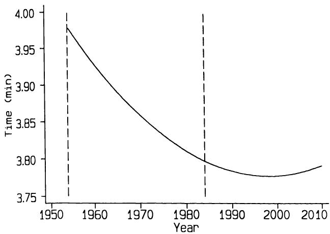  
图 11.17 拟合世界一英里赛跑纪录时间（Kitson, 1984）的二次曲线，显示观测范围（1954 至 1984 年）。  
Figure 11.17 Quadratic curve fitted to world record times to run a mile (Kitson, 1984), showing the range of observations (1954 to 1984).  

回归不是两个变量之间的对称关系，因此我们需要根据我们的目的选择合适的回归线。  
blood glucose on Vcf. Regression is not a symmetric relation between two variables, so we need the appropriate regression line for our purpose.  

关于相关系数解释的许多注意事项并不适用于回归分析。但有一点适用，那就是将来自不同组的数据作为单个样本进行分析。如果我们将来自两组的数据合并，而这两组在任一或两个变量的值分布上存在显著差异，回归线的斜率可能会受到很大影响。一个例子是男性和女性血压对年龄的回归。此类数据应分别对不同组进行分析，或使用协方差分析。另一个相关的限制是观测值应独立；实际上，这意味着每个个体只应有一个观测值。  
Few of the cautions that were made about the interpretation of the correlation coefficient apply to regression analysis. One that does is that relating to the analysis of data from different groups as if they were a single sample. The slope of the regression line may be considerably affected if we pool data from two groups where there is a marked difference in the distribution of the values of either or both variables. An example would be the regression of blood pressure on age for males and females. Such data should either be analysed separately for the different groups or analysis of covariance should be used. Another restriction that is relevant is that the observations should be independent; in practice this means that there should be only one observation per individual.  

当预测变量的值由实验者选择时，回归分析是有效的，这在实验室实验中很常见。此外，正如我之前指出的，对 $X$ 变量没有正态分布的要求。然而，如果存在一个 $X$ 值远离数据主体，该观测值可能对回归线的位置产生过度的影响，特别是当 $Y$ 变量的值也很极端时。图 7.2 中给出了一个例子。  
Regression analysis is valid when values of the predictor variable have been selected by the experimenter, as is common in laboratory experiments. Also, as I have already noted, there is no requirement for the  $X$  variable to have a Normal distribution. However, if there is a value of  $X$  that is distant from the main body of the data, that observation may exert an undue influence on the position of the regression line especially if the value of the  $Y$  variable is also extreme. An example was given in Figure 7.2.  

如果数据的分布或残差的分布导致对使用所描述的回归方法产生疑虑，则存在一种非参数形式的回归（参见 Sprent, 1989）。与非参数相关性相比，非参数回归很少进行。  
If the distribution of the data or of the residuals leads to concern about the wisdom of using the regression methods described there is a non- parametric form of regression (see Sprent, 1989). Non- parametric regression is very rarely performed, in contrast to non- parametric correlation.  

## 11.15 与其他分析的关系  11.15 RELATION TO OTHER ANALYSES  

（本节可省略，不影响连贯性。）  
(This section can be omitted without loss of continuity.)  

前面章节讨论的两种分析说明了回归的专门用途，尽管它们并未作为回归分析呈现。这些是单向方差分析中的线性趋势检验（第 9.8.5 节）和比例趋势的卡方检验（第 10.8.2 节）。下面将简要重新审视它们。  
Two analyses discussed in earlier chapters illustrate specialized uses of regression, although they were not presented as regression analyses. These are the test for linear trend in a one way analysis of variance (section 9.8.5) and the Chi squared test for trend among proportions (section 10.8.2). They are reconsidered briefly below.  

### 11.15.1 单向方差分析中的趋势  11.15.1 Trend in one way analysis of variance  

单向方差分析中三个或更多组间的趋势检验已在第9.8.5节和第9.9.2节中描述。各组被赋予分数 $l_{i}$，组间平方和被分解为线性和非线性分量。线性趋势检验几乎等同于将结局变量对分数进行回归。它并非  
The test for trend across three or more groups in a one way analysis of variance was described in sections 9.8.5 and 9.9.2. Scores  $l_{i}$  were given to the groups and the between group sum of squares was partitioned into linear and non- linear components. The test for linear trend is almost equivalent to a regression of the outcome variable on the scores. It is not  

完全相同，因为方差分析还使用一个自由度来检验组间的非线性变异，但本质上该方法是一种线性回归分析。回归线的斜率等于 $L / \Sigma l_{i}^{2}$，对应于响应变量随分数每单位变化的改变量。这个统计量比统计量 $L$ 更有用，因为 $L$ 取决于分数的值。  
exactly the same because the analysis of variance also uses one degree of freedom to test for non- linear variation among the groups, but in essence the method is a linear regression analysis. The slope of the regression line is equal to  $L / \Sigma l_{i}^{2}$ , and corresponds to the change in the response variable per unit change in score. This statistic is more useful than the statistic  $L$ , which depends upon the values of the scores.  

当只有两组，分数分别为 $- 1$ 和 1 时，对组分数进行回归与两样本 $t$ 检验完全等价。回归线的斜率是组均值差的一半。  
When there are only two groups with scores  $- 1$  and 1, regression on the group scores is exactly equivalent to the two- sample  $t$  test. The slope of the regression line is half the difference between the group means.  

### 11.15.2 $2 \times k$ 频数表中的趋势  11.15.2 Trend in a  $2 \times k$  frequency table  

卡方趋势检验用于评估 $2 \times k$ 频数表中比例的趋势（参见第10.8.2节）。该方法与将行变量（例如，编码为0和1）对列分数进行回归完全等价。对于表10.19中的剖宫产数据，如果我们给六个鞋码组赋予1到6的分数，将这351个观测值的行变量（编码为0和1）对这些分数进行回归，得到的斜率为 $- 0.0302$ （标准误0.0106），从而得到 $t = - 2.86$ （ $\mathbf{P} = 0.0045$ ）。因此， $\mathbf{P}$ 值与第10.8.2节中所示的卡方趋势检验的结果相同。然而，回归方法提供了更多信息，因为它能估算出从一个组到下一个组比例的变化。在这里，估计值为 $- 0.03$ （即每增加 $\frac{1}{2}$ 鞋码，比例减少 $3\%$ ）。我们可以用标准误以常规方式获得置信区间。  
The Chi squared test for trend is used to assess a trend in proportions in a  $2 \times k$  frequency table (see section 10.8.2). The method is exactly equivalent to regressing the row variable, coded 0 and 1 say, on the column scores. For the Caesarean section data in Table 10.19, if we give scores 1 to 6 to the six shoe size groups, regression of these scores on the row variable (coded 0 and 1) for the 351 observations gives a slope of  $- 0.0302$  (SE 0.0106), giving  $t = - 2.86$  ( $\mathbf{P} = 0.0045$ ). The  $\mathbf{P}$  value is thus the same as for the Chi squared test for trend shown in section 10.8.2. However, the regression approach is more informative as it yields an estimate of the change in proportion from one group to the next. Here the estimate is  $- 0.03$  (i.e. a reduction of  $3\%$ ) per increment of  $\frac{1}{2}$  in shoe size. We can use the standard error to obtain a confidence interval in the usual way.  

## 11.16 回归结果的呈现  11.16 PRESENTATION OF REGRESSION  

应给出回归方程，以及残差标准差。在可能的情况下，应在图中显示回归线以及原始数据的散点图。该线不应超出预测变量 $(X)$ 的观测值范围。仅绘制回归线图所提供的信息不比回归方程多。  
The equation of the regression line should be given, together with the residual standard deviation. Wherever possible the regression line should be shown in a plot together with a scatter diagram of the raw data. The line should not extend beyond the range of the observed values of the predictor variable  $(X)$ . A plot of the regression line alone gives no more information than the equation of the line.  

斜率的标准误很有用， $t$ 检验的 $\mathbf{P}$ 值也同样有用。回归线的置信区间，或者更有用的是新观测值的预测区间，特别能提供信息，并且可以在同一图中显示。  
The standard error of the slope is useful, as is the  $\mathbf{P}$  value for the  $t$  test. A confidence interval for the line or, more usefully, prediction intervals for new observations are especially informative and can be shown in the same plot.  

系数所用的精度应与原始数据的精度相关。例如，给出一个声称能将出生体重预测到最近 $\frac{1}{100000} \mathbf{g}$ 的方程是没有意义的，以下关于出生体重 $(y)$ 对胎儿腹围 $(x)$ 的二次回归方程就暗示了这一点：  
The accuracy used for the coefficients should be related to the accuracy of the raw data. It makes no sense, for example, to give an equation that purports to predict birth weight to the nearest  $\frac{1}{100000} \mathbf{g}$ , which is what is implied by the following quadratic regression equation of birth weight  $(y)$  on fetal abdominal area  $(x)$ :  

$$
y = 3518.42829 - 0.26395x + 0.000024x^{2}
$$  

(Campogrande 等人，1977)。$a$ 的估计值通常会大于 $b$ 的估计值，但 $a$ 和 $b$ 却经常被报告到相同的小数位数。然而，在进行预测时，斜率 $b$ 需要更高的精度，而不是更低，因此它应该至少与 $a$ 一样精确，甚至更精确。这里的精度指的是“有效数字”的数量（即忽略开头的零）。因此，在前面给出的方程 $\mathrm{Vcf} = 1.10 + 0.0220$ 血糖中，截距和斜率都给出了三位有效数字。将其与上面给出的二次方程进行对比。  
(Campogrande et al., 1977). It is common for the estimate of  $a$  to be larger than that of  $b$ , but  $a$  and  $b$  are frequently reported to the same number of decimal places. However, it is the slope,  $b$ , that is needed with more precision, not less, when making predictions, so it should be given at least as precisely as  $a$ , if not more so. Precision here refers to the number of 'significant digits' (i.e. ignoring zeros at the beginning). Thus, in the equation given earlier,  $\mathrm{Vcf} = 1.10 + 0.0220$  blood glucose, the intercept and slope are both given to three significant digits. Contrast this with the quadratic equation given above.  

大多数用于回归分析的计算机程序都会提供执行本章中所有计算所需的信息。虽然没有多少程序会实际计算和绘制置信区间和预测区间，但它们应该提供残差标准差（可能以不同的名称），以便计算这些区间。  
Most computer programs for regression analysis give the information necessary to perform all the calculations described in this chapter. Not many will actually calculate and plot confidence intervals and prediction intervals, but they should give the residual standard deviation (perhaps under a different name) to allow these intervals to be calculated.  

在计算机程序的输出中，量 $s_{res} / \sqrt{n}$ 有时被称为“估计的标准误差”（SEE）。这不是一个好名称，因为它错误地暗示它是从回归线估计的任何值 $y_{fi}$ 的标准误差。事实上，$s_{res} / \sqrt{n}$ 只是在 $X$ 的平均值处，即当 $X = \overline{x}$ 时，$y_{fi}$ 的标准误差（参见第 11.13.3 节）。正如我们所看到的，当我们偏离平均值时，不确定性会增加。这种错误有时在已发表的论文中出现，其中置信限显示为平行于回归线。更糟糕的是，一些程序将残差标准差 $(s_{res})$ 称为“估计的标准误差”，这极具误导性。  
In output from computer programs the quantity  $s_{res} / \sqrt{n}$  is sometimes called the 'standard error of the estimate' (SEE). This is not a good name as it wrongly implies that it is the standard error of any value  $y_{fi}$  estimated from the regression line. In fact  $s_{res} / \sqrt{n}$  is the standard error of  $y_{fi}$  only at the mean value of  $X$ , i.e. when  $X = \overline{x}$  (see section 11.13.3). As we have seen, uncertainty increases as we move away from the mean. This mistake is sometimes seen in published papers where confidence limits are shown parallel to the regression line. Worse, some programs call the residual standard deviation  $(s_{res})$  the 'standard error of the estimate', which is highly misleading.  

## 11.17 回归还是相关？  11.17 REGRESSION OR CORRELATION？  

本章将回归和相关分开介绍，以阐明它们目的之间的区别。然而，从数学上讲，这两种方法密切相关，这可以从第 11.7 节和第 11.13 节的公式中看出。事实上，零相关性原假设的 $t$ 检验与回归分析中零斜率假设的 $t$ 检验完全等效— $\mathbf{P}$ 值是相同的。许多计算机程序在执行回归分析时会自动提供相关系数，但这有助于记住回归和相关是服务于不同目的的独立方法。通常，除非一个人真正对两种分析都感兴趣，否则同时执行这两种分析是不明智的，这种情况可能不常见。例如，如果我们碰巧知道阿尔巴尼亚人肝硬化的死亡率，我们就不想预测阿尔巴尼亚的猪肉消费量。相比之下，一旦我们进行了信息量更大的回归分析，我们就不再对 Vcf 和血糖水平之间的相关性感兴趣。  
Regression and correlation have been presented separately in this chapter to clarify the difference between their purposes. Mathematically, however, the two methods are very closely related, as can be seen from the formulae in sections 11.7 and 11.13. In fact the  $t$  test of the null hypothesis of zero correlation is exactly equivalent to that for the hypothesis of zero slope in regression analysis - the  $\mathbf{P}$  values are identical. Many computer programs automatically provide the correlation coefficient when performing a regression analysis, but it helps to remember that regression and correlation are distinct methods which serve different purposes. It is not usually sensible to perform both unless one is genuinely interested in both analyses, which is probably not very common. For example, we would not wish to predict the consumption of pork in Albania if we happened to know the mortality from cirrhosis among Albanians. In contrast, we are not interested in the correlation between Vcf and blood glucose level once we have carried out the much more informative regression analysis.  

相关性是一种被过度使用的技术，显著的相关  
Correlation is a much over- used technique, with a significant correlation  

系数常常被错误地解释为重要，甚至更糟，被解释为必然指示因果关系。它的使用应主要用于生成假设，而不是检验假设。相关性将一组数据简化为一个数字，该数字与实际数据没有直接关系。回归是一种更有用的方法，其结果与获得的测量值清晰相关。关系强度是明确的，不确定性可以从置信区间或预测区间中清晰地看出。  
coefficient often wrongly interpreted as important and, even worse, as necessarily indicating a causal relationship. Its use should be mainly for generating hypotheses rather than for testing them. Correlation reduces a set of data to a single number that bears no direct relation to the actual data. Regression is a much more useful method, with results which are clearly related to the measurements obtained. The strength of the relation is explicit, and uncertainty can be seen clearly from confidence intervals or prediction intervals.  

给一个人三件武器—相关、回归和一支笔—他会全部使用。  
Give a man three weapons - correlation, regression, and a pen - and he will use all three.  

(匿名，1978)  
(Anon, 1978)  

## 练习  EXERCISES  

11.1 乳酸性酸中毒是一种酸碱代谢紊乱，通常迅速致命。研究人员对29名儿童和成人患者静脉给药二氯乙酸盐（$50 \mathrm{mg / kg}$ 体重）（Stacpoole 等人，1988）。下表显示了一些代谢和血流动力学变量的记录变化，以及患者的生存时间（小时）。  
11.1 Lactic acidosis, a disorder of acid- base metabolism, is usually rapidly fatal. Dichloroacetate was administered intravenously  $(50 \mathrm{mg / kg}$  body weight) to 29 paediatric and adult patients (Stacpoole et al., 1988). The table below shows the recorded changes in some metabolic and haemodynamic variables, together with the patients' survival times (in hours).  

<table><tr><td rowspan="2">患者</td><td colspan="3">动脉水平变化</td><td rowspan="2">生存时间</td></tr><tr><td>乳酸</td><td>碳酸氢盐</td><td>pH值</td></tr><tr><td>1</td><td>4.1</td><td>-1.2</td><td>-0.05</td><td>4</td></tr><tr><td>2</td><td>-4.4</td><td>2.0</td><td>0.03</td><td>4</td></tr><tr><td>3</td><td>0.1</td><td>2.9</td><td>0.02</td><td>14</td></tr><tr><td>4</td><td>4.4</td><td>-2.5</td><td>0.07</td><td>15</td></tr><tr><td>5</td><td>8.7</td><td>-4.0</td><td>-0.12</td><td>16</td></tr><tr><td>6</td><td>-30.7</td><td>4.4</td><td>0.17</td><td>24</td></tr><tr><td>7</td><td>1.7</td><td>-0.9</td><td>0.01</td><td>29</td></tr><tr><td>8</td><td>-1.5</td><td>4.5</td><td>0.15</td><td>31</td></tr><tr><td>9</td><td>7.4</td><td>1.8</td><td>-0.13</td><td>32</td></tr><tr><td>10</td><td>9.9</td><td>-12.9</td><td>-0.28</td><td>36</td></tr><tr><td>11</td><td>13.1</td><td>-11.9</td><td>-0.33</td><td>36</td></tr><tr><td>12</td><td>3.1</td><td>-6.3</td><td>-0.22</td><td>36</td></tr><tr><td>13</td><td>15.2</td><td>-2.0</td><td>-0.16</td><td>41</td></tr><tr><td>14</td><td>2.5</td><td>1.0</td><td>0.01</td><td>46</td></tr><tr><td>15</td><td>7.9</td><td>2.5</td><td>-0.22</td><td>48</td></tr><tr><td>16</td><td>4.2</td><td>-2.2</td><td>-0.03</td><td>48</td></tr><tr><td>17</td><td>2.8</td><td>-4.0</td><td>-0.04</td><td>60</td></tr><tr><td>18</td><td>14.3</td><td>-2.4</td><td>-0.01</td><td>60</td></tr></table>  
<table><tr><td rowspan="2">Patient</td><td colspan="3">Change in arterial level of</td><td rowspan="2">Survival time</td></tr><tr><td>Lactate</td><td>Bicarbonate</td><td>pH</td></tr><tr><td>1</td><td>4.1</td><td>-1.2</td><td>-0.05</td><td>4</td></tr><tr><td>2</td><td>-4.4</td><td>2.0</td><td>0.03</td><td>4</td></tr><tr><td>3</td><td>0.1</td><td>2.9</td><td>0.02</td><td>14</td></tr><tr><td>4</td><td>4.4</td><td>-2.5</td><td>0.07</td><td>15</td></tr><tr><td>5</td><td>8.7</td><td>-4.0</td><td>-0.12</td><td>16</td></tr><tr><td>6</td><td>-30.7</td><td>4.4</td><td>0.17</td><td>24</td></tr><tr><td>7</td><td>1.7</td><td>-0.9</td><td>0.01</td><td>29</td></tr><tr><td>8</td><td>-1.5</td><td>4.5</td><td>0.15</td><td>31</td></tr><tr><td>9</td><td>7.4</td><td>1.8</td><td>-0.13</td><td>32</td></tr><tr><td>10</td><td>9.9</td><td>-12.9</td><td>-0.28</td><td>36</td></tr><tr><td>11</td><td>13.1</td><td>-11.9</td><td>-0.33</td><td>36</td></tr><tr><td>12</td><td>3.1</td><td>-6.3</td><td>-0.22</td><td>36</td></tr><tr><td>13</td><td>15.2</td><td>-2.0</td><td>-0.16</td><td>41</td></tr><tr><td>14</td><td>2.5</td><td>1.0</td><td>0.01</td><td>46</td></tr><tr><td>15</td><td>7.9</td><td>2.5</td><td>-0.22</td><td>48</td></tr><tr><td>16</td><td>4.2</td><td>-2.2</td><td>-0.03</td><td>48</td></tr><tr><td>17</td><td>2.8</td><td>-4.0</td><td>-0.04</td><td>60</td></tr><tr><td>18</td><td>14.3</td><td>-2.4</td><td>-0.01</td><td>60</td></tr></table>  

322 两个连续变量之间的关系  
322 Relation between two continuous variables  

<table><tr><td>患者</td><td>乳酸</td><td>动脉碳酸氢盐水平变化</td><td>pH值</td><td>生存时间</td></tr><tr><td>19</td><td>16.2</td><td>-12.8</td><td>-0.15</td><td>72</td></tr><tr><td>20</td><td>17.5</td><td>-4.4</td><td>-0.09</td><td>96</td></tr><tr><td>21</td><td>2.7</td><td>-7.1</td><td>-0.21</td><td>192</td></tr><tr><td>22</td><td>4.4</td><td>-4.7</td><td>-0.05</td><td>336</td></tr><tr><td>23</td><td>4.8</td><td>-9.8</td><td>-0.05</td><td>456</td></tr><tr><td>24</td><td>9.0</td><td>-7.5</td><td>0.09</td><td>672</td></tr><tr><td>25</td><td>14.7</td><td>-7.2</td><td>-0.23</td><td>768</td></tr><tr><td>26</td><td>6.2</td><td>-4.2</td><td>-0.13</td><td>1080</td></tr><tr><td>27</td><td>18.4</td><td>-12.3</td><td>-0.12</td><td>2160</td></tr><tr><td>28</td><td>16.9</td><td>-8.6</td><td>-0.17</td><td>2160</td></tr><tr><td>29</td><td>26.0</td><td>-21.3</td><td>-0.32</td><td>24456*</td></tr></table>  
<table><tr><td>Patient</td><td>Lactate</td><td>Change in arterial level of Bicarbonate</td><td>pH</td><td>Survival time</td></tr><tr><td>19</td><td>16.2</td><td>-12.8</td><td>-0.15</td><td>72</td></tr><tr><td>20</td><td>17.5</td><td>-4.4</td><td>-0.09</td><td>96</td></tr><tr><td>21</td><td>2.7</td><td>-7.1</td><td>-0.21</td><td>192</td></tr><tr><td>22</td><td>4.4</td><td>-4.7</td><td>-0.05</td><td>336</td></tr><tr><td>23</td><td>4.8</td><td>-9.8</td><td>-0.05</td><td>456</td></tr><tr><td>24</td><td>9.0</td><td>-7.5</td><td>0.09</td><td>672</td></tr><tr><td>25</td><td>14.7</td><td>-7.2</td><td>-0.23</td><td>768</td></tr><tr><td>26</td><td>6.2</td><td>-4.2</td><td>-0.13</td><td>1080</td></tr><tr><td>27</td><td>18.4</td><td>-12.3</td><td>-0.12</td><td>2160</td></tr><tr><td>28</td><td>16.9</td><td>-8.6</td><td>-0.17</td><td>2160</td></tr><tr><td>29</td><td>26.0</td><td>-21.3</td><td>-0.32</td><td>24456*</td></tr></table>  

*: 仍存活  
\*: still alive  

(a) 作者使用 Spearman 等级相关来寻找与生存时间的相关性。考虑到其中一个生存时间是截尾的，这种分析是否有效？  
(a) The authors used Spearman's rank correlation to look for associations with survival time. Is this a valid analysis, bearing in mind that one of the survival times is censored？  

(b) 使用 Pearson 相关系数是否有效？  
(b) Would the use of Pearson's correlation coefficient be valid？  

(c) 哪个变量与生存时间的相关性最强？  
(c) Which variable has the strongest correlation with survival time？  

11.2 下表显示了44名女性的静息代谢率（RMR）（千卡/24小时）和体重（公斤）（Owen 等人，1986）。  
11.2 The following table shows resting metabolic rate (RMR) (kcal/24 hr) and body weight (kg) of 44 women (Owen et al., 1986).  

<table><tr><td>体重</td><td>RMR</td><td>体重</td><td>RMR</td></tr><tr><td>1</td><td>49.9</td><td>1079</td><td>17</td></tr><tr><td>2</td><td>50.8</td><td>1146</td><td>18</td></tr><tr><td>3</td><td>51.8</td><td>1115</td><td>19</td></tr><tr><td>4</td><td>52.6</td><td>1161</td><td>20</td></tr><tr><td>5</td><td>57.6</td><td>1325</td><td>21</td></tr><tr><td>6</td><td>61.4</td><td>1351</td><td>22</td></tr><tr><td>7</td><td>62.3</td><td>1402</td><td>23</td></tr><tr><td>8</td><td>64.9</td><td>1365</td><td>24</td></tr><tr><td>9</td><td>43.1</td><td>870</td><td>25</td></tr><tr><td>10</td><td>48.1</td><td>1372</td><td>26</td></tr><tr><td>11</td><td>52.2</td><td>1132</td><td>27</td></tr><tr><td>12</td><td>53.5</td><td>1172</td><td>28</td></tr><tr><td>13</td><td>55.0</td><td>1034</td><td>29</td></tr><tr><td>14</td><td>55.0</td><td>1155</td><td>30</td></tr><tr><td>15</td><td>56.0</td><td>1392</td><td>31</td></tr><tr><td>16</td><td>57.8</td><td>1090</td><td>32</td></tr></table>  
<table><tr><td>Body weight</td><td>RMR</td><td>Body weight</td><td>RMR</td></tr><tr><td>1</td><td>49.9</td><td>1079</td><td>17</td></tr><tr><td>2</td><td>50.8</td><td>1146</td><td>18</td></tr><tr><td>3</td><td>51.8</td><td>1115</td><td>19</td></tr><tr><td>4</td><td>52.6</td><td>1161</td><td>20</td></tr><tr><td>5</td><td>57.6</td><td>1325</td><td>21</td></tr><tr><td>6</td><td>61.4</td><td>1351</td><td>22</td></tr><tr><td>7</td><td>62.3</td><td>1402</td><td>23</td></tr><tr><td>8</td><td>64.9</td><td>1365</td><td>24</td></tr><tr><td>9</td><td>43.1</td><td>870</td><td>25</td></tr><tr><td>10</td><td>48.1</td><td>1372</td><td>26</td></tr><tr><td>11</td><td>52.2</td><td>1132</td><td>27</td></tr><tr><td>12</td><td>53.5</td><td>1172</td><td>28</td></tr><tr><td>13</td><td>55.0</td><td>1034</td><td>29</td></tr><tr><td>14</td><td>55.0</td><td>1155</td><td>30</td></tr><tr><td>15</td><td>56.0</td><td>1392</td><td>31</td></tr><tr><td>16</td><td>57.8</td><td>1090</td><td>32</td></tr></table>  

<table><tr><td></td><td>体重</td><td>静息代谢率</td><td>体重</td><td>静息代谢率</td></tr><tr><td>33</td><td>88.6</td><td>1323</td><td>39</td><td>107.7</td></tr><tr><td>34</td><td>89.3</td><td>1300</td><td>40</td><td>110.2</td></tr><tr><td>35</td><td>91.6</td><td>1519</td><td>41</td><td>122.0</td></tr><tr><td>36</td><td>99.8</td><td>1639</td><td>42</td><td>123.1</td></tr><tr><td>37</td><td>103.0</td><td>1382</td><td>43</td><td>125.2</td></tr><tr><td>38</td><td>104.5</td><td>1414</td><td>44</td><td>143.3</td></tr></table>  
<table><tr><td></td><td>Body weight</td><td>RMR</td><td>Body weight</td><td>RMR</td></tr><tr><td>33</td><td>88.6</td><td>1323</td><td>39</td><td>107.7</td></tr><tr><td>34</td><td>89.3</td><td>1300</td><td>40</td><td>110.2</td></tr><tr><td>35</td><td>91.6</td><td>1519</td><td>41</td><td>122.0</td></tr><tr><td>36</td><td>99.8</td><td>1639</td><td>42</td><td>123.1</td></tr><tr><td>37</td><td>103.0</td><td>1382</td><td>43</td><td>125.2</td></tr><tr><td>38</td><td>104.5</td><td>1414</td><td>44</td><td>143.3</td></tr></table>  

(a) 对静息代谢率关于体重进行线性回归分析。  
(a) Perform linear regression analysis of RMR on body weight.  

(b) 检查残差的分布。该分析是否有效？  
(b) Examine the distribution of residuals. Is the analysis valid？  

(c) 获得该直线的斜率的 $95\%$ 置信区间。  
(c) Obtain a  $95\%$  confidence interval for the slope of the line.  

(d) 是否可能使用个体的体重来预测其静息代谢率，使其误差在 250 千卡/24小时以内？  
(d) Is it possible to use an individual's weight to predict their RMR to within 250 kcal/24hr？  

11.3 在回归分析的示例中（第 11.10.1 节），用于检验残差非正态性的 $W'$ 检验结果为 $\mathbf{P} = 0.03$  
11.3 In the worked example of regression analysis (section 11.10.1) the  $W'$  test for non- Normality of the residuals gave  $\mathbf{P} = 0.03$  

(a) 使用表 11.6 中的数据，对 $\log_{e} Vcf$ 关于血糖进行回归分析。  
(a) Using the data in Table 11.6, carry out a regression of  $\log_{e} Vcf$  on blood glucose.  

(b) 来自该分析的残差是否更接近正态分布？  
(b) Are the residuals from this analysis more nearly Normal？  

(c) 比较从两个模型中得出的预测 Vcf 和 $95\%$ 预测区间，用于一名空腹血糖为 $16 \mathrm{mmol / l}$ 的糖尿病患者。  
(c) Compare the predicted Vcf and  $95\%$  prediction intervals derived from the two models for a diabetic patient with a fasting blood glucose of  $16 \mathrm{mmol / l}$  

11.4 表 11.2 中的数据有什么奇怪之处？  
11.4 What is odd about the data in Table 11.2？  

11.5 地高辛是一种主要以原型形式经尿液排泄的药物。据称其肾清除率 (a) 与肌酐清除率相关，(b) 与尿流量无关。下表显示了35名连续住院的充血性心力衰竭地高辛治疗患者的这三个变量的测量值（Halkin 等人，1975）。  
11.5 Digoxin is a drug that is largely eliminated unchanged in the urine. Its renal clearance was said to be (a) correlated with creatinine clearance and (b) independent of urine flow. The following table shows measurements of these three variables from 35 consecutive inpatients being treated with digoxin for congestive heart failure (Halkin et al., 1975).  

<table><tr><td rowspan="2">患者</td><td colspan="2">清除率 (ml/min/1.73 m²)</td><td rowspan="2">尿流量 (ml/min)</td></tr><tr><td>肌酐</td><td>地高辛</td></tr><tr><td>1</td><td>19.5</td><td>17.5</td><td>0.74</td></tr><tr><td>2</td><td>24.7</td><td>34.8</td><td>0.43</td></tr><tr><td>3</td><td>26.5</td><td>11.4</td><td>0.11</td></tr><tr><td>4</td><td>31.1</td><td>29.3</td><td>1.48</td></tr><tr><td>5</td><td>31.3</td><td>13.9</td><td>0.97</td></tr><tr><td>6</td><td>31.8</td><td>31.6</td><td>1.12</td></tr></table>  
<table><tr><td rowspan="2">Patient</td><td colspan="2">Clearances (ml/min/1.73 m²)</td><td rowspan="2">Urine flow (ml/min)</td></tr><tr><td>Creatinine</td><td>Digoxin</td></tr><tr><td>1</td><td>19.5</td><td>17.5</td><td>0.74</td></tr><tr><td>2</td><td>24.7</td><td>34.8</td><td>0.43</td></tr><tr><td>3</td><td>26.5</td><td>11.4</td><td>0.11</td></tr><tr><td>4</td><td>31.1</td><td>29.3</td><td>1.48</td></tr><tr><td>5</td><td>31.3</td><td>13.9</td><td>0.97</td></tr><tr><td>6</td><td>31.8</td><td>31.6</td><td>1.12</td></tr></table>  

324 两个连续变量之间的关系  
324 Relation between two continuous variables  

<table><tr><td rowspan="2">患者</td><td colspan="2">清除率 (ml/min/1.73 m²)</td><td rowspan="2">尿流量 (ml/min)</td></tr><tr><td>肌酐</td><td>地高辛</td></tr><tr><td>7</td><td>34.1</td><td>20.7</td><td>1.77</td></tr><tr><td>8</td><td>36.6</td><td>34.1</td><td>0.70</td></tr><tr><td>9</td><td>42.4</td><td>25.0</td><td>0.93</td></tr><tr><td>10</td><td>42.8</td><td>47.4</td><td>2.50</td></tr><tr><td>11</td><td>44.2</td><td>31.8</td><td>0.89</td></tr><tr><td>12</td><td>49.7</td><td>36.1</td><td>0.52</td></tr><tr><td>13</td><td>51.3</td><td>22.7</td><td>0.33</td></tr><tr><td>14</td><td>55.0</td><td>30.7</td><td>0.80</td></tr><tr><td>15</td><td>55.9</td><td>42.5</td><td>1.02</td></tr><tr><td>16</td><td>61.2</td><td>42.4</td><td>0.56</td></tr><tr><td>17</td><td>63.1</td><td>61.1</td><td>0.93</td></tr><tr><td>18</td><td>63.7</td><td>38.2</td><td>0.44</td></tr><tr><td>19</td><td>66.8</td><td>37.5</td><td>0.50</td></tr><tr><td>20</td><td>72.4</td><td>50.1</td><td>0.97</td></tr><tr><td>21</td><td>80.9</td><td>50.2</td><td>1.02</td></tr><tr><td>22</td><td>82.0</td><td>50.0</td><td>0.95</td></tr><tr><td>23</td><td>82.7</td><td>31.8</td><td>0.76</td></tr><tr><td>24</td><td>87.9</td><td>55.4</td><td>1.06</td></tr><tr><td>25</td><td>101.5</td><td>110.6</td><td>1.38</td></tr><tr><td>26</td><td>105.0</td><td>114.4</td><td>1.85</td></tr><tr><td>27</td><td>110.5</td><td>69.3</td><td>2.25</td></tr><tr><td>28</td><td>114.2</td><td>84.8</td><td>1.76</td></tr><tr><td>29</td><td>117.8</td><td>63.9</td><td>1.60</td></tr><tr><td>30</td><td>122.6</td><td>76.1</td><td>0.88</td></tr><tr><td>31</td><td>127.9</td><td>112.8</td><td>1.70</td></tr><tr><td>32</td><td>135.6</td><td>82.2</td><td>0.98</td></tr><tr><td>33</td><td>136.0</td><td>46.8</td><td>0.94</td></tr><tr><td>34</td><td>153.5</td><td>137.7</td><td>1.76</td></tr><tr><td>35</td><td>201.1</td><td>76.1</td><td>0.87</td></tr></table>  
<table><tr><td rowspan="2">Patient</td><td colspan="2">Clearances (ml/min/1.73 m²)</td><td rowspan="2">Urine flow (ml/min)</td></tr><tr><td>Creatinine</td><td>Digoxin</td></tr><tr><td>7</td><td>34.1</td><td>20.7</td><td>1.77</td></tr><tr><td>8</td><td>36.6</td><td>34.1</td><td>0.70</td></tr><tr><td>9</td><td>42.4</td><td>25.0</td><td>0.93</td></tr><tr><td>10</td><td>42.8</td><td>47.4</td><td>2.50</td></tr><tr><td>11</td><td>44.2</td><td>31.8</td><td>0.89</td></tr><tr><td>12</td><td>49.7</td><td>36.1</td><td>0.52</td></tr><tr><td>13</td><td>51.3</td><td>22.7</td><td>0.33</td></tr><tr><td>14</td><td>55.0</td><td>30.7</td><td>0.80</td></tr><tr><td>15</td><td>55.9</td><td>42.5</td><td>1.02</td></tr><tr><td>16</td><td>61.2</td><td>42.4</td><td>0.56</td></tr><tr><td>17</td><td>63.1</td><td>61.1</td><td>0.93</td></tr><tr><td>18</td><td>63.7</td><td>38.2</td><td>0.44</td></tr><tr><td>19</td><td>66.8</td><td>37.5</td><td>0.50</td></tr><tr><td>20</td><td>72.4</td><td>50.1</td><td>0.97</td></tr><tr><td>21</td><td>80.9</td><td>50.2</td><td>1.02</td></tr><tr><td>22</td><td>82.0</td><td>50.0</td><td>0.95</td></tr><tr><td>23</td><td>82.7</td><td>31.8</td><td>0.76</td></tr><tr><td>24</td><td>87.9</td><td>55.4</td><td>1.06</td></tr><tr><td>25</td><td>101.5</td><td>110.6</td><td>1.38</td></tr><tr><td>26</td><td>105.0</td><td>114.4</td><td>1.85</td></tr><tr><td>27</td><td>110.5</td><td>69.3</td><td>2.25</td></tr><tr><td>28</td><td>114.2</td><td>84.8</td><td>1.76</td></tr><tr><td>29</td><td>117.8</td><td>63.9</td><td>1.60</td></tr><tr><td>30</td><td>122.6</td><td>76.1</td><td>0.88</td></tr><tr><td>31</td><td>127.9</td><td>112.8</td><td>1.70</td></tr><tr><td>32</td><td>135.6</td><td>82.2</td><td>0.98</td></tr><tr><td>33</td><td>136.0</td><td>46.8</td><td>0.94</td></tr><tr><td>34</td><td>153.5</td><td>137.7</td><td>1.76</td></tr><tr><td>35</td><td>201.1</td><td>76.1</td><td>0.87</td></tr></table>  

这些数据是否支持上述声明 (a) 和 (b)？  
Do these data support statements (a) and (b) above？  
