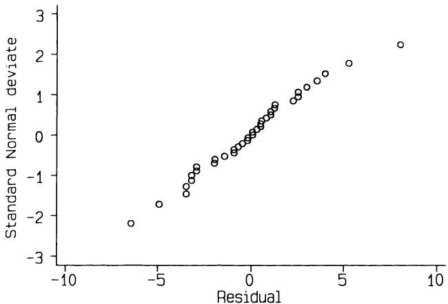
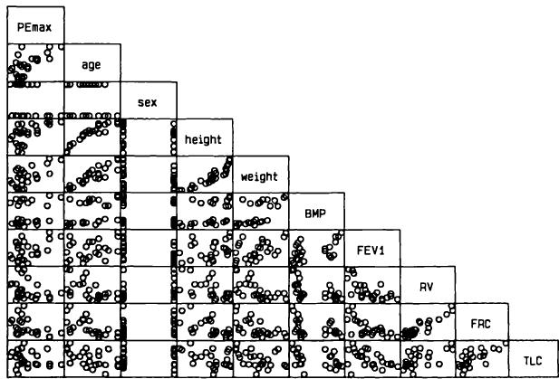
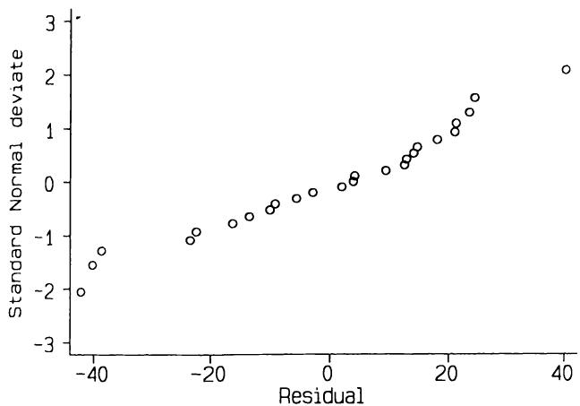
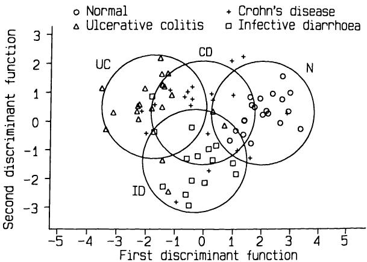

# 12 多个变量之间的关系
# 12 Relation between several variables

探索数据集是值得称赞的，但研究者应该清楚他是在探索和搜寻，而不是在回顾一个验证性实验。
Exploration of the data set is admirable, but the investigator should know that he is exploring and searching, not reviewing a confirmatory experiment.

Lachenbruch (1977)
Lachenbruch (1977)

## 12.1 引言
## 12.1 INTRODUCTION

第9、10和11章涵盖了分析绝大多数医学数据集所用的基本统计方法。很少有研究报告不使用其中一些技术，而且大多数也不会深入。然而，大多数研究会获取许多变量的数据，这些数据要么通过一系列简单的分析来处理，要么通过更复杂的统计方法来处理。通常，如果适用，最好使用更高级的方法，而不是单独查看数据集的几个小部分。
Chapters 9, 10 and 11 cover the basic statistical methods used to analyse the large majority of medical data sets. Few research reports do not make use of some of those techniques, and most will not go further. Most studies, however, obtain data on many variables, which are either analysed by a series of simple analyses or by rather more complicated statistical methods. In general it is preferable to use the more advanced methods where these are appropriate, rather than looking separately at several small parts of the data set.

本章在第9至11章方法的基础上，将这些章节的思想扩展到更复杂的数据集。第13章将继续这一过程，但专门讨论生存数据分析，即使在简单比较中，生存数据也带来了一些特殊问题。
This chapter builds on the methods of Chapters 9 to 11, by extending the ideas in those chapters to more complex data sets. Chapter 13 continues the process, but is devoted to the analysis of survival data, which poses several special problems even in simple comparisons.

## 12.2 方差分析和多元回归
## 12.2 ANALYSIS OF VARIANCE AND MULTIPLE REGRESSION

第9章介绍了比较两个或多个组在单个连续变量方面的各种方法。在12.3节中，我将展示如何扩展这些方法，以考虑具有两个或更多分类变量的数据集，这些方法统称为方差分析，无论是参数的还是非参数的。如果存在两个分类变量，则分析称为双向方差分析，依此类推。这些方法要求交叉分类的每个“单元格”中观察值数量相同，这一条件在实验研究中经常（但并非总是）满足，但在观察性研究中则很少（如果曾有的话）为真。例如，
Chapter 9 introduced a variety of methods for comparing two or more groups with respect to a single continuous variable. In section 12.3 I shall show how these methods can be extended to consider data sets with two or more classifying variables, methods given the general name analysis of variance whether parametric or non- parametric. If there are two classifying variables the analysis is known as two way analysis of variance, and so on. These methods require the same number of observations in each 'cell' of the cross- classification, a condition often, but not always, met in experimental studies but rarely, if ever, true for observational studies. For

如果我们希望比较不同胎龄的男孩和女孩的出生体重，我们无法控制每个年龄-性别组的婴儿数量，因此我们不能使用方差分析。
example, if we wish to compare birth weights of boys and girls with different lengths of gestation we cannot control the numbers of babies in each age- sex group, so we cannot use analysis of variance.

解决这个问题的办法，或许令人惊讶，与第11章中描述的线性回归技术有关。我在那里展示了如何描述两个变量之间的关系，或者更具体地说，如何从一个变量的值预测另一个变量的值。这种方法也可以扩展，使我们能够从其他几个变量的值预测一个变量的值。换句话说，我们有一个单一的因变量（结局变量）和两个或更多个解释变量（预测变量）。这种方法称为多元回归。解释变量可以是连续的、二元的（0-1）或分类的。因此，多元回归可以用于将出生体重回归到性别和胎龄上。可以证明，所有方差分析问题也可以在多元回归的框架内进行分析（参见12.4节），但对于平衡数据集（通常来自实验），更常见的是坚持方差分析方法。
The way round this problem is, perhaps surprisingly, related to the technique of linear regression described in Chapter 11. I showed there how to describe the relation between two variables, or, more specifically, how the value of one variable can be predicted from the value of the other. This method too can be extended, to allow us to predict the value of a variable from the values of several other variables. In other words, we have a single dependent (outcome) variable and two or more explanatory (predictor) variables. The method is called multiple regression. The explanatory variables can be either continuous or binary (0- 1) or categorical. Multiple regression can thus be used to regress birth weight on sex and gestational age. It can be shown that all analysis of variance problems can also be analysed in the framework of multiple regression (see section 12.4), but for balanced data sets (usually from experiments) it is more common to keep to the analysis of variance approach.

上述讨论涉及结局变量为连续变量的情况。在第12.5节中，我将展示如何对二元结局变量采用类似的方法，即使用多重logistic回归；在第13章中，相同的总体思想将用于生存数据分析。
The above discussion relates to the case where the outcome variable is continuous. In section 12.5 I shall show how a similar approach can be taken for a binary outcome variable, using multiple logistic regression. and in Chapter 13 the same general ideas will be used for the analysis of survival data.

## 12.3 双因素方差分析
## 12.3 TWO WAY ANALYSIS OF VARIANCE

在第9章中，我讨论了涉及对独立个体组进行相同测量的一些问题。通常，对每个人会进行不止一次测量，可能是在不同的实验条件下，我们需要一种可以看作是配对t检验推广的方法。这类数据可以通过称为双因素方差分析的方法处理，该方法用于分析可以显示在两个分类变量（称为“因子”）的交叉分类中的数据。
In Chapter 9 I considered several problems involving the same measure­ ment taken on independent groups of individuals. Often more than one measurement is taken from each person, perhaps under different experi­ mental conditions, and we require a method that may be seen as a generalization of the paired t test. Data of this type can be dealt with by the method known as two way analysis of variance, which is used to analyse data which can be displayed within a cross- classification of two categorical variables, called 'factors'.

当每个 $\mathbf{\hat{x}}^{\prime}$ 表示一个观察值时，这类数据集的一般结构如表12.1所示。在这种结构中，对于因子A和因子B的每个水平组合，我们可能有一个或多个观察值。我将只考虑每个单元格中观察值数量相同的情况。因此，我将假定没有缺失观察值。
The general structure of such data sets is shown in Table 12.1 when each  $\mathbf{\hat{x}}^{\prime}$  indicates an observation. In this structure, we may have one or more observations for each combination of levels of the two factors A and B. I shall only consider the case where the number of observations in each cell is the same. I shall assume, therefore, that there are no missing observations.

本节将处理属于此框架的两种研究类型。第一种情况是，在不同情况下，从相同个体中获取同一变量的两个或更多观察值，例如，每个患者接受不止一种治疗。这里图中的因子B代表不同的受试者。每个受试者在每种治疗下可能不止一次
This section deals with two types of study that fall into this framework The first is where two or more observations of the same variable are taken from the same individuals under different circumstances, for example where each patient receives more than one treatment. Here factor B in the diagram  represents  different  subjects.  There  may  be  more  than  on

表12.1 双因素交叉分类的一般结构。每个 $\mathbf{x}$ 代表一个单一观察值，x…x 代表一系列观察值  
Table 12.1 General structure of a two way cross-classification. Each  $\mathbf{x}$  represents a single observation, and x…x represents a series of observations  

<table><tr><td rowspan="2">因子 B</td><td colspan="6">因子 A</td></tr><tr><td>1</td><td>2</td><td>3</td><td></td><td></td><td>c</td></tr><tr><td>1</td><td>x…x</td><td>x…x</td><td>x…x</td><td>.</td><td>.</td><td>x…x</td></tr><tr><td>2</td><td>x…x</td><td>x…x</td><td>x…x</td><td>.</td><td>.</td><td>x…x</td></tr><tr><td>3</td><td>x…x</td><td>x…x</td><td>x…x</td><td>.</td><td>.</td><td>x…x</td></tr><tr><td></td><td>.</td><td>.</td><td>.</td><td>.</td><td>.</td><td>.</td></tr><tr><td></td><td>.</td><td>.</td><td>.</td><td>.</td><td>.</td><td>.</td></tr><tr><td>r</td><td>x…x</td><td>x…x</td><td>x…x</td><td>.</td><td>.</td><td>x…x</td></tr></table>
<table><tr><td rowspan="2">Factor B</td><td colspan="6">Factor A</td></tr><tr><td>1</td><td>2</td><td>3</td><td></td><td></td><td>c</td></tr><tr><td>1</td><td>x…x</td><td>x…x</td><td>x…x</td><td>.</td><td>.</td><td>x…x</td></tr><tr><td>2</td><td>x…x</td><td>x…x</td><td>x…x</td><td>.</td><td>.</td><td>x…x</td></tr><tr><td>3</td><td>x…x</td><td>x…x</td><td>x…x</td><td>.</td><td>.</td><td>x…x</td></tr><tr><td></td><td>.</td><td>.</td><td>.</td><td>.</td><td>.</td><td>.</td></tr><tr><td></td><td>.</td><td>.</td><td>.</td><td>.</td><td>.</td><td>.</td></tr><tr><td>r</td><td>x…x</td><td>x…x</td><td>x…x</td><td>.</td><td>.</td><td>x…x</td></tr></table>

观察。
observation per subject on each treatment.

第二种情况是，有两个因子指定测量的性质，并且每个组合都应用于一个或多个患者。例如，我们可能有男性和女性分别在两种或多种不同治疗后的血压观察值。这里因子A和B代表治疗和性别，并且每个组合都有几个不同的受试者。我将详细考虑每种情况的一个例子，然后讨论其他设计。
The second case is where there are two factors specifying the nature of the measurements, and each combination is given to one or more patients. For example we may have observations on blood pressure after two or more different treatments for males and females separately. Here factors A and B represent treatment and sex, and there are several different subjects for each combination. I shall consider one example of each in detail, and then discuss other designs.

### 12.3.1 重复观察
### 12.3.1 Repeated observation

表12.2显示了9名充血性心力衰竭患者的心率
Table 12.2 shows the heart rate of nine patients with congestive heart

表12.2 依那普利拉对心率的短期影响（次/分钟）（Maskin 等人，1985）  
Table 12.2 Short-term effect of enalaprilat on heart rate (beats per minute) (Maskin et al., 1985)  

<table><tr><td rowspan="2">受试者</td><td colspan="6">时间（分钟）</td></tr><tr><td>0</td><td>30</td><td>60</td><td>120</td><td>均值</td><td>(SD)</td></tr><tr><td>1</td><td>96</td><td>92</td><td>86</td><td>92</td><td>91.50</td><td>(4.1)</td></tr><tr><td>2</td><td>110</td><td>106</td><td>108</td><td>114</td><td>109.50</td><td>(3.4)</td></tr><tr><td>3</td><td>89</td><td>86</td><td>85</td><td>83</td><td>85.75</td><td>(2.5)</td></tr><tr><td>4</td><td>95</td><td>78</td><td>78</td><td>83</td><td>83.50</td><td>(8.0)</td></tr><tr><td>5</td><td>128</td><td>124</td><td>118</td><td>118</td><td>122.00</td><td>(4.9)</td></tr><tr><td>6</td><td>100</td><td>98</td><td>100</td><td>94</td><td>98.00</td><td>(2.8)</td></tr><tr><td>7</td><td>72</td><td>68</td><td>67</td><td>71</td><td>69.50</td><td>(2.4)</td></tr><tr><td>8</td><td>79</td><td>75</td><td>74</td><td>74</td><td>75.50</td><td>(2.4)</td></tr><tr><td>9</td><td>100</td><td>106</td><td>104</td><td>102</td><td>103.00</td><td>(2.6)</td></tr><tr><td rowspan="2">均值 
<table><tr><td rowspan="2">Subject</td><td colspan="6">Time (mins)</td></tr><tr><td>0</td><td>30</td><td>60</td><td>120</td><td>Mean</td><td>(SD)</td></tr><tr><td>1</td><td>96</td><td>92</td><td>86</td><td>92</td><td>91.50</td><td>(4.1)</td></tr><tr><td>2</td><td>110</td><td>106</td><td>108</td><td>114</td><td>109.50</td><td>(3.4)</td></tr><tr><td>3</td><td>89</td><td>86</td><td>85</td><td>83</td><td>85.75</td><td>(2.5)</td></tr><tr><td>4</td><td>95</td><td>78</td><td>78</td><td>83</td><td>83.50</td><td>(8.0)</td></tr><tr><td>5</td><td>128</td><td>124</td><td>118</td><td>118</td><td>122.00</td><td>(4.9)</td></tr><tr><td>6</td><td>100</td><td>98</td><td>100</td><td>94</td><td>98.00</td><td>(2.8)</td></tr><tr><td>7</td><td>72</td><td>68</td><td>67</td><td>71</td><td>69.50</td><td>(2.4)</td></tr><tr><td>8</td><td>79</td><td>75</td><td>74</td><td>74</td><td>75.50</td><td>(2.4)</td></tr><tr><td>9</td><td>100</td><td>106</td><td>104</td><td>102</td><td>103.00</td><td>(2.6)</td></tr><tr><td rowspan="2">Mean 
(SD)</td><td>96.56</td><td>92.56</td><td>91.11</td><td>92.33</td><td>93.14</td><td></td></tr><tr><td>(16.4)</td><td>(17.8)</td><td>(17.2)</td><td>(16.5)</td><td>(16.4)</td><td></td></tr></table>
(SD)</td><td>96.56</td><td>92.56</td><td>91.11</td><td>92.33</td><td>93.14</td><td></td></tr><tr><td>(16.4)</td><td>(17.8)</td><td>(17.2)</td><td>(16.5)</td><td>(16.4)</td><td></td></tr></table>

在服用血管紧张素转换酶抑制剂依那普利拉之前和之后不久的心率。测量是在给药前以及给药后30、60和120分钟进行的。这种设计看起来与第9.8节中通过单向方差分析所分析的设计相似，但这里不同时间点的测量是针对同一受试者进行的。因此，这种设计更应被视为配对 $t$ 检验的自然延伸。这种设计的优势在于，各组观测值之间的比较是基于受试者内部差异的。受试者之间的变异通常很大（见表12.2），但它不影响我们区分各组观测值之间差异的能力，这里指的是四个时间点。
failure before and shortly after administration of enalaprilat, an angiotensin- converting enzyme inhibitor. Measurements were taken before and at 30, 60 and 120 minutes after drug administration. This design appears similar to that analysed by one way analysis of variance in section 9.8, but here the measurements at the different times are on the same subjects. Thus this design should more appropriately be seen as a natural extension of the paired  $t$  test. The strength of this design is that comparisons between the sets of observations are based on within subject differences. Variation between subjects, which is usually considerable (see Table 12.2), does not affect our ability to distinguish differences between the sets of observations, which here relate to four time points.

在第9.8节中，我展示了在单向方差分析中如何将总变异分解为组间和组内分量。双向方差分析也采用了类似的方法，但自然会稍微复杂一些。在本例中，对于表12.2所示的心率数据，我们可以将总变异分解为由时间点之间和受试者之间变异引起的分量，还有一些剩余变异，我们称之为残差变异。这个术语的含义与第11章中描述的回归分析中的含义相同。
In section 9.8 I showed how in one way analysis of variance the total variability is separated into between group and within group components. A similar approach is adopted in two way analysis of variance, but naturally it is a bit more complicated. In the present example, for the heart rate data shown in Table 12.2, we can divide the total variability into components due to variation between times and between subjects, and there is some remaining variation which we refer to as residual variation. This term carries the same meaning as in regression analysis, described in Chapter 11.

表12.3显示了心率数据的方差分析表。用于检验受试者间和时间点间方差（均方）的 $\pmb{F}$ 值，均通过除以残差方差获得。前者与自由度为8和24的 $\pmb{F}$ 分布进行比较，后者与自由度为3和24的 $\pmb{F}$ 分布进行比较。受试者间变异的 $\mathbf{P}$ 值极小，这在医学数据中很常见。所有受试者心率相同的零假设被坚决拒绝，但这并没有实际意义。本研究的目的是调查依那普利拉给药后两小时内心率的变化，这通过考虑表12.3中“时间点间”行来检验。$\mathbf{P}$ 值为0.018，表明我们可以合理地拒绝心率在两小时内没有变化的零假设。表12.2显示了每个时间点的均值。
Table 12.3 shows the analysis of variance table for the heart rate data. The  $\pmb{F}$  values for testing the between subjects and between times variances (mean squares) are each obtained by dividing by the residual variance. The former is compared with the  $\pmb{F}$  distribution with 8 and 24 degrees of freedom, and the latter with that with 3 and 24 degrees of freedom. The between subject variation has an extremely small  $\mathbf{P}$  value, as is often the case with medical data. The null hypothesis that all subjects have the same heart rate is firmly rejected, but this is of no real interest. The purpose of this study was to investigate variation in heart rate over the two hours after administration of enalaprilat, which is examined by considering the 'between times' row of Table 12.3. The  $\mathbf{P}$  value of 0.018 indicates that we can reasonably reject the null hypothesis that there is no change in heart rate over the two hours. Table 12.2 shows the means for each time point.

表12.3 表12.2数据的方差分析  
Table 12.3 Analysis of variance of data in Table 12.2  

<table><tr><td>变异来源</td><td>df</td><td>平方和</td><td>均方</td><td>F</td><td>P</td></tr><tr><td>受试者</td><td>8</td><td>8966.556</td><td>1120.819</td><td>90.6</td><td>&amp;lt; 0.0001</td></tr><tr><td>时间</td><td>3</td><td>150.972</td><td>50.324</td><td>4.07</td><td>0.018</td></tr><tr><td>残差</td><td>24</td><td>296.778</td><td>12.366</td><td></td><td></td></tr><tr><td>总计</td><td>35</td><td>9414.306</td><td></td><td></td><td></td></tr></table>
<table><tr><td>Source of variation</td><td>df</td><td>Sums of squares</td><td>Mean squares</td><td>F</td><td>P</td></tr><tr><td>Subjects</td><td>8</td><td>8966.556</td><td>1120.819</td><td>90.6</td><td>&amp;lt; 0.0001</td></tr><tr><td>Times</td><td>3</td><td>150.972</td><td>50.324</td><td>4.07</td><td>0.018</td></tr><tr><td>Residual</td><td>24</td><td>296.778</td><td>12.366</td><td></td><td></td></tr><tr><td>Total</td><td>35</td><td>9414.306</td><td></td><td></td><td></td></tr></table>

这表明心率在30分钟后平均下降了4次/分钟（bpm），并在接下来的90分钟内保持相当稳定。从表中原始数据来看，这种平均模式并不明显。
indicating that heart rate fell by an average four beats per minute (bpm) after 30 minutes, and remained fairly stable over the next 90 minutes. The average pattern is not obvious from examination of the raw data in the table.

可以使用与单向方差分析相同的方法来检验与时间趋势相关的特定假设。例如，我们可以比较每对时间点，并使用 Bonferroni 校正来处理多重检验，或者寻找随时间变化的线性趋势。我们还可以构建任意时间点的均值或均值之间差异的置信区间。对于所有这些分析，至关重要的是，在剔除受试者间变异后，我们必须使用正确的方差，即残差方差。
Specific hypotheses relating to the time trend can be examined using the same approach as in one way analysis of variance. We could, for example, compare each pair of times, with a Bonferroni correction to allow for multiple testing, or look for a linear trend over time. We can also construct confidence intervals for the mean at any time or the difference between means. For all of these analyses it is essential that we use the correct variance, after the between subject variation has been removed, which is the residual variance.

残差方差为 12.366，因此残差标准差为 $\sqrt{12.366} = 4.516$ bpm。通过拟合方差分析中隐含的模型，我们假设每个受试者的心率随时间变化的真实响应模式是相同的，并且（等效地）受试者之间的差异在每个时间点都是相同的。任何偏离此模型的现象都表示随机变异，例如测量误差导致的变异。所有观测值的平均值为 93.14 bpm，我们可以将每列和每行的平均值表示为与总平均值的差异。然后，通过将相关的行平均值和列平均值相加，并减去总平均值，即可得到每个单元格的预测值，如下所示：
The residual variance is 12.366 so the residual standard deviation is  $\sqrt{12.366} = 4.516$  bpm. By fitting the model implicit in the analysis of variance we have assumed that the true response pattern of heart rate over time is the same for each subject, and (equivalently) that the differences between subjects are the same at each time. Any departures from this model indicate random variation, for example that resulting from measurement error. The mean of all the observations was 93.14 bpm, and we can express the means for each column and row as differences from the overall mean. The value predicted in each cell is then obtained by adding the relevant row and column means, and subtracting the overall mean, as

表 12.4 基于双向方差分析模型预测的心率  
Table 12.4 Predicted heart rate based on the two way analysis of variance model  

<table><tr><td rowspan="2">受试者</td><td colspan="5">时间 (分钟)</td><td rowspan="2">与总平均值的差异</td></tr><tr><td>0</td><td>30</td><td>60</td><td>120</td><td>平均值</td></tr><tr><td>1</td><td>94.92</td><td>90.92</td><td>89.47</td><td>90.69</td><td>91.50</td><td>-1.64</td></tr><tr><td>2</td><td>112.92</td><td>108.92</td><td>107.47</td><td>108.69</td><td>109.50</td><td>+16.36</td></tr><tr><td>3</td><td>89.17</td><td>85.17</td><td>83.72</td><td>84.94</td><td>85.75</td><td>-7.39</td></tr><tr><td>4</td><td>86.92</td><td>82.92</td><td>81.47</td><td>82.69</td><td>83.50</td><td>-9.64</td></tr><tr><td>5</td><td>125.42</td><td>121.42</td><td>119.97</td><td>121.19</td><td>122.00</td><td>+28.86</td></tr><tr><td>6</td><td>101.42</td><td>97.42</td><td>95.97</td><td>97.19</td><td>98.00</td><td>+4.86</td></tr><tr><td>7</td><td>72.92</td><td>68.92</td><td>67.47</td><td>68.69</td><td>69.50</td><td>-23.64</td></tr><tr><td>8</td><td>78.92</td><td>74.92</td><td>73.47</td><td>74.69</td><td>75.50</td><td>-17.64</td></tr><tr><td>9</td><td>106.42</td><td>102.42</td><td>100.97</td><td>102.19</td><td>103.00</td><td>+9.86</td></tr><tr><td>平均值</td><td>96.56</td><td>92.56</td><td>91.11</td><td>92.33</td><td>93.14</td><td></td></tr><tr><td>与总平均值的差异</td><td>3.42</td><td>-0.58</td><td>-2.03</td><td>-0.81</td><td></td><td></td></tr></table>
<table><tr><td rowspan="2">Subject</td><td colspan="5">Time (mins)</td><td rowspan="2">Difference from overall mean</td></tr><tr><td>0</td><td>30</td><td>60</td><td>120</td><td>Mean</td></tr><tr><td>1</td><td>94.92</td><td>90.92</td><td>89.47</td><td>90.69</td><td>91.50</td><td>-1.64</td></tr><tr><td>2</td><td>112.92</td><td>108.92</td><td>107.47</td><td>108.69</td><td>109.50</td><td>+16.36</td></tr><tr><td>3</td><td>89.17</td><td>85.17</td><td>83.72</td><td>84.94</td><td>85.75</td><td>-7.39</td></tr><tr><td>4</td><td>86.92</td><td>82.92</td><td>81.47</td><td>82.69</td><td>83.50</td><td>-9.64</td></tr><tr><td>5</td><td>125.42</td><td>121.42</td><td>119.97</td><td>121.19</td><td>122.00</td><td>+28.86</td></tr><tr><td>6</td><td>101.42</td><td>97.42</td><td>95.97</td><td>97.19</td><td>98.00</td><td>+4.86</td></tr><tr><td>7</td><td>72.92</td><td>68.92</td><td>67.47</td><td>68.69</td><td>69.50</td><td>-23.64</td></tr><tr><td>8</td><td>78.92</td><td>74.92</td><td>73.47</td><td>74.69</td><td>75.50</td><td>-17.64</td></tr><tr><td>9</td><td>106.42</td><td>102.42</td><td>100.97</td><td>102.19</td><td>103.00</td><td>+9.86</td></tr><tr><td>Mean</td><td>96.56</td><td>92.56</td><td>91.11</td><td>92.33</td><td>93.14</td><td></td></tr><tr><td>Difference from overall mean</td><td>3.42</td><td>-0.58</td><td>-2.03</td><td>-0.81</td><td></td><td></td></tr></table>

表 12.5 方差分析的残差，计算为表 12.2 和表 12.4 中各项的差值  
Table 12.5 Residuals from the analysis of variance, calculated as the difference between the entries in Tables 12.2 and 12.4  

<table><tr><td rowspan="2">受试者</td><td colspan="5">时间 (分钟)</td></tr><tr><td>0</td><td>30</td><td>60</td><td>120</td><td>均值</td></tr><tr><td>1</td><td>1.08</td><td>1.08</td><td>-3.47</td><td>1.31</td><td>0.00</td></tr><tr><td>2</td><td>-2.92</td><td>-2.92</td><td>0.53</td><td>5.31</td><td>0.00</td></tr><tr><td>3</td><td>-0.17</td><td>0.83</td><td>1.28</td><td>-1.94</td><td>0.00</td></tr><tr><td>4</td><td>8.08</td><td>-4.92</td><td>-3.47</td><td>0.31</td><td>0.00</td></tr><tr><td>5</td><td>2.58</td><td>2.58</td><td>-1.97</td><td>-3.19</td><td>0.00</td></tr><tr><td>6</td><td>-1.42</td><td>0.58</td><td>4.03</td><td>-3.19</td><td>0.00</td></tr><tr><td>7</td><td>-0.92</td><td>-0.92</td><td>-0.47</td><td>2.31</td><td>0.00</td></tr><tr><td>8</td><td>0.08</td><td>0.08</td><td>0.53</td><td>-0.69</td><td>0.00</td></tr><tr><td>9</td><td>-6.42</td><td>3.58</td><td>3.03</td><td>-0.19</td><td>0.00</td></tr><tr><td>均值</td><td>0.00</td><td>0.00</td><td>0.00</td><td>0.00</td><td>0.00</td></tr></table>
<table><tr><td rowspan="2">Subject</td><td colspan="5">Time (mins)</td></tr><tr><td>0</td><td>30</td><td>60</td><td>120</td><td>Mean</td></tr><tr><td>1</td><td>1.08</td><td>1.08</td><td>-3.47</td><td>1.31</td><td>0.00</td></tr><tr><td>2</td><td>-2.92</td><td>-2.92</td><td>0.53</td><td>5.31</td><td>0.00</td></tr><tr><td>3</td><td>-0.17</td><td>0.83</td><td>1.28</td><td>-1.94</td><td>0.00</td></tr><tr><td>4</td><td>8.08</td><td>-4.92</td><td>-3.47</td><td>0.31</td><td>0.00</td></tr><tr><td>5</td><td>2.58</td><td>2.58</td><td>-1.97</td><td>-3.19</td><td>0.00</td></tr><tr><td>6</td><td>-1.42</td><td>0.58</td><td>4.03</td><td>-3.19</td><td>0.00</td></tr><tr><td>7</td><td>-0.92</td><td>-0.92</td><td>-0.47</td><td>2.31</td><td>0.00</td></tr><tr><td>8</td><td>0.08</td><td>0.08</td><td>0.53</td><td>-0.69</td><td>0.00</td></tr><tr><td>9</td><td>-6.42</td><td>3.58</td><td>3.03</td><td>-0.19</td><td>0.00</td></tr><tr><td>Mean</td><td>0.00</td><td>0.00</td><td>0.00</td><td>0.00</td><td>0.00</td></tr></table>

如表12.4所示。表12.5显示了观测数据与模型拟合值之间的差异，这些差异称为残差。这些残差显示了模型的拟合不足，残差的方差就是表12.3方差分析中显示的残差方差。如前所述，这些残差与等效回归分析中的残差完全对应。残差方差是对同一患者在同一时间进行多次测量（尽管只进行了一次此类测量）方差的估计。
shown in Table 12.4. Table 12.5 shows the differences between the observed data and the values fitted by the model, called residuals. These show the lack of fit of the model, and the variance of the residuals is the residual variance shown in the analysis of variance in Table 12.3. As already noted, these residuals correspond exactly to residuals from the equivalent regression analysis. The residual variance is an estimate of the variance of multiple measurements on a single patient at the same time (even though only one such measurement was made).

### 12.3.2 假设
### 12.3.2 Assumptions

数据无需服从正态分布，无论是总体上还是在行或列内。然而，残差应服从正态分布，这一假设可以通过图12.1所示的正态概率图进行检验。心率残差的 $W^{\prime}$ 检验结果为 $W^{\prime} = 0.977$， $\mathbf{P} = 0.5$ ，因此我们可以满意地认为我们的模型在这方面是合理的。
There is no requirement for the data to be Normally distributed, neither overall nor within a row or column. The residuals, however, are expected to have a Normal distribution, an assumption that can be examined by a Normal plot as in Figure 12.1. The  $W^{\prime}$  test for the heart rate residua. gives  $W^{\prime} = 0.977$  with  $\mathbf{P} = 0.5$  , and so we can be happy that our model s reasonable in this respect.

即使残差分布合理地服从正态分布，也并不意味着模型是恰当的。检查表12.5显示受试者4和9有一些较大的值，我们可能希望考虑随时间变化的反应对所有个体而言不尽相同的可能性。我们无法用这些数据检验这种可能性，因为每个受试者在每个时间点只有一个观测值。如果我们对每个受试者-时间组合有两个或更多的观测值，我们将进行更全面的分析。具体来说，我们可以检验受试者和时间这两个因素之间是否存在显著交互作用。这种更复杂分析的一个例子将在下文描述。如果
Even if the distribution of residuals is reasonably Normal it does not necessarily follow that the model is appropriate. Inspection of Table 12.5 shows some large values for subjects 4 and 9 and we might wish to consider the possibility that the response over time is not the same for all individuals. We cannot examine this possibility with these data, because there is only one observation per person at each time. If we had two or more observations for each person- time combination we would carry out a more comprehensive analysis. Specifically, we could examine the possible existence of a significant interaction between the two factors subject and time. An example of this more complex analysis is described below. If the

  
图12.1 表12.2数据方差分析残差的正态图。
Figure 12.1 Normal plot of residuals from analysis of variance of the data in Table 12.2.

如果方差分析的分布假设未满足，我们可以执行非参数分析，如第12.3.5节所述。
distributional assumption of the analysis of variance is not met, we can perform a non- parametric analysis, as described in section 12.3.5.

对用于说明双向方差分析的心率数据的批评是，这些观察结果与一次实验中重复测量序列相关。此类数据不完全适用于所描述的分析。有些程序可以执行“重复测量”方差分析，这种分析对于此类数据更为准确。另一种看待序列观察的方法在第14.6节中描述。
A criticism of the heart rate data used to illustrate two way analysis of variance is that the observations relate to a sequence of repeated measurements in one experiment. Such data are not strictly appropriate for the analysis described. Some programs can perform a 'repeated measures' analysis of variance that is more correct for this type of data. Another way of looking at serial observations is described in section 14.6.

### 12.3.3 重复数据
### 12.3.3 Replicated data

方差分析也可以用于研究测量变异性。表12.6显示了一项研究超声胎儿头围数据可重复性的大量数据的一部分。四名观察者每人对相同的三个胎儿进行了三次测量。与通常的临床实践相反，观察者被蒙在鼓里，不知道他们之前的测量结果。这组数据与心率数据之间的结构差异在于每个胎儿有三次重复读数。这些读数使我们能够调查观察者与胎儿之间是否存在交互作用的可能性；换句话说，我们可以看看观察者之间的差异在不同胎儿之间是否比我们仅凭偶然变异所预期的更大。当我们调查一个或两个直接感兴趣的因素（如治疗和剂量）时，交互作用更为重要。对于这组数据
Analysis of variance can also be used to study measurement variability. Table 12.6 shows part of a large set of data from a study investigating the reproducibility of ultrasonic fetal head circumference data. Four observers each took three measurements on the same three fetuses. The observers were kept unaware of their previous measurements, in contrast to usual clinical practice. The structural difference between this data set and the heart rate data is the availability of three replicate readings per fetus. These enable us to investigate the possibility of an interaction between observers and fetuses; in other words, we can see if the differences between observers vary from fetus to fetus more than we expect just from chance variation. Interaction is more important when we investigate one or two factors of direct interest, such as treatment and dose. With this data

表12.6 四名观察者对胎儿头围（cm）的测量结果  
Table 12.6 Measurements of fetal head circumference (cm) by four observers  

<table><tr><td></td><td>观察者 1</td><td>观察者 2</td><td>观察者 3</td><td>观察者 4</td></tr><tr><td rowspan="3">胎儿 1</td><td>14.3</td><td>13.6</td><td>13.9</td><td>13.8</td></tr><tr><td>14.0</td><td>13.6</td><td>13.7</td><td>14.7</td></tr><tr><td>14.8</td><td>13.8</td><td>13.8</td><td>13.9</td></tr><tr><td rowspan="3">胎儿 2</td><td>19.7</td><td>19.8</td><td>19.5</td><td>19.8</td></tr><tr><td>19.9</td><td>19.3</td><td>19.8</td><td>19.6</td></tr><tr><td>19.8</td><td>19.8</td><td>19.5</td><td>19.8</td></tr><tr><td rowspan="3">胎儿 3</td><td>13.0</td><td>12.4</td><td>12.8</td><td>13.0</td></tr><tr><td>12.6</td><td>12.8</td><td>12.7</td><td>12.9</td></tr><tr><td>12.9</td><td>12.5</td><td>12.5</td><td>13.8</td></tr></table>
<table><tr><td></td><td>Observer 1</td><td>Observer 2</td><td>Observer 3</td><td>Observer 4</td></tr><tr><td rowspan="3">Fetus 1</td><td>14.3</td><td>13.6</td><td>13.9</td><td>13.8</td></tr><tr><td>14.0</td><td>13.6</td><td>13.7</td><td>14.7</td></tr><tr><td>14.8</td><td>13.8</td><td>13.8</td><td>13.9</td></tr><tr><td rowspan="3">Fetus 2</td><td>19.7</td><td>19.8</td><td>19.5</td><td>19.8</td></tr><tr><td>19.9</td><td>19.3</td><td>19.8</td><td>19.6</td></tr><tr><td>19.8</td><td>19.8</td><td>19.5</td><td>19.8</td></tr><tr><td rowspan="3">Fetus 3</td><td>13.0</td><td>12.4</td><td>12.8</td><td>13.0</td></tr><tr><td>12.6</td><td>12.8</td><td>12.7</td><td>12.9</td></tr><tr><td>12.9</td><td>12.5</td><td>12.5</td><td>13.8</td></tr></table>

我们对这些特定的胎儿或观察者不特别感兴趣，但希望估计测量的可重复性。
set we are not especially interested in these particular fetuses or observers, but wish to estimate the reproducibility of the measurements.

表12.7显示了头围数据的方差分析表。同样，检验每个效应的 $F$ 值是通过将均方除以残差均方得到的。受试者与观察者之间的交互作用并不显著 $(\mathbf{P} = 0.33)$。如果交互作用不显著，最好将其从模型中移除，将其平方和与残差变异合并，得到表12.8所示的简化分析。通常，如果交互作用显著，则主效应（此处为“胎儿”和“观察者”）没有简单的解释，因为每个效应都取决于另一个因素的水平。
Table 12.7 shows the analysis of variance table for the head circumference data. Again the  $F$  values for testing each effect are obtained by dividing the mean squares by the residual mean square. The interaction between subjects and observers is not nearly significant  $(\mathbf{P} = 0.33)$ . If the interaction is not significant it is best to remove it from the model by pooling its sum of squares with the residual variation to give the simplified analysis shown in Table 12.8. In general, if the interaction is significant the main effects (here 'fetuses' and 'observers') do not have a simple interpretation because the effect of each depends upon the level of the other factor.

使用表12.8中的残差方差，我们可以计算残差标准差为 $\sqrt{0.080} = 0.283 \mathrm{cm}$。因此，重复测量
Using the residual variance from Table 12.8 we can calculate the residual standard deviation as  $\sqrt{0.080} = 0.283 \mathrm{cm}$ . Thus replicated measurements

表12.7 表12.6中头围数据的双向方差分析结果  
Table 12.7 Results of two way analysis of variance of the head circumference data in Table 12.6  

<table><tr><td>变异来源</td><td>自由度</td><td>平方和</td><td>均方</td><td>F</td><td>P</td></tr><tr><td>胎儿</td><td>2</td><td>324.009</td><td>162.004</td><td>2113</td><td>&amp;lt; 0.001</td></tr><tr><td>观察者</td><td>3</td><td>1.199</td><td>0.400</td><td>5.21</td><td>0.006</td></tr><tr><td>胎儿 × 观察者 (交互作用)</td><td>6</td><td>0.562</td><td>0.094</td><td>1.22</td><td>0.33</td></tr><tr><td>残差</td><td>24</td><td>1.840</td><td>0.077</td><td></td><td></td></tr><tr><td>总计</td><td>35</td><td>327.610</td><td></td><td></td><td></td></tr></table>
<table><tr><td>Source of variation</td><td>Degrees of freedom</td><td>Sums of squares</td><td>Mean squares</td><td>F</td><td>P</td></tr><tr><td>Fetuses</td><td>2</td><td>324.009</td><td>162.004</td><td>2113</td><td>&amp;lt; 0.001</td></tr><tr><td>Observers</td><td>3</td><td>1.199</td><td>0.400</td><td>5.21</td><td>0.006</td></tr><tr><td>Fetuses × Observers (Interaction)</td><td>6</td><td>0.562</td><td>0.094</td><td>1.22</td><td>0.33</td></tr><tr><td>Residual</td><td>24</td><td>1.840</td><td>0.077</td><td></td><td></td></tr><tr><td>Total</td><td>35</td><td>327.610</td><td></td><td></td><td></td></tr></table>

表12.8 忽略交互作用的头围数据方差分析  
Table 12.8 Analysis of variance of the head circumference data omitting the interaction  

<table><tr><td>变异来源</td><td>自由度</td><td>平方和</td><td>均方</td><td>F</td><td>P</td></tr><tr><td>胎儿</td><td>2</td><td>324.009</td><td>162.004</td><td>2023</td><td>&amp;lt; 0.001</td></tr><tr><td>观察者</td><td>3</td><td>1.199</td><td>0.400</td><td>4.99</td><td>0.006</td></tr><tr><td>残差</td><td>30</td><td>2.402</td><td>0.080</td><td></td><td></td></tr><tr><td>总计</td><td>35</td><td>327.610</td><td></td><td></td><td></td></tr></table>
<table><tr><td>Source of variation</td><td>Degrees of freedom</td><td>Sums of squares</td><td>Mean squares</td><td>F</td><td>P</td></tr><tr><td>Fetuses</td><td>2</td><td>324.009</td><td>162.004</td><td>2023</td><td>&amp;lt; 0.001</td></tr><tr><td>Observers</td><td>3</td><td>1.199</td><td>0.400</td><td>4.99</td><td>0.006</td></tr><tr><td>Residual</td><td>30</td><td>2.402</td><td>0.080</td><td></td><td></td></tr><tr><td>Total</td><td>35</td><td>327.610</td><td></td><td></td><td></td></tr></table>

同一观察者对同一胎儿重复测量的估计标准差仅为 $0.283\mathrm{cm}$，这表明测量误差很小。请注意，分析中最有趣的方面是估计问题—假设检验实际上并不重要。
of the same fetus by the same observer have an estimated standard deviation of only  $0.283\mathrm{cm}$  , which shows that measurement error is small. Notice that this most interesting aspect of the analysis is an estimation problem - the hypothesis tests are not really of interest.

方差分析中 $F$ 值的评估取决于分类变量是本身就具有研究意义，还是代表了更广泛的总体。这里描述的分析假设我们对这些特定的胎儿和观察者感兴趣，这在这种情况下可能并非真实。然而，所描述的分析与多元回归完全对应，并且使用更广泛。
The evaluation of  $F$  values in the analysis of variance differs according to whether the classifying variables are interesting in their own right or whether they are representative of a wider population. The analysis described assumes that we are interested in these particular fetuses and observers, which is probably untrue in this case. However, the analysis described corresponds exactly to multiple regression, and is more widely used.

### 12.3.4 扩展
### 12.3.4 Extensions

多向方差分析的一些思想已通过两个简单的数据集引入。如前所述，这两个数据集都有一些特征，使其略微不适用于所使用的方法。要求非常严格，医学研究数据通常无法完全满足。第5.4节给出了一个更复杂数据集的例子，我描述了一项研究，旨在调查左右臂血压之间可能存在的差异。每个受试者进行了16次测量，每次测量对应手臂（左或右）、观察者和袖带的每种组合。因此，数据通过四向方差分析进行分析。
Some of the ideas of multi- way analysis of variance have been introduced by means of two simple data sets. As noted, both have features that make them slightly inappropriate for the methods used. The requirements are very strict, and are not often met perfectly by medical research data. An example of a more complex data set was given in section 5.4, where I described a study to investigate the possible difference in blood pressure between the left and right arms. Each subject had 16 measurements made, two for each combination of arm (left or right), observer and cuff. Thus the data were analysed by a four way analysis of variance.

对于三向及以上设计，涉及的原理相同。然而，可能会出现本书范围之外的进一步问题，特别是当变量未完全交叉分类时。例如，如果我们测量一组受试者在两种饮食前后各自的代谢率，我们可以通过三向方差分析（因子为时间、饮食和受试者）来分析数据。但如果两种饮食分别给予不同的受试者组，如在临床试验中，我们就不能使用该分析，也不能使用双向分析。（然而，我们可以在两组代谢率变化上进行单向方差分析—或两样本 $t$ 检验—
For three way designs and above the same principles are involved. However, further problems may arise which are beyond the scope of this book, especially when the variables are not fully cross- classified. For example, if we measure a group of subjects' metabolic rates before and after each of two types of diet, we could analyse the data by a three way analysis of variance (with factors time, diet and subject). But if the two diets were given to different groups of subjects, as in a clinical trial, we cannot use that analysis, nor can we use a two way analysis. (We could, however, perform a one way analysis of variance - or a two sample  $t$  test - -

对两组代谢率的变化进行分析。）Armitage和Berry（1987，第8章）讨论了更复杂设计中出现的一些问题。与本章中介绍的许多更高级方法一样，统计学家的建议将非常有价值。
on the changes in metabolic rate in the two groups.) Some of the issues arising in more complex designs are discussed by Armitage and Berry (1987, Chapter 8). As with many of the more advanced methods introduced in this chapter, the advice of a statistician would be valuable.

更常见的情况是，多重分类的数据以非结构化的方式出现，在这种情况下，我们可以通过多重回归分析数据，如第12.4节所述。
More often, data from a multiple classification arise in an unstructured way, in which case we can analyse the data by multiple regression. described in section 12.4.

### 12.3.5 非参数双向方差分析
### 12.3.5 Non-parametric two way analysis of variance

残差服从正态分布的假设在拟合模型之前无法评估。然而，有时从原始数据中可以看出模型拟合不佳。特别是，每行或每列标准差的巨大差异将提示前面描述的参数方差分析存在问题。
The assumption that the residuals have a Normal distribution cannot be assessed before fitting the model. Sometimes, however, it can be seen from the raw data that the model will not fit well. In particular, wide variation in the standard deviations for each row or column will suggest problems with the parametric analysis of variance just described.

有一种非参数形式的双向方差分析，可用于不满足参数方法假设的数据集。这种方法有时被称为Friedman双向方差分析，它纯粹是一种假设检验。
There is a non- parametric form of two way analysis of variance that can be used for data sets which do not fulfil the assumptions of the parametric method. The method, which is sometimes known as Friedman's two way analysis of variance, is purely a hypothesis test.

表12.9显示了一项实验的数据，该实验比较了四种不同类型浸没服在模拟水下直升机逃生过程中的渗漏量。四种浸没服标准差的巨大变异性表明，秩次分析是可取的。
Table 12.9 shows some data from an experiment to compare the leakage from four different types of immersion suit during simulated underwater helicopter escapes. The wide variability of the SDs for the four suits suggests that a rank analysis would be advisable.

四种浸没服的数值按每个受试者进行排序，如表12.10所示。此数据集中没有并列值，但如果有任何并列值，我们按常规方式计算平均秩次。
The values for the four suits are ranked for each subject as shown in Table 12.10. There are no ties in this data set, but if there are any ties we calculate average ranks in the usual way.

表12.9 模拟直升机水下逃生过程中浸没服的渗漏量 (g) (Light et al., 1987)  
Table 12.9 Immersion suit leakage (g) during simulated helicopter underwater escape (Light et al., 1987)  

<table><tr><td rowspan="2">受试者</td><td rowspan="2">A</td><td colspan="3">浸没服类型</td></tr><tr><td>B</td><td>C</td><td>D</td></tr><tr><td>1</td><td>308</td><td>132</td><td>454</td><td>64</td></tr><tr><td>2</td><td>102</td><td>526</td><td>0</td><td>28</td></tr><tr><td>3</td><td>182</td><td>134</td><td>96</td><td>30</td></tr><tr><td>4</td><td>268</td><td>324</td><td>264</td><td>90</td></tr><tr><td>5</td><td>166</td><td>228</td><td>134</td><td>34</td></tr><tr><td>6</td><td>332</td><td>296</td><td>458</td><td>6</td></tr><tr><td>7</td><td>198</td><td>350</td><td>200</td><td>90</td></tr><tr><td>8</td><td>28</td><td>274</td><td>16</td><td>24</td></tr><tr><td>均值</td><td>198</td><td>283</td><td>203</td><td>45.7</td></tr><tr><td>标准差</td><td>103</td><td>127</td><td>179</td><td>31.6</td></tr></table>
<table><tr><td rowspan="2">Subject</td><td rowspan="2">A</td><td colspan="3">Suit type</td></tr><tr><td>B</td><td>C</td><td>D</td></tr><tr><td>1</td><td>308</td><td>132</td><td>454</td><td>64</td></tr><tr><td>2</td><td>102</td><td>526</td><td>0</td><td>28</td></tr><tr><td>3</td><td>182</td><td>134</td><td>96</td><td>30</td></tr><tr><td>4</td><td>268</td><td>324</td><td>264</td><td>90</td></tr><tr><td>5</td><td>166</td><td>228</td><td>134</td><td>34</td></tr><tr><td>6</td><td>332</td><td>296</td><td>458</td><td>6</td></tr><tr><td>7</td><td>198</td><td>350</td><td>200</td><td>90</td></tr><tr><td>8</td><td>28</td><td>274</td><td>16</td><td>24</td></tr><tr><td>Mean</td><td>198</td><td>283</td><td>203</td><td>45.7</td></tr><tr><td>SD</td><td>103</td><td>127</td><td>179</td><td>31.6</td></tr></table>

表12.10 表12.9中数据的秩次  
Table 12.10 Ranks of the data in Table 12.9  

<table><tr><td rowspan="2">受试者</td><td rowspan="2">A</td><td rowspan="2">B</td><td colspan="3">浸没服类型</td></tr><tr><td>C</td><td>D</td><td></td></tr><tr><td>1</td><td>3</td><td>2</td><td>4</td><td>1</td><td></td></tr><tr><td>2</td><td>3</td><td>4</td><td>1</td><td>2</td><td></td></tr><tr><td>3</td><td>4</td><td>3</td><td>2</td><td>1</td><td></td></tr><tr><td>4</td><td>3</td><td>4</td><td>2</td><td>1</td><td></td></tr><tr><td>5</td><td>3</td><td>4</td><td>2</td><td>1</td><td></td></tr><tr><td>6</td><td>3</td><td>2</td><td>4</td><td>1</td><td></td></tr><tr><td>7</td><td>2</td><td>4</td><td>3</td><td>1</td><td></td></tr><tr><td>8</td><td>3</td><td>4</td><td>1</td><td>2</td><td></td></tr><tr><td>总和 (R)</td><td>24</td><td>27</td><td>19</td><td>10</td><td></td></tr><tr><td>平均秩次</td><td>3.00</td><td>3.38</td><td>2.38</td><td>1.25</td><td></td></tr></table>
<table><tr><td rowspan="2">Subject</td><td rowspan="2">A</td><td rowspan="2">B</td><td colspan="3">Suit type</td></tr><tr><td>C</td><td>D</td><td></td></tr><tr><td>1</td><td>3</td><td>2</td><td>4</td><td>1</td><td></td></tr><tr><td>2</td><td>3</td><td>4</td><td>1</td><td>2</td><td></td></tr><tr><td>3</td><td>4</td><td>3</td><td>2</td><td>1</td><td></td></tr><tr><td>4</td><td>3</td><td>4</td><td>2</td><td>1</td><td></td></tr><tr><td>5</td><td>3</td><td>4</td><td>2</td><td>1</td><td></td></tr><tr><td>6</td><td>3</td><td>2</td><td>4</td><td>1</td><td></td></tr><tr><td>7</td><td>2</td><td>4</td><td>3</td><td>1</td><td></td></tr><tr><td>8</td><td>3</td><td>4</td><td>1</td><td>2</td><td></td></tr><tr><td>Total (R)</td><td>24</td><td>27</td><td>19</td><td>10</td><td></td></tr><tr><td>Mean rank</td><td>3.00</td><td>3.38</td><td>2.38</td><td>1.25</td><td></td></tr></table>

该分析方法与Kruskal-Wallis非参数单向方差分析（在第9.8.6节中描述）类似。如果 $R_{i}$ 是第i组的秩和，并且我们有 $k$ 个组（此处为潜水服类型）和 $n$ 个受试者，那么我们计算由以下公式定义的统计量 $H$：
The analysis proceeds in a similar way to the Kruskal- Wallis non- parametric one way analysis of variance (described in section 9.8.6). If  $R_{i}$  is the sum of the ranks in the ith group, and we have  $k$  groups (here types of suit) and  $n$  subjects, then we calculate the statistic  $H$  defined by

$$
H = \frac{12}{n k(k + 1)}\sum_{i = 1}^{k}[R_{i} - n(k + 1) / 2]^{2}.
H = \frac{12}{n k(k + 1)}\sum_{i = 1}^{k}[R_{i} - n(k + 1) / 2]^{2}.
$$

如果零假设为真且所有组都相同，则 $n(k + 1) / 2$ 是 $R_{i}$ 的期望值。因此，该检验基于观察到的秩和围绕期望值的变异，这是一种常见的假设检验形式。在零假设下，$H$ 服从自由度为 $k - 1$ 的 $x^{2}$ 分布。同样，有一个计算 $H$ 的更简单的公式，即
The quantity  $n(k + 1) / 2$  is the expected value for  $R_{i}$  if the null hypothesis is true and all groups are the same. The test is thus based on the variation of the observed sums of ranks around the expected values, a common form of hypothesis test. Under the null hypothesis  $H$  has a  $x^{2}$  distribution with  $k - 1$  degrees of freedom. Again there is a simpler version of the formula for calculating  $H$ , which is

$$
H = \frac{12}{n k(k + 1)}\sum_{i = 1}^{k}R_{i}^{2} - 3n(k + 1).
H = \frac{12}{n k(k + 1)}\sum_{i = 1}^{k}R_{i}^{2} - 3n(k + 1).
$$

这种方法不适用于二维表中每个单元格有多个观测值的数据。它假设每组数据中没有并列秩（ties），但少量并列秩对其影响不大。
This method is not suitable for data where there is more than one observation in each cell of the two way table. It assumes that there are no ties in the data for each group, but will be little affected by a few ties.

表12.10显示了每种潜水服的秩和。我们计算 $H$ 如下：
Table 12.10 shows the sums of the ranks for each type of diving suit. We calculate  $H$  as:

$$
H = \frac{12}{8\times4\times5} [24^{2} + 27^{2} + 19^{2} + 10^{2}] - 3\times 8\times 5 = 12.45.
H = \frac{12}{8\times4\times5} [24^{2} + 27^{2} + 19^{2} + 10^{2}] - 3\times 8\times 5 = 12.45.
$$

使用自由度为三的卡方分布表B5，我们发现 $\mathrm{P}< 0.01$。（精确值为0.006。）
Using Table B5 for the Chi squared distribution with three degrees of freedom we find  $\mathrm{P}< 0.01$ . (The exact value is 0.006. )

与所有多于两组的比较一样，总体显著的 $\mathrm{P}$ 值并不能指示差异具体存在于何处，尽管在本例中
As with all comparisons of more than two groups, an overall significant  $\mathrm{P}$  value does not indicate where the differences lie, although in this case

检查数据清楚地表明潜水服D的渗漏量远低于其他潜水服。可以通过Wilcoxon配对检验比较各组对，并对多重检验进行适当校正。然而，请注意，两组的Friedman分析等同于符号检验的扩展，而非Wilcoxon检验。
inspection of the data shows clearly that suit D is far less leaky. Pairs of groups can be compared by Wilcoxon matched pair tests, making due allowance for multiple testing. Note, however, that the Friedman analysis with two groups is equivalent to an extension of the sign test rather than the Wilcoxon test.

## 12.4 多重回归
## 12.4 MULTIPLE REGRESSION

前几章讨论的统计分析方法都无法一次性处理两个以上的变量。然而，数据常常是在许多变量上收集的。在上一节中，我展示了如何将方差分析扩展到我们对几个分类变量（因子）的组合记录一个测量值的情况。方差分析只能用于结构化数据集，这些数据集源于设计实验。在观察性研究中，我们常常对一个变量如何受多个变量影响感兴趣，但数据是非结构化的。本节将介绍多重线性回归技术，我们用它来分析这类数据。我们通常将该方法称为多重回归。
None of the methods of statistical analysis discussed in previous chapters allows us to look at more than one or two variables at a time. Frequently, however, data are collected on many variables. In the previous section I showed how analysis of variance can be extended to situations where we have one measurement recorded for combinations of several categorical variables (factors). Analysis of variance can be used only for structured data sets, which arise from designed experiments. In observational studies we are often interested in the way one variable is influenced by several variables, but the data are unstructured. This section introduces the technique of multiple linear regression, which we use to analyse that type of data. We often refer to the method as multiple regression.

第11章主要讨论了简单线性回归，这是我们用来描述两个连续变量之间线性关系的方法。正如我在12.2节中指出的，回归方法可以扩展到我们希望从两个或更多其他变量的值来预测一个变量值的情况。多重回归分析产生一个回归模型，其中因变量（或结果变量）表示为解释变量（有时称为预测变量或协变量）的组合。正如我们将看到的，解释变量不一定是连续的。
Chapter 11 dealt mainly with simple linear regression, the method we use to describe the linear relation between two continuous variables. As I noted in section 12.2, regression methods can be extended to the case where we wish to predict the value of one variable from values of two or more other variables. Multiple regression analysis yields a regression model in which the dependent (or outcome) variable is expressed as a combination of the explanatory variables (sometimes called predictor variables or covariates). As we will see, it is not necessary for the explanatory variables to be continuous.

例如，假设我们希望根据身高（厘米）和体重（千克）来预测呼吸肌力量指数PEmax（单位：cm $\mathbf{H}_{2}\mathbf{O}$）。我们将得到如下回归模型：
For example, suppose we wish to predict an index of respiratory muscle strength PEmax (in cm  $\mathbf{H}_{2}\mathbf{O}$  ) from height (in cm) and weight (in kg). We would obtain a regression model like the following:

$$
\mathrm{PEmax} = 47.35 + 0.147\times \mathrm{height} + 1.024\times \mathrm{weight}.
\mathrm{PEmax} = 47.35 + 0.147\times \mathrm{height} + 1.024\times \mathrm{weight}.
$$

数字0.147和1.024分别称为身高和体重的回归系数。它们表示解释变量每增加一个单位时PEmax的预测增量，这里分别是$1\mathbf{cm}$和$1\mathbf{kg}$。47.35是常数，对应于体重和身高都为零时的PEmax。与线性回归中的截距一样，它通常不具有很大的意义。
The numbers 0.147 and 1.024 are called the regression coefficients for height and weight. They indicate the predicted increase in PEmax for each unit increase in the explanatory variable, here  $1\mathbf{cm}$  and  $1\mathbf{kg}$  respectively. The value of 47.35 is the constant, corresponding to PEmax when weight and height are both zero. Like the intercept in linear regression, it is not usually of great interest.

通过分析，我们还可以获得每个回归系数的标准误，从中可以计算变量的统计显著性以及回归系数的置信区间。与方差分析和线性回归一样，残差方差提供了模型拟合数据程度的度量。
From the analysis we also obtain standard errors for each regression coefficient, from which we can calculate the statistical significance of a variable and a confidence interval for the regression coefficient. As with analysis of variance and linear regression, the residual variance provides a measure of how well the model fits the data.

在以下几种情况下，我们可能希望进行多重回归分析：
There are several situations in which we may wish to perform a multiple regression analysis:

1. 我们可能希望在研究仅两个变量之间的关系时，消除其他“干扰”变量的可能影响；
1. we may wish to remove the possible effects of other 'nuisance' variables from a study of the relation between just two variables;

2. 我们可能正在探索可能的预后变量，而对哪些变量重要知之甚少或一无所知；
2. we may be exploring possible prognostic variables with little or no prior information of which variables are important;

3. 我们可能希望从几个解释变量中开发一个预后指数，用于预测感兴趣的因变量。
3. we may wish to develop a prognostic index from several explanatory variables for predicting the dependent variable of interest.

在实践中，区分这些可能性并非总是容易，一项分析可能包含所有这三种思想。在每种情况下，分析方法都是相同的。
In practice it is not always easy to distinguish these possibilities and one analysis may incorporate all three ideas. The method of analysis is the same in each case.

上述可能性中的第一个例子是关于父母出生体重对婴儿出生体重影响的研究。Langhoff-Roos 等人（1987）分析了276名胎龄37-41周出生、体重超过 $2500 \mathrm{g}$ 的瑞典婴儿的数据。一项初步的多元回归分析仅考虑了三个“胎儿因素”—母亲出生体重、父亲出生体重和胎儿性别。母亲和父亲出生体重的回归系数分别为 $0.214 \mathrm{g}$ (标准误 $0.062 \mathrm{g}$ ) 和 $0.122 \mathrm{g}$ (标准误 $0.049 \mathrm{g}$ )，两者均具有高度统计学意义。随后，他们进行了一项分析，纳入了母亲孕前体重和身高、既往子女数量、孕期体重增加和母亲吸烟，所有这些因素都已知与出生体重相关。这项更大的分析评估了婴儿出生体重与父母出生体重之间观察到的关联是否能通过父母出生体重与额外变量之间的一些微妙相互关系来“解释”。例如，出生体重较低的母亲可能更容易吸烟。
An example of the first of the above possibilities is given by a study of the effect of parental birth weight on infant birth weight. Langhoff- Roos et al. (1987) analysed data for 276 Swedish infants with birth weights exceeding  $2500 \mathrm{g}$  born at 37- 41 weeks of gestation. An initial multiple regression analysis considered just three 'fetal factors' - maternal birth weight, paternal birth weight and fetal sex. The regression coefficients for maternal and paternal birth weights were  $0.214 \mathrm{g}$  (SE  $0.062 \mathrm{g}$ ) and  $0.122 \mathrm{g}$  (SE  $0.049 \mathrm{g}$ ) respectively, both highly statistically significant. They then carried out an analysis incorporating maternal pre- pregnancy weight and height, number of previous children, weight gain during pregnancy and maternal smoking, all of which are known to be associated with birth weight. This larger analysis assessed whether the observed association between infant birth weight and parents' birth weight could be 'explained' by some subtle inter- relationships between parental birth weights and the additional variables. For example, it might be that mothers who had had low birth weights are more likely to smoke.

在更大的分析中，母亲和父亲出生体重的回归系数分别为 $0.187 \mathrm{g}$ (标准误 $0.062 \mathrm{g}$ ) 和 $0.157 \mathrm{g}$ (标准误 $0.047 \mathrm{g}$ )。两者仍然高度显著，且系数的大小变化不大。我们可以得出结论，父母和婴儿出生体重之间的关系不能用其他变量的变化来解释，因此可以推断这种关联是真实的。鉴于数据的性质，我们也可以合理地推断这种关联是因果关系。然而，这种关联很弱，我们将在下文看到。与简单线性回归一样，回归系数被解释为预测变量每增加一个单位时，结果变量的估计增加量。在这个例子中，乘以100是有帮助的，这样，回归系数被解释为母亲和父亲出生体重每增加 $100 \mathrm{g}$，婴儿出生体重分别增加 $19 \mathrm{g}$ 和 $16 \mathrm{g}$。请注意，为了解释系数，我们需要知道测量单位。
The regression coefficients for maternal and paternal birth weights in the larger analysis were  $0.187 \mathrm{g}$  (SE  $0.062 \mathrm{g}$ ) and  $0.157 \mathrm{g}$  (SE  $0.047 \mathrm{g}$ ) respectively. Both are still highly significant and the magnitudes of the coefficients are little changed. We can conclude that the relation between parental and infant birth weights cannot be explained by variation in the other variables, and thus can infer that the association is a real one. Given the nature of the data we may reasonably also infer that the association is causal. However, the association is weak, as we shall see below. As with simple linear regression, the regression coefficients are interpreted as the estimated increase in the outcome variable for an increase of one unit in the predictor variable. In this example it is helpful to multiply by 100, so that the regression coefficients are interpreted as indicating an increase of  $19 \mathrm{g}$  and  $16 \mathrm{g}$  in infant birth weight for every extra  $100 \mathrm{g}$  of maternal and paternal birth weight respectively. Notice that to interpret the coefficients we need to know the units of measurement.

当我们知道希望模型中包含哪些
Multiple regression is relatively straightforward when we know which

变量时，多元回归相对简单。当我们希望从大量变量中识别出与因变量相关的变量，并评估所获得模型与数据的拟合程度时，就会出现困难。因此，我们试图在同一数据上进行探索性分析和验证性分析。问题尤其源于多重显著性检验的使用方式。
variables we wish to have in the model. Difficulties occur when we wish to identify from a large number of variables those which are related to the dependent variable, and also assess how well the model obtained fits the data. We are thus trying to carry out exploratory and confirmation analyses on the same data. Problems arise particularly from the way in which multiple significance testing is used.

多元回归分析将使用一项对25名囊性纤维化患者（O'Neill 等人，1983）的研究数据进行说明，其中一些数据是
Multiple regression analysis will be illustrated using data from a study of 25 patients with cystic fibrosis (O'Neill et al., 1983), some of which were

表12.11 25名囊性纤维化患者的数据（O'Neill 等人，1983）  
Table 12.11 Data for 25 patients with cystic fibrosis (O'Neill et al., 1983)  

<table><tr><td>Sub</td><td>Age</td><td>Sex</td><td>Height</td><td>Weight</td><td>BMP</td><td>FEV1</td><td>RV</td><td>FRC</td><td>TLC</td><td>PEmax</td></tr><tr><td>1</td><td>7</td><td>0</td><td>109</td><td>13.1</td><td>68</td><td>32</td><td>258</td><td>183</td><td>137</td><td>95</td></tr><tr><td>2</td><td>7</td><td>1</td><td>112</td><td>12.9</td><td>65</td><td>19</td><td>449</td><td>245</td><td>134</td><td>85</td></tr><tr><td>3</td><td>8</td><td>0</td><td>124</td><td>14.1</td><td>64</td><td>22</td><td>441</td><td>268</td><td>147</td><td>100</td></tr><tr><td>4</td><td>8</td><td>1</td><td>125</td><td>16.2</td><td>67</td><td>41</td><td>234</td><td>146</td><td>124</td><td>85</td></tr><tr><td>5</td><td>8</td><td>0</td><td>127</td><td>21.5</td><td>93</td><td>52</td><td>202</td><td>131</td><td>104</td><td>95</td></tr><tr><td>6</td><td>9</td><td>0</td><td>130</td><td>17.5</td><td>68</td><td>44</td><td>308</td><td>155</td><td>118</td><td>80</td></tr><tr><td>7</td><td>11</td><td>1</td><td>139</td><td>30.7</td><td>89</td><td>28</td><td>305</td><td>179</td><td>119</td><td>65</td></tr><tr><td>8</td><td>12</td><td>1</td><td>150</td><td>28.4</td><td>69</td><td>18</td><td>369</td><td>198</td><td>103</td><td>110</td></tr><tr><td>9</td><td>12</td><td>0</td><td>146</td><td>25.1</td><td>67</td><td>24</td><td>312</td><td>194</td><td>128</td><td>70</td></tr><tr><td>10</td><td>13</td><td>1</td><td>155</td><td>31.5</td><td>68</td><td>23</td><td>413</td><td>225</td><td>136</td><td>95</td></tr><tr><td>11</td><td>13</td><td>0</td><td>156</td><td>39.9</td><td>89</td><td>39</td><td>206</td><td>142</td><td>95</td><td>110</td></tr><tr><td>12</td><td>14</td><td>1</td><td>153</td><td>42.1</td><td>90</td><td>26</td><td>253</td><td>191</td><td>121</td><td>90</td></tr><tr><td>13</td><td>14</td><td>0</td><td>160</td><td>45.6</td><td>93</td><td>45</td><td>174</td><td>139</td><td>108</td><td>100</td></tr><tr><td>14</td><td>15</td><td>1</td><td>158</td><td>51.2</td><td>93</td><td>45</td><td>158</td><td>124</td><td>90</td><td>80</td></tr><tr><td>15</td><td>16</td><td>1</td><td>160</td><td>35.9</td><td>66</td><td>31</td><td>302</td><td>133</td><td>101</td><td>134</td></tr><tr><td>16</td><td>17</td><td>1</td><td>153</td><td>34.8</td><td>70</td><td>29</td><td>204</td><td>118</td><td>120</td><td>134</td></tr><tr><td>17</td><td>17</td><td>0</td><td>174</td><td>44.7</td><td>70</td><td>49</td><td>187</td><td>104</td><td>103</td><td>165</td></tr><tr><td>18</td><td>17</td><td>1</td><td>176</td><td>60.1</td><td>92</td><td>29</td><td>188</td><td>129</td><td>130</td><td>120</td></tr><tr><td>19</td><td>17</td><td>0</td><td>171</td><td>42.6</td><td>69</td><td>38</td><td>172</td><td>130</td><td>103</td><td>130</td></tr><tr><td>20</td><td>19</td><td>1</td><td>156</td><td>37.2</td><td>72</td><td>21</td><td>216</td><td>119</td><td>81</td><td>85</td></tr><tr><td>21</td><td>19</td><td>0</td><td>174</td><td>54.6</td><td>86</td><td>37</td><td>184</td><td>118</td><td>101</td><td>85</td></tr><tr><td>22</td><td>20</td><td>0</td><td>178</td><td>64.0</td><td>86</td><td>34</td><td>225</td><td>148</td><td>135</td><td>160</td></tr><tr><td>23</td><td>23</td><td>0</td><td>180</td><td>73.8</td><td>97</td><td>57</td><td>171</td><td>108</td><td>98</td><td>165</td></tr><tr><td>24</td><td>23</td><td>0</td><td>175</td><td>51.1</td><td>71</td><td>33</td><td>224</td><td>131</td><td>113</td><td>95</td></tr><tr><td>25</td><td>23</td><td>0</td><td>179</td><td>71.5</td><td>95</td><td>52</td><td>225</td><td>127</td><td>101</td><td>195</td></tr></table>
<table><tr><td>Sub</td><td>Age</td><td>Sex</td><td>Height</td><td>Weight</td><td>BMP</td><td>FEV1</td><td>RV</td><td>FRC</td><td>TLC</td><td>PEmax</td></tr><tr><td>1</td><td>7</td><td>0</td><td>109</td><td>13.1</td><td>68</td><td>32</td><td>258</td><td>183</td><td>137</td><td>95</td></tr><tr><td>2</td><td>7</td><td>1</td><td>112</td><td>12.9</td><td>65</td><td>19</td><td>449</td><td>245</td><td>134</td><td>85</td></tr><tr><td>3</td><td>8</td><td>0</td><td>124</td><td>14.1</td><td>64</td><td>22</td><td>441</td><td>268</td><td>147</td><td>100</td></tr><tr><td>4</td><td>8</td><td>1</td><td>125</td><td>16.2</td><td>67</td><td>41</td><td>234</td><td>146</td><td>124</td><td>85</td></tr><tr><td>5</td><td>8</td><td>0</td><td>127</td><td>21.5</td><td>93</td><td>52</td><td>202</td><td>131</td><td>104</td><td>95</td></tr><tr><td>6</td><td>9</td><td>0</td><td>130</td><td>17.5</td><td>68</td><td>44</td><td>308</td><td>155</td><td>118</td><td>80</td></tr><tr><td>7</td><td>11</td><td>1</td><td>139</td><td>30.7</td><td>89</td><td>28</td><td>305</td><td>179</td><td>119</td><td>65</td></tr><tr><td>8</td><td>12</td><td>1</td><td>150</td><td>28.4</td><td>69</td><td>18</td><td>369</td><td>198</td><td>103</td><td>110</td></tr><tr><td>9</td><td>12</td><td>0</td><td>146</td><td>25.1</td><td>67</td><td>24</td><td>312</td><td>194</td><td>128</td><td>70</td></tr><tr><td>10</td><td>13</td><td>1</td><td>155</td><td>31.5</td><td>68</td><td>23</td><td>413</td><td>225</td><td>136</td><td>95</td></tr><tr><td>11</td><td>13</td><td>0</td><td>156</td><td>39.9</td><td>89</td><td>39</td><td>206</td><td>142</td><td>95</td><td>110</td></tr><tr><td>12</td><td>14</td><td>1</td><td>153</td><td>42.1</td><td>90</td><td>26</td><td>253</td><td>191</td><td>121</td><td>90</td></tr><tr><td>13</td><td>14</td><td>0</td><td>160</td><td>45.6</td><td>93</td><td>45</td><td>174</td><td>139</td><td>108</td><td>100</td></tr><tr><td>14</td><td>15</td><td>1</td><td>158</td><td>51.2</td><td>93</td><td>45</td><td>158</td><td>124</td><td>90</td><td>80</td></tr><tr><td>15</td><td>16</td><td>1</td><td>160</td><td>35.9</td><td>66</td><td>31</td><td>302</td><td>133</td><td>101</td><td>134</td></tr><tr><td>16</td><td>17</td><td>1</td><td>153</td><td>34.8</td><td>70</td><td>29</td><td>204</td><td>118</td><td>120</td><td>134</td></tr><tr><td>17</td><td>17</td><td>0</td><td>174</td><td>44.7</td><td>70</td><td>49</td><td>187</td><td>104</td><td>103</td><td>165</td></tr><tr><td>18</td><td>17</td><td>1</td><td>176</td><td>60.1</td><td>92</td><td>29</td><td>188</td><td>129</td><td>130</td><td>120</td></tr><tr><td>19</td><td>17</td><td>0</td><td>171</td><td>42.6</td><td>69</td><td>38</td><td>172</td><td>130</td><td>103</td><td>130</td></tr><tr><td>20</td><td>19</td><td>1</td><td>156</td><td>37.2</td><td>72</td><td>21</td><td>216</td><td>119</td><td>81</td><td>85</td></tr><tr><td>21</td><td>19</td><td>0</td><td>174</td><td>54.6</td><td>86</td><td>37</td><td>184</td><td>118</td><td>101</td><td>85</td></tr><tr><td>22</td><td>20</td><td>0</td><td>178</td><td>64.0</td><td>86</td><td>34</td><td>225</td><td>148</td><td>135</td><td>160</td></tr><tr><td>23</td><td>23</td><td>0</td><td>180</td><td>73.8</td><td>97</td><td>57</td><td>171</td><td>108</td><td>98</td><td>165</td></tr><tr><td>24</td><td>23</td><td>0</td><td>175</td><td>51.1</td><td>71</td><td>33</td><td>224</td><td>131</td><td>113</td><td>95</td></tr><tr><td>25</td><td>23</td><td>0</td><td>179</td><td>71.5</td><td>95</td><td>52</td><td>225</td><td>127</td><td>101</td><td>195</td></tr></table>

Sub 受试者编号
Sub Subject number

性别 0 = 男性, 1 = 女性
Sex 0 = male, 1 = female

BMP 体重 (体重/身高) 作为正常个体中年龄特异性中位数的百分比
BMP Body mass (Weight/Height) as a percentage of the age- specific median n normal individuals

FEV 1秒用力呼气容积
FEV Forced expiratory volume in 1 second

RV 残气容积
RV Residual volume

FRC 功能残气量
FRC Functional residual capacity

TLC 肺总量
TLC Total lung capacity

PEmax 最大静态呼气压 (cm H:O)
PEmax Maximal static expiratory pressure (cm H:O)

如表3.1所示。表12.11显示了因变量PEmax，这是衡量这些患者营养不良的指标，以及各种可能的解释变量，其中有几个与体型或肺功能相关。
shown in Table 3.1. Table 12.11 shows the dependent variable, PEmax, which is a measure of malnutrition in these patients, and various possible explanatory variables, several of which relate to body size or lung function.

### 12.4.1 分类变量
### 12.4.1 Categorical variables

如果在回归模型中包含一个二元变量，其对每个个体的值为0或1，例如表示非吸烟者和吸烟者，则回归系数表示由该二元变量定义的组之间因变量的平均差异，并根据模型中其他变量在组间的任何差异进行调整。这是因为各组编码之间的差值为一。如果模型包含两个解释变量，其中一个是连续变量，另一个是二元变量，那么我们可以将该分析视为拟合两条平行线，分别代表因变量对每个组的连续自变量进行简单线性回归。这种分析被称为协方差分析；在第11.12.1节中也对此进行了简要讨论。
If we include in the regression model a binary variable having values 0 or 1 for each individual, for example indicating non- smokers and smokers, the regression coefficient indicates the average difference in the dependent variable between the groups defined by the binary variable, adjusted for any differences between the groups with respect to the other variables in the model. This is because the difference between the codes for the groups is one. If the model contains two explanatory variables, one of which is continuous and the other binary, then we can think of the analysis as fitting two parallel lines representing simple linear regression of the dependent variable on the continuous independent variable for each of the two groups. This analysis is known as analysis of covariance; it was also discussed briefly in section 11.12.1.

我们也可以处理具有两个以上类别的分类变量。例如，如果我们有一个婚姻状况变量，其中1代表已婚，2代表单身，3代表离婚、丧偶或分居，那么如果我们将这个变量直接放入分析中，我们将强加一个不合理的假设，即关系与代码1、2和3呈线性。我们可以通过创建两个新的二元变量（通常称为虚拟变量）来解决这个问题，例如定义为：
We can also deal with categorical variables that have more than two categories. For example, if we have a variable for marital status coded 1 for married, 2 for single, and 3 for divorced, widowed or separated, then if we were to put this variable in an analysis as it stands we would be imposing the unreasonable assumption that the relation was linear with the codes 1, 2 and 3. We can get round this by creating two new binary variables (often called dummy variables), for example defined as:

1.1如果单身，0否则；2. 1如果离婚、丧偶或分居，0否则。
1. 1 if single, 0 otherwise; 2. 1 if divorced, widowed or separated, 0 otherwise.

对于已婚人士，这两个变量都将为零。如果变量（1）显著，则因变量在已婚者和单身者之间存在显著差异，变量（2）同理。通常，对于 $k$ 个类别，我们需要 $k - 1$ 个虚拟变量。通常最好是拟合所有或不拟合任何虚拟变量，以全面评估该分类变量是否与因变量相关，但有时将虚拟变量视为独立的实体也是合理的。
For a married person both of these variables will be zero. If the variable (1) is significant then the dependent variable is significantly different between those who are married or single, and similarly for (2). In general we need  $k - 1$  dummy variables for  $k$  categories. It is often best to fit all or none of the dummy variables to get an overall assessment of whether that categorical variable is associated with the dependent variable, but it is sometimes reasonable to consider dummy variables as separate entities.

如果类别是有序的，那么我们必须像往常一样在分析中注意这一点。上述方法不符合此要求，但使用现有变量及其给定代码可能是合理的。例如，我们可能有一个代码为1到4的变量，代表疾病的渐进阶段。这与调查线性趋势相同，如单向方差分析和趋势卡方检验所述（参见第11.15节）。我们也可以将这种方法作为处理连续变量的替代方法，特别是当与因变量的关系明显非线性时。例如，我们可以创建
If the categories are ordered, then we must as usual take note of this in the analysis. The above approach does not meet this requirement, but it may be reasonable to use the variable as it stands, with the codes given. For example, we may have a variable coded 1 to 4 representing progressive stages of disease. This is the same as investigating a linear trend, as was described for one way analysis of variance and the Chi squared test for trend (see section 11.15). We can also use this approach as an alternative way of dealing with continuous variables, especially when the relation with the dependent variable is clearly non- linear. We could, for example, create

一个新变量，其代码从1到5，表示不同的年龄组。每天吸烟的数量通常也以这种方式处理。
a new variable with codes from 1 to 5 indicating different age groups. The number of cigarettes smoked per day is often treated in this way.

### 12.4.2 选择模型的不同方法
### 12.4.2 Different approaches to choosing a model

有时我们预先知道希望在多元回归模型中包含哪些变量。在这种情况下，拟合包含所有这些变量的回归模型是直接的。父母出生体重研究就是这种类型。不显著的变量可以省略并重新进行分析。然而，对此没有硬性规定。有时，在模型中保留一个变量是可取的，因为过去的经验表明它很重要。在大型样本中，省略不显著的变量对其他回归系数影响很小。策略还将取决于分析的目的。如果目的是识别重要的预测变量，那么省略对模型贡献不大的变量是有意义的，这些变量通常被认为是 $\mathbf{P}$ 值超过0.05的变量。我将在12.4.10节中进一步讨论这些问题。
Sometimes we know in advance which variables we wish to include in a multiple regression model. Here it is straightforward to fit a regression model containing all of those variables. The study of parental birth weight was of this type. Variables that are not significant can be omitted and the analysis redone. There is no hard rule about this, however. Sometimes it is desirable to keep a variable in a model because past experience shows that it is important. In large samples the omission of non- significant variables will have little effect on the other regression coefficients. The strategy will also depend upon the purpose of the analysis. If the aim is to identify important predictor variables then it makes sense to omit variables that do not contribute much to the model, which are usually taken to be those for which the  $\mathbf{P}$  value exceeds 0.05. I discuss these issues further in section 12.4.10.

多元回归模型中每个变量的统计显著性是通过简单地计算回归系数与其标准误的比率，并将该值与自由度为 $n - k - 1$ 的 $t$ 分布相关联来获得的，其中 $n$ 是样本量，$k$ 是模型中变量的数量。 $t$ 统计量，其计算公式为 $b / s e(b)$ ，其中 $b$ 是回归系数，等于 $F$ 统计量的平方根，该 $F$ 统计量表示当前模型与排除该特定变量的模型相比所解释的额外变异性。后一种方法必须用于评估一组代表分类变量的虚拟变量的组合效应。
The statistical significance of each variable in the multiple regression model is obtained simply by calculating the ratio of the regression coefficient to its standard error and relating this value to the  $t$  distribution with  $n - k - 1$  degrees of freedom, where  $n$  is the sample size and  $k$  is the number of variables in the model. The  $t$  statistic, which is calculated as  $b / s e(b)$ , where  $b$  is the regression coefficient, is equal to the square root of the  $F$  statistic for the extra variability explained by the present model in comparison with the model excluding that particular variable. The latter approach must be used to assess the combined effect of a set of dummy variables representing a categorical variable.

在医学研究中，更常见的情况是面对几个备选模型，我们希望从中获得在某种意义上“最佳”的模型。通过“最佳”，我们指的是模型预测因变量的能力，或者等效地，解释该变量变异的能力。有几种方法可以尝试找到最佳模型，但没有一种方法可以被明确地认为优于其他方法。可能需要进行一些主观评估，特别是当不同方法产生不同答案时。本章旨在作为引言，因此以下阐述不应被视为对许多问题的全面讨论。多元回归模型的解释将在引入各种策略后进行讨论。
In medical research it is more common to be faced with several contenders from which we wish to obtain the model which is, in some sense, best. By 'best' we refer to the ability of the model to predict the dependent variable or, equivalently, to explain variation in that variable. There are several ways of trying to find the best model, none of which can be taken as clearly better than the rest. Some subjective assessment may be necessary, especially when different approaches yield different answers. This chapter is intended as an introduction, so that the following exposition should not be taken as a comprehensive discussion of the many issues. Interpretation of multiple regression models will be discussed after the various strategies have been introduced.

### 12.4.3 前向逐步回归
### 12.4.3 Forward stepwise regression

在多变量数据的许多分析中，第一步是检查每个潜在解释变量与
The first step in many analyses of multivariate data is to examine the simple relation between each potential explanatory variable and the

表 12.12 分别将 PEmax 对每个解释变量进行回归的结果  
Table 12.12 Results of separately regressing PEmax on each explanatory variable  

<table><tr><td>解释变量</td><td>回归系数</td><td>标准误</td><td>t</td><td>P</td></tr><tr><td>Age</td><td>4.055</td><td>1.088</td><td>3.73</td><td>0.0011</td></tr><tr><td>Sex</td><td>-19.045</td><td>13.176</td><td>-1.45</td><td>0.16</td></tr><tr><td>Height</td><td>0.932</td><td>0.260</td><td>3.59</td><td>0.0016</td></tr><tr><td>Weight</td><td>1.187</td><td>0.301</td><td>3.94</td><td>0.0006</td></tr><tr><td>BMP</td><td>0.639</td><td>0.565</td><td>1.13</td><td>0.27</td></tr><tr><td>FEV1</td><td>1.354</td><td>0.555</td><td>2.44</td><td>0.023</td></tr><tr><td>RV</td><td>-0.123</td><td>0.077</td><td>-1.59</td><td>0.12</td></tr><tr><td>FRC</td><td>-0.319</td><td>0.145</td><td>-2.20</td><td>0.038</td></tr><tr><td>TLC</td><td>-0.358</td><td>0.404</td><td>-0.89</td><td>0.38</td></tr></table>
<table><tr><td>Explanatory variable</td><td>Regression coefficient</td><td>Standard error</td><td>t</td><td>P</td></tr><tr><td>Age</td><td>4.055</td><td>1.088</td><td>3.73</td><td>0.0011</td></tr><tr><td>Sex</td><td>-19.045</td><td>13.176</td><td>-1.45</td><td>0.16</td></tr><tr><td>Height</td><td>0.932</td><td>0.260</td><td>3.59</td><td>0.0016</td></tr><tr><td>Weight</td><td>1.187</td><td>0.301</td><td>3.94</td><td>0.0006</td></tr><tr><td>BMP</td><td>0.639</td><td>0.565</td><td>1.13</td><td>0.27</td></tr><tr><td>FEV1</td><td>1.354</td><td>0.555</td><td>2.44</td><td>0.023</td></tr><tr><td>RV</td><td>-0.123</td><td>0.077</td><td>-1.59</td><td>0.12</td></tr><tr><td>FRC</td><td>-0.319</td><td>0.145</td><td>-2.20</td><td>0.038</td></tr><tr><td>TLC</td><td>-0.358</td><td>0.404</td><td>-0.89</td><td>0.38</td></tr></table>

感兴趣的结局变量之间的简单关系，同时忽略所有其他变量。换句话说，我们依次对每个变量进行线性回归分析。表 12.12 总结了表 12.11 中数据的这些分析。九个变量中有五个与 PEmax 显著相关 $(\mathbf{P}< 0.05)$。
outcome variable of interest ignoring all the other variables. In other words, we carry out linear regression analyses on each variable in turn. Table 12.12 summarizes these analyses for the data in Table 12.11. Five of the nine variables are significantly associated with PEmax  $(\mathbf{P}< 0.05)$

前向逐步回归分析以此分析作为起点。该方法可以分解为几个简单的步骤：
Forward stepwise regression analysis uses this analysis as its starting point. The method can be broken down into a few simple steps:

(a) 找到与因变量关联最强的单个变量并将其纳入模型
(a) Find the single variable that has the strongest association with the dependent variable and enter it into the model

关联最强的变量是斜率最显著的变量（即 $\mathbf{P}$ 值最小的变量）。这等同于找到与因变量高度相关的变量。
The variable with strongest association is that with the most significant slope (i.e. that with the smallest  $\mathbf{P}$  value). This is equivalent to finding the variable that is most highly correlated with the dependent variable.

(b) 找到模型中尚未包含的变量，当其被添加到目前已获得的模型中时，解释了最大量的剩余变异
(b) Find the variable among those not in the model that, when added to the model so far obtained, explains the largest amount of the remaining variability

执行此步骤的方法如下。这等同于找到与目前模型残差具有最大相关性（忽略符号）的变量。
The method for carrying out this step is given below. It is equivalent to finding the variable with the largest correlation (ignoring sign) with the residuals from the model so far.

(c) 重复步骤 
(c) Repeat step 
(b) 直到额外变量的加入在某个选定的水平上（例如 $P = 0.05$）不再具有统计学意义。
(b) until the addition of an extra variable is not statistically significant at some chosen level such as  $P = 0.05$

我们需要在某个点停止这个过程，否则模型中将包含所有变量。除了得到一个不可用的模型外，我们还会“过度拟合”数据，其含义在12.4.6节中有所描述。遗憾的是，截断点 $\mathbf{P} = 0.05$（或任何其他值）是任意的，并且与模型拟合数据的优劣没有直接关系。
We need to stop the process at some point otherwise we will end up with all the variables in the model. As well as having an unusable model, we will have 'overfitted' the data, in a sense described in section 12.4.6. Unfortunately, the cut- off of  $\mathbf{P} = 0.05$  (or any other) is arbitrary and not directly related to how well the model fits the data.

我们将通过寻找一个模型来了解逐步过程是如何工作的，该模型用于
We will see how the stepwise procedure works by finding a model to

预测PEmax，使用表12.11中的数据。首先请注意，对于第一步，我们不需要进行九次单独的回归分析（表12.12），而是可以通过查看表12.13中所示的相关矩阵来获得相同的信息。无论如何，查看相关矩阵都是有用的，因为它也显示了各解释变量之间的相关性。对于这个数据集，有许多大的相关系数：根据表B7，$r = 0.505$ 对应于 $\mathbf{P} = 0.01$。图12.2显示了相关矩阵的图形表示，每个小面板都显示了相应的散点图。我们可以看到数据中没有明显的异常值，但体重分布
predict PEmax using the data in Table 12.11. Note first that for the purposes of the first step we do not need to perform nine separate regression analyses (Table 12.12), but can get the same information from looking at the correlation matrix shown in Table 12.13. It is useful to look at the correlation matrix anyway, because it also shows the correlations among the explanatory variables. For this data set, there are many large correlation coefficients: from Table B7  $r = 0.505$  corresponds to  $\mathbf{P} = 0.01$ . Figure 12.2 shows a graphical representation of the correlation matrix, with each small panel showing the relevant scatter diagram. We can see that there are no obvious outliers in the data, but the distribution of body mass

表12.13 PEmax与九个潜在解释变量的相关矩阵  
Table 12.13 Correlation matrix for PEmax and nine potential explanatory variables  

<table><tr><td></td><td>PEmax</td><td>Age</td><td>Sex</td><td>Height</td><td>Weight</td><td>BMP</td><td>FEV1</td><td>RV</td><td>FRC</td></tr><tr><td>Age</td><td>0.613</td><td></td><td></td><td></td><td></td><td></td><td></td><td></td><td></td></tr><tr><td>Sex</td><td>-0.289</td><td>-0.167</td><td></td><td></td><td></td><td></td><td></td><td></td><td></td></tr><tr><td>Height</td><td>0.599</td><td>0.926</td><td>-0.168</td><td></td><td></td><td></td><td></td><td></td><td></td></tr><tr><td>Weight</td><td>0.635</td><td>0.906</td><td>-0.190</td><td>0.921</td><td></td><td></td><td></td><td></td><td></td></tr><tr><td>BMP</td><td>0.230</td><td>0.378</td><td>-0.138</td><td>0.441</td><td>0.673</td><td></td><td></td><td></td><td></td></tr><tr><td>FEV1</td><td>0.453</td><td>0.294</td><td>-0.528</td><td>0.317</td><td>0.449</td><td>0.546</td><td></td><td></td><td></td></tr><tr><td>RV</td><td>-0.316</td><td>-0.552</td><td>0.271</td><td>-0.570</td><td>-0.622</td><td>-0.582</td><td>-0.666</td><td></td><td></td></tr><tr><td>FRC</td><td>-0.417</td><td>-0.639</td><td>0.184</td><td>-0.624</td><td>-0.617</td><td>-0.434</td><td>-0.665</td><td>0.911</td><td></td></tr><tr><td>TLC</td><td>-0.182</td><td>-0.469</td><td>0.024</td><td>-0.457</td><td>-0.418</td><td>-0.365</td><td>-0.443</td><td>0.589</td><td>0.704</td></tr><tr><td></td><td>PEmax</td><td>Age</td><td>Sex</td><td>Height</td><td>Weight</td><td>BMP</td><td>FEV1</td><td>RV</td><td>FRC</td></tr></table>
<table><tr><td></td><td>PEmax</td><td>Age</td><td>Sex</td><td>Height</td><td>Weight</td><td>BMP</td><td>FEV1</td><td>RV</td><td>FRC</td></tr><tr><td>Age</td><td>0.613</td><td></td><td></td><td></td><td></td><td></td><td></td><td></td><td></td></tr><tr><td>Sex</td><td>-0.289</td><td>-0.167</td><td></td><td></td><td></td><td></td><td></td><td></td><td></td></tr><tr><td>Height</td><td>0.599</td><td>0.926</td><td>-0.168</td><td></td><td></td><td></td><td></td><td></td><td></td></tr><tr><td>Weight</td><td>0.635</td><td>0.906</td><td>-0.190</td><td>0.921</td><td></td><td></td><td></td><td></td><td></td></tr><tr><td>BMP</td><td>0.230</td><td>0.378</td><td>-0.138</td><td>0.441</td><td>0.673</td><td></td><td></td><td></td><td></td></tr><tr><td>FEV1</td><td>0.453</td><td>0.294</td><td>-0.528</td><td>0.317</td><td>0.449</td><td>0.546</td><td></td><td></td><td></td></tr><tr><td>RV</td><td>-0.316</td><td>-0.552</td><td>0.271</td><td>-0.570</td><td>-0.622</td><td>-0.582</td><td>-0.666</td><td></td><td></td></tr><tr><td>FRC</td><td>-0.417</td><td>-0.639</td><td>0.184</td><td>-0.624</td><td>-0.617</td><td>-0.434</td><td>-0.665</td><td>0.911</td><td></td></tr><tr><td>TLC</td><td>-0.182</td><td>-0.469</td><td>0.024</td><td>-0.457</td><td>-0.418</td><td>-0.365</td><td>-0.443</td><td>0.589</td><td>0.704</td></tr><tr><td></td><td>PEmax</td><td>Age</td><td>Sex</td><td>Height</td><td>Weight</td><td>BMP</td><td>FEV1</td><td>RV</td><td>FRC</td></tr></table>

  
图12.2 对应于表12.13的散点图。
Figure 12.2 Scatter diagrams corresponding to Table 12.13.

百分比 (BMP) 有点奇怪。表12.12和表12.13都显示，最具预测性的单一变量是体重。表12.14显示了此线性回归分析的方差分析表。
percentage (BMP) is rather odd. Tables 12.12 and 12.13 both show that the most predictive single variable is weight. Table 12.14 shows the analysis of variance table for this linear regression analysis.

与体重一起纳入的最佳变量结果是BMP。该回归模型如表12.15所示，采用呈现多元回归模型的常用样式，并附带方差分析表。每个变量的 $t$ 检验表明，省略该变量是否会导致信息显著丢失。这等同于与模型拟合数据程度的改进相关的 $F$ 值的平方根，该改进是与不包含该变量的模型相比的。因此，表12.15上半部分的BMP的 $t$ 检验与 $F$ 检验完全等效。
The best variable to include with weight turns out to be BMP. The regression model is shown in Table 12.15, in the usual style of presenting a multiple regression model, together with the analysis of variance table. The  $t$  test for each variable indicates whether omitting that variable would lead to a significant loss of information. It is equivalent to this square root of the  $F$  value associated with the improvement in how well the model fits the data compared with the model without that variable. Thus the  $t$  test for BMP in the top half of Table 12.15 is exactly equivalent to the  $F$  test

表12.14 PEmax对体重的回归分析  
Table 12.14 Regression analysis of PEmax on weight  

<table><tr><td>变异来源</td><td>自由度</td><td>平方和</td><td>均方</td><td>F</td><td>P</td></tr><tr><td>体重回归</td><td>1</td><td>10 827.16</td><td>10 827.16</td><td>15.56</td><td>0.0006</td></tr><tr><td>残差</td><td>23</td><td>16 005.48</td><td>695.89</td><td></td><td></td></tr><tr><td>总计</td><td>24</td><td>26 832.64</td><td></td><td></td><td></td></tr></table>
<table><tr><td>Source of variation</td><td>Degrees of freedom</td><td>Sum of squares</td><td>Mean squares</td><td>F</td><td>P</td></tr><tr><td>Regression on weight</td><td>1</td><td>10 827.16</td><td>10 827.16</td><td>15.56</td><td>0.0006</td></tr><tr><td>Residual</td><td>23</td><td>16 005.48</td><td>695.89</td><td></td><td></td></tr><tr><td>Total</td><td>24</td><td>26 832.64</td><td></td><td></td><td></td></tr></table>

残差  $\mathrm{SD} = \sqrt{695.89} = 26.38$
Residual  $\mathrm{SD} = \sqrt{695.89} = 26.38$

表12.15 PEmax 对体重和BMP的回归分析  
Table 12.15 Regression analysis of PEmax on weight and BMP  

<table><tr><td>变量</td><td>系数 b</td><td>标准误 se(b)</td><td>t</td><td>P</td></tr><tr><td>常数</td><td>124.830</td><td>37.479</td><td></td><td></td></tr><tr><td>体重</td><td>1.640</td><td>0.390</td><td>4.21</td><td>0.0004</td></tr><tr><td>BMP</td><td>-1.005</td><td>0.581</td><td>-1.73</td><td>0.10</td></tr></table>
<table><tr><td>Variable</td><td>Coefficient b</td><td>Standard error se(b)</td><td>t</td><td>P</td></tr><tr><td>Constant</td><td>124.830</td><td>37.479</td><td></td><td></td></tr><tr><td>Weight</td><td>1.640</td><td>0.390</td><td>4.21</td><td>0.0004</td></tr><tr><td>BMP</td><td>-1.005</td><td>0.581</td><td>-1.73</td><td>0.10</td></tr></table>

<table><tr><td>变异来源</td><td>自由度</td><td>平方和</td><td>均方</td><td>F</td><td>P</td></tr><tr><td>体重回归</td><td>1</td><td>10 827.16</td><td>10 827.16</td><td>15.56</td><td>0.0006</td></tr><tr><td>BMP的添加</td><td>1</td><td>1 914.94</td><td>1 914.94</td><td>2.99</td><td>0.10</td></tr><tr><td>残差</td><td>22</td><td>14 090.54</td><td>640.48</td><td></td><td></td></tr><tr><td>总计</td><td>24</td><td>26 832.64</td><td></td><td></td><td></td></tr></table>
<table><tr><td>Source of variation</td><td>Degrees of freedom</td><td>Sum of squares</td><td>Mean squares</td><td>F</td><td>P</td></tr><tr><td>Regression on weight</td><td>1</td><td>10 827.16</td><td>10 827.16</td><td>15.56</td><td>0.0006</td></tr><tr><td>Addition of BMP</td><td>1</td><td>1 914.94</td><td>1 914.94</td><td>2.99</td><td>0.10</td></tr><tr><td>Residual</td><td>22</td><td>14 090.54</td><td>640.48</td><td></td><td></td></tr><tr><td>Total</td><td>24</td><td>26 832.64</td><td></td><td></td><td></td></tr></table>

残差  $\mathrm{SD} = \sqrt{640.48} = 25.31$
Residual  $\mathrm{SD} = \sqrt{640.48} = 25.31$

在下半部分。我们可以看到，在模型中仅包含体重所达到的效果之上，BMP的额外效应在  $5\%$  水平上不具有统计学意义，但在  $10\%$  水平上具有统计学意义。如果像通常一样，使用  $5\%$  或  $1\%$  的水平，我们将得出结论，'最佳'模型是仅包含体重的模型。如果使用  $10\%$  的水平来纳入变量，我们将把BMP添加到模型中并继续分析。显著性水平的选择将在下面讨论。
in the lower part. We can see that the additional effect of BMP over that achieved by including only weight in the model is not statistically significant at the  $5\%$  level, but is significant at the  $10\%$  level. If, as is usual, the  $5\%$  or  $1\%$  level is used, we would conclude that the 'best' model is that including just weight. If we were using a  $10\%$  level for including variables, we would add BMP to the model and continue the analysis. The choice of significance level is discussed below.

前向逐步回归在一些大型统计软件包中作为可选功能提供。它可以使用任何多元回归程序进行，最简单的方法是计算迄今为止获得的模型残差与所有尚未纳入模型的变量之间的相关性。
Forward stepwise regression is available as an option in some of the larger statistical packages. It can be carried out using any program for multiple regression, most simply by calculating the correlations between the residuals from the model so far obtained and all those variables not so far included in the model.

### 12.4.4 后向逐步回归
### 12.4.4 Backward stepwise regression

顾名思义，后向逐步回归方法从另一个方向处理问题。提出的论点是，我们收集这些变量的数据是因为我们认为它们是潜在重要的解释变量。因此，我们应该拟合包含所有这些变量的完整模型，然后一次移除一个不重要的变量，直到模型中所有剩余的变量都具有显著贡献。我们使用相同的标准，例如  $\mathbf{P}< 0.05$ ，来确定显著性。在每一步中，只要该  $\mathbf{P}$  值大于所选水平，我们就会移除对模型贡献最小的变量（或  $\mathbf{P}$  值最大的变量）。
As its name implies, with the backward stepwise method we approach the problem from the other direction. The argument is put forward that we have collected data on these variables because we believe them to be potentially important explanatory variables. Therefore we should fit the full model, including all of these variables, and then remove unimportant variables one at a time until all those remaining in the model contribute significantly. We use the same criterion, say  $\mathbf{P}< 0.05$ , to determine significantly. At each step we remove the variable with the smallest contribution to the model (or the largest  $\mathbf{P}$  value) as long as that  $\mathbf{P}$  value is greater than the chosen level.

表 12.16 预测 PEmax 的向后逐步回归模型  
Table 12.16 Backward stepwise regression model to predict PEmax  

<table><tr><td>变量</td><td>系数 b</td><td>标准误 se(b)</td><td>t</td><td>P</td></tr><tr><td>常数项</td><td>126.334</td><td>34.720</td><td></td><td></td></tr><tr><td>体重</td><td>1.536</td><td>0.364</td><td>4.22</td><td>0.0004</td></tr><tr><td>BMP</td><td>-1.465</td><td>0.579</td><td>2.53</td><td>0.019</td></tr><tr><td>FEV1</td><td>1.109</td><td>0.514</td><td>2.16</td><td>0.043</td></tr></table>
<table><tr><td>Variable</td><td>Coefficient b</td><td>Standard error se(b)</td><td>t</td><td>P</td></tr><tr><td>Constant</td><td>126.334</td><td>34.720</td><td></td><td></td></tr><tr><td>Weight</td><td>1.536</td><td>0.364</td><td>4.22</td><td>0.0004</td></tr><tr><td>BMP</td><td>-1.465</td><td>0.579</td><td>2.53</td><td>0.019</td></tr><tr><td>FEV1</td><td>1.109</td><td>0.514</td><td>2.16</td><td>0.043</td></tr></table>

方差分析:
Analysis of variance:

<table><tr><td>变异来源</td><td>自由度</td><td>平方和</td><td>均方</td><td>F</td><td>P</td></tr><tr><td>回归</td><td>3</td><td>15 294.46</td><td>5089.15</td><td>9.28</td><td>0.0004</td></tr><tr><td>残差</td><td>21</td><td>11 538.18</td><td>549.44</td><td></td><td></td></tr></table>
<table><tr><td>Source of variation</td><td>Degrees of freedom</td><td>Sum of squares</td><td>Mean squares</td><td>F</td><td>P</td></tr><tr><td>Regression</td><td>3</td><td>15 294.46</td><td>5089.15</td><td>9.28</td><td>0.0004</td></tr><tr><td>Residual</td><td>21</td><td>11 538.18</td><td>549.44</td><td></td><td></td></tr></table>

残差标准差 = √549.44 = 23.44
Residual SD = √549.44 = 23.44

以这种方式获得的最终向后逐步模型包括体重、BMP和 $\mathbf{FEV}_{1}$ ，如表12.16所示，以及该三变量模型的方差分析表。
The final backward stepwise model obtained in this way includes weight, BMP and  $\mathbf{FEV}_{1}$ , as shown in Table 12.16, together with the analysis of variance table for the three variable model.

对于此数据集，当我们使用 $5\%$ 显著性水平作为变量纳入模型的标准时，通过向前和向后逐步方法会得到不同的模型。这两种方法通常会产生相同的模型，但差异并不少见。没有哪种方法比另一种更正确。在这种情况下，我们可能会选择更大的模型，因为它包含三个变量，且所有变量在 $5\%$ 水平上均显著。另一方面，同时将体重和BMP纳入模型有些奇怪，并且BMP的负系数（BMP与PEmax呈正相关）可能表明存在一定程度的过拟合。这个例子表明，仅凭P值无法选择合适的模型。
For this data set, when we use the  $5\%$  significance level as the criterion for inclusion of a variable in the model we get different models by the forward and backward stepwise approaches. The two methods often yield the same model, but differences are not uncommon. Neither approach is more correct than the other. In this case, we might choose the larger model as it includes three variables all significant at the  $5\%$  level. On the other hand, it is peculiar to include both weight and BMP in the model, and the negative coefficient for BMP (which is positively correlated with PEmax) might suggest a degree of overfitting. This example shows that P values alone cannot choose an appropriate model.

### 12.4.5 所有子集回归
### 12.4.5 All subsets regression

选择“最佳”模型的第三种方法是检查所有可能的模型。通过它们的 $R^{2}$ 统计量（见下文）可以很容易地比较包含相同数量变量的所有模型，尽管我们可能希望施加一个条件，即模型中的每个变量都应在某个预先选择的水平上具有统计学显著性。比较包含不同数量变量的模型更为困难，因为我们预期 $R^{2}$ 会随着我们不断添加更多变量而增加。一个解决方案是使用一个名为 $C_{p}$ 的统计量，它对模型中每个附加变量施加惩罚。对示例数据集使用此方法会得到与向后逐步方法相同的模型，如表12.16所示。所有子集回归并未广泛使用，部分原因是它需要更多的计算。
A third approach to selecting the 'best' model is to examine every possible model. It is easy to compare all models including the same number of variables by their  $R^{2}$  statistics (see below), although we may wish to impose a condition that every variable in the model should be statistically significant at some pre- chosen level. Comparing models with different numbers of variables is more difficult, as we expect  $R^{2}$  to increase as we continue to add more variables. One solution is to use a statistic called  $C_{p}$ , which incorporates a penalty for each additional variable in the model. Using this method for the illustrative data set yields the same model as the backward stepwise approach, shown in Table 12.16. All subsets regression is not widely used, partly because it requires much more computing.

### 12.4.6 拟合优度
### 12.4.6 Goodness-of-fit

我们可以通过考察回归模型能够解释的总平方和的比例，来评估模型对数据的“拟合”程度，或者等效地，评估模型预测因变量的准确性。例如，在表12.16中，模型引起的平方和为15294.46，因此解释的变异比例为15294.46/26832.64 = 0.57。这个统计量称为 $R^{2}$，通常表示为百分比，这里是 $57\%$。
We can assess how well a model 'fits' the data or, equivalently, how well the model predicts the dependent variable, by considering the proportion of the total sum of squares that can be explained by the regression. For example, in Table 12.16 the sum of squares due to the model is 15294.46, so that the proportion of the variation explained is 15294.46/26832.64 = 0.57. This statistic is called  $R^{2}$ , and is often expressed as a percentage, here  $57\%$ .

即使没有任何一个可能的解释变量与因变量相关，随着模型中添加更多变量， $R^{2}$ 的期望值也会增加。因此，我们不能使用 $R^{2}$ 作为决定哪些变量应该包含在模型中的标准，否则最终会将所有变量都纳入模型。这个完整的模型可能几乎完全拟合观测数据，但与变量较少的模型相比，它对总体中关系的预测能力可能更差。有些程序会生成一个调整后的 $R^{2}$，
Even when none of the possibly explanatory variables is related to the dependent variable, the expected value of  $R^{2}$  will increase as more variables are added to the model. We thus cannot use  $R^{2}$  as a criterion for deciding which variables should be in the model, as we would end up with all the variables. This full model might fit the observed data almost exactly, yet may be a worse predictor of the relation in the population than a model with fewer variables. Some programs produce an adjusted  $R^{2}$ ,

它补偿了当原假设为真时预期的偶然预测，因此更为合适。表12.16中模型的调整 $R^{2}$ 为 $51\%$。与 $R^{2}$ 不同，调整 $R^{2}$ 在模型中添加变量时可能会下降。
which compensates for the expected chance prediction when the null hypothesis is true, and is thus more appropriate. The adjusted  $R^{2}$  for the model in Table 12.16 is  $51\%$ . Unlike  $R^{2}$ , adjusted  $R^{2}$  can drop when a variable is added to the model.

当我们进行线性回归时， $R^{2}$ 与Pearson相关系数的平方 $r^{2}$ 完全相同。对于多元回归模型， $R$ 的值类比地称为多重相关系数，但其解释方式不能相同。 $F$ 检验是评估模型是否解释了显著比例变异的唯一方法—使用 $r$ 表来评估 $R$ 的显著性是完全无效且极具误导性的。
When we perform linear regression,  $R^{2}$  is exactly the same as  $r^{2}$ , the square of the Pearson correlation coefficient. For multiple regression models, the value of  $R$  is called the multiple correlation coefficient by analogy, but it must not be interpreted in the same way. The  $F$  test is the only way to assess whether a model explains a significant proportion of variability – using tables of  $r$  to assess the significance of  $R$  is completely invalid and wildly misleading.

$R^{2}$ 粗略地评估了模型整体上对数据的拟合程度，但我们也应该检查模型对个体因变量值的预测效果。换句话说，我们应该研究残差。
$R^{2}$  assesses crudely how well the model fits the data overall, but we should also examine how well the model predicts values of the dependent variable for individuals. In other words we should study the residuals.

### 12.4.7 残差分析
### 12.4.7 Analysis of residuals

残差标准差是观测到的 $y$ 值与模型预测或拟合值之间平均差异的度量。多元回归模型可以写为
The residual standard deviation is a measure of the average difference between the observed  $y$  values and those predicted or fitted by the model. The multiple regression model can be written

$$
y_{f i t} = b_{0} + b_{1}x_{1} + b_{2}x_{2} + \ldots
y_{f i t} = b_{0} + b_{1}x_{1} + b_{2}x_{2} + \ldots
$$

其中 $b_{0}$ 是截距； $b_{1}, b_{2}$ 等是回归系数； $x_{2}$ 等是个体在模型中变量的值； $y_{f i t}$ 是拟合或预测值。残差由 $y_{o b s} - y_{f i t}$ 给出，其中 $y_{o b s}$ 是因变量的观测值。我们无法绘制原始的多维数据，但我们可以检查残差图，以判断模型是否合理。具体来说，我们应该检查残差是否服从正态分布，以及模型在因变量值的所有范围内是否都具有同样好的拟合度。
where  $b_{0}$  is the intercept;  $b_{1}, b_{2}$ , etc. are the regression coefficients;  $x_{2}$ , etc. are the individual's values of the variables in the model; and  $y_{f i t}$  is the fitted or predicted value. The residuals are given by  $y_{o b s} - y_{f i t}$ , where  $y_{o b s}$  is the observed value of the dependent variable. We cannot plot the original multi- dimensional data, but we can examine plots of the residuals to see if the model is reasonable. Specifically, we ought to check that the residuals have a Normal distribution and that the model is an equally good fit throughout the range of values of the dependent variable.

与线性回归（第11.10节）一样，有几种可能的图：
As with linear regression (section 11.10) several plots are possible:

1. 我们可以绘制残差的正态图，以检查整体拟合度并验证残差近似服从正态分布。正态图可以识别异常值以便进一步调查。这些观测值可能所有变量的值都不显著，但它们的组合却很特殊。
1. We can produce a Normal plot of the residuals, to check the overall fit and verify that the residuals have an approximately Normal distribution. The Normal plot may identify outliers for further investigation. Such observations may have unremarkable values of all the variables, but a peculiar combination of them.

2. 我们可以依次将残差与每个解释变量作图。如果真实关系是线性的，我们预期不会看到任何关联。与简单线性回归一样，弯曲模式表明可能需要进行变换或引入非线性项。
2. We can plot the residuals against each of the explanatory variables in turn. We expect to see no association if the true relation is linear. As with simple linear regression, a curved pattern indicates that transformation or a non-linear term may be required.

3. 我们可以将残差与 $y$ 的观测值作图，但此图将显示强烈的负相关，并且不会很有帮助。这种相关性不表示拟合不足。
3. We can plot the residuals against the observed values of  $y$ , but this plot will show a strong negative correlation and will not be very helpful. The correlation does not indicate lack of fit.

4. 更有用的是，我们可以将残差与拟合值作图。不应出现任何可辨别的模式。特别是，残差的变异性应在拟合值的整个范围内保持恒定。
4. More usefully, we can plot the residuals against the fitted values. No pattern should be discernible. In particular, the variability of the residuals should be constant across the range of the fitted values.

PEmax三变量模型的残差正态图非常直（图12.3），没有理由质疑分析的有效性。
The Normal plot for the residuals from the three variable model for PEmax is very straight (Figure 12.3), and provides no reason to question the validity of the analysis.

  
图12.3 表12.16中回归模型残差的正态图。
Figure 12.3 Normal plot of residuals from regression model in Table 12.16.

### 12.4.8 预后指数
### 12.4.8 Prognostic index

我们可以使用多元回归方程来获得任何囊性纤维化患者的因变量 $(y)$ 的预测值。例如，使用表12.16中的模型，个体的预测PEmax为：
We can use the multiple regression equation to obtain a predicted value of the dependent  $(y)$  variable for any individual with cystic fibrosis. For example, using the model in Table 12.16 the predicted PEmax for an individual is:

$$
y_{f i t} = 126.334 + 1.536\times \mathrm{weight} - 1.465\times \mathrm{BMP} + 1.109\times \mathrm{FEV}_{1}.
y_{f i t} = 126.334 + 1.536\times \mathrm{weight} - 1.465\times \mathrm{BMP} + 1.109\times \mathrm{FEV}_{1}.
$$

预测值 $y_{f i t}$ 的另一种理解方式是将其视为预后值或预后指数。如果模型解释了因变量变异的很大一部分，那么高预测值和低预测值将指示截然不同的预后。这种术语更常用于逻辑回归（第12.5节）和分析生存数据的回归模型（第13章）。
Another way of thinking of the predicted value,  $y_{f i t}$ , is as a prognostic value or prognostic index. If the model explains a high proportion of the variability in the dependent variable, high and low predicted values will indicate widely differing prognoses. This terminology is more commonly used in connection with logistic regression (section 12.5) and regression models for analysing survival data (Chapter 13).

请注意，与线性回归不同的是，很难计算 $y_{f i t}$ 的标准误，因为它取决于每个
Note that unlike the case for linear regression, it is difficult to calculate the standard error of  $y_{f i t}$  because it depends upon the distance of each of

预测变量与其均值的距离以及变量之间的相互关系。然而，一些统计软件包可以执行这些计算，从而获得置信区间。
the predictor variables from its mean and also the interrelations between the variables. Some statistical packages can perform these calculations, however, so that a confidence interval can be obtained.

### 12.4.9 与偏相关性的关系
### 12.4.9 Relation to partial correlation

在第11.5节中，我描述了偏相关系数的计算方法，以检验在调整第三个变量的影响后，两个变量之间的关系。我指出，对于这类问题，通常更倾向于使用多元回归。事实上，这两种分析是完全等价的。
In section 11.5 I described the calculation of the partial correlation coefficient to examine the relation between two variables after adjusting for the effect of a third variable. I noted that it is more usual to use multiple regression for this type of problem. In fact, the two analyses are exactly equivalent.

示例是基于表11.2中的数据。调整血细胞比容（PCV）后，血液粘度与纤维蛋白原之间的偏相关系数，记作 $r(\mathbf{V}\mathbf{F}|\mathbf{P})$，为0.212。表12.17显示了血液粘度对PCV的线性回归以及模型中加入纤维蛋白原的多元回归的方差分析表。通过添加纤维蛋白原所解释的第一个模型中残差平方和的比例为
The illustrative example was based on data in Table 11.2. The partial correlation between blood viscosity and fibrinogen adjusted for haematocrit (PCV), denoted  $r(\mathbf{V}\mathbf{F}|\mathbf{P})$  , was 0.212. Table 12.17 shows analysis of variance tables for linear regression of blood viscosity on PCV, and multiple regression with fibrinogen added to the model. The proportion of the residual sum of squares from the first model that is explained by adding fibrinogen is

$$
\frac{2.7209 - 2.5982}{2.7209} = 0.045
\frac{2.7209 - 2.5982}{2.7209} = 0.045
$$

表12.17 表11.2中血液粘度的回归分析 (a) 血液粘度对血细胞比容（PCV）的回归  
Table 12.17 Regression analyses of blood viscosity in Table 11.2 (a) Regression of blood viscosity on haematocrit (PCV)  

<table><tr><td>变异来源</td><td>自由度</td><td>平方和</td><td>均方</td><td>F</td><td>P</td></tr><tr><td>对PCV的回归</td><td>1</td><td>9.2295</td><td>9.2295</td><td>101.8</td><td>&amp;lt; 0.001</td></tr><tr><td>残差</td><td>30</td><td>2.7209</td><td>0.0907</td><td></td><td></td></tr><tr><td>总计</td><td>31</td><td>11.9504</td><td></td><td></td><td></td></tr></table>
<table><tr><td>Source of variation</td><td>Degrees of freedom</td><td>Sum of squares</td><td>Mean squares</td><td>F</td><td>P</td></tr><tr><td>Regression on PCV</td><td>1</td><td>9.2295</td><td>9.2295</td><td>101.8</td><td>&amp;lt; 0.001</td></tr><tr><td>Residual</td><td>30</td><td>2.7209</td><td>0.0907</td><td></td><td></td></tr><tr><td>Total</td><td>31</td><td>11.9504</td><td></td><td></td><td></td></tr></table>

(b) 血液粘度对PCV和纤维蛋白原的回归  
(b) Regression of blood viscosity on PCV and fibrinogen  

<table><tr><td>变异来源</td><td>自由度</td><td>平方和</td><td>均方</td><td>F</td><td>P</td></tr><tr><td>对PCV的回归</td><td>1</td><td>9.2295</td><td>9.2295</td><td>103.0</td><td>&amp;lt; 0.001</td></tr><tr><td>添加纤维蛋白原</td><td>1</td><td>0.1227</td><td>0.1227</td><td>1.37</td><td>0.25</td></tr><tr><td>残差</td><td>29</td><td>2.5982</td><td>0.0896</td><td></td><td></td></tr><tr><td>总计</td><td>31</td><td>11.9504</td><td></td><td></td><td></td></tr></table>
<table><tr><td>Source of variation</td><td>Degrees of freedom</td><td>Sum of squares</td><td>Mean squares</td><td>F</td><td>P</td></tr><tr><td>Regression on PCV</td><td>1</td><td>9.2295</td><td>9.2295</td><td>103.0</td><td>&amp;lt; 0.001</td></tr><tr><td>Addition of fibrinogen</td><td>1</td><td>0.1227</td><td>0.1227</td><td>1.37</td><td>0.25</td></tr><tr><td>Residual</td><td>29</td><td>2.5982</td><td>0.0896</td><td></td><td></td></tr><tr><td>Total</td><td>31</td><td>11.9504</td><td></td><td></td><td></td></tr></table>

这等于 $0.212^{2}$—它是偏相关系数的平方。在调整PCV后，纤维蛋白原与血液粘度之间无关系的假设，两种方法都给出了 $\mathbf{P} = 0.25$。多元回归方法提供了更多信息，因为我们有估计的回归系数，并且可以检查残差。
which is equal to  $0.212^{2}$  - it is the square of the partial correlation coefficient. The hypothesis of no relation between fibrinogen and blood viscosity after adjusting for PCV gives  $\mathbf{P} = 0.25$  by either approach. The multiple regression approach is more informative as we have an estimated regression coefficient and can examine the residuals.

### 12.4.10 评论
### 12.4.10 Comments

在此无法详细讨论影响多元回归分析及其解释的许多重要问题，但以下简要评论指出了感兴趣或困难的领域。
It is not possible here to discuss in detail many of the important issues that affect multiple regression analysis and its interpretation, but the following brief comments indicate areas of interest or difficulty.

当存在大量潜在解释变量时，我们预期其中一些变量会仅仅由于偶然性而显著。没有完全令人满意的方法可以在不承担过度乐观答案的代价下寻找最合适的模型。对于模型中要包含的许多候选变量，一些研究人员使用单变量分析的结果来决定哪些变量应该在多变量分析中进行探索。这种策略对于前向逐步回归没有任何节省，但可以显著缩短后向逐步回归或所有子集回归的计算时间（和成本）。我不推荐预筛选，但如果使用，筛选应基于宽松的标准，例如 $\mathbf{P}< 0.2$ 甚至更高，因为变量之间复杂的相互关系可能导致它们以意想不到的方式对多元回归模型做出贡献。例如，囊性纤维化数据集显示BMP单独的 $\mathbf{P} = 0.27$，但在多元回归模型中同一变量的 $\mathbf{P} = 0.019$。
When there is a large number of potential explanatory variables we expect some of them to be significant just by chance. There is no completely satisfactory way of searching for the most suitable model without incurring the penalty of an over- optimistic answer. With many candidates for inclusion in the model, some researchers use the results of univariate analyses to decide which variables should be explored in the multivariate analysis. This strategy saves nothing with forward stepwise regression, but may dramatically cut computing time (and costs) for backwards stepwise or all subsets regression. I do not recommend preselection, but if it is used, selection should be based on a lax criterion, say  $\mathbf{P}< 0.2$  or even higher, because variables may contribute to a multiple regression model in unforeseen ways due to complex interrelationships among the variables. As an example, the cystic fibrosis data set gave  $\mathbf{P} = 0.27$  for BMP on its own, but  $\mathbf{P} = 0.019$  for the same variable in the multiple regression model.

由于每一步都有多重检验，通过逐步（或所有子集）回归得出的模型可能在每个变量的重要性以及拟合优度方面过度乐观，尤其是在小样本中。当考虑的变量数量很多而样本量很小时，通常可以找到一个看起来拟合得非常好的模型。然而，一个包含例如七个变量，但只拟合了18个观测值的模型将极其不可靠。一个解决方案是建议多元回归不应应用于小型数据集。此外，提前决定可接受的最大模型大小也很有用。我发现样本量的平方根是一个有用的经验法则，但即使这样也可能过于慷慨。或者，有时建议限制检查的变量数量。同样没有规则，但一个指导原则可能是查看不超过 $n / 10$ 个变量，其中 $n$ 是样本量。采用这种方法，表12.11中数据的说明性分析将不可接受，许多已发表的多元回归分析也同样如此。
Because of the multiple testing at each step, a model derived by stepwise (or all subsets) regression is likely to be over- optimistic with respect to the importance of each variable and the goodness- of- fit, particularly in small samples. Where the number of variables being considered is large and the sample size is small, it is often possible to find a model that appears to fit remarkably well. However, a model containing, say, seven variables fitted to 18 observations will be extremely unreliable. One solution is to suggest that multiple regression should not be applied to small data sets. In addition, it is useful to decide in advance the maximum size of model that is acceptable. I have found the square root of the sample size a useful rule of thumb here, but even that may be over- generous. Alternatively, it is sometimes suggested that the number of variables examined should be restricted. Again there is no rule, but a guideline might be to look at no more than  $n / 10$  variables, where  $n$  is the sample size. With this approach, the illustrative analysis of the data in Table 12.11 would not be acceptable, and nor would many published multiple regression analyses.

当样本量非常大时，即使是微小的效应也能达到统计学显著性。例如，Rantakallio和Mäkinen（1984）拟合了一个模型
When the sample is very large statistical significance can be achieved for tiny effects. For example, Rantakallio and Mäkinen (1984) fitted a model

对9795名婴儿一岁时牙齿数量的数据进行分析。15个变量中有6个具有统计学显著性 $(\mathbf{P}< 0.05)$，其中一个是孩子的性别 $(\mathbf{P}< 0.001)$。回归系数为 $- 0.051$，表明男孩平均多出二十分之一颗牙齿。该模型的 $R^{2}$ 值仅为 $3.1\%$。
to data from 9795 infants on the number of teeth at one year of age. Six of the 15 variables were statistically significant  $(\mathbf{P}< 0.05)$  , one being the sex of the child  $(\mathbf{P}< 0.001)$  . The regression coefficient was  $- 0.051$  , indicating a mean difference of one- twentieth of a tooth in favour of boys. The value of  $R^{2}$  for this model was only  $3.1\%$  .

自动选择模型的程序很有用，但需要一定的常识。例如，有时有证据积累表明某个特定变量对于所分析的结果具有重要的预后意义。在这种情况下，仅仅因为P值为“仅”0.07就省略年龄或吸烟等变量是不明智的。
Automatic procedures for selecting a model are useful, but a degree of common sense is required. For example, sometimes there is an accumulation of evidence that a particular variable is prognostically important for the outcome being analysed. It is not sensible to omit, say, age or smoking in such circumstances because P was 'only' 0.07.

当自变量高度相关时，使用自动选择的一个明显优势就显现出来了。表12.12显示身高和体重都与PEmax高度相关。然而，如果我们将体重和身高一起放入模型中，就会发生一些奇怪的事情。表12.18显示了仅包含身高和体重的模型。这两个变量似乎都没有显著贡献，但该模型解释了PEmax变异性的 $40\%$。原因是身高和体重高度相关（表12.13中 $r = 0.92$），因此它们在PEmax中解释了大致相同的变异性。体重单独的 $R^{2}$ 值为 $40.4\%$，身高单独的 $R^{2}$ 值为 $35.9\%$，体重和身高一起的 $R^{2}$ 值为 $40.5\%$。事实上，添加身高并没有给我们带来任何好处，反而通过降低体重的回归系数和增加其标准误而模糊了体重的影响。逐步回归的一个主要优势是这种误导性发现不会发生。
A definite advantage of using automatic selection can be seen when independent variables are highly correlated. Table 12.12 shows that both height and weight are highly correlated with PEmax. If we put weight and height in the model together, however, something strange happens. Table 12.18 shows the model with just height and weight. Neither variable appears to contribute significantly, yet the model explains  $40\%$  of the variability of PEmax. The reason is that height and weight are very highly correlated (  $r = 0.92$  in Table 12.13) and thus explain much the same variability in PEmax. The values of  $R^{2}$  are  $40.4\%$  for weight,  $35.9\%$  for height, and  $40.5\%$  for weight and height together. In fact, adding height gains us nothing and obscures the effect of weight by reducing its regression coefficient and increasing its standard error. It is a major advantage of stepwise regression that this type of misleading finding cannot occur.

表12.18 PEmax对体重和身高的回归  
Table 12.18 Regression of PEmax on weight and height  

<table><tr><td>变量</td><td>系数 b</td><td>标准误 se(b)</td><td>t</td><td>P</td></tr><tr><td>常数</td><td>47.355</td><td>73.462</td><td></td><td></td></tr><tr><td>体重</td><td>1.024</td><td>0.787</td><td>1.30</td><td>0.21</td></tr><tr><td>身高</td><td>0.147</td><td>0.655</td><td>0.22</td><td>0.82</td></tr></table>
<table><tr><td>Variable</td><td>Coefficient b</td><td>Standard error se(b)</td><td>t</td><td>P</td></tr><tr><td>Constant</td><td>47.355</td><td>73.462</td><td></td><td></td></tr><tr><td>Weight</td><td>1.024</td><td>0.787</td><td>1.30</td><td>0.21</td></tr><tr><td>Height</td><td>0.147</td><td>0.655</td><td>0.22</td><td>0.82</td></tr></table>

多元回归模型包含了一些微妙的、未明确说明的假设。首先，假设因变量与每个连续解释变量之间的关系是线性的。我们可以通过绘制残差与该变量的散点图来检验任何变量的这一假设。图形中的任何弯曲都将表明非线性关系更合适—此时对解释变量进行变换可能会有所帮助。其次，假设每个变量的影响是独立的，这意味着一个变量的影响与模型中其他变量的取值无关。例如，如果我们怀疑
The multiple regression model incorporates some subtle unstated assumptions. Firstly, it is assumed that the relation between the dependent variable and each continuous explanatory variable is linear. We can examine this assumption for any variable, by plotting the residuals against that variable. Any curvature in the pattern will indicate that a non- linear relation is more appropriate - transformation of the explanatory variable may help here. Secondly, it is assumed that the effects of each variable are independent, so that the effect of one variable is the same regardless of the values of the other variables in the model. If we suspect, for example, that

身高与肺功能之间的关系可能因男性和女性而异，那么我们需要考虑在模型中添加交互项的可能性。请注意，交互作用是一个与两个变量之间的相关性完全不同的概念。两个变量（连续或二元）之间的交互作用可以通过创建一个新变量（即它们的乘积）并将其添加到模型中来检验。其效应通过改进拟合的 $F$ 统计量进行检验。这个新变量使得每个变量对预测的贡献依赖于另一个变量的取值。我不建议探究所有交互作用，这会大大增加出现虚假发现的风险。然而，偶尔某个特定的交互作用可能具有先验兴趣。
the relation between height and lung function may be different for males and females then we need to consider the possibility of adding an interaction term to the model. Note that interaction is a quite different concept from the correlation between two variables. The interaction between two variables (continuous or binary) is examined by creating a new variable which is their product and adding this to the model. The effect is tested via the  $F$  statistic for the improved fit. The new variable makes the contribution of each variable to the prediction dependent upon the value of the other variable. I do not recommend the investigation of all interactions, which would greatly increase the risk of a spurious finding. Occasionally, however, a particular interaction may be of prior interest.

模型拟合数据的优劣问题已在第12.4.6节中讨论。统计量 $R^{2}$ 和调整 $R^{2}$ 是评估拟合优度的一种方式，但它们衡量的是因变量 $(y)$ 的观测值与预测值之间的相关性。然而，我们无法从变量的显著性或 $R^{2}$（无论其多大）中获得关于个体预测准确性的任何信息。与普通线性回归一样，残差标准差给出了观测值与预测 $y$ 值之间差异的度量，由此可以获得 $95\%$ 的预测或置信区间。
The question of how well the model fits the data was discussed in section 12.4.6. The statistics  $R^{2}$  and adjusted  $R^{2}$  are one way of assessing goodness of fit, but they are measures of the correlation between the observed and predicted values of the dependent  $(y)$  variable. We cannot get any idea of the accuracy of prediction for an individual from the significance of variables nor from  $R^{2}$ , however large it is. As with ordinary linear regression, the residual standard deviation gives a measure of the discrepancies between the observed and predicted  $y$  values, from which a  $95\%$  prediction or confidence interval can be obtained.

最后，由于模型可能过于乐观的风险，最好在新独立的数据集上评估模型的预测能力，但这通常无法实现。
Lastly, because of the risk that the model may be over- optimistic, it is desirable to assess the predictive capability of a model on a new, independent set of data, but this is not usually possible.

### 12.4.11 结果的呈现
### 12.4.11 Presentation of results

在报告多元回归分析结果时，应详细说明所采用的策略（例如前向逐步回归），以及分析中包含的所有变量—而不仅仅是最终模型中的变量。对于分类变量，特别是那些在模型中出现的变量，解释所使用的编码至关重要。例如，每日吸烟量的分类方式有很多种。
When reporting the results of multiple regression analysis details should be given about the strategy adopted (such as forward stepwise regression) and all the variables which were included in the analysis - not just those in the final model. For categorical variables, especially those featuring in models that are described, it is essential to explain the coding used. For example, there are numerous ways of categorizing the number of cigarettes smoked daily.

对于详细描述的每个模型，应给出回归系数及其标准误。应给出残差标准差，并且 $R^{2}$ 或，更佳地，调整 $R^{2}$ 也可能有用。
For each model described in detail the regression coefficients and their standard errors should be given. The residual standard deviation should be given and  $R^{2}$  or, preferably, adjusted  $R^{2}$  may be useful too.

## 12.5 逻辑回归
## 12.5 LOGISTIC REGRESSION

前一节讨论了以连续因变量为目标的多元回归，扩展了第11章介绍的线性回归方法。在许多研究中，感兴趣的结局变量是某种情况的存在或缺失，例如对治疗的反应或是否发生心肌梗死。我们不能使用普通的多元（线性）
The preceding section dealt with multiple regression with a continuous dependent variable, extending the methods of linear regression introduced in Chapter 11. In many studies the outcome variable of interest is the presence or absence of some condition, such as responding to treatment or having a myocardial infarction. We cannot use ordinary multiple (linear)

这类数据的回归，但我们可以使用一种类似的方法，称为多元线性逻辑回归，或简称逻辑回归。
regression for such data, but instead we can use a similar approach known as multiple linear logistic regression or just logistic regression.

逻辑回归的基本原理与普通多元回归大致相同。主要区别在于，我们不是开发一个模型，该模型使用一组解释变量值的组合来预测因变量的值，而是预测因变量的转换值。
The basic principle of logistic regression is much the same as for ordinary multiple regression. The main difference is that instead of developing a model that uses a combination of the values of a group of explanatory variables to predict the value of a dependent variable, we instead predict a transformation of the dependent variable.

在解释该方法之前，有必要回顾一下，如果我们有一个二元变量，并给类别赋予0和1的数值，通常分别代表“否”和“是”，那么这些值在个体样本中的平均值与具有该特征的个体比例相同。因此，我们可能会期望，适当的回归模型将预测模型中解释变量的任何组合下，具有感兴趣特征的受试者比例（或者，等效地，个体具有该特征的概率）。实际上，统计上更优选的方法是使用此比例的转换，如下所述。其中一个原因是，否则我们可能会预测超出0到1范围的不可能概率。
Before explaining the method it is useful to recall that if we have a binary variable and give the categories numerical values of 0 and 1, usually representing 'No' and 'Yes' respectively, then the mean of these values in a sample of individuals is the same as the proportion of individuals with the characteristic. We might expect, therefore, that the appropriate regression model would predict the proportion of subjects with the feature of interest (or, equivalently, the probability of an individual having that characteristic) for any combination of the explanatory variables in the model. In practice a statistically preferable method is to use a transformation of this proportion, as described below. One reason is that otherwise we might predict impossible probabilities outside the range 0 to 1.

我们使用的转换称为 logit 转换，记作 $\mathrm{logit}(p)$。这里 $p$ 是具有该特征的个体比例。例如，如果 $p$ 是受试者发生心肌梗死的概率，那么 $1 - p$ 是他们未发生心肌梗死的概率。比率 $p / (1 - p)$ 称为优势（odds），因此
The transformation we use is called the logit transformation, written  $\mathrm{logit}(p)$ . Here  $p$  is the proportion of individuals with the characteristic. For example, if  $p$  is the probability of a subject having a myocardial infarction, then  $1 - p$  is the probability that they do not have one. The ratio  $p / (1 - p)$  is called the odds and thus

$$
\mathrm{logit}(p) = \log_{\mathrm{e}}\left(\frac{p}{1 - p}\right)
\mathrm{logit}(p) = \log_{\mathrm{e}}\left(\frac{p}{1 - p}\right)
$$

是对数优势（log odds）。如果，根据我们的模型，我们希望比较具有或不具有特定特征（例如年龄大于50岁）的受试者的预测，我们将为一组受试者估计 $l_{1} = \mathrm{logit}(p_{1})$，为另一组受试者估计 $l_{2} = \log \mathrm{it}(p_{2})$。那么我们有
is the log odds. If, from our model, we wish to compare predictions for subjects with or without a particular characteristic, such as age greater than 50, we will estimate  $l_{1} = \mathrm{logit}(p_{1})$  for one group of subjects and  $l_{2} = \log \mathrm{it}(p_{2})$  for the other. Then we have

$$
\begin{array}{l}{{l_{1}-l_{2}=\mathrm{logit}(p_{1})-\mathrm{logit}(p_{2})=\mathrm{log}\left(\frac{p_{1}}{1-p_{1}}\right)-\mathrm{log}\left(\frac{p_{2}}{1-p_{2}}\right)}}\\ {{\mathrm{~}=\mathrm{log}\left[\frac{p_{1}(1-p_{2})}{p_{2}(1-p_{1})}\right],}}\end{array}
\begin{array}{l}{{l_{1}-l_{2}=\mathrm{logit}(p_{1})-\mathrm{logit}(p_{2})=\mathrm{log}\left(\frac{p_{1}}{1-p_{1}}\right)-\mathrm{log}\left(\frac{p_{2}}{1-p_{2}}\right)}}\\ {{\mathrm{~}=\mathrm{log}\left[\frac{p_{1}(1-p_{2})}{p_{2}(1-p_{1})}\right],}}\end{array}
$$

这是优势比的对数。如第10.11.2节所述，优势比是流行病学研究中将疾病与暴露关联起来的重要方法。$p$ 的估计值可以从 $\mathrm{logit}(p)$ 推导出来，并且始终在0到1的范围内。如果 $l = \mathrm{logit}(p)$，那么我们有 $\mathrm{e}^{l} = p / (1 - p)$，因此 $p = \mathrm{e}^{l} / (1 + \mathrm{e}^{l})$。
which is the log of the odds ratio. As described in section 10.11.2, the odds ratio is an important method for relating disease to exposure in epidemiological studies. The estimated value of  $p$  can be derived from  $\mathrm{logit}(p)$ , and always lies in the range 0 to 1. If  $l = \mathrm{logit}(p)$ , then we have  $\mathrm{e}^{l} = p / (1 - p)$  and thus  $p = \mathrm{e}^{l} / (1 + \mathrm{e}^{l})$ .

表12.19总结了433名40岁及以上男性高血压与吸烟、肥胖和打鼾相关的一些数据。我们可以使用逻辑回归来查看吸烟、肥胖和打鼾这些因素中哪些可以预测高血压。完整模型如表12.20(a)所示。
Table 12.19 summarizes some data relating hypertension to smoking, obesity and snoring in 433 men aged 40 or over. We can use logistic regression to see which of the factors smoking, obesity and snoring are predictive of hypertension. The full model is shown in Table 12.20(a). The

表12.19 40岁以上男性高血压与吸烟、肥胖和打鼾的关系（Norton and Dunn, 1985）  
Table 12.19 Hypertension in men aged  $^{40 + }$  in relation to smoking, obesity and snoring (Norton and Dunn, 1985)  

<table><tr><td>吸烟*</td><td>肥胖*</td><td>打鼾*</td><td>男性人数</td><td>患高血压的男性人数（%）</td></tr><tr><td>0</td><td>0</td><td>0</td><td>60</td><td>5 (8%)</td></tr><tr><td>1</td><td>0</td><td>0</td><td>17</td><td>2 (11%)</td></tr><tr><td>0</td><td>1</td><td>0</td><td>8</td><td>1 (13%)</td></tr><tr><td>1</td><td>1</td><td>0</td><td>2</td><td>0 (0%)</td></tr><tr><td>0</td><td>0</td><td>1</td><td>187</td><td>35 (19%)</td></tr><tr><td>1</td><td>0</td><td>1</td><td>85</td><td>13 (15%)</td></tr><tr><td>0</td><td>1</td><td>1</td><td>51</td><td>15 (29%)</td></tr><tr><td>1</td><td>1</td><td>1</td><td>23</td><td>8 (35%)</td></tr><tr><td></td><td></td><td></td><td>总计433</td><td>79 (18%)</td></tr></table>
<table><tr><td>Smoking*</td><td>Obesity*</td><td>Snoring*</td><td>Number of men</td><td>Number (%) of men with hypertension</td></tr><tr><td>0</td><td>0</td><td>0</td><td>60</td><td>5 (8%)</td></tr><tr><td>1</td><td>0</td><td>0</td><td>17</td><td>2 (11%)</td></tr><tr><td>0</td><td>1</td><td>0</td><td>8</td><td>1 (13%)</td></tr><tr><td>1</td><td>1</td><td>0</td><td>2</td><td>0 (0%)</td></tr><tr><td>0</td><td>0</td><td>1</td><td>187</td><td>35 (19%)</td></tr><tr><td>1</td><td>0</td><td>1</td><td>85</td><td>13 (15%)</td></tr><tr><td>0</td><td>1</td><td>1</td><td>51</td><td>15 (29%)</td></tr><tr><td>1</td><td>1</td><td>1</td><td>23</td><td>8 (35%)</td></tr><tr><td></td><td></td><td></td><td>Total433</td><td>79 (18%)</td></tr></table>

\*代码中0表示否，1表示是
\*Codes are O for No, 1 for Yes

表12.20 表12.19中高血压数据的逻辑回归分析 (a) 所有变量  
Table 12.20 Logistic regression analysis of the hypertension data in Table 12.19 (a) All variables  

<table><tr><td></td><td>回归系数 b</td><td>标准误 se(b)</td><td>z</td><td>P</td></tr><tr><td>常数</td><td>-2.378</td><td>0.380</td><td></td><td></td></tr><tr><td>吸烟 (x1)</td><td>-0.068</td><td>0.278</td><td>0.24</td><td>0.81</td></tr><tr><td>肥胖 (x2)</td><td>0.695</td><td>0.285</td><td>2.44</td><td>0.015</td></tr><tr><td>打鼾 (x3)</td><td>0.872</td><td>0.398</td><td>2.19</td><td>0.028</td></tr></table>
<table><tr><td></td><td>Regression coefficient b</td><td>Standard error se(b)</td><td>z</td><td>P</td></tr><tr><td>Constant</td><td>-2.378</td><td>0.380</td><td></td><td></td></tr><tr><td>Smoking (x1)</td><td>-0.068</td><td>0.278</td><td>0.24</td><td>0.81</td></tr><tr><td>Obesity (x2)</td><td>0.695</td><td>0.285</td><td>2.44</td><td>0.015</td></tr><tr><td>Snoring (x3)</td><td>0.872</td><td>0.398</td><td>2.19</td><td>0.028</td></tr></table>

(b) 剔除吸烟
(b) Omitting smoking

<table><tr><td></td><td>回归系数 b</td><td>标准误 se(b)</td><td>z</td><td>P</td></tr><tr><td>常数</td><td>-2.392</td><td>0.376</td><td></td><td></td></tr><tr><td>肥胖 (x1)</td><td>0.695</td><td>0.285</td><td>2.44</td><td>0.015</td></tr><tr><td>打鼾 (x2)</td><td>0.866</td><td>0.397</td><td>2.18</td><td>0.029</td></tr></table>
<table><tr><td></td><td>Regression coefficient b</td><td>Standard error se(b)</td><td>z</td><td>P</td></tr><tr><td>Constant</td><td>-2.392</td><td>0.376</td><td></td><td></td></tr><tr><td>Obesity (x1)</td><td>0.695</td><td>0.285</td><td>2.44</td><td>0.015</td></tr><tr><td>Snoring (x2)</td><td>0.866</td><td>0.397</td><td>2.18</td><td>0.029</td></tr></table>

通过将 $z = b / se(b)$ 视为标准正态离差，可以评估每个变量的显著性； $\mathbf{P}$ 值显示在表中。显然，吸烟与高血压没有关联，但肥胖和打鼾
significance of each variable can be assessed by treating  $z = b / se(b)$  as a standard Normal deviate; the  $\mathbf{P}$  values are shown in the table. Clearly smoking has no association with hypertension, but both obesity and snoring

似乎都是独立的预后因素。剔除吸烟（表12.20b）对其他系数的影响微乎其微。所呈现的分析仅涉及肥胖、吸烟和打鼾的主要效应。理想情况下，我们还应该调查这三个因素中是否存在重要交互作用的可能性，例如吸烟对打鼾者和非打鼾者的影响是否不同。如果我们将二元变量编码为0或1，我们可以通过创建一个新变量来非常简单地做到这一点，该新变量是我们感兴趣的两个变量的乘积。因此，我们可以通过将吸烟和打鼾的值相乘来创建一个新变量，并将此变量添加到模型中。事实上，在此数据集中，无论是此交互项还是任何其他交互项，都远未达到统计学显著性。
seem to be independently prognostic. Omission of smoking (Table 12.20b) makes a minimal difference to the other coefficients. The analyses presented relate only to the main effects of obesity, smoking and snoring. Ideally we should also investigate the possibility that there may be an important interaction between two of these factors, for example that the effect of smoking is different for snorers and non- snorers. We can do this very simply if we have coded the binary variables as 0 or 1, by creating a new variable that is the product of the two variables that we are interested in. So we can create a new variable by multiplying together the values of smoking and snoring, and add this variable to the model. In fact, in this data set neither this nor any other interaction term is anywhere near to statistical significance.

包含三个变量的模型的回归方程为
The regression equation for the model with three variables is

$$
\mathrm{logit}(p) = -2.378 - 0.068x_{1} + 0.695x_{2} + 0.872x_{3}.
\mathrm{logit}(p) = -2.378 - 0.068x_{1} + 0.695x_{2} + 0.872x_{3}.
$$

高血压的估计概率可以通过吸烟、肥胖和打鼾这三个变量的任意组合计算得出。具体来说，我们可以比较不同组的预测概率，例如打鼾者和非打鼾者。将 $x_{3}$ 先设为1，然后设为0，我们得到：
The estimated probability of having hypertension can be calculated from any combination of the three variables smoking, obesity and snoring. Specifically, we can compare the predicted probabilities for different groups, such as snorers and non- snorers. Setting  $x_{3}$  first to 1 and then to 0 we have

$$
\mathrm{logit}(p_{s}) = -2.378 - 0.068x_{1} + 0.695x_{2} + 0.872
\mathrm{logit}(p_{s}) = -2.378 - 0.068x_{1} + 0.695x_{2} + 0.872
$$

以及
and

$$
\mathrm{logit}(p_{n s}) = -2.378 - 0.068x_{1} + 0.695x_{2}
\mathrm{logit}(p_{n s}) = -2.378 - 0.068x_{1} + 0.695x_{2}
$$

其中 $x_{1}$ 和 $x_{2}$ 是吸烟和肥胖的编码值。因此，我们有 $\mathrm{logit}(p_{s}) - \mathrm{logit}(p_{n s}) = 0.872$。如前所述，这个表达式是对数优势比，因此与打鼾相关的高血压优势比是 $\mathbf{e}^{0.872} = 2.39$。因此，我们可以直接从回归系数获得一个变量的估计优势比。优势比的解释在第10.11.2节中讨论过。我们可以将其视为打鼾者高血压的估计概率或风险相对于非打鼾者风险的度量。
where  $x_{1}$  and  $x_{2}$  are the coded values of smoking and obesity. Thus we have  $\mathrm{logit}(p_{s}) - \mathrm{logit}(p_{n s}) = 0.872$  . As noted earlier, this expression is the log odds ratio, so that the odds ratio for hypertension associated with snoring is  $\mathbf{e}^{0.872} = 2.39$  . We can therefore obtain the estimated odds ratio for a variable directly from its regression coefficient. The interpretation of the odds ratio was discussed in section 10.11.2. We can consider it as a measure of the estimated probability, or risk, of hypertension among snorers in relation to the risk among non- snorers.

显然，对于任何二元变量，优势比都可以从回归系数 $b$ 估计为 $O R = \mathbf{e}^{b}$。我们可以使用 $b$ 的标准误来获得 $b$ 的置信区间，进而获得 $\mathbf{e}^{b}$ 的置信区间。打鼾回归系数的标准误为0.398（表12.20a），通过假设 $b$ 具有近似正态抽样分布来获得置信区间。因此，$b$ 的 $95\%$ 置信区间由以下给出：
Clearly for any binary variable the odds ratio can be estimated from the regression coefficient  $b$  as  $O R = \mathbf{e}^{b}$  . We can use the standard error of  $b$  to get a confidence interval for  $b$  and thus for  $\mathbf{e}^{b}$  . The standard error of the regression coefficient for snoring was 0.398 (Table 12.20a) and a confidence interval is obtained by taking  $b$  to have an approximately Normal sampling distribution. A  $95\%$  confidence interval for  $b$  is thus given by

$$
0.872 - (1.96\times 0.398)\qquad \mathrm{to}\qquad 0.872 + (1.96\times 0.398)
0.872 - (1.96\times 0.398)\qquad \mathrm{to}\qquad 0.872 + (1.96\times 0.398)
$$

即从0.09到1.65。因此，优势比的 $95\%$ 置信区间是从 $\mathbf{e}^{0.09}$ 到 $\mathbf{e}^{1.65}$，即从1.10到5.22。因此，我们有 $95\%$ 的把握认为打鼾者与非打鼾者相比，高血压的风险位于
that is, from 0.09 to 1.65. The  $95\%$  confidence interval for the odds ratio is thus from  $\mathbf{e}^{0.09}$  to  $\mathbf{e}^{1.65}$  , that is, from 1.10 to 5.22. We are thus  $95\%$  sure that the risk of hypertension in snorers compared with non- snorers lies in

1.1到5.2的范围内，这是一个相当宽的范围，但刚好排除了表示没有增加风险的值1.0。
the range 1.1 to 5.2, which is rather a wide range, but just excludes the value 1.0 that indicates no increased risk.

### 12.5.1 计算
### 12.5.1 Computing

逻辑回归看起来与普通多元回归非常相似，但计算方法不同。对于每个个体，因变量（在本例中为高血压）根据定义只能是0或1，而对于此，$\mathrm{logit}(p) = \log [p / (1 - p)]$ 分别是负无穷大或正无穷大。分析方法采用迭代过程，通过使用最大似然法（一种已知方法）的几次重复计算循环来获得答案。由于这种额外的复杂性，逻辑回归仅存在于大型统计软件包或主要用于流行病学研究分析的软件包中。普通多元回归中讨论的逐步选项也可用于多元逻辑回归。
Logistic regression appears very similar to ordinary multiple regression, but the computing method is different. For each individual the dependent variable (hypertension in the example) is either 0 or 1 by definition, for which  $\mathrm{logit}(p) = \log [p / (1 - p)]$  is minus infinity or infinity respectively. The method of analysis uses an iterative procedure whereby the answer is obtained by several repeated cycles of calculation using an approach known as maximum likelihood. Because of this extra complexity, logistic regression is only found in large statistical packages or those primarily intended for the analysis of epidemiological studies. The same stepwise options that were discussed for ordinary multiple regression can be used for multiple logistic regression.

### 12.5.2 判别
### 12.5.2 Discrimination

逻辑回归模型使我们能够预测特定结局与多个预后变量之间的关系。换句话说，它允许我们区分哪些患者可能或不可能患有该疾病，因此可以作为诊断辅助工具。这种类型的分析的统计术语是判别分析。另一种判别分析方法（可扩展到两种以上结局）将在第12.6节中讨论。
A logistic regression model enables us to predict the probability of a particular outcome in relation to several prognostic variables. In other words, it allows us to distinguish those patients likely or unlikely to have the condition, and as such can be a diagnostic aid. The statistical term for this type of analysis is discriminant analysis. An alternative method of discriminant analysis, which can be extended to more than two outcomes, is discussed in section 12.6.

与多元回归（参见第12.4.8节）一样，我们可以使用逻辑回归模型作为预后或诊断指标。如果我们将$L$定义为个体具有感兴趣特征的概率$p$的logit值，那么
As with multiple regression (see section 12.4.8) we can use the logistic regression model as a prognostic or diagnostic index. If we define  $L$  as the logit of the probability  $p$  that an individual will have the characteristic of interest, then

$$
L = \log \left(\frac{p}{1 - p}\right) = b_{0} + b_{1}x_{1} + b_{2}x_{2} + \ldots +b_{k}x_{k}
L = \log \left(\frac{p}{1 - p}\right) = b_{0} + b_{1}x_{1} + b_{2}x_{2} + \ldots +b_{k}x_{k}
$$

其中模型中有$k$个变量。我们可以计算研究中所有受试者的$L$值，并比较具有和不具有该特征的个体之间的分布。从这些分布中，我们可以发现两组之间的分离程度，并确定最佳的截断点以最大化判别能力。如果所有解释变量都是二元的，如高血压数据中所示，那么$L$只有少数几个可能的值。例如，表12.20(b)所示的模型只允许四组，由肥胖和打鼾的存在或不存在定义。因此，$L$只有四个可能的值，每个值都对应一个高血压的估计概率。这些值与四组中高血压的观察比例一起显示在表12.21中。
where there are  $k$  variables in the model. We can calculate  $L$  for all the subjects in the study and compare the distributions among those with and without the characteristic. From these we can discover how good the separation is between the two groups, and can determine the best cut- off point to maximize the discrimination. If all the explanatory variables are binary, as in the hypertension data, then there are only a few possible values for  $L$ . For example, the model shown in Table 12.20(b) allows only four groups, defined by presence or absence of obesity and snoring. There are thus only four possible values for  $L$ , each leading to an estimated probability of hypertension. These are shown in Table 12.21 together with the observed proportions with hypertension in the four groups. The

表12.21 高血压的预测概率$(p)$和观察比例  
Table 12.21 Predicted probability of hypertension  $(p)$  and observed proportions  

<table><tr><td>肥胖</td><td>打鼾</td><td>L</td><td>p</td><td>观察比例</td></tr><tr><td>否</td><td>否</td><td>-2.392</td><td>0.08</td><td>0.09 (7/77)</td></tr><tr><td>是</td><td>否</td><td>-1.697</td><td>0.15</td><td>0.09 (1/11)</td></tr><tr><td>否</td><td>是</td><td>-1.526</td><td>0.18</td><td>0.18 (48/272)</td></tr><tr><td>是</td><td>是</td><td>-0.831</td><td>0.30</td><td>0.31 (23/74)</td></tr></table>
<table><tr><td>Obesity</td><td>Snoring</td><td>L</td><td>p</td><td>Observed proportion</td></tr><tr><td>No</td><td>No</td><td>-2.392</td><td>0.08</td><td>0.09 (7/77)</td></tr><tr><td>Yes</td><td>No</td><td>-1.697</td><td>0.15</td><td>0.09 (1/11)</td></tr><tr><td>No</td><td>Yes</td><td>-1.526</td><td>0.18</td><td>0.18 (48/272)</td></tr><tr><td>Yes</td><td>Yes</td><td>-0.831</td><td>0.30</td><td>0.31 (23/74)</td></tr></table>

一致性非常好。然而，很明显，我们无法仅凭肥胖和打鼾的信息准确预测高血压，尽管我们可以说如果两者都存在，高血压比两者都不存在时更常见。为了在诊断上有用，我们需要各组之间高血压风险有更大的变异性。
agreement is excellent. It is clear, however, that we could not predict hypertension with any accuracy using information about obesity and snoring, even though we can say that hypertension is much more common if both are present than if neither is. To be useful diagnostically, we would need much greater variation in the risk of hypertension among groups.

如果模型中的一个或多个变量是连续的，则得分$L$的值将具有连续分布。由此产生的问题是：由结局变量定义的组中的分布有多大差异？如果重叠很小，我们可以选择一个截断点，这将提供良好的判别能力，但如果重叠很大，该模型在临床上将不实用。因此，我们正在使用该模型来创建诊断测试；这个问题将在第14.4节中进一步讨论。
If one or more of the variables in the model is continuous the values of the score,  $L$  , will have a continuous distribution. The question that then arises is: How different are the distributions in the groups defined by the outcome variable？ If there is little overlap, we can choose a cut- off that will give us good discrimination, but if there is considerable overlap the model will not be clinically useful. We are thus using the model to create a diagnostic test; this problem is discussed further in section 14.4.

Peeters 等人 (1987) 检查了乳腺钼靶筛查中阳性检测结果的预测价值。在十年期间，801 名女性的钼靶结果呈阳性，并被转诊进行临床检查。其中 302 名女性在一年内经组织学证实患有乳腺癌，10 名女性因各种原因被排除，489 名女性被归类为钼靶假阳性结果。研究人员比较了 302 例真阳性病例和 489 例假阳性病例，以查看是否可以通过纳入其他信息（包括流行病学特征）来改善诊断。检查了 15 个变量，其中 5 个—转诊时的年龄、身体质量指数、绝经状态、乳腺主诉以及对侧乳腺的 Wolfe 分类—与癌症风险显著相关 $(\mathbf{P}< 0.01)$。多元逻辑回归分析得出一个模型，其中只包含两个显著变量：转诊时的年龄（以年为单位）和乳腺主诉（否或是；这指的是既往疼痛、皮肤问题等病史）。他们预测 $p$（真阳性概率）的回归模型为：
Peeters et al. (1987) examined the predictive values of a positive test result in screening for breast cancer by mammography. Over a ten year period 801 women had positive mammography results and were referred for clinical examination. Breast cancer was histologically confirmed within one year in 302 women, 10 women were excluded for various reasons, and 489 women were classified as having had a false positive mammography result. The researchers compared the 302 true positives with the 489 false positives to see if they could improve the diagnosis by incorporating other information including epidemiological characteristics. Fifteen variables were examined of which five - age at referral, body mass index, menopausal status, breast complaints, and Wolfe classification of the contralateral breast - were significantly related to risk of cancer  $(\mathbf{P}< 0.01)$  . Multiple logistic regression analysis yielded a model containing just two significant variables, age at referral (in years) and breast complaints (No or Yes; this refers to previous history of pain, skin problems, and so on). Their regression model to predict  $p$  , the probability of being a true positive, was

$$
\mathrm{logit}(p) = 4.005 + 0.0606x_{1} + 0.8398x_{2}
\mathrm{logit}(p) = 4.005 + 0.0606x_{1} + 0.8398x_{2}
$$

其中 $x_{1}$ 是年龄，$x_{2}$ 是乳腺主诉 $(\mathbf{No} = 0$, $\mathbf{Y}\mathbf{e}\mathbf{s} = 1)$。研究人员为每位女性评估了 $p$，即她们模型预测的被诊断为乳腺癌的概率。他们将这些概率
where  $x_{1}$  is age and  $x_{2}$  is breast complaints  $(\mathbf{No} = 0$  ,  $\mathbf{Y}\mathbf{e}\mathbf{s} = 1)$  . For each woman the researchers evaluated  $p$  , the probability of being diagnosed as having breast cancer predicted by their model. They divided these probabi

表 12.22 787 例钼靶检测结果的分布与预测为真阳性的概率关系（Peeters 等人，1987）。（排除四例缺失数据）  
Table 12.22 Distribution of 787 mammography test results in relation to predicted probability of being a true positive (Peeters et al., 1987). (Four cases with missing data excluded)  

<table><tr><td rowspan="3">检测结果</td><td colspan="11">真阳性检测结果的概率</td></tr><tr><td>0.0</td><td>0.1</td><td>0.2</td><td>0.3</td><td>0.4</td><td>0.5</td><td>0.6</td><td>0.7</td><td>0.8</td><td>0.9</td><td></td></tr><tr><td>-0.1</td><td>-0.2</td><td>-0.3</td><td>-0.4</td><td>-0.5</td><td>-0.6</td><td>-0.7</td><td>-0.8</td><td>-0.9</td><td>-1.0</td><td></td></tr><tr><td>阴性 (N = 487) 
<table><tr><td rowspan="3">Test result</td><td colspan="11">Probability of a true positive test result</td></tr><tr><td>0.0</td><td>0.1</td><td>0.2</td><td>0.3</td><td>0.4</td><td>0.5</td><td>0.6</td><td>0.7</td><td>0.8</td><td>0.9</td><td></td></tr><tr><td>-0.1</td><td>-0.2</td><td>-0.3</td><td>-0.4</td><td>-0.5</td><td>-0.6</td><td>-0.7</td><td>-0.8</td><td>-0.9</td><td>-1.0</td><td></td></tr><tr><td>Negative (N = 487) 
(假阳性)</td><td>0</td><td>68</td><td>167</td><td>99</td><td>75</td><td>51</td><td>22</td><td>3</td><td>2</td><td>0</td><td></td></tr><tr><td>阳性 (N = 300) 
(False positive)</td><td>0</td><td>68</td><td>167</td><td>99</td><td>75</td><td>51</td><td>22</td><td>3</td><td>2</td><td>0</td><td></td></tr><tr><td>Positive (N = 300) 
(真阳性)</td><td>0</td><td>10</td><td>55</td><td>56</td><td>80</td><td>56</td><td>28</td><td>9</td><td>5</td><td>1</td><td></td></tr><tr><td>观察到的真阳性比例</td><td>-</td><td>0.13</td><td>0.25</td><td>0.36</td><td>0.52</td><td>0.52</td><td>0.56</td><td>0.75</td><td>0.75</td><td></td><td></td></tr></table>
(True positive)</td><td>0</td><td>10</td><td>55</td><td>56</td><td>80</td><td>56</td><td>28</td><td>9</td><td>5</td><td>1</td><td></td></tr><tr><td>Observed proportions of true positives</td><td>-</td><td>0.13</td><td>0.25</td><td>0.36</td><td>0.52</td><td>0.52</td><td>0.56</td><td>0.75</td><td>0.75</td><td></td><td></td></tr></table>

分为十个等间隔，并检查了这十组中阳性和阴性诊断的频率，得到了表 12.22 所示的结果。正如他们观察到的，分布的显著重叠意味着该模型无法帮助区分假阳性与真阳性。一个高度显著的模型并不能保证良好的区分能力。事实上，这类发现很常见，而足以辅助诊断的良好区分能力则很少见。
lities into ten equal intervals and examined the frequencies of positive and negative diagnoses in the ten groups, to get the results shown in Table 12.22. As they observed, the considerable overlap of the distributions means that the model cannot help to distinguish false positives from true positives. A model that is highly significant does not guarantee good discrimination. Indeed, this type of finding is common, and discrimination good enough to aid diagnosis is rare.

一个反例是 Richmond 等人 (1988) 对澳大利亚全科医生提供的戒烟建议进行的研究。他们开发了一个使用六个变量的模型，以预测哪些吸烟者能够戒烟六个月，对 100 名患者中的 73 名进行了正确预测。这一发现表明，那些被预测为不太可能戒烟的患者可以接受更密集的咨询。这还表明，模型的充分性取决于临床情况：73% 的准确率在这项研究中是好的，但在许多情况下会很糟糕（参见第 14.4 节中关于诊断性检查的讨论）。值得注意的是，通过随机猜测，我们有一半的时间会猜对。
A counter- example is given by a study of anti- smoking advice given by general practitioners in Australia (Richmond et al., 1988). They developed a model using six variables to predict which smokers would abstain for six months, with correct prediction for 73/100 patients. This finding suggests that those patients predicted as unlikely to abstain could receive more intensive counselling. It also indicates that the adequacy of a model depends on the clinical situation:  $73\%$  accuracy was good in this study, but would be awful in many circumstances (see discussion of diagnostic tests in section 14.4). It is worth noting that we would be right half the time by guessing at random.

并非总是需要在高风险和低风险群体之间设定一个截点，相反，计算风险评分可能更好。这是用于生成识别高风险心脏病发作男性的“速查表”的方法，如第 1.1 节和第 1.4.1 节所述。风险评分是通过以下方式计算的：
It is not always desirable to impose a cut- off between high and low risk groups, but rather it may be better to calculate a risk score. This was the approach used to produce the 'ready reckoner' for identifying men at high risk of heart attack, described in sections 1.1 and 1.4.1. The risk score was calculated by taking

$7 \times$ 吸烟年数
$7 \times$  years of smoking cigarettes

$+6.5 \times$ 平均血压 (mmHg)
$+6.5 \times$  mean blood pressure (mmHg)

$+270$ 如果男性回忆起被诊断为缺血性心脏病
$+270$  if the man recalls a diagnosis of ischaemic heart disease

$+150$ 如果有心绞痛证据（来自问卷）
$+150$  if there was evidence of angina (from a questionnaire)

$+85$ 如果父母任何一方死于心脏病
$+ 85$  if either parent had died of heart trouble

$+150$ 如果他患有糖尿病
$+ 150$  if he was diabetic

(Shaper 等人，1986)。这里用于推导评分的数字来自逻辑回归系数，并略作修改，使得1000分对应于风险最高20%男性的截断点。该评分对分析中包含的7506名男性进行了计算。表12.23显示了与所选百分位数分布对应的评分，以及缺血性心脏病的估计风险。
(Shaper et al., 1986). Here the numbers used to derive the score were derived from the logistic regression coefficients, with slight modification to make a score of 1000 correspond to the cut- off for  $20\%$  of men with the highest risk. The score was calculated for each of the 7506 men included in the analysis. Table 12.23 shows the scores corresponding to selected centiles of the distribution, together with the estimated risk of ischaemic heart disease.

表12.23 7506名40-59岁男性风险分布中选定百分位数的风险评分和估计风险（Shaper 等人，1986）  
Table 12.23 Risk scores and estimated risk at selected centiles of the distribution of risk among 7506 men aged 40-59 (Shaper et al., 1986)  

<table><tr><td>风险评分分布的百分位数</td><td>风险评分</td><td>每1000名男性每年估计风险率</td></tr><tr><td>10</td><td>647</td><td>1.8</td></tr><tr><td>20</td><td>713</td><td>2.4</td></tr><tr><td>30</td><td>766</td><td>3.1</td></tr><tr><td>40</td><td>812</td><td>3.9</td></tr><tr><td>50</td><td>856</td><td>4.8</td></tr><tr><td>60</td><td>898</td><td>5.8</td></tr><tr><td>70</td><td>944</td><td>7.1</td></tr><tr><td>80</td><td>1000</td><td>9.2</td></tr><tr><td>90</td><td>1091</td><td>13.5</td></tr></table>
<table><tr><td>Centile of distribution of risk scores</td><td>Risk score</td><td>Estimated rate of risk per 1000 men per year</td></tr><tr><td>10</td><td>647</td><td>1.8</td></tr><tr><td>20</td><td>713</td><td>2.4</td></tr><tr><td>30</td><td>766</td><td>3.1</td></tr><tr><td>40</td><td>812</td><td>3.9</td></tr><tr><td>50</td><td>856</td><td>4.8</td></tr><tr><td>60</td><td>898</td><td>5.8</td></tr><tr><td>70</td><td>944</td><td>7.1</td></tr><tr><td>80</td><td>1000</td><td>9.2</td></tr><tr><td>90</td><td>1091</td><td>13.5</td></tr></table>

### 12.5.3 评论
### 12.5.3 Comments

除了用于推导回归模型的方法和检验单个变量显著性的方法之外，拟合逻辑回归模型会遇到与12.4.10节中讨论的普通多元回归相同的困难。另一个主要区别是，我们不能使用散点图来绘制残差，因为所有观测数据值都是0或1。最简单的解决方案是将数据分组，如表12.21和表12.22所示，然后比较观测比例和预测比例。虽然存在评估拟合优度的正式方法，但它们超出了本书的范围。
With the exception of the method used to derive the regression model and the method for testing the significance of individual variables, fitting a logistic regression model is subject to the same difficulties as discussed in section 12.4.10 for ordinary multiple regression. The other main difference is that we cannot use scatter plots to plot the residuals because all of the observed data values are 0 or 1. The simplest solution is to divide the data into groups, as in Tables 12.21 and 12.22, and compare the observed and predicted proportions. Formal methods exist for assessing goodness- of- fit, but they are beyond the scope of this book.

## 12.6 判别分析
## 12.6 DISCRIMINANT ANALYSIS

正如12.5节开头所指出的，还有另一种（更早的）方法，可以利用多个变量来帮助区分群体，即判别
As noted at the beginning of section 12.5, there is another (older) method for using several variables to help distinguish groups, known as discrimi

分析。通常的情况是，我们希望找到变量的某种组合，能够将大部分受试者正确分类到其所属的组中，从而使我们有很大机会正确分配（诊断）新受试者。同时，我们通常希望从更大的候选变量集中选择一个有用的变量子集进行判别。判别分析比多元回归更复杂，我不建议在没有经验或专家协助的情况下使用它。在大多数情况下，判别分析被用作探索性技术，因此拥有一个独立的、可用于评估模型优劣的数据集非常有价值。
nant analysis. The usual situation is that we wish to be able to find some combination of variables that classifies a large proportion of subjects into the correct group, so that we can have a good chance of allocating (diagnosing) new subjects correctly. Simultaneously we usually wish to choose for the discrimination a subset of useful variables from a larger set of candidates. Discriminant analysis is more complicated than multiple regression, and I do not recommend that it is used without prior experience or expert assistance. In most cases discriminant analysis is used as an exploratory technique, so it is valuable to have an independent data set on which to assess how good the model is.

判别分析的基本思想如下。我们首先找到能够最大化组间分离的变量组合，这与逻辑回归类似。当组数多于两组时，我们可以通过构建相同变量的第二个组合来进一步分离这些组。这些组合被称为典型变量或判别函数。通过考虑显示分析结果的图表，也许能更好地理解这种方法。该方法基于一个强假设，即所有变量在每个组内都服从相同标准差的正态分布。普遍认为，允许一定程度的偏离是可以接受的，例如包含一些二元变量，但通常很难说在方法变得不可靠之前可以给予多少灵活性。
The basic idea of discriminant analysis is as follows. We first find the combination of variables that maximises the separation between the groups, as with logistic regression. With more than two groups we can further separate the groups by constructing a second combination of the same variables. These combinations are called canonical variates or discriminant functions. The method is perhaps best understood by considering a graph showing the results of an analysis. The method is based on the strong assumption that all of the variables have a Normal distribution with the same standard deviation within each group. It is generally agreed that some departure from this principle is acceptable, for example to include a few binary variables, but as usual it is difficult to say how much flexibility can be granted before the method becomes unreliable.

Thompson 等人（1985）进行了一项研究，试图利用直肠活检测量结果来区分溃疡性结肠炎、克罗恩病和其他形式的炎症性肠病。研究了75份活检样本，包括20名活检正常患者、20名溃疡性结肠炎患者、20名克罗恩病患者和15名培养阳性腹泻患者。对12个变量进行逐步判别分析，得出了一个包含5个变量的模型，所有变量都具有高度统计学意义 $(\mathbf{P}< 0.001)$。
Thompson et al. (1985) carried out a study to try to differentiate diagnoses of ulcerative colitis, Crohn's disease and other forms of inflammatory bowel disease using rectal biopsy measurements. Seventy- five biopsies were studied, comprising 20 patients with normal biopsies, 20 with ulcerative colitis, 20 with Crohn's disease and 15 with culture positive diarrhoea. Stepwise discriminant analysis on 12 variables yielded a model comprising five variables, all highly statistically significant  $(\mathbf{P}< 0.001)$ .

图12.4显示了75个观测值的头两个判别函数，叠加的圆圈表示我们预期（基于模型）每个组80%的观测值所在的区域。很明显，克罗恩病组的圆圈与其他组的圆圈重叠，因此我们不能使用该模型进行可靠诊断。在75个观测值中，模型正确预测了正常组的19/20（95%），克罗恩病组的9/20（45%），溃疡性结肠炎组的14/20（70%），以及感染性腹泻组的12/15（80%）。我们预期当检查全新的病例集时，模型的表现会更差，Thompson 等人发现，在新系列24个病例中，模型仅正确“诊断”了14个，成功率为58%，而原始数据集上的成功率为72%。
Figure 12.4 shows the first two discriminant functions for the 75 observations, with superimposed circles indicating the areas in which we would expect (on the basis of the model)  $80\%$  of observations for each group. It is clear that the circle for the Crohn's disease group overlaps those for the other groups, so that we cannot use the model to get a reliable diagnosis. Of the 75 observations, the model correctly predicted 19/20  $(95\%)$  of the normal group, 9/20  $(45\%)$  with Crohn's disease, 14/20  $(70\%)$  with ulcerative colitis, and 12/15  $(80\%)$  with infective diarrhoea. We would expect the model to do worse when a completely new set of cases are examined, and Thompson et al. found only 14 out of a new series of 24 cases were correctly 'diagnosed' by the model, a  $58\%$  success rate compared with  $72\%$  on the original set.

样本量再次成为一个问题，有建议认为每组的受试者数量应至少是所检查变量数量的五倍（Lachenbruch, 1977）。
Sample size is again an issue, and it has been suggested that there should be at least five times as many subjects per group as variables examined (Lachenbruch, 1977).

  
图12.4 Thompson 等人（1985）数据的判别函数。
Figure 12.4 Discriminant functions from data of Thompson et al. (1985).

判别分析是一种复杂的技术，本书不宜进行更详细的讨论。更多细节可以在一些教科书或Lachenbruch（1977）和Brown（1984）的有用论文中找到。当只有两组时，判别分析通常会给出与逻辑回归分析相似的结果（参见12.5.2节）。
Discriminant analysis is a complex technique, and more detailed discussion is inappropriate in this book. More details can be found in some textbooks, or in the useful papers by Lachenbruch (1977) and Brown (1984). When there are only two groups discriminant analysis usually gives similar answers to logistic regression analysis (see section 12.5.2).

## 12.7 其他方法
## 12.7 OTHER METHODS

重要的是要认识到，有许多其他复杂的统计方法是入门书籍未涵盖的。还存在其他多变量方法，例如聚类分析和因子分析。有大量的时序方法用于处理长时间序列的观测数据。还有从工业质量控制中借鉴的重要方法，用于评估变量水平是否发生（突然）变化，其应用包括监测肾移植或通过每日体温测量检测排卵时间。还有专门处理多向频数表—三个或更多分类变量的交叉分类表—的特殊方法。此外，还有许多其他专业技术。
It is important to be aware that there are many other complex statistical methods that are not covered by introductory books. Other multivariate methods exist, such as cluster analysis and factor analysis. There is a vast time series methodology for dealing with long series of observations. There are important methods adapted from industrial quality control for assessing whether there has been a (sudden) change in the level of a variable, with applications in monitoring kidney transplants or detecting the time of ovulation from daily body temperature measurements. There are special methods for dealing with multi- way frequency tables - crosstabulations of three or more categorical variables. And there are many other specialized techniques.

虽然复杂的问题不一定需要复杂的统计分析，但试图将复杂问题强行纳入更熟悉、更简单的技术框架是不明智的。如果可能，应寻求专业的统计建议。
While complicated problems do not necessarily require a complicated statistical analysis, it is unwise to try to force a complex problem to fit into the framework of a more familiar simpler technique. Expert statistical advice should be sought if at all possible.

# 练习
# EXERCISES

12.1 下表显示了一项实验数据，该实验比较了五名志愿者在两种饮食（正常饮食和过量喂养饮食，后者能量多50%）下的静息代谢率（kcal/min）（Welle et al., 1986）。数据在进食前和进食后收集。
12.1 The table below shows data from an experiment to compare resting metabolic rates  $(\mathrm{kcal} / \mathrm{min})$  in five volunteers each given two diets, a normal diet and an overfeeding diet which contained  $50\%$  more energy (Welle et al., 1986). Data were collected before and after eating, a meal.

<table><tr><td>受试者</td><td>饮食</td><td>餐前</td><td>餐后</td></tr><tr><td rowspan="2">1</td><td>N</td><td>1.47</td><td>1.78</td></tr><tr><td>O</td><td>1.72</td><td>2.49</td></tr><tr><td rowspan="2">2</td><td>N</td><td>1.42</td><td>1.68</td></tr><tr><td>O</td><td>1.44</td><td>1.87</td></tr><tr><td rowspan="2">3</td><td>N</td><td>1.10</td><td>1.26</td></tr><tr><td>O</td><td>1.11</td><td>1.36</td></tr><tr><td rowspan="2">4</td><td>N</td><td>0.84</td><td>1.11</td></tr><tr><td>O</td><td>0.90</td><td>1.29</td></tr><tr><td rowspan="2">5</td><td>N</td><td>0.91</td><td>1.09</td></tr><tr><td>O</td><td>1.00</td><td>1.25</td></tr></table>
<table><tr><td>Subject</td><td>Diet</td><td>Before meal</td><td>After meal</td></tr><tr><td rowspan="2">1</td><td>N</td><td>1.47</td><td>1.78</td></tr><tr><td>O</td><td>1.72</td><td>2.49</td></tr><tr><td rowspan="2">2</td><td>N</td><td>1.42</td><td>1.68</td></tr><tr><td>O</td><td>1.44</td><td>1.87</td></tr><tr><td rowspan="2">3</td><td>N</td><td>1.10</td><td>1.26</td></tr><tr><td>O</td><td>1.11</td><td>1.36</td></tr><tr><td rowspan="2">4</td><td>N</td><td>0.84</td><td>1.11</td></tr><tr><td>O</td><td>0.90</td><td>1.29</td></tr><tr><td rowspan="2">5</td><td>N</td><td>0.91</td><td>1.09</td></tr><tr><td>O</td><td>1.00</td><td>1.25</td></tr></table>

N：正常饮食；O：过量喂养饮食
N: Normal diet; O: Overfed diet

(a) 可以使用哪些分析方法来检查代谢率与饮食相关的差异：
(a) What methods of analysis could be used to examine the difference between the metabolic rates in relation to diet:

(i) 对于餐后数据；
(i) for the post-prandial data;

(ii) 对于餐前和餐后静息代谢率之间的变化；
(ii) for the change between pre- and post- prandial resting metabolic rates;

(b) 进行分析，以确定两种饮食在餐前和餐后静息代谢率变化之间是否存在显著差异。
(b) Carry out an analysis to see if there is a significant difference between the two diets in the change between pre- and post-prandial resting metabolic rates.

12.2 使用表12.11中的数据，找到一个合适的多元回归模型，以根据年龄、性别、身高、体重和 $\mathrm{FEV}_{1}$ 预测功能残气量（FRC）。检查该模型的残差是否近似服从正态分布。
12.2 Using the data in Table 12.11, find a suitable multiple regression model to predict functional residual capacity (FRC) from age, sex, height, weight and  $\mathrm{FEV}_{1}$ . Check that the residuals from this model have a nearly Normal distribution.

12.3 对37名接受非耗竭性同种异体骨髓移植的患者数据进行了检查，以确定哪些变量与急性移植物抗宿主病（GvHD）的发生相关（Bagot et al., 1988）。下表分别显示了未发生和已发生GvHD组的受者和
12.3 Data from 37 patients receiving a non- depleted allogeneic bone marrow transplant were examined to see which variables were associated with the development of acute graft- versus- host disease (GvHD) (Bagot et al., 1988). The table below shows separately for the groups who did not and did develop GvHD, the age of the recipient and

供者的年龄、白血病类型、供者是否曾怀孕以及混合表皮细胞-淋巴细胞反应指数。供者怀孕（Preg）编码为0表示否，1表示是。白血病类型编码为1（急性髓系白血病 - AML），2（急性淋巴细胞白血病 - ALL）或3（慢性髓系白血病 - CML）。每组按其指数值排序。（表中还显示了生存时间，此处未使用。）
donor, the type of leukaemia, whether or not the donor had been pregnant and an index of mixed epidermal cell- lymphocyte reactions. Donor pregnancy (Preg) is coded 0 for No and 1 for Yes. Type of leukaemia is coded 1 (acute myeloid leukaemia - AML), 2 (acute lymphocytic leukaemia - ALL) or 3 (chronic myeloid leukaemia - CML). Each group is ordered by their index values. (Also shown is the survival time, which is not used here.)

<table><tr><td>患者</td><td>受者年龄</td><td>供者年龄</td><td>类型</td><td>怀孕</td><td>指数</td><td>生存时间（天）</td></tr><tr><td>未发生GvHD的患者</td><td></td><td></td><td></td><td></td><td></td><td></td></tr><tr><td>1</td><td>27</td><td>23</td><td>2</td><td>0</td><td>0.27</td><td>95</td></tr><tr><td>2</td><td>13</td><td>18</td><td>2</td><td>0</td><td>0.31</td><td>1385*</td></tr><tr><td>3</td><td>19</td><td>19</td><td>1</td><td>0</td><td>0.39</td><td>465</td></tr><tr><td>4</td><td>21</td><td>22</td><td>2</td><td>0</td><td>0.48</td><td>810</td></tr><tr><td>5</td><td>28</td><td>38</td><td>2</td><td>0</td><td>0.49</td><td>1497*</td></tr><tr><td>6</td><td>22</td><td>20</td><td>2</td><td>0</td><td>0.50</td><td>1181</td></tr><tr><td>7</td><td>19</td><td>19</td><td>2</td><td>0</td><td>0.81</td><td>993*</td></tr><tr><td>8</td><td>20</td><td>23</td><td>2</td><td>0</td><td>0.82</td><td>138</td></tr><tr><td>9</td><td>33</td><td>36</td><td>1</td><td>0</td><td>0.86</td><td>266</td></tr><tr><td>10</td><td>18</td><td>19</td><td>1</td><td>0</td><td>0.92</td><td>579*</td></tr><tr><td>11</td><td>17</td><td>20</td><td>2</td><td>0</td><td>1.10</td><td>600*</td></tr><tr><td>12</td><td>31</td><td>21</td><td>3</td><td>0</td><td>1.52</td><td>1182*</td></tr><tr><td>13</td><td>23</td><td>38</td><td>2</td><td>0</td><td>1.88</td><td>841*</td></tr><tr><td>14</td><td>17</td><td>15</td><td>2</td><td>0</td><td>2.01</td><td>1364*</td></tr><tr><td>15</td><td>26</td><td>16</td><td>2</td><td>0</td><td>2.40</td><td>695*</td></tr><tr><td>16</td><td>28</td><td>25</td><td>1</td><td>0</td><td>2.45</td><td>1378*</td></tr><tr><td>17</td><td>24</td><td>21</td><td>1</td><td>1</td><td>2.60</td><td>736*</td></tr><tr><td>18</td><td>18</td><td>20</td><td>2</td><td>0</td><td>2.64</td><td>1504*</td></tr><tr><td>19</td><td>24</td><td>25</td><td>1</td><td>1</td><td>3.78</td><td>849</td></tr><tr><td>20</td><td>20</td><td>24</td><td>3</td><td>0</td><td>4.72</td><td>1266*</td></tr><tr><td>发生GvHD的患者</td><td></td><td></td><td></td><td></td><td></td><td></td></tr><tr><td>21</td><td>23</td><td>35</td><td>1</td><td>1</td><td>1.10</td><td>186</td></tr><tr><td>22</td><td>21</td><td>35</td><td>2</td><td>1</td><td>1.16</td><td>41</td></tr><tr><td>23</td><td>21</td><td>23</td><td>3</td><td>0</td><td>1.45</td><td>667*</td></tr><tr><td>24</td><td>33</td><td>43</td><td>3</td><td>0</td><td>1.50</td><td>112</td></tr><tr><td>25</td><td>29</td><td>24</td><td>3</td><td>1</td><td>1.85</td><td>572*</td></tr><tr><td>26</td><td>42</td><td>35</td><td>2</td><td>1</td><td>2.30</td><td>45</td></tr><tr><td>27</td><td>27</td><td>31</td><td>3</td><td>0</td><td>2.34</td><td>1019*</td></tr><tr><td>28</td><td>43</td><td>29</td><td>2</td><td>1</td><td>2.44</td><td>479</td></tr><tr><td>29</td><td>22</td><td>20</td><td>1</td><td>0</td><td>3.70</td><td>190</td></tr><tr><td>30</td><td>35</td><td>39</td><td>1</td><td>1</td><td>3.73</td><td>100</td></tr><tr><td>31</td><td>16</td><td>14</td><td>1</td><td>0</td><td>4.13</td><td>177</td></tr></table>
<table><tr><td>Patient</td><td>Recipient age</td><td>Donor age</td><td>Type</td><td>Preg</td><td>Index</td><td>Survival time (days)</td></tr><tr><td>Patients without GvHD</td><td></td><td></td><td></td><td></td><td></td><td></td></tr><tr><td>1</td><td>27</td><td>23</td><td>2</td><td>0</td><td>0.27</td><td>95</td></tr><tr><td>2</td><td>13</td><td>18</td><td>2</td><td>0</td><td>0.31</td><td>1385*</td></tr><tr><td>3</td><td>19</td><td>19</td><td>1</td><td>0</td><td>0.39</td><td>465</td></tr><tr><td>4</td><td>21</td><td>22</td><td>2</td><td>0</td><td>0.48</td><td>810</td></tr><tr><td>5</td><td>28</td><td>38</td><td>2</td><td>0</td><td>0.49</td><td>1497*</td></tr><tr><td>6</td><td>22</td><td>20</td><td>2</td><td>0</td><td>0.50</td><td>1181</td></tr><tr><td>7</td><td>19</td><td>19</td><td>2</td><td>0</td><td>0.81</td><td>993*</td></tr><tr><td>8</td><td>20</td><td>23</td><td>2</td><td>0</td><td>0.82</td><td>138</td></tr><tr><td>9</td><td>33</td><td>36</td><td>1</td><td>0</td><td>0.86</td><td>266</td></tr><tr><td>10</td><td>18</td><td>19</td><td>1</td><td>0</td><td>0.92</td><td>579*</td></tr><tr><td>11</td><td>17</td><td>20</td><td>2</td><td>0</td><td>1.10</td><td>600*</td></tr><tr><td>12</td><td>31</td><td>21</td><td>3</td><td>0</td><td>1.52</td><td>1182*</td></tr><tr><td>13</td><td>23</td><td>38</td><td>2</td><td>0</td><td>1.88</td><td>841*</td></tr><tr><td>14</td><td>17</td><td>15</td><td>2</td><td>0</td><td>2.01</td><td>1364*</td></tr><tr><td>15</td><td>26</td><td>16</td><td>2</td><td>0</td><td>2.40</td><td>695*</td></tr><tr><td>16</td><td>28</td><td>25</td><td>1</td><td>0</td><td>2.45</td><td>1378*</td></tr><tr><td>17</td><td>24</td><td>21</td><td>1</td><td>1</td><td>2.60</td><td>736*</td></tr><tr><td>18</td><td>18</td><td>20</td><td>2</td><td>0</td><td>2.64</td><td>1504*</td></tr><tr><td>19</td><td>24</td><td>25</td><td>1</td><td>1</td><td>3.78</td><td>849</td></tr><tr><td>20</td><td>20</td><td>24</td><td>3</td><td>0</td><td>4.72</td><td>1266*</td></tr><tr><td>Patients with GvHD</td><td></td><td></td><td></td><td></td><td></td><td></td></tr><tr><td>21</td><td>23</td><td>35</td><td>1</td><td>1</td><td>1.10</td><td>186</td></tr><tr><td>22</td><td>21</td><td>35</td><td>2</td><td>1</td><td>1.16</td><td>41</td></tr><tr><td>23</td><td>21</td><td>23</td><td>3</td><td>0</td><td>1.45</td><td>667*</td></tr><tr><td>24</td><td>33</td><td>43</td><td>3</td><td>0</td><td>1.50</td><td>112</td></tr><tr><td>25</td><td>29</td><td>24</td><td>3</td><td>1</td><td>1.85</td><td>572*</td></tr><tr><td>26</td><td>42</td><td>35</td><td>2</td><td>1</td><td>2.30</td><td>45</td></tr><tr><td>27</td><td>27</td><td>31</td><td>3</td><td>0</td><td>2.34</td><td>1019*</td></tr><tr><td>28</td><td>43</td><td>29</td><td>2</td><td>1</td><td>2.44</td><td>479</td></tr><tr><td>29</td><td>22</td><td>20</td><td>1</td><td>0</td><td>3.70</td><td>190</td></tr><tr><td>30</td><td>35</td><td>39</td><td>1</td><td>1</td><td>3.73</td><td>100</td></tr><tr><td>31</td><td>16</td><td>14</td><td>1</td><td>0</td><td>4.13</td><td>177</td></tr></table>

<table><tr><td>患者</td><td>受者年龄</td><td>供者年龄</td><td>类型</td><td>怀孕</td><td>指数</td><td>生存时间（天）</td></tr><tr><td>32</td><td>39</td><td>35</td><td>2</td><td>1</td><td>4.52</td><td>80</td></tr><tr><td>33</td><td>28</td><td>25</td><td>3</td><td>1</td><td>4.52</td><td>142</td></tr><tr><td>34</td><td>29</td><td>32</td><td>3</td><td>0</td><td>4.71</td><td>1105*</td></tr><tr><td>35</td><td>23</td><td>19</td><td>3</td><td>0</td><td>5.07</td><td>803*</td></tr><tr><td>36</td><td>33</td><td>34</td><td>3</td><td>0</td><td>9.00</td><td>1126*</td></tr><tr><td>37</td><td>19</td><td>20</td><td>1</td><td>0</td><td>10.11</td><td>114</td></tr></table>
<table><tr><td>Patient</td><td>Recipient age</td><td>Donor age</td><td>Type</td><td>Preg</td><td>Index</td><td>Survival time (days)</td></tr><tr><td>32</td><td>39</td><td>35</td><td>2</td><td>1</td><td>4.52</td><td>80</td></tr><tr><td>33</td><td>28</td><td>25</td><td>3</td><td>1</td><td>4.52</td><td>142</td></tr><tr><td>34</td><td>29</td><td>32</td><td>3</td><td>0</td><td>4.71</td><td>1105*</td></tr><tr><td>35</td><td>23</td><td>19</td><td>3</td><td>0</td><td>5.07</td><td>803*</td></tr><tr><td>36</td><td>33</td><td>34</td><td>3</td><td>0</td><td>9.00</td><td>1126*</td></tr><tr><td>37</td><td>19</td><td>20</td><td>1</td><td>0</td><td>10.11</td><td>114</td></tr></table>

(a) 使用适当的检验方法比较两组中前五个变量。哪些变量与移植物抗宿主病的发展显著相关 $(\mathbf{P}< 0.05)$？
(a) Use appropriate tests to compare the first five variables in the two groups. Which variables are significantly associated with the development of graft versus host disease  $(\mathbf{P}< 0.05)$  ？

(b) 使用多元逻辑回归来查看哪些变量与GvHD显著相关（ $\mathbf{P}< 0.05)$ 。（提示：创建两个新的“虚拟”变量来表示疾病组2和3，并使用对数转换后的指数值。）
(b) Use multiple logistic regression to see which variables are significantly related to GvHD (with  $\mathbf{P}< 0.05)$  . (Hint: Create two new 'dummy' variables indicating disease groups 2 and 3, and use log transformed index values.)

(c) 计算模型中每个二元变量与GvHD风险相关的优势比，并给出 $90\%$ 置信区间。
(c) Calculate the odds ratio for the risk of GvHD in relation to each binary variable in the model, with a  $90\%$  confidence interval.

12.4 多元逻辑回归被用于构建一个预后指数，以根据348名接受瓣膜置换术前常规冠状动脉造影的瓣膜性心脏病患者的数据预测显著性冠状动脉疾病（Ramsdale et al., 1982）。采用向前逐步选择法，以 $\mathbf{P}< 0.01$ 作为纳入变量的标准。获得的预后指数基于一个包含七个变量的模型。
12.4 Multiple logistic regression was used to construct a prognostic index to predict significant coronary artery disease from data on 348 patients with valvular heart disease who had undergone routine coronary arteriography before valve replacement (Ramsdale et al., 1982). Forward stepwise selection was used, using  $\mathbf{P}< 0.01$  as the criterion for including variables. The prognostic index obtained was based on a model containing seven variables.

(a) 缺血性心脏病家族史（编码为 $0 = \mathbf{No}$ $1 = \mathbf{Y}\mathbf{e}s$）的回归系数为1.167。与阳性家族史相关的显著冠状动脉疾病的估计优势比是多少？
(a) The regression coefficient for a family history of ischaemic heart disease (coded  $0 = \mathbf{No}$ $1 = \mathbf{Y}\mathbf{e}s$  ) was 1.167. What is the estimated odds ratio for having significant coronary artery disease associated with a positive family history？

(b) 模型中的一个变量是估计的吸烟总支数，计算方法为每年平均吸烟支数 $\times$ 吸烟年数。每1000支香烟的回归系数为0.0106。吸烟总支数达到多少时，其风险与缺血性心脏病家族史的风险相同？将此数字转换为每天吸烟20支的年数。
(b) One of the variables in the model was the estimated total number of cigarettes ever smoked, calculated as the average number smoked annually  $\times$  the number of years smoking. The regression coefficient was 0.0106 per 1000 cigarettes. What total number of cigarettes ever smoked carries the same risk as a family history of ischaemic heart disease？ Convert this figure into years of smoking 20 cigarettes per day.

(c) 对于有缺血性心脏病家族史且每天吸烟20支、持续30年的人，与没有家族史的非吸烟者相比，其患严重冠状动脉疾病的优势比是多少？
(c) What is the odds ratio for major coronary artery disease for someone with a family history of ischaemic heart disease who had smoked 20 cigarettes a day for 30 years compared with a non-smoker with no family history？

12.5 肺移植时，供体肺的尺寸最好与受体肺的尺寸相似。肺总量（TLC）难以测量，因此能够根据其他信息预测TLC非常有用。下表显示了32名心肺移植受者通过全身容积描记法获得的移植前TLC及其年龄、性别和身高（Otulana et al., 1989）。
12.5 For lung transplantation it is desirable for the donor's lungs to be of a similar size as those of the recipient. Total lung capacity (TLC) is difficult to measure, so it is useful to be able to predict TLC from other information. The following table shows the pre- transplant TLC of 32 recipients of heart- lung transplants, obtained by whole- body plethysmography, and their age, sex and height (Otulana et al., 1989).

<table><tr><td></td><td>年龄</td><td>性别</td><td>身高TLC 
<table><tr><td></td><td>Age</td><td>Sex</td><td>Height TLC 
(cm)</td><td>(l)</td><td>年龄</td><td>性别</td><td>身高TLC 
(cm)</td><td>(l)</td><td>Age</td><td>Sex</td><td>Height TLC 
(cm)</td><td>(l)</td><td></td></tr><tr><td>1</td><td>35</td><td>女</td><td>149</td><td>3.40</td><td>17</td><td>30</td><td>女</td><td>172</td><td>6.30</td></tr><tr><td>2</td><td>11</td><td>女</td><td>138</td><td>3.41</td><td>18</td><td>21</td><td>女</td><td>163</td><td>6.55</td></tr><tr><td>3</td><td>12</td><td>男</td><td>148</td><td>3.80</td><td>19</td><td>21</td><td>女</td><td>164</td><td>6.60</td></tr><tr><td>4</td><td>16</td><td>女</td><td>156</td><td>3.90</td><td>20</td><td>20</td><td>男</td><td>189</td><td>6.62</td></tr><tr><td>5</td><td>32</td><td>女</td><td>152</td><td>4.00</td><td>21</td><td>34</td><td>男</td><td>182</td><td>6.89</td></tr><tr><td>6</td><td>16</td><td>女</td><td>157</td><td>4.10</td><td>22</td><td>43</td><td>男</td><td>184</td><td>6.90</td></tr><tr><td>7</td><td>14</td><td>女</td><td>165</td><td>4.46</td><td>23</td><td>35</td><td>男</td><td>174</td><td>7.00</td></tr><tr><td>8</td><td>16</td><td>男</td><td>152</td><td>4.55</td><td>24</td><td>39</td><td>男</td><td>177</td><td>7.20</td></tr><tr><td>9</td><td>35</td><td>女</td><td>177</td><td>4.83</td><td>25</td><td>43</td><td>男</td><td>183</td><td>7.30</td></tr><tr><td>10</td><td>33</td><td>女</td><td>158</td><td>5.10</td><td>26</td><td>37</td><td>男</td><td>175</td><td>7.65</td></tr><tr><td>11</td><td>40</td><td>女</td><td>166</td><td>5.44</td><td>27</td><td>32</td><td>男</td><td>173</td><td>7.80</td></tr><tr><td>12</td><td>28</td><td>女</td><td>165</td><td>5.50</td><td>28</td><td>24</td><td>男</td><td>173</td><td>7.90</td></tr><tr><td>13</td><td>23</td><td>女</td><td>160</td><td>5.73</td><td>29</td><td>20</td><td>女</td><td>162</td><td>8.05</td></tr><tr><td>14</td><td>52</td><td>男</td><td>178</td><td>5.77</td><td>30</td><td>25</td><td>男</td><td>180</td><td>8.10</td></tr><tr><td>15</td><td>46</td><td>女</td><td>169</td><td>5.80</td><td>31</td><td>22</td><td>男</td><td>173</td><td>8.70</td></tr><tr><td>16</td><td>29</td><td>男</td><td>173</td><td>6.00</td><td>32</td><td>25</td><td>男</td><td>171</td><td>9.45</td></tr></table>
(cm)</td><td>(l)</td><td></td></tr><tr><td>1</td><td>35</td><td>F</td><td>149</td><td>3.40</td><td>17</td><td>30</td><td>F</td><td>172</td><td>6.30</td></tr><tr><td>2</td><td>11</td><td>F</td><td>138</td><td>3.41</td><td>18</td><td>21</td><td>F</td><td>163</td><td>6.55</td></tr><tr><td>3</td><td>12</td><td>M</td><td>148</td><td>3.80</td><td>19</td><td>21</td><td>F</td><td>164</td><td>6.60</td></tr><tr><td>4</td><td>16</td><td>F</td><td>156</td><td>3.90</td><td>20</td><td>20</td><td>M</td><td>189</td><td>6.62</td></tr><tr><td>5</td><td>32</td><td>F</td><td>152</td><td>4.00</td><td>21</td><td>34</td><td>M</td><td>182</td><td>6.89</td></tr><tr><td>6</td><td>16</td><td>F</td><td>157</td><td>4.10</td><td>22</td><td>43</td><td>M</td><td>184</td><td>6.90</td></tr><tr><td>7</td><td>14</td><td>F</td><td>165</td><td>4.46</td><td>23</td><td>35</td><td>M</td><td>174</td><td>7.00</td></tr><tr><td>8</td><td>16</td><td>M</td><td>152</td><td>4.55</td><td>24</td><td>39</td><td>M</td><td>177</td><td>7.20</td></tr><tr><td>9</td><td>35</td><td>F</td><td>177</td><td>4.83</td><td>25</td><td>43</td><td>M</td><td>183</td><td>7.30</td></tr><tr><td>10</td><td>33</td><td>F</td><td>158</td><td>5.10</td><td>26</td><td>37</td><td>M</td><td>175</td><td>7.65</td></tr><tr><td>11</td><td>40</td><td>F</td><td>166</td><td>5.44</td><td>27</td><td>32</td><td>M</td><td>173</td><td>7.80</td></tr><tr><td>12</td><td>28</td><td>F</td><td>165</td><td>5.50</td><td>28</td><td>24</td><td>M</td><td>173</td><td>7.90</td></tr><tr><td>13</td><td>23</td><td>F</td><td>160</td><td>5.73</td><td>29</td><td>20</td><td>F</td><td>162</td><td>8.05</td></tr><tr><td>14</td><td>52</td><td>M</td><td>178</td><td>5.77</td><td>30</td><td>25</td><td>M</td><td>180</td><td>8.10</td></tr><tr><td>15</td><td>46</td><td>F</td><td>169</td><td>5.80</td><td>31</td><td>22</td><td>M</td><td>173</td><td>8.70</td></tr><tr><td>16</td><td>29</td><td>M</td><td>173</td><td>6.00</td><td>32</td><td>25</td><td>M</td><td>171</td><td>9.45</td></tr></table>

(a) 包含年龄、性别和身高的多元回归模型能多好地预测个体的肺容量？
(a) How well can an individual's lung capacity be predicted from a multiple regression model including age, sex and height？

(b) 将刚刚获得的结果与仅基于身高的线性回归结果进行比较。
(b) Compare the result just obtained with that derived from linear regression on height alone.

(c) 对于身高平均的人，根据身高的线性回归计算95%预测区间。
(c) Calculate the  $95\%$  prediction interval from the linear regression on height for someone with average height.

(d) 我们如何调查肺活量与身高之间的关系在男性和女性中是否相同？
(d) How could we investigate whether the relation between lung capacity and height is the same for males and females？
