# 14 医学研究中的一些常见问题  14 Some common problems in medical research  

尽管统计学家无所不知，但医学界普遍不承认他们诊断异常的能力，事实上他们通常也避免声称拥有这种能力。  
Omniscient as statisticians are, their ability to diagnose abnormality is not generally acknowledged by the medical community, and indeed they usually refrain from claiming it.  

奥尔德姆 (1979)  
Oldham (1979)  

一张图可能胜过一千次 $t$ 检验。  
A picture may be worth a thousand  $t$  tests.  

库珀和赞格威尔 (1989)  
Cooper and Zangwill (1989)  

## 14.1 引言  14.1 INTRODUCTION  

第9至13章描述的分析方法涵盖了医学研究中使用的绝大部分方法。尽管生存分析在医学研究中比在其他领域更为常见，但这些方法本身并非医学数据所特有。然而，有些类型的医学研究并未被这些方法涵盖。特别是流行病学研究需要许多在其他领域不常使用的统计技术。有许多书籍专门论述流行病学方法。  
The methods of analysis described in Chapters 9 to 13 cover a high proportion of the methods used in medical research. None is specific to medical data, although survival analysis is much more common in medical research than in other fields. There are some types of medical investigation, however, that are not covered by these methods. Epidemiological studies in particular require many statistical techniques that are not used much in other fields. There are many books devoted to epidemiological methods.  

本章涵盖了少量需要特殊方法的常见医学问题—方法比较研究、观察者一致性研究、诊断试验以及参考范围的计算。这些方法的共同点是没有任何复杂的数学。它们的难点在于需要清晰理解分析目的以及结果的解释。此外，本章还考虑了对每个受试者进行一系列测量所组成的数据的分析，对此也推荐采用简单的方法。最后，简要介绍了周期性变异的调查。  
This chapter covers a small miscellany of common medical problems that need a special approach - method comparison studies, observer agreement studies, diagnostic tests and the calculation of reference ranges. These methods have in common the absence of any complicated mathematics. Their difficulties lie in requiring a clear understanding of the aim of the analysis, and in the interpretation of the results. Also considered is the analysis of data that comprise a series of measurements on each subject, for which a simple approach is also recommended. Lastly, there is a brief introduction to the investigation of cyclic variation.  

## 14.2 方法比较研究  14.2 METHOD COMPARISON STUDIES  

大多数临床测量都不精确。要么无法直接测量感兴趣的量，例如心容量或肿瘤  
Most clinical measurements are not precise. Either it is not possible to measure directly the quantity of interest, such as heart volume or tumour  

大小，或者虽然是直接测量，但难以操作，例如臂围。此外，变量可能随时间变化，例如峰值呼气流速或血压。  
size, or the measurement, although direct, is difficult to make, such as arm circumference. Further, the variable may change with time, such as peak expiratory flow rate or blood pressure.  

由于这些不确定性，通常有多种技术可用，比较两种（或更多）方法的研究很常见。这些研究的目的通常是看这些方法是否“足够一致”，以便一种方法可以替代另一种，或者两种方法可以互换使用。例如，我们可能希望看看一种新的廉价和/或快速方法是否与现有昂贵、缓慢方法的结果一致。同样的考虑也适用于比较两位观察者使用一种方法的研究。请注意，我们需要定义“一致性”的含义。此外，我们关注的是一致性的程度，因此这个问题是估计问题而不是假设检验问题。  
Because of these uncertainties there is usually a variety of techniques available and studies comparing two (or more) methods are common. The aim of these studies is usually to see if the methods 'agree' well enough for one method to replace the other, or perhaps for the two methods to be used interchangeably. For example, we may wish to see if a new cheap and/or quick method gives results that agree with those of an existing expensive, slow method. The same considerations apply to studies comparing two observers using one method. Note that we need to define what we mean by agreement. Also, we are concerned with the degree of agreement, so that this problem is one of estimation rather than hypothesis testing.  

简单来说，处理这类数据的最佳方法是分析每位受试者两种测量方法之间的差异。Bland和Altman（1986）对方法比较研究进行了更全面的讨论。  
Put simply, the best approach to this type of data is to analyse the differences between the measurements by the two methods on each subject. A fuller discussion of method comparison studies is given by Bland and Altman (1986).  

### 14.2.1 分析  14.2.1 Analysis  

表14.1显示了21名无主动脉瓣疾病患者经多普勒超声心动图测量的二尖瓣血流容积（MF）和经截面超声心动图测量的左心室每搏输出量（SV）。研究人员预计这些测量值在这些患者中是相同的，但在主动脉瓣反流患者中会有所不同。因此，他们首先希望了解MF和SV在无主动脉瓣疾病患者中的一致性如何。图14.1显示了数据的散点图。如果方法完全一致，所有点都将落在等值线上，但当然真实数据永远不会完全一致。然而，我们可以看到所有这些数据点都非常接近等值线。图14.2显示了另一种更具信息量的图。这里，方法间的差异（SV-MF）已针对两次测量的平均值进行绘制。这种图有几个优点。我们可以更容易地看到差异的大小以及它们围绕零的分布，并且我们可以直观地检查差异是否与测量值的大小无关。为此，平均值充当我们未知真实值的最佳估计。第14.2.2节描述了当差异的散布随平均值增加而变宽时我们该怎么做。图14.2没有显示这样的问题，因此我们可以进一步研究差异。我们可以构建一个直方图，并计算均值和标准差，它们分别是 $- 0.24 \mathrm{cm}^3$ 和 $6.96 \mathrm{cm}^3$。我们可以使用差异对零进行单样本 $t$ 检验（或等效地，对原始数据进行配对 $t$ 检验），以查看平均差异是否显著不同  
Table 14.1 shows measurements of transmitral volumetric flow (MF) by Doppler echocardiography and left ventricular stroke volume (SV) by cross- sectional echocardiography in 21 patients without aortic valve disease. The researchers expected these measurements to be the same in such patients, but to differ in patients with aortic regurgitation. They thus first wished to see how well MF and SV agreed in patients without aortic valve disease. Figure 14.1 shows a scatter diagram of the data. If the methods agreed exactly the points would all lie on the line of equality, but of course real data never agree exactly. We can see, however, that all these data points are quite near to the line of equality. An alternative, more informative plot is shown in Figure 14.2. Here the differences between the methods (SV- MF) have been plotted against the average of the two measurements. There are several advantages of this plot. We can see the size of differences much more easily and also their distribution around zero, and we can check visually that the differences are not related to the size of the measurement. For this purpose the average acts as our best estimate of the unknown true value. Section 14.2.2 describes what we do when the scatter of the differences gets wider as the mean increases. Figure 14.2 shows no such problem, so we can investigate the differences further. We can construct a histogram, and can calculate the mean and standard deviation, which are  $- 0.24 \mathrm{cm}^3$  and  $6.96 \mathrm{cm}^3$ . We could use a one sample  $t$  test of the differences against zero (or, equivalently, a paired  $t$  test on the original data) to see if the mean difference is significantly different  

398 医学研究中的一些常见问题  
398 Some common problems in medical research  

表14.1 21名无主动脉瓣疾病患者的二尖瓣血流容积（MF）和左心室每搏输出量（SV）（Zhang et al., 1986）。数据（单位：$\mathbf{cm}^{3}$）按MF值排序  
Table 14.1 Transmitral volumetric flow (MF) and left ventricular stroke volume (SV) in 21 patients without aortic valve disease (Zhang et al., 1986). Data (in  $\mathbf{cm}^{3}$  ) in order of MF values  

<table><tr><td>患者</td><td>MF</td><td>SV</td></tr><tr><td>1</td><td>47</td><td>43</td></tr><tr><td>2</td><td>66</td><td>70</td></tr><tr><td>3</td><td>68</td><td>72</td></tr><tr><td>4</td><td>69</td><td>81</td></tr><tr><td>5</td><td>70</td><td>60</td></tr><tr><td>6</td><td>70</td><td>67</td></tr><tr><td>7</td><td>73</td><td>72</td></tr><tr><td>8</td><td>75</td><td>72</td></tr><tr><td>9</td><td>79</td><td>92</td></tr><tr><td>10</td><td>81</td><td>76</td></tr><tr><td>11</td><td>85</td><td>85</td></tr><tr><td>12</td><td>87</td><td>82</td></tr><tr><td>13</td><td>87</td><td>90</td></tr><tr><td>14</td><td>87</td><td>96</td></tr><tr><td>15</td><td>90</td><td>82</td></tr><tr><td>16</td><td>100</td><td>100</td></tr><tr><td>17</td><td>104</td><td>94</td></tr><tr><td>18</td><td>105</td><td>98</td></tr><tr><td>19</td><td>112</td><td>108</td></tr><tr><td>20</td><td>120</td><td>131</td></tr><tr><td>21</td><td>132</td><td>131</td></tr><tr><td>均值</td><td>86.0</td><td>85.8</td></tr><tr><td>标准差</td><td>20.3</td><td>21.2</td></tr></table>  
<table><tr><td>Patient</td><td>MF</td><td>SV</td></tr><tr><td>1</td><td>47</td><td>43</td></tr><tr><td>2</td><td>66</td><td>70</td></tr><tr><td>3</td><td>68</td><td>72</td></tr><tr><td>4</td><td>69</td><td>81</td></tr><tr><td>5</td><td>70</td><td>60</td></tr><tr><td>6</td><td>70</td><td>67</td></tr><tr><td>7</td><td>73</td><td>72</td></tr><tr><td>8</td><td>75</td><td>72</td></tr><tr><td>9</td><td>79</td><td>92</td></tr><tr><td>10</td><td>81</td><td>76</td></tr><tr><td>11</td><td>85</td><td>85</td></tr><tr><td>12</td><td>87</td><td>82</td></tr><tr><td>13</td><td>87</td><td>90</td></tr><tr><td>14</td><td>87</td><td>96</td></tr><tr><td>15</td><td>90</td><td>82</td></tr><tr><td>16</td><td>100</td><td>100</td></tr><tr><td>17</td><td>104</td><td>94</td></tr><tr><td>18</td><td>105</td><td>98</td></tr><tr><td>19</td><td>112</td><td>108</td></tr><tr><td>20</td><td>120</td><td>131</td></tr><tr><td>21</td><td>132</td><td>131</td></tr><tr><td>Mean</td><td>86.0</td><td>85.8</td></tr><tr><td>SD</td><td>20.3</td><td>21.2</td></tr></table>  

于零，但更重要的是量化个体数据点的变异性。  
from zero, but it is more important to quantify the variability of the individual data points.  

所提出的问题与方法的一致性程度有关，答案包含两个组成部分。首先，平均差异是衡量一种方法相对于另一种方法的平均偏差的估计值。在这里，平均值可以忽略不计，我们可以说这些方法平均而言一致性极佳。其次，同样重要的是要考虑这些方法对个体而言可能的一致性程度，为此我们使用差异的标准差。虽然我们可以简单地引用差异的标准差（$s_{diff}$）作为一致性（或不一致性）的度量，但更有效的是使用标准差来构建一个值范围，我们期望该范围能涵盖大多数受试者方法之间的一致性。  
The question being asked relates to how well the methods agree, and there are two components to the answer. Firstly, the mean difference is an estimate of the average bias of one method relative to the other. Here the mean is negligible and we can say that the methods agree excellently on average. Secondly, it is essential to consider also how well the methods are likely to agree for an individual, for which purpose we use the standard deviation of the differences. Although we could simply quote the standard deviation of the differences  $(s_{diff})$  as a measure of agreement (or disagreement), it is more useful to use the standard deviation to construct a range of values which we expect to cover the agreement between the methods for most subjects.  

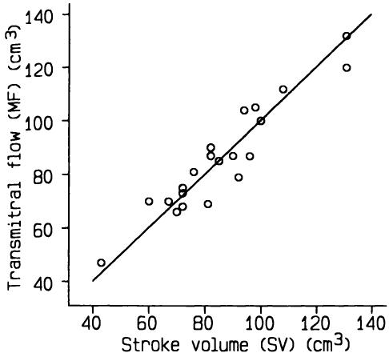  
图14.1 跨二尖瓣容积流量（MF）与左心室每搏输出量（SV）。数据来自Zhang等（1986）。  
Figure 14.1 Transmitral volumetric flow (MF) and left ventricular stroke volume (SV). Data from Zhang et al. (1986).  

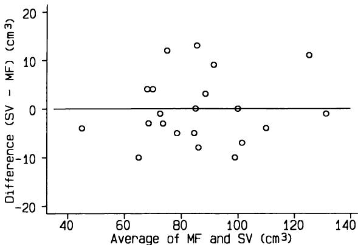  
图14.2 跨二尖瓣容积流量与左心室每搏输出量之差（SV-MF）与平均值 $(\mathbf{MF} + \mathbf{SV}) / 2$ 的散点图。  
Figure 14.2 Difference between transmitral volumetric flow and left ventricular stroke volume (SV-MF) plotted against average,  $(\mathbf{MF} + \mathbf{SV}) / 2$  

我们在第3.4节中看到，对于合理对称的分布，我们预期平均值 $\pm 2\mathbf{SD}$ 的范围将包含大约 $95\%$ 的观测值。因此，对于方法比较研究，我们可以将平均值 $\pm 2s_{diff}$ 作为个体间 $95\%$ 的一致性范围。这个值范围定义了 $95\%$ 的一致性限度。对于当前数据，我们得到的范围是  
We saw in section 3.4 that for reasonably symmetric distributions we expect the range mean  $\pm 2\mathbf{SD}$  to include about  $95\%$  of the observations. For a method comparison study we can therefore take mean  $\pm 2s_{diff}$  as a  $95\%$  range of agreement for individuals. This range of values defines the  $95\%$  limits of agreement. For the present data we get a range from  

400 医学研究中的一些常见问题  
400 Some common problems in medical research  

$$  
-0.24 - 2\times 6.96\mathrm{to} - 0.24 + 2\times 6.96  
-0.24 - 2\times 6.96\mathrm{to} - 0.24 + 2\times 6.96  
$$  

即 $- 14.2$ 到 $+13.7 \mathrm{cm}^{3}$。换句话说，对于一个新的受试者，我们预期这两种方法给出的测量值差异小于 $14 \mathrm{cm}^{3}$，且任何差异在两个方向上出现的可能性均等。  
which is  $- 14.2$  to  $+13.7 \mathrm{cm}^{3}$ . In other words, for a new subject we expect the two methods to give measurements that differ by less than  $14 \mathrm{cm}^{3}$ , with any discrepancy being equally likely in either direction.  

研究人员还比较了25名主动脉瓣疾病患者的MF和SV。图14.3比较了有病和无病患者之间方法差异。在25名主动脉瓣疾病患者中，只有2名患者的SV-MF在无病患者的 $95\%$ 一致性限度内，这支持了研究人员的预期。  
The researchers also compared MF and SV in 25 patients with aortic valve disease. Figure 14.3 compares the differences between the methods for patients with or without disease. For only two of the 25 patients with aortic valve disease was SV- MF within the  $95\%$  limits of agreement for patients without disease, supporting the researchers' expectations.  

差异的平均值和标准差的解释必须取决于临床情况—不可能用统计学来定义可接受的一致性。  
The interpretation of the mean and standard deviation of the differences must depend upon the clinical circumstances - it is not possible to use statistics to define acceptable agreement.  

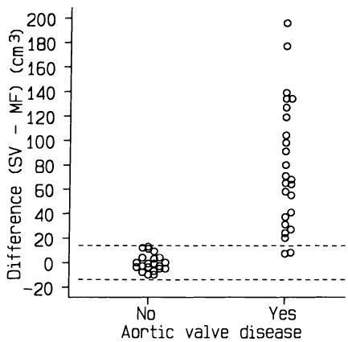  
图14.3 有或无主动脉瓣疾病患者SV与MF的差异，显示无病患者的 $95\%$ 一致性限度。  
Figure 14.3 Differences between SV and MF for patients with or without aortic valve disease, showing  $95\%$  limits of agreement for patients without disease.  

### 14.2.2 变异性一致性（差异与平均值之间的关系）  14.2.2 Variable agreement (relation between difference and mean)  

有时，将两种方法之间的差异与平均值作图时，会显示出随着平均值的增加，散布范围变得更广。换句话说，差异的标准差增加了。尽管上一节中给出的方法可能并非不合理，但通常通过在计算一致性限度之前对数据取对数可以获得更好的分析。在这里，我们隐含地认为方法之间的差异是近似恒定的比例  
Sometimes a plot of the differences between two methods against the average shows that there is a wider scatter as the average increases. In other words, the standard deviation of the differences increases. Although the approach given in the previous section may not be unreasonable, a better analysis is often obtained by taking logs of the data before calculating the limits of agreement. Here we are implicitly considering the differences between methods to be an approximately constant proportion  

测量值的大小。与前几章中描述的对数变换的其他用途一样，我们对数据的对数执行常规分析，然后对结果进行反变换。因此，一致性限度的反对数给我们提供了方法之间比例一致性的范围。例如，我们可能会得出结论，对于一个新的受试者，方法A给出的值可能在方法B获得的值的 $80\%$ 到 $130\%$ 之间。Bland和Altman（1986）讨论了这种类型的分析，并给出了一个工作示例。  
of the size of the measurement. As with other uses of the log transformation described in previous chapters, we perform the usual analysis on the logs of the data and then back- transform the results. Antilogs of the limits of agreement thus give us a range of proportional agreement between the methods. For example, we may conclude that for a new subject method A will be likely to give a value between  $80\%$  and  $130\%$  of that obtained by Method B. Bland and Altman (1986) discuss this type of analysis, and give a worked example.  

### 14.2.3 重复性  14.2.3 Repeatability  

方法比较的一个重要方面是比较每种方法的重复性。如果每种方法都对同一受试者进行了两次（或更多次）测量，那么我们就可以评估使用相同技术进行的重复测量之间的相似性。对于配对观察，我们只需计算使用相同方法进行的配对测量之间差异的标准差。然后，我们可以比较这些标准差，以确定哪种方法更具重复性。每个标准差也可以用于计算我们预期相同方法两次测量之间差异所在的限度。Bland和Altman（1986）给出了一个工作示例。  
An important aspect of method comparison is the comparison of the repeatability of each method. If we have two (or more) measurements of the same subjects by each method then we can assess the similarity of the duplicate measurements made using the same technique. For paired observations we simply calculate the standard deviation of the differences between the pairs of measurements using the same method. We can then compare the standard deviations to see which method is more repeatable. Each standard deviation can also be used to calculate limits within which we expect the differences between two measurements by the same method to lie. Bland and Altman (1986) give a worked example.  

在方法比较研究中，很少进行重复测量，因此可比性的一个重要方面经常被忽视。重复性差的方法永远不会与另一种方法很好地一致。  
Replicate measurements are rarely made in method comparison studies, so that an important aspect of comparability is often overlooked. A method with poor repeatability will never agree well with another method.  

### 14.2.4 错误的分析  14.2.4 Erroneous analyses  

方法比较研究经常被错误地分析。特别是，通常会计算两种方法之间值的相关性，并将较高的 $r$ 值解释为良好一致性的指示。相关性是一种不恰当的分析，原因有几个。首先，相关系数是衡量两个变量之间线性关联强度的指标，这与衡量一致性的指标不同。正如我们所见，一致性应直接根据测量值进行评估。不可能像解释一致性限度那样解释，例如，$r = 0.92$。其次，当一致性在临床上很差时，我们可能存在高度相关性。例如，在膝围测量变异性的一项研究中，Kirwan等人（1979）发现，两名观察者在髌骨上方 $15 \mathrm{cm}$ 处进行的测量重复性太差，以至于该测量在临床上没有价值。然而，观察者读数之间存在0.99的相关性。较高的 $r$ 值可能是因为，正如他们的研究中所示，受试者之间存在很大的变异。通过对  
Method comparison studies are frequently mis- analysed. In particular, the correlation between the values by the two methods is often calculated, with a high value of  $r$  interpreted as an indication of good agreement. There are several reasons why correlation is an inappropriate analysis. Firstly, the correlation coefficient is a measure of the strength of linear association between two variables, which is not the same as a measure of agreement. As we have seen, agreement should be assessed in terms directly related to the measurements. It is not possible to interpret, say,  $r = 0.92$  in the same way as the limits of agreement. Secondly, we may have a high degree of correlation when the agreement is clinically poor. For example, in a study of the variability of knee circumference measurements Kirwan et al. (1979) found that the repeatability of measurements made  $15 \mathrm{cm}$  above the patella by two observers was far too poor for the measurement to be clinically valuable. Nevertheless, there was a correlation of 0.99 between the observers' readings. A high value of  $r$  can be obtained because, as in their study, there is large variation between subjects. It is clearly not reasonable to assess agreement by a statistical method that is highly sensitive to the  

受试者样本选择高度敏感的统计方法来评估一致性显然是不合理的。类似的批评也可以针对使用回归分析来评估一致性。  
choice of the sample of subjects. Similar criticisms can be levelled at the use of regression analysis for assessing agreement.  

另一个常见的错误分析是通过假设检验（通常是配对 $t$ 检验）来比较均值。我们不能仅仅因为方法没有显著差异就推断它们一致性良好。事实上，差异的高度分散很可能导致均值的重要差异（偏差）不显著。使用这种方法，较差的一致性会降低发现显著差异的机会，从而增加方法看起来一致的机会！  
Another common incorrect analysis is the comparison of means by a hypothesis test, often a paired  $t$  test. We cannot deduce that methods agree well because they are not significantly different. Indeed a high scatter of differences may well lead to an important difference in means (bias) being non- significant. Using this approach worse agreement decreases the chance of finding a significant difference and so increases the chance that the methods will appear to agree!  

### 14.2.5 呈现  14.2.5 Presentation  

使用14.2.1节的方法比较测量方法非常简单且信息丰富。平均差和一致性界限对数据提供了极好的总结。有一两个图表也很有用，特别是显示差异与均值关系的图表，其他值可以作为三条水平线叠加其上。原始数据的图表，例如图14.1，应该是正方形的，并且应该显示等效线。  
Comparing methods of measurement is very simple and informative using the approach of section 14.2.1. The mean difference and limits of agreement give an excellent summary of the data. It is useful to have one or two plots as well, especially one showing the difference against the mean, on which the other values can be superimposed as three horizontal lines. A plot of the raw data, such as in Figure 14.1, should be square and should show the line of equality.  

### 14.2.6 讨论  14.2.6 Discussion  

我们应该记住这种分析的局限性。我们无法判断哪种方法更接近“真相”，因为我们通常不知道真实值。对于非重复性研究，我们也无法比较不同测量方法的重复性。重要的是要认识到，如果一种方法不准确或重复性差（或两者兼有），那么与任何其他方法的比较都将不可避免地显示出较差的一致性，无论第二种方法有多好。因此，我们不应从较差的一致性推断两种方法都差。相反，除非我们有两种既准确又可重复的方法，否则很难达到良好的一致性。  
We should remember the limitations of this type of analysis. We cannot tell which method is nearer to the 'truth' because we do not usually know the true values. Nor for unreplicated studies can we compare the repeatability of different methods of measurement. It is important to realize that if one method is either inaccurate or has poor repeatability (or both) comparison with any other method will inevitably show poor agreement, however good the second method is. Thus we should not infer from poor agreement that both methods are poor. In contrast, good agreement is most unlikely unless we have two methods that are both accurate and repeatable.  

在方法比较研究的设计中应谨慎。样本量应足够大，以便能够很好地估计一致性界限。我们可以计算一致性界限的置信区间，在小样本中这些区间会很宽。因此，对于方法比较研究，理想的样本量至少为50，但最好更大一些。对每个受试者使用每种方法进行两次测量绝对有价值，这样可以比较两种方法的重复性。分析可以基于两次重复测量的平均值，但必须对差异的标准差进行校正以考虑这一事实（Bland and Altman. 1986）。最不理想的情况是，两种被比较的技术由不同的观察者执行。观察者之间  
Care should be taken with the design of method comparison studies. The sample size should be large enough to allow the limits of agreement to be estimated well. We can calculate confidence intervals for the limits of agreement, and these will be wide in small samples. Thus a sample size of at least 50, but preferably rather larger, is desirable for a method comparison study. It is definitely valuable to take two measurements on each subject by each method, so that the repeatability of the two methods can be compared. The analysis can then be based on the average of the two replicates, but a correction must then be made to the standard deviation of the differences to allow for this fact (Bland and Altman. 1986). It is most undesirable for the two techniques being compared to be carried out by different observers. Any systematic variation between  

的任何系统性变异（一种常见现象）将与方法之间的任何差异无法区分。然而，当这些技术涉及相当大的技能和经验时，这可能是必要的。  
observers (a common phenomenon) will be inseparable from any difference between methods. This may be necessary, however, when the techniques involve considerable skill and experience.  

正如膝围示例所示，我们可以使用相同的统计方法进行观察者可比性研究。但是，在比较分类评估而非测量时，我们不能使用此方法。第14.3节讨论了此类问题，这些问题通常出现在观察者比较而非方法比较中。  
As indicated by the knee circumference example, we can use the same statistical approach for studies of observer comparability. We cannot, though, use this method when comparing assessments in categories as opposed to measurements. Section 14.3 considers such problems, which usually arise in observer comparisons rather than method comparisons.  

## 14.3 评估者间一致性  14.3 INTER-RATER AGREEMENT  

分类评估之间的一致性通常被视为比较不同评估者（观察者）将受试者分类到几个组之一的能力的问题。然而，下面概述的方法也适用于比较两种替代分类方案的研究，即分类数据的方法比较研究。我将分别考虑一个例子。  
Agreement between categorical assessments is usually considered as a problem of comparing the ability of different raters (observers) to classify subjects into one of several groups. The approach outlined below does, however, also apply to studies that compare two alternative categorization schemes, that is, a method comparison study for categorical data. I shall consider an example of each.  

表14.2显示了两名放射科医生对85张X线乳腺钼靶照片的分类，分为“正常”、“良性疾病”、“疑似癌症”或“癌症”。数据来自一项涉及九名放射科医生的更大规模研究（Boyd et al., 1982）。与上一节讨论的连续数据比较一样，我们需要某种一致性度量而非关联度量。因此，我们不使用 $\chi^{2}$ 检验，既因为我们不希望评估关联性，也因为这不是一个假设检验问题。（此外，数据是配对的）。  
Table 14.2 shows the classification by two radiologists of 85 xeromammograms as 'Normal', 'Benign disease', 'Suspicion of cancer' or 'Cancer'. The data come from a larger study of nine radiologists (Boyd et al., 1982). As with the comparison of continuous data discussed in the previous section, we require some measure of agreement rather than association. Thus we do not use the  $\chi^{2}$  test, both because we do not wish to assess association and also because this is not a hypothesis testing problem. (Further, the data are paired).  

表14.2 两名放射科医生对85张X线乳腺钼靶照片的评估（Boyd et al., 1982）  
Table 14.2 Assessments of 85 xeromammograms by two radiologists (Boyd et al., 1982)  

<table><tr><td rowspan="2">放射科医生 A 正常</td><td colspan="5">放射科医生 B</td></tr><tr><td>良性</td><td>疑似癌症</td><td>癌症</td><td>总计</td><td></td></tr><tr><td>正常</td><td>21</td><td>12</td><td>0</td><td>0</td><td>33</td></tr><tr><td>良性</td><td>4</td><td>17</td><td>1</td><td>0</td><td>22</td></tr><tr><td>疑似癌症</td><td>3</td><td>9</td><td>15</td><td>2</td><td>29</td></tr><tr><td>癌症</td><td>0</td><td>0</td><td>0</td><td>1</td><td>1</td></tr><tr><td>总计</td><td>28</td><td>38</td><td>16</td><td>3</td><td>85</td></tr></table>  
<table><tr><td rowspan="2">Radiologist A Normal</td><td colspan="5">Radiologist B</td></tr><tr><td>Benign</td><td>Suspected cancer</td><td>Cancer</td><td>Total</td><td></td></tr><tr><td>Normal</td><td>21</td><td>12</td><td>0</td><td>0</td><td>33</td></tr><tr><td>Benign</td><td>4</td><td>17</td><td>1</td><td>0</td><td>22</td></tr><tr><td>Suspected cancer</td><td>3</td><td>9</td><td>15</td><td>2</td><td>29</td></tr><tr><td>Cancer</td><td>0</td><td>0</td><td>0</td><td>1</td><td>1</td></tr><tr><td>Total</td><td>28</td><td>38</td><td>16</td><td>3</td><td>85</td></tr></table>  

### 14.3.1 测量一致性  14.3.1 Measuring agreement  

评估一致性最简单的方法是直接查看观察到的精确一致性数量，这里是 $21 + 17 + 15 + 1 = 54$。  
The simplest approach to assessing agreement is simply to see how many exact agreements were observed, which here is  $21 + 17 + 15 + 1 = 54$ .  

因此，有 $54 / 85 = 0.64$ $(64\%)$ 的影片存在一致性。这种简单计算方法有两个缺点。首先，它没有考虑一致性在表格中的具体位置；其次，即使放射科医生是随机猜测，我们也期望他们之间会偶然出现一些一致性。我们可以通过考虑超出偶然预期一致性数量的一致性来获得更合理的答案。  
There is thus agreement for  $54 / 85 = 0.64$ $(64\%)$  of the films. There are two weaknesses of this simple calculation. Firstly, it takes no account of when in the table the agreement was, and secondly, we would expect some agreement between the radiologists by chance even if they were guessing. We can get a more reasonable answer by considering the agreement n excess of the amount of agreement that we would expect by chance.  

我们在第 10.3 节中看到，频数表（在无关联的零假设下）中一个单元格的期望频数是相关列的总计与相关行的总计的乘积除以总计。因此，表 14.2 中对角线上的期望频数是  
We saw in section 10.3 that the expected frequency in a cell of a frequency table (under the null hypothesis of no association) is the product of the total of the relevant column and the total of the relevant row divided by the grand total. Thus the expected frequencies along the diagonal in Table 14.2 are  

$$  
\begin{array}{r l} & {\mathrm{Normal}\qquad \mathrm{33\times28 / 85 = 10.87}}\\ & {\mathrm{Benign~disease}\qquad \mathrm{22\times38 / 85 = 9.84}}\\ & {\mathrm{Suspected~cancer}\qquad \mathrm{29\times16 / 85 = 5.46}}\\ & {\mathrm{Cancer}\qquad \mathrm{1\times 3 / 85 = 0.04}} \end{array}  
\begin{array}{r l} & {\mathrm{Normal}\qquad \mathrm{33\times28 / 85 = 10.87}}\\ & {\mathrm{Benign~disease}\qquad \mathrm{22\times38 / 85 = 9.84}}\\ & {\mathrm{Suspected~cancer}\qquad \mathrm{29\times16 / 85 = 5.46}}\\ & {\mathrm{Cancer}\qquad \mathrm{1\times 3 / 85 = 0.04}} \end{array}  
$$  

总计  
Total  

26.20  
26.20  

因此，偶然预期的一致性数量是 26.2，占总数的比例是 $26.2 / 85 = 0.31$。因此，问题是放射科医生比 0.31 好多少。最大一致性是 1.00，所以我们可以将放射科医生的一致性表示为超出偶然预期表现的可能范围的比例，即 $1.00 - 0.31$。然后我们计算一致性为  
So the number of agreements expected just by chance is 26.2, which as a proportion of the total is  $26.2 / 85 = 0.31$ . The question, therefore, is how much better were the radiologists than 0.31. The maximum agreement is 1.00, so we can express the radiologists' agreement as a proportion of the possible scope for doing better than chance, which is  $1.00 - 0.31$ . We then calculate the agreement as  

$$  
\frac{0.64 - 0.31}{1.00 - 0.31} = 0.47.  
\frac{0.64 - 0.31}{1.00 - 0.31} = 0.47.  
$$  

这种一致性度量的名称是kappa，写作 $\kappa$。当一致性完美时，其最大值为1.00；值为零表示一致性不比随机（chance）好；负值表示一致性比随机差，但这在此情境下不太可能发生。  
The name for this measure of agreement is kappa, written  $\kappa$ . It has a maximum of 1.00 when agreement is perfect, a value of zero indicates no agreement better than chance, and negative values show worse than chance agreement, which is unlikely in this context.  

那么，我们如何解释0到1之间的值，例如0.47？虽然可以给出绝对定义，但以下指南（略微改编自Landis和Koch，1977）应该有所帮助：  
How do we interpret values between 0 and 1, such as 0.47？ While an absolute definitions are possible the following guidelines (slightly adapted from Landis and Koch, 1977) should help:  

<table><tr><td>$\kappa$ 值</td><td>一致性强度</td></tr><tr><td>&amp;lt; 0.20</td><td>差</td></tr><tr><td>0.21–0.40</td><td>一般</td></tr><tr><td>0.41–0.60</td><td>中等</td></tr><tr><td>0.61–0.80</td><td>好</td></tr><tr><td>0.81–1.00</td><td>非常好</td></tr></table>  
<table><tr><td>Value of x</td><td>Strength of agreement</td></tr><tr><td>&amp;lt; 0.20</td><td>Poor</td></tr><tr><td>0.21–0.40</td><td>Fair</td></tr><tr><td>0.41–0.60</td><td>Moderate</td></tr><tr><td>0.61–0.80</td><td>Good</td></tr><tr><td>0.81–1.00</td><td>Very good</td></tr></table>  

因此，我们可以说放射科医生之间存在中等程度的一致性。有趣的是，这两位观察者在研究中表现出所有观察者对中最好的一致性。  
We can thus say that there was moderate agreement between the radiologists. It is of some interest that these two observers showed the best agreement of any pair of observers in the study.  

将数据简化为单个数字，不可避免地会得到一个在不检查频率表的情况下意义不大的答案。实际上，任何远低于0.5的 $\kappa$ 值都将表明一致性较差，尽管可接受的一致性程度必须取决于具体情况。检查频率表是不可替代的，因为许多不同的表格会产生相似的 $\kappa$ 值。  
The reduction of the data to a single number inevitably yields an answer that is not terribly meaningful without examination of the table of frequencies. In practice, any value of  $\kappa$  much below 0.5 will indicate poor agreement, although the degree of acceptable agreement must depend upon circumstances. There is no substitute for inspecting the table of frequencies, because many different tables will yield similar values of  $\kappa$ .  

表14.3中的数据提供了一个比较分类评估替代方法的例子。这项研究的目的是比较放射变应原吸附试验（RAST）和多重RAST（MAST）两种血清特异性IgE检测方法，作为无法使用点刺试验的受试者的过敏检测。MAST是一种新的、更简单、更便宜的方法。  
An example of the comparison of alternative methods of categorical assessment is given by the data in Table 14.3. The aim of the study was to compare a radioallergosorbent (RAST) test and a multi- RAST (MAST) test on sera for specific IgE as a test of allergy in subjects for whom prick tests cannot be used. The MAST was a new, simpler and cheaper method.  

如表14.3所示，这两种方法之间存在相当大的分歧，几乎所有表格单元格中都有样本。表14.3的 $\kappa$ 值为0.32，证实了视觉印象。  
As Table 14.3 shows, there was considerable disagreement between the methods, with some samples in nearly all the cells of the table. The value of  $\kappa$  for Table 14.3 is 0.32, confirming the visual impression.  

第14.3.4节展示了计算 $\kappa$ 的数学表达式。  
Section 14.3.4 shows the mathematical expression for calculating  $\kappa$ .  

表14.3 RAST和MAST过敏血清检测方法的比较（Brostoff et al., 1984）  
Table 14.3 Comparison of RAST and MAST methods of testing serum for allergies (Brostoff et al., 1984)  

<table><tr><td rowspan="2">MAST</td><td rowspan="2">阴性 1</td><td rowspan="2">弱 2</td><td colspan="2">RAST</td><td colspan="2">极高 总计</td></tr><tr><td>中度 3</td><td>高 4</td><td>5</td><td></td></tr><tr><td>阴性 (1)</td><td>86</td><td>3</td><td>14</td><td>0</td><td>2</td><td>105</td></tr><tr><td>弱 (2)</td><td>26</td><td>0</td><td>10</td><td>4</td><td>0</td><td>40</td></tr><tr><td>中度 (3)</td><td>20</td><td>2</td><td>22</td><td>4</td><td>1</td><td>49</td></tr><tr><td>高 (4)</td><td>11</td><td>1</td><td>37</td><td>16</td><td>14</td><td>79</td></tr><tr><td>极高 (5)</td><td>3</td><td>0</td><td>15</td><td>24</td><td>48</td><td>90</td></tr><tr><td>总计</td><td>146</td><td>6</td><td>98</td><td>48</td><td>65</td><td>363</td></tr></table>  
<table><tr><td rowspan="2">MAST</td><td rowspan="2">Negative 1</td><td rowspan="2">Weak 2</td><td colspan="2">RAST</td><td colspan="2">Very high Total</td></tr><tr><td>Moderate 3</td><td>High 4</td><td>5</td><td></td></tr><tr><td>Negative (1)</td><td>86</td><td>3</td><td>14</td><td>0</td><td>2</td><td>105</td></tr><tr><td>Weak (2)</td><td>26</td><td>0</td><td>10</td><td>4</td><td>0</td><td>40</td></tr><tr><td>Moderate (3)</td><td>20</td><td>2</td><td>22</td><td>4</td><td>1</td><td>49</td></tr><tr><td>High (4)</td><td>11</td><td>1</td><td>37</td><td>16</td><td>14</td><td>79</td></tr><tr><td>Very high (5)</td><td>3</td><td>0</td><td>15</td><td>24</td><td>48</td><td>90</td></tr><tr><td>Total</td><td>146</td><td>6</td><td>98</td><td>48</td><td>65</td><td>363</td></tr></table>  

### 14.3.2 置信区间  14.3.2 Confidence interval  

我们可以获得 $\kappa$ 的标准误，从而得到一个置信区间。通常这并不是特别有用，因为除非样本量很小，否则置信区间会很窄，因此在解释上不会有太大差异。对于放射科医生的评估，我们得到 $\kappa = 0.47$，并且可以计算出 $se(\kappa) = 0.07$，因此 $\kappa$ 的95%置信区间为0.33至0.61。对于规模更大的MAST/RAST研究，$\kappa$ 为0.32，95%置信区间为0.26至0.38。计算方法在第14.3.4节中给出。  
We can obtain a standard error for  $\kappa$ , and thus a confidence interval. In general this is not all that useful because unless the sample is small the confidence interval will be narrow and thus will not allow for much variation in interpretation. For the radiologists' assessments we had  $\kappa = 0.47$  and can calculate  $se(\kappa) = 0.07$ , so that a 95% confidence interval for  $\kappa$  is given by 0.33 to 0.61. For the rather larger MAST/RAST study  $\kappa$  was 0.32 with a 95% confidence interval from 0.26 to 0.38. The method of calculation is given in section 14.3.4.  

### 14.3.3 加权kappa  14.3.3 Weighted kappa  

kappa统计量的一个缺点是它不考虑不一致的程度—所有不一致都被同等对待。当类别是有序的（这种情况经常发生）时，根据差异的大小对不一致赋予不同的权重可能更可取。在这种情况下，接近对角线的观测值（表示仅一个类别的差异）被认为不如差异为两个或三个类别的观测值严重。  
A weakness of the kappa statistic is that it takes no account of the degree of disagreement - all disagreements are treated equally. Where the categories are ordered, as is often the case, it may be preferable to give different weights to disagreements according to the magnitude of the discrepancy. Here observations near to the diagonal, representing a difference of only one category, are considered less serious than those where the discrepancy is two or three categories.  

我们可以将这个想法融入到 $\kappa$ 的计算中，得到一个称为加权kappa的量。对于MAST-RAST研究，加权kappa为 $\kappa_{\mathrm{w}} = 0.56$，这比未加权的 $\kappa = 0.32$ 稍好。类似地，放射科医生评估的加权kappa为 $\kappa_{\mathrm{w}} = 0.57$，而未加权的 $\kappa = 0.47$。加权kappa通常高于未加权kappa，因为不一致更有可能只相差一个类别，而不是相差几个类别。  
We can build this idea into the calculation of  $\kappa$  to get a quantity called weighted kappa. For the MAST- RAST study weighted kappa is  $\kappa_{\mathrm{w}} = 0.56$  somewhat better than the unweighted  $\kappa = 0.32$  . Similarly, weighted kappa for the radiologists' assessments is  $\kappa_{\mathrm{w}} = 0.57$  compared with unweighted  $\kappa = 0.47$  . Weighted kappa is usually higher than unweighted kappa because disagreements are more likely to be by only one category than by several categories.  

### 14.3.4 kappa的数学原理  14.3.4 Mathematics for kappa  

（本节可跳过，不影响连贯性。）  
(This section can be omitted without loss of continuity.)  

Kappa是根据方格频率表中对角线上的观察频率和期望频率计算的。如果 $\pmb{g}$ 个类别中有 $\pmb{n}$ 个观测值，则观察到的比例一致性为  
Kappa is calculated from the observed and expected frequencies on the diagonal of a square table of frequencies. If there are  $\pmb{n}$  observations in  $\pmb{g}$  categories, then the observed proportional agreement is  

$$  
p_{o} = \sum_{i = 1}^{g}f_{i i} / n  
p_{o} = \sum_{i = 1}^{g}f_{i i} / n  
$$  

其中 $f_{i i}$ 是类别 i 的一致数量。偶然达成一致的期望比例由下式给出  
where  $f_{i i}$  is  the  number  of  agreements  for  category  i.  The  expected proportion of agreements by chance is given by  

$$  
p_{e} = \sum_{i = 1}^{g}r_{i}c_{i} / n^{2}  
p_{e} = \sum_{i = 1}^{g}r_{i}c_{i} / n^{2}  
$$  

其中 $\pmb{r_{i}}$ 和 $c_{i}$ 分别是第 i 个类别的行总计和列总计。一致性指数 kappa 的计算公式为  
where  $\pmb{r_{i}}$  and  $c_{i}$  are the row and column totals for the ith category. The index of agreement, kappa, is given by  

$$  
\kappa = \frac{p_{o} - p_{e}}{1 - p_{e}}.  
\kappa = \frac{p_{o} - p_{e}}{1 - p_{e}}.  
$$  

$\kappa$ 的近似标准误为  
The approximate standard error of  $\kappa$  is  

$$  
s e(\kappa) = \sqrt{\frac{p_{o}(1 - p_{o})}{n(1 - p_{e})^{2}}}  
s e(\kappa) = \sqrt{\frac{p_{o}(1 - p_{o})}{n(1 - p_{e})^{2}}}  
$$  

因此，$\kappa$ 总体值的 $95\%$ 置信区间由以下公式给出  
so that a  $95\%$  confidence interval for the population value of  $\kappa$  is given by  

$$  
\kappa - 1.96 s e(\kappa)\qquad \mathrm{to}\qquad \kappa + 1.96 s e(\kappa).  
\kappa - 1.96 s e(\kappa)\qquad \mathrm{to}\qquad \kappa + 1.96 s e(\kappa).  
$$  

加权 kappa 的计算方法是根据表格中每个单元格的频率与表示一致性的对角线的距离赋予权重。对于第 $i$ 行第 $j$ 列的单元格，其观测频率为 $f_{ij}$，权重计算公式为  
Weighted kappa is obtained by giving weights to the frequencies in each cell of the table according to their distance from the diagonal that indicates agreement. For the cell in row  $i$  and column  $j$ , with observed frequency  $f_{ij}$ , a weight is calculated as  

$$  
w_{ij} = 1 - \frac{|i - j|}{g - 1}.  
w_{ij} = 1 - \frac{|i - j|}{g - 1}.  
$$  

因此，我们给对角线上的单元格赋予权重 1，而那些差异为一个类别的单元格获得权重 $1 - 1 / (g - 1)$。对于 MAST-RAST 数据，差异为 0、1、2、3 和 4 的权重分别为 1、0.75、0.5、0.25 和 0。  
Thus we give cells on the diagonal a weight of 1, while those where the difference is by one category get a weight of  $1 - 1 / (g - 1)$ . For the MAST- RAST data weights for discrepancies of 0, 1, 2, 3 and 4 are thus 1, 0.75, 0.5, 0.25 and 0 respectively.  

加权观察一致性和加权期望一致性按如下方式获得：  
The weighted observed and expected proportional agreement are obtained as  

$$  
p_{o(w)} = \frac{1}{n}\sum_{i = 1}^{g}\sum_{j = 1}^{g}w_{ij}f_{ij}  
p_{o(w)} = \frac{1}{n}\sum_{i = 1}^{g}\sum_{j = 1}^{g}w_{ij}f_{ij}  
$$  

以及  
and  

$$  
p_{e(w)} = \frac{1}{n^{2}}\sum_{i = 1}^{g}\sum_{j = 1}^{g}w_{ij}r_{i}c_{j}  
p_{e(w)} = \frac{1}{n^{2}}\sum_{i = 1}^{g}\sum_{j = 1}^{g}w_{ij}r_{i}c_{j}  
$$  

加权kappa值由下式给出：  
and weighted kappa is given by  

$$  
\kappa_{w} = \frac{p_{o(w)} - p_{e(w)}}{1 - p_{e(w)}}.  
\kappa_{w} = \frac{p_{o(w)} - p_{e(w)}}{1 - p_{e(w)}}.  
$$  

Fleiss（1981，第223页）展示了如何计算加权kappa的标准误。  
Fleiss (1981, p. 223) shows how to calculate the standard error of weighted kappa.  

### 14.3.5 讨论  14.3.5 Discussion  

与其他分析小型方格频数表的方法一样，kappa值的使用和解释也存在困难。最常被提及的问题是kappa值取决于每个类别中受试者的比例（患病率）。这可以通过一个简单的虚构例子最清楚地看出，其中我们只有两个类别。表14.4显示了两个表格，它们具有相同的0.8的比例一致性，但在两个类别（+和-）中的比例不同，并且kappa值显著不同。造成这种差异的原因是，如表14.5所示，期望的偶然频率非常不同。kappa的这一特性导致比较来自不同研究的kappa值时会产生误导，因为这些研究中类别的患病率不同。对于更大的表格，情况也是如此，但判断可比性会更加复杂。  
As with other methods of looking at small, square frequency tables, there are difficulties associated with the use and interpretation of kappa. The most often cited problem is that the value of kappa depends upon the proportion of subjects (prevalence) in each category. This can be seen most clearly using a simple artificial example, where we have only two categories. Table 14.4 shows two tables with the same proportional agreement of 0.8, but with different proportions in the two categories (+ and - ) and with markedly different values of  $\kappa$ . The reason for the difference is that the chance expected frequencies are very different, as shown in Table 14.5. The consequence of this property of  $\kappa$  is that it is misleading to compare values of  $\kappa$  from different studies where the prevalences of the categories differ. For larger tables the same is true, but it is even more complicated to judge comparability.  

表14.4 两位观察者诊断结果的比较，两个类别中患病率不同 (a)  
Table 14.4 Comparison of two observers' diagnoses with different prevalences in the two categories (a)  

<table><tr><td rowspan="2"></td><td rowspan="2"></td><td colspan="2">Observer 1</td><td rowspan="2">Total</td></tr><tr><td>+</td><td>-</td></tr><tr><td rowspan="3">Observer 2</td><td>+</td><td>70</td><td>10</td><td>80</td></tr><tr><td>-</td><td>10</td><td>10</td><td>20</td></tr><tr><td>Total</td><td>80</td><td>20</td><td>100</td></tr></table>  
<table><tr><td rowspan="2"></td><td rowspan="2"></td><td colspan="2">Observer 1</td><td rowspan="2">Total</td></tr><tr><td>+</td><td>-</td></tr><tr><td rowspan="3">Observer 2</td><td>+</td><td>70</td><td>10</td><td>80</td></tr><tr><td>-</td><td>10</td><td>10</td><td>20</td></tr><tr><td>Total</td><td>80</td><td>20</td><td>100</td></tr></table>  

$\kappa = 0.38$  
$\kappa = 0.38$  

(b)  
(b)  

<table><tr><td rowspan="2"></td><td rowspan="2"></td><td colspan="2">Observer 1</td><td rowspan="2">Total</td></tr><tr><td>+</td><td>-</td></tr><tr><td rowspan="3">Observer 2</td><td>+</td><td>40</td><td>10</td><td>50</td></tr><tr><td>-</td><td>10</td><td>40</td><td>50</td></tr><tr><td>Total</td><td>50</td><td>50</td><td>100</td></tr></table>  
<table><tr><td rowspan="2"></td><td rowspan="2"></td><td colspan="2">Observer 1</td><td rowspan="2">Total</td></tr><tr><td>+</td><td>-</td></tr><tr><td rowspan="3">Observer 2</td><td>+</td><td>40</td><td>10</td><td>50</td></tr><tr><td>-</td><td>10</td><td>40</td><td>50</td></tr><tr><td>Total</td><td>50</td><td>50</td><td>100</td></tr></table>  

$\kappa = 0.60$  
$\kappa = 0.60$  

表14.5 对应于表14.4 (a)中数据的期望频率  
Table 14.5 Expected frequencies corresponding to the data in Table 14.4 (a)  

<table><tr><td rowspan="2"></td><td rowspan="2"></td><td colspan="2">Observer 1</td><td rowspan="2">Total</td></tr><tr><td>+</td><td>-</td></tr><tr><td rowspan="3">Observer 2</td><td>+</td><td>64</td><td>16</td><td>80</td></tr><tr><td>-</td><td>16</td><td>4</td><td>20</td></tr><tr><td>Total</td><td>80</td><td>20</td><td>100</td></tr></table>  
<table><tr><td rowspan="2"></td><td rowspan="2"></td><td colspan="2">Observer 1</td><td rowspan="2">Total</td></tr><tr><td>+</td><td>-</td></tr><tr><td rowspan="3">Observer 2</td><td>+</td><td>64</td><td>16</td><td>80</td></tr><tr><td>-</td><td>16</td><td>4</td><td>20</td></tr><tr><td>Total</td><td>80</td><td>20</td><td>100</td></tr></table>  

(b)  
(b)  

<table><tr><td rowspan="2"></td><td rowspan="2"></td><td colspan="2">Observer 1</td><td rowspan="2">Total</td></tr><tr><td>+</td><td>-</td></tr><tr><td rowspan="3">Observer 2</td><td>+</td><td>25</td><td>25</td><td>50</td></tr><tr><td>-</td><td>25</td><td>25</td><td>50</td></tr><tr><td>Total</td><td>50</td><td>50</td><td>100</td></tr></table>  
<table><tr><td rowspan="2"></td><td rowspan="2"></td><td colspan="2">Observer 1</td><td rowspan="2">Total</td></tr><tr><td>+</td><td>-</td></tr><tr><td rowspan="3">Observer 2</td><td>+</td><td>25</td><td>25</td><td>50</td></tr><tr><td>-</td><td>25</td><td>25</td><td>50</td></tr><tr><td>Total</td><td>50</td><td>50</td><td>100</td></tr></table>  

另一个问题是 $\kappa$ 值取决于分类的数量。表14.3中的数据可以被归类为三类而非五类；即0、1或2、3或4。对于由此产生的 $3 \times 3$ 表，我们得到 $\kappa = 0.42$，而对于完整的 $5 \times 5$ 表，$\kappa = 0.32$。如果我们认为这些方法实际上仅用于将样本分类为阴性（0）或阳性（1、2、3或4），我们可以将数据合并为一个 $2 \times 2$ 表，此时 $\kappa = 0.53$，虽不尽如人意，但优于 $\kappa = 0.32$。  
Another problem is that  $\kappa$  depends on the number of categories. The data in Table 14.3 can be grouped into three rather than five categories; 0, 1 or 2, 3 or 4. For the resulting  $3 \times 3$  table we find  $\kappa = 0.42$ , compared with  $\kappa = 0.32$  for the full  $5 \times 5$  table. If we consider that the methods are really only going to be used to categorize samples as negative (0) or positive (1, 2, 3 or 4) we can collapse the data into a  $2 \times 2$  table, for which  $\kappa = 0.53$ , not wonderful but better than  $\kappa = 0.32$ .  

尽管存在这些缺点，但 kappa 统计量在处理本文讨论的示例数据时正变得越来越普遍。它无疑是正确的方法类型。然而，对此类数据进行不正确的分析仍然很常见。MAST-RAST 数据通过计算相关系数进行分析（Brostoff 等人，1984）。作者从 $r = 0.72$ 的值中得出结论，认为这些方法给出了相似的结果，并推荐使用更简单、更便宜的 MAST 方法。然而，皮尔逊相关系数不仅不适用于有序数据，而且正如我们在第 14.2.4 节中看到的，它是一种不适合判断一致性的方法。他们的结论也与表 14.3 中显示的数据不符。同样，通过 $\chi^{2}$ 检验来判断一致性也是不正确的，因为 $\chi^{2}$ 检验也是一种关联性检验。kappa 统计量可以解释为经过偶然性校正的比例一致性，是解决这类问题的最佳方法，但如果可能的话，展示原始数据非常重要。可接受的一致性取决于具体情况。没有一个 kappa 值可以普遍地被认为是表示良好一致性—统计数据不能简单地替代临床判断。  
Despite these shortcomings, the use of kappa is becoming common for data like the examples discussed. It is undoubtedly the right type of approach. Incorrect analyses of such data are still common, however. The MAST- RAST data were analysed by calculating the correlation coefficient (Brostoff et al., 1984). The authors concluded from the value of  $r = 0.72$  that the methods gave similar results and recommended the use of the simpler and cheaper MAST methods. Not only is Pearson's correlation coefficient unsuitable for ordinal data but, as we saw in section 14.2.4, it is an inappropriate approach to judge agreement. Nor is their conclusion compatible with the data shown in Table 14.3. Similarly, it would be incorrect to judge agreement by a  $\chi^{2}$  test, which is also a test of association. The kappa statistic, which may be interpreted as the chance- corrected proportional agreement, is the best approach to this type of problem, but it is important to show the raw data if at all possible. Acceptable agreement depends upon the circumstances. There is no value of kappa that can be regarded universally as indicating good agreement - statistics cannot provide a simple substitute for clinical judgement.  

## 14.4 诊断性检验  14.4 DIAGNOSTIC TESTS  

诊断是临床实践中不可或缺的一部分，许多医学研究都是为了改进诊断方法而进行的。这些研究的统计分析相当简单，但由于术语不熟悉和容易混淆而导致困难。  
Diagnosis is an essential part of clinical practice, and much medical research is carried out to try to improve methods of diagnosis. The statistical analysis of these studies is fairly simple, but causes difficulty because of unfamiliar and confusing terminology.  

最简单的情况是，患者可以根据某项检查（可能是 X 射线或活检，或症状或体征的存在与否）的结果分为两组。表 14.6 提供了一个示例，显示了肝脏扫描结果与基于尸检、活检或手术检查的诊断之间的关系。这里感兴趣的问题是肝脏扫描在诊断异常病理方面的效果如何。虽然我们可以简单地使用第 14.3 节中描述的方法计算两种分类之间的一致性，但这个问题有所不同，因为两种分类之间的关系是不对称的。我们希望描述扫描诊断真实患者状态的能力。在实践中，我们很少知道真相，因此根据诊断来评估检验。这种区别将在第 14.4.7 节中进一步探讨。  
The simplest case to consider is that where patients can be classified into two groups according to the results of an investigation, perhaps an X- ray or biopsy, or the presence or absence of a symptom or sign. An example is given in Table 14.6, which shows the relation between the results of liver scans and diagnosis based on either autopsy, biopsy or surgical inspection. The question of interest here is how good is the liver scan at diagnosis of abnormal pathology. While we could simply calculate the agreement between the two classifications using the methods described in section 14.3, this problem is different because of the asymmetry of the relation between the two classifications. We wish to describe the ability of the scan to diagnose the true patient status. In practice we rarely know the truth, and so evaluate the test in relation to the diagnosis. This distinction is considered further in section 14.4.7.  

410 医学研究中的一些常见问题  
410 Some common problems in medical research  

表 14.6 344 例患者肝脏扫描结果与诊断的关系（Drum 和 Christacapoulos，1972）  
Table 14.6 Relation between results of liver scan and diagnosis in 344 patients (Drum and Christacapoulos, 1972)  

<table><tr><td rowspan="2">肝脏扫描</td><td colspan="3">病理</td></tr><tr><td>异常 (+)</td><td>正常 (-)</td><td>总计</td></tr><tr><td>异常 (+)</td><td>231</td><td>32</td><td>263</td></tr><tr><td>正常 (-)</td><td>27</td><td>54</td><td>81</td></tr><tr><td>总计</td><td>258</td><td>86</td><td>344</td></tr></table>  
<table><tr><td rowspan="2">Liver scan</td><td colspan="3">Pathology</td></tr><tr><td>Abnormal (+)</td><td>Normal (-)</td><td>Total</td></tr><tr><td>Abnormal (+)</td><td>231</td><td>32</td><td>263</td></tr><tr><td>Normal (-)</td><td>27</td><td>54</td><td>81</td></tr><tr><td>Total</td><td>258</td><td>86</td><td>344</td></tr></table>  

### 14.4.1 敏感性和特异性  14.4.1 Sensitivity and specificity  

一种方法是计算肝脏扫描结果正常和异常的患者中，同样被扫描“诊断”的比例。术语“阳性”和“阴性”指代感兴趣病症（此处为异常病理）的存在或缺失。因此，有 258 例阳性患者和 86 例阴性患者。这些两组中，基于扫描获得正确诊断的比例分别为 $231 / 258 = 0.90$ 和 $54 / 86 = 0.63$。这两个比例具有令人困惑的相似名称，其正式定义如下：  
One approach is to calculate the proportions of patients with normal and abnormal liver scans who are likewise 'diagnosed' by the scan. The terms positive and negative refer to the presence or absence of the condition of interest, here abnormal pathology. Thus there are 258 positives and 86 negatives. The proportions of these two groups that have correct diagnoses based on the scan are thus  $231 / 258 = 0.90$  and  $54 / 86 = 0.63$  respectively. These two proportions have confusingly similar names which are formally defined as follows:  

敏感性是检验正确识别的阳性病例的比例；  
Sensitivity is the proportion of positives that are correctly identified by the test;  

特异度是指被检测正确识别的阴性结果的比例。  
Specificity is the proportion of negatives that are correctly identified by the test.  

因此我们可以说，根据所研究的样本，我们预期 $90\%$ 的病理异常患者会有异常（阳性）肝脏扫描结果，而 $63\%$ 的病理正常患者会有正常（阴性）肝脏扫描结果。  
We can thus say that, based on the sample studied, we would expect  $90\%$  of patients with abnormal pathology to have abnormal (positive) liver scans, while  $63\%$  of those with normal pathology would have normal (negative) liver scans.  

乍一看，这些简单的计算似乎已经回答了所提出的问题，但这些问题远比表面看起来复杂。我们只从一个方向回答了问题。在临床实践中，唯一已知的是检测结果，因此我们想知道该检测在预测异常方面的效果如何。换句话说，检测结果异常的患者中，真正异常的比例是多少？  
At first sight these simple calculations appear to have answered the question posed, but there is more to these problems than meets the eye. We have answered the question from one direction only. In clinical practice the test result is all that is known, so we want to know how good the test is at predicting abnormality. In other words, what proportion of patients with abnormal test results are truly abnormal？  

### 14.4.2 阳性预测值和阴性预测值  14.4.2 Positive and negative predictive values  

诊断性检测的全部意义在于用它来做出诊断，因此我们需要知道检测给出正确诊断的概率是多少，无论是阳性还是阴性结果。敏感度和特异度并不能提供这些信息。相反，我们必须从  
The whole point of a diagnostic test is to use it to make a diagnosis, so we need to know what the probability is of the test giving the correct diagnosis, whether it is positive or negative. The sensitivity and specificity do not give us this information. Instead we must approach the data from  

检测结果的方向来处理数据。在263名肝脏扫描异常的患者中，231名有异常病理，正确诊断的比例为 $231 / 263 = 0.88$。同样，在81名肝脏扫描正常的患者中，正确诊断的比例为 $54 / 81 = 0.67$。这两个比例有更合理的名称，其正式定义如下：  
the direction of the test results. Of the 263 patients with abnormal liver scans 231 had abnormal pathology, giving the proportion of correct diagnosis as  $231 / 263 = 0.88$ . Similarly, among the 81 patients with normal liver scans the proportion of correct diagnoses was  $54.81 = 0.67$ . These two proportions are given more sensible names, which are formally defined as follows:  

阳性预测值是指检测结果为阳性的患者中，被正确诊断的比例：  
Positive predictive value is the proportion of patients with positive test results who are correctly diagnosed:  

阴性预测值是指检测结果为阴性的患者中，被正确诊断的比例。  
Negative predictive value is the proportion of patients with negative test results who are correctly diagnosed.  

阳性预测值和阴性预测值直接评估了该检测在实践中的有用性。不幸的是，我们仍然不能停止分析，因为分析中还有一个重要的方面需要考虑，而这在上述计算中是不可见的，那就是异常的患病率。  
The positive and negative predictive values give a direct assessment of the usefulness of the test in practice. Unfortunately, we still cannot stop the analysis because there is another essential aspect of the analysis to consider, which is invisible in the above calculations, and that is the prevalence of abnormality.  

### 14.4.3 患病率的影响  14.4.3 The effect of prevalence  

敏感度和特异度的缺点在于它们无法以临床上有用的方式评估检测的准确性。然而，它们的优点是不受异常受试者比例（我们称之为患病率）的影响。这里假设我们知道患者的真实状态。关于这一点，请参阅第14.4.7节的进一步评论。  
The disadvantage of the sensitivity and specificity is that they do not assess the accuracy of the test in a clinically useful way. They do have the advantage, however, that they are not affected by the proportion of subjects with the abnormality, which we call the prevalence. It is assumed here that we know the patients' true status. See section 14.4.7 for further comment on this point.  

相比之下，预测值在临床上很有用，但它们强烈依赖于患病率。在肝脏扫描研究中，异常的患病率非常高，为 $258.344 = 0.75$；也就是说，正好是四分之三。在不同的临床环境中，异常的患病率会差异很大。利用表14.6中的数据，我构建了表14.7，以显示在异常患病率为0.25的患者组中我们预期的结果。表14.8显示了对这两种  
The predictive values, in contrast, are clinically useful but depend very strongly on the prevalence. In the liver scan study the prevalence of abnormality was very high, being  $258.344 = 0.75$ ; that is, exactly three- quarters. In different clinical settings the prevalence of abnormality will vary greatly. Using the data in Table 14.6 I constructed Table 14.7 to show the results we would expect in a group of patients where the prevalence of abnormality is 0.25. Table 14.8 shows the analyses of the data for these  

表14.7 基于表14.6数据，异常患病率为0.25时对肝脏扫描结果的预测影响  
Table 14.7 Predicted effect on liver scan results of a prevalence of abnormality of 0.25, based on data in Table 14 6  

<table><tr><td rowspan="2">肝脏扫描</td><td colspan="3">病理</td></tr><tr><td>异常 (+)</td><td>正常 (-)</td><td>总计</td></tr><tr><td>异常 (+)</td><td>77</td><td>96</td><td>173</td></tr><tr><td>正常 (-)</td><td>9</td><td>162</td><td>171</td></tr><tr><td>总计</td><td>86</td><td>258</td><td>344</td></tr></table>  
<table><tr><td rowspan="2">Liver scan</td><td colspan="3">Pathology</td></tr><tr><td>Abnormal (+)</td><td>Normal (-)</td><td>Total</td></tr><tr><td>Abnormal (+)</td><td>77</td><td>96</td><td>173</td></tr><tr><td>Normal (-)</td><td>9</td><td>162</td><td>171</td></tr><tr><td>Total</td><td>86</td><td>258</td><td>344</td></tr></table>  

412 医学研究中常见的一些问题  
412 Some common problems in medical research  

表14.8 异常患病率为0.75和0.25时肝脏扫描数据的分析  
Table 14.8 Analysis of liver scan data with prevalences of abnormality of 0.75 and 0.25  

<table><tr><td rowspan="2"></td><td colspan="2">患病率</td></tr><tr><td>0.75</td><td>0.25</td></tr><tr><td>敏感度</td><td>0.90</td><td>0.90</td></tr><tr><td>特异度</td><td>0.63</td><td>0.63</td></tr><tr><td>阳性预测值</td><td>0.88</td><td>0.45</td></tr><tr><td>阴性预测值</td><td>0.67</td><td>0.95</td></tr><tr><td>总正确预测</td><td>0.83</td><td>0.69</td></tr></table>  
<table><tr><td rowspan="2"></td><td colspan="2">Prevalence</td></tr><tr><td>0.75</td><td>0.25</td></tr><tr><td>Sensitivity</td><td>0.90</td><td>0.90</td></tr><tr><td>Specificity</td><td>0.63</td><td>0.63</td></tr><tr><td>Positive predictive value</td><td>0.88</td><td>0.45</td></tr><tr><td>Negative predictive value</td><td>0.67</td><td>0.95</td></tr><tr><td>Total correct predictions</td><td>0.83</td><td>0.69</td></tr></table>  

患病率的分析。如前所述，敏感度和特异度保持不变：这些计算是基于表格的列进行的，不受每列患者比例的影响。相比之下，检测的预测值是基于行进行的，并且由于受异常患病率的影响而发生了很大变化。表14.6和表14.7中数据的对比在图14.4中得到了说明。  
two prevalences. As noted, the sensitivity and specificity are unchanged: these calculations are made on the columns of the table, and are not affected by the proportion of patients in each column. In contrast the predictive values of the test are based on the rows, and have changed a lot because they are affected by the prevalence of abnormality. The contrast between the data in Tables 14.6 and 14.7 is illustrated in Figure 14.4.  

较低患病率的影响与我们预期的一致：真实异常越不常见，我们就越能确定阴性检测结果表明没有异常，而阳性结果真实性则越不确定。  
The effect of a lower prevalence is much as we would expect: the more uncommon is true abnormality the more sure we can be that a negative test indicates no abnormality, and the less sure that a positive result really  

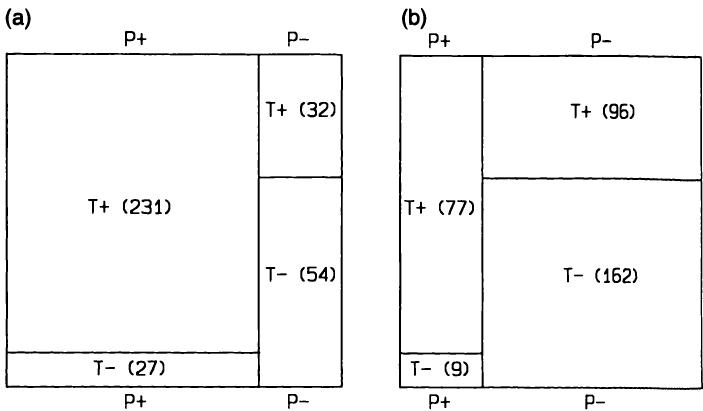  
图14.4 (a)表14.6和(b)表14.7的图形说明。P表示病理，$\mathbf{T}$表示检测。敏感度由标记为$\mathbf{T}+$的区域$\mathbf{P}+$的比例表示，在两图中相同。同样，特异度是标记为$\mathbf{T}-$的区域$\mathbf{P}-$的比例，在两图中也相同。相反，PPV是标记为$\mathbf{T}+$的区域中$\mathbf{P}+$的比例，在两图中差异显著。NPV也同样适用。  
Figure 14.4 Graphical illustration of (a) Table 14.6 and (b) Table 14.7. P indicates the pathology and  $\mathbf{T}$  indicates the test. The sensitivity is depicted by the proportion of the area  $\mathbf{P}+$  that is labelled  $\mathbf{T}+$  , and is the same in both figures. Likewise the specificity is the proportion of the area  $\mathbf{P}-$  that is labelled  $\mathbf{T}-$  , and this is the same in both figures. Conversely, the PPV is the proportion of the area labelled  $\mathbf{T}+$  that is  $\mathbf{P}+$  , and is markedly different for the two figures. The same applies to the NPV.  

表示患者异常。因此，一项检验的预测值取决于被检测患者中异常情况的患病率，而这可能并不为人所知。我们不应将样本中观察到的预测值视为普遍适用。  
indicates an abnormal patient. The predictive values of a test thus depend upon the prevalence of the abnormality in the patients being tested, which may not be known. We should not take the predictive values observed in the sample as applying universally.  

### 14.4.4 基于连续测量的诊断  14.4.4 Diagnosis based on a continuous measurement  

到目前为止，我已讨论了基于某种症状或检验结果的存在与否来判断某种异常是否存在的情况。另一种常见情况是使用连续测量值进行诊断。我在此排除高血压、贫血以及可能肥胖等由连续测量值定义的情况。我们可能有一个单一测量值，或者一个由两个或更多不同测量值组合而成的评分。在此，基于逻辑回归的判别分析（第12.5.2节）与诊断检验方法学之间的区别变得非常模糊，诊断与预后之间的区别亦是如此。  
So far I have considered the case where we wish to determine the presence or absence of some abnormality on the basis of the presence or absence of some symptom or test result. Another common situation arises when the diagnosis is to be made using a continuous measurement. I exclude here conditions such as hypertension, anaemia and perhaps obesity, which are defined by the value of a continuous measurement. We may have a single measurement or a score derived from combining two or more different measurements. Here the distinction between discriminant analysis based on logistic regression (section 12.5.2) and the methodology of diagnostic tests becomes decidedly blurred, as does that between diagnosis and prognosis.  

表14.9显示了艾滋病患者和健康献血者中HTLV-III（现为HIV）抗体检测的结果。如果我们希望使用该检验来诊断HIV血清阳性，那么我们需要选择一个合适的截断值。对于每个可能的截断值，我们都可以计算该检验的敏感性和特异性，并且还可以计算任何血清阳性患病率下的阳性预测值和阴性预测值。最后这种计算方法在第14.4.5节中给出。  
Table 14.9 shows results of an HTLV- III (now HIV) antibody assay among patients with AIDS and healthy blood donors. If we wish to use the test to diagnose HIV seropositivity then we need to choose an appropriate cut- off. For each possible cut- off we can calculate the sensitivity and specificity of the test, and we can also calculate the positive and negative predictive values for any prevalence of seropositivity. The method for this last calculation is given in section 14.4.5.  

表14.10显示了HTLV-III抗体检测结果的这些计算。预测值是在假设艾滋病患病率为 $10\%$ 或 $1\%$ 的情况下计算的，以说明患病率对  
Table 14.10 shows these calculations for the HTLV- III antibody assay results. Predictive values have been calculated assuming the prevalence of AIDS to be either  $10\%$  or  $1\%$  to illustrate the effect of the prevalence on  

表14.9 艾滋病患者和健康献血者中HTLV-III酶联免疫吸附试验（ELISA）结果（Weiss 等，1985）。（结果表示为一对检测样本的平均吸光度除以八个阴性对照孔的平均吸光度的比值）  
Table 14.9 Results of enzyme-linked immunosorbent assay (ELISA) for HTLV-III among patients with AIDS and healthy blood donors (Weiss et al., 1985). (Results expressed as the ratio of the mean absorbance of a pair of test samples divided by the mean absorbance of eight negative control wells)  

<table><tr><td>比值</td><td>健康献血者</td><td>艾滋病患者</td></tr><tr><td>&amp;lt; 2.0</td><td>202 (68%)</td><td>0 (0%)</td></tr><tr><td>2.0–2.99</td><td>73 (25%)</td><td>2 (2%)</td></tr><tr><td>3.0–3.99</td><td>15 (5%)</td><td>7 (8%)</td></tr><tr><td>4.0–4.99</td><td>3 (1%)</td><td>7 (8%)</td></tr><tr><td>5.0–5.99</td><td>2 (1%)</td><td>15 (17%)</td></tr><tr><td>6.0–11.99</td><td>2 (1%)</td><td>36 (41%)</td></tr><tr><td>12.0 +</td><td>0 (0%)</td><td>21 (24%)</td></tr><tr><td>总计</td><td>297 (100%)</td><td>88 (100%)</td></tr></table>  
<table><tr><td>Ratio</td><td>Healthy blood donors</td><td>Patients with AIDS</td></tr><tr><td>&amp;lt; 2.0</td><td>202 (68%)</td><td>0 (0%)</td></tr><tr><td>2.0–2.99</td><td>73 (25%)</td><td>2 (2%)</td></tr><tr><td>3.0–3.99</td><td>15 (5%)</td><td>7 (8%)</td></tr><tr><td>4.0–4.99</td><td>3 (1%)</td><td>7 (8%)</td></tr><tr><td>5.0–5.99</td><td>2 (1%)</td><td>15 (17%)</td></tr><tr><td>6.0–11.99</td><td>2 (1%)</td><td>36 (41%)</td></tr><tr><td>12.0 +</td><td>0 (0%)</td><td>21 (24%)</td></tr><tr><td>Total</td><td>297 (100%)</td><td>88 (100%)</td></tr></table>  

表14.10 表14.9数据的敏感性、特异性、阳性预测值（PPV）和阴性预测值（NPV）计算  
Table 14.10 Calculations of sensitivity, specificity, positive predictive value (PPV) and negative predictive value (NPV) for data in Table 14.9  

<table><tr><td rowspan="2">比值截断点</td><td rowspan="2">敏感性</td><td rowspan="2">特异性</td><td colspan="4">HIV血清阳性患病率</td></tr><tr><td>PPV</td><td>NPV</td><td>PPV</td><td>NPV</td></tr><tr><td>2.0</td><td>1.00</td><td>0.68</td><td>0.26</td><td>1.00</td><td>0.03</td><td>1.00</td></tr><tr><td>3.0</td><td>0.98</td><td>0.93</td><td>0.59</td><td>0.997</td><td>0.12</td><td>0.9997</td></tr><tr><td>4.0</td><td>0.90</td><td>0.98</td><td>0.81</td><td>0.99</td><td>0.28</td><td>0.999</td></tr><tr><td>5.0</td><td>0.82</td><td>0.99</td><td>0.87</td><td>0.98</td><td>0.38</td><td>0.998</td></tr><tr><td>6.0</td><td>0.65</td><td>0.99</td><td>0.91</td><td>0.96</td><td>0.49</td><td>0.996</td></tr><tr><td>12.0</td><td>0.24</td><td>1.00</td><td>1.00</td><td>0.92</td><td>1.00</td><td>0.992</td></tr></table>  
<table><tr><td rowspan="2">Cut-off for ratio</td><td rowspan="2">Sensitivity</td><td rowspan="2">Specificity</td><td colspan="4">Prevalence of HIV seropositivity</td></tr><tr><td>PPV</td><td>NPV</td><td>PPV</td><td>NPV</td></tr><tr><td>2.0</td><td>1.00</td><td>0.68</td><td>0.26</td><td>1.00</td><td>0.03</td><td>1.00</td></tr><tr><td>3.0</td><td>0.98</td><td>0.93</td><td>0.59</td><td>0.997</td><td>0.12</td><td>0.9997</td></tr><tr><td>4.0</td><td>0.90</td><td>0.98</td><td>0.81</td><td>0.99</td><td>0.28</td><td>0.999</td></tr><tr><td>5.0</td><td>0.82</td><td>0.99</td><td>0.87</td><td>0.98</td><td>0.38</td><td>0.998</td></tr><tr><td>6.0</td><td>0.65</td><td>0.99</td><td>0.91</td><td>0.96</td><td>0.49</td><td>0.996</td></tr><tr><td>12.0</td><td>0.24</td><td>1.00</td><td>1.00</td><td>0.92</td><td>1.00</td><td>0.992</td></tr></table>  

预测值。没有理由使用研究数据中的患病率 $(23\%)$，因为这没有意义，因为两组受试者样本是独立选择的。要使用的适当数值将取决于所研究人群的特征。  
predictive values. There is no reason to use the prevalence in the study data  $(23\%)$  which has no meaning because the two samples of subjects were selected independently. The appropriate figure to use will depend upon the characteristics of the population being studied.  

截断点的选择并非统计学决策。假设表14.10中的数值表明该检测具有临床实用性，那么“最佳”截断点必须根据与假阳性及假阴性检测结果相关的相对成本（不一定是经济成本）来选择。这反过来又与阳性检测结果后将采取的临床行动有关，特别是该检测是筛查性检测还是诊断性检测（参见第14.4.7节）。然而，并非总是需要设定截断点，正如我们将在下文看到的那样。是否需要设定截断点取决于目的是进行诊断还是预后。同样，这不是一个统计学问题。  
The choice of a cut- off is not a statistical decision. Assuming that it is felt that the values in Table 14.10 show that the test is clinically useful, then the 'best' cut- off must be chosen according to the relative costs (not necessarily financial) associated with a false positive and false negative test results. This in turn will be related to the clinical action that will follow a positive test, in particular whether the test is a screening test or a diagnostic test (see section 14.4.7). It is not always necessary, however, to impose a cut- off, as we will see below. The need to do so depends on whether the aim is to make a diagnosis or a prognosis. Again, this is not a statistical issue.  

多重回归分析的结果也能得出类似的情况。正如我们在第12.4.8节中看到的，回归模型可以用于推导连续评分或预后指数。当结局变量是二分类的且使用逻辑回归时，该预后指数可以转换为该结局存在（或不存在）的概率。在第12.5.2节中，我描述了逻辑回归在判别问题中的应用。将其用于诊断是一个很小的跨越；事实上，这两个概念可以说是一致的。  
We can arrive at a similar situation with the results of a multiple regression analysis. As we saw in section 12.4.8 a regression model can be used to derive a continuous score or prognostic index. When the outcome variable is binary and logistic regression is used, that prognostic index can be converted into a probability of the presence (or absence) of that outcome. In section 12.5.2 I described the application of logistic regression to the problem of discrimination. It is a small jump to the use of the same model for diagnosis; indeed, the two concepts are arguably the same.  

在下一节中，将更详细地探讨这些计算。  
In the next section the calculations are examined more closely.  

### 14.4.5 计算  14.4.5 Calculations  

表14.11展示了基于二分类指标（如特定症状的存在或缺失）的任何诊断检测的通用表示。  
Table 14.11 shows a general representation of any diagnostic test based on a binary indicator, such as the presence or absence of a particular symptom  

表14.11 诊断检测的通用表示  
Table 14.11 General representation of a diagnostic test  

<table><tr><td rowspan="2" colspan="2"></td><td colspan="3">疾病状态</td></tr><tr><td>阳性</td><td>阴性</td><td>总计</td></tr><tr><td rowspan="3">检测</td><td>阳性</td><td>a</td><td>b</td><td>a + b</td></tr><tr><td>阴性</td><td>c</td><td>d</td><td>c + d</td></tr><tr><td>总计</td><td>a + c</td><td>b + d</td><td>n</td></tr></table>  
<table><tr><td rowspan="2" colspan="2"></td><td colspan="3">Disease status</td></tr><tr><td>Positive</td><td>Negative</td><td>Total</td></tr><tr><td rowspan="3">Test</td><td>Positive</td><td>a</td><td>b</td><td>a + b</td></tr><tr><td>Negative</td><td>c</td><td>d</td><td>c + d</td></tr><tr><td>Total</td><td>a + c</td><td>b + d</td><td>n</td></tr></table>  

或检测结果。我们可以给这四个单元格命名：  
or test result. We can give names to the four cells:  

<table><tr><td>检测</td><td>疾病状态</td><td>名称</td></tr><tr><td>+</td><td>+</td><td>真阳性 (a)</td></tr><tr><td>+</td><td>-</td><td>假阳性 (b)</td></tr><tr><td>-</td><td>+</td><td>假阴性 (c)</td></tr><tr><td>-</td><td>-</td><td>真阴性 (d)</td></tr></table>  
<table><tr><td>Test</td><td>Disease status</td><td>Name</td></tr><tr><td>+</td><td>+</td><td>True positive (a)</td></tr><tr><td>+</td><td>-</td><td>False positive (b)</td></tr><tr><td>-</td><td>+</td><td>False negative (c)</td></tr><tr><td>-</td><td>-</td><td>True negative (d)</td></tr></table>  

前面定义和讨论的量是  
The quantities defined and discussed earlier are  

阳性预测值 $= a / (a + b)$  
Positive predictive value  $= a / (a + b)$  

阴性预测值 $= d / (c + d)$  
Negative predictive value  $= d / (c + d)$  

术语“假阳性率”和“假阴性率”有时会被使用，但这些名称是模棱两可的。例如，假阴性率可能是 $c / (c + d)$ 或 $c / (a + c)$，这取决于你的观点。  
The terms false positive rate and false negative rate are sometimes used, but these names are ambiguous. For example, the false negative rate might be  $c / (c + d)$  or  $c / (a + c)$ , depending on your point of view.  

研究中观察到的疾病患病率为 $(a + c) / n$。如果研究是在一个可明确定义的患者群体中进行的，例如在特定诊所就诊的患者，那么患病率可能是有用的，基于该患病率计算阳性预测值和阴性预测值也可能是有用的。然而，更普遍地，我们可能希望考虑该检验对于具有其他疾病患病率的群体（例如不同年龄组甚至普通人群）的预测能力。这些计算依赖于贝叶斯定理，即：  
The observed prevalence of disease in the study is  $(a + c) / n$ . If the study is carried out on a definable group of patients, such as those attending a particular clinic, then the prevalence may be useful, as may the calculation of positive and negative predictive values based on that prevalence. More generally, however, we may wish to consider the predictive ability of the test for groups with other prevalences of disease, such as different age groups or even the general population. These calculations depend upon Bayes' theorem, which is that  

Prob(疾病|检验阳性) = Prob(检验阳性|疾病) × Prob(疾病) Prob(检验阳性) = Prob(检验阳性|疾病) × Prob(疾病) + Prob(检验阳性|无疾病) × Prob(无疾病)  
Prob(disease|test positive) = Prob(test positive|disease) × Prob(disease)  Prob(test positive)  = Prob(test positive|disease) × Prob(disease) +  Prob(test positive|no disease) × Prob(no disease)  

其中Prob(疾病|检验阳性)表示当  
where Prob(disease|test positive) means the probability of disease when the  

检验结果为阳性时患病的概率，依此类推。从之前的定义可以清楚地看出：  
test is positive, and so on. From the earlier definitions it is clear that  

Prob(疾病) $=$ 疾病患病率  
Prob(disease)  $=$  prevalence of disease  

Prob(疾病|检验阳性) $=$ 阳性预测值 (PPV)  
Prob(disease|test positive)  $=$  positive predictive value (PPV)  

Prob(检验阳性|疾病) $=$ 敏感度  
Prob(test positive|disease)  $=$  sensitivity  

Prob(test positive| no disease)  $= 1$  - 特异度  
Prob(test positive| no disease)  $= 1$  - specificity  

因此，我们可以将上述关于检测结果为阳性时患病概率的方程改写为  
so that we can rewrite the above equation for the probability of disease when the test is positive as  

阳性预测值 (PPV) = 敏感度  $\times$  患病率 / [敏感度  $\times$  患病率  $+$  (1 - 特异度)  $\times$  (1 - 患病率)]  
sensitivity  $\times$  prevalence PPV = sensitivity  $\times$  prevalence  $+$  (1 - specificity)  $\times$  (1 - prevalence)  

通过类似的论证，我们可以得出阴性预测值 (NPV) 为  
By a similar argument we can show that the negative predictive value (NPV) is  

阴性预测值 (NPV) = 特异度  $\times$  (1 - 患病率) / [(1 - 敏感度)  $\times$  患病率  $+$  特异度  $\times$  (1 - 患病率)]  
specificity  $\times$  (1 - prevalence) NPV = (1 - sensitivity)  $\times$  prevalence  $+$  specificity  $\times$  (1 - prevalence)  

这些公式有两个明显的推论。首先，可以简单地估算任何患病率下的预测值。患病率变化的影响可能很显著，如表14.10所示。其次，如果我们对患病率一无所知，就无法估算该检测的预测值。解释患病率的另一种方式是，在检测进行之前，受试者患病的概率，这被称为疾病的先验概率。PPV和  $1 - \mathsf{N P V}$  的值是针对检测结果为阳性和阴性的受试者，对相同概率的修正估计，被称为后验概率。先验概率和后验概率之间的差异是评估检测有用性的一种方法。  
Two consequences of these formulae are clear. Firstly, it is simple to estimate the predictive values for any prevalence of disease. The effect of varying the prevalence can be marked, as is seen in Table 14.10. Secondly. if we have no idea of the prevalence we cannot estimate the predictive value of the test. Another way of interpreting the prevalence is as the probability before the test is carried out that the subject has the disease. known as the prior probability of disease. The values of PPV and  $1 - \mathsf{N P V}$  are the revised estimates of the same probability for those subjects who are positive and negative to the test, and are known as posterior probabilities. The difference between the prior and posterior probabilities is one way of assessing the usefulness of the test.  

我们可以将这些思想扩展到基于连续测量的诊断，通过依次考虑每个可能的截断点。表14.10阐述了检测结果与HIV血清阳性率之间关联的程序。  
We can extend these ideas to diagnosis based on a continuous measurement, by considering each possible cut- off in turn. Table 14.10 illustrated the procedure for the association between assay results and HIV seroposi tivity.  

敏感度和特异度是比例，因此我们可以使用第10.2.1节的方法计算它们的置信区间。当在同一批个体样本上比较两种诊断检测时，敏感度和特异度是配对的，因此应使用适当的置信区间（第10.4.1节）和McNemar检验（第10.7.5节）。  
The sensitivity and specificity are proportions, and so we can calculate confidence intervals for them using the methods of section 10.2.1. When two diagnostic tests are compared on the same sample of individuals, the sensitivities and specificities are paired and so the appropriate confidence interval (section 10.4.1) and the McNemar test (section 10.7.5) should be used.  

### 14.4.6 诊断检测的另外两种视角  14.4.6 Two further ways of looking at diagnostic tests  

（本节可以省略，不影响连贯性。）  
(This section can be omitted without loss of continuity.)  

诊断测试数据的表面简单性，特别是当它们以2乘2表格形式呈现时，被表达结果的多种方式所掩盖。  
The apparent simplicity of diagnostic test data, particularly when presented as a 2 by 2 table, is belied by the many ways of expressing the results.  

在这里，我将考虑另外两种比简单地查看敏感性和特异性更具信息量的方法。  
Here I consider two further approaches that are more informative than simply looking at sensitivity and specificity.  

#### (a) 似然比  (a) The likelihood ratio  

对于任何测试结果，我们可以比较如果患者确实患有所关注的疾病时获得该结果的概率，与如果患者健康时获得相应结果的概率。这些概率的比率称为似然比（LR），其计算公式为  
For any test result we can compare the probability of getting that result if the patient truly had the condition of interest with the corresponding probability if they were healthy. The ratio of these probabilities is called the likelihood ratio (LR), and it is calculated as  

$$  
\mathrm{LR} = \frac{\mathrm{Prob}(\mathrm{positive~test}|\mathrm{disease})}{\mathrm{Prob}(\mathrm{positive~test}|\mathrm{no~disease})} = \frac{\mathrm{sensitivity}}{1 - \mathrm{specificity}}  
\mathrm{LR} = \frac{\mathrm{Prob}(\mathrm{positive~test}|\mathrm{disease})}{\mathrm{Prob}(\mathrm{positive~test}|\mathrm{no~disease})} = \frac{\mathrm{sensitivity}}{1 - \mathrm{specificity}}  
$$  

我们可以将似然比视为指示该测试对于增加阳性诊断确定性的价值。患病率是测试执行前患病的概率。因此，患病的几率表示为患病率/(1 - 患病率)。因此，如果患病率为 $10\%$，则几率为0.11，或者说患病可能性为9比1。我们可以将此数值称为检验前几率，将与阳性预测值对应的几率称为检验后几率。不难从数学上证明  
We can consider the likelihood ratio as indicating the value of the test for increasing certainty about a positive diagnosis. The prevalence is the probability of disease before the test is performed. The odds of having the disease are thus given as prevalence/(1 - prevalence). Thus if the prevalence is  $10\%$ , the odds are 0.11, or 9 to 1 against the disease being present. We can call this figure the pre- test odds, and the odds corresponding to the positive predictive value as the post- test odds. It is not difficult mathematically to show that  

检验后几率 $=$ 检验前几率 $\times$ 似然比  
Post- test odds  $=$  pre- test odds  $\times$  likelihood ratio  

这表明似然比如何衡量诊断确定性的变化。  
demonstrating how the likelihood ratio measures the change in certainty of diagnosis.  

对于表14.6中的数据，异常病理的患病率为0.75，因此检验前患病几率为 $0.75 / (1 - 0.75) = 3.0$。给定阳性测试结果的检验后患病几率为 $0.878 / (1 - 0.878) = 7.22$，似然比为 $0.895 / (1 - 0.628) = 2.406$，这证明了这三个量之间的既定关系 $(7.22 = 3.0 \times 2.406)$。对于表14.7中的数据，似然比相同，但检验前患病几率为 $0.25 / (1 - 0.25) = 0.33$。我们可以得到检验后几率为 $2.406 \times 0.33 = 0.79$。  
For the data in Table 14.6 the prevalence of abnormal pathology is 0.75, so the pre- test odds of disease are  $0.75 / (1 - 0.75) = 3.0$ . The post- test odds of disease given a positive test are  $0.878 / (1 - 0.878) = 7.22$ , and the likelihood ratio is  $0.895 / (1 - 0.628) = 2.406$ , demonstrating the stated relation between these three quantities  $(7.22 = 3.0 \times 2.406)$ . For the data in Table 14.7 the likelihood ratio is the same, but the pre- test odds of disease are  $0.25 / (1 - 0.25) = 0.33$ . We can obtain the post- test odds as  $2.406 \times 0.33 = 0.79$ .  

这种方法可能为诊断测试数据的解释提供进一步的见解，但它没有增加新的信息，因为使用的量与之前相同。正如我刚才所示，高似然比可能表明该测试有用，但它不一定表明阳性测试是疾病存在的良好指标。对于表14.7中的数据，0.25的低患病率意味着阳性测试结果的人仍然更有可能是正常的而不是异常的—这可以从0.81的检验后几率和0.45的PPV中看出。然而，使用几率而不是概率可能有所帮助，特别是对于通过似然比评估测试的有用性（Ingelfinger et al., 1987, p. 25）。  
This approach may give further insight into the interpretation of diagnostic test data, but it does not add new information because the same quantities are used as before. As I have just shown, a high likelihood ratio may demonstrate that the test is useful but it does not necessarily indicate that a positive test is a good indicator of the presence of disease. For the data in Table 14.7, the low prevalence of 0.25 means that someone with a positive test is still more likely to be normal than abnormal - this is seen from both the post- test odds of 0.81 and the PPV of 0.45. Using odds rather than probabilities may be helpful, however, especially for seeing the usefulness of the test as assessed by the likelihood ratio (Ingelfinger et al., 1987, p. 25).  

#### (b) ROC 曲线   (b) ROC curve   

当使用某项测量进行诊断时，选择“最佳”临界值并非易事。一种图形方法是针对每个可能的临界值，绘制敏感度与 1 - 特异度的关系图，并将这些点连接起来。由此得到的曲线被称为“受试者工作特征”曲线或 ROC 曲线，因为该方法起源于雷达操作员信号检测的研究。对于表 14.10 中的数据，该曲线将基于第二列和第三列。然而，ROC 曲线对于这些数据而言帮助不大，因为特异度非常高，以至于“曲线”沿着 $y$ 轴延伸。如果假阴性结果的“成本”与假阳性结果的“成本”相同，则最佳临界值是使敏感度和特异度之和最大化的点，即最接近左上角的点。如果成本不同，则很难从图中确定最佳点。  
When a measurement is used to make a diagnosis the choice of the 'best' cut- off is not simple. A graphical approach is to plot the sensitivity versus 1 - specificity for each possible cut- off, and to join the points. The curve thus obtained is known as a 'receiver operating characteristic' curve or ROC curve, because the method originated in studies of signal detection by radar operators. For the data in Table 14.10 the curve would thus be based on the second and third columns. However, the ROC curve is not very helpful for these data because the specificities are so high that the 'curve' follows the  $y$  axis. If the 'cost' of a false negative result is the same as that of a false positive result, the best cut- off is that which maximizes the sum of the sensitivity and specificity, which is the point nearest the top left- hand corner. With different costs it is hard to note the best point from the graph.  

ROC 方法在比较两种或多种竞争方法时可能最为有用。对于单个检验，它不能为表格增加任何信息，但当存在许多可能的临界值时，它更受青睐。当然，ROC 曲线仅基于敏感度和特异度，未考虑所检测疾病的患病率。  
The ROC method is perhaps most useful when comparing two or more competing methods. For a single test it does not add anything to a table but it is preferable when there are many possible cut- off values. Of course, the ROC curve, being based only on sensitivity and specificity, takes no account of the prevalence of the disease being tested for.  

### 14.4.7 患者的真实状况是什么？  14.4.7 What is the patient's true condition？  

在第 14.4.3 节中，我观察到从受试者样本计算出的敏感度和特异度与异常患病率无关。这可能并非总是如此。我们可以考虑三种对患者进行分类的方式—他们的真实状况、诊断和检验结果。当我们计算检验的敏感度和特异度时，我们是根据诊断进行的，但我们不一定知道诊断总是正确的。除非诊断是完美的，即它总是能给出患者的真实状态（阳性或阴性），否则我们评估的是检验预测诊断的能力，而不是患者的真实疾病状态。在这种情况下，检验相对于真实状态的敏感度和特异度与异常患病率相关（Begg，1987）。这表明，除非已知诊断几乎总是正确的，否则明智的做法是在与未来将使用该检验的患者具有相同疾病患病率的患者身上评估诊断检验。  
In section 14.4.3 I observed that the sensitivity and specificity calculated from a sample of subjects are unrelated to the prevalence of abnormality. This may not always be the case. We can consider three ways of categorizing a patient - their true condition, the diagnosis, and the test results. When we calculate the sensitivity and specificity of the test we do this in relation to the diagnosis, but we do not necessarily know that the diagnosis is always correct. Unless the diagnosis is perfect, so that it always gives the patient's true status (positive or negative), we are evaluating the test's ability to predict the diagnosis rather than the patient's true disease status. In this case, the sensitivity and specificity of the test in relation to the true state are related to the prevalence of abnormality (Begg, 1987). This suggests that unless it is known that the diagnosis is almost always correct, it is wise to evaluate a diagnostic test on patients with the same prevalence of disease as those for whom the test will be used in future.  

### 14.4.8 讨论  14.4.8 Discussion  

诊断检验数据的分析不需要复杂的数学。主要困难不是统计学上的，而是需要决定检验的优劣程度才能具有临床价值。这个问题的答案与被检测受试者中疾病的患病率有关。两个极端情况是：当我们检测高危个体时，可能是在三级转诊中心；以及当我们筛查表面健康的群体以发现罕见严重疾病的早期迹象时，例如  
The analysis of data from diagnostic tests requires no complicated mathematics. The main difficulty is not statistical, but rather the need to decide how good the test should be to be clinically valuable. The answer to this question is related to the prevalence of the disease in the subjects being tested. Two extremes are when we are testing high risk individuals. perhaps in a tertiary referral centre, and when we are screening an ostensibly healthy population for early signs of rare serious disease, such as  

宫颈癌。对于筛查试验，拥有高特异度和阴性预测值（NPV）非常重要。我们不希望出现假阴性结果，并且愿意接受适量的假阳性结果。所有筛查试验阳性的个体都将再次接受检测，通常使用不同的试验。在这种情况下，要求将是高敏感度和阳性预测值（PPV），因为阳性结果很可能导致疾病诊断和临床干预。当然，高特异度也是可取的。HIV 血清阳性的检测就是一个很好的例子，假阳性诊断对患者会产生重大后果，同样，假阴性诊断对接受输血的人也会产生重大后果。另一个例子是使用羊膜穿刺术检测的甲胎蛋白水平来检测唐氏综合征胎儿。在决定表 14.9 中数据阳性与阴性诊断的临界值，或者实际上是否明智地设置任何临界值时，必须仔细权衡这些问题。  
cervical cancer. For screening tests it is very important to have high specificity and NPV. We do not want false negative results and are willing to accept a moderate number of false positive results. All those positive to the screening test will then be tested again, usually with a different test. Here the requirement will be a high sensitivity and PPV, because a positive result will probably lead to a diagnosis of disease and clinical intervention. A high specificity is also desirable, of course. The detection of HIV seropositivity is a good example of the case where the importance of a false positive diagnosis would have major consequences for the patient and so would a false negative diagnosis for someone receiving their blood in a transfusion. Another is the use of alpha- fetoprotein levels from amniocentesis to detect fetuses with Down's syndrome. These issues must be carefully weighed up when deciding where to put the cut- off between positive and negative diagnosis in the data in Table 14.9 or, indeed, whether it is wise to impose any cut- off.  

一种可以更频繁采用的方法是使用诊断检验将受试者分为三组，其中一个居中的“不确定”组将接受进一步的检测。对于表 14.9 所示的数据，Weiss 等人（1985）将介于 3.0 和 5.0 之间的检测结果视为“临界值”。  
One approach that could be adopted more frequently is to use the diagnostic test to divide subjects into three groups, with a central, 'uncertain' group who would be subjected to further testing. For the data shown in Table 14.9 Weiss et al., (1985) considered assay results between 3.0 and 5.0 as 'borderline'.  

最后，与本章前面章节的联系是，一个好的诊断检验要求结果具有可重复性，并且观察者间变异最小。  
Finally, a link with the earlier sections of this chapter is that it is a requirement of a good diagnostic test that the result is repeatable and is subject to minimal inter- observer variation.  

关于诊断测试的方法学和解释的进一步讨论，可参见 Sheps 和 Schechter（1984）的论文，麦克马斯特大学临床流行病学与生物统计学系的一系列文章（1983），以及 Galen 和 Gambino（1975）和 Ingelfinger 等人（1987）的著作。临床诊断的逻辑和计算机应用由 Macartney（1987）进行了综述。  
Further discussion of the methodology and interpretation of diagnostic tests can be found in the paper by Sheps and Schechter (1984), the series of articles from the Department of Clinical Epidemiology and Biostatistics at McMaster University (1983) and in the books by Galen and Gambino (1975) and Ingelfinger et al. (1987). The logic of clinical diagnosis and computer applications are reviewed by Macartney (1987).  

## 14.5 参考区间  14.5 REFERENCE INTERVALS  

诊断测试利用患者数据将个体分类为正常或异常。一个相关的统计问题是描述正常个体的变异性，以提供评估其他个体测试结果的基础。呈现此类数据最常见的形式是作为值的范围或区间，该区间包含从大多数正常受试者样本中获得的值。参考区间通常被称为正常范围或参考范围。“参考区间”是一个更好的术语，因为它既避免了与统计意义上的“正态”（Normal）混淆，也因为“范围”（range）一词暗示被排除的值按定义是异常的。  
Diagnostic tests use patient data to classify individuals as either normal or abnormal. A related statistical problem is the description of variability in normal individuals, to provide a basis for assessing test results for other individuals. The most common form of presenting such data is as a range of values, or interval, which encompasses the values obtained from the majority of a sample of normal subjects. The reference interval is often referred to as a normal range or reference range. 'Reference interval' is a better term, both because it avoids confusion with Normal in the statistical sense, and also because the word 'range' suggests that values excluded are by definition abnormal.  

参考区间最常用于临床化学，例如提供一个标准参考，用于评估正在调查的患者血样中的胆固醇  
Reference intervals are used most often in clinical chemistry, for example to provide a standard reference against which to assess cholesterol  

水平。与诊断测试一样，所需的计算本质上是简单的，大多数问题都与解释相关。需要注意的一点是，该过程等同于一个诊断测试，其中我们知道特异性（通常是 $90\%$ 或 $95\%$），但没有其他信息。显然，此类信息不应单独用于做出诊断。关于参考区间概念的详细讨论可在 Solberg（1987）及其引用的论文中找到。  
levels in blood samples from patients under investigation. As with diagnostic tests the calculations required are essentially simple and most of the problems are associated with interpretation. One point to note is that the procedure is equivalent to a diagnostic test where we know the specificity (usually  $90\%$  or  $95\%$  ) but nothing else. Clearly such information should not be used on its own to make a diagnosis. Detailed discussion on the concepts of reference intervals are given in Solberg (1987) and the papers cited therein.  

### 14.5.1 样本选择  14.5.1 Selecting a sample  

“正常性”的概念是难以捉摸的，任何定义都将特定于其语境。参考区间通常来源于在医院采集的样本，这些受试者随后被发现没有严重疾病，但医院里的人在代表健康人群的意义上并非正常。因此，描述如何选择参考受试者以及如何确定其健康状况至关重要。  
The concept of 'normality' is elusive, and any definition will be specific to the context. Reference intervals are often derived from samples taken in hospital from subjects subsequently found not to be seriously ill, but people in hospital are not normal in the sense of being representative of the healthy population. It is essential to describe how the reference subjects were selected and on what basis their health was determined.  

样本量也是一个重要的考虑因素，将在第 14.5.3 节中讨论。此外，不同受试者组之间感兴趣测量的分布可能存在变异。特别是，经常需要为男性和女性分别计算区间。年龄也常有变异，尤其是在儿童中；此主题将在第 14.5.4 节中讨论。  
Sample size is also an important consideration, and is discussed in section 14.5.3. Also there may be variation in the distribution of the measurement of interest between different groups of subjects. In particular it is frequently necessary to calculate separate intervals for males and females. There is often also variation by age, especially among children; this topic is considered in section 14.5.4.  

### 14.5.2 参考区间的计算  14.5.2 Calculating the reference interval  

参考区间简单来说就是估计的数值范围，它包含了相关人群中特定百分比的数值。与前几章讨论的其他区间一样，参考区间通常包含 $90\%$、$95\%$ 或 $99\%$ 的数值，其中 $95\%$ 是最常用的。无论低值和高值都被认为是可疑的，还是只有极端值被认为是可疑的，都使用相同的方法。  
The reference interval is simply the estimated range of values that includes a certain percentage of the values among the relevant population. As with other intervals discussed in earlier chapters, reference intervals usually encompass  $90\%$  ,  $95\%$  or  $99\%$  of the values, with  $95\%$  the most frequently used. The same method is used whether both low and high values are considered suspicious or only those at one extreme.  

计算参考区间有两种基本方法。我们可以从观测值的经验分布中获取适当的（百分）位数，或者我们可以使用正态分布，可能在数据转换后使用。例如，许多血清成分具有对数正态分布。因此，这些选项与第3.4节中介绍的用于汇总一组观测值分布的通用方法相同。在该节中，分析了298名0至6岁健康儿童的血清IgM值。在第3.4.2节中，$2_{2}^{1}$和$97_{2}^{1}$百分位数分别计算为0.2和$2.0 \mathrm{g / l}$。因此，0.2到2.0的数值范围使用百分位数法定义了$95\%$参考区间。IgM的分布是偏斜的（图3.3），但$\log_{10} \mathrm{IgM}$具有对称分布（图3.13），均值为$- 0.158$，标准差为$0.238$。  
There are two basic approaches to the calculation. We can either take the appropriate (per)centiles from the empirical distribution of the observations, or we can use the Normal distribution, perhaps after transforming the data. Many serum constituents, for example, have Lognormal distributions. The options are thus the same as for the general methods introduced in section 3.4 for summarizing the distribution of a set of observations. In that section the serum IgM values from 298 healthy children aged 0 to 6 years were analysed. In section 3.4.2 the  $2_{2}^{1}$ th and  $97_{2}^{1}$ th centiles were calculated as 0.2 and  $2.0 \mathrm{g / l}$ . The range of values from 0.2 and 2.0 thus defines a  $95\%$  reference interval using the percentile method. The distribution of IgM was skewed (Figure 3.3) but  $\log_{10} \mathrm{IgM}$  had a symmetrical distribution (Figure 3.13), with mean  $- 0.158$  and standard deviation  $0.238$ .  

如果我们能将$\log_{10}\mathrm{IgM}$的分布视为接近正态分布，我们就可以使用标准正态分布来估计所需的百分位数（参见第4.5.2节）。$\log_{10}\mathrm{IgM}$的$95\%$参考区间计算为均值$\pm 1.96\mathrm{SD}$，然后对这些值进行反对数转换，以得到$\mathrm{IgM}$的$95\%$参考区间。因此，我们首先计算  
If we can consider the distribution of  $\log_{10}\mathrm{IgM}$  as close to Normal we can use the standard Normal distribution to estimate the required centiles (see section 4.5.2). The  $95\%$  reference interval for  $\log_{10}\mathrm{IgM}$  is calculated as mean  $\pm 1.96\mathrm{SD}$ , and the values are antilogged to give the  $95\%$  reference interval for  $\mathrm{IgM}$ . We thus calculate first  

$$  
-0.158 - (1.96 \times 0.238) \text{and} -0.518 + (1.96 \times 0.238)  
-0.158 - (1.96 \times 0.238) \text{and} -0.518 + (1.96 \times 0.238)  
$$  

即$- 0.624$和$0.308$，并将这些值进行反向转换（如第3.4节中所示，使用$10^{1}$），以获得$\mathrm{IgM}$的$95\%$参考区间，范围为$0.24$到$2.03$。对于这些数据，两种方法给出了非常相似的结果。  
that is,  $- 0.624$  and  $0.308$ , and back- transform these values (using  $10^{1}$  as in section 3.4) to get a  $95\%$  reference interval for  $\mathrm{IgM}$  as  $0.24$  to  $2.03$ . The two approaches give very similar answers for these data.  

一如既往，不同的方法各有优缺点，并且每种方法都有坚定的支持者。参数方法依赖于数据具有接近正态分布的特性，可能在转换后。我们可以使用非正态性形式检验，如第7.5.3节所述。图14.5中$\log \mathrm{IgM}$数据的正态图显示数据确实接近正态分布。替代的百分位数方法不对数据做任何假设，但当数据为正态分布时，其可靠性较低。  
As always there are advantages and disadvantages of the alternative approaches and each has strong advocates. The parametric approach depends on the data having a closely Normal distribution, perhaps after transformation. We can use a formal test of non- Normality, as described in section 7.5.3. The Normal plot for the  $\log \mathrm{IgM}$  data in Figure 14.5 shows that the data are indeed close to a Normal distribution. The alternative percentile approach makes no assumptions about the data, but is less reliable when the data are Normal.  

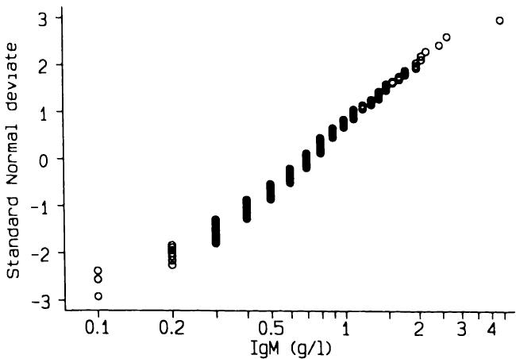  
图14.5 儿童血清$\mathrm{IgM}$对数数据的正态图（Isaacs 等人，1983）。  
Figure 14.5 Normal plot of log serum  $\mathrm{IgM}$  data in children (Isaacs et al., 1983).  

### 14.5.3 不确定性和样本量  14.5.3 Uncertainty and sample size  

参数方法基于均值和标准差的估计，而百分位数方法基于分布尾部的观测值。对于这两种方法，参考区间  
Whereas the parametric approach is based on estimates of the mean and standard deviation, the percentile approach is based on observations in the tails of the distribution. For both methods the reference interval is  

都以两个值获得，这些值受抽样变异性的影响。从同一健康人群中抽取几个样本会得到不同的参考区间，其变异性取决于样本量。来自不同人群的样本变异性会更大，并且使用不同类型的机器测量目标量会进一步增加变异性。表14.12显示了来自12个中心14个不同女性样本的胎儿头皮血pH均值和参考区间。使用了五种不同类型的pH计。参考区间存在显著差异，其中两个（编号3和14）几乎不重叠。然而，最值得注意的是，大多数研究的样本量非常小，除一项外，其余均基于少于50名受试者。  
obtained as two values which are subject to sampling variability. Several samples from the same population of healthy individuals will give different reference intervals, with the variability depending on sample size. Samples from different populations would be even more variable, and the use of different types of machine to measure the quantity of interest would increase variability further. Table 14.12 shows mean fetal scalp blood pH and reference intervals from 14 different samples of women in 12 centres. Five different types of pH meter were used. There is marked variation in the reference intervals with two (numbers 3 and 14) hardly overlapping. Most noticeable, however, is the fact that most of the studies are very small, all but one being based on fewer than 50 subjects.  

表14.12 14项胎儿头皮血pH研究的参考区间（Lumley 等人，1971）  
Table 14.12 Reference intervals from 14 studies of fetal scalp blood pH (Lumley et al., 1971)  

<table><tr><td>研究</td><td>平均pH值</td><td>95%参考区间*</td><td>样本量</td></tr><tr><td>1</td><td>7.29</td><td>7.15 至 7.43</td><td>43</td></tr><tr><td>2</td><td>7.29</td><td>7.21 至 7.37</td><td>24</td></tr><tr><td>3</td><td>7.29</td><td>7.25 至 7.33</td><td>10</td></tr><tr><td>4</td><td>7.30</td><td>7.20 至 7.40</td><td>12</td></tr><tr><td>5</td><td>7.30</td><td>7.22 至 7.38</td><td>18</td></tr><tr><td>6</td><td>7.30</td><td>7.22 至 7.38</td><td>129</td></tr><tr><td>7</td><td>7.32</td><td>7.20 至 7.44</td><td>16</td></tr><tr><td>8</td><td>7.32</td><td>7.22 至 7.42</td><td>49</td></tr><tr><td>9</td><td>7.35</td><td>7.23 至 7.47</td><td>45</td></tr><tr><td>10</td><td>7.35</td><td>7.25 至 7.45</td><td>26</td></tr><tr><td>11</td><td>7.35</td><td>7.25 至 7.45</td><td>29</td></tr><tr><td>12</td><td>7.35</td><td>7.25 至 7.45</td><td>21</td></tr><tr><td>13</td><td>7.37</td><td>7.27 至 7.47</td><td>45</td></tr><tr><td>14</td><td>7.38</td><td>7.30 至 7.45</td><td>22</td></tr></table>  
<table><tr><td>Study</td><td>Mean pH</td><td>95% reference interval*</td><td>Sample size</td></tr><tr><td>1</td><td>7.29</td><td>7.15 to 7.43</td><td>43</td></tr><tr><td>2</td><td>7.29</td><td>7.21 to 7.37</td><td>24</td></tr><tr><td>3</td><td>7.29</td><td>7.25 to 7.33</td><td>10</td></tr><tr><td>4</td><td>7.30</td><td>7.20 to 7.40</td><td>12</td></tr><tr><td>5</td><td>7.30</td><td>7.22 to 7.38</td><td>18</td></tr><tr><td>6</td><td>7.30</td><td>7.22 to 7.38</td><td>129</td></tr><tr><td>7</td><td>7.32</td><td>7.20 to 7.44</td><td>16</td></tr><tr><td>8</td><td>7.32</td><td>7.22 to 7.42</td><td>49</td></tr><tr><td>9</td><td>7.35</td><td>7.23 to 7.47</td><td>45</td></tr><tr><td>10</td><td>7.35</td><td>7.25 to 7.45</td><td>26</td></tr><tr><td>11</td><td>7.35</td><td>7.25 to 7.45</td><td>29</td></tr><tr><td>12</td><td>7.35</td><td>7.25 to 7.45</td><td>21</td></tr><tr><td>13</td><td>7.37</td><td>7.27 to 7.47</td><td>45</td></tr><tr><td>14</td><td>7.38</td><td>7.30 to 7.45</td><td>22</td></tr></table>  

*均值 ± 2倍标准差  
\*mean  2SD  

正态分布的任何估计百分位数都可以获得标准误。例如，描述 $95\%$ 参考区间的值的标准误为  
The standard error may be obtained for any estimated centile of the Normal distribution. For example, the values describing a  $95\%$  reference interval have a standard error of  

$$  
\sqrt{\frac{s^{2}}{N} + \frac{1.96^{2}s^{2}}{2N}}  
\sqrt{\frac{s^{2}}{N} + \frac{1.96^{2}s^{2}}{2N}}  
$$  

其中 $s$ 是观测值的标准差。这大约等于 $s \sqrt{3 / N}$。不同样本量下 $95\%$ 参考区间限值的置信区间宽度如图 14.6 所示。对于小于约 50 的样本量，定义参考区间的值本身的置信区间比标准  
where  $s$  is the standard deviation of the observations. This is approximately equal to  $s \sqrt{3 / N}$ . The widths of confidence intervals for the limits of  $95\%$  reference intervals for different sample sizes are shown in Figure 14.6. For sample sizes smaller than about 50 the values defining the reference interval themselves have a confidence interval wider than the standard  

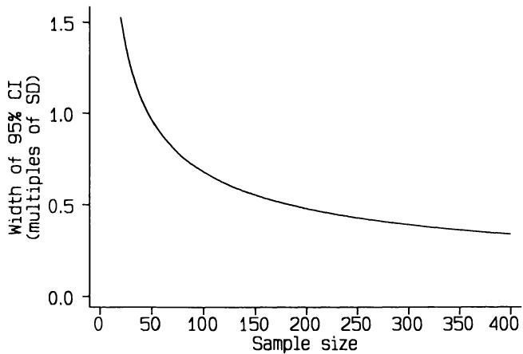  
图 14.6 如果数据服从正态分布，参数化 $95\%$ 参考区间限值的置信区间宽度是标准差的倍数。  
Figure 14.6 Width of parametric  $95\%$  confidence interval for limits of reference interval as a multiple of the standard deviation if the data have a Normal distribution.  

观测值的标准差更宽。为了减少不确定性，我们需要更大的样本，最好至少有 200 个观测值。通过非参数百分位数方法推导的参考区间的置信区间比图 14.6 所示的要宽得多（Linnet，1987）。因此，除非我们有非常大的样本，否则如果能使数据非常接近正态分布，参数化方法会好得多。  
deviation of the observations. In order to reduce the uncertainty we need much larger samples, preferably of at least 200 observations. Reference intervals derived by the non- parametric percentile method have confidence intervals that are much wider than those shown in Figure 14.6 (Linnet, 1987). The parametric approach is therefore much better if we can make the data conform closely to a Normal distribution, unless we have a very large sample.  

### 14.5.4 与年龄的关系  14.5.4 Relation to age  

许多临床和生化变量在健康个体中会随年龄变化。例如，随着年龄增长，人们的血压趋于升高，体重也趋于增加。在儿童期，我们尤其可能发现随年龄的变化，怀孕期间的母亲和胎儿也是如此。调查与年龄可能存在的关系非常重要，特别是对于儿童或孕期测量值。未能这样做可能导致发现异常患病率随年龄的虚假变化。  
Many clinical and biochemical variables vary with age in healthy individuals. For example, as people get older their blood pressure tends to rise and they tend to put on weight. During childhood we are especially likely to find changes with age, and the same applies to both mother and fetus during pregnancy. It is important to investigate possible relations with age, especially for measurements on children or during pregnancy. Failure to do so may lead to the finding of a spurious change in prevalence of abnormality with age.  

不仅均值，标准差也可能随年龄变化。此外，需要对小年龄组进行正态性评估。回归可用于拟合均值的曲线，如有必要，还可以拟合标准差的单独曲线。这些分析的残差应与年龄无关。对 IgM 的仔细分析  
Not only the mean but also the standard deviation may vary with age. Further, the assessment of Normality needs to be made for small age groups. Regression can be used to fit a curve to the means and, if necessary, a separate curve to the standard deviations. The residuals from these analyses should show no relation to age. Careful analysis of the IgM  

6个月至6岁儿童的数据显示，log IgM的均值和标准差在$5\frac{1}{2}$年期间均略有增加，然后下降。对6个月年龄组的log IgM的均值和标准差分别拟合了二次回归线。然后将这两条曲线结合起来，得到每个年龄的均值 $\pm 1.96\mathrm{SD}$，并对所有数据进行反对数转换，从而得到图14.7所示的年龄相关参考区间。  
data from children aged 6 months to 6 years showed that both the mean and standard deviation of log IgM increased slightly and then decreased in the  $5\frac{1}{2}$  year period. Quadratic regression lines were fitted separately to the mean and SD of log IgM for 6 month age groups. These two curves were then combined to give mean  $\pm 1.96\mathrm{SD}$  at each age, and everything was antilogged to give the age- related reference interval shown in Figure 14.7.  

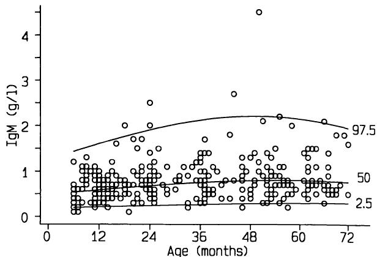  
图14.7 IgM的95%年龄相关参考区间（Isaacs 等人，1983）。  
Figure 14.7 95% age-related reference interval for IgM (Isaacs et al., 1983).  

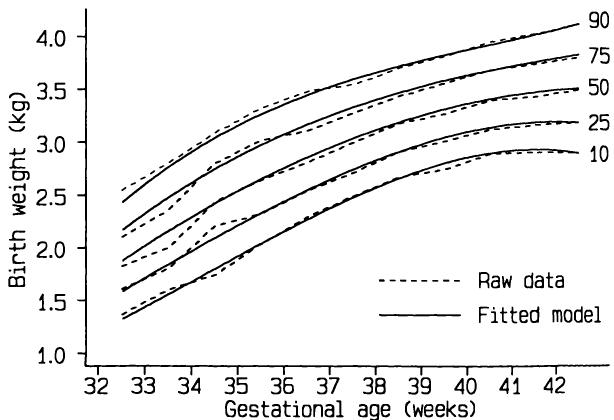  
图14.8 头胎男婴出生体重的百分位数（Altman 和 Coles，1980），显示了经验（原始）百分位数和从回归模型导出的曲线。  
Figure 14.8 Centiles for birthweight of first-born male babies (Altman and Coles. 1980), showing empirical (raw) centiles and curves derived from regression models.  

该方法的更多细节在原始论文中给出（Isaacs 等人，1983）。  
Further details of the method are given in the original paper (Isaacs et al., 1983).  

在构建胎儿或儿童生长“标准”时，也出现了完全相同的统计问题。例如，除了对平均出生体重拟合二次曲线（如图11.16所示）外，还对标准差拟合了三次曲线，并获得了几个年龄相关的百分位数，如图14.8所示的头胎男婴。  
Exactly the same statistical problem arises in constructing 'standards' of fetal or child growth. For example, as well as fitting quadratic curves to mean birthweight as shown in Figure 11.16, cubic curves were fitted to the standard deviations and several age- related centiles obtained, as shown in Figure 14.8 for first born male babies.  

### 14.5.5 讨论  14.5.5 Discussion  

在临床实践中，通常根据某些临床或生化测量将受试者分类为正常或异常，以辅助决策和治疗。当有正常（健康）和异常（患病）受试者的数据时，我们拥有构成诊断测试基础的数据类型，如第14.4节所讨论的。如果我们希望将测量值本身作为异常的衡量标准，那么我们需要描述某个特定群体（通常是健康受试者）内部的变异性。然而，参考区间的建立将不可避免地导致这样的推断：其值落在区间之外的受试者是异常的。尽管这可能是事实，但这种推断是无效的，因为根据定义，该区间排除了固定一小部分健康受试者，而且患病受试者中该变量的值是未知的。当测量值本身定义了疾病状况时，例如血压高于某个水平被称为“高血压”，其逻辑会变得更加模糊（Pickering，1978）。  
It is common in clinical practice to classify subjects as normal or abnormal with regard to some clinical or biochemical measurement as an aid to decision- making and thus treatment. When data are available for normal (healthy) and abnormal (ill) subjects we have the type of data that form the basis of a diagnostic test, as discussed in section 14.4. If we wish to use the measurement itself to be a measure of abnormality, then we need to describe the variation among some defined group, usually of healthy subjects. The creation of a reference interval will, however, inevitably lead to the inference that subjects whose values fall outside the interval are abnormal. While this may be true, such an inference is not valid both because the interval by definition excludes a fixed small percentage of healthy subjects, and also because the values of the variable in ill subjects are not known. Where the measurement itself defines the condition, such as blood pressure above a certain level being termed 'hypertension', the logic becomes even more diffuse (Pickering, 1978).  

从统计学角度来看，最有趣的问题是使用参数方法还是百分位数方法。虽然百分位数方法因其简单性和对所有数据集的有效性而具有吸引力，但使用基于正态分布理论的参数方法有两个重要优势。首先，定义参考区间的值的置信区间比等效的百分位数参考区间窄得多。其次，正态分布的使用允许将任何受试者的测量值表示为标准差分数，从而定位在特定的百分位数上，这比仅仅知道他们是否在参考区间内部或外部提供了更多的信息。换句话说，我们可以看出一个值有多么不寻常。（这里与P值有很强的类比。）因此，在可能的情况下，如果数据或数据的某种变换可以视为正态分布，则应使用参数方法。  
From a statistical point of view, the most interesting question is whether to use the parametric method or the percentile method. While the percentile approach is attractive both in its simplicity and validity for all data sets, there are two important advantages of using the parametric method based on Normal distribution theory. Firstly, the confidence intervals for the values defining the reference interval are much narrower than for the equivalent percentile reference interval. Secondly, the use of the Normal distribution allows any subject's measurement to be expressed as a standard deviation score, and hence located at a particular percentile, which is much more informative than knowing whether they are inside or outside the reference interval. In other words, we can see how unusual a value is. (There is a strong analogy here to P values.) Where it is possible, therefore, to treat the data or some transformation of the data as Normal the parametric approach should be used.  

样本量应足够大，以限制参考区间限值的不确定性，参数分析最好至少有100名受试者，百分位数方法最好至少有200名受试者。对于年龄相关区间，对跨年龄的数据进行平滑处理很重要。除了平滑变化的值更合理这一事实外，还有  
The sample size should be large enough to restrict uncertainty about the limits of the reference interval, preferably with a bare minimum of 100 subjects for a parametric analysis and 200 for the percentile method. For age- related intervals it is important to smooth the data across ages. Apart from the fact that smoothly changing values are more plausible, there is  

对数据更好的统计利用。在所有情况下，新参考区间的报告应明确受试者的纳入标准和所使用的统计方法。  
much better statistical use of the data. In all cases, reports of new reference intervals should specify the criteria for inclusion of subjects and the statistical methods used.  

## 14.6 序列测量  14.6 SERIAL MEASUREMENTS  

### 14.6.1 引言  14.6.1 Introduction  

有两种类型的研究可能会对每个受试者产生一系列观察结果，即序列测量。首先，是设计好的研究，其中在预先选定的特定时间点对每个个体进行重复测量。即使每个个体都有完整的数据，对此类数据的恰当分析和解释也并非显而易见。其次，数据可能来自观察性研究，其中在非指定时间进行多次测量。对于此类数据，可能对观察原因存在疑虑。例如，在怀孕期间多次测量血压的女性很可能属于高风险组。  
Two types of study may yield a series of observations, or serial measure ments, on each subject. Firstly, there are designed studies where repeated measurements are taken on each individual at specific times chosen in advance. Even when there are complete data for each individual, the appropriate analysis and interpretation of such data are not obvious. Secondly, data can arise from observational studies where multiple measurements are taken at unspecified times. With such data there may be doubts about the reason for the observations. For example, women with many measurements of blood pressure during pregnancy are likely to be a high risk group.  

分析序列数据有几种方法，每种方法都有其优缺点。特别是，有些方法在执行和解释上都很复杂，有些则只能应用于固定时间点的数据。在此，我将考虑一种简单的方法，它在大多数情况下能给出有用的结果。它可应用于实验性或观察性数据，因此可用于存在缺失观测值的结构化数据集，这是一种常见现象。Matthews 等人（1990）对此有更详细的讨论。本方法将使用表14.13和图14.9中的数据进行说明，这些数据显示了四组女性在鼻腔给药孕酮后长达两小时内的多个时间点的血清孕酮水平。  
There are several approaches to analysing serial data, each with advantages and disadvantages. In particular some methods are complex both to perform and interpret, and some can be applied only to data at fixed time points. Here I shall consider a simple approach which gives useful results in most situations. It can be applied to experimental or observational data, and can thus be used for structured data sets with missing observations, which is a common phenomenon. A fuller discussion is given by Matthews et al. (1990). The method will be illustrated using the data in Table 14.13 and Figure 14.9, which show serum progesterone levels at several times up to two hours after nasal administration of progesterone for four groups of women.  

### 14.6.2 常用的分析方法  14.6.2 The usual approach to analysis  

分析这类数据最常用的方法是在每个时间点进行独立分析，例如两样本 $t$ 检验或单向方差分析。数据通常通过连接各时间点平均值的图表进行图形化展示，常带有 $\pm 1$ 标准误（或可能是 $\pm 1$ 标准差）的“误差条”。这种方法有几个重要的批评意见：  
The most common method of analysing data like these is to perform independent analyses at each time point, such as two- sample  $t$  tests or one way analysis of variance. Frequently the data are displayed graphically by a plot joining the mean values at each time point, often with 'error bars' of  $\pm 1$  standard error (or perhaps  $\pm 1$  standard deviation). There are several important criticisms of this approach:  

1. 它忽略了研究设计，因为没有考虑每个时间点的值都来自同一个体这一事实；  
1. It ignores the design of the study, as no account is taken of the fact that the values at each time point are from the same individuals;  

2. 连接平均值的曲线可能不是个体典型曲线的良好指标，并且会掩盖不同个体曲线形状的任何变异；  
2. The curve joining the means may not be a good indicator of the typical curve for an individual, and will hide any variation in the shape of the curves for different individuals;  

aannn aannn aannnnn aannnnnnnnnnnnnnnnnnnnnnnnnnnnnnnnnnnnnnnnnnnnnnnnnnnnnnnnnnnnnnnnnnnnnnnnnnnnnnnnnnnnnnnnnnnnnnnnnnnnnnnnnnnnnnnnnnnnnnnnnnnnnnnnnnnnnnnnnnnnnnnnnnnnnnnnnnnnnnnnnnnnnnnnnnnnnnnnnnnnnnnnnnnnnnnnnnnnnnnnnnn  
aannn aannn aannnnn aannnnnnnnnnnnnnnnnnnnnnnnnnnnnnnnnnnnnnnnnnnnnnnnnnnnnnnnnnnnnnnnnnnnnnnnnnnnnnnnnnnnnnnnnnnnnnnnnnnnnnnnnnnnnnnnnnnnnnnnnnnnnnnnnnnnnnnnnnnnnnnnnnnnnnnnnnnnnnnnnnnnnnnnnnnnnnnnnnnnnnnnnnnnnnnnnnnnnnnnnnn  

<table><tr><td rowspan="2"></td><td colspan="8">给药后时间 (分钟)</td><td>峰值 (nmol/l)</td><td>达峰时间 (分钟)</td></tr><tr><td>0</td><td>1</td><td>3</td><td>5</td><td>10</td><td>15</td><td>30</td><td>45</td><td>60</td><td>120</td></tr><tr><td colspan="11">第1组 (0.2 ml 100 mg/ml 孕酮，单侧鼻孔)</td></tr><tr><td>1</td><td>1.0</td><td>-</td><td>10.0</td><td>16.0</td><td>22.0</td><td>20.0</td><td>16.0</td><td>-</td><td>18.0</td><td>14.0</td></tr><tr><td>2</td><td>6.5</td><td>-</td><td>9.5</td><td>11.6</td><td>17.5</td><td>27.5</td><td>28.5</td><td>22.4</td><td>19.3</td><td>10.0</td></tr><tr><td>3</td><td>3.0</td><td>4.0</td><td>4.0</td><td>13.0</td><td>15.8</td><td>19.5</td><td>21.2</td><td>15.9</td><td>10.7</td><td>13.4</td></tr><tr><td>4</td><td>1.0</td><td>2.1</td><td>9.7</td><td>-</td><td>21.8</td><td>-</td><td>27.5</td><td>-</td><td>15.5</td><td>6.2</td></tr><tr><td>5</td><td>1.0</td><td>1.0</td><td>1.0</td><td>4.2</td><td>22.6</td><td>23.9</td><td>45.5</td><td>42.6</td><td>35.0</td><td>10.6</td></tr><tr><td>6</td><td>1.0</td><td>1.0</td><td>1.0</td><td>1.0</td><td>3.9</td><td>14.7</td><td>17.6</td><td>16.1</td><td>8.8</td><td>10.8</td></tr><tr><td rowspan="2">平均值 (标准误)</td><td>2.3</td><td>2.8</td><td>5.9</td><td>9.2</td><td>17.3</td><td>21.1</td><td>26.0</td><td>24.8</td><td>17.9</td><td>10.8</td></tr><tr><td>(0.9)</td><td>(0.9)</td><td>(1.8)</td><td>(2.8)</td><td>(2.9)</td><td>(3.5)</td><td>(4.4)</td><td>(6.1)</td><td>(3.8)</td><td>(4.0)</td></tr><tr><td colspan="11">第2组 (0.3 ml 100 mg/ml 孕酮，单侧鼻孔)</td></tr><tr><td>7</td><td>1.0</td><td>1.5</td><td>5.0</td><td>11.0</td><td>16.0</td><td>23.0</td><td>15.0</td><td>9.0</td><td>6.0</td><td>5.0</td></tr><tr><td>8</td><td>1.0</td><td>1.0</td><td>6.5</td><td>20.0</td><td>22.5</td><td>27.8</td><td>19.0</td><td>9.0</td><td>8.2</td><td>8.0</td></tr><tr><td>9</td><td>1.0</td><td>1.0</td><td>7.3</td><td>7.5</td><td>18.0</td><td>20.0</td><td>18.9</td><td>12.8</td><td>6.3</td><td>4.8</td></tr><tr><td>10</td><td>3.0</td><td>2.5</td><td>2.0</td><td>2.7</td><td>3.4</td><td>3.6</td><td>14.0</td><td>7.3</td><td>7.7</td><td>4.0</td></tr><tr><td>11</td><td>8.3</td><td>7.5</td><td>9.6</td><td>11.0</td><td>11.5</td><td>15.7</td><td>15.2</td><td>15.8</td><td>14.0</td><td>11.5</td></tr><tr><td>12</td><td>6.2</td><td>5.9</td><td>6.8</td><td>7.7</td><td>9.0</td><td>9.3</td><td>12.1</td><td>12.2</td><td>11.0</td><td>9.0</td></tr><tr><td rowspan="2">平均值 (标准误)</td><td>3.2</td><td>3.2</td><td>6.2</td><td>10.0</td><td>13.4</td><td>16.6</td><td>15.7</td><td>11.0</td><td>8.1</td><td>7.1</td></tr><tr><td>(1.3)</td><td>(1.1)</td><td>(1.0)</td><td>(2.4)</td><td>(2.8)</td><td>(3.7)</td><td>(1.1)</td><td>(1.3)</td><td>(1.3)</td><td>(1.1)</td></tr></table>  
<table><tr><td rowspan="2"></td><td colspan="8">Time after administration (min)</td><td>Peak value (nmol/l)</td><td>Time to peak (min)</td></tr><tr><td>0</td><td>1</td><td>3</td><td>5</td><td>10</td><td>15</td><td>30</td><td>45</td><td>60</td><td>120</td></tr><tr><td colspan="11">Group 1 (0.2 ml of 100 mg/ml progesterone in one nostril)</td></tr><tr><td>1</td><td>1.0</td><td>-</td><td>10.0</td><td>16.0</td><td>22.0</td><td>20.0</td><td>16.0</td><td>-</td><td>18.0</td><td>14.0</td></tr><tr><td>2</td><td>6.5</td><td>-</td><td>9.5</td><td>11.6</td><td>17.5</td><td>27.5</td><td>28.5</td><td>22.4</td><td>19.3</td><td>10.0</td></tr><tr><td>3</td><td>3.0</td><td>4.0</td><td>4.0</td><td>13.0</td><td>15.8</td><td>19.5</td><td>21.2</td><td>15.9</td><td>10.7</td><td>13.4</td></tr><tr><td>4</td><td>1.0</td><td>2.1</td><td>9.7</td><td>-</td><td>21.8</td><td>-</td><td>27.5</td><td>-</td><td>15.5</td><td>6.2</td></tr><tr><td>5</td><td>1.0</td><td>1.0</td><td>1.0</td><td>4.2</td><td>22.6</td><td>23.9</td><td>45.5</td><td>42.6</td><td>35.0</td><td>10.6</td></tr><tr><td>6</td><td>1.0</td><td>1.0</td><td>1.0</td><td>1.0</td><td>3.9</td><td>14.7</td><td>17.6</td><td>16.1</td><td>8.8</td><td>10.8</td></tr><tr><td rowspan="2">Mean (SE)</td><td>2.3</td><td>2.8</td><td>5.9</td><td>9.2</td><td>17.3</td><td>21.1</td><td>26.0</td><td>24.8</td><td>17.9</td><td>10.8</td></tr><tr><td>(0.9)</td><td>(0.9)</td><td>(1.8)</td><td>(2.8)</td><td>(2.9)</td><td>(3.5)</td><td>(4.4)</td><td>(6.1)</td><td>(3.8)</td><td>(4.0)</td></tr><tr><td colspan="11">Group 2 (0.3 ml of 100 mg/ml progesterone in one nostril)</td></tr><tr><td>7</td><td>1.0</td><td>1.5</td><td>5.0</td><td>11.0</td><td>16.0</td><td>23.0</td><td>15.0</td><td>9.0</td><td>6.0</td><td>5.0</td></tr><tr><td>8</td><td>1.0</td><td>1.0</td><td>6.5</td><td>20.0</td><td>22.5</td><td>27.8</td><td>19.0</td><td>9.0</td><td>8.2</td><td>8.0</td></tr><tr><td>9</td><td>1.0</td><td>1.0</td><td>7.3</td><td>7.5</td><td>18.0</td><td>20.0</td><td>18.9</td><td>12.8</td><td>6.3</td><td>4.8</td></tr><tr><td>10</td><td>3.0</td><td>2.5</td><td>2.0</td><td>2.7</td><td>3.4</td><td>3.6</td><td>14.0</td><td>7.3</td><td>7.7</td><td>4.0</td></tr><tr><td>11</td><td>8.3</td><td>7.5</td><td>9.6</td><td>11.0</td><td>11.5</td><td>15.7</td><td>15.2</td><td>15.8</td><td>14.0</td><td>11.5</td></tr><tr><td>12</td><td>6.2</td><td>5.9</td><td>6.8</td><td>7.7</td><td>9.0</td><td>9.3</td><td>12.1</td><td>12.2</td><td>11.0</td><td>9.0</td></tr><tr><td rowspan="2">Mean (SE)</td><td>3.2</td><td>3.2</td><td>6.2</td><td>10.0</td><td>13.4</td><td>16.6</td><td>15.7</td><td>11.0</td><td>8.1</td><td>7.1</td></tr><tr><td>(1.3)</td><td>(1.1)</td><td>(1.0)</td><td>(2.4)</td><td>(2.8)</td><td>(3.7)</td><td>(1.1)</td><td>(1.3)</td><td>(1.3)</td><td>(1.1)</td></tr></table>  

aannn aannn aannn aannnnnnnnnnnnnnnnnnnnnnnnnnnnnnnnnnnnnnnnnnnnnnnnnnnnnnnnnnnnnnnnnnnnnnnnnnnnnnnnnnnnnnnnnnnnnnnnnnnnnnnnnnnnnnnnnnnnnnnnnnnnnnnnnnnnnnnnnnnnnnnnnnnnnnnnnnnnnnnnnnnnnnnnnnnnnnnnnnnnnnnnnnnnnnnnnnnnnnnnnnn  
aannn aannn aannn aannnnnnnnnnnnnnnnnnnnnnnnnnnnnnnnnnnnnnnnnnnnnnnnnnnnnnnnnnnnnnnnnnnnnnnnnnnnnnnnnnnnnnnnnnnnnnnnnnnnnnnnnnnnnnnnnnnnnnnnnnnnnnnnnnnnnnnnnnnnnnnnnnnnnnnnnnnnnnnnnnnnnnnnnnnnnnnnnnnnnnnnnnnnnnnnnnnnnnnnnnn  

<table><tr><td></td><td colspan="6">给药后时间（分钟）</td><td>峰值（nmol/l）</td><td>达峰时间（分钟）</td><td></td></tr><tr><td>0</td><td>1</td><td>3</td><td>5</td><td>10</td><td>15</td><td>30</td><td>45</td><td>60</td><td>120</td></tr><tr><td colspan="10">第3组（每侧鼻孔0.2 ml，200 mg/ml黄体酮）</td></tr><tr><td>13</td><td>8.4</td><td>10.8</td><td>8.1</td><td>7.8</td><td>8.5</td><td>12.0</td><td>19.8</td><td>22.2</td><td>40.5</td></tr><tr><td>14</td><td>3.5</td><td>3.2</td><td>3.4</td><td>3.3</td><td>8.5</td><td>9.4</td><td>14.5</td><td>12.7</td><td>10.2</td></tr><tr><td>15</td><td>3.5</td><td>4.0</td><td>4.8</td><td>3.5</td><td>3.7</td><td>13.0</td><td>12.5</td><td>15.0</td><td>10.5</td></tr><tr><td>16</td><td>3.7</td><td>3.2</td><td>4.3</td><td>4.5</td><td>5.5</td><td>8.5</td><td>10.3</td><td>11.1</td><td>6.0</td></tr><tr><td>平均值（SE）</td><td>4.8</td><td>5.3</td><td>5.2</td><td>4.8</td><td>6.7</td><td>10.7</td><td>14.3</td><td>15.3</td><td>16.7</td></tr><tr><td></td><td>(1.2)</td><td>(1.8)</td><td>(1.0)</td><td>(1.0)</td><td>(1.2)</td><td>(1.1)</td><td>(2.0)</td><td>(2.5)</td><td>(4.1)</td></tr><tr><td colspan="10">第4组（每侧鼻孔0.2 ml，100 mg/ml黄体酮）</td></tr><tr><td>17</td><td>5.0</td><td>5.6</td><td>6.1</td><td>7.2</td><td>13.8</td><td>26.0</td><td>26.1</td><td>25.7</td><td>20.5</td></tr><tr><td>18</td><td>4.5</td><td>5.1</td><td>13.2</td><td>21.0</td><td>26.8</td><td>28.0</td><td>22.0</td><td>17.8</td><td>15.7</td></tr><tr><td>19</td><td>8.4</td><td>6.2</td><td>8.0</td><td>18.5</td><td>33.8</td><td>35.0</td><td>26.2</td><td>23.0</td><td>19.0</td></tr><tr><td>20</td><td>4.2</td><td>3.2</td><td>4.2</td><td>4.8</td><td>10.3</td><td>13.7</td><td>17.1</td><td>18.3</td><td>15.0</td></tr><tr><td>平均值（SE）</td><td>5.5</td><td>5.0</td><td>7.9</td><td>12.9</td><td>21.2</td><td>25.7</td><td>22.8</td><td>21.2</td><td>18.2</td></tr><tr><td></td><td>(1.0)</td><td>(0.7)</td><td>(1.9)</td><td>(4.0)</td><td>(5.5)</td><td>(4.4)</td><td>(2.2)</td><td>(1.9)</td><td>(1.0)</td></tr></table>  
<table><tr><td></td><td colspan="6">Time after administration (min)</td><td>Peak value (nmol/l)</td><td>Time to peak (min)</td><td></td></tr><tr><td>0</td><td>1</td><td>3</td><td>5</td><td>10</td><td>15</td><td>30</td><td>45</td><td>60</td><td>120</td></tr><tr><td colspan="10">Group 3 (0.2 ml of 200 mg/ml progesterone in one nostril)</td></tr><tr><td>13</td><td>8.4</td><td>10.8</td><td>8.1</td><td>7.8</td><td>8.5</td><td>12.0</td><td>19.8</td><td>22.2</td><td>40.5</td></tr><tr><td>14</td><td>3.5</td><td>3.2</td><td>3.4</td><td>3.3</td><td>8.5</td><td>9.4</td><td>14.5</td><td>12.7</td><td>10.2</td></tr><tr><td>15</td><td>3.5</td><td>4.0</td><td>4.8</td><td>3.5</td><td>3.7</td><td>13.0</td><td>12.5</td><td>15.0</td><td>10.5</td></tr><tr><td>16</td><td>3.7</td><td>3.2</td><td>4.3</td><td>4.5</td><td>5.5</td><td>8.5</td><td>10.3</td><td>11.1</td><td>6.0</td></tr><tr><td>Mean (SE)</td><td>4.8</td><td>5.3</td><td>5.2</td><td>4.8</td><td>6.7</td><td>10.7</td><td>14.3</td><td>15.3</td><td>16.7</td></tr><tr><td></td><td>(1.2)</td><td>(1.8)</td><td>(1.0)</td><td>(1.0)</td><td>(1.2)</td><td>(1.1)</td><td>(2.0)</td><td>(2.5)</td><td>(4.1)</td></tr><tr><td colspan="10">Group 4 (0.2 ml of 100 mg/ml progesterone in each nostril)</td></tr><tr><td>17</td><td>5.0</td><td>5.6</td><td>6.1</td><td>7.2</td><td>13.8</td><td>26.0</td><td>26.1</td><td>25.7</td><td>20.5</td></tr><tr><td>18</td><td>4.5</td><td>5.1</td><td>13.2</td><td>21.0</td><td>26.8</td><td>28.0</td><td>22.0</td><td>17.8</td><td>15.7</td></tr><tr><td>19</td><td>8.4</td><td>6.2</td><td>8.0</td><td>18.5</td><td>33.8</td><td>35.0</td><td>26.2</td><td>23.0</td><td>19.0</td></tr><tr><td>20</td><td>4.2</td><td>3.2</td><td>4.2</td><td>4.8</td><td>10.3</td><td>13.7</td><td>17.1</td><td>18.3</td><td>15.0</td></tr><tr><td>Mean (SE)</td><td>5.5</td><td>5.0</td><td>7.9</td><td>12.9</td><td>21.2</td><td>25.7</td><td>22.8</td><td>21.2</td><td>18.2</td></tr><tr><td></td><td>(1.0)</td><td>(0.7)</td><td>(1.9)</td><td>(4.0)</td><td>(5.5)</td><td>(4.4)</td><td>(2.2)</td><td>(1.9)</td><td>(1.0)</td></tr></table>  

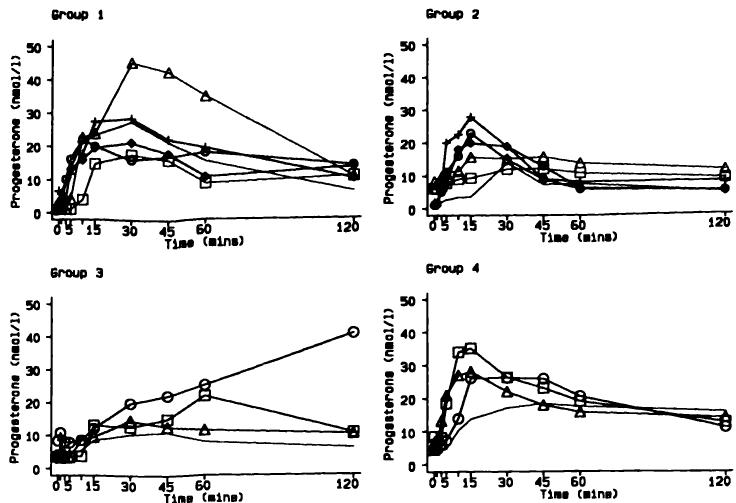  
图14.9 四组女性鼻腔给药黄体酮后的血清黄体酮水平。数据来自表14.13。  
Figure 14.9 Serum progesterone levels after nasal administration of progesterone in four groups of women. Data from Table 14.13.  

3. 当比较不同受试者组时，所获得的多个非独立 $\mathbf{P}$ 值难以（甚至不可能）解释；  
3. It is difficult, if not impossible, to interpret the multiple non-independent  $\mathbf{P}$  values that are obtained when different groups of subjects are compared;  

4. 无法对任何缺失的观测值进行处理，因此不同时间点的数据可能不完全对应同一组。  
4. No allowance can be made for any missing observations, so the data at different times may not relate to exactly the same group.  

上述第一点是关键，其他几点都由此引申。如果例如前两组仅在15分钟时存在显著差异，我们如何解释图14.9中数据的分析结果，这一点完全不清楚。此外，我们是否应该考虑两组基线（时间零点）值的任何差异，如果应该，又该如何考虑？这类研究的目的通常是评估随时间变化的反应，因此，根据临床目标调整分析方法要好得多。  
The first point above is the critical one, from which the others follow. It is not at all clear how we would interpret the analysis of the data in Figure 14.9 if, for example, the first two groups were significantly different only at 15 minutes. Further, should we take account of any differences in baseline (time zero) values in the two groups and, if so, how？ The purpose of this type of study is usually to assess the response over time, so it is far better to tailor the analysis to the clinical objective.  

### 14.6.3 使用汇总测量值进行分析  14.6.3 Analysis using summary measures  

对系列测量数据进行分析最常用的通用方法可能是通过将每个受试者的数据简化为某些特定感兴趣的特征来简化分析。可以对每个个体的数据拟合统计模型，或者直接从观测数据中导出必要的量。然后，这些汇总测量值将  
Probably the most useful general approach to the analysis of serial measurements is to simplify the analysis by reducing each subject's data to certain features of particular interest. Either a statistical model may be fitted to each individual's data or the necessary quantities can be derived directly from the observed data. These summary measures are then  

以与原始观测值相同的方式进行分析。显然，这种方法依赖于选择具有临床相关性的汇总测量值的能力。  
analysed in the same way as if they were the original observations. Clearly this approach relies on the ability to choose summary measures of clinical relevance.  

对于临床测量，唯一常用的模型是对每个受试者的数据进行时间上的线性回归拟合。直线的斜率表示测量值每单位时间（例如每小时）的变化率。显然，线性回归仅适用于随时间呈系统性上升或下降趋势的数据。许多数据集，例如图14.9中的数据集，通常呈先上升后下降（或反之）的趋势。任何简单的统计模型都不太可能很好地拟合这类数据。  
For clinical measurements the only commonly used model is to fit a linear regression of each subject's data on time. The slope of the line represents the rate of change of the measurement per unit of time (e.g. per hour). Clearly, linear regression is appropriate only for data which tend either to rise or fall systematically over time. Many data sets, such as that in Figure 14.9, have a general tendency to rise and then fall (or vice versa). It is unlikely that any simple statistical model would fit such data at all well.  

一种更简单、更常见的方法是直接从观测数据中提取汇总统计量，也许在进行一些简单的数学计算之后。一些更常用的衍生统计量包括：  
A simpler and more common approach is to take summary statistics directly from the observed data, perhaps after some simple mathematical calculation. Some of the more frequent derived statistics are:  

所有测量值的平均值（即忽略时间响应） 峰值高度 达到峰值的时间 达到给定水平的时间 变化给定幅度的时间 超过给定水平的时间 达到相对于原始水平（基线）最大变化的时间 （接近）恢复到基线水平的时间 从首次测量到末次测量的变化 最终水平（可能是最后几次测量的平均值） 曲线下面积（AUC）  
mean of all the measurements (i.e. ignore the time response) height of peak time to reach peak time to reach a given level time to change by a given amount time above a given level time to achieve maximum change from original level (baseline) time to return (near) to baseline level change from first to last measurement final level (perhaps the average of the last few measurements) area under the curve (AUC)  

这些建议中的一些包含一些任意定义，这些定义应在分析之前而非检查数据之后确定。有些专门针对具有峰值的数据。当初始值差异较大时，可以使用基线变化。  
Several of these suggestions incorporate some arbitrary definitions which should be chosen in advance of the analysis rather than after inspection of the data. Several are specifically aimed at data with peaks. Where initial values vary considerably the change from baseline may be used.  

在某些情况下，AUC 可以解释为对干预的累积响应。其计算方法在第 14.6.5 节中描述。请注意，对于等间隔观测数据，AUC（这些汇总统计量中最难计算的一个）实际上与所有测量值的平均值相同。  
The AUC may be interpreted in some circumstances as the cumulative response to the intervention. The calculation is described in section 14.6.5. Note that for equally spaced observations the AUC, which is the hardest of these summary statistics to calculate, is virtually the same as the mean of all the measurements.  

Dalton 等人（1987）使用三个指标来汇总图 14.9 中的数据：峰值时间、从零时刻起的最大增幅以及 AUC。通常，考虑两到三个衍生统计量是合理的，但与任何研究一样，确定一个单一的主要关注指标是高度可取的。适当指标的选择应与研究目标相关。例如，如果研究是关于治疗效果的，我们可能最合理地关注研究结束时的值，也许是相对于起始值而言。如果研究旨在评估镇痛剂的有效性，那么我们可能对以下方面感兴趣：  
Dalton et al. (1987) used three measures to summarize the data in Figure 14.9: the time of the peak, the maximum increase from time zero and the AUC. In general it is reasonable to consider two or three derived statistics, but as in any study it is highly desirable to identify a single measure of primary interest. The choice of appropriate measures should relate to the study objectives. For example, if the study is one of treatment efficacy we may reasonably be most interested in the values at the end of the study, perhaps in relation to starting values. If the study is to evaluate the effectiveness of analgesics, then we would probably be interested in the  

药物的快速有效性，也许通过观察峰值时间和达到的水平，以及也许还有超过某个临界水平的时间。  
rapid effectiveness of the drug, perhaps by looking at the timing of the peak and the level achieved, and perhaps also the time above some critical level.  

尽管汇总统计量的分析通常很简单，但这种方法也存在一些困难：  
Although the analysis of summary statistics is usually simple, there are some difficulties with this approach too:  

1. 可能难以明确主要重要特征，因为研究目标过于模糊；  
1. it may be difficult to specify the feature(s) of major importance, because the study objective is too vague;  

2. 所选用的统计量可能受到数据检查的影响；  
2. the choice of statistics to use may be influenced by inspecting the data;  

3. 难以研究各组间曲线形状的任何可能差异（但这总是很困难的）。  
3. it is difficult to study any possible variation between groups in the shape of the curves (but this is always difficult).  

除了这些缺点，我们还必须考虑一些重要的额外优点：能够处理缺失观测值（见表14.13）和观测时间不一致的问题；能够处理同一受试者在不同条件下进行系列测量值的比较；以及易于理解和解释结果（这是其他几种替代方法的一个显著问题）。当分析汇总测量值时，我们似乎丢弃了大量数据。事实上，大量的观测值更多是表面现象而非真实情况，因为任何患者的连续读数都会非常相似。患者是研究单位，因此当我们每个患者只有一个值时，处理此类数据会更容易、更有意义。  
Against these disadvantages we must set some important further advantages; the ability to cope with missing observations (see Table 14.13) and variable timing of observations; the ability to handle the comparison of serial measurements for the same subjects under different conditions; and the ease of understanding and explaining the results (a notable problem with several alternative approaches). It may seem that when we analyse summary measures we discard a lot of data. In fact the large number of observations is more apparent than real, as consecutive readings in any patient will be very similar. The patient is the unit of investigation, so it is easier and more meaningful to handle such data when we have only one value per patient.  

### 14.6.4 图形展示  14.6.4 Graphical display  

由于在每个时间点绘制平均值可能产生误导性影响，因此检查个体数据的图表非常重要，如果可能，应将其包含在发表的论文中。图表能非常迅速地显示曲线是相似还是不同。不幸的是，图形展示仅对小样本有效。图14.9以一种形式展示了原始血清孕酮数据；图14.10展示了另一种形式。  
Because of the potentially misleading effect of plotting mean values at each time point it is important to examine graphs of individuals' data, and if possible to include these in the published paper. A graph will show very quickly if the curves are similar or dissimilar. Unfortunately, graphical display is effective only for small samples. Figure 14.9 showed the raw serum progesterone data in one form; an alternative is shown in Figure 14.10.  

汇总测量值也可以绘制成图。对于“峰值”数据，一种有趣的格式是绘制峰值高度与峰值时间的关系图。图14.11展示了孕酮数据的此类图。这种类型的图可能揭示在其他图表中不明显的模式。更一般地，我们可以生成任意两个汇总测量值的散点图。示例中的数据是在所有受试者相同的时间点收集的，但对于在不同时间点收集的数据，图形展示可能更有用。  
The summary measures can also be plotted. One interesting format for 'peaked' data is to plot the height of the peak against its time. Figure 14.11 shows such a plot for the progesterone data. This type of plot may reveal patterns that are not evident in other graphs. More generally, we can produce a scatter diagram of any two summary measures. The data in the example were collected at the same times for all subjects, but graphical display may be even more useful for data collected at varying times.  

### 14.6.5 曲线下面积  14.6.5 The area under the curve  

曲线下面积（AUC）是一种总结个体一系列测量信息有用方法。它  
The area under the curve (AUC) is a useful way of summarizing the information from a series of measurements on one individual. It is  

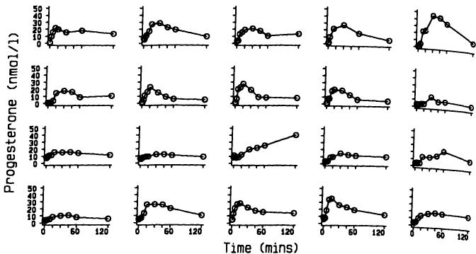  
图14.10 图14.9中血清孕酮数据的另一种展示方式。  
Figure 14.10 Alternative display of serum progesterone data in Figure 14.9.  

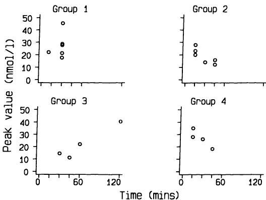  
图14.11 孕酮峰值随时间变化的图。  
Figure 14.11 Plot of peak values of progesterone by time.  

常用于临床药理学，其中血清水平的AUC可以解释为所给药品的总吸收量或生物利用度。  
frequently used in clinical pharmacology, where the AUC from serum levels can be interpreted as the total uptake or bioavailability of whatever had been administered.  

数据点通过直线连接形成“曲线”。AUC通常通过将每对连续观测值之间的曲线下面积相加来计算。如果我们在时间 $t_{1}$ 和 $t_{2}$ 处有测量值 $y_{1}$ 和 $y_{2}$，那么这两个时间之间的AUC是时间差与两个测量值平均值的乘积。因此我们得到  
The data are joined by straight lines to get a 'curve'. The AUC is usually calculated by adding the areas under the curve between each pair of consecutive observations. If we have measurements  $y_{1}$  and  $y_{2}$  at times  $t_{1}$  and  $t_{2}$ , then the AUC between those two times is the product of the time difference and the average of the two measurements. Thus we get  

$(t_{2} - t_{1})(y_{1} + y_{2}) / 2$。这被称为梯形法则，因为曲线下面积的每个片段都是梯形形状。  
$(t_{2} - t_{1})(y_{1} + y_{2}) / 2$ . This is known as the trapezium rule because of the shape of each segment of the area under the curve.  

如果我们有 $n + 1$ 个在时间 $t_{i}$ $(t = 0, \ldots , n)$ 处的测量值 $y_{i}$，那么 AUC 的计算公式为  
If we have  $n + 1$  measurements  $y_{i}$  at times  $t_{i}$ $(t = 0, \ldots , n)$  then the AUC is calculated as  

$$  
\frac{1}{2} \sum_{i = 0}^{n - 1} (t_{i + 1} - t_{i}) (y_{i} + y_{i + 1}).  
\frac{1}{2} \sum_{i = 0}^{n - 1} (t_{i + 1} - t_{i}) (y_{i} + y_{i + 1}).  
$$  

AUC 的单位是 $y_{i}$ 和 $t_{i}$ 单位的乘积，例如 nmol.min/l，并且不容易理解。将 AUC 除以总时间以获得该时间段内的一种加权平均水平可能很有用。  
The units of the AUC are the product of the units used for  $y_{i}$  and  $t_{i}$ , for example nmol.min/l, and are not easy to understand. It may be useful to divide the AUC by the total time to get a sort of weighted average level over the time period.  

表 14.13 中第一个受试者的计算如下。该受试者有八个观察值，因此要计算七个面积。我们有  
The calculation for the first subject in Table 14.13 goes as follows. There were eight observations for this subject, so seven areas to calculate. We have  

$$  
\begin{array}{l}{\mathrm{AUC} = 3\times \left(\frac{1 + 10}{2}\right) + 2\times \left(\frac{10 + 16}{2}\right) + 5\times \left(\frac{16 + 22}{2}\right) + \ldots}\\ {+60\times \left(\frac{18 + 14}{2}\right)}\\ {= 1930\mathrm{nmol.min / l}.} \end{array}  
\begin{array}{l}{\mathrm{AUC} = 3\times \left(\frac{1 + 10}{2}\right) + 2\times \left(\frac{10 + 16}{2}\right) + 5\times \left(\frac{16 + 22}{2}\right) + \ldots}\\ {+60\times \left(\frac{18 + 14}{2}\right)}\\ {= 1930\mathrm{nmol.min / l}.} \end{array}  
$$  

该值也可以表示为平均水平 $1930 / 120 = 16.1 \mathrm{nmol / l}$。  
This value can also be expressed as an average level of  $1930 / 120 = 16.1 \mathrm{nmol / l}$ .  

即使存在缺失数据，我们也可以计算 AUC，除非最终观察值缺失。  
We can calculate the AUC even when there are missing data, except when the final observation is missing.  

### 14.6.6 解释  14.6.6 Interpretation  

进行与临床兴趣问题无关的分析常常导致不正确的推断。当数据在几个时间点分别进行分析时，通常会看到基于组何时变得显著差异的推断。显然，这个问题的答案将强烈依赖于样本量，并且几乎没有科学可信度。以表格或图表形式呈现所有原始数据很有价值，但在大型研究中可能都不可行。  
Performing an analysis that does not relate to the questions of clinical interest often leads to incorrect inferences. When data are analysed separately at each of several time points it is common to see inferences based upon the time when groups become significantly different. Clearly the answer to this question will depend strongly on sample size, and has little if any scientific credibility. Presentation of all the raw data either in a table or figure is valuable, but neither may be feasible in a large study.  

使用汇总统计量作为统计分析的基础，通过将分析直接与一个或多个具体感兴趣的问题联系起来，避免了许多困难。通过每个受试者只有一个“观察值”，解释通常会得到简化。可以使用简单的估计和假设检验方法。  
The use of summary statistics as the basis of statistical analysis avoids many difficulties by relating the analysis directly to one or more questions of specific interest. Interpretation is usually simplified by having one 'observation' per subject. Simple methods of estimation and hypothesis testing can be used.  

## 14.7 周期性变异  14.7 CYCLIC VARIATION  

许多测量值会随时间（一天中的时间）而变化。例如，大多数人的血压在夜间最低，在早晨最高。  
Many measurements vary according to time of day. For example, most people's blood pressure is lowest at night and highest during the morning.  

昼夜节律变异也见于许多激素水平，甚至我们的身高在晚上也往往比早上略低。  
Circadian variation is also seen in many hormone levels and even our height tends to be slightly lower in the evening than in the morning.  

同样，个体测量值和人群数据也可能随一年中的月份而变化。表14.14显示了一项对5000多名比利时新生儿进行的研究中，按出生月份划分的脐带血IgE水平正常和异常的出生数量。高水平的IgE用于检测那些易患过敏症的人，这项研究旨在证实此前一项发现与出生月份相关的研究结果。  
Similarly, individual measurements and also population data may vary by month of the year. Table 14.14 shows the number of births with normal and abnormal cord blood IgE levels by month of birth in a study of over 5000 Belgian newborns. A high level of IgE is used to detect those predisposed to become allergic, and the study was carried out to confirm the results of a previous study that had found an association with month of birth.  

表14.14 脐带血IgE水平按出生月份分布（Kimpen et al., 1987）  
Table 14.14 Cord blood IgE by month of birth (Kimpen et al., 1987)  

<table><tr><td rowspan="2">月份</td><td colspan="4">婴儿数量</td></tr><tr><td>总数</td><td>IgE正常   
<table><tr><td rowspan="2">Month</td><td colspan="4">Number of babies</td></tr><tr><td>Total</td><td>Normal IgE   
（≤ 1.0 IU/ml）</td><td>IgE异常   
(≤ 1.0 IU/ml)</td><td>Abnormal IgE   
（&gt; 1.0 IU/ml）</td><td>异常百分比</td></tr><tr><td>一月</td><td>331</td><td>319</td><td>12</td><td>3.6</td></tr><tr><td>二月</td><td>416</td><td>401</td><td>15</td><td>3.6</td></tr><tr><td>三月</td><td>528</td><td>503</td><td>25</td><td>4.7</td></tr><tr><td>四月</td><td>503</td><td>481</td><td>22</td><td>4.4</td></tr><tr><td>五月</td><td>496</td><td>468</td><td>28</td><td>5.6</td></tr><tr><td>六月</td><td>462</td><td>447</td><td>15</td><td>3.2</td></tr><tr><td>七月</td><td>518</td><td>504</td><td>14</td><td>2.7</td></tr><tr><td>八月</td><td>411</td><td>396</td><td>15</td><td>3.6</td></tr><tr><td>九月</td><td>456</td><td>449</td><td>7</td><td>1.5</td></tr><tr><td>十月</td><td>446</td><td>437</td><td>9</td><td>2.0</td></tr><tr><td>十一月</td><td>374</td><td>368</td><td>6</td><td>1.6</td></tr><tr><td>十二月</td><td>412</td><td>398</td><td>14</td><td>3.4</td></tr></table>  
(&gt; 1.0 IU/ml)</td><td>% Abnormal</td></tr><tr><td>January</td><td>331</td><td>319</td><td>12</td><td>3.6</td></tr><tr><td>February</td><td>416</td><td>401</td><td>15</td><td>3.6</td></tr><tr><td>March</td><td>528</td><td>503</td><td>25</td><td>4.7</td></tr><tr><td>April</td><td>503</td><td>481</td><td>22</td><td>4.4</td></tr><tr><td>May</td><td>496</td><td>468</td><td>28</td><td>5.6</td></tr><tr><td>June</td><td>462</td><td>447</td><td>15</td><td>3.2</td></tr><tr><td>July</td><td>518</td><td>504</td><td>14</td><td>2.7</td></tr><tr><td>August</td><td>411</td><td>396</td><td>15</td><td>3.6</td></tr><tr><td>September</td><td>456</td><td>449</td><td>7</td><td>1.5</td></tr><tr><td>October</td><td>446</td><td>437</td><td>9</td><td>2.0</td></tr><tr><td>November</td><td>374</td><td>368</td><td>6</td><td>1.6</td></tr><tr><td>December</td><td>412</td><td>398</td><td>14</td><td>3.4</td></tr></table>  

当数据来自有序组时，我们应该直接检查是否存在线性趋势的可能性。对于像IgE值这样与月份相关的数据，这些组是有序的，但也是周期性的。显然，寻找线性趋势没有意义；相反，我们应该探索是否存在系统性周期趋势的可能性。这类数据可能来自对相同个体进行重复测量，或者不同时间的数据来自独立的受试者组。当不同时间的数据来自相同个体时，这种分析是序列测量分析的一种特殊形式。例如，月经周期中激素水平的测量或24小时内的血压测量。  
When data come from ordered groups we should examine directly the possibility of a linear trend. With data like the IgE values, which relate to months, the groups are ordered but are also cyclic. Clearly it makes no sense to look for a linear trend; rather, we should explore the possibility of a systematic cyclic trend. Data like these may arise from repeated measurement of the same individuals, or where the data at different times are from independent groups of subjects. When data at different times come from the same individuals this analysis is thus a special form of the analysis of serial measurements. Examples are the measurement of hormone levels throughout the menstrual cycle or blood pressure over 24 hours.  

分析此类数据存在多种方法。频率可以使用 Freedman (1979) 提出的非参数方法进行分析，例如以观察新发病例的发病率是否随季节变化。连续变量或比例可以通过拟合正弦  
Several methods exist for analysing such data. Frequencies can be analysed using a non- parametric method given by Freedman (1979), for example to see if the incidence of new cases of disease varies seasonally. Continuous variables or proportions can be examined by fitting a sinusoidal  

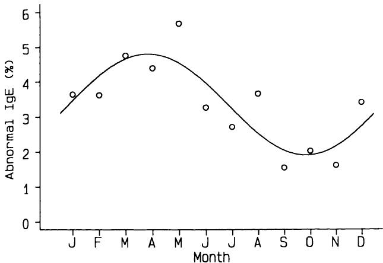  
图 14.12 IgE 值高于 $1.0 \mathrm{IU / ml}$ 的观察百分比与拟合正弦曲线。  
Figure 14.12 Observed percentages of IgE values above  $1.0 \mathrm{IU / ml}$  and fitted sine curve.  

（或正弦）曲线到数据。这种分析可以被视为一种复杂的回归形式。图 14.12 显示了异常 IgE 值的观察比例以及拟合曲线。这种分析（此处未作描述）显示出高度显著的季节性模式。  
(or sine) curve to the data. This analysis can be regarded as a complex form of regression. Figure 14.12 shows the observed proportions of abnormal IgE values together with the fitted curve. The analysis, which is not described here, shows a highly significant seasonal pattern.  

循环变异可能需要复杂的统计分析。在此处引入该主题的目的是再次说明，在选择最合适的分析方法时，需要明确考虑数据的性质。对于此类数据，我建议寻求专业的统计学建议。  
Cyclic variation may require complicated statistical analysis. The purpose of introducing the topic here is to show again how the nature of the data needs to be considered explicitly when selecting the most appropriate analysis. I recommend expert statistical advice for data of this type.  

## 练习  EXERCISES  

14.1 下表显示了使用放射性 $\left(^{51}\mathrm{Cr}\right)$ 和非放射性（生物素）细胞标记物同时测量 19 名患者的红细胞体积（Cavill 等，1988）：  
14.1 The following table shows red cell volume measured simultaneously in 19 patients using radioactive  $\left(^{51}\mathrm{Cr}\right)$  and non radioactive (biotin) cell labels (Cavill et al., 1988):  

<table><tr><td>Patient</td><td>51Cr volume (ml)</td><td>Biotin volume (ml)</td></tr><tr><td>1</td><td>1267</td><td>1954</td></tr><tr><td>2</td><td>1710</td><td>1651</td></tr><tr><td>3</td><td>1882</td><td>1887</td></tr><tr><td>4</td><td>1914</td><td>2043</td></tr><tr><td>5</td><td>1940</td><td>2054</td></tr><tr><td>6</td><td>1976</td><td>2075</td></tr><tr><td>7</td><td>2033</td><td>1976</td></tr><tr><td>8</td><td>2039</td><td>2120</td></tr></table>  
<table><tr><td>Patient</td><td>51Cr volume (ml)</td><td>Biotin volume (ml)</td></tr><tr><td>1</td><td>1267</td><td>1954</td></tr><tr><td>2</td><td>1710</td><td>1651</td></tr><tr><td>3</td><td>1882</td><td>1887</td></tr><tr><td>4</td><td>1914</td><td>2043</td></tr><tr><td>5</td><td>1940</td><td>2054</td></tr><tr><td>6</td><td>1976</td><td>2075</td></tr><tr><td>7</td><td>2033</td><td>1976</td></tr><tr><td>8</td><td>2039</td><td>2120</td></tr></table>  

436 医学研究中的一些常见问题  
436 Some common problems in medical research  

<table><tr><td>Patient</td><td>51Cr volume (ml)</td><td>Biotin volume (ml)</td></tr><tr><td>9</td><td>2077</td><td>2061</td></tr><tr><td>10</td><td>2087</td><td>2152</td></tr><tr><td>11</td><td>2102</td><td>1894</td></tr><tr><td>12</td><td>2139</td><td>1982</td></tr><tr><td>13</td><td>2184</td><td>2153</td></tr><tr><td>14</td><td>2192</td><td>2288</td></tr><tr><td>15</td><td>2393</td><td>2628</td></tr><tr><td>16</td><td>2425</td><td>2495</td></tr><tr><td>17</td><td>2554</td><td>2463</td></tr><tr><td>18</td><td>2600</td><td>3186</td></tr><tr><td>19</td><td>3420</td><td>3488</td></tr></table>  
<table><tr><td>Patient</td><td>51Cr volume (ml)</td><td>Biotin volume (ml)</td></tr><tr><td>9</td><td>2077</td><td>2061</td></tr><tr><td>10</td><td>2087</td><td>2152</td></tr><tr><td>11</td><td>2102</td><td>1894</td></tr><tr><td>12</td><td>2139</td><td>1982</td></tr><tr><td>13</td><td>2184</td><td>2153</td></tr><tr><td>14</td><td>2192</td><td>2288</td></tr><tr><td>15</td><td>2393</td><td>2628</td></tr><tr><td>16</td><td>2425</td><td>2495</td></tr><tr><td>17</td><td>2554</td><td>2463</td></tr><tr><td>18</td><td>2600</td><td>3186</td></tr><tr><td>19</td><td>3420</td><td>3488</td></tr></table>  

作者使用 Wilcoxon 配对秩和检验比较了两组数据，结果为 $\mathbf{P} > 0.05$ 。他们得出结论，方法比较“未显示两者之间存在一致的临床显著差异”。  
The authors compared the two sets of data by the Wilcoxon matched pairs rank sum test, for which they got  $\mathbf{P} > 0.05$  . They concluded that the comparison of methods 'showed no consistent clinically significant difference between the two'.  

(a) 评论他们的分析和解释。  
(a) Comment on their analysis and interpretation.  

(b) 进行更好的分析。  
(b) Carry out a better analysis.  

(c) 所有患者都因测量红细胞体积而被转诊，这一事实有何相关性。  
(c) What is the relevance of the fact that the patients had all been referred for the measurement of red cell volume.  

(d) 这些方法之间最大的差异是针对受试者1和18的。生物素法受先前鸡蛋摄入的影响，作者指出‘这些患者中至少有一人早餐吃了鸡蛋’。分析是否应考虑此信息？  
(d) The largest differences between the methods are those for subjects 1 and 18. The biotin method is affected by prior consumption of eggs, and the authors note that 'at least one of these patients had had an egg for breakfast'. Should the analysis take account of this information？  

14.2 Furst 和 Paulus (1975) 报告了一项研究，旨在比较12名类风湿关节炎患者和12名正常对照者体内氯尼辛的代谢情况。该药物作为治疗类风湿关节炎的抗炎镇痛剂正在研究中。在单次服用三片 $250 \mathrm{mg}$ 氯尼辛片剂后，在0、 $\frac{1}{2}$ 、1、2、4、6和8小时测量血清氯尼辛水平。作者没有报告初始（0小时）值；其余数据如下所示：  
14.2 Furst and Paulus (1975) reported a study to compare the metabolism of clonixin in 12 patients with rheumatoid arthritis and 12 normal controls. The drug was under investigation as an anti- inflammatory analgesic for treatment of rheumatoid arthritis. Serum clonixin levels were measured at 0,  $\frac{1}{2}$ , 1, 2, 4, 6 and 8 hours after administration of a single dose of three  $250 \mathrm{mg}$  tablets of clonixin. The authors did not report the initial (0 hour) values; the remaining data are shown below:  

类风湿关节炎患者：  
Patients with rheumatoid arthritis:  

<table><tr><td rowspan="3">患者</td><td colspan="6">氯尼辛水平 (μg/ml)</td></tr><tr><td rowspan="2">0.5</td><td rowspan="2">1</td><td colspan="4">时间 (小时)</td></tr><tr><td>2</td><td>4</td><td>6</td><td>8</td></tr><tr><td>1</td><td>12.70</td><td>32.20</td><td>42.00</td><td>19.80</td><td>7.09</td><td>2.10</td></tr><tr><td>2</td><td>18.48</td><td>40.24</td><td>45.87</td><td>15.61</td><td>5.58</td><td>3.25</td></tr><tr><td>3</td><td>6.70</td><td>20.60</td><td>27.70</td><td>11.49</td><td>2.48</td><td>0.56</td></tr></table>  
<table><tr><td rowspan="3">Patient</td><td colspan="6">Clonixin levels (μg/ml)</td></tr><tr><td rowspan="2">0.5</td><td rowspan="2">1</td><td colspan="4">Time (hours)</td></tr><tr><td>2</td><td>4</td><td>6</td><td>8</td></tr><tr><td>1</td><td>12.70</td><td>32.20</td><td>42.00</td><td>19.80</td><td>7.09</td><td>2.10</td></tr><tr><td>2</td><td>18.48</td><td>40.24</td><td>45.87</td><td>15.61</td><td>5.58</td><td>3.25</td></tr><tr><td>3</td><td>6.70</td><td>20.60</td><td>27.70</td><td>11.49</td><td>2.48</td><td>0.56</td></tr></table>  

<table><tr><td rowspan="3">患者</td><td colspan="6">氯尼辛水平 (μg/ml)</td></tr><tr><td colspan="6">时间 (小时)</td></tr><tr><td>0.5</td><td>1</td><td>2</td><td>4</td><td>6</td><td>8</td></tr><tr><td>4</td><td>24.20</td><td>16.20</td><td>7.84</td><td>5.30</td><td>0.38</td><td>0.00</td></tr><tr><td>5</td><td>14.70</td><td>28.30</td><td>31.90</td><td>16.08</td><td>9.20</td><td>3.60</td></tr><tr><td>6</td><td>6.55</td><td>29.17</td><td>33.30</td><td>15.17</td><td>3.17</td><td>0.00</td></tr><tr><td>7</td><td>41.70</td><td>29.40</td><td>16.90</td><td>7.04</td><td>3.48</td><td>2.56</td></tr><tr><td>8</td><td>1.49</td><td>47.26</td><td>32.78</td><td>15.89</td><td>4.72</td><td>2.61</td></tr><tr><td>9</td><td>13.04</td><td>19.08</td><td>39.47</td><td>12.42</td><td>4.91</td><td>2.86</td></tr><tr><td>10</td><td>29.28</td><td>44.94</td><td>45.72</td><td>12.71</td><td>4.43</td><td>1.67</td></tr><tr><td>11</td><td>8.61</td><td>20.34</td><td>44.33</td><td>6.74</td><td>2.15</td><td>1.11</td></tr><tr><td>12</td><td>28.10</td><td>56.10</td><td>36.68</td><td>19.10</td><td>5.62</td><td>1.82</td></tr></table>  
<table><tr><td rowspan="3">Patient</td><td colspan="6">Clonixin levels (μg/ml)</td></tr><tr><td colspan="6">Time (hours)</td></tr><tr><td>0.5</td><td>1</td><td>2</td><td>4</td><td>6</td><td>8</td></tr><tr><td>4</td><td>24.20</td><td>16.20</td><td>7.84</td><td>5.30</td><td>0.38</td><td>0.00</td></tr><tr><td>5</td><td>14.70</td><td>28.30</td><td>31.90</td><td>16.08</td><td>9.20</td><td>3.60</td></tr><tr><td>6</td><td>6.55</td><td>29.17</td><td>33.30</td><td>15.17</td><td>3.17</td><td>0.00</td></tr><tr><td>7</td><td>41.70</td><td>29.40</td><td>16.90</td><td>7.04</td><td>3.48</td><td>2.56</td></tr><tr><td>8</td><td>1.49</td><td>47.26</td><td>32.78</td><td>15.89</td><td>4.72</td><td>2.61</td></tr><tr><td>9</td><td>13.04</td><td>19.08</td><td>39.47</td><td>12.42</td><td>4.91</td><td>2.86</td></tr><tr><td>10</td><td>29.28</td><td>44.94</td><td>45.72</td><td>12.71</td><td>4.43</td><td>1.67</td></tr><tr><td>11</td><td>8.61</td><td>20.34</td><td>44.33</td><td>6.74</td><td>2.15</td><td>1.11</td></tr><tr><td>12</td><td>28.10</td><td>56.10</td><td>36.68</td><td>19.10</td><td>5.62</td><td>1.82</td></tr></table>  

对照受试者：  
Control subjects:  

<table><tr><td rowspan="3">患者</td><td colspan="6">氯尼辛水平 (μg/ml)</td></tr><tr><td colspan="6">时间 (小时)</td></tr><tr><td>0.5</td><td>1</td><td>2</td><td>4</td><td>6</td><td>8</td></tr></table>  
<table><tr><td rowspan="3">Patient</td><td colspan="6">Clonixin levels (μg/ml)</td></tr><tr><td colspan="6">Time (hours)</td></tr><tr><td>0.5</td><td>1</td><td>2</td><td>4</td><td>6</td><td>8</td></tr></table>  

(a) 绘制各组的平均水平。  
(a) Plot the mean levels in each group.  

(b) 比较两组的峰值水平和曲线下面积，使用合适的分析方法，假设氯尼辛水平在零时刻为 0.0。（AUC 在计算机程序中易于计算，但手动计算则相当繁琐。）  
(b) Compare the peak levels and the area under the curve in the two groups using a suitable analysis assuming that the clonixin level is 0.0 at time zero. (The AUC is easy to calculate in a computer program, but is rather tedious to do by hand.)  

(c) 来自   
(c) Are the plots from   
(a) 能否很好地代表数据？  
(a) a good representation of the data？  

14.3 对有关测谎仪（lie-detector）研究的文献检索得出该机器的敏感性和特异性分别为 0.76 和 0.63 (Brett et al., 1986)。建议将测谎仪与询问潜在献血者是否吸毒结合使用。（假设所有非吸毒者都说真话。）  
14.3 A search of the literature for studies concerning the polygraph (lie- detector) led to the assessment of the sensitivity and specificity of the machine as 0.76 and 0.63 respectively (Brett et al., 1986). It is proposed that the polygraph be used in association with questioning potential blood donors about whether they are drug users. (Assuming that all non- drug users tell the truth.)  

(a) 如果 $5\%$ 的潜在献血者吸毒，其中三分之一的人对此撒谎，那么来自吸毒者的献血比例是多少？   
(a) If  $5\%$  of potential donors use drugs and a third of them lie about it, what proportion of blood donations will be from drug users？   
(b) 测谎仪测试失败的人中，吸毒者的比例是多少？  
(b) What proportion of people failing the polygraph test will be drug users？  

14.4 急性下呼吸道感染是发展中国家婴儿和五岁以下儿童最常见的死亡原因之一。需要一种简单的测试来区分急性呼吸道感染中患有下呼吸道感染（LRI）应接受抗生素治疗的婴儿与患有上呼吸道感染（URI）的婴儿。以下数据来自一项关于呼吸频率在婴儿中用于此目的的有用性的研究 (Cherian et al., 1988)：  
14.4 Acute lower respiratory tract infection is one of the commonest causes of death among infants and under- 5s in developing countries. A simple test is needed to identify those infants with acute respiratory infection who have lower respiratory tract infection (LRI) and should receive antibiotics from those with upper respiratory tract infection (URI). The following data come from a study of the usefulness of the respiratory rate for this purpose in infants (Cherian et al., 1988):  

<table><tr><td rowspan="2">Respiratory rate (breaths/min)</td><td colspan="2">Number of children (%)</td></tr><tr><td>LRI</td><td>URI</td></tr><tr><td>0–30</td><td>1 (1%)</td><td>16 (11%)</td></tr><tr><td>31–40</td><td>4 (3%)</td><td>77 (51%)</td></tr><tr><td>41–50</td><td>10 (7%)</td><td>46 (30%)</td></tr><tr><td>51–60</td><td>41 (29%)</td><td>9 (6%)</td></tr><tr><td>61+</td><td>86 (61%)</td><td>3 (2%)</td></tr><tr><td>Total</td><td>142 (100%)</td><td>151 (100%)</td></tr></table>  
<table><tr><td rowspan="2">Respiratory rate (breaths/min)</td><td colspan="2">Number of children (%)</td></tr><tr><td>LRI</td><td>URI</td></tr><tr><td>0–30</td><td>1 (1%)</td><td>16 (11%)</td></tr><tr><td>31–40</td><td>4 (3%)</td><td>77 (51%)</td></tr><tr><td>41–50</td><td>10 (7%)</td><td>46 (30%)</td></tr><tr><td>51–60</td><td>41 (29%)</td><td>9 (6%)</td></tr><tr><td>61+</td><td>86 (61%)</td><td>3 (2%)</td></tr><tr><td>Total</td><td>142 (100%)</td><td>151 (100%)</td></tr></table>  

(a) 对于 30、40、50 和 60 次呼吸/分钟这四个截止点中的每一个，构建 $2 \times 2$ 表，将低呼吸频率和高呼吸频率与正确分类（LRI 或 URI）关联起来。哪个截止点能提供最佳的敏感性和特异性平衡？（即它们的总和最大。）  
(a) Construct  $2 \times 2$  tables for each of the four cut-offs 30, 40, 50 and 60 breaths/min relating low and high respiratory rate to the correct classification (LRI or URI). Which cut-off gives the best balance of sensitivity and specificity？ (This is where their sum is a maximum.)  

(b) 报告作者估计，在发展中国家，所有急性呼吸道感染婴儿中LRI的患病率为 $3\%$。当患病率为 $3\%$ 时，哪个临界值能提供最佳的阳性预测值和阴性预测值平衡？  
(b) The authors of the report estimated that the prevalence of LRI among all infants with acute respiratory infection in a developing country is  $3\%$ . Which cut-off gives the best balance of positive and negative predictive values when the prevalence is  $3\%$ ？  

(c) 如果将呼吸频率 $>50$ 次/分钟作为LRI的指征，并且所有此类儿童都接受抗生素治疗，那么接受治疗的婴儿中，有多少比例是接受了不必要的治疗？有多少比例的LRI婴儿将无法获得抗生素治疗？  
(c) If a respiratory rate of  $>50$  breaths/min is taken as an indication of LRI and all such children are treated with antibiotics, what proportion of treated infants will have been treated unnecessarily？ What proportion of LRI infants would not get antibiotics？  

(d) 目前，全科医生无法判断哪些婴儿患有LRI，并且约 $80\%$ 的呼吸道感染（LRI或URI）婴儿会接受抗生素治疗。建议的政策对所用抗生素量会有什么影响   
(d) At present general practitioners cannot tell which infants have LRI and about  $80\%$  of infants with respiratory tract infection (LRI or URI) receive antibiotics. What would be the effect on the amount of antibiotics used of the policy suggested in   
(c)中？  
(c)？  

14.5 一项观察者变异性研究使用X射线诊断3869颗磨牙和前磨牙的龋齿情况（Espeland 和 Handelman, 1989）。下表显示了三位牙医的结果。牙齿被诊断为健康（S）或龋坏（C）。  
14.5 A study of observer variation was performed using radiographic diagnosis of caries on 3869 molars and premolars (Espeland and Handelman, 1989). The following table shows the results for three dentists. Teeth were diagnosed as sound (S) or carious (C).  

<table><tr><td colspan="4">牙医</td></tr><tr><td>1</td><td>2</td><td>3</td><td>频率</td></tr><tr><td>S</td><td>S</td><td>S</td><td>2128</td></tr><tr><td>S</td><td>S</td><td>C</td><td>1122</td></tr><tr><td>S</td><td>C</td><td>S</td><td>54</td></tr><tr><td>S</td><td>C</td><td>C</td><td>226</td></tr><tr><td>C</td><td>S</td><td>S</td><td>36</td></tr><tr><td>C</td><td>S</td><td>C</td><td>87</td></tr><tr><td>C</td><td>C</td><td>S</td><td>7</td></tr><tr><td>C</td><td>C</td><td>C</td><td>209</td></tr></table>  
<table><tr><td colspan="4">Dentist</td></tr><tr><td>1</td><td>2</td><td>3</td><td>Frequency</td></tr><tr><td>S</td><td>S</td><td>S</td><td>2128</td></tr><tr><td>S</td><td>S</td><td>C</td><td>1122</td></tr><tr><td>S</td><td>C</td><td>S</td><td>54</td></tr><tr><td>S</td><td>C</td><td>C</td><td>226</td></tr><tr><td>C</td><td>S</td><td>S</td><td>36</td></tr><tr><td>C</td><td>S</td><td>C</td><td>87</td></tr><tr><td>C</td><td>C</td><td>S</td><td>7</td></tr><tr><td>C</td><td>C</td><td>C</td><td>209</td></tr></table>  

(a) 哪对牙医的一致性最好？  
(a) Which pair of dentists agreed best？  

(b) 这算是一个好的一致性水平吗？  
(b) Is this a good level of agreement？  
