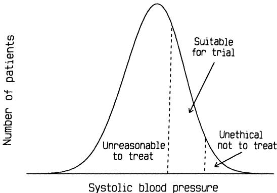
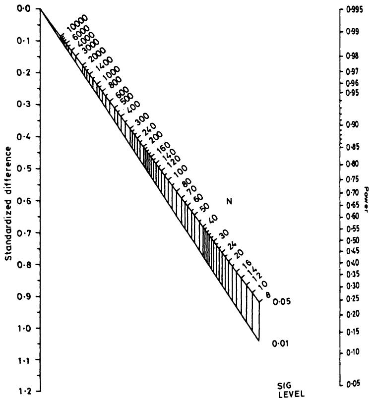
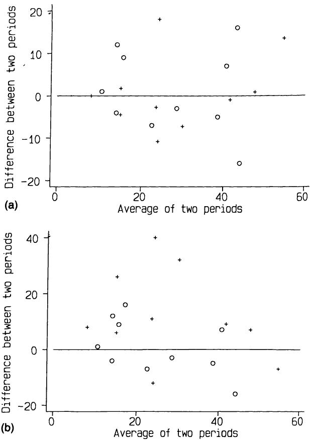

# 15 临床试验
# 15 Clinical trials

在对照试验中，如同所有实验工作一样，没有必要为了追求精确性而置常识于不顾。
In a controlled trial, as in all experimental work, there is no need for the search for precision to throw sense out of the window.

希尔 (1963)
Hill (1963)

## 15.1 引言
## 15.1 INTRODUCTION

临床试验是对人类进行的一项有计划的实验，旨在评估一种或多种治疗形式的有效性。试验可以用来评估任何在最广泛意义上被视为潜在治疗的方法，例如药物、外科手术、物理疗法、饮食、针灸、健康教育等。我将使用“临床试验”一词来指代任何此类研究。
A clinical trial is a planned experiment on human beings which is designed to evaluate the effectiveness of one or more forms of treatment. Trials can be carried out to evaluate anything that may be considered a potential treatment in its widest sense, such as drugs, surgical procedures, physiotherapy, diet, acupuncture, health education, and so on. I shall use the term clinical trial to refer to any such study.

临床试验因其医学重要性、设计和分析中的一些特殊问题以及某些伦理问题而值得特别关注。所使用的方法论大约在50年前被引入医学研究，其中最著名的早期例子是一项比较链霉素加卧床休息与单独卧床休息治疗肺结核的试验（MRC, 1948）。在20世纪40年代之前，比较临床试验几乎闻所未闻。Pocock (1983, p. 14) 总结了临床试验的历史发展。
Clinical trials merit special attention because of their medical importance, some particular problems in design and analysis, and certain ethical problems. The methodology that is used was introduced into medical research about 50 years ago, with the most famous early example being a trial comparing streptomycin and bed rest with bed rest alone in the treatment of pulmonary tuberculosis (MRC, 1948). Comparative clinical trials were virtually unknown before the 1940s. Pocock (1983, p. 14) gives a summary of the historical development of clinical trials.

在制药行业内，临床试验被分为以下四类：
Within the pharmaceutical industry clinical trials are classified into one of four categories:

1. 阶段I：临床药理学和毒性；
1. Phase I: Clinical pharmacology and toxicity;

2. 阶段II：初步临床研究；
2. Phase II: Initial clinical investigation;

3. 阶段III：治疗的全面评估；
3. Phase III: Full scale evaluation of treatment;

4. 阶段IV：上市后监测。
4. Phase IV: Postmarketing surveillance.

在本章中，我将只讨论III期临床试验。它们具有一个显著特点，即涉及两种或多种治疗方法之间的直接比较。它们通常被称为比较试验或对照试验。尽管有些对照试验旨在比较两种以上的治疗方法，但我将重点关注常见的两组情况。我通常会将这两种治疗方法视为一种实验性治疗（可能是一种新药）和一种对照治疗，后者可能是
In this Chapter I shall consider only Phase III trials. They have the distinguishing feature that they involve direct comparison between two or more treatments. They are often referred to as comparative trials or controlled trials. Although some controlled trials are set up to compare more than two treatments I shall concentrate on the common two group case. I shall usually consider the two treatments to be an experimental treatment, perhaps a new drug, and a control treatment, which may be a

标准治疗、安慰剂，甚至完全不治疗，具体取决于情况。
standard treatment, a placebo, or even no treatment at all, depending on circumstances.

在实践中，绝大多数比较性临床试验都具有某些共同特征，这使得在设计、分析和解释方面提供一般性指导成为可能。或许正因为如此，临床试验可能是医学研究领域中统计思想和方法论结合最成功的领域。
In practice the vast majority of comparative clinical trials have certain features in common which makes it possible to give general guidance on design, analysis and interpretation. Perhaps for this reason, clinical trials are probably the area of medical research where the integration of statistical ideas and methodology has been most successful.

临床试验的核心思想是，我们希望比较仅在治疗方面有所不同的患者组。如果各组在其他方面存在差异，那么治疗比较就会出现偏倚。如果我们能够识别偏倚，那么在分析中可能可以考虑其影响，但未知的偏倚则无法处理。本章描述的设计和分析方法旨在消除偏倚。
The key idea of a clinical trial is that we wish to compare groups of patients who differ only with respect to their treatment. If the groups differ in some other way then the comparison of treatments is biased. If we can identify a bias then it may be possible to allow for its effect in the analysis, but unknown biases cannot be dealt with. The methods of design and analysis described in this chapter are aimed at the elimination of bias.

对本章所涵盖问题以及此处未涵盖主题的更深入探讨，可在几本专门论述临床试验的著作中找到，其中特别推荐Pocock（1983）的著作。此外，Peto等人（1976）和Pocock（1985）的论文讨论了一些更棘手的问题。最后，Bradford Hill（1984）的著名著作中关于临床试验的章节也蕴含着诸多智慧。
Deeper consideration of the issues covered in this chapter, as well as topics not covered here, can be found in several books devoted to clinical trials, of which that by Pocock (1983) is particularly recommended. In addition, the papers by Peto et al. (1976) and Pocock (1985) discuss some of the trickier issues. Lastly, much wisdom can be found in the chapter on clinical trials in the famous book by Bradford Hill (1984).

## 15.2 临床试验的设计
## 15.2 DESIGN OF CLINICAL TRIALS

### 15.2.1 需要比较组
### 15.2.1 The need for a comparison group

引入一种新疗法是一个漫长而复杂的过程，许多看似有前景的疗法最终都半途而废。自然而然地，调查会从对一些患者尝试新疗法以观察其效果开始。这类研究是无对照的，因此患者身上出现的任何益处或有害影响都会自然而然地完全归因于该疗法。这类研究通常是开放的，临床医生和患者都知道每位患者正在接受何种治疗。研究者对新疗法的天然热情很可能会影响他对患者进展的判断，也可能传递给患者并影响他们的幸福感，特别是对于症状主观的疾病，如疼痛程度。许多早期此类研究曾表明新疗法非常有效，但这种表面上的益处在更仔细的检查后却消失了。在某些情况下，早期结果可能导致某种疗法在未经我们现在认为充分的调查之前就被采纳。有几个例子是，某种疗法在临床使用了多年后才进行调查，结果发现无效。其中一个例子是胃冷冻疗法治疗十二指肠溃疡，它在七年内被发现、采纳并废弃（Miao，1977）。一个特别显著的例子是婴儿视网膜后纤维增生症导致
The introduction of a new treatment is a long and complex affair, and many apparently promising therapies fall by the wayside. It is natural to begin investigation by trying a new treatment on some patients to see what happens. This type of study is uncontrolled, so that any benefits or harmful effects seen in the patients will naturally be ascribed solely to the treatment. Such studies are usually open, where the clinician and the patients know what treatment each patient is getting. The investigator's natural enthusiasm for the new treatment may well influence his judgement of the patients' progress, and may also be transmitted to the patients and affect their well- being, especially for conditions where symptoms are subjective, such as degree of pain. Many early studies of this type have suggested that new treatments were highly effective, only for this apparent benefit to disappear on more careful examination. In some cases early results may lead to a treatment being adopted without what we would now consider to be adequate investigation. There are several instances of treatments being investigated after many years' clinical use and being found ineffective. One such was gastric freezing as a treatment for duodenal ulcer, which was discovered, adopted and abandoned within the space of seven years (Miao, 1977). A particularly marked example is the story of the epidemic in babies of retrolental fibroplasia leading to

失明的故事。在20世纪50年代，高剂量氧气被给予极度早产儿。然而，用促肾上腺皮质激素治疗早期眼部变化的婴儿，成功率为 $75\%$ 。氧气和激素治疗都未经对照试验的益处就被采纳了。直到临床使用了几年后，在临床试验迟迟进行后才发现，激素治疗无效— $75\%$ 的此类婴儿未经治疗即可恢复正常—而氧气治疗则是有害的；它最初导致了失明（Silverman，1985）。
blindness. In the 1950s high doses of oxygen were given to very premature babies. However, the treatment of infants with early eye changes with adrenocorticotrophic hormone had a  $75\%$  success rate. Both the oxygen and hormone treatments had been adopted without the benefit of controlled trials. Only after several years of clinical use was it found, after clinical trials were belatedly carried out, that the hormone treatment was ineffective -  $75\%$  of such infants return to normal without treatment - and that the oxygen treatment was positively harmful; it caused the blindness in the first place (Silverman, 1985).

非对照试验（上文称之为II期试验）有其存在的价值，但它们往往会得出过于乐观，从而有偏倚的结果。对新疗法的最终评估应与替代疗法的有效性进行比较。
There is a place for uncontrolled experiments, designated above as Phase II trials, but they tend to give over- optimistic, and hence biased, results. Definitive assessment of a new treatment should be in relation to the effectiveness of an alternative treatment.

正如我们将看到的，如果两种治疗方法同时进行研究，患者的治疗分配通过随机过程进行，并且患者和临床医生都不知道接受了哪种治疗，那么这将具有主要优势。随机双盲对照试验通常被视为衡量试验设计质量的“金标准”。
As we will see, there are major advantages if the two treatments are investigated concurrently, allocation of treatments to patients is by a random process, and neither the patient nor the clinician knows which treatment was received. The randomized double- blind controlled trial is usually taken as the 'gold standard' against which to judge the quality of the design of a trial.

### 15.2.2 随机分配
### 15.2.2 Random allocation

设计中的一个关键问题是确保治疗分配与患者特征无关—换句话说，它是以无偏倚的方式进行的。最广泛使用的无偏倚治疗分配方法是使用随机分配来决定每位患者接受哪种治疗。正如我们在第5章中看到的，随机分配使所有受试者都有相同的机会接受任一治疗，因此根据定义是无偏倚的。使用随机抽样的另一个重要原因是，统计分析方法基于我们期望在具有特定特征的总体随机样本中发生的情况。
A vital issue in design is to ensure that the allocation of treatments to patients is independent of the characteristics of the patients - in other words, it is carried out in an unbiased way. The most widely used method of unbiased treatment allocation is to use random allocation to determine which treatment each patient gets. As we saw in Chapter 5, random allocation gives all subjects the same chance of receiving either treatment and is thus unbiased by definition. Another important reason for using random sampling is that statistical methods of analysis are based on what we expect to happen in random samples from populations with specified characteristics.

尽可能地，非常希望接受不同治疗的患者组在可能影响其疗效的特征方面（即预后方面）非常相似。例如，在大多数研究中，各组的年龄分布相似很重要，因为预后通常与年龄密切相关。然而，不能保证随机化实际上会导致各组非常相似。各组之间的任何差异都将是偶然产生的，但这些差异至少会带来不便，并可能导致对试验结果解释的质疑。虽然可以修改分析以考虑开始时各组之间的任何差异（参见第15.4节），但最好在设计阶段就尝试控制这个问题。最明显地，这可以通过使用
It is highly desirable that, as far as is possible, the groups of patients receiving the different treatments are very similar with regard to features that may affect how well they do, that is in their prognosis. For example. in most studies it is important that the age distribution of the groups similar, because prognosis is very often related to age. There is a guarantee, however, that randomization will in fact lead to the groups being very similar. Any differences between the groups will have arise a chance, but such differences can be at least inconvenient, and may lead to doubts being cast on the interpretation of the trial results. While it s possible to modify the analysis to take account of any differences between the groups at the start (see section 15.4), it is far better to try to control the problem at the design stage. Most obviously this can be done by using

分层随机化来完成，如第5.7.3节所述。如果我们事先知道有几个关键变量具有很强的预后作用，那么它们可以被纳入分层随机化方案。正如在第5.7.3节中观察到的，分层随机化必须使用区组，否则与简单随机化相比没有优势。可能还有其他我们无法测量或尚未识别的重要变量，我们必须依靠随机化来平衡它们。分层设计的好处并未被广泛接受（Peto 等，1976；Meier，1981），特别是由于复杂性的增加，为执行中的错误提供了更多空间。获得良好匹配组的另一种方法是使用下一节中描述的最小化技术。
stratified randomization, as described in section 5.7.3. If we know in advance that there are a few key variables that are strongly prognostic then they can be incorporated into a stratified randomization scheme. As observed in section 5.7.3, it is essential that stratified randomization uses blocking, otherwise there is no benefit over simple randomization. There may well be other important variables that we cannot measure or have not identified, and we must rely on the randomization to balance them out. The benefits of having a stratified design are not widely accepted (Peto et al., 1976; Meier, 1981), especially as the increased complexity gives more scope for errors in execution.A different method of obtaining well- matched groups is to use the technique of minimization described in the next section.

获得良好匹配组的另一种方法是使用下一节中描述的最小化技术。
A different method of obtaining well- matched groups is to use the technique of minimization described in the next section.

### 15.2.3 最小化
### 15.2.3 Minimization

在上一节中强调了比较研究中随机分配的必要性。在临床试验中使用非随机对照会严重降低结果的可信度。
The desirability of random allocation in comparative studies was stressed in the previous section. The use of non- random controls in clinical trials severely lessens the credibility of the results.

然而，最小化是一种可以安全使用的非随机方法。事实上，除非样本量很大，否则它比简单随机抽样或分层随机抽样都具有明显的优势。即使在小样本中，使用最小化也能使治疗组在多个变量上非常相似。它特别适用于小型试验以及从多个中心招募少量患者的试验。
Minimization is one non- random method, however, that can be used safely. Indeed, it has definite advantages over both simple or stratified random sampling, unless the sample size is large. The use of minimization will provide treatment groups very closely similar for several variables, even in small samples. It is especially suitable for smaller trials and for trials where small numbers of patients are recruited from each of several centres.

表15.1 乳腺癌患者胸腔积液对照试验中丝裂霉素与滑石粉治疗组患者的部分基线特征（Fentiman 等，1983）  
Table 15.1 Some baseline characteristics of patients in a controlled trial of mustine versus talc in the control of pleural effusions in patients with breast cancer (Fentiman et al., 1983)  

<table><tr><td rowspan="2"></td><td colspan="2">治疗</td></tr><tr><td>丝裂霉素 (n = 23)</td><td>滑石粉 (n = 23)</td></tr><tr><td>平均年龄 (SE)</td><td>50.3 (1.5)</td><td>55.3 (2.2)</td></tr><tr><td>疾病分期：</td><td></td><td></td></tr><tr><td>1 或 2</td><td>52%</td><td>74%</td></tr><tr><td>3 或 4</td><td>48%</td><td>26%</td></tr><tr><td>乳腺癌诊断与积液诊断之间的平均间隔月数 (SE)</td><td>33.1 (6.2)</td><td>60.4 (13.1)</td></tr><tr><td>绝经后</td><td>43%</td><td>74%</td></tr></table>
<table><tr><td rowspan="2"></td><td colspan="2">Treatment</td></tr><tr><td>Mustine (n = 23)</td><td>Talc (n = 23)</td></tr><tr><td>Mean age (SE)</td><td>50.3 (1.5)</td><td>55.3 (2.2)</td></tr><tr><td>Stage of disease:</td><td></td><td></td></tr><tr><td>1 or 2</td><td>52%</td><td>74%</td></tr><tr><td>3 or 4</td><td>48%</td><td>26%</td></tr><tr><td>Mean interval in months between breast cancer diagnosis and effusion diagnosis (SE)</td><td>33.1 (6.2)</td><td>60.4 (13.1)</td></tr><tr><td>Postmenopausal</td><td>43%</td><td>74%</td></tr></table>

表15.1显示了随机分配接受丝裂霉素或滑石粉治疗胸腔积液的乳腺癌患者的一些特征。这项小型试验采用了简单随机化，结果偶然导致两个治疗组之间存在显著差异。分层随机化本可以有所帮助，但在如此小的试验中，对多个变量进行分层是不可行的。如果采用最小化方法，这两个组在所有这些变量上都会非常相似，结果也会更具说服力。
Table 15.1 shows some characteristics of breast cancer patients randomized to receive either mustine or talc as a treatment for pleural effusions. Simple randomization was used in the small trial, and by chance the two treatment groups were noticeably different. Stratified randomization would have helped, but it is not feasible to stratify on several variables in such a small trial. With minimization the two groups would have been very similar with respect to all of these variables, and the results would have been more convincing.

最小化基于与随机化完全不同的原理。如果我们把试验患者看作是逐个入组的，那么第一位患者是随机分配治疗的。对于随后的每一位患者，我们确定哪种治疗能在感兴趣的变量方面使组间达到更好的平衡。然后，患者会通过加权随机化（参见5.7.1节）分配治疗，倾向于选择能最大程度减少不平衡的治疗。例如，我们可以使用4比1的加权，这样每位患者有 $80\%$ 的机会获得能最小化不平衡的治疗。这种程序的效果是，与简单随机化相比，各组在所选变量方面会更加相似。
Minimization is based on a completely different principle from randomization. If we regard the patients for the trial as arriving one at a time, then the first patient is given a treatment at random. For each subsequent patient we determine which treatment would lead to better balance between the groups with respect to the variables of interest. The patient is then randomized using a weighting (see section 5.7.1) in favour of the treatment which would minimize the imbalance. For example, we might use a weighting of 4 to 1, so that there is an  $80\%$  chance of each patient getting the treatment that minimizes the imbalance. The effect of this procedure is that the groups will be much more similar with regard to the chosen variables than they would be with simple randomization.

假设丝裂霉素与滑石粉的试验采用了基于表15.1所示的四个变量的最小化方法。对于每个变量，我们可以将其可能的值分为两组，如下所示：
Suppose that the mustine vs talc trial had used minimization based on the four variables shown in Table 15.1. For each variable we can divide the possible values into two groups, as follows:

年龄（岁） $\leq 50$ 或 $>50$ 疾病分期 1或2 或 3或4 癌症诊断与积液诊断之间的时间（月） $\leq 30$ 或 $>30$ 绝经状态 绝经前或绝经后
Age (years)  $\leq 50$  or  $>50$  Stage of disease 1 or 2 or 3 or 4 Time between diagnosis of cancer and  $\leq 30$  or  $>30$  diagnosis of effusions (months) Menopausal status Pre or Post

假设在29名患者入组后，每个治疗组中每个亚组的患者数量如表15.2所示。我们现在希望将一名具有以下特征的患者纳入试验：57岁；3期；时间间隔22个月；绝经后。具有该患者特征且已在两个治疗组中的女性数量如表15.3所示。由于我们希望两个组尽可能相似，新患者的优选治疗是总数较小的那一组。在这里，我们将使用加权随机化，倾向于选择滑石粉。
Suppose that after 29 patients had entered this trial the numbers in each subgroup in each treatment group were as shown in Table 15.2. We now wish to enter into the trial a patient with the following characteristics: 57 years old; stage 3; time interval 22 months; postmenopausal. The numbers of women with this patient's characteristics already in the two treatment groups are shown in Table 15.3. As we wish to have the two groups as similar as possible, the preferable treatment for the new patient is that with the smaller total. Here we would use weighted randomization with a weighting in favour of talc.

患者被分配到治疗组后，各组的数字会更新，并为下一位患者重复此过程。如果对于任何患者，两种治疗的总数相同，则应像对待第一位患者一样，使用简单（无加权）随机化进行选择。该方法可以简单地扩展到具有两个以上类别的变量以及涉及两种以上治疗的试验。
After the patient is allocated to a treatment the numbers in each group are updated and the process is repeated for the next patient. If for any patient the totals for the two treatments are the same, then the choice should be made using simple (unweighted) randomization, as it is for the first patient. The method extends simply to variables with more than two categories and to trials of more than two treatments.

表15.2 临床试验中前29名患者的特征，该试验使用最小化方法分配治疗  
Table 15.2 Characteristics of the first 29 patients in a clinical trial using minimization to allocate treatments  

<table><tr><td></td><td></td><td>丝裂霉素 
<table><tr><td></td><td></td><td>Mustine 
(n = 15)</td><td>滑石粉 
(n = 15)</td><td>Talc 
(n = 14)</td></tr><tr><td rowspan="2">年龄</td><td>≤ 50</td><td>7</td><td>6</td></tr><tr><td>&amp;gt; 50</td><td>8</td><td>8</td></tr><tr><td rowspan="2">分期</td><td>1 或 2</td><td>11</td><td>11</td></tr><tr><td>3 或 4</td><td>4</td><td>3</td></tr><tr><td rowspan="2">时间间隔</td><td>≤ 30 月</td><td>6</td><td>4</td></tr><tr><td>&amp;gt; 30 月</td><td>9</td><td>10</td></tr><tr><td rowspan="2">绝经状态</td><td>绝经前</td><td>7</td><td>5</td></tr><tr><td>绝经后</td><td>8</td><td>9</td></tr></table>
(n = 14)</td></tr><tr><td rowspan="2">Age</td><td>≤ 50</td><td>7</td><td>6</td></tr><tr><td>&amp;gt; 50</td><td>8</td><td>8</td></tr><tr><td rowspan="2">Stage</td><td>1 or 2</td><td>11</td><td>11</td></tr><tr><td>3 or 4</td><td>4</td><td>3</td></tr><tr><td rowspan="2">Time interval</td><td>≤ 30 m</td><td>6</td><td>4</td></tr><tr><td>&amp;gt; 30 m</td><td>9</td><td>10</td></tr><tr><td rowspan="2">Menopausal status</td><td>Pre</td><td>7</td><td>5</td></tr><tr><td>Post</td><td>8</td><td>9</td></tr></table>

表15.3 为第30位患者分配治疗时患者特征不平衡的计算  
Table 15.3 Calculation of imbalance in patient characteristics for allocating treatment to the thirtieth patient  

<table><tr><td></td><td></td><td>氮芥 
<table><tr><td></td><td></td><td>Mustine 
(n = 15)</td><td>滑石粉 
(n = 15)</td><td>Talc 
(n = 14)</td></tr><tr><td>年龄</td><td>&amp;gt; 50</td><td>8</td><td>8</td></tr><tr><td>分期</td><td>3 或 4</td><td>4</td><td>3</td></tr><tr><td>时间间隔</td><td>≤ 30 月</td><td>6</td><td>4</td></tr><tr><td>绝经后</td><td></td><td>8</td><td>9</td></tr><tr><td></td><td></td><td>总计 26</td><td>24</td></tr></table>
(n = 14)</td></tr><tr><td>Age</td><td>&amp;gt; 50</td><td>8</td><td>8</td></tr><tr><td>Stage</td><td>3 or 4</td><td>4</td><td>3</td></tr><tr><td>Time interval</td><td>≤ 30 m</td><td>6</td><td>4</td></tr><tr><td>Postmenopausal</td><td></td><td>8</td><td>9</td></tr><tr><td></td><td></td><td>Total 26</td><td>24</td></tr></table>

分配治疗时可以省略随机成分，这样每位患者都会自动获得导致不平衡较小的治疗。尽管特定患者接受的治疗以复杂的方式取决于已入组患者的特征，但缺乏随机元素会引入一小部分选择偏倚的可能性。因此，优选使用加权随机化。
The random component can be omitted from the allocation of treatments, so that each patient is automatically given the treatment which leads to less imbalance. Although the treatment that a particular patient receives depends in a complicated way upon the characteristics of the patients already entered into the trial, the absence of a random element introduces a small possibility of selection bias. It is preferable therefore to use weighted randomization.

最小化是普通随机化的一种有效替代方法，它具有重要的优势，尤其是在小型试验中，即在分配过程中所使用的变量方面，各组之间只会存在微小差异。它特别适合借助计算机程序进行操作，但如果每位新患者入组后，每组中具有每种特征的患者数量记录都得到更新，那么“手动”操作也并不困难。
Minimization is a valid alternative to ordinary randomization, and it has the important advantage, especially in small trials, that there will be only minor differences between the groups with respect to those variables used in the allocation process. It is particularly suitable to be performed with the aid of a computer program, but it is not difficult to perform 'by hand' if the record of the numbers of patients with each characteristic in each group is updated after each new patient has entered the trial.

### 15.2.4 其他治疗分配方法
### 15.2.4 Other methods of treatment allocation

随机分配的替代方法可分为系统性（或伪随机）方法和非随机方法。非随机试验可进一步分为伴有同期对照或非同期（或历史）对照的试验。
Alternatives to random allocation may be divided into systematic (or pseudo- random) methods and non- random methods. Non- randomized trials can be further divided into those with concurrent or non- concurrent (or historical) controls.

#### (a) 系统分配
#### (a) Systematic allocation  <!— 非数字标题，四级 —>

一种常见的方法是根据患者的出生日期或入组日期来分配治疗（例如，将治疗A分配给偶数日期入组的患者，将治疗B分配给奇数日期入组的患者），或者根据住院号的末位数字，或者简单地在不同治疗组之间交替分配。尽管所有这些方法原则上都是无偏的，但分配系统的公开性会带来问题。直白地说，众所周知，有权接触分配程序的人可能会更改分配。此外，了解患者将要接受哪种治疗可能会影响是否将该患者纳入试验的决定。虽然此类行为通常是出于利他动机，但结果却是偏倚的分配，并且很可能导致一组毫无价值的数据。
A common approach is to allocate treatments to patients according to the patient's date of birth or date of enrolment in the trial (such as giving treatment A to those with even dates, and treatment B to those with odd dates), by the terminal digit of the hospital number, or simply alternately into the different treatment groups. While all of these approaches are in principle unbiased, problems arise from the openness of the allocation system. Put crudely, it is a well- known phenomenon for the allocation to be altered by someone with access to the procedure. Further, knowledge of which treatment a patient is destined to receive can affect the decision about whether to enter that patient into the trial. While such actions are often taken for altruistic motives, the result is a biased allocation and quite possibly a worthless set of data.

尽管系统分配看起来无偏，但它容易被滥用，因此除非确实没有其他选择，否则不建议使用。术语“伪随机”具有误导性，因为它不包含随机元素，并且该方法明显劣于真正的随机分配。
Although systematic allocation appears unbiased, it is open to abuse and cannot be recommended unless there really is no alternative. The term 'pseudo- random' is misleading, as there is no random element and the method is definitely inferior to true random allocation.

#### (b) 非随机同期对照
#### (b) Non-random concurrent controls  <!— 非数字标题，四级 —>

使用非随机对照会导致解释问题，因为通常无法确定各组是否具有可比性。事实上，各组可能在已知方面存在特定差异，但其影响未知。例如，在下文将进一步讨论的维生素补充剂与安慰剂对神经管缺陷影响的试验中（Smithells 等，1980），对照组包括不符合试验条件的女性以及拒绝参与的女性。许多研究表明存在志愿者偏倚，志愿者通常比拒绝者有更好的预后。只要不同治疗组的患者之间存在系统性差异，例如当各组来自不同医院的患者时，我们就应该担心偏倚。由临床医生酌情决定治疗方案的研究尤其不可靠。
The use of non- random controls leads to problems of interpretation, because it will usually be impossible to establish that the groups are comparable. Indeed, the groups may specifically differ in known ways but with unknown effect. For example, in the trial of vitamin supplementation versus placebo in relation to neural tube defects (Smithells et al., 1980). discussed further below, the control group included women ineligible for the trial as well as women who refused to participate. Many studies have shown that there is a volunteer bias, with volunteers usually having a better prognosis than refusers. We should worry about bias whenever there is a systematic difference between the patients given different treatments, for example when the groups are taken from patients at different hospitals. Studies where the treatments are given as deemed appropriate by the clinician are especially unreliable.

#### (c) 历史对照
#### (c) Historical controls  <!— 非数字标题，四级 —>

评估新治疗最简单的方法可能是将一组接受新治疗的患者与一组先前接受替代治疗的患者进行比较。通常，这些将是同一家医院（或多家医院）中连续的两批患者。尽管有一些
Probably the simplest approach to evaluating a new treatment is to compare a single group of patients all given the new treatment with a group previously treated with an alternative treatment. Often these will be two consecutive series of patients in the same hospital(s). Despite a few

支持者，但这种方法存在严重缺陷，因为我们永远无法令人满意地消除可能随时间变化的因素所导致的潜在偏倚。Pocock (1977) 表明，在19个案例中，同一机构在两次连续的癌症化疗试验中使用了相同的治疗方法，但观察到的死亡率发生了巨大变化，范围从 $- 46\%$ 到 $+24\%$。虽然部分变异可能归因于样本量小，但其中四个差异在 $2\%$ 的水平上具有统计学意义。Sacks 等人 (1983) 比较了使用随机或历史对照的相同治疗试验，发现历史对照试验倾向于产生比随机试验更乐观的结果。历史对照的使用仅在相对罕见疾病的严格控制情况下才能被证明是合理的，例如在评估晚期癌症治疗时。
advocates, this approach is seriously flawed as we can never satisfactorily eliminate possible biases due to other factors that may have changed over time. Pocock (1977) showed that in 19 cases where the same therapy was used in two consecutive trials of cancer chemotherapy in the same institution there were large changes in the observed death rates, ranging from  $- 46\%$  to  $+24\%$ . While some of the variation was probably due to small sample sizes, four of the differences were statistically significant at the  $2\%$  level. Sacks et al. (1983) compared trials of the same therapies in which randomized or historical controls were used, and found a consistent tendency for historically controlled trials to yield more optimistic results than randomized trials. The use of historical controls can only be justified in tightly controlled situations of relatively rare conditions, such as in evaluating therapies for advanced cancer.

目前，观点已完全倾向于随机试验，以至于非随机试验的结果可能引起重大争议。最近的一个例子是关于高危女性在受孕时补充维生素可能对预防神经管缺陷（NTD）的益处的研究（Smithells 等，1980）。他们发现维生素组随后患NTD婴儿的比例低于安慰剂对照组，但由于该研究并非随机化，其结果未被广泛接受，医学研究委员会目前正在进行一项大型随机试验，以期获得该问题的确切答案。
The balance of opinion has now swung so far towards randomized trials that the results of non- randomized trials may cause major controversy. A recent example was the study of the possible benefit of vitamin supplementation at the time of conception in women at high risk of having a baby with a neural tube defect (NTD) (Smithells et al., 1980). They found that the vitamin group subsequently had fewer NTD babies than the placebo control group, but because the study was not randomized the findings are not widely accepted, and the Medical Research Council is now running a large randomized trial to try to get a proper answer to the question.

### 15.2.5 替代设计
### 15.2.5 Alternative designs

临床试验最简单的设计被称为平行组设计，其中同时研究两组不同的患者。这是本章迄今为止一直隐含的设计。最常见的替代方案是交叉设计，下文将对其进行描述，以及其他一些值得了解的、不太常见的设计。
The simplest design for a clinical trial is called the parallel group design, in which two different groups of patients are studied concurrently. This is the design that has been implicit in this chapter so far. The most common alternative is the crossover design, which is described below together with some other less common designs that are worth knowing about.

#### (a) 交叉设计
#### (a) Crossover design  <!— 非数字标题，四级 —>

交叉试验是指同一组患者按顺序接受所有（或所有）感兴趣的治疗。这里，随机化用于确定接受治疗的顺序。交叉设计有一些吸引人的特点，特别是治疗比较是“受试者内”而非“受试者间”的，并且所需的样本量更小。然而，它也有一些重要的缺点，我将结合两期交叉试验进行描述：
A crossover trial is one in which the same group of patients are given both (or all) treatments of interest in sequence. Here randomization is used to determine the order in which the treatments are received. The crossover design has some attractive features, in particular that the treatment comparison is 'within- subject' rather than 'between- subject', and that the sample size needed is smaller. There are some important disadvantages, however, which I shall describe in relation to a two- period crossover trial:

1. 患者可能在第一次治疗后退出，从而无法接受第二次治疗。退出可能与副作用有关。治疗期应相对较短，以尽量减少因其他原因退出试验的风险。
1. Patients may drop out after the first treatment, and so not receive the second treatment. Withdrawal may be related to side-effects. Treatment periods should be fairly short to minimize the risk of drop-out for other reasons.

2. 治疗效果可能从一个时期延续到下一个时期，从而使第二次治疗期间获得的结果受到第一次治疗期间发生情况的影响。换句话说，观察到的治疗间差异将取决于它们接受的顺序。如果存在这种治疗-时期交互作用，第二期的数据可能不得不被丢弃，从而严重削弱试验的效力。
2. There may be a carry-over of treatment effect from one period to the next, so that the results obtained during the second treatment are affected by what happened in the first period. In other words, the observed difference between the treatments will depend upon the order in which they were received. In the presence of such a treatment-period interaction the data for the second period may have to be discarded, severely weakening the power of the trial.

3. 试验的两个时期之间可能存在一些系统性差异。例如，无论治疗如何，第二期的观察结果可能略低于第一期。小的时期效应并不太严重，因为它对两种治疗都同样适用。
3. There may be some systematic difference between the two periods of the trial. For example, the observations in the second period may be somewhat lower than those in the first period, regardless of treatment. A small period effect is not too serious, as it applies equally to both treatments.

4. 交叉研究不能用于可治愈的疾病，最适用于治疗效果能快速评估的情况。
4. Crossover studies cannot be used for conditions which can be cured, and are most suitable when the effect of the treatment can be assessed quickly.

最好能预先确定不会有任何治疗效果的延续，但这些信息可能无法获得。有时会在治疗期之间引入一个洗脱期，以试图消除延续效应。由于上述问题，交叉研究可能被过度使用。Woods 等人（1989）对此有进一步的讨论。
It is desirable to establish in advance that there will not be any carry- over treatment effect, but the information may be unavailable. A wash- out period is sometimes introduced between the treatment periods to try to eliminate carry- over effects. Because of the problems described, crossover studies are probably overused. Further discussion is given by Woods et al. (1989).

交叉试验的分析在第 15.4.10 节中进行了解释和说明。
The analysis of crossover trials is explained and illustrated in section 15.4.10.

#### (b) 组内（配对）比较
#### (b) Within group (paired) comparisons  <!— 非数字标题，四级 —>

另一种组内设计是同时在同一受试者身上研究替代疗法。它可用于对解剖学上匹配的部位（如肢体或眼睛）独立施用的治疗。这种匹配设计具有交叉设计的所有优点，但没有其任何缺点，因此是一种非常强大的设计。不幸的是，它能使用的情境很少。
Another type of within group design is when alternative treatments are investigated in the same subjects at the same time. It can be used for treatments that can be given independently to matching parts of the anatomy, such as limbs or eyes. The matched design has all the advantages of the crossover design, but none of the disadvantages, so is a very powerful design. Unfortunately, there are few circumstances in which it can be used.

与受试者内配对设计最接近的是配对设计，其中受试者对根据例如年龄、性别和某些预后因素进行匹配，然后将两种治疗随机分配给这对受试者。这种设计只有在有足够多的受试者可以纳入试验，以便能够找到匹配对时才能轻松使用。当存在已知的重要的预后变量时，该设计消除了大部分受试者间变异，并确保接受每种治疗的受试者具有非常相似的特征。
The nearest equivalent to the paired within subject design is the matched pairs design, where pairs of subjects are matched for, say, age, sex and certain prognostic factors, and the two treatments are then allocated to the pair of subjects at random. This design can only be used easily when there is a pool of subjects that can be entered into the trial, in order to be able to find matched pairs. Where there are known important prognostic variables the design removes much of the between subject variation, and ensures that the subjects receiving each treatment have very similar characteristics.

#### (c) 序贯设计
#### (c) Sequential designs  <!— 非数字标题，四级 —>
另一种设计是序贯试验，其中研究的是平行组，
Another type of design is the sequential trial, in which parallel groups are

但试验会持续进行，直到观察到一种治疗的明显益处，或者不太可能出现任何差异。序贯试验的主要优点是，当两种治疗的有效性存在显著差异时，它们会比固定长度的试验更短。
studied, but the trial continues until a clear benefit of one treatment is seen or it is unlikely that any difference will emerge. The main advantage of sequential trials is that they will be shorter than fixed length trials when there is a large difference in the effectiveness of the two treatments.

在序贯试验中，数据在每位患者的结果可用后进行分析。因此，它们的使用仅限于结果相对较快可知的情况。存在盲法问题（参见第15.2.6节），并且可能也存在伦理难题。
In sequential trials the data are analysed after each patient's results become available. Their use is therefore restricted to conditions where the outcome is known relatively quickly. There are problems with blinding (see section 15.2.6), and possibly also ethical difficulties.

该原则的一个有用变体是组序贯试验，其中数据在每批患者（可能总共四到五批）被观察后进行分析。这使得试验更容易计划（关于长度），但也使得在观察到明显的治疗差异时可以提前停止试验。
A useful variation on this principle is the group sequential trial, in which the data are analysed after each block of patients has been seen, perhaps four or five times in all. This allows the trial to be planned more easily (regarding length) but also enables the trial to be stopped early if a clear treatment difference is seen.

在适当的情况下，序贯试验是一种很好的方法，应该更频繁地使用。
In the right circumstances sequential trials are a good method, and they should be used more frequently.

#### (d) 析因设计
#### (d) Factorial designs  <!— 非数字标题，四级 —>

另一种设计称为析因设计，其中两种治疗（例如A和B）同时相互比较并与对照组比较。患者被分为四组，分别接受对照治疗、仅A、仅B以及A和B。这种设计允许研究A和B之间的相互作用（或“协同作用”）。析因设计在临床试验中很少使用，但Pocock（1983，第139页）描述了一些其使用示例。
One further type of design is called the factorial design, in which two treatments, say A and B, are simultaneously compared with each other and with a control. Patients are divided into four groups, who receive the control treatment, A only, B only, and both A and B. This design allows the investigation of the interaction (or 'synergy') between A and B. The factorial design is rarely used in clinical trials, but Pocock (1983, p. 139) describes some examples of its use.

#### (e) 自适应设计
#### (e) Adaptive designs  <!— 非数字标题，四级 —>

出于伦理考量，一些人提倡采用自适应设计，即随着试验的进行，接受劣势治疗的受试者比例会逐渐减少。换言之，患者所接受的治疗在某种程度上取决于试验中先前患者的治疗结果。除了实际操作上的困难，例如需要快速了解每位患者的结果，这种设计是否能解决任何伦理问题仍值得商榷。自适应设计鲜有使用。
Ethical considerations have led some people to advocate adaptive designs, in which the proportion of subjects getting the inferior treatment diminishes as the trial proceeds. In other words, a patient's treatment depends to some extent on the outcome of treatment in previous patients in the trial. Apart from practical difficulties, such as needing to know quickly the results from each patient, it is questionable whether this design resolves any ethical problems. Adaptive designs have rarely been used.

#### (f) Zelen 设计
#### (f) Zelen's design  <!— 非数字标题，四级 —>

最后，Zelen (1979) 提出了一种随机试验的变体，似乎可以避免与获取知情同意相关的问题。一半受试者被随机分配接受标准治疗，并被视为未参与试验。另一半受试者则被提供新的实验性治疗，但如果他们愿意，可以选择接受标准治疗。Zelen 提案 (Zelen, 1979) 的一个基本特点是，两组的分析仍按最初随机分配的方式进行，无论第二组中的受试者实际选择了哪种治疗。尽管这种设计有一些有用的特点，但它只有在新治疗的接受者比例很高时才具有价值，而这无法
Lastly, Zelen (1979) proposed a variation on the randomized trial that seems to avoid problems associated with getting informed consent. Half of the subjects are allocated at random to receive the standard treatment, and are treated as if they were not in a trial. The other half are offered the new experimental treatment, but they can choose to have the standard treatment if they wish. An essential feature of Zelen's proposal (Zelen, 1979) is that the two groups are analysed as originally randomized, regardless of which treatment those in the second group actually opted for. While this design has some useful features, it can only be of value when a high proportion of those offered the new treatment take it, which cannot

提前得知。这种设计鲜有使用，许多人认为不告知一半患者他们正在参与试验是不道德的。一种变体是，两组患者都被告知他们被分配到的治疗，并被提供转换到另一种治疗的机会。虽然这解决了伦理难题，但可能存在与必要的盲法缺失和如果太多患者选择改变治疗而导致的统计效力损失相关的困难。这种设计似乎没有太多值得推荐之处。Ellenberg (1984) 提供了进一步的讨论。
be known in advance. This design has rarely been used, and many consider it unethical not to tell half the patients that they are in a trial. A variation is where both groups are told which treatment they have been allocated and are offered the chance to switch to the other. While resolving the ethical difficulty, there are possible difficulties associated with the necessary lack of blindness and loss of power if too many patients opt to change treatment. There does not seem to be much to recommend this design. Ellenberg (1984) gives further discussion.

### 15.2.6 盲法
### 15.2.6 Blindness

成功临床试验的关键在于避免各组比较中出现任何偏倚。随机化处理了治疗分配时可能出现的偏倚，但偏倚也可能在研究进行过程中悄然出现。患者和医生都可能因了解所给予的治疗而影响其各自的反应和观察方式。因此，理想情况下，患者和评估患者的人都不知道所给予的治疗。这种试验称为双盲试验。如果只有患者不知情（有时是这种情况），则试验称为单盲试验。在某些领域，例如外科手术，研究通常无法做到双盲。临床试验应尽可能采用最大程度的盲法。
The key to a successful clinical trial is to avoid any biases in the comparison of the groups. Randomization deals with possible bias at the treatment allocation, but bias can also creep in while the study is being run. Both the patient and the doctor may be affected in the way they respectively respond and observe by knowledge of which treatment was given. For this reason, it is desirable that neither the patient nor the person evaluating the patient knows which treatment was given. Such a trial is called double- blind. If only the patient is unaware, as is sometimes the case, the trial is called single- blind. In several fields, such as surgery, it is often impossible for a study to be double- blind. Clinical trials should use the maximum degree of blindness that is possible.

此外，治疗分配系统应设置成，入组患者的人员无法预先知道下一位患者将获得何种治疗。一种常见的方法是使用一系列连续编号的密封不透明信封，每个信封中包含治疗方案。对于分层随机化，需要两套或更多套信封。对于药物试验，分配可由药房进行，药房将提供不标明所含治疗的编号瓶子。
In addition, the treatment allocation system should be set up so that the person entering patients does not know in advance which treatment the next person will get. A common way of doing this is to use a series of consecutively numbered sealed opaque envelopes, each containing a treatment specification. For stratified randomization, two or more sets of envelopes are needed. For drug trials the allocation may be carried out by the pharmacy, who will produce numbered bottles which do not indicate the treatment contained.

双盲试验显然要求不同的治疗对患者和评估患者的人来说是无法区分的。对于比较两种活性治疗的药物试验，这可能需要采用双模拟技术，即每位患者接受其中一种活性药物和一种看起来像替代活性药物的安慰剂片。
Double- blind trials clearly require that the different treatments should be indistinguishable to the patient and to whoever assesses the patient. For drug trials comparing two active treatments this may require the double dummy technique, in which each patient receives one of the active drugs and a dummy tablet that looks like the alternative active drug.

### 15.2.7 安慰剂
### 15.2.7 Placebos

当我们希望评估一种新疗法时，会遇到一个问题：对照组应该接受何种治疗。如果（且仅当）没有现有的标准有效治疗时，那么对照组不接受任何积极治疗是合理的。然而，有两个原因使得对照组患者接受惰性安慰剂治疗而非不接受任何治疗是可取的。首先，接受
When we wish to evaluate a new treatment for a condition there is the problem of what treatment to give to the control group. If (and only if) there is no existing standard beneficial treatment, then it is reasonable not to give the control group any active treatment. However, there are two reasons why it is desirable to give the control group patients an inert dummy or placebo treatment, rather than nothing. Firstly, the act of taking

某种治疗本身可能对患者有益，因此，如果我们不对照组进行任何治疗，那么治疗组观察到的任何益处，部分可能归因于他们知道或相信自己接受了治疗。这被称为安慰剂效应。其次，为了使研究达到双盲，两种治疗必须无法区分。因此，安慰剂片剂在外观和味道上应与活性治疗相同，但药理上无活性。
some treatment may itself have some benefit to the patient, so that if we give nothing at all to the control group then part of any benefit observed in the treated group could be due to the knowledge or belief that they had taken a treatment. This is known as the placebo effect. Secondly, in order for a study to be double- blind it is necessary for the two treatments to be indistinguishable. Placebo tablets should therefore be identical in appearance and taste to the active treatment, but pharmacologically inactive.

事实上，许多临床试验确实发现安慰剂组的治疗有明显益处，而且也常有副作用。如果没有一个对照组（可能接受替代的活性治疗或安慰剂），我们就无法知道任何益处（或危害）对正在研究的新疗法有多么特异。例如，如果活性治疗组和安慰剂治疗组报告的头痛数量相同，我们就不会认为头痛是活性治疗的副作用。
Many clinical trials do, in fact, find some apparent benefit of treatment in the placebo group, and there are often side- effects too. Without a comparison group, who may be given an alternative active treatment or a placebo, we cannot know how specific any benefit (or harm) is to the new treatment being investigated. For example, if there are as many reported headaches in the active and placebo treated groups, we would not consider headache as a side- effect of the active treatment.

安慰剂有时也可用于非药物试验。在第10.3节中，我描述了一项使用模拟电刺激作为对照治疗的试验。同样，通过在“错误”穴位插入针头，可以很容易地设置针灸的对照。然而，侵入性安慰剂可能存在伦理问题。
Placebos can sometimes be used in non- drug trials too. In section 10.3 I described a trial that had used mock electrical stimulation as a control treatment. Likewise a control for acupuncture is easily set up by having needles inserted at the 'wrong' points. There may however be ethical problems associated with invasive placebos.

### 15.2.8 受试者的选择
### 15.2.8 Selection of subjects

临床试验是我们从样本中收集数据并利用分析结果推断所有此类受试者总体的一个典型例子。为了使这一过程有效，显然需要选择一个有代表性的样本。然而，在实践中，通常会对谁有资格参加试验施加许多限制，因此将结果外推到总体可能很困难。例如，一项安慰剂对照试验在英国医生中进行，旨在观察每日服用阿司匹林是否能降低中风、心肌梗死和其他血管疾病的发病率和死亡率（Peto et al., 1988）。研究人员确定了20000名愿意参与的医生，但其中近四分之三不符合条件，原因包括他们已经因某种原因服用阿司匹林、有理由不能服用阿司匹林，或者有消化性溃疡、中风或心肌梗死病史。因此，参与研究的医生是经过筛选的、更健康的个体。
Clinical trials are a prime example of the principle that we collect data from a sample and use the results of the analysis to make inferences about the population of all such subjects. In order for this process to work it is clearly necessary to select a representative sample. In practice, however, many restrictions are usually placed on who is eligible to take part in a trial, and so extrapolation of the results to the population may be difficult. For example, a placebo- controlled trial was carried out in British doctors to see if daily aspirin would reduce the incidence of and mortality from stroke, myocardial infarction and other vascular conditions (Peto et al., 1988). The investigators identified 20000 doctors who were willing to participate but almost three- quarters of them were ineligible, either because they were already taking aspirin for some reason, because there were reasons why they could not take aspirin, or because they had a history of peptic ulcer, stroke or myocardial infarction. The doctors who took part in the study were therefore a selected group of more healthy individuals.

图15.1展示了血压低或高的患者如何被排除在一种新型降压治疗的试验之外，尽管原因不同。通常，那些既符合伦理又合理地被纳入试验的患者，最有可能在治疗有效时受益。一般来说，但并非总是如此，我们不期望治疗对预后极佳的患者有多大作用，也不期望对预后极差的患者有多大作用。
Figure 15.1 shows how patients with either low or high blood pressure would be excluded from a trial of a new hypertensive treatment, although for different reasons. Often the patients whom it is both ethical and reasonable to include in a trial are those most likely to benefit if the treatment is effective. In general, but not always, we do not expect treatment to do much for patients who already have an excellent prognosis, nor for those with a dreadful prognosis.

  
图15.1 显示新降压药试验患者资格的图表（基于 Elwood, 1982）。
Figure 15.1 Diagram showing the eligibility of patients for a trial of a new antihypertensive agent (based on Elwood, 1982).

Begg和Engstrom（1987）讨论了癌症临床试验中过于严格的入选标准问题，这可能导致大多数患有某种疾病的患者不符合试验条件。他们认为许多排除标准是不必要的。排除标准越严格，试验结果的可推广性就越差。特别是在大型试验中，最好不要过于严格，尽管在小型试验中，保持研究受试者更同质可能有一些优势，尤其是在使用简单随机化时。
Begg and Engstrom (1987) discussed the problem of over- restrictive eligibility criteria in cancer clinical trials, which can lead to most patients with a disease being ineligible for a trial. They suggest that many exclusion criteria are unnecessary. The more restrictive the exclusion criteria, the less generalizable will be the results of the trial. In large trials especially it is better not to be too restrictive, although in small trials there may be some advantage in keeping the study subjects more homogeneous, especially if simple randomization is used.

### 15.2.9 伦理问题
### 15.2.9 Ethical issues

临床试验是对人体进行的一项实验，因此，临床试验中存在一些重要的伦理问题也就不足为奇了。其中一个问题涉及向患者提供的信息量。通常，应邀请患者参与试验，并告知他们有哪些替代治疗方案（尽管他们通常不会知道自己会接受哪种治疗）。他们可以拒绝参加试验，在这种情况下，他们将接受常规治疗。如果他们同意参与，他们通常需要签署一份表格，声明他们理解该试验。这种知情同意是有争议的，因为许多患者可能并不真正理解他们被告知的内容，而且他们也并非总是被告知应告知的全部信息。在某些情况下，无法获得知情同意，例如当患者非常年幼、非常年老或失去意识时。此外，在少数情况下，可能很难让人们同意随机分组，例如在比较乳腺癌治疗中乳房切除术与化疗的试验中。
A clinical trial is an experiment on human beings, so it is not surprising that there are several important ethical issues relating to clinical trials. One concerns the amount of information given to the patient. In general the patient should be invited to be in the trial, and should be told what the alternative treatments are (although they will usually not know which they will get). They can decline to be in the trial, in which case they will be treated normally. If they agree to participate they will often have to sign a form stating that they understand the trial. This informed consent is controversial, because it is likely that many patients do not really understand what they are told, and that they are not always told as much as they should be. There are some cases where it is not possible to get informed consent, for example when the patients are very young, very old, or unconscious. Also there are a few circumstances where it might be difficult to get people to agree to be randomized, such as in a trial comparing mastectomy with chemotherapy as a treatment for breast cancer.

从临床角度来看，如果医生认为正在研究的某种治疗方法更优，则不应参与临床试验；如果医生认为某种特定治疗方法适用于某个患者，则不应让该患者入组。换句话说，理想的医学状态是无知：进行试验是因为我们不知道哪种治疗更好。人们可能会认为，在非对照观察性研究中已显示出有希望结果的活性治疗，肯定会比安慰剂更好，但情况并非总是如此。此外，即使治疗有益，也可能存在不可接受的副作用。
From the clinical side, no doctor should participate in a clinical trial if he/she believes that one of the treatments being investigated is superior, and they should not enter any patient for which they think that a particular treatment is indicated. In other words, the ideal medical state to be in is one of ignorance: the trial is carried out because we do not know which treatment is better. It may be thought that an active treatment, which will have yielded promising results in uncontrolled observational studies, would be certain to be better than a placebo, but this is not always so. Further, even if the treatment is beneficial there may be unacceptable side- effects.

在许多国家，设立了大量的伦理委员会，负责审查开展临床试验（以及任何涉及人类受试者的研究）的提案。有趣的是，与受孕前后补充维生素试验（Smithells 等，1980）设计相关的问题，很大程度上源于伦理委员会拒绝批准最初提议的随机试验。当然，按计划进行的这项研究确实获得了伦理委员会的批准。伦理委员会通常只关注患者的福祉，而不考虑科学问题，包括统计学问题。
In many countries there are a large number of ethics committees set up to consider proposals to carry out clinical trials (and, indeed, any research involving human subjects). Interestingly, the problems relating to the design of the trial of vitamin supplementation around conception (Smithells et al., 1980) stemmed largely from the refusal of ethics committees to sanction the randomized trial that was originally proposed. The study as performed did, of course, have the approval of the ethics committees. Ethics committees are usually concerned only with the welfare of the patient, and do not consider scientific, including statistical, issues.

关于设计，可以认为非随机试验，特别是那些非同期（历史）对照的试验，是不道德的，因为如前所述，此类试验的结果是如此不可靠。类似的评论也可以针对任何使用次优方法的试验，尽管无法在道德和不道德研究之间划出精确的界限。
Regarding design, it can be argued that non- randomized trials, especially those with non- concurrent (historical) controls, are unethical because, as shown earlier, the results of such trials are so unreliable. Similar comments can be levelled at any trial which uses suboptimal methodology, although it is not possible to draw a precise line between ethical and unethical studies.

更普遍地说，任何使用不合格统计方法（尤其是在设计或分析方面）的研究（不一定是临床试验），都可能因以下三个原因被认为是不道德的（Altman，1982a）：
More generally, any study (not necessarily a clinical trial) that uses substandard statistical methods, especially in design or analysis, may be deemed unethical for three reasons (Altman, 1982a):

1. 滥用患者，使其面临不合理的风险和不便；  
1. the misuse of patients by exposing them to unjustified risk and inconvenience;  
2. 滥用资源，包括研究人员的时间，这些时间本可以更好地用于更有价值的活动；以及  
2. the misuse of resources, including the researchers' time, which could be better employed on more valuable activities; and  
3. 发布误导性结果的后果，其中可能包括开展不必要的进一步工作。
3. the consequences of publishing misleading results, which may include the carrying out of unnecessary further work.

许多与临床试验相关的伦理问题已由 Bradford Hill（1963）处理。Silverman（1985，第153页）对主要问题进行了更近期的回顾。
Many of the ethical issues relating to clinical trials were dealt with by Bradford Hill (1963). Silverman (1985, p. 153) gives a more recent review of the main issues.

### 15.2.10 结局指标
### 15.2.10 Outcome measures

在大多数临床试验中，关于治疗效果的信息是针对许多变量收集的，有时不止一次。人们倾向于分析每个变量，并查看治疗组之间哪些差异具有统计学意义。这种方法会导致误导性结果，因为多重检验会使
In most clinical trials information about the effect of treatment is gathered in relation to many variables, sometimes on more than one occasion. There is the temptation to analyse each of the variables and look to see which differences between treatment groups are significant. This approach leads to misleading results, because multiple testing will invalidate the results of

假设检验的结果失效。特别是，只呈现最显著的结果，仿佛这些是唯一进行的分析，是欺诈行为。
hypothesis tests. In particular, presenting only the most significant results, as if these were the only analyses performed, is fraudulent.

一种更可取的方法是在分析之前决定哪个结局指标是主要关注点，并在分析数据时将注意力集中在这个变量上。其他数据也可以而且应该进行分析，但这些变量应被视为次要重要性。次要变量中任何有趣的发现都应谨慎解释，更多地视为进一步研究的设想，而非确定性结果。治疗的副作用应以这种方式处理。
A preferable approach is to decide in advance of the analysis which outcome measure is of major interest, and focus attention on this variable when analysing the data. Other data can and should be analysed too, but these variables should be considered to be of secondary importance. Any interesting findings among the secondary variables should be interpreted rather cautiously, more as ideas for further research than as definitive results. Side- effects of treatment should be treated in this way.

有时确实会有不止一个主要结局指标。如果有两个，那么分析这两个指标并不会造成太大危害，或许可以采用更严格的统计显著性截点。有时可以将两个变量合并为一个，特别是在感兴趣的变量是替代事件时，例如死亡或心脏病发作。
Sometimes there really will be more than one major outcome measure. If there are two, then no great harm will come from analysing them both, perhaps taking a stricter cut- off for statistical significance. Sometimes it is possible to combine two variables into one, in particular when the variables of interest are alternative events, such as death or heart attack.

最后，请注意样本量计算（参见第15.3节）是基于单个变量的。
Finally, note that sample size calculations (see section 15.3) are based on a single variable.

### 15.2.11 试验方案
### 15.2.11 Protocols

规划临床试验的一个重要方面是制定试验方案，这是一份正式文件，概述了进行试验的拟议程序。
An important aspect of planning a clinical trial is to produce a protocol, which is a formal document outlining the proposed procedures for carrying out the trial.

Pocock (1983, pp. 28- 31) 提出了研究方案的以下主要特点：
Pocock (1983, pp. 28- 31) suggests the following main features of a study protocol:

1. 背景和研究目标
1. background and study objectives

2. 具体目标
2. specific objectives

3. 患者选择标准
3. patient selection criteria

4. 治疗方案
4. treatment schedules

5. 患者评估方法
5. methods of patient evaluation

6. 试验设计
6. trial design

7. 患者登记与随机化
7. registration and randomization of patients

8. 患者知情同意
8. patient consent

9. 研究所需样本量
9. required size of study

10. 试验进展监测
10. monitoring of trial progress

11. 表格与数据处理
11. forms and data handling

12. 方案偏离
12. protocol deviations

13. 统计分析计划
13. plans for statistical analysis

14. 行政职责。
14. administrative responsibilities.

在申请试验拨款时，方案是必需的，并且当地伦理委员会会要求提供上述大部分信息。此外，方案不仅有助于试验的实施，还能大大简化结果的撰写，因为论文的引言和方法部分应与上述第1至9节基本相同。
A protocol is necessary when applying for a grant to carry out a trial. and most of the above information will be required by the local ethics committee. Further, as well as aiding in the carrying out of a trial. a protocol makes the writing up of the results much easier as the introduction and methods section of the paper should be substantially the same as sections 1 to 9 above.

对于多中心研究，详细的方案至关重要，强烈建议任何临床试验都制定详细方案。事实上，我建议任何研究项目都应制定一份恰当的方案—上述大多数类别并非临床试验特有。
For multicentre studies a detailed protocol is essential, and it is strongly recommended for any clinical trial. Indeed, I recommend the drawing up of a proper protocol for any research project - most of the above categories are not specific to clinical trials.

## 15.3 样本量
## 15.3 SAMPLE SIZE

### 15.3.1 引言
### 15.3.1 Introduction

在第8.5.3节中，我介绍了与假设检验相关的功效概念。检验的功效是指在给定样本量下，研究能够检测出给定大小的真实差异并使其达到统计学显著性的概率。医学文献中包含许多试验，这些试验的样本量过小，以至于无法很好地检测出所研究治疗之间具有临床价值的差异。从许多已发表试验的综述中可以清楚地看出，大多数试验在实施时并未进行适当样本量的统计计算。除非真实治疗效果很大，否则小型试验只有在偶然情况下，样本中观察到的差异远大于真实差异时，才能产生统计学显著结果。
In section 8.5.3 I introduced the concept of power in relation to hypothesis testing. The power of a test is the probability that a study of a given size would detect as statistically significant a real difference of a given magnitude. The medical literature contains many trials that were far too small to have a good chance of detecting clinically worthwhile differences between the treatments being investigated. It is clear from many reviews of published trials that the majority have been carried out with no statistical calculation of the appropriate sample size. Unless the true treatment effect is large, small trials can yield a statistically significant result only if, by chance, the observed difference in the sample is much larger than the real difference.

本节介绍用于计算比较两组独立受试者（平行组设计）或比较配对观察（配对或交叉设计）的适当样本量的统计方法。这些方法并非临床随机试验所特有，而是适用于一般的两组比较。尽管这种方法存在一定的人为性，但它远优于普遍存在的“碰运气”方法。这些计算基于假设检验的原理。更复杂试验（包括序贯试验）的样本量计算，以及主要关注结局是生存时间的试验，将需要统计学协助。
This section introduces statistical methods for calculating the appropriate sample size for comparing two independent groups of subjects (parallel group design), or for comparing paired observations (paired or crossover design). These methods are not specific to randomized trials, but apply to two group comparisons in general. While there is some artificiality in the approach, it is vastly preferable to the hit and miss approach that is so common. The calculations are based on the principles of hypothesis testing. Sample size calculations for more complicated trials, including sequential trials, will require statistical assistance, as will those where the main outcome of interest is survival time.

### 15.3.2 样本量、假设检验与功效
### 15.3.2 Sample size, hypothesis tests and power

如果我们能够明确指定治疗之间具有临床价值的最小真实差异，我们就可以利用假设检验的功效来计算临床试验的适当样本量。正是这一要求显得有些人为且难以界定。然而，在实践中，通常可以明确新治疗相对于旧治疗需要达到何种程度的益处才能被视为有价值的治疗。
We can use the power of a hypothesis test to calculate the appropriate sample size for a clinical trial if we can specify the smallest true difference between the treatments that would be clinically valuable. It is this requirement that is somewhat artificial and difficult to define. In practice, however, it is usually possible to specify the degree of benefit that the new treatment would need to have over the old one for it to be a worthwhile treatment.

样本量计算背后的主要思想是，如果存在有价值的效应，则有很高的机会将其检测为具有统计学意义，从而如果试验中未发现此类益处，则可以合理地确定不存在此类益处。研究的把握度（power）越大，我们就越确信
The main idea behind the sample size calculations is to have a high chance of detecting, as statistically significant, a worthwhile effect if it exists, and thus to be reasonably sure that no such benefit exists if it is not found in the trial. The greater the power of the study, the more sure we

可以，但更大的把握度需要更大的样本量，正如我们将看到的。通常要求把握度在 $80\%$ 到 $90\%$ 之间。实际上，我们试图使临床重要性和统计学意义保持一致，从而减少解释问题。
can be, but greater power requires a larger sample, as we will see. It is common to require a power of between  $80\%$  and  $90\%$ . In effect, we try to make clinical importance and statistical significance agree, and thus reduce problems of interpretation.

所需的样本量通常通过复杂的公式或查阅大量可用表格（Machin 和 Campbell，1987）获得，但使用图形法要简单得多。图 15.2 显示了一个列线图，可用于计算本章中考虑的所有情况的适当样本量。它使用简单，并且具有额外的
The necessary sample size is usually obtained from complicated formulae or there are extensive tables available (Machin and Campbell, 1987), but it is much simpler to use a graphical method. Figure 15.2 shows a nomogram that can be used to calculate the appropriate sample size for all the situations considered in this chapter. It is simple to use and has the added

  
图 15.2 样本量或把握度计算列线图（经许可，转载自 Altman，1982b）。
Figure 15.2 Nomogram for calculating sample size or power (reproduced from Altman, 1982b, with permission).

优势在于反向使用同样简单，用于确定给定样本量的研究的把握度。
advantage of being equally easy to use in reverse for determining the power of a study of given sample size.

我将首先考虑我们打算设置两个大小相等组的情况。然而，该列线图也可用于不等样本量的情况，我将在后面展示。所有样本量计算都基于一个称为标准化差异的量。对于连续或分类结局变量，其计算方式不同，但原则上，在每种情况下，它都基于感兴趣的差异与观测值标准差之比。换句话说，我们将感兴趣的差异表示为标准差的倍数。正如我们所预期的，这个比率越小，所需的试验规模就越大。
I shall first consider the case where we intend to have two groups of equal size. The nomogram can be used, however, for unequal sample sizes, as I shall show later. All of the sample size calculations are based on the quantity known as the standardized difference. This is calculated in a different way for continuous or categorical outcome variables, but in principle it is based in each case on the ratio of the difference of interest to the standard deviation of the observations. In other words, we express the difference of interest as a multiple of the standard deviation. As we would expect, the smaller this ratio is the larger the required size of the trial.

#### (a) 连续数据 - 两个独立组
#### (a) Continuous data - two independent groups  <!— 非数字标题，四级 —>

对于涉及两组独立患者且结局指标为连续变量的研究，我们需要指定以下量：
For studies of two independent groups of patients with a continuous outcome measure we need to specify the following quantities:

1. 变量的标准差（在每组中） $(s)$ ； 
1. standard deviation of the variable (in each group)  $(s)$ ; 
2. 临床相关差异 $(\delta)$ ； 
2. clinically relevant difference  $(\delta)$ ; 
3. 显著性水平 $(\alpha - \text{two-sided})$； 
3. the significance level  $(\alpha - \text{two-sided})$ ; 
4. 统计功效 $(1 - \beta)$；
4. the power  $(1 - \beta)$ ;

并且假设该变量在总体中服从正态分布。总样本量为 $N$。
and it is assumed that the variable has a Normal distribution in the population. The total sample size is  $N$ .

标准化差异简单地计算为感兴趣的差异与标准差之比，即 $\delta /s$。我们可以使用图15.2根据标准化差异，为任何期望的统计功效计算所需的样本量，选择5%或1%的显著性水平。
The standardized difference is calculated simply as the ratio of the difference of interest to the standard deviation, that is  $\delta /s$ . We can use Figure 15.2 to calculate the necessary sample size from the standardized difference for any desired power, choosing either a  $5\%$  or  $1\%$  level of significance.

例如，假设我们正在计划一项针对五岁儿童的牛奶喂养试验，以观察每日补充牛奶一年是否会导致身高增加，与对照组相比。（事实上，由于实际和伦理原因，这样的研究很难开展。）我们从已发表的数据中得知，在这个年龄段，儿童平均每年生长约 $6 \text{cm}$，标准差为 $2 \text{cm}$。假设牛奶对身高增长的影响，如果至少为 $0.5 \text{cm}$，则认为其重要。我们希望有很高的概率检测到这样的差异，因此我们将统计功效设定为 $0.9 (90\%)$，并选择 $1\%$ 的显著性水平。标准化差异为 $0.5 / 2.0 = 0.25$。我们现在可以使用图15.2来计算所需的样本量。我们从标准化差异刻度上的 $0.25$ 值“画”一条直线到统计功效刻度上的 $0.90$ 值，并读取对应于 $\alpha = 0.01$ 的线上 $N$ 的值，这给出了总样本量为 $900$，即每组 $450$。
For example, suppose that we are planning a milk- feeding trial in five- year- old children, to see if a daily supplement of milk for a year will lead to an increased gain in height compared with a control group. (Such a study would in fact be difficult to carry out, for practical and ethical reasons.) We know from published data that at this age children grow on average about  $6 \text{cm}$  in a year, with a standard deviation of  $2 \text{cm}$ . Suppose that the effect of the milk on height gain will be considered important if it is at least  $0.5 \text{cm}$ . We want a high probability of detecting such a difference, so we set the power to be  $0.9 (90\%)$  and choose a  $1\%$  significance level. The standardized difference is  $0.5 / 2.0 = 0.25$ . We can now use Figure 15.2 to calculate the necessary sample size. We 'draw' a straight line from the value  $0.25$  on the scale for the standardized difference to the value  $0.90$  on the scale for power and read off the value for  $N$  on the line corresponding to  $\alpha = 0.01$ , which gives a total sample size of  $900$ , i.e.  $450$  in each group.

如果无法获得标准差的估计值，有几种可能的方法。一种方法是启动试验，并使用前几名患者的数据来估计标准差，从而确定所需的样本量。
There are several possible approaches if no estimate of the standard deviation is available. One way is to start the trial and use the data for the

另一种方法是，可以根据高于和低于某个选定截止水平的比例之间的差异来重新定义问题，然后使用下文描述的比例方法。例如，我们可以将一项降压药试验重新定义为收缩压降低到 $150 \mathrm{mmHg}$ 以下的受试者比例的差异，而不是平均血压的比较。另一种可能性是直接根据未知标准差来指定感兴趣的差异。例如，Guyatt 等人（1987）设计了一项比较氨溴索和安慰剂在慢性支气管炎患者中的试验，他们使用问卷调查来得出症状严重程度评分。他们不知道这些评分的标准差，因此指定他们希望能够检测到组间一个标准差的差异。因此，标准化差异为 1.0，研究人员避免了指定标准差的需要。所有这些解决方案都涉及一定程度的主观性。
first patients to estimate the standard deviation and thus the sample size needed. Alternatively, the problem can be redefined in terms of the difference between the proportions above and below some chosen cut- off level, and then use the methods for proportions described below. For example, we may recast a trial of an antihypertensive agent in terms of the difference in the proportion of subjects whose systolic blood pressure is reduced to below  $150 \mathrm{mmHg}$ , rather than a comparison of mean blood pressure. Another possibility is to specify the difference of interest directly in terms of the unknown standard deviation. For example, Guyatt et al. (1987) set up a trial to compare ambroxol and placebo in patients with chronic bronchitis, in which they used a questionnaire to derive a score for severity of symptoms. They did not know the standard deviation of these scores, so specified that they wished to be able to detect a difference between the groups of one standard deviation. The standardized difference was therefore 1.0, and the researchers had avoided the need to specify the standard deviation. All of these solutions involve some degree of subjectivity.

计算任何输入值组合 $(s, \delta , \alpha , 1 - \beta)$ 的样本量都很容易，并且我们总是可以通过改变输入值来改变样本量。然而，最好是提前决定好要求。虽然适度放宽这些要求是可以接受的，但一般来说，如果计算出的样本量超出了实际可行范围，那么研究可以通过延长研究时间或在更多中心开展来扩展。如果无法接近所需的研究规模，那么最好放弃这项研究。
It is easy to calculate the sample size for any combination of input values  $(s, \delta , \alpha , 1 - \beta)$ , and we can always change the sample size by altering the input values. However, it is preferable to decide in advance what the requirements are. While some modest relaxation of these is acceptable, in general if the calculated sample size exceeds what seems practical, then the study can be extended either in time or by running the study at more centres. If it is not possible to get near to the required size of study, then the study may best be abandoned.

#### (b) 连续数据—配对或个体内部研究
#### (b) Continuous data - paired or within person studies  <!— 非数字标题，四级 —>

配对研究或个体内部研究（如交叉试验）的适当样本量以非常相似的方式获得。主要区别在于，我们使用的标准差是预期变化的标准差，我将其称为 $s_d$。不幸的是，这种标准差的估计值通常不可用。如果我们确实有 $s_d$ 的合理估计值，我们可以将标准化差异计算为 $2\delta /s_d$，然后像以前一样使用列线图。（请注意与独立组公式的相似性，除了乘数 2。）
The appropriate sample size for paired studies, or within person studies such as crossover trials, is obtained in a very similar way. The main difference is that the standard deviation we use is the standard deviation of the changes expected, which I shall call  $s_d$ . Unfortunately, an estimate of this standard deviation is often not available. If we do have a reasonable estimate of  $s_d$ , we can calculate the standardized difference as  $2\delta /s_d$ , and then use the nomogram as before. (Note the similarity to the formula for independent groups, apart from the multiplier of 2. )

#### (c) 分类数据  <!— 非数字标题，四级 —>
#### (c) Categorical data  <!— 非数字标题，四级 —>

图15.2中的列线图也可用于具有二元结局变量的研究。如果结局变量有多个类别，则需要创建一个感兴趣的二元变量。例如，如果患者被评估为“改善”、“无变化”或“恶化”，则样本量计算可以基于患者是否改善。
The nomogram in Figure 15.2 can also be used for studies which have a binary outcome variable. If the outcome variable has more than two categories it is necessary to create a binary variable of interest. For example, if patients are to be assessed as 'improved', 'no change' or 'worse', then the sample size calculation could be based on whether or not the patient has improved.

比较比例的样本量计算利用了
The calculation of sample size for comparing proportions makes use of

正态分布对二项分布的近似，这在第8.4.3节中讨论过。它基于以下信息：
the Normal approximation to the Binomial distribution, discussed in section 8.4.3. It is based on the following information:

1. 各组中具有指定结局的预期比例（$p_{1}$ 和 $p_{2}$）；
1. the expected proportion with the specified outcome in each group  $(p_{1}$  and  $p_{2}$ );

2. 显著性水平（$\alpha$ -双侧）；
2. the significance level (  $\alpha$  -two-sided);

3. 把握度（$1 - \beta$）
3. the power  $(1 - \beta)$

指定 $p_{1}$ 和 $p_{2}$ 的通常思路是，先前的知识应允许我们预测对照组中具有结局的比例（例如 $p_{1}$），因此我们需要指定实验组中代表重要改善的具有结局的比例。
The usual way of thinking about specifying  $p_{1}$  and  $p_{2}$  is that previous knowledge should allow us to predict the proportion with the outcome in the control group (say  $p_{1}$ ), and so we need to specify the proportion with the outcome in the experimental group that would represent an important improvement.

给定 $p_{1}$ 和 $p_{2}$ 的指定值，我们可以计算标准化差异为
Given specified values of  $p_{1}$  and  $p_{2}$  we can calculate the standardized difference as

$$
\frac{p_{1} - p_{2}}{\sqrt{\bar{p}(1 - \bar{p})}}
\frac{p_{1} - p_{2}}{\sqrt{\bar{p}(1 - \bar{p})}}
$$

其中  $\bar{p} = (p_{1} + p_{2}) / 2$
where  $\bar{p} = (p_{1} + p_{2}) / 2$

举例来说，假设我们正在计划一项试验，旨在比较两种帮助吸烟者戒烟的方法。一组将获得一种新型尼古丁口香糖，另一组将获得医生建议和一本小册子。根据已发表的证据，我们预计在接受建议的组中，有 $15\%$ 的吸烟者在6个月时仍保持不吸烟状态。我们希望使用口香糖的组能改善到 $30\%$。因此，要比较的比例是0.30和0.15。假设我们希望以 $85\%$ 的概率检测到这种差异（如果它确实存在），并在 $5\%$ 的水平上具有统计学意义。我们可以使用列线图来计算试验所需的样本量。
For example, suppose we are planning a trial to compare two methods of helping smokers to give up smoking. One group is to be given a new kind of nicotine chewing gum and the other group will receive advice from their doctor and a booklet. On the basis of published evidence we expect that in the advice group  $15\%$  of smokers will remain non- smokers at 6 months. We would be interested in an improvement to  $30\%$  in the group given gum. The proportions to be compared are thus 0.30 and 0.15. Suppose that we want an  $85\%$  probability of detecting such a difference, if it really exists, as statistically significant at the  $5\%$  level. We can use the nomogram to work out the necessary sample size for the trial.

我们有 $p_{1} = 0.30$ 和 $p_{2} = 0.15$，所以 $\bar{p} = (0.30 + 0.15) / 2 = 0.225$。使用上述公式，标准化差异为
We have  $p_{1} = 0.30$  and  $p_{2} = 0.15$  so  $\bar{p} = (0.30 + 0.15) / 2 = 0.225$ . Using the above formula the standardized difference is given as

$$
\frac{0.30 - 0.15}{\sqrt{0.225(1 - 0.225)}}
\frac{0.30 - 0.15}{\sqrt{0.225(1 - 0.225)}}
$$

即0.36。我们将标准化差异0.36与图15.2列线图中的0.85的把握度（power）连接起来，并从与0.05显著性水平对应的中心轴上读出试验所需的样本量，结果为 $N = 280$。因此，为了满足试验规定的条件，我们每组需要有140名吸烟者。
or 0.36. We connect the standardized difference of 0.36 to the power of 0.85 in the nomogram in Figure 15.2 and read off the necessary sample size for the trial from the central axis corresponding to a significance level of 0.05, which gives  $N = 280$ . To meet the conditions specified for the trial we thus need to have 140 smokers in each group.

#### (d) 样本量不相等
#### (d) Unequal sample size  <!— 非数字标题，四级 —>

列线图也可用于两组样本量不同的试验。有时，使用不相等（加权）随机化被认为是可取或必要的。只要不平衡程度不大，把握度损失就小。
The nomogram can be used for trials in which the sample size in the two groups will be different. Sometimes it is felt desirable or necessary to use unequal (weighted) randomization. As long as the imbalance is not great the loss in power is small.

要使用列线图来规划样本量不等的试验，我们必须首先像使用相等样本量那样计算 $N$，然后计算修正后的样本量 $N^{\prime}$。如果 $k = n_{1} / n_{2}$ 是两组样本量之比，则所需的总样本量为
To use the nomogram to plan a study with unequal groups, we must first calculate  $N$  as if we were using equal groups and then calculate the modified sample size  $N^{\prime}$ . If  $k = n_{1} / n_{2}$  is the ratio of the sample sizes in the two groups, then the required total sample size is

$$
N^{\prime} = N(1 + k)^{2} / 4k
N^{\prime} = N(1 + k)^{2} / 4k
$$

两组的样本量分别为 $N^{\prime} / (1 + k)$ 和 $k N^{\prime} / (1 + k)$。因此，例如，如果我们希望实验组的受试者数量是对照组的两倍，则 $k = 2$，所以 $N^{\prime} = 9N / 8$，这是一个相当小的增加；但如果 $k = 3$，则 $N^{\prime} = 16N / 12$，这比相等样本量增加了三分之一。
and the two sample sizes are given by  $N^{\prime} / (1 + k)$  and  $k N^{\prime} / (1 + k)$ . So, for example, if we wish to put twice as many subjects on the experimental treatment than on the control, we have  $k = 2$ , and so  $N^{\prime} = 9N / 8$ , a fairly small increase, but for  $k = 3$  we have  $N^{\prime} = 16N / 12$  which is an increase of a third over equal sample sizes.

#### (e) 计算把握度
#### (e) Calculating power  <!— 非数字标题，四级 —>

列线图可用于计算给定样本量的把握度。我们只需用直线连接样本量和标准化差的相应值，然后从第三个刻度上读出研究的把握度。
The nomogram can be used to calculate the power for a given sample size. We just connect by a straight line the relevant values for the sample size and standardized difference and read off the power of the study on the third scale.

为了评估样本量不等的 $n_{1}$ 和 $n_{2}$ 研究的把握度，我们使用“有效”样本量 $N$，其计算公式为
To evaluate the power of a study with unequal sample sizes  $n_{1}$  and  $n_{2}$  we use the 'effective' sample size  $N$ , which is calculated as

$$
N = 4N^{\prime}k / (1 + k)^{2}
N = 4N^{\prime}k / (1 + k)^{2}
$$

其中 $k = n_{1} / n_{2}$ 且 $N^{\prime} = n_{1} + n_{2}$
where  $k = n_{1} / n_{2}$  and  $N^{\prime} = n_{1} + n_{2}$

#### (f) 获得足够的患者
#### (f) Getting enough patients  <!— 非数字标题，四级 —>

通常，样本量计算结果显示所需的样本量超出了单个中心的招募能力。与其进行一项把握度较低的试验，不如尝试争取其他中心合作进行“多中心”试验，尽管这会带来组织上的困难，但可以抵消样本量增加带来的益处。
Often the sample size calculations reveal a required sample size that exceeds the recruiting capability of a single centre. Rather than carry out a trial that is low in power, it is often worth trying to get other centres to collaborate in a 'multicentre' trial, although there will be organizational difficulties to offset against the benefits of increased sample size.

另一个问题是，试验患者的预期入组率可能远低于试验组织者的预期。这可能部分是由于过于乐观，但很大程度上是因为未能充分认识到试验入选标准的影响。限制入选条件可能导致未能达到计划的样本量，从而影响试验的有用性以及结果的普适性。另一个因素是符合条件的患者中拒绝参与的比例。如果这些比率无法可靠估计，那么在规划试验样本量时，谨慎的做法是为它们留出余地。
A further problem is that the expected rate of accrual of patients to a trial can be much less than anticipated by the trial organizers. While this may be partly through over- optimism, it is often largely because of a failure to appreciate the effect of the trial's eligibility criteria. Restricting eligibility may lead to failure to achieve the planned sample size, and thus affect the usefulness of the trial as well as the generalizability of the results. Another factor here is the proportion of eligible patients who refuse to participate. If these rates cannot be reliably estimated, then it is prudent to make an allowance for them when planning the sample size for the trial.

许多困难可以通过进行一项预试验来避免，预试验对于评估数据收集表格的质量以及检查试验的后勤工作（例如检查每位患者所需的预期时间，这会影响每次会诊能看到的患者数量）也很有价值。预试验还可以为样本量计算提供更可靠的估计值。
Many of the difficulties can be avoided by having a pilot study, which is also valuable for assessing the quality of the data collection forms, and for checking the logistics of the trial, such as the expected time to examine each patient which affects the number that can be seen in a session. A pilot study may also provide more reliable estimates for use in sample size calculations.

## 15.4 分析
## 15.4 ANALYSIS

试验在治疗分配阶段或执行过程中可能引入偏倚，这一点众所周知，但在临床试验数据分析过程中，也有几种鲜为人知的方式可能产生偏倚。
The possibility of bias entering a trial at the treatment allocation or during the execution of a trial is well known, but there are also several less well known ways in which bias can arise during the analysis of clinical trial data.

原则上，临床试验数据的分析应该简单明了，使用前面章节中概述的相对简单的方法，例如 $t$ 检验和 $\chi^{2}$ 检验。然而，临床试验分析中会出现几个特殊问题。我将首先探讨如何评估治疗组是否具有可比性，然后是一些可能的偏倚原因，最后是比简单比较两组均值或比例更复杂的分析。关于分析中偏倚的更详细讨论可见 May 等人 (1981) 的文献。
In principle the analysis of clinical trial data should be straightforward, using relatively simple methods outlined in earlier chapters, such as  $t$  tests and  $\chi^{2}$  tests. There are, however, several particular problems that arise in the analysis of clinical trials. I shall first consider the assessment of whether the treatment groups are comparable, then some possible causes of bias, and lastly analyses that are more complicated than simply comparing means or proportions in two groups. A fuller discussion of bias in analysis is given by May et al. (1981).

### 15.4.1 入组特征的比较
### 15.4.1 Comparison of entry characteristics

随机化是一种消除治疗分配过程中偏倚的方法，但它不能保证不同组的特征相似。保持组间相似性的方法已在第 15.2 节中讨论，但大多数试验使用简单随机化，这种方法可能产生特征差异很大的组。例如，在一个包含 36 名患者的试验中，即使每组有 18 名受试者，任何在半数受试者中存在的特征，在某一治疗组中出现的频率至少是另一组的两倍的可能性有 $6\%$。预后变量的这种不平衡可能对试验结果及其可信度产生显著影响。
Randomization is a method of eliminating bias in the way that treatments are allocated to patients, but it does not guarantee that the characteristics of the different groups are similar. Methods for trying to keep the groups similar were discussed in section 15.2, but most trials use simple randomization with which it is possible to produce groups with quite different characteristics. For example, in a trial including 36 patients, even when we have 18 subjects in each group, any characteristic that is present in half of the subjects has a  $6\%$  chance of being at least twice as common in one treatment group as in the other. Such imbalance for a prognostic variable could have a marked effect on the results of the trial, and on their credibility.

临床试验数据应进行的首项分析是总结两组患者的入组或基线特征。重要的是要表明各组在可能影响患者反应的变量方面是相似的。例如，我们通常希望不同组的年龄分布相似，因为许多结局与年龄相关。吸烟和疾病分期是其他常以这种方式考察的变量。
The first analysis that should be carried out with data from a clinical trial is to summarize the entry or baseline characteristics of the patients in the two groups. It is important to show that the groups are similar with respect to variables that may affect the patient's response. For example, we would usually wish to be happy that the age distribution was similar in the different groups, as many outcomes are age- related. Smoking and stage of disease are other variables often looked at in this way.

比较各组基线特征的常用方法是进行假设检验，但稍加思考就足以发现这并无帮助（Altman，1985）。如果随机化执行得当，我们知道两治疗组之间的任何差异都必然是偶然的。因此，假设检验没有意义。无论如何，核心问题是各组是否存在可能影响其治疗反应的差异，这显然是一个临床重要性而非统计学意义的问题。假设检验的唯一用途是判断随机化是否执行得
The usual way of comparing the baseline characteristics of the groups is by performing hypothesis tests, but a moment's thought should suffice to see that this is unhelpful (Altman, 1985). If the randomization is performed fairly we know that any differences between the two treatment groups must be due to chance. A hypothesis test thus makes no sense. In any case the question at issue is whether the groups differ in a way that might affect their response to treatment, which is clearly a question of clinical importance rather than statistical significance. The only use of hypothesis testing is to judge whether the randomization was performed

公平，但这只能检测出重大失败。我们预计有 $5\%$ 的检验在 $5\%$ 水平上具有统计学意义。
fairly, but this will only detect major failures. We expect  $5\%$  of tests to be significant at the  $5\%$  level.

尽管很少有试验能像 Ueshima 等人（1987）那样得出与预期如此接近的结果（其中 20 项比较中有 1 项在 $5\%$ 水平上具有统计学意义），但我们不期望出现大的偶然差异。Collins 等人（1987）提供了一个与适当随机化不符的极端不平衡的例子。表 15.4 显示了参与一项早期乳腺癌随机试验的两个中心中，分配到积极治疗组或对照组患者的淋巴结状态。中心 2 中巨大的不平衡只能解释为该中心的随机化不当，并且应忽略该中心的结果。
While few trials will give results as close to expectation as that of Ueshima et al. (1987), in which 1 of 20 comparisons was statistically significant at the  $5\%$  level, we do not expect large discrepancies from chance. Collins et al. (1987) gave an example of extreme imbalance that is incompatible with proper randomization. Table 15.4 shows the nodal status of patients allocated to active treatment or control in two centres participating in a randomized trial in early breast cancer. The enormous imbalance in centre 2 can only be interpreted as indicating that the randomization at the centre was improper, and the results from that centre should be ignored.

表 15.4 参与早期乳腺癌随机试验的两个中心中，分配到治疗组或对照组的具有不同淋巴结状态的患者人数（引自 Collins 等人，1987）  
Table 15.4 Number of patients with different nodal status allocated to treatment or control in two centres participating in a randomized trial in early breast cancer (from Collins et al., 1987)  

<table><tr><td rowspan="2"></td><td colspan="2">中心 1</td><td colspan="2">中心 2</td></tr><tr><td>治疗组</td><td>对照组</td><td>治疗组</td><td>对照组</td></tr><tr><td>淋巴结状态</td><td></td><td></td><td></td><td></td></tr><tr><td>0</td><td>62 (61%)</td><td>65 (64%)</td><td>27 (22%)</td><td>63 (50%)</td></tr><tr><td>1-3</td><td>29 (28%)</td><td>28 (28%)</td><td>39 (31%)</td><td>44 (35%)</td></tr><tr><td>4+</td><td>11 (11%)</td><td>7 (7%)</td><td>53 (42%)</td><td>18 (14%)</td></tr><tr><td>未知</td><td>0 (0%)</td><td>1 (1%)</td><td>6 (5%)</td><td>1 (1%)</td></tr><tr><td>总计</td><td>102 (100%)</td><td>101 (100%)</td><td>125 (100%)</td><td>126 (100%)</td></tr><tr><td></td><td colspan="2">X²= 2.0 (2 自由度)</td><td colspan="2">X²= 35.4 (2 自由度)</td></tr><tr><td></td><td colspan="2">P = 0.37</td><td colspan="2">P &amp;lt; 0.00000001</td></tr><tr><td></td><td colspan="4">（不包括未知数据）</td></tr></table>
<table><tr><td rowspan="2"></td><td colspan="2">Centre 1</td><td colspan="2">Centre 2</td></tr><tr><td>Treatment</td><td>Control</td><td>Treatment</td><td>Control</td></tr><tr><td>Nodal status</td><td></td><td></td><td></td><td></td></tr><tr><td>0</td><td>62 (61%)</td><td>65 (64%)</td><td>27 (22%)</td><td>63 (50%)</td></tr><tr><td>1-3</td><td>29 (28%)</td><td>28 (28%)</td><td>39 (31%)</td><td>44 (35%)</td></tr><tr><td>4+</td><td>11 (11%)</td><td>7 (7%)</td><td>53 (42%)</td><td>18 (14%)</td></tr><tr><td>Not known</td><td>0 (0%)</td><td>1 (1%)</td><td>6 (5%)</td><td>1 (1%)</td></tr><tr><td>Total</td><td>102 (100%)</td><td>101 (100%)</td><td>125 (100%)</td><td>126 (100%)</td></tr><tr><td></td><td colspan="2">X²= 2.0 on 2 df</td><td colspan="2">X²= 35.4 on 2 df</td></tr><tr><td></td><td colspan="2">P = 0.37</td><td colspan="2">P &amp;lt; 0.00000001</td></tr><tr><td></td><td colspan="4">(Excluding not knowns)</td></tr></table>

基线变量的不平衡只有在与结局变量相关时，才可能对试验的总体结果产生影响。通过适当的随机化，大多数变量在不同治疗组中会分布相似。如果有一个或多个已知或疑似具有预后重要性但未达到非常接近平衡的变量，我们可以观察这些变量是否真的与结局变量相关，或者我们可以在分析中直接对其进行调整，如15.4.6节所述。
Imbalance in a baseline variable is only potentially important, in the sense of affecting the overall result of the trial, if that variable is related to the outcome variable. With proper randomization most variables will be distributed similarly in the different treatment groups. If there are one or more variables with known or suspected prognostic importance that are not very closely balanced we can see whether those variables really are related to the outcome variable, or we can simply adjust for them in the analysis, as discussed in section 15.4.6.

### 15.4.2 主要分析
### 15.4.2 Main analysis

临床试验的主要分析是比较不同治疗组之间预先设定的结局指标。如前所述，
The main analysis of a clinical trial is the comparison of the pre- specified outcome measure(s) between the different treatment groups. As already

我们可以使用第9章和第10章中描述的简单分析方法。对于独立组试验，我们可以根据需要使用两样本 $t$ 检验、Mann-Whitney $U$ 检验或 $\chi^{2}$ 检验，并构建相关的置信区间。对于配对或匹配研究，我们可以使用配对 $t$ 检验、Wilcoxon 配对检验或McNemar 检验。交叉试验需要一种特殊的分析形式，下文将对此进行描述。然而，可能需要考虑各种复杂的因素，这些将在接下来的几节中讨论。
noted, we can use the simple methods of analysis described in Chapters 9 and 10. For trials of independent groups we can use the two sample  $t$  test, Mann- Whitney  $U$  test, or  $\chi^{2}$  test as appropriate and construct the associated confidence intervals. For paired or matched studies we can use the paired  $t$  test, Wilcoxon paired test, or the McNemar test. Crossover trials require a particular form of analysis, which is described below. There are, however, various possible complicating factors that may need to be considered, which are discussed in the next few sections.

然而，可能需要考虑各种复杂的因素，这些将在接下来的几节中讨论。
There are, however, various possible complicating factors that may need to be considered, which are discussed in the next few sections.

### 15.4.3 数据不完整
### 15.4.3 Incomplete data

数据不完整可能有多种原因。例如，由于样本不足，偶尔的实验室测量结果会缺失。重要的是要使用所有可用的数据，并指明是否有任何观察值缺失。此外，有些信息可能根本没有被记录。虽然假设如果某个特定症状未被记录就表示其不存在似乎是合理的，但此类推断通常是不安全的，只有在仔细考虑具体情况后才能做出。
Data may be incomplete for several reasons. For example, occasional laboratory measurements will be missing because the samples taken were inadequate. It is important to use all the data available, and to specify if any observations are missing. Also, some information may simply not have been recorded. While it may seem reasonable to assume that a particular symptom was not present if it was not recorded, such inferences are in general unsafe and should be made only after careful consideration of the circumstances.

缺失信息最重要的问题与在研究结束前退出研究的患者有关。退出可能是由临床医生决定的，可能因为副作用。或者，患者可能搬到另一个区域，或者仅仅是无故未返回。应努力获取这些患者在试验结束时状态的至少一些信息，但仍有可能缺失一些数据。一种可能的方法是，为所有这些患者分配最乐观的结局并分析数据，然后用最悲观的结局重复分析。如果两次分析得出相似的结果，并且结果也与简单排除这些患者的分析结果相似，那么我们就可以对研究结果相当有信心。最常见的方法是简单地省略所有此类患者，如果退出人数不多，并且每个治疗组的退出比例相似，这种方法是合理的。然而，如果一个治疗组的退出人数多得多，试验结果将受到影响，因为退出很可能与治疗相关。
The most important problem with missing information relates to patients who drop out of the study before the end. Withdrawal may be by the clinician, perhaps because of side- effects. Alternatively, the patient may move to another area or just fail to return without reason. Efforts should be made to obtain at least some information regarding the status of these patients at the end of the trial, but some data are still likely to be missing. One possible approach is to assign the most optimistic outcome to all these patients and analyse the data, and then repeat the analysis with the most pessimistic outcome. If the two analyses yield similar results, and results also similar to those from an analysis in which these patients are simply excluded, then we can be fairly confident in the findings. The most common approach is simply to omit all such patients, which is reasonable if the number of withdrawals is not too great, and if the proportion withdrawing is similar in each treatment group. However, if there are many more withdrawals in one treatment group the results of the trial will be compromised, as it is likely that the withdrawals are treatment- related.

如果主要结局指标是到某个事件的时间，例如死亡或疾病复发，那么我们可以使用所有患者的一些数据，即使是那些退出研究的患者（参见第13章）。
If the main outcome measure is the time to some event, such as death or recurrence of disease, then we can use some data for all patients, even those who withdraw (see Chapter 13).

### 15.4.4 违反方案
### 15.4.4 Protocol violations

在许多试验中，有些患者会故意或意外地不遵循方案。这包括实际接受了错误治疗（即未接受分配的治疗）的患者，以及未
In many trials some patients will not have followed the protocol, either deliberately or accidentally. Included here are patients who actually receive the wrong treatment (i.e. not the one allocated) and patients who do not

接受治疗的患者，即所谓的依从性差者。此外，有时在试验开始后才发现患者不符合试验的入选标准。
take their treatment, known as non- compliers. Also it is sometimes discovered after the trial has begun that a patient was not after all eligible for the trial.

处理所有这些情况的唯一安全方法是将所有随机分组的患者都保留在试验中。因此，分析是基于随机分组的组别进行的，这被称为意向性治疗分析。任何其他处理方案违规的策略都将涉及主观决策，从而产生偏倚的机会。有时对仅依从方案的患者进行额外分析是有用的，但这不能被视为完全公平的比较。例如，排除未依从方案的患者可能会使分析产生偏倚。对随机分组的组别进行的分析必须被视为主要分析。
The only safe way to deal with all of these situations is to keep all randomized patients in the trial. The analysis is thus based on the groups as randomized, and is known as an intention to treat analysis. Any other policy towards protocol violations will involve subjective decisions and will thus create an opportunity for bias. It is sometimes useful to perform an additional analysis of only those patients adhering to the protocol, but this cannot be taken as a completely fair comparison. For example, the exclusion of patients who did not comply with the protocol may bias the analysis. The analysis of the groups as randomized must be considered the main analysis.

### 15.4.5 排除某些事件
### 15.4.5 Excluding some events

有时，感兴趣的事件，如心肌梗死或死亡，发生在随机分组之后但在治疗开始之前，或在治疗可能产生效果之前。将此类患者排除在分析之外是极其不明智的，并很可能导致争议。理想的做法是设计试验时，使随机分组与治疗开始之间的延迟最小化。Sackett 和 Gent (1979) 对此问题进行了详细讨论。
Sometimes the event of interest, such as myocardial infarction or death, occurs after randomization but before the treatment has commenced, or before it could have had an effect. The exclusion of such patients from the analysis is most unwise and may well lead to controversy. It is desirable to design a trial so that there is a minimal delay between randomization and the start of treatment. Sackett and Gent (1979) discuss this problem at some length.

当感兴趣的结局是特定原因（如癌症）导致的死亡时，也会出现类似问题。通常不清楚死亡是否真的与所治疗的疾病无关，因此通常不建议排除其他原因导致的死亡。
A similar problem arises when the outcome of interest is death from a specific cause such as cancer. It is often unclear if a death is truly unrelated to the medical condition being treated and so it is generally unwise to exclude deaths from other causes.

### 15.4.6 调整其他变量
### 15.4.6 Adjusting for other variables

如果我们怀疑试验开始时组间观察到的差异（不平衡）可能影响了结局，我们可以在分析中考虑这种不平衡。表15.1显示了某项试验中患者的一些基线特征，其中各组看起来差异显著。作者没有对这些显著差异进行调整，因为它们都没有统计学意义。我们不知道这种不平衡可能产生了什么影响。对于小型试验，出现不具有统计学意义但可能具有临床重要性的大幅不平衡是相当常见的。（因此，对于小型试验，简单随机化不是一种好的治疗分配方法。）
If we suspect that the observed differences (imbalance) between the groups at the start of the trial may have affected the outcome we can take account of the imbalance in the analysis. Table 15.1 showed some of the baseline characteristics of patients in a trial where the groups look markedly different. The authors did not adjust for the large differences because none of them is statistically significant. We do not know what effect the imbalance may have had. With small trials it is quite common to have large imbalances that are not statistically significant but which could well be clinically important. (For small trials, therefore, simple randomization is not a good method of treatment allocation.)

大多数临床试验都基于一个简单的理念，即比较两组在主要关注的单一变量上的差异，其统计分析是直接的。然而，我们可能希望在分析中考虑一个或多个其他变量。一个原因可能是
Most clinical trials are based on the simple idea of comparing two groups with respect to a single variable of prime interest, for which the statistical analysis is straightforward. We may, however, wish to take one or more other variables into consideration in the analysis. One reason might be that

两组在基线变量方面不相似，如表15.1所示。因此，我们可以进行调整和不调整的分析。如果结果相似，我们可以推断不平衡不重要，并可引用简单比较的结果；但如果结果不同，我们应使用调整后的分析。不平衡只会在变量与结局测量相关时影响结果。如果身高与治疗反应无关，那么一组平均身高比另一组矮很多也无关紧要。表15.1显示了几个变量的不平衡，我们有理由认为这些变量可能与结局相关，因此强烈建议进行调整分析。因此，使用某种形式的限制性随机化（旨在产生相似组别）是可取的，因为它简化了后续的数据分析。
the two groups were not similar with respect to baseline variables, as in Table 15.1. We can thus perform the analysis with and without adjustment. If the results are similar we can infer that the imbalance was not important, and can quote the simple comparison, but if the results are different we should use the adjusted analysis. Imbalance will only affect the results if the variable is related to the outcome measure. It will not matter if one group is on average much shorter than the other if height is unrelated to response to treatment. Table 15.1 shows imbalance for several variables which we might reasonably suppose would be related to outcome, so an adjusted analysis is strongly indicated. The use of some form of restricted randomization that is designed to give similar groups is thus desirable as it simplifies the subsequent analysis of the data.

即使各组特征非常相似，如果事先知道某个变量与预后密切相关，仍然可能需要对该变量进行调整。年龄通常就是这样一个变量。对已知影响结局的变量进行调整可以提高试验的效能，尽管提升不大，但能通过提高我们估计治疗效果的精确度来实现。同样，调整的效果可以通过与未调整分析的比较来评估。更多讨论见 Altman (1985)。
Even if the groups had very similar characteristics it may still be desirable to adjust for another variable if we know in advance that the variable is strongly related to prognosis. Age is often such a variable. Adjustment for variables known to affect outcome can improve the power of the trial, although not greatly, by improving the precision with which we estimate the treatment effect. Again the effect of adjustment can be assessed by comparison with the unadjusted analysis. Further discussion is given in Altman (1985).

对其他变量进行调整需要使用协方差分析或某种形式的多元回归分析，如第12章所述。
Adjusting for other variables requires the use of the analysis of covariance or some form of multiple regression analysis, as described in Chapter 12.

### 15.4.7 多重结局指标
### 15.4.7 Multiple outcome measures

我在15.2.10节中建议，在可能的情况下，应将一个结局指标作为分析的主要关注点。可能存在其他结局指标，这些指标可以使用相同的方法进行分析，但其结果应给予较少的强调。如果确实有多个重要的结局指标，那么被认为是统计学显著的 $\mathbf{P}$ 值应小于通常的 $5\%$，以保持I类错误的风险较小。一个简单的方法是使用Bonferroni校正，即如果分析了 $k$ 个变量，则将 $\mathbf{P}$ 值乘以 $k$（参见9.8.4节）。
I suggested in section 15.2.10 that where possible one outcome measure should be treated as the main focus of attention in the analysis. There may be other outcome measures, and these can be analysed using the same methods, but the findings given less emphasis. If there are genuinely several outcome measures of importance, then the  $\mathbf{P}$  value considered statistically significant should be made smaller than the usual  $5\%$  to keep the risk of a Type I error small. One simple method is to use the Bonferroni correction, in which if there are  $k$  variables being analysed then the  $\mathbf{P}$  values are multiplied by  $k$  (see section 9.8.4).

Smith 等人（1987）回顾了发表在四种主要综合性期刊（《柳叶刀》、《英国医学杂志》、《新英格兰医学杂志》和《美国医学会杂志》）上的66项临床试验。他们发现，分析的结局指标平均数量为22个。对多重比较危险的认识很少见。对196份非甾体抗炎药治疗类风湿关节炎试验报告的综述（Gøtzsche, 1989）发现，使用了70多种不同的结局指标，每项试验的中位数为8个。仅有 $6\%$ 的试验预先选择了主要结局变量。
Smith et al. (1987) reviewed 66 clinical trials published in four major general journals: Lancet, British Medical Journal, New England Journal of Medicine, and the Journal of the American Medical Association. They found that the mean number of outcome measures analysed was 22. Appreciation of the dangers of multiple comparisons was rare. A review of 196 reports of trials of nonsteroidal anti- inflammatory drugs in rheumatoid arthritis (Gøtzsche, 1989) found that over 70 different outcome measures were used, with a median of eight per trial. In only  $6\%$  of trials was a main outcome variable chosen in advance.

Gøtzsche (1989) 还强调了多次计数测量或副作用的常见错误。临床试验的“抽样单位”（研究单位）是患者，因此结果应与患者相关，而不是例如关节或牙齿。
Gøtzsche (1989) also highlighted the common error of multiple counting of measurements or side- effects. The 'sampling unit' (unit of investigation) of a clinical trial is the patient, so results should relate to patients rather than, for example, joints or teeth.

### 15.4.8 相对于基线的变化
### 15.4.8 Changes from baseline

我在5.2节中提到，临床试验是一项纵向研究。尽管通常将患者在研究期结束时的状态作为感兴趣的结局，但有时更适合将相对于治疗前或基线测量值的变化作为主要结局指标。例如，在比较抗哮喘治疗的试验中，个体肺功能的改善将是关注的焦点，而不是他们在研究结束时的肺功能。这种分析具有一个重要优势，即消除了各组在结局变量治疗前水平上的任何差异。当分析相对于基线的变化时，在每个治疗组内进行单独分析（无论是假设检验还是置信区间）是具有误导性的。更好的方法是计算每位患者相对于基线的变化，然后直接比较不同组中的变化。
I observed in section 5.2 that a clinical trial is a longitudinal study. Although it is common to take the patients' status at the end of the study period as the outcome of interest, sometimes it is more appropriate to take the change from the pre- treatment, or baseline, measurement as the prime outcome measure. For example, in a trial comparing anti- asthma treatments, the improvements in each individual's lung function would be the focus of attention rather than their lung function at the end of the study. This analysis has the important advantage of removing any differences between the groups with respect to pre- treatment levels of the outcome variable. When changes from baseline are analysed it is misleading to perform separate analyses (either hypothesis tests or confidence intervals) within each treatment group. A better approach is to calculate each patient's change from baseline, and then compare directly the changes in the different groups.

### 15.4.9 亚组分析
### 15.4.9 Subgroup analyses

人们常常对识别哪些患者对治疗反应良好，哪些反应不佳感兴趣。我们可以通过对数据的子集进行单独分析来回答这类问题。例如，我们可能会重新进行分析，只包括男性患者、只包括50岁以下的患者，或者只包括有特定症状的患者。像这样的亚组分析会带来与多重结局指标相似的解释问题。如果在研究方案中明确规定了少数亚组分析，那么进行这些分析是合理的，但绝不能为了发现某些显著比较而以多种不同方式分析数据。Collins 等人（1987）提供了一个在多个亚组中进行搜索的危险示例，他们表明，在一项针对疑似急性心肌梗死患者的试验中，对于天蝎座出生的患者，治疗益处是所有其他星座出生患者的四倍。
There is often interest in identifying which patients do well on a treatment and which do badly. We can answer a question like this by analysing the data separately for subsets of the data. We may, for example, re- do the analysis including only male patients, only patients less than 50, or those with a particular symptom. Subgroup analyses like these pose problems of interpretation similar to those resulting from multiple outcome measures. It is reasonable to carry out a small number of subgroup analyses if these were specified in the protocol, but on no account should the data be analysed in numerous different ways in the hope of discovering some significant comparison. An example of the dangers of searching through multiple subgroups is given by Collins et al. (1987), who showed that in a trial on patients with suspected acute myocardial infarction the benefit of treatment was four times as great for patients born under Scorpio than for patients born under all other signs put together.

在许多情况下，真正感兴趣的问题不是治疗差异是否存在于患者的某个亚组中，而是治疗效果在两个或多个互补亚组之间是否存在差异。例如，在安慰剂对照试验中，我们可能希望知道活性治疗对年轻患者是否比对老年患者更有效。一种常见的方法是分别分析年轻患者和老年患者的数据，然后比较两个P值。这种分析是基于在每个组内分别进行的分析来比较两个组，这不是一种有效的方法。（类似情况在上一节中已有描述。）正确的方法是比较两个年龄组之间治疗的差异；换句话说，我们关注年龄与治疗之间的交互作用。交互作用的可能性可以在适当的多元回归模型中进行检验，无论结局变量是连续型、二元型还是生存时间。我建议对此类分析寻求专家建议。（另见Pocock, 1983, p. 213。）请注意，这种分析更类似于观察性研究，因此我们不能从任何关联中推断因果关系。
In many cases the real question of interest is not whether the difference between the treatments is present in a subgroup of patients, but whether the treatment effect differs among two or more complementary subgroups. Thus, for example, in a placebo- controlled trial we may wish to know if the active treatment is more effective among younger patients than older patients. A common approach is to analyse separately the data for the

年轻患者和老年患者的数据，并比较两个P值。这种分析是基于在每个组内分别进行的分析来比较两个组，这不是一种有效的方法。（类似情况在上一节中已有描述。）正确的方法是比较两个年龄组之间治疗的差异；换句话说，我们关注年龄与治疗之间的交互作用。交互作用的可能性可以在适当的多元回归模型中进行检验，无论结局变量是连续型、二元型还是生存时间。我建议对此类分析寻求专家建议。（另见Pocock, 1983, p. 213。）请注意，这种分析更类似于观察性研究，因此我们不能从任何关联中推断因果关系。
younger and older patients and compare the two P values. This analysis makes comparisons between the two groups based on analyses carried out separately within each group, and is not a valid method. (A similar situation was described in the previous section.) The correct approach is to compare the difference between the treatments for the two age groups; in other words we look at the interaction between age and treatment. The possibility of an interaction can be examined within an appropriate multiple regression model, whether the outcome variable is continuous, binary or survival time. I recommend expert advice for this analysis. (See also Pocock, 1983, p. 213. ) Note that this analysis is more like that from an observational study, and so we cannot infer causality from any association.

### 15.4.10 交叉试验
### 15.4.10 Crossover trials

交叉试验在15.2.5节中已有描述。交叉试验的分析将使用一项比较尼卡地平（一种钙通道阻滞剂）与安慰剂治疗雷诺现象的试验数据进行说明（Kahan et al., 1987）。数据显示的是两周内的发作次数，如表15.5所示，分别列出了先接受尼卡地平后接受安慰剂的组和反之的组。
Crossover trials were described in section 15.2.5. The analysis of a crossover trial will be illustrated using data from a trial comparing nicardipine, a calcium- channel blocker, and placebo in the treatment of Raynaud's phenomenon (Kahan et al., 1987). The data, representing the number of attacks in two weeks, are shown in Table 15.5 separately for the groups having nicardipine followed by placebo and vice versa.

通过计算每个受试者在两个周期内观察值的差值（$d_{i}$）和平均值（$a_{i}$），并对每组进行平均（如表15.5所示），分析得以简化。忽略研究设计而仅进行简单的治疗比较是不正确的。在比较治疗之前，还有两项其他检验应该进行。正确的分析包括三个两样本$t$检验或Mann-Whitney检验；此处使用的是$t$检验。（对于分类数据，我们使用$\chi^{2}$检验。）
The analysis is simplified by calculating for each subject the difference  $(d_{i})$  and average  $(a_{i})$  of the observations in the two periods, and averaging these for each group as shown in Table 15.5. It is incorrect to ignore the design of the study and just perform a simple comparison of treatments. Before comparing the treatments there are two other tests that should be carried out. The correct analysis consists of three two sample  $t$  tests or Mann- Whitney tests;  $t$  tests are used here. (For categorical data we use  $\chi^{2}$  tests.)

周期效应的可能性通过两样本$t$检验来检验，以比较两组患者在不同周期之间的差异。如果患者在某个周期内没有普遍好转的趋势，我们预计两组间周期平均差异的大小相同但符号相反。因此，周期效应的检验是比较$\bar{d}_{1}$与$-\bar{d}_{2}$的两样本$t$检验。
The possibility of a period effect is tested by a two sample  $t$  test to compare the differences between the periods in the two groups of patients. If there was no general tendency for patients to do better in one of the periods we would expect the mean differences between the periods in the two groups to be of the same size but having opposite signs. The test for a period effect is thus a two sample  $t$  test comparing  $\bar{d}_{1}$  with  $- \bar{d}_{2}$ .

我们通过观察来探究治疗-周期交互作用的可能性：在没有交互作用的情况下，患者对两种治疗的平均反应应该相同，无论其接受顺序如何。因此，交互作用的检验是比较$\bar{a}_{1}$与$\bar{a}_{2}$的两样本$t$检验。
We investigate the possibility of a treatment- period interaction by noticing that in the absence of an interaction a patient's average response to the two treatments would be the same regardless of the order in which they were received. The test for interaction is thus a two sample  $t$  test comparing  $\bar{a}_{1}$  with  $\bar{a}_{2}$ .

如果没有周期效应且没有治疗-周期交互作用，交叉试验的分析就很简单。然而，在进行治疗比较之前，调查可能存在的问题非常重要。显著的周期效应和治疗-周期交互作用都令人担忧，因为它们意味着观察到的治疗效果的大小
If there is no period effect and no treatment- period interaction the analysis of a crossover trial is simple. However, it is important to investigate possible problems before carrying out the treatment comparison. Both a marked period effect and a treatment- period interaction are worrying because they mean that the observed magnitude of the treatment

表15.5 随机双盲交叉试验结果，比较尼卡地平（N）和安慰剂（P）在雷诺现象患者中的疗效（Kahan et al., 1987）。数据为两周内的发作次数。两个治疗周期之间有一个为期一周的洗脱期。
Table 15.5 Results from a randomized double- blind crossover trial comparing nicardipine (N) and placebo (P) in patients with Raynaud's phenomenon (Kahan et al., 1987). The data are the number of attacks in two weeks. There was a one- week wash- out period between the two treatment periods

A组：先尼卡地平后安慰剂（$n = 10$）  
Group A: Nicardipine followed by placebo  $(n = 10)$  

<table><tr><td></td><td>期1 尼卡地平</td><td>期2 安慰剂</td><td>(1) - (2)</td><td>(1) + (2) 2</td><td>P - N</td></tr><tr><td rowspan="11">均值</td><td>16</td><td>12</td><td>4</td><td>14</td><td>-4</td></tr><tr><td>26</td><td>19</td><td>7</td><td>22.5</td><td>-7</td></tr><tr><td>8</td><td>20</td><td>-12</td><td>14</td><td>12</td></tr><tr><td>37</td><td>44</td><td>-7</td><td>40.5</td><td>7</td></tr><tr><td>9</td><td>25</td><td>-16</td><td>17</td><td>16</td></tr><tr><td>41</td><td>36</td><td>5</td><td>38.5</td><td>-5</td></tr><tr><td>52</td><td>36</td><td>16</td><td>44</td><td>-16</td></tr><tr><td>10</td><td>11</td><td>-1</td><td>10.5</td><td>1</td></tr><tr><td>11</td><td>20</td><td>-9</td><td>15.5</td><td>9</td></tr><tr><td>30</td><td>27</td><td>3</td><td>28.5</td><td>-3</td></tr><tr><td></td><td></td><td></td><td></td><td></td></tr><tr><td>均值</td><td>24.0</td><td>25.0</td><td>-1.0 (d1)</td><td>24.5 (d1)</td><td>1.0</td></tr><tr><td>标准差</td><td>15.61</td><td>10.84</td><td>9.87</td><td>12.50</td><td>9.87</td></tr></table>
<table><tr><td></td><td>Period 1 Nicardipine</td><td>Period 2 Placebo</td><td>(1) - (2)</td><td>(1) + (2) 2</td><td>P - N</td></tr><tr><td rowspan="11">Mean</td><td>16</td><td>12</td><td>4</td><td>14</td><td>-4</td></tr><tr><td>26</td><td>19</td><td>7</td><td>22.5</td><td>-7</td></tr><tr><td>8</td><td>20</td><td>-12</td><td>14</td><td>12</td></tr><tr><td>37</td><td>44</td><td>-7</td><td>40.5</td><td>7</td></tr><tr><td>9</td><td>25</td><td>-16</td><td>17</td><td>16</td></tr><tr><td>41</td><td>36</td><td>5</td><td>38.5</td><td>-5</td></tr><tr><td>52</td><td>36</td><td>16</td><td>44</td><td>-16</td></tr><tr><td>10</td><td>11</td><td>-1</td><td>10.5</td><td>1</td></tr><tr><td>11</td><td>20</td><td>-9</td><td>15.5</td><td>9</td></tr><tr><td>30</td><td>27</td><td>3</td><td>28.5</td><td>-3</td></tr><tr><td></td><td></td><td></td><td></td><td></td></tr><tr><td>Mean</td><td>24.0</td><td>25.0</td><td>-1.0 (d1)</td><td>24.5 (d1)</td><td>1.0</td></tr><tr><td>SD</td><td>15.61</td><td>10.84</td><td>9.87</td><td>12.50</td><td>9.87</td></tr></table>

B组：先用安慰剂后用尼卡地平 $(n = 10)$  
Group B: Placebo followed by nicardipine  $(n = 10)$  

<table><tr><td></td><td>期1 安慰剂</td><td>期2 尼卡地平</td><td>(1) - (2)</td><td>(1) + (2) 2</td><td>P - N</td><td></td></tr><tr><td rowspan="12">均值</td><td>18</td><td>12</td><td>6</td><td>15</td><td>6</td><td></td></tr><tr><td>12</td><td>4</td><td>8</td><td>8</td><td>8</td><td></td></tr><tr><td>46</td><td>37</td><td>9</td><td>41.5</td><td>9</td><td></td></tr><tr><td>51</td><td>58</td><td>-7</td><td>54.5</td><td>-7</td><td></td></tr><tr><td>28</td><td>2</td><td>26</td><td>15</td><td>26</td><td></td></tr><tr><td>29</td><td>18</td><td>11</td><td>23.5</td><td>11</td><td></td></tr><tr><td>51</td><td>44</td><td>7</td><td>47.5</td><td>7</td><td></td></tr><tr><td>46</td><td>14</td><td>32</td><td>30</td><td>32</td><td></td></tr><tr><td>18</td><td>30</td><td>-12</td><td>24</td><td>-12</td><td></td></tr><tr><td>44</td><td>4</td><td>40</td><td>24</td><td>40</td><td></td></tr><tr><td>均值</td><td>34.3</td><td>22.3</td><td>12.0 (d2)</td><td>28.3 (d2)</td><td>12.0</td></tr><tr><td>标准差</td><td>14.99</td><td>19.14</td><td>16.34</td><td>15.12</td><td>16.34</td></tr></table>
<table><tr><td></td><td>Period 1 Placebo</td><td>Period 2 Nicardipine</td><td>(1) - (2)</td><td>(1) + (2) 2</td><td>P - N</td><td></td></tr><tr><td rowspan="12">Mean</td><td>18</td><td>12</td><td>6</td><td>15</td><td>6</td><td></td></tr><tr><td>12</td><td>4</td><td>8</td><td>8</td><td>8</td><td></td></tr><tr><td>46</td><td>37</td><td>9</td><td>41.5</td><td>9</td><td></td></tr><tr><td>51</td><td>58</td><td>-7</td><td>54.5</td><td>-7</td><td></td></tr><tr><td>28</td><td>2</td><td>26</td><td>15</td><td>26</td><td></td></tr><tr><td>29</td><td>18</td><td>11</td><td>23.5</td><td>11</td><td></td></tr><tr><td>51</td><td>44</td><td>7</td><td>47.5</td><td>7</td><td></td></tr><tr><td>46</td><td>14</td><td>32</td><td>30</td><td>32</td><td></td></tr><tr><td>18</td><td>30</td><td>-12</td><td>24</td><td>-12</td><td></td></tr><tr><td>44</td><td>4</td><td>40</td><td>24</td><td>40</td><td></td></tr><tr><td>Mean</td><td>34.3</td><td>22.3</td><td>12.0 (d2)</td><td>28.3 (d2)</td><td>12.0</td></tr><tr><td>SD</td><td>14.99</td><td>19.14</td><td>16.34</td><td>15.12</td><td>16.34</td></tr></table>

效应取决于治疗给药的顺序。后者是一个更严重的问题，因为它会导致治疗效应的估计出现偏差。（另见第15.2.5节。）
effect depends on the order in which the treatments were given. The latter is a more serious problem because it leads to a biased estimate of the treatment effect. (See also section 15.2.5. )

我们可以通过对所有20个受试者内部两种治疗之间的差异进行单样本$t$检验来检验治疗效应。由于两个交叉组的大小可能不同，最好考虑两个期的平均效应，这等同于进行双样本$t$检验来比较$\vec{d}_{1}$和$\vec{d}_{2}$。
We can test the treatment effect by performing a one sample  $t$  test on all 20 within subject differences between the two treatments. Because the two crossover groups may not be the same size it is preferable to consider the average effect in the two periods, which is equivalent to performing a two sample  $t$  test to compare  $\vec{d}_{1}$  and  $\vec{d}_{2}$ .

在本例中，期效应和治疗-期交互作用的$t$值分别为$1.82$和$0.613$，自由度均为18，得到$\mathbf{P} = 0.09$和$\mathbf{P} = 0.55$。由于两者均无统计学意义，我们可以继续使用另一个双样本$t$检验来评估治疗效应，该检验得到的$t$值为$2.154$，自由度为18 $(\mathbf{P} = 0.045)$。服用尼卡地平两周内的发作次数平均比服用安慰剂两周内少6.5次，95%置信区间为0.18至12.82。尽管在5%水平上具有统计学意义，但尼卡地平效应的大小不确定，这反映了样本量较小。
For this example the period effect and treatment- period interaction give  $t = 1.82$  and  $t = 0.613$  respectively, both on 18 degrees of freedom, giving  $\mathbf{P} = 0.09$  and  $\mathbf{P} = 0.55$ . As neither is statistically significant we can go on to evaluate the treatment effect using a further two sample  $t$  test, which gives  $t = 2.154$  on 18 degrees of freedom  $(\mathbf{P} = 0.045)$ . The number of attacks in two weeks on nicardipine was on average 6.5 fewer than during two weeks on placebo, with a  $95\%$  confidence interval from 0.18 to 12.82. Although statistically significant at the  $5\%$  level, the magnitude of the effect of nicardipine is uncertain, reflecting the small sample size.

交叉试验分析的一个问题是，对可能的治疗-期交互作用进行的重要检验因其统计功效不足而闻名。上述分析就是一个很好的例子，因为表15.5显示，第1组患者在服用安慰剂时的效果几乎与服用尼卡地平时一样好，这表明活性药物存在持久的“残留效应”。第2组患者从安慰剂改为尼卡地平时表现出显著改善。这种表观交互作用远未达到统计学意义。仅考虑期1的数据表明，尼卡地平的真正益处可能远大于试验总体结果所示。
A problem with the analysis of crossover trials is that the important test for a possible treatment- period interaction is noted for its lack of statistical power. The above analysis is a good example, because Table 15.5 shows that patients in group 1 did nearly as well on placebo as they had on nicardipine, suggesting a long- lasting 'carry- over' effect of the active drug. Patients in group 2 showed a big improvement when they changed from placebo to nicardipine. This apparent interaction is not nearly statistically significant. The data from period 1 taken alone suggest that the true benefit of nicardipine might well be rather greater than indicated by the overall results of the trial.

相比之下，Ueshima 等人（1987）在一项交叉试验中发现，在调查减少酒精摄入对血压的可能影响时，存在边缘显著的$(0.05 < \mathbf{P} < 0.10)$治疗-期交互作用。他们舍弃了第二期的数据。
In contrast Ueshima et al. (1987) found a marginally significant  $(0.05 < \mathbf{P} < 0.10)$  treatment- period interaction in a crossover trial to investigate the possible effect on blood pressure of reducing alcohol intake. They discarded the data from the second period.

一种图形方法是绘制两期差异与两期平均值的散点图，使用不同的符号来区分两组（Clayton 和 Hills，1987）。两组的垂直分离表明治疗之间存在差异。如果不存在治疗-期交互作用，则两组之间不应存在水平差异，并且两组的数据应对称地分布在直线$y = 0$的两侧，如图15.3(a)所示。图15.3(b)显示了尼卡地平试验的此类图，表明两组之间存在水平和垂直差异，与已呈现的结果一致。
A graphical approach is to produce a scatter plot of the difference between the two periods against the average of the two periods, using different symbols to identify the two groups (Clayton and Hills, 1987). Vertical separation of the two groups is an indication of a difference between the treatments. If there is no treatment- period interaction there should be no horizontal difference between the groups, and the data for the two groups should lie symmetrically either side of the line  $y = 0$ , as in Figure 15.3(a). Figure 15.3(b) shows such a plot for the nicardipine trial, indicating both horizontal and vertical differences between the two groups, in line with the results already presented.

比较每个期开始时测量的基线读数可以显示清洗期是否成功。例如，表15.6
A comparison of baseline readings taken at the start of each period can show whether the washout period was successful. For example, Table 15.6

显示了一项随机交叉试验的基线数据，该试验比较了利福平与苯巴比妥治疗胆汁性肝硬化引起的瘙痒的效果。显然，第一组患者在第二期开始时的瘙痒严重程度低于研究开始时。因此，要么是
shows baseline data from a randomized crossover trial comparing rifampicin with phenobarbitone for treatment of pruritus in biliary cirrhosis. It is clear that patients in the first group had less severe pruritis at the beginning of the second period than at the start of the study. Thus either

表 15.6 两期交叉试验中每期前瘙痒评分分布，从 0（轻度）到 3（重度）（Bachs 等人，1989）  
Table 15.6 Distribution of pruritus scores, from 0 (mild) to 3 (severe) before each period in a two-period crossover trial (Bachs et al., 1989)  

<table><tr><td rowspan="2"></td><td colspan="4">瘙痒评分</td></tr><tr><td>0</td><td>1</td><td>2</td><td>3</td></tr><tr><td>第 1 组 (n = 12)</td><td></td><td></td><td></td><td></td></tr><tr><td>利福平前</td><td>0</td><td>2</td><td>5</td><td>5</td></tr><tr><td>苯巴比妥前*</td><td>3</td><td>3</td><td>1</td><td>4</td></tr><tr><td>第 2 组 (n = 10)</td><td></td><td></td><td></td><td></td></tr><tr><td>苯巴比妥前</td><td>0</td><td>2</td><td>2</td><td>6</td></tr><tr><td>利福平前</td><td>0</td><td>2</td><td>2</td><td>6</td></tr></table>
<table><tr><td rowspan="2"></td><td colspan="4">Pruritus score</td></tr><tr><td>0</td><td>1</td><td>2</td><td>3</td></tr><tr><td>Group 1 (n = 12)</td><td></td><td></td><td></td><td></td></tr><tr><td>Before rifampicin</td><td>0</td><td>2</td><td>5</td><td>5</td></tr><tr><td>Before phenobarbitone*</td><td>3</td><td>3</td><td>1</td><td>4</td></tr><tr><td>Group 2 (n = 10)</td><td></td><td></td><td></td><td></td></tr><tr><td>Before phenobarbitone</td><td>0</td><td>2</td><td>2</td><td>6</td></tr><tr><td>Before rifampicin</td><td>0</td><td>2</td><td>2</td><td>6</td></tr></table>

\*一名患者在第一期后退出。
\*One patient dropped out after period 1.

瘙痒已被第一次治疗改善，因此交叉试验不合适，或者洗脱期太短。通常，将基线读数纳入分析是有利的，但这会使分析更加复杂。
the pruritus had been improved by the first treatment, so that a crossover trial was inappropriate, or the washout period was too short. In general, it is advantageous to incorporate baseline readings into the analysis, but this makes the analysis more complex.

交叉试验特别容易受到患者退出的影响。如果患者在第一期后退出，他们就不能被纳入分析，因为他们没有接受另一种治疗。因此，当有患者退出时，随机分组就会受到影响，特别是当某一组的退出更常见时。如果退出人数很多，最好丢弃第二期的数据。
Crossover trials are particularly vulnerable to the effects of patient withdrawal. If a patient withdraws after the first period they cannot be included in the analysis because they never received the other treatment. The randomized groups are thus compromised when there are withdrawals, especially when these are more common in one group. If there are many withdrawals it may be best to discard the data from the second period.

在交叉试验报告中，必须记录任何退出试验的患者及其原因。此外，应描述两个随机分组的基线特征。尽管这在平行组试验中是常规做法，但大多数已发表的交叉试验报告并未提供此信息。
In a report of a crossover trial it is essential that any withdrawals from the trial are documented, with reasons. Also, the baseline characteristics of the two randomized groups should be described. Although this is routine in parallel group trials, most published reports of crossover trials do not give this information.

## 15.5 结果的解释
## 15.5 INTERPRETATION OF RESULTS

### 15.5.1 单一试验
### 15.5.1 Single trials

在大多数情况下，临床试验的统计分析将是简单的，至少就主要结局指标而言，可能只涉及 $t$ 检验或卡方检验。因此，解释似乎很简单，但有一个困难。从样本推断到总体依赖于试验参与者代表所有此类患者的假设。然而，在大多数试验中，参与者是根据某些纳入标准选择的，因此将结果外推到其他类型的患者可能不合理。例如，大多数抗高血压药物（如β受体阻滞剂）的试验都是在中年男性身上进行的。那么，它
In most cases the statistical analysis of a clinical trial will be simple, at least with respect to the main outcome measure, perhaps involving just a  $t$  test or a Chi squared test. Interpretation seems straightforward, therefore, but for one difficulty. Inference from a sample to a population relies on the assumption that the trial participants are representative of all such patients. In most trials, however, participants are selected to conform to certain inclusion criteria, so extrapolation of results to other types of patient may not be warranted. For example, most trials of anti- hypertensive agents, such as beta- blocking drugs, are carried out on middle- aged men. Is it

合理地假设结果也适用于女性，或者适用于年轻或非常年长的男性吗？在没有相反信息的情况下，通常会推断结果具有更广泛的适用性，但应牢记不同群体可能反应不同的可能性。正是由于这种可能性，才进行亚组分析，因为它们可能提供关于治疗（或副作用）对不同患者群体有效性变化的线索。不幸的是，如上所述，进行多次此类分析存在产生误导性结果的风险。
reasonable to assume that the results apply to women too, or to young or very old men？ In the absence of any information to the contrary it is common to infer wider applicability of results, but the possibility that different groups would respond differently should be borne in mind. It is because of this possibility that subgroup analyses are carried out, as they may give clues about variation in the effectiveness of a treatment (or side- effects) for different groups of patients. Unfortunately, as indicated above, there is a risk of coming up with a misleading result as a consequence of carrying out several such analyses.

### 15.5.2 所有已发表的试验
### 15.5.2 All published trials

在许多领域，已经有数个类似的临床试验，自然会希望一次性评估所有证据。在查看一系列相同治疗的临床试验结果时，首先显而易见的是结果各不相同，有时差异显著。我们当然会预期治疗效果存在一些变异，这是由于随机变异造成的，因此不必为此担忧。单一试验中观察到的治疗益处的置信区间，可以大致了解在相同规模的一系列试验中可能观察到的治疗益处范围。
In many fields there have been several similar clinical trials, and it is natural to want to assess all the evidence at once. The first thing that becomes apparent when looking at the results of a series of clinical trials of the same treatment is that the results vary, sometimes markedly. We would of course expect to see some variation in treatment effect, because of random variation, and should not necessarily be worried by it. The confidence interval for the treatment benefit observed in a single trial gives an idea of the range of treatment benefit likely to be observed in a series of trials of the same size.

最近的一个发展趋势是，对所有已发表试验的数据进行正式统计分析，以获得治疗有效性的总体评估。这种分析被称为“概述”（overview）或“荟萃分析”（meta-analysis）（Collins et al., 1987）。概述通常会发现高度显著的总体治疗益处，而大多数单个试验并未获得显著结果。同样，这并不令人惊讶，因为许多临床试验规模太小，无法检测出除了不切实际的巨大治疗益处之外的任何效果。对概述的一个常见批评是，它们结合了来自具有不同患者特征和设计试验的信息。然而，任何试验都可以被视为一系列试验中的一个，仅代表疾病谱的一部分（Elwood, 1982），因此，从概述中得出的清晰图景将表明结果具有比单一试验更广泛的普适性。但是，重要的是要评估结果是否因试验性质而异。
A recent development has been a move towards the formal statistical analysis of data from all published trials to get an overall assessment of treatment effectiveness. The analysis is known either as an overview or a meta- analysis (Collins et al., 1987). Overviews have often found a highly significant overall treatment benefit when most of the individual trials did not get a significant result. Again, this is not surprising, as many clinical trials are too small to detect anything other than an unrealistically huge treatment benefit. A common criticism of overviews is that they combine information from trials with different patient characteristics and designs. However, any trial may be considered as one of a series, representing just part of the spectrum of disease (Elwood, 1982), and so a clear picture emerging from an overview will indicate wider generalizability of results than is warranted from a single trial. It is important, though, to assess whether the results differ according to the nature of the trial.

进行概述的一个问题是，它们通常基于所有已发表的试验。越来越多的证据表明，医学期刊存在发表偏倚（Begg and Berlin, 1988），这可能是无意的，即如果治疗效果显著，临床试验的结果更容易在期刊上发表，反之则不然。此外，当结果不显著时，作者发表的努力也较少。这种偏倚源于一种普遍但错误的观念，即不显著的结果是无趣或无信息，或两者兼而有之。在这里，我们看到了将结果表达为置信区间而非孤立的P值可能带来的另一个好处。
A problem in performing overviews is that they usually are based on all the published trials. There is increasing evidence that medical journals exert publication bias (Begg and Berlin, 1988), perhaps unintentionally, by which it is easier to publish the results of a clinical trial in a journal if the treatment effect was significant than if it was not. Also authors make less effort to publish when the results are not significant. Such bias stems from the widespread but mistaken belief that non- significant results are uninteresting or uninformative or both. Here we see another possible benefit of expressing results as a confidence interval rather than an isolated P value.

汇总所有已发表的试验将放大任何发表偏倚，这是反对概述的主要论点。然而，以系统的方式利用现有信息，总比依赖对各种试验的主观评估要好。尽管更可取，但获取未发表试验的信息自然极其困难，但也有少数成功的案例（例如，Yusuf et al., 1985）。
Pooling all published trials will magnify any publication bias, and this is the major argument against overviews. However, it is better to use the available information in a systematic way than to rely on subjective assessment of the various trials. Although preferable, it is naturally exceedingly difficult to extract information about unpublished trials, but there have been a few cases where it has been done (for example, by Yusuf et al., 1985).

## 15.6 临床试验的撰写与评估
## 15.6 WRITING UP AND ASSESSING CLINICAL TRIALS

无论是撰写临床试验报告还是评估已发表试验的质量，一份重要事项的核对清单都非常有用。下一章的图16.2展示了统计学家为《英国医学杂志》审阅临床试验时使用的核对清单。
For both writing up a clinical trial and assessing the quality of a published trial it is useful to have a check list of the important issues. Figure 16.2 in the next chapter shows the check list used by statisticians refereeing clinical trials for the British Medical Journal.

### 15.6.1 撰写临床试验论文
### 15.6.1 Writing a paper about a clinical trial

图16.2中的核对清单提供了关于试验设计和执行报告中应包含信息的概览。更多详细信息可在Altman et al. (1989)、Chalmers et al. (1981)、Gardner et al. (1989)、Grant (1989)和Simon and Wittes (1985)中找到。非常重要的是要说明所有最初随机化的患者的情况，并指出每个组中退出的人数。更好的是，特别是对于大型试验，应通过流程图（Hampton, 1981）展示所有被考虑纳入试验的患者的去向。
The check list in Figure 16.2 gives some idea of the information that should be included in a report about the design and execution of a trial. Further details can be found in Altman et al. (1989), Chalmers et al. (1981), Gardner et al. (1989), Grant (1989) and Simon and Wittes (1985). It is very important to account for all the patients that were originally randomized, indicating the numbers in each group that were withdrawn. It is better still, especially for large trials, to show what happened to all patients considered for entry to the trial - this can be done by a flow- chart (Hampton, 1981).

结果部分应包含不同组别的基线特征信息，特别是关于已知预后因素的信息。需要对组间的可比性进行一些评论—这不应基于假设检验。
The results section should include information about the baseline characteristics of the different groups, especially with respect to known prognostic factors. Some comment on the comparability of the groups is needed - this should not be based on hypothesis testing.

此后，应呈现组间比较的结果，同时注意上文讨论过的多重结局指标和亚组分析问题。
Thereafter the results of between group comparisons should be presented, taking note of the problems of multiple outcome measures and subgroup analyses as discussed above.

### 15.6.2 评估已发表的试验
### 15.6.2 Assessing published trials

试验必须根据已发表报告中包含的信息进行判断。如果未提供信息，我们不能假定对清单上的任何问题都有满意的答案。正如 Colton (1974, p. 269) 所指出的：“作者有责任证明偏倚没有发生或不太可能发生。”
Trials must be judged on the information that is included in the published report. We cannot assume a satisfactory answer to any of the questions on the check list if the information is not given. As Colton (1974, p. 269) noted: 'It is the author's onus to demonstrate that bias did not occur or was unlikely to have arisen'.

许多综述表明，已发表临床试验的标准还有很多不足之处。如今大多数试验都是随机的，但并非
Many reviews have shown that the standard of published clinical trials leaves a lot to be desired. Most trials these days are randomized, but not

所有试验都达到了其可能实现的盲法程度。很少有试验似乎在规划时考虑了检测临床重要治疗益处所需的样本量。试验报告中的常见问题是遗漏了用于分析数据的统计方法，以及未能包含或说明所有随机化的患者。我将在下一章更全面地讨论已发表论文的总体质量。
all are as blind as they could be. Few trials seem to have been planned with regard to the sample size necessary to detect a clinically important treatment benefit. Common problems in reports of trials are the omission of the statistical method used to analyse the data, and failure to include or account for all the patients that were randomized. I discuss the quality of published papers in general more fully in the next chapter.

## 习题
## EXERCISES

15.1 您将如何评估表 3.5 所示试验中治疗组在基线时的可比性？
15.1 How would you assess the comparability of the treatment groups at baseline in the trial illustrated in Table 3.5？

15.2 在一项针对心肌梗死患者给予β受体阻滞剂阿普洛尔的开放（非盲）试验中，患者在入院时被随机分配到阿普洛尔组或标准治疗组（Ahlmark 和 Saetre, 1976）。药物治疗在入院两周后开始，此时最初的 393 名患者中已有 $60\%$ 退出了试验。退出原因主要是死亡、未确诊心肌梗死或β受体阻滞剂的禁忌症。在实际接受治疗的 162 名患者中，69 名接受了阿普洛尔，93 名接受了对照治疗。
15.2 In an open (unblinded) trial of the beta- blocker alprenolol given to patients after myocardial infarction, randomization to alprenolol or the standard treatment was at the time of admission to hospital (Ahlmark and Saetre, 1976). The start of medication was two weeks after admission, by which time  $60\%$  of the original 393 patients had been withdrawn from the trial. Reasons for withdrawal were mostly death, non- confirmation of myocardial infarction or contraindication for the beta- blocker. Of the 162 patients actually treated, 69 received alprenolol and 93 the control treatment.

(a) 为什么两组的退出人数可能不同？
(a) Why might the numbers of withdrawals have been different in the two groups？

(b) 比较两组退出患者比例的假设检验是否有价值？
(b) Is a hypothesis test to compare the proportions withdrawn in the two groups of any value？

(c) 如何才能避免这个问题？
(c) How could this problem have been avoided？

15.3 在一项开放性试验中，研究了13名慢性皮肤病患者，以评估阿司匹林对瘙痒的影响。第一晚和第二晚未进行治疗，第三晚和第四晚给予阿司匹林 $(900~\mathrm{mg})$，第五晚和第六晚未进行治疗。每晚通过肢体运动测量仪测量抓挠情况，并在第二天早上由患者使用 $10~\mathrm{cm}$ 线性模拟量表评估瘙痒。对于每位患者，数据按每两天为一个周期进行平均。结果在论文中（Daly and Shuster, 1986）以均值（SE）的形式呈现。
15.3 Thirteen patients with chronic skin disorders were studied in an open trial to assess the effect of aspirin on pruritus. No treatment was given on nights one or two, aspirin  $(900~\mathrm{mg})$  was given on the third and fourth nights, and no treatment was given on the fifth and sixth nights. On each night scratching was measured by a limb movement meter, and an assessment of itching was made by the patient the following morning using a  $10~\mathrm{cm}$  linear analogue scale. For each patient the data were averaged over each two day period. The results were presented in the paper (Daly and Shuster, 1986) as means (SE).

<table><tr><td></td><td>治疗前</td><td>治疗期间</td><td>治疗后</td></tr><tr><td>线性模拟量表（cm）</td><td>3.5 (0.5)</td><td>3.3 (0.4)</td><td>3.1 (0.5)</td></tr><tr><td>夜间肢体运动</td><td>46.3 (10.0)</td><td>38.8 (7.4)</td><td>38.7 (5.5)</td></tr></table>
<table><tr><td></td><td>Before treatment</td><td>During treatment</td><td>After treatment</td></tr><tr><td>Linear analogue scale (cm)</td><td>3.5 (0.5)</td><td>3.3 (0.4)</td><td>3.1 (0.5)</td></tr><tr><td>Nocturnal limb movements</td><td>46.3 (10.0)</td><td>38.8 (7.4)</td><td>38.7 (5.5)</td></tr></table>

对该表的完整评论如下：“在整个研究过程中，瘙痒和抓挠存在个体间和个体内的变异，但在阿司匹林治疗期间，两项测量均未记录到持续性变化。”
The complete comment on this table was as follows: 'There was interindividual and intraindividual variation in itch and scratch throughout the study, but no consistent change in either measurement was recorded during aspirin treatment.'

(a) 评论这项研究的设计。
(a) Comment on the design of this study.

(b) 关于患者夜间肢体运动评分的分布，你能说些什么？
(b) What can you say about the distribution across patients of the nocturnal limb movements score？

(c) 数据是如何分析的？数据应该如何分析？
(c) How were the data analysed？ How should the data have been analysed？

(d) 结果应该如何呈现？
(d) How should the results have been presented？

(e) 作者指出：“我们没有发现口服阿司匹林的效果……因此我们可以排除治疗剂量的阿司匹林对瘙痒有中枢作用的可能性。”为什么这个结论是错误的？
(e) The authors stated: 'We found no effect of oral aspirin… We can therefore exclude the possibility that therapeutic doses of aspirin have a central effect on pruritus.' Why is this conclusion incorrect？

15.4 下表显示了16名患者在接受卡托普利或安慰剂治疗一周前后的收缩压。数据来源于一项在胰岛素依赖型糖尿病肾病患者中进行的随机对照试验（Hommel 等人，1986）。
15.4 The table below shows the systolic blood pressures of 16 patients before and after one week's treatment with captopril or placebo. The data are from a randomized controlled trial carried out on insulin- dependent diabetic patients with nephropathy (Hommel et al., 1986).

<table><tr><td rowspan="2"></td><td colspan="2">Captopril</td><td colspan="2">Placebo</td></tr><tr><td>Baseline</td><td>After 1 week</td><td>Baseline</td><td>After 1 week</td></tr><tr><td>1</td><td>147</td><td>137</td><td>1</td><td>133</td></tr><tr><td>2</td><td>129</td><td>120</td><td>2</td><td>129</td></tr><tr><td>3</td><td>158</td><td>141</td><td>3</td><td>152</td></tr><tr><td>4</td><td>164</td><td>137</td><td>4</td><td>161</td></tr><tr><td>5</td><td>134</td><td>140</td><td>5</td><td>154</td></tr><tr><td>6</td><td>155</td><td>144</td><td>6</td><td>141</td></tr><tr><td>7</td><td>151</td><td>134</td><td>7</td><td>156</td></tr><tr><td>8</td><td>141</td><td>123</td><td></td><td></td></tr><tr><td>9</td><td>153</td><td>142</td><td></td><td></td></tr></table>
<table><tr><td rowspan="2"></td><td colspan="2">Captopril</td><td colspan="2">Placebo</td></tr><tr><td>Baseline</td><td>After 1 week</td><td>Baseline</td><td>After 1 week</td></tr><tr><td>1</td><td>147</td><td>137</td><td>1</td><td>133</td></tr><tr><td>2</td><td>129</td><td>120</td><td>2</td><td>129</td></tr><tr><td>3</td><td>158</td><td>141</td><td>3</td><td>152</td></tr><tr><td>4</td><td>164</td><td>137</td><td>4</td><td>161</td></tr><tr><td>5</td><td>134</td><td>140</td><td>5</td><td>154</td></tr><tr><td>6</td><td>155</td><td>144</td><td>6</td><td>141</td></tr><tr><td>7</td><td>151</td><td>134</td><td>7</td><td>156</td></tr><tr><td>8</td><td>141</td><td>123</td><td></td><td></td></tr><tr><td>9</td><td>153</td><td>142</td><td></td><td></td></tr></table>

作者对各组数据进行了配对 $t$ 检验。他们发现卡托普利组的血压显著下降，但安慰剂组的变化不显著。他们得出结论：“卡托普利是一种治疗胰岛素依赖型糖尿病肾病患者高血压的宝贵新药”。
The authors performed paired  $t$  tests on the data in each group. They found a significant drop in blood pressure in the captopril group, but the change in the placebo group was not significant. They concluded that 'captopril represents a valuable new drug for treating hypertension in diabetics dependent on insulin with nephropathy'.

(a) 他们的分析和对结果的解释有什么问题？
(a) What is wrong with their analysis, and their interpretation of the results？

(b) 进行正确的分析。关于卡托普利对高血压的影响，可以得出什么结论？
(b) Perform a correct analysis. What conclusions can be drawn about the effect of captopril on hypertension？

15.5 进行了一项随机安慰剂对照试验，旨在调查
15.5 A randomized placebo- controlled trial was carried out to investigate

阿司匹林预防妊娠期高血压和先兆子痫的效力（Schiff 等，1989）。该研究针对患有这些疾病高风险的女性进行。
the capacity of aspirin to prevent pregnancy- induced hypertension and preeclamptic toxaemia (Schiff et al., 1989). The study was carried out on women at high risk of these conditions.

(a) 如果要将高血压风险从 $30\%$ 降低三分之一至 $20\%$，并以 $80\%$ 的把握度（power）检测出这种显著性差异 $(\mathbf{P}< 0.05)$，需要多少患者？
(a) How many patients would have been needed to have a  $80\%$  power of detecting as significant  $(\mathbf{P}< 0.05)$  a reduction of one-third in the risk of hypertension from  $30\%$  to  $20\%$ ？

(b) 实际样本量为 65。该研究检测上述差异的把握度（power）是多少？ 
(b) The actual sample size was 65. What was the power of the study to detect the difference considered in 
(a)？
(a)？

(c) 该研究有 $80\%$ 的把握能检测到高血压风险降低了多少？
(c) What reduction in risk of hypertension did the study have an  $80\%$  power to detect？

(d) 观察到的高血压发生率分别为：安慰剂组为 $\frac{11}{31}$ $(36\%)$，阿司匹林组为 $\frac{4}{34}$ $(12\%)$；作者引用该差异的 $\mathbf{P} = 0.024$。他们还引用了阿司匹林组高血压的相对风险 (RR) 为 0.33。计算 RR 的 $95\%$ 置信区间，并评论作者关于需要大规模临床试验的结论。（另请参阅问题 10.7。）
(d) The observed rates of hypertension were  $\frac{11}{31}$ $(36\%)$  in the placebo group and  $\frac{4}{34}$ $(12\%)$  in the aspirin group; the authors quoted  $\mathbf{P} = 0.024$  for this difference. They also quoted a relative risk (RR) of hypertension of 0.33 among the aspirin group. Calculate a  $95\%$  confidence interval for the RR, and comment on the authors' conclusion that large scale clinical trials are needed. (See also problem 10.7.)
